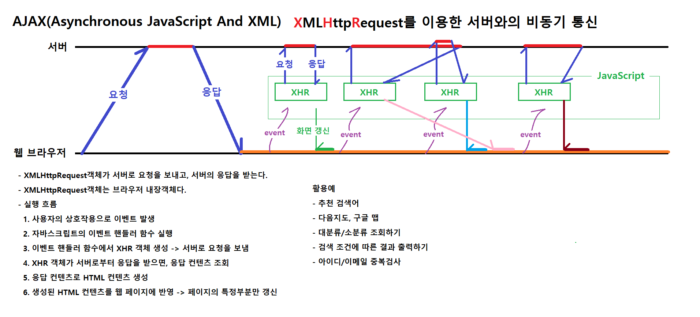

# 0609

- [0609](#0609)
- [AJAX](#ajax)
- [팀프로젝트 회의](#팀프로젝트-회의)
  - [구현기능](#구현기능)
    - [분담](#분담)
  - [작업순서](#작업순서)
  - [추후 작업](#추후-작업)

<small><i><a href='http://ecotrust-canada.github.io/markdown-toc/'>Table of contents generated with markdown-toc</a></i></small>

# AJAX

# 팀프로젝트 회의
* 팀: 김준하, 유도영, 이제원, 정수민, 조명환

* 사이트(참고할 디자인)
  * 마켓컬리, 알라딘
  * 마켓컬리의 디자인 및 포맷으로 알라딘 API를 사용한 서점 앱.
    * 알라딘 API
      > https://blog.aladin.co.kr/openapi/category/29154402?communitytype=mypaper

## 구현기능
1. 상품목록게시판 (필요에 따라 내용 조절)
   1. 전체 도서 카테고리
   2. 신간도서
   3. 베스트도서
   4. 할인도서
2. 검색 (전체검색, 상세검색)
3. 장바구니
4. 주문
5. 리뷰
6. 마이페이지
7. 로그인/로그아웃/회원가입
8. 고객센터
9. 관리자 서비스
   * 회원관리, 상품관리, 주문관리, 게시글관리
* 추가작업 : 별점, 포인트, 쿠폰, SNS로그인 등

### 분담
1. 메인/검색/상세검색
2. 로그인/화원가입/마이페이지
3. 주문/장바구니/장바구니조회
4. 게시글(리뷰,고객센터)

## 작업순서
1. ERD
2. 기능정리(페이지 스크린샷)
3. 역할분담
4. 클래스 명세
5. 기본 코드
   * jsp, java(vo, dao, util)
   * DB 구축(오픈 API를 이용한 데이터 저장(엑셀>임포트))
6. 세부 코드
   * 세부 메소드(기능), DB연결
7. 파일 연결(링크)
8. 추가 기능 구현(선택사항) - 시간이 남을 시

## 추후 작업
1. 사이트의 디자인에 맞는 기능 개발 리스트
2. ERD
3. 페이지별 기능 분석