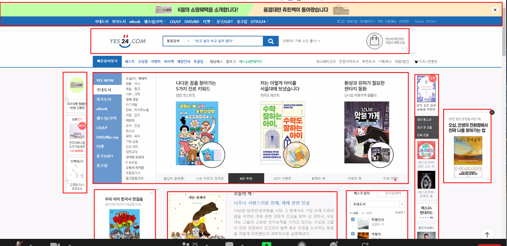
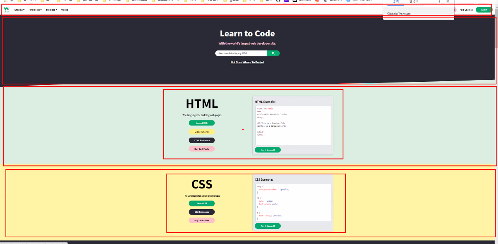
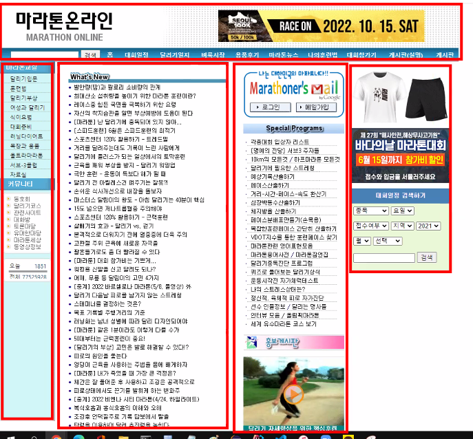

# 0610

- [0610](#0610)
- [board-app](#board-app)
  - [제목으로 검색하기](#제목으로-검색하기)
    - [게시판 클릭](#게시판-클릭)
    - [페이지번호 클릭](#페이지번호-클릭)
    - [오른쪽 상단의 출력 개수 변경](#오른쪽-상단의-출력-개수-변경)
    - [검색 버튼](#검색-버튼)
- [부트스트랩](#부트스트랩)
  - [그리드 시스템](#그리드-시스템)
    - [컨테이너](#컨테이너)
    - [그리드 시스템](#그리드-시스템-1)
    - [간격](#간격)
- [데이터 임포트 - DB](#데이터-임포트---db)
- [팀프로젝트 회의-2](#팀프로젝트-회의-2)

<small><i><a href='http://ecotrust-canada.github.io/markdown-toc/'>Table of contents generated with markdown-toc</a></i></small>

# board-app
## 제목으로 검색하기
* 검색한 단어에 맞는 내용들이 나열되게 하기. 
* 검색된 개수에 맞게 페이지버튼 바뀌기.
* 페이지번호를 바꿧을때
  * 출력개수에 맞는 페이지 검색결과 보여주기
  * 검색어에 맞는 검색결과 보여주기
* 필요한 정보를 한번에 폼에 넣어주는 것이 중요하다.
* 폼에 넣는것
  1. 페이지개수
  2. 페이지번호
  3. keyword
* pagination에 몇개씩 보여줄지 조절하는 생성자를 이용한다.
  * `public Pagination(int rows, int totalRows, int currentPage) {}`
### 게시판 클릭
* 게시판 클릭
* `board-app/list.jsp?page=1`
  * page: 1           -> 1
  * rows: null        -> 5
  * keyword: null     -> null

### 페이지번호 클릭
* 3번 페이지 클릭
* `board-app/list.jsp?page=3`
  * page: 3           -> 3
  * rows: null        -> 5
  * keyword: null     -> null

### 오른쪽 상단의 출력 개수 변경
* 출력 개수(10개씩 보이기)
* `board-app/list.jsp?rows=10`
  * page: null        -> 1
  * rows: 10          -> 10
  * keyword: null     -> null

### 검색 버튼
* 검색창에 '삼성전자' 검색
* `board-app/list.jsp?keyword=삼성전자`
  * page: null        -> 1
  * rows: null        -> 10
  * keyword: 삼성전자  -> 삼성전자


# 부트스트랩
bootstrap
> https://getbootstrap.kr/
## 그리드 시스템
> https://getbootstrap.kr/docs/5.1/layout/grid/
* 화면의 레이아웃을 그리드 시스템을 이용해 구성한다.
  * 예시)
    1. 
    2. 
    3. 

### 컨테이너
> https://getbootstrap.kr/docs/5.1/layout/containers/
* 부트스트랩의 가장 기본적인 레이아웃 요소다.
* 웹페이지의 내용을 포함하며, 내용을 가운데 정렬한다.
* 컨테이너는 다른 컨테이너를 포함할 수 있지만, 대부분의 웹 페이지에서 다른 컨테이너를 포함해야 하는 상황은 거의 없다.
  ```jsp
  <body>
    <div class="container">   // 각 반응형 중단점에의 크기가 컨테이너의 너비가 변경된다.
      내용(제목, 죄측메뉴, 우측배너, 중앙컨텐츠)
    </div>
  </body>
  <body>
    <div class="container">   // 항상 너비는 100%다.
      내용
    </div>
  </body>
  ```
* 중단점
  * 내가 사용하는 디바이스의 크기에 따라서 컨테이너의 너비가 자동으로 변경된다.
  > https://getbootstrap.kr/docs/5.1/layout/breakpoints/

### 그리드 시스템
* 부트스트랩의 그리드는 12개의 열을 사용해서 다양한 모양과 크기의 레이아웃을 구성할 수 있게 한다.
* 그리드 시스템은 컨테이너 내부에서 정의한다.
* 그리드 시스템에서 행은 열을 감싼다.
  ```jsp
  <div class="row">
    <div class="col-6">컨텐츠</div>
    <div class="col-3">컨텐츠</div>
    <div class="col-3">컨텐츠</div>
  </div>
  ```
* 그리드시스템에서 행당 12개의 열을 가진다.
* 하나의 행 안에서 12개의 열의 길이를 적절하게 조절해서 다양한 크기의 열을 구성할 수 있다.
  * 각 열의 너비가 동일한 너비일 때는 크기를 지정하지 않아도 된다.
  ```jsp
  <div class="row">
    <div class="col-6">컨텐츠</div>
    <div class="col-3">컨텐츠</div>
    <div class="col-3">컨텐츠</div>
  </div>
  ```
* 하나의 행이 12개 이상의 열을 포함하고 있는 경우 13번째 부터 새로운 행이 시작도니다.
  ```jsp
  <div class="row">
    <div class="col-3">컨텐츠</div>
    <div class="col-3">컨텐츠</div>
    <div class="col-3">컨텐츠</div>
    <div class="col-3">컨텐츠</div>
    <div class="col-3">컨텐츠</div>
    <div class="col-3">컨텐츠</div>
    <div class="col-3">컨텐츠</div>
    <div class="col-3">컨텐츠</div>
    <div class="col-3">컨텐츠</div>
    <div class="col-3">컨텐츠</div>
    <div class="col-3">컨텐츠</div>
    <div class="col-3">컨텐츠</div>
  </div>
  ```

### 간격
> https://getbootstrap.kr/docs/5.1/utilities/spacing/
* 현실적으로 p5 이상의 간격은 거의 사용하지 않으므로 p1~p5까지 사용할 수 있다.

# 데이터 임포트 - DB
* 오픈 API에서 받은 데이터를 엑셀로 저장한 뒤 테이블에서 '데이터 임포트 마법사'를 이용해 데이터를 저장할 수 있다. 

# 팀프로젝트 회의-2
* 팀: 김준하, 유도영, 이제원, 정수민, 조명환