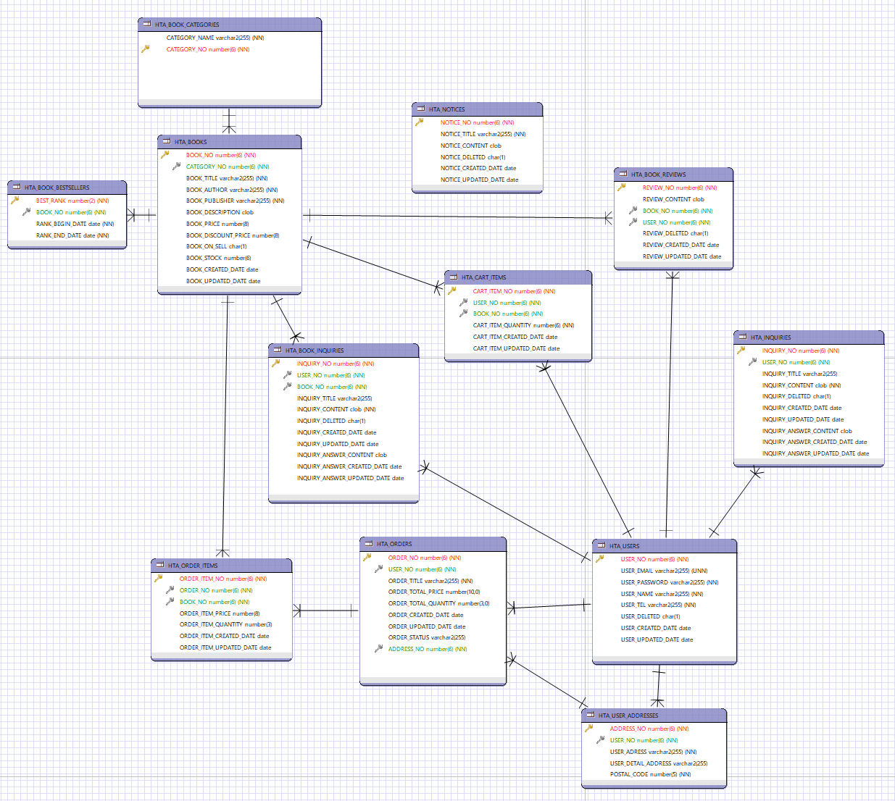
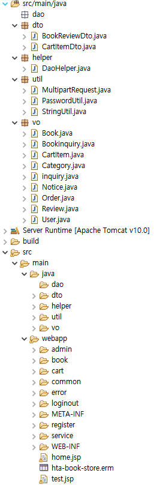

# 0614

- [0614](#0614)
- [git](#git)
	- [프로젝트 회의 (3차)](#프로젝트-회의-3차)
	- [Eclipse](#eclipse)
		- [ERMaster](#ermaster)
		- [Project에 필요한 폴더와 파일들을 생성한다.](#project에-필요한-폴더와-파일들을-생성한다)
	- [알라딘 API 활용하기](#알라딘-api-활용하기)
	- [알라딘 API](#알라딘-api)
	- [DB관련 작업](#db관련-작업)
		- [DB 테이블 생성](#db-테이블-생성)
		- [DB Categories 데이터 INSERT](#db-categories-데이터-insert)
		- [DB 데이터 저장](#db-데이터-저장)
	- [추가 작업리스트](#추가-작업리스트)

<small><i><a href='http://ecotrust-canada.github.io/markdown-toc/'>Table of contents generated with markdown-toc</a></i></small>

# git
## 프로젝트 회의 (3차)
* ERD 추가 수정 
* DB관련 작업
  * 테이블 생성, 기본적인 데이터 추가(Categories, Books, Users)
* 알라딘 API로 xml데이터 사용해보기
  * TTB

## Eclipse
### ERMaster
* 
* ERMatser를 export해서 DDL로 변환한뒤 SQLD에서 확인후 테이블들을 생성할 수 있다.
### Project에 필요한 폴더와 파일들을 생성한다.
* 

## 알라딘 API 활용하기
* > [API STORE - 알라딘API](https://www.apistore.co.kr/generalApi/generalApiView.do?general_service_seq=72)

* > [알라딘 OpenAPI](https://blog.aladin.co.kr/openapi/category/29154402?communitytype=mypaper)

* > [알라딘 Open API 매뉴얼](https://docs.google.com/document/d/1mX-WxuoGs8Hy-QalhHcvuV17n50uGI2Sg_GHofgiePE/edit)

## 알라딘 API
* open api는 검색api, 상품 api, 상품 리스트 api로 나뉜다.
* xml, json 형식으로 받을 수 있다.
* 분류 ID값을 활용해 검색할 수 있다.
* 요청방법
```
http://www.aladin.co.kr/ttb/api/ItemList.aspx?ttbkey=TTBKey&QueryType=ItemNewAll&MaxResults=10&start=1&SearchTarget=Book&output=xml&Version=20131101
```
  * QueryType, MaxResults, SearchTarget 과 같은 파라미터를 [알라딘 Open API 매뉴얼](https://docs.google.com/document/d/1mX-WxuoGs8Hy-QalhHcvuV17n50uGI2Sg_GHofgiePE/edit)에서 확인하고 [카테고리 아이디](https://image.aladin.co.kr/img/files/aladin_Category_CID_20210927.xls)를 확인해서 사용할 수 다양한 방법으로 원하는 데이터를 검색할 수 있다.
* 검색한 API 데이터를 Excel에서 정리하여 저장하는 방법을 추가적으로 확인해야 한다.
  * Excel에서 정리한 데이터를 DB에 저장한다.

## DB관련 작업
* 이클립스의 ERMaster를 변환하여 DDL문을 자동생성한다.
  * 테이블명, 제약조건명이 다를 수 있다.(직접 작성, 확인, 수정.)
* 새로운 SQL Developer 접속 계정을 생성한다.
  ```
  * 이름 : semi
  * 비밀번호 : zxcv1234 (비밀번호 표시 체크)
  * port : 1521
  ```
  * 테스트 후 생성.
* 관리자 계정에서 semi계정에 권한을 부여한다.
  ```sql
  alter session SET "_ORACLE_SCRIPT" = TRUE;

  create user semi identified by zxcv1234;

  -- semi 사용자에게 connect, resource, dba 롤을 부여함 
  -- connect 데이터베이스에 접속할 수 있는 권한을 포함하고 있는 롤 
  -- resource 데이터베이스의 자원을 사용할 수있는 권한, 데이터베이스 객체를 생성/삭제/변경할 수ㅇ 있는 권한을 포함하고 있는 롤 
  -- dba 데이터베이스 관리자 권한을 포함하고 있는 롤
  grant connect, resource, dba to semi;
  ```

### DB 테이블 생성
```sql
/* Create Tables */

CREATE TABLE HTA_BOOK_BESTSELLERS
(
	BEST_RANK number(2) NOT NULL,
	BOOK_NO number(6) NOT NULL,
	RANK_BEGIN_DATE date NOT NULL,
	RANK_END_DATE date NOT NULL,
	PRIMARY KEY (BEST_RANK)
);


CREATE TABLE HTA_BOOK_CATEGORIES
(
	CATEGORY_NAME varchar2(255) NOT NULL,
	CATEGORY_NO number(6) NOT NULL,
	PRIMARY KEY (CATEGORY_NO)
);


CREATE TABLE HTA_BOOK_INQUIRIES
(
	INQUIRY_NO number(6) NOT NULL,
	USER_NO number(6) NOT NULL,
	BOOK_NO number(6) NOT NULL,
	INQUIRY_TITLE varchar2(255),
	INQUIRY_CONTENT clob NOT NULL,
	INQUIRY_DELETED char(1) DEFAULT 'N',
	INQUIRY_CREATED_DATE date DEFAULT SYSDATE,
	INQUIRY_UPDATED_DATE date,
	INQUIRY_ANSWER_CONTENT clob,
	INQUIRY_ANSWER_CREATED_DATE date DEFAULT SYSDATE,
	INQUIRY_ANSWER_UPDATED_DATE date DEFAULT SYSDATE,
	PRIMARY KEY (INQUIRY_NO)
);


CREATE TABLE HTA_INQUIRIES
(
	INQUIRY_NO number(6) NOT NULL,
	USER_NO number(6) NOT NULL,
	INQUIRY_TITLE varchar2(255),
	INQUIRY_CONTENT clob NOT NULL,
	INQUIRY_DELETED char(1) DEFAULT 'N',
	INQUIRY_CREATED_DATE date DEFAULT SYSDATE,
	INQUIRY_UPDATED_DATE date,
	INQUIRY_ANSWER_CONTENT clob,
	INQUIRY_ANSWER_CREATED_DATE date DEFAULT SYSDATE,
	INQUIRY_ANSWER_UPDATED_DATE date DEFAULT SYSDATE,
	PRIMARY KEY (INQUIRY_NO)
);


CREATE TABLE HTA_NOTICES
(
	NOTICE_NO number(6) NOT NULL,
	NOTICE_TITLE varchar2(255) NOT NULL,
	NOTICE_CONTENT clob,
	NOTICE_DELETED char(1) DEFAULT 'N',
	NOTICE_CREATED_DATE date DEFAULT SYSDATE,
	NOTICE_UPDATED_DATE date DEFAULT SYSDATE,
	PRIMARY KEY (NOTICE_NO)
);


CREATE TABLE HTA_USER_ADDRESSES
(
	ADDRESS_NO number(6) NOT NULL,
	USER_NO number(6) NOT NULL,
	USER_ADRESS varchar2(255) NOT NULL,
	USER_DETAIL_ADDRESS varchar2(255),
	POSTAL_CODE number(5) NOT NULL,
	PRIMARY KEY (ADDRESS_NO)
);


CREATE TABLE HTA_BOOKS
(
	BOOK_NO number(6) NOT NULL,
	CATEGORY_NO number(6) NOT NULL,
	BOOK_TITLE varchar2(255) NOT NULL,
	BOOK_AUTHOR varchar2(255) NOT NULL,
	BOOK_PUBLISHER varchar2(255) NOT NULL,
	BOOK_DESCRIPTION clob,
	BOOK_PRICE number(8),
	BOOK_DISCOUNT_PRICE number(8),
	BOOK_ON_SELL char(1) DEFAULT 'Y',
	BOOK_STOCK number(6),
	BOOK_CREATED_DATE date DEFAULT SYSDATE,
	BOOK_UPDATED_DATE date,
	BOOK_DELETED char(1) DEFAULT 'N',
	CONSTRAINT HTA_BOOKS_NO_PK PRIMARY KEY (BOOK_NO)
);


CREATE TABLE HTA_BOOK_REVIEWS
(
	REVIEW_NO number(6) NOT NULL,
	REVIEW_CONTENT clob,
	BOOK_NO number(6) NOT NULL,
	USER_NO number(6) NOT NULL,
	REVIEW_DELETED char(1) DEFAULT 'N',
	REVIEW_CREATED_DATE date DEFAULT SYSDATE,
	REVIEW_UPDATED_DATE date,
	CONSTRAINT HTA_REVIEWS_NO_PK PRIMARY KEY (REVIEW_NO)
);


CREATE TABLE HTA_CART_ITEMS
(
	CART_ITEM_NO number(6) NOT NULL,
	USER_NO number(6) NOT NULL,
	BOOK_NO number(6) NOT NULL,
	CART_ITEM_QUANTITY number(6) NOT NULL,
	CART_ITEM_CREATED_DATE date DEFAULT SYSDATE,
	CART_ITEM_UPDATED_DATE date,
	CONSTRAINT HTA_CART_ITEM_NO_PK PRIMARY KEY (CART_ITEM_NO)
);


CREATE TABLE HTA_ORDERS
(
	ORDER_NO number(6) NOT NULL,
	USER_NO number(6) NOT NULL,
	ORDER_TITLE varchar2(255) NOT NULL,
	ORDER_TOTAL_PRICE number(10,0),
	ORDER_TOTAL_QUANTITY number(3,0),
	ORDER_CREATED_DATE date DEFAULT SYSDATE,
	ORDER_UPDATED_DATE date,
	ORDER_STATUS varchar2(255) DEFAULT '결재완료',
	ADDRESS_NO number(6) NOT NULL,
	CONSTRAINT HTA_ORDERS_NO_PK PRIMARY KEY (ORDER_NO)
);


CREATE TABLE HTA_ORDER_ITEMS
(
	ORDER_ITEM_NO number(6) NOT NULL,
	ORDER_NO number(6) NOT NULL,
	BOOK_NO number(6) NOT NULL,
	ORDER_ITEM_PRICE number(8),
	ORDER_ITEM_QUANTITY number(3),
	ORDER_ITEM_CREATED_DATE date DEFAULT SYSDATE,
	ORDER_ITEM_UPDATED_DATE date,
	CONSTRAINT HTA_ORDER_ITEMS_NO_PK PRIMARY KEY (ORDER_ITEM_NO)
);


CREATE TABLE HTA_USERS
(
	USER_NO number(6) NOT NULL,
	USER_EMAIL varchar2(255) NOT NULL UNIQUE,
	USER_PASSWORD varchar2(255) NOT NULL,
	USER_NAME varchar2(255) NOT NULL,
	USER_TEL varchar2(255) NOT NULL,
	USER_DELETED char(1) DEFAULT 'N',
	USER_CREATED_DATE date DEFAULT SYSDATE,
	USER_UPDATED_DATE date,
	CONSTRAINT HTA_USER_NO_PK PRIMARY KEY (USER_NO)
);


/* Create Foreign Keys */

ALTER TABLE HTA_BOOKS
	ADD FOREIGN KEY (CATEGORY_NO)
	REFERENCES HTA_BOOK_CATEGORIES (CATEGORY_NO)
;


ALTER TABLE HTA_ORDERS
	ADD FOREIGN KEY (ADDRESS_NO)
	REFERENCES HTA_USER_ADDRESSES (ADDRESS_NO)
;


ALTER TABLE HTA_BOOK_BESTSELLERS
	ADD FOREIGN KEY (BOOK_NO)
	REFERENCES HTA_BOOKS (BOOK_NO)
;


ALTER TABLE HTA_BOOK_INQUIRIES
	ADD FOREIGN KEY (BOOK_NO)
	REFERENCES HTA_BOOKS (BOOK_NO)
;


ALTER TABLE HTA_BOOK_REVIEWS
	ADD CONSTRAINT HTA_REVIEW_BOOK_NO_FK FOREIGN KEY (BOOK_NO)
	REFERENCES HTA_BOOKS (BOOK_NO)
;


ALTER TABLE HTA_CART_ITEMS
	ADD CONSTRAINT HTA_CARTITEM_BOOK_NO_FK FOREIGN KEY (BOOK_NO)
	REFERENCES HTA_BOOKS (BOOK_NO)
;


ALTER TABLE HTA_ORDER_ITEMS
	ADD CONSTRAINT HTA_ORDERITEM_BOOK_NO_FK FOREIGN KEY (BOOK_NO)
	REFERENCES HTA_BOOKS (BOOK_NO)
;


ALTER TABLE HTA_ORDER_ITEMS
	ADD CONSTRAINT HTA_ORDERITEM_ORDER_NO_FK FOREIGN KEY (ORDER_NO)
	REFERENCES HTA_ORDERS (ORDER_NO)
;


ALTER TABLE HTA_BOOK_INQUIRIES
	ADD FOREIGN KEY (USER_NO)
	REFERENCES HTA_USERS (USER_NO)
;


ALTER TABLE HTA_INQUIRIES
	ADD FOREIGN KEY (USER_NO)
	REFERENCES HTA_USERS (USER_NO)
;


ALTER TABLE HTA_USER_ADDRESSES
	ADD FOREIGN KEY (USER_NO)
	REFERENCES HTA_USERS (USER_NO)
;


ALTER TABLE HTA_BOOK_REVIEWS
	ADD CONSTRAINT HTA_REVIEW_USER_NO_FK FOREIGN KEY (USER_NO)
	REFERENCES HTA_USERS (USER_NO)
;


ALTER TABLE HTA_CART_ITEMS
	ADD CONSTRAINT HTA_CARTITEM_USER_NO_FK FOREIGN KEY (USER_NO)
	REFERENCES HTA_USERS (USER_NO)
;


ALTER TABLE HTA_ORDERS
	ADD CONSTRAINT HTA_ORDER_USER_NO_FK FOREIGN KEY (USER_NO)
	REFERENCES HTA_USERS (USER_NO)
;
```

### DB Categories 데이터 INSERT
HTA_BOOK_CATEGORIES 테이블 INSERT문
```sql
INSERT INTO HTA_BOOK_CATEGORIES(CATEGORY_NAME, CATEGORY_NO)
VALUES ('인문학', 656);

INSERT INTO HTA_BOOK_CATEGORIES(CATEGORY_NAME, CATEGORY_NO)
VALUES ('사회과학', 798);

INSERT INTO HTA_BOOK_CATEGORIES(CATEGORY_NAME, CATEGORY_NO)
VALUES ('소설', 1);

INSERT INTO HTA_BOOK_CATEGORIES(CATEGORY_NAME, CATEGORY_NO)
VALUES ('역사', 74);

INSERT INTO HTA_BOOK_CATEGORIES(CATEGORY_NAME, CATEGORY_NO)
VALUES ('예술/대중문화', 38402);
```

### DB 데이터 저장
* Categories, Books, Users 테이블에 기본 데이터 저장
* Categories
  * 인문학
  * 사회과학
  * 소설
  * 역사
  * 예술/대중문화
* Books (역할분담)
  * > [알라딘 API 도서리스트 검색 예시](https://www.aladin.co.kr/ttb/api/ItemList.aspx?ttbkey=ttbqufstar71658001&QueryType=bestseller&MaxResults=5&start=1&CategoryId=1&output=xml&Version=20131101)  
      * RSS reader가 없으면 xml 파일을 브라우저에서 읽어올 수 없다.
      * 크롬이 안되면 firefox나 explorer를 사용한다.
      * Network : Connection > Settings에서 연결 설정을 확인한다.
  * 인문학 - 도영
  * 사회과학 - 준하
  * 소설 - 제원
  * 역사 - 명환
  * 예술/대중문화 - 수민
* Users
  * 기본적인 유저 데이터 입력, 저장.

## 추가 작업리스트
1. 알라딘 API로 검색한 xml데이터 엑셀에서 열고 DB에 저장하기.
2. 깃허브로 협업과정 배우기.
3. home.jsp, nav.jsp, footer.jsp 작성.