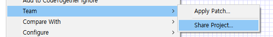
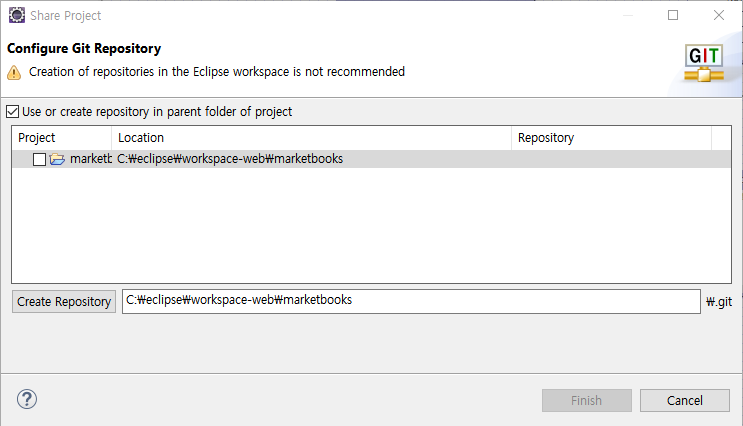
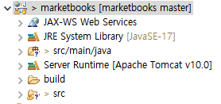
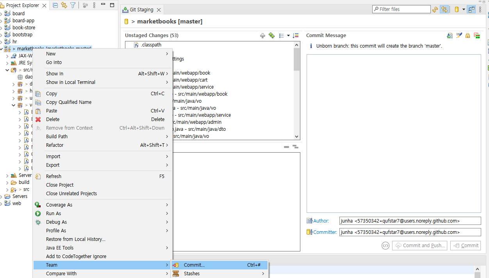
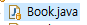
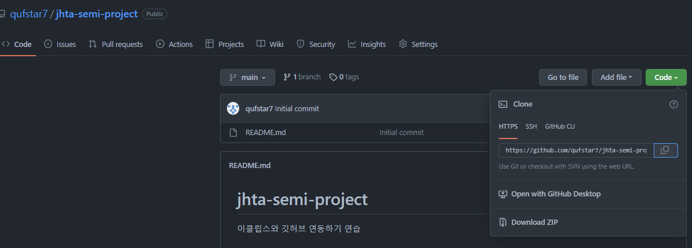
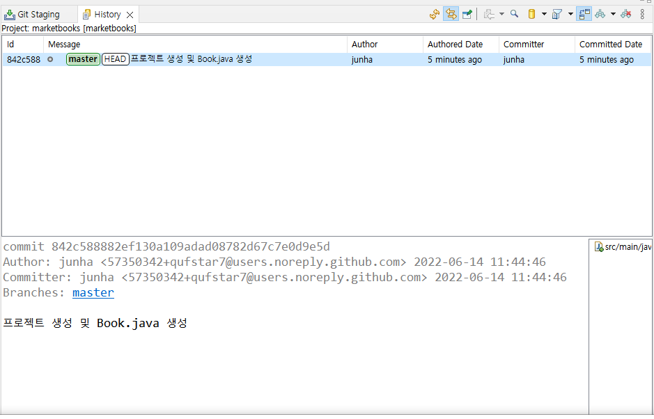
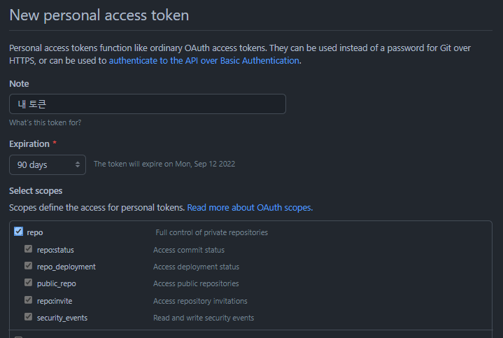
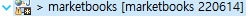

# 0614

- [0614](#0614)
- [git](#git)
	- [프로젝트 회의 (3차)](#프로젝트-회의-3차)
	- [Eclipse](#eclipse)
		- [ERMaster](#ermaster)
		- [Project에 필요한 폴더와 파일들을 생성한다.](#project에-필요한-폴더와-파일들을-생성한다)
	- [알라딘 API 활용하기](#알라딘-api-활용하기)
	- [알라딘 API](#알라딘-api)
	- [DB관련 작업](#db관련-작업)
		- [DB 테이블 생성](#db-테이블-생성)
		- [DB Categories 데이터 INSERT](#db-categories-데이터-insert)
		- [DB 데이터 저장](#db-데이터-저장)
	- [추가 작업리스트](#추가-작업리스트)

<small><i><a href='http://ecotrust-canada.github.io/markdown-toc/'>Table of contents generated with markdown-toc</a></i></small>


# 버전관리 시스템
* 중앙집중형 vs 분산형
1. 중앙집중형
   * 하나의 저장소에 저장하여 관리한다.
   * commit, update
2. 분산형 
   * 각 개발자의 컴퓨터마다 로컬저장소가 있다.
   * commit, push, pull, fetch

## git
* 분산형 버전관리 시스템중 가장 대표적인 것
  * 리누스 토르발스가 3일만에 만들었다고 한다. 
  * 첫번째 커밋은 리눅스 운영체제라고 한다.
* 특징
  * 개발자의 컴퓨터마다 로컬저장소가 존재하기 때문에 원격저장소가 없어져도 데이터 손실의 위험이 적다.
  * 개발자는 각 commit마다 로컬 저장소에 소스코드 변경이력을 저장한다.
  * 개발자는 push/pull 명령어를 실행해 원격저장소에 저장시키거나 로컬저장소로 내려받는다.
* 서브버전과의 비교
  * 서브버전(SVN)의 경우 파일단위로 커밋하기 때문에 충돌시 더 대처가 쉽다. 현업에서 더 편리할 수 있다.
  * 깃의 경우 인원규모가 작은 경우 더 편리할 수 있다.
* 대표적인 원격저장소 서비스 사이트 : github

### github
* git 원격저장소 서비스를 제공해주는 대표적인 사이트
* 원래 git이라는 기술은 원격저장소를 하나 정해서 마련한 다음 개발자들이 이용하는 방식이었으나, github를 이용하면 무료로 안전한 원격저장소 서비스를 이용할 수 있다.

### git 다운로드

### Eclipse에서 git사용하기
#### Team
1. project > Team > share project
   * 
2. confugure Git Repository, Create Repository
   * Use or create repository in parent folder project 체크
   * 
3. create > finish

* 결과 : 프로젝트 이름과 모양이 조금 달라진다.
  * 

#### 폴더 관련
1. 프로젝트 경로에서 '숨겨진 파일보기'설정
   * .git폴더가 보여진다.
      * 리눅스같은 운영체제에서 .을 파일이나 폴더앞에 붙이면 '숨김'처리가 된다.
      * 즉 열어볼 필요가 없는 파일. 
2. .gitignore
   * 버전관리 대상에서 제외시킬 폴더나 파일을 설정할 수 있다.
   * /build/ 라는 기본값이 적혀있다. (build에 저장되는 모든 소스는 저장되지 않는다.)
   * [gitignore.io](https://www.toptal.com/developers/gitignore/) 사이트에서 언어나 프로그램에 관련하여 .gitignore 파일을 생성할 수 있다.
#### 이클립스 관련
* `>` 꺽쇠의 의미(파일 또는 폴더 앞에) : untracked file : git에서 추적하지 않은 파일.
   * 즉 저장하지 않은
1. team > commit > Git Staging tab열기
   * 
   * staging은 커밋 전에 커밋할 파일을 스테이지에 올려놓는 것과 같다.
2. 커밋
   * 커밋하면 아이콘에 노란색 저장소 이미지가 보인다.(커밋되었다는 뜻)
   * 
3. team > history에서 커밋 히스토리를 확인할 수 있다.
#### github, cmd 관련
1. new repository
2. github 주소확인
   * 
3. cmd에서 원격 저장소 연결
    ```
	C:\eclipse\workspace-web\marketbooks>git remote add origin https://github.com/qufstar7/jhta-semi-project.git	  
	```
* .git을 뒤에 붙인다.
* github 연동 확인
 	  * 
4. 원격저장소(깃헙)와 이클립스간의 push, pull, fatch가 이제 가능하다. 	 

#### 토큰
* 깃헙에서 토큰 생성
1. https://github.com/settings/tokens 접속 (로그인)
2. generate new token 클릭
	* 
4. generate token 클릭
* 이 토큰을 이클립스의 push confirmation에서 로그인할 때 비밀번호로 사용한다.(아이디는 깃헙 아이디: qufstar7)

#### Branch
* 가지. 
* master: 가장 기본이 되는 branch
* 최근 인종차별 논란으로 main 으로 대체되었다. eclipse 기본설정값은 아직 master로 되어 있다.

1. 가지만들기
	* switch to branch > new branch > name (220614 // 날짜와 이름으로 이름짓기)
		* 
		* 이제 master branch가 아닌 220614 branch에 저장된다.
			* '6-14-junha'와 같은 양식으로 변경하였다.(M-DD-영어이름)
		* 이렇게 branch들에서 작업한 내용은 master에 바로 저장되지 않는다.
		* 협업개발자 한 명당 하나의 브랜치를 사용한다.
		* master에 절대 바로 직접적으로 커밋하지 않는다.(풀리퀘스트와 머지작업을 거쳐 컨펌받는다.)
#### pull request
* master 가 아닌 branch가 커밋되면 pull request를 할 수 있다.
* pull request 메세지를 작성하여 자신의 작업사항을 알린다.
* merge pull request를 누르고 confirm merge 버튼을 누르면 master 브랜치에 적용된다.(작업이 끝나고)

#### eclipse의 마스터 작업 관련(pull)
* 원격저장소 master를 가져온다.(다른 가지들의 내용이 merge된 후) (작업을 시작하기 전)
* team > pull
* pull이 끝나면 꼭 다시 브랜치를 바꿔준다.
* master상태로 작업하면 안된다.

#### 충돌(conflict) 상황
* 동시에 여러 명이 같은 파일을 작업하고 푸쉬하면 충돌이 발생한다.
* 대부분 깃허브에서 교통정리를 해주고(충돌이 발생했음을 알려주고 대안을 알려준다.) 
* 풀 > 머지를 통해 해결한다.

#### 스냅샷
* 깃은 파일단위가 아니라 스냅샷이라는 단위로 저장을 한다.
* 따라서 충돌이 자주 일어 날 수 있다.
