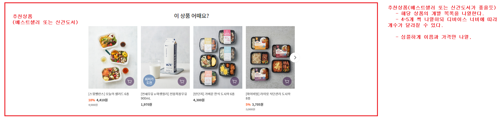
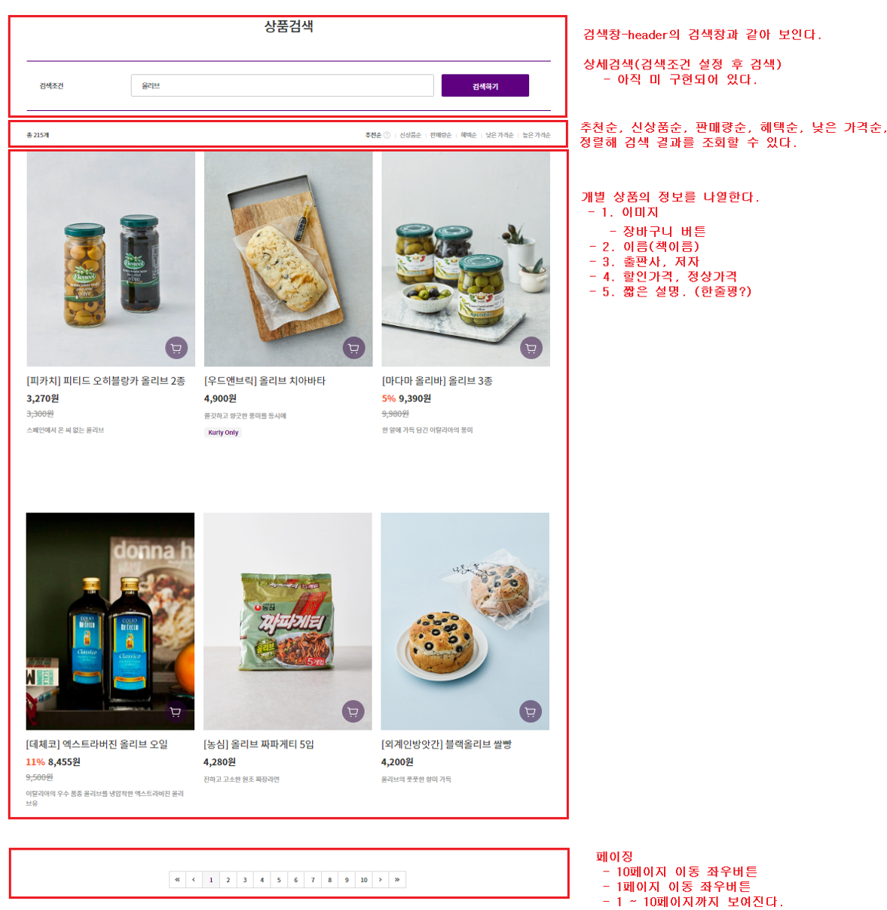

# 0616

# 세미프로젝트
* 프로젝트명: marketbooks
* 프로젝트설명: 마켓컬리의 디자인으로 알라딘 api를 사용한 서점앱
* 협업 도구: githup-eclipse연동 후 사용
* 헙업 룰
  * 작업전(매일 아침) 개인 branch (날짜-이름)로 변경 후 작업한다.
  * 작업전 현재까지의 master브랜치를 pull한다.
  * commit 단위 - 구현한 기능 단위
  * 모든 작업 후 push한다.

## 검색기능 구현하기
1. 홈페이지 베스트셀러(상품리스트 조회 및 출력)
   * 
   * main.jsp
   * 4개씩 원하는 개수만큼 상품정보 조회 및 출력
   * DB
     * books 테이블에서 title, discount_price, price, author 조회
2. 카테고리 및 검색 후 상품리스트 조회 및 출력
   * 
   * list.jsp
   * 4줄씩 페이징 처리.
   * DB
     * 파라미터 : 카테고리 no
     * book_categories 테이블에서 카테고리명 조회
     * books에서 필요한 정보 조회
