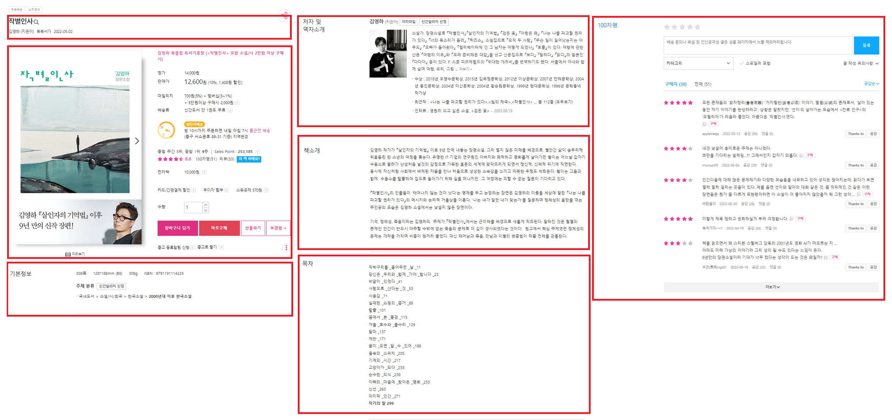

# 0617


# 세미프로젝트
## 협업
1. commit
   * 파일 또는 기능 별로 구분하여 커밋메세지 작성 후 커밋
2. push
   * 커밋목록 확인, 파일 확인 후 커밋
   * .gitignore같은 파일 커밋 x
   * push 하기 전 꼼꼼하게 커밋과 파일들을 확인한다.
3. pull request
   * 작성한 코드에 설명을 작성해 팀원들이 pull 하기전 확인하도록 한다.
   * 팀장 또는 담당자(조장)은 pull request를 확인하고 merge가 필요한 경우 충돌되는 부분을 수정하고 컨펌하여 master에 최종 합병한다.
4. pull
   * master branch를 pull해서 업데이트한다.
   * Cartitem.java, DaoHelper.java, MultipartRequest.java, PasswordUtil.java, StringUtil.java와 같이 커밋하지 않은 파일들(머지의 과정을 거치지 않음)이 mastar 브랜치의 해당 파일들과 충돌해 오류가 발생할 수 있다.
   * 해당 파일들을 삭제하고 pull한다.(중요하지 않을 경우) 중요한 파일일 경우 push의 과정을 통해 merge한다.
* 모든 파일의 수정, 코드 작성은 새로운 브랜치(ex."6-20-junha")에서 작업한다.
* 기능 구현이 끝나면 커밋하고 하루의 작업이 끝나면 push한다.
* push하기 전 꼭 내용들을 여러 번 확인한다.
* pull request를 꼭 작성한다.
* 작업 시작 전 master 브랜치를 pull하고 코드를 확인한 뒤 작업 내용이 겹치지 않도록 한다.
* 브랜치를 바꿀 때는 서버를 끈다.(master 브랜치를 pull하기 전)

## 작업내용
1. 마켓컬리 외부 css파일 참조
   * 크롬개발자도구(f12)-source
2. header.jsp 구조 및 디자인 변경
3. main.jsp 구조 및 카드 영역 변경
   * bootstrap + chrome개발자도구 + css style 지정(style.css)
4. detail.jsp 기본 작업
   * 알라딘 책 상세 페이지 참고
   * >[알라딘 상세 책 페이지 참고 링크](https://www.aladin.co.kr/shop/wproduct.aspx?ItemId=292816855)
   * 
     * 필수적인 요소 - 메인제목, 메인섹터(이미지,상세정보,구매기능 등), 기본정보, 저자 및 역자소개, 책소개, 목자, 리뷰
     * 부가적인 요소 - 이벤트, 관련서적, 추천글, 책속에서, 편집장의 선택, 반품/교환안내 등.

## 톰캣 에러 상황 - several ports (8005,80) required by Tomcat ...
* 에러 코드
    ```
    Several ports (8080, 80) required by Tomcat v10.0 Server at localhost are already in use. The server may already be running in another process, or a system process may be using the port. To start this server you will need to stop the other process or change the port number(s).
    ```
* 원인 : 톰캣이 비정상적으로 종료되면 서버가 제대로 종료되지 않아 생기는 오류.
* 해결 : cmd창에서 명령어를 통해 또는 tomcat폴더에서 shutdown 파일을 실행시켜서 서버를 종료시킨다.
    * `netstat -p tcp -ano`, `taskkill /f /pid 8005` 명령어로 포트에 연결된 모든 pid를 확인하고 오류가 발생한 포트(8080, 80)을 찾아 강제종료시킨다.
      * 
    * tomcat폴더 shutdown파일 위치 : `C:\app\apache-tomcat-10.0.21\bin\shutdown.bat`