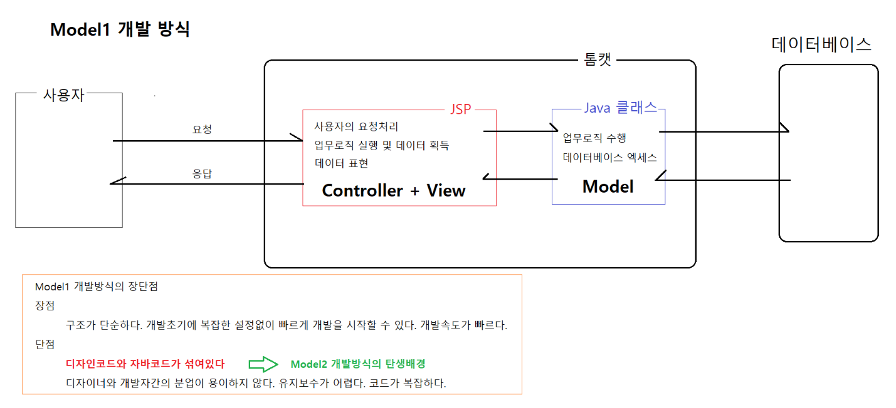
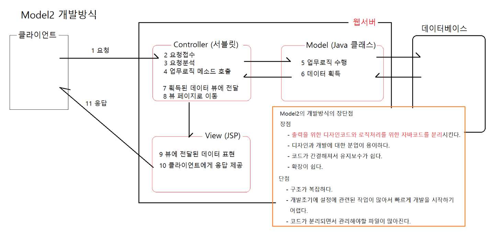
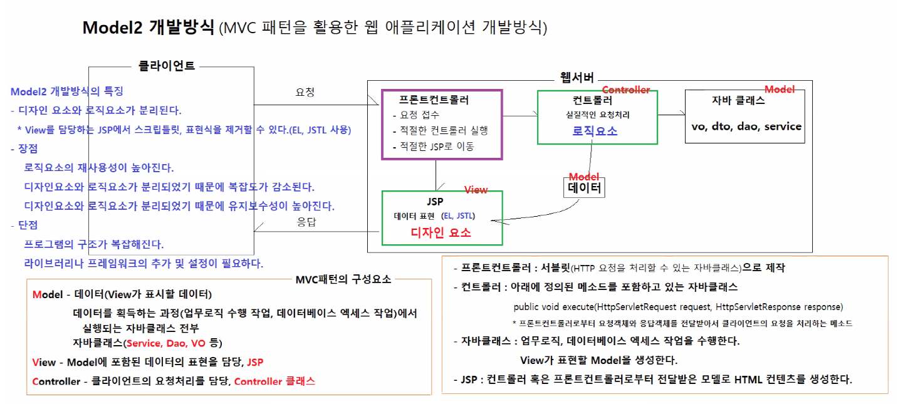
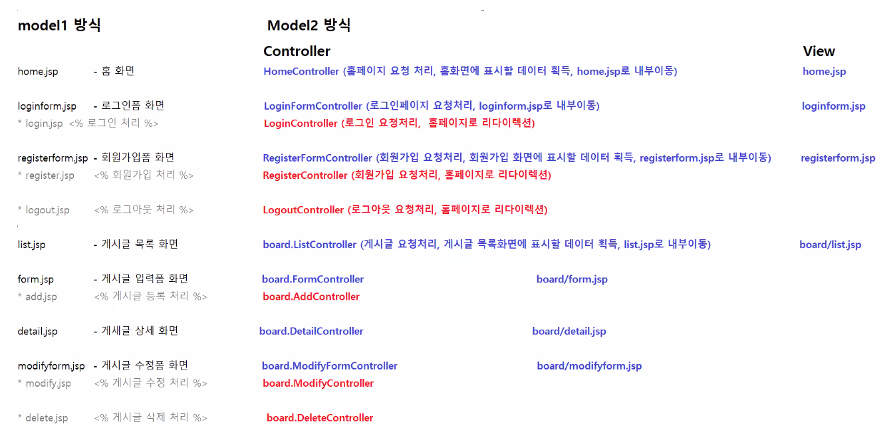

# 0630

- [0630](#0630)
- [모델1과 모델2](#모델1과-모델2)
	- [모델1](#모델1)
	- [모델2](#모델2)
		- [모델2 프론트컨트롤러 방식](#모델2-프론트컨트롤러-방식)
		- [내부이동과 리다이렉션](#내부이동과-리다이렉션)
- [실습](#실습)
	- [FrontController](#frontcontroller)
	- [registerform](#registerform)
		- [코드](#코드)

<small><i><a href='http://ecotrust-canada.github.io/markdown-toc/'>Table of contents generated with markdown-toc</a></i></small>


# 모델1과 모델2
## 모델1

* jsp로만 구현한 웹 애플리케이션
* java코드와 html코드가 같이 있다.
  * 분업이 용이하지 않다.
  * 유지보수가 어렵다.
  * 코드가 복잡하다.
* 세미프로젝트에서 사용했던 방식
## 모델2

* MVC패턴을 적용해서 구현한 웹 애플리케이션
  * Model - View - Controller
    * Controller는 클라이언트와 업무로직 사이를 연결하는 다리 역할
    * jsp(view)에서는 단순히 표현만 한다.(로직x)
* java코드와 디자인코드를 분리하는 것이 목적이다.
  * 분업이 용이
  * 코드가 간결
  * 유지보수가 쉽다.
  * 확장이 쉽다.
  * 구조가 복잡
  * 개발초기 설정 작업이 많아 빠르게 시작하기 어렵다.
  * 코드가 분리되면서 관리해야할 파일이 많다.
1. Controller의 자바가 클라이언트늬 요청을 접수, 분석, 업무로직 메소드 호출
2. Model은 자바의 클래스로 업무로직을 수행하고 데이터를 획득
3. Controller는 Model로부터 획득된 데이터 뷰에 전달하고 뷰 페이지로 이동
4. View는 jsp로 전달받은 데이터를 표현하고 동적으로 만들어진 html코드인 클라이언트 응답을 제공한다.
* 예시: spring의 webMVC

### 모델2 프론트컨트롤러 방식

* 라이브러리에 내장된 프론트컨트롤러를 통해 클라이언트와 통신한다.
* request에 대한 처리는 프론트 컨트롤러가 담당한다.

### 내부이동과 리다이렉션
* 사용자의 요청에 따라 무엇을 사용할지 결정된다.
  * 화면을 제공해야할 경우(HTML 컨텐츠제공)(조회) - 내부이동
  * 로그인, 회원가입, 로그아웃과 같은 요청(변경,삭제,추가) - 리다이렉션

# 실습
model2방식으로 회원가입기능 만들기
* eclipse - dynamic web project - 'model2'
* home.jsp, loginform.jsp, registerform.jsp, form.jsp, detail.jsp, modifyform.jsp 등
* login.jsp(로그인처리), register.jsp(회원가입처리), logout(로그아웃 처리), add(게시글 등록처리), modify(게시글 수정처리), delete(게시글 삭제처리)와 같은 화면을 구성하는 파일이 아닌 기능을 구현한 jsp파일은 Controller(java파일)로 만든다.
* 
  * 파일의 양은 더 많지만, 디자인과 기능의 분리로 관리하기 더 편하다.
  * 라이브러리를 사용하면 더 편리하게 사용할 수 있다.
* DB와 연결
* SQL문 - 테이블 생성
  ```sql
  CREATE TABLE MODEL2_USERS (
      USER_ID VARCHAR2(100) PRIMARY KEY,
      USER_EMAIL VARCHAR2(255) NOT NULL UNIQUE,
      USER_PASSWORD VARCHAR2(20) NOT NULL,
      USER_NAME VARCHAR2(100) NOT NULL,
      USER_TEL VARCHAR2(20) NOT NULL
  );
  ```
* DaoHelper를 이용해서 DB와 연결을 편하게 한다.(Oracle SQL Developer에 일치하는 계정을 연결한다.(semi > hr))

## FrontController
* 프론트 컨트롤러를 직접 만들어 보자.
1. src/main/java/model2/FrontController.java
2. urlPattern을 지정한다.(사이트 url이 지정한 패턴으로 끝난다.)
3. service메소드를 만든다.(자동완성기능 사용)
* 용어설명
  * url: 인터넷에서 자원의 위치(주소)
  * uri: 클라이언트의 요청을 식별하기 위한 특별한 url

* home.jsp 와같은 주소로 접속하지 못하게 외부에서 접근할 수 없는 web-inf 폴더 안으로 jsp 파일들을 옳긴다.(직접적인 접속을 방지)
  * FrontController에서 requestDispatcher 설정
    ```jsp
    RequestDispatcher requestDispatcher = request.getRequestDispatcher("/WEB-INF/views/" + path);
    ```

## registerform
* 회원가입 화면과 기능을 medel2방식으로 연결한다.

### 코드
home.jsp
```jsp
<%@ page language="java" contentType="text/html; charset=UTF-8"
    pageEncoding="UTF-8"%>
<!DOCTYPE html>
<html>
<head>
<meta charset="UTF-8">
<meta name="viewport" content="width=device-width, initial-scale=1">
<title>Bootstrap demo</title>
<link href="https://cdn.jsdelivr.net/npm/bootstrap@5.2.0-beta1/dist/css/bootstrap.min.css" rel="stylesheet">
</head>
<body>
<div class="container">

	<div class="row">
   		<div class="col p-4 bg-light">
   			<h1>Model2 방식으로 개발한 웹애플리케이션입니다.</h1>
   			<P>${message }</P>
   			<a href="loginform.hta">로그인</a> <a href="registerform.hta">회원가입</a>
   		</div>
	</div>
</div>
<script src="https://cdn.jsdelivr.net/npm/bootstrap@5.2.0-beta1/dist/js/bootstrap.bundle.min.js"></script>
</body>
</html>
```

register.jsp
```jsp
<%@ page language="java" contentType="text/html; charset=UTF-8"
    pageEncoding="UTF-8"%>
<!DOCTYPE html>
<html>
<head>
    <meta charset="utf-8">
    <meta name="viewport" content="width=device-width, initial-scale=1">
    <title>Bootstrap demo</title>
    <link href="https://cdn.jsdelivr.net/npm/bootstrap@5.2.0-beta1/dist/css/bootstrap.min.css" rel="stylesheet">
  </head>
<body>
	<div class="container">
		<div class="row">
			<div class="col">
				<h1>회원가입 폼</h1>
			</div>
		</div>
		<div class="row">
			<div class="col">
				<form class="border bg-light p-3" action="register.hta">
					<div class="mb-3">
						<label class="form-label">이메일</label>
						<input type="text" name="email" class="form-control"/>
					</div>
					<div class="mb-3">
						<label class="form-label">비밀번호</label>
						<input type="password" name="password" class="form-control"/>
					</div>
					<div class="mb-3">
						<label class="form-label">이름</label>
						<input type="text" name="name" class="form-control"/>
					</div>
					<div class="mb-3">
						<label class="form-label">전화번호</label>
						<input type="text" name="tel" class="form-control"/>
					</div>
					<div class="text-end">
						<button class="btn btn-primary" type="submit">회원가입</button>
					</div>
				</form>
			</div>
		</div>
	</div>
<script src="https://cdn.jsdelivr.net/npm/bootstrap@5.2.0-beta1/dist/js/bootstrap.bundle.min.js"></script>
</body>
</html>
```

User.java
```java
package com.hta.vo;

public class User {

	private String id;
	private String email;
	private String password;
	private String name;
	private String tel;
	
	public User() {}

	public String getId() {
		return id;
	}

	public void setId(String id) {
		this.id = id;
	}

	public String getEmail() {
		return email;
	}

	public void setEmail(String email) {
		this.email = email;
	}

	public String getPassword() {
		return password;
	}

	public void setPassword(String password) {
		this.password = password;
	}

	public String getName() {
		return name;
	}

	public void setName(String name) {
		this.name = name;
	}

	public String getTel() {
		return tel;
	}

	public void setTel(String tel) {
		this.tel = tel;
	}
	
	
}
```

Controller.java
```java
package model2;

import jakarta.servlet.http.HttpServletRequest;
import jakarta.servlet.http.HttpServletResponse;

/**
 * 모든 Controller를 구현할 메소드가 정의된 인터페이스다.
 * @author HOME
 *
 */
public interface Controller {	

	/**
	 * 클라이언트의 요청을 처리하는 메소드다.
	 * 모든 컨트롤러는 execute(request, response) 메소드를 재정의해서 클라이언트의 요청을 처리해야 한다.
	 * execute(request, response) 메소드가 반환하는 값은 요청을 처리 후 이동할 JSP페이지 경로 혹은 재요청할 URI이다.
	 * @param request 요청 객체
	 * @param response 응답 객체
	 * @return JSP 페이지 경로 혹은 재요청할 URI
	 * @throws Exception
	 */
	String execute(HttpServletRequest request, HttpServletResponse response) throws Exception;
}

```

FrontController.java
```java
package model2;

import java.io.IOException;
import java.util.HashMap;
import java.util.Map;

import com.hta.controller.HomeController;
import com.hta.controller.RegisterController;

import jakarta.servlet.RequestDispatcher;
import jakarta.servlet.ServletException;
import jakarta.servlet.annotation.WebServlet;
import jakarta.servlet.http.HttpServlet;
import jakarta.servlet.http.HttpServletRequest;
import jakarta.servlet.http.HttpServletResponse;

/**
 * 프론트 컨트롤러
 *   - 사용자의 요청을 접수받는다.
 *   - 사용자의 요청을 분석한다.
 *   - 분석결과를 바탕으로 적절한 컨트롤러를 실행한다.
 *   - 컨트롤러가 반환하는 경로를 분석해서 사용자의 요청을 내부이동, 리다이렉션 시킨다.
 * @author home
 *
 */
@WebServlet(urlPatterns = "*.hta")
public class FrontController extends HttpServlet {
	
	Map<String, Controller> controllers = new HashMap<String, Controller>();
	
	public FrontController() {
		// 클래스 형변환이 발생하였음
		// 		- controllers는 Controller 타입의 객체를 value 로 저장한다.
		//		- 따라서, controllers 맵에 등록된 모든 xxxController객체는 Controller객체의 주소값이 참조된다.
		controllers.put("/model2/home.hta", new HomeController());
		controllers.put("/model2/loginform.hta", new ForwardController("loginform.jsp"));
		controllers.put("/model2/login.hta", new HomeController());
		controllers.put("/model2/registerform.hta", new ForwardController("registerform.jsp"));
		controllers.put("/model2/register.hta", new RegisterController());
		controllers.put("/model2/logout.hta", new HomeController());
		controllers.put("/model2/board/list.hta", new HomeController());
		controllers.put("/model2/board/form.hta", new ForwardController("board/form.jsp"));
		controllers.put("/model2/board/add.hta", new HomeController());
		controllers.put("/model2/board/detail.hta", new HomeController());
		controllers.put("/model2/board/delete.hta", new HomeController());
		controllers.put("/model2/board/modifyform.hta", new HomeController());
		controllers.put("/model2/board/modify.hta", new HomeController());
	}
	
	@Override
	protected void service(HttpServletRequest request, HttpServletResponse response) throws ServletException, IOException {
		System.out.println("FrontController의 service(request, response) 실행됨");
		
		// 클라이언트의 요청분석하기
		String uri = request.getRequestURI();
		System.out.println("요청 URI: " + uri);
		
		// 컨트롤러 가져오기
		Controller controller = controllers.get(uri);
		if (controller == null) {
			throw new ServletException("["+uri+"]와 매핑되는 컨트롤러가 존재하지 않습니다.");
		}
		System.out.println("사용하는 컨트롤러: " + controller.getClass().getName());
		
		// 컨트롤러의 execute(request, response) 메소드 실행하기
		try {
			String path = controller.execute(request, response);
			System.out.println("이동할 경로: " + path);
			
			if (path == null || path.isBlank()) {
				throw new ServletException("컨트롤러가 반환하는 경로가 null이거나 비어있습니다.");
			}

			// path는 2 종류가 있다.
			// 		JSP로 내부이동하는 것: home.jsp, board/list.jsp, board/detail.jsp 등
			// 		재요청하는 URL: redirect:home.hta, redirect:list.hta 등
			if (path.startsWith("redirect:")) {
				// 재요청 URL을 응답으로 보낸다.
				path = path.replace("redirect:", "");
				response.sendRedirect(path);
			} else {
				// 지정된 jsp 페이지로 내부이동한다.
				// RequestDispatcher는 지정된 경로로 내부이동시키는 메소드를 제공하는 객체다
				RequestDispatcher requestDispatcher = request.getRequestDispatcher("/WEB-INF/views/" + path);
				requestDispatcher.forward(request, response);				
			}
			
			
		} catch (Exception e) {
			throw new ServletException(e);
		}
	}
}

```

ForwardController.java
```java
package model2;

import jakarta.servlet.http.HttpServletRequest;
import jakarta.servlet.http.HttpServletResponse;

public class ForwardController implements Controller {

	private String path;
	public ForwardController(String path) {
		this.path = path;
	}
	
	@Override
	public String execute(HttpServletRequest request, HttpServletResponse response) throws Exception {
		return path;
	}
}

```

HomeController.java
```java
package com.hta.controller;

import jakarta.servlet.http.HttpServletRequest;
import jakarta.servlet.http.HttpServletResponse;
import model2.Controller;

public class HomeController implements Controller {

	@Override
	public String execute(HttpServletRequest request, HttpServletResponse response) throws Exception {
		System.out.println("HomeController의 execute(request, response)  실행됨");
		
		// home.jsp 에 전달한 데이터를 요청객체에 저장한다.
		request.setAttribute("message", "홈페이지에 오신 것을 환영합니다.");
		
		return "home.jsp";
	}
}

```

RegisterController.java
```java
package com.hta.controller;

import java.util.UUID;

import com.hta.dao.UserDao;
import com.hta.vo.User;

import jakarta.servlet.http.HttpServletRequest;
import jakarta.servlet.http.HttpServletResponse;
import model2.Controller;

public class RegisterController implements Controller {
	
	@Override
	public String execute(HttpServletRequest request, HttpServletResponse response) throws Exception {
		System.out.println("RegisterController의 execute(request, response) 실행됨");
		
		// 회원정보 입력폼에서 입력한 요청파라미터값 조회하기
		String email = request.getParameter("email");
		String password = request.getParameter("password");
		String name = request.getParameter("name");
		String tel = request.getParameter("tel");
		
		// 사용자 아이디 생성
		String id = UUID.randomUUID().toString();
		
		// User객체 생성, 사용자 정보 저장
		User user = new User();
		user.setId(id);
		user.setEmail(email);
		user.setPassword(password);
		user.setName(name);
		user.setTel(tel);

		// UserDao객체 획득, 사용자 정보 데이터베이스에 저장시키기
		UserDao.getInstance().insertUser(user);
		
		// 재요청할 URL을 반환한다.
		return "redirect:home.hta";
	}
}

```


UserDao.java
```java
package com.hta.dao;

import java.sql.SQLException;

import com.hta.vo.User;

import helper.DaoHelper;

public class UserDao {

	private DaoHelper helper = DaoHelper.getInstance();
	
	private static UserDao instance = new UserDao();
	private UserDao() {}
	public static UserDao getInstance() {
		return instance;
	}
	
	public void insertUser(User user) throws SQLException {
		String sql = "insert into model2_users "
				   + "(user_id, user_email, user_password, user_name, user_tel) "
				   + "values(?,?,?,?,?)";
		
		helper.insert(sql, user.getId(), user.getEmail(), user.getPassword(), user.getName(), user.getTel());
	}
}

```