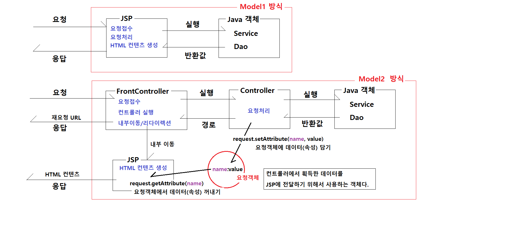
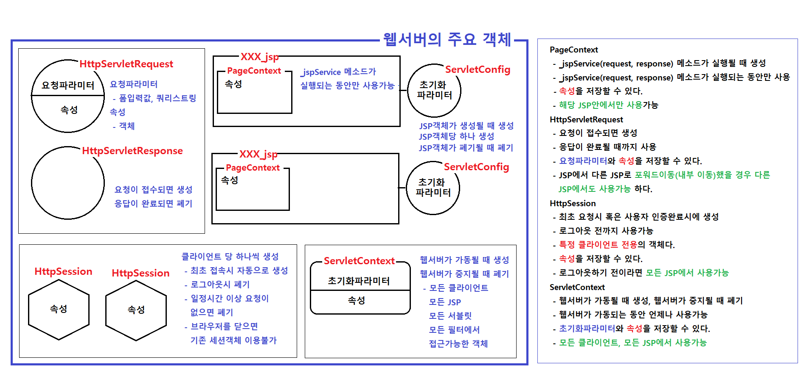
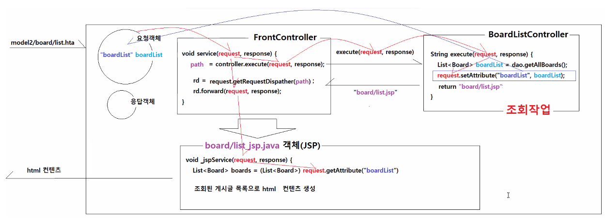
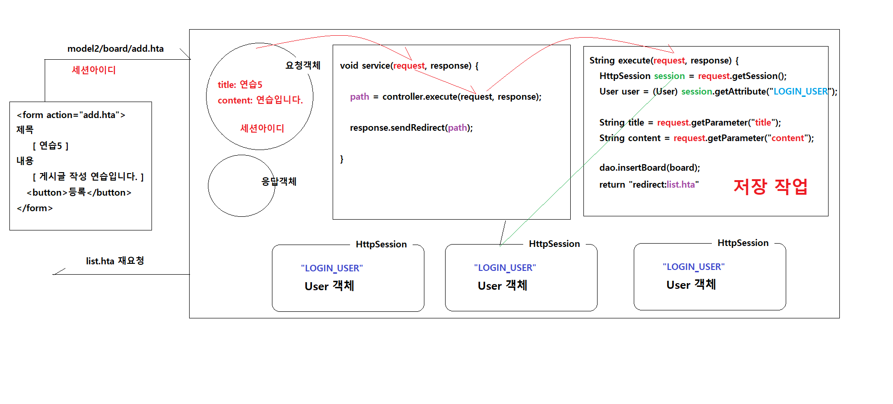
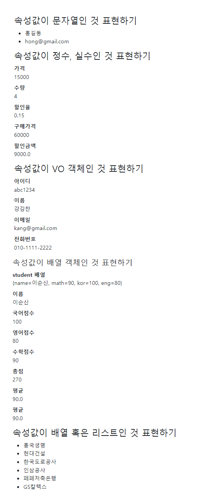

# 0630

- [0630](#0630)
- [모델2 실습](#모델2-실습)
	- [로그인, 로그아웃](#로그인-로그아웃)
	- [게시판](#게시판)
		- [게시글 작성](#게시글-작성)
		- [게시글 삭제](#게시글-삭제)
		- [게시글 수정](#게시글-수정)
- [EL](#el)
	- [VO 객체인 속성값 표현하기](#vo-객체인-속성값-표현하기)
	- [배열 객체인 속성값 표현하기](#배열-객체인-속성값-표현하기)
		- [실습코드](#실습코드)

<small><i><a href='http://ecotrust-canada.github.io/markdown-toc/'>Table of contents generated with markdown-toc</a></i></small>

# 모델2 실습
* model1과 model2
  * 
* 웹서버의 주요 객체
  * 
## 로그인, 로그아웃
* UserDao
  * 사용자 정보를 이메일을 매개변수로 DB에서 불러오는 메소드를 작성한다.
* LoginController
  * home.jsp 에서 로그인 버튼을 누르면 loginform.jsp으로 연결되고
  * 올바른 아이디와 비밀번호를 입력하고 로그인 버튼을 누르면 
  * 홈페이지로 리다이렉션됨과 동시에 로그인된 상태의 홈페이지 화면이 보인다.
* LogoutController
  * 로그인된 상태에서 로그아웃 버튼을 클릭하면 로그인 세션 정보를 초기화하고 
  * 홈페이지로 리다이렉션한다
* FrontController에서 연결
## 게시판


* BoardDao
  * 게시판 관련 CRUD 기능(sql, DB 연결 DAO)
* Board(vo)
  * 게시글 객체(클래스)
### 게시글 작성
* BoardAddController
  * 게시글 추가(작성)
  1. 로그인된 사용자 정보를 조회
  2. 요청 파라미터값을 조회(입력값)
  3. Board객체에 담아 DB에 저장
  4. redirect
* BoardListController
  * 전체 게시글을 조회하고 요청객체에 전체 게시글을 저장해 list.jsp에 보낸다.
### 게시글 삭제
* BoardDeleteController
  * 로그인한 상태로, 게시글이 존재하고, 작성자와 유저가 같을 때 게시글을 삭제하는 기능을 연결한다.(BoardDao의 deleteBoard(no))
  1. 로그인한 사용자 정보를 세션에서 가져온다.
  2. 예외 처리 - 로그인하지 않을 경우
  3. 게시글 번호 요청파라미터를 가져와서 해당하는 게시글 조회
  4. 예외 처리 - 게시글이 존재하지 않을 경우
  5. 예외 처리 - 게시글 작성자와 로그인한 사용자가 다를경우
  6. 삭제 기능 수행
  7. redirect
### 게시글 수정
* BoardModifyFormController
  * detail.jsp에서 사용자가 수정 버튼을 누르면 BoardModifyFormController > modify.jsp > BoardModifyController 의 순서로 작동해 수정한다.
  * 수정을 위해서 기존의 제목, 내용등의 게시글 정보가 보여지고 수정할 수 잇게 한다. (input태그 value속성 등)
* form이지만 게시글을 조회해서 보여주고 해당 게시글을 수정할 수 있게 해야하므로 ForwardController를 사용하지 않는다.(uri 값을 담을 때)

# EL
## VO 객체인 속성값 표현하기
* `${guest.id}` 는 guest 객체의 getter메소드를 실행한 값을 반환한다.
  * 변수가 없어도 getter메소드가 있으면 실행된다.
  * 변수가 있어도 getter메소드가 없으면 실행되지 않는다.
## 배열 객체인 속성값 표현하기
* `${student.name}`은 student map의 key 값을 반환한다.
### 실습코드
HomeController.java
```java
package com.hta.controller;

import java.util.HashMap;
import java.util.Map;

import com.hta.vo.User;

import jakarta.servlet.http.HttpServletRequest;
import jakarta.servlet.http.HttpServletResponse;
import model2.Controller;

public class HomeController implements Controller {

	@Override
	public String execute(HttpServletRequest request, HttpServletResponse response) throws Exception {
		System.out.println("HomeController의 execute(request, response)  실행됨");
		
		// home.jsp 에 전달한 데이터를 요청객체에 속성으로 저장하기
		request.setAttribute("message", "홈페이지 방문을 환영합니다.");
		
		// 요청객체에 여러 종류의 객체를 속성값으로 저장하고, home.jsp에서 EL 표현식으로 가져오기
		// 1. 문자열을 속성값으로 저장하기
		request.setAttribute("name", "홍길동");
		request.setAttribute("email", "hong@gmail.com");
		
		// 2. 정수, 실수를 속성값으로 저장하기
		request.setAttribute("price", 15000);
		request.setAttribute("amount", 4);
		request.setAttribute("discountRate", 0.15);
		
		// 3. VO객체를 속성값으로 저장하기
		User user = new User();
		user.setId("abc1234");
		user.setName("강감찬");
		user.setEmail("kang@gmail.com");
		user.setTel("010-1111-2222");
		request.setAttribute("guest", user);
		
		// 4. Map객체를 속성값으로 저장하기
		Map<String, Object> studentMap = new HashMap<String, Object>();
		studentMap.put("name", "이순신");
		studentMap.put("kor", 100);
		studentMap.put("eng", 80);
		studentMap.put("math", 90);
		request.setAttribute("student", studentMap);
		
		// 5. 배열객체를 속성값으로 저장하기
		String[] teams = {"흥국생명", "현대건설", "한국도로공사", "인삼공사", "페페저축은행", "GS칼텍스"};
		request.setAttribute("teams", teams);
		
		return "home.jsp";
	}
}

```

home.jsp
```jsp
<%@page import="com.hta.vo.User"%>
<%@ page language="java" contentType="text/html; charset=UTF-8"
    pageEncoding="UTF-8"%>
<!DOCTYPE html>
<html>
<head>
<meta charset="UTF-8">
<meta name="viewport" content="width=device-width, initial-scale=1">
<title>Bootstrap demo</title>
<link href="https://cdn.jsdelivr.net/npm/bootstrap@5.2.0-beta1/dist/css/bootstrap.min.css" rel="stylesheet">
</head>
<body>
<div class="container">

	<div class="row">
   		<div class="col p-4 bg-light">
   			<h1>Model2 방식으로 개발한 웹애플리케이션입니다.</h1>
   			<P>${message }</P>
	<%
		User user = (User) session.getAttribute("LOGIN_USER");
   		if (user == null) {
	%>
   			<a href="loginform.hta">로그인</a>
   			<a href="registerform.hta">회원가입</a>
	<%
   		} else {
	%>
		<p><strong><%=user.getName() %></strong>님 환영합니다. <a href="logout.hta">로그아웃</a></p>
	<%
   		}
	%>
			<a href="board/list.hta">게시판</a>
   		</div>
	</div>
	<div class="row">
		<div class="col">
			<h3>속성값이 문자열인 것 표현하기</h3>
			<ul>
				<li>${name }</li>
				<li>${email }</li>
			</ul>

			<h3>속성값이 정수, 실수인 것 표현하기</h3>
			<dl>
				<dt>가격</dt><dd>${price }</dd>
				<dt>수량</dt><dd>${amount }</dd>
				<dt>할인율</dt><dd>${discountRate }</dd>
				<dt>구매가격</dt><dd>${price * amount }</dd>
				<dt>할인금액</dt><dd>${(price * amount) * discountRate}</dd>
			</dl>
			
			<h3>속성값이 VO 객체인 것 표현하기</h3>
			<dl>
				<dt>아이디</dt><dd>${guest.id }</dd>
				<dt>이름</dt><dd>${guest.name }</dd>
				<dt>이메일</dt><dd>${guest.email }</dd>
				<dt>전화번호</dt><dd>${guest.tel }</dd>
			</dl>
			
			<h4>속성값이 배열 객체인 것 표현하기</h4>
			<dl>
				<dt>student 배열</dt><dd>${student }</dd>
				<dt>이름</dt><dd>${student.name }</dd>
				<dt>국어점수</dt><dd>${student.kor }</dd>
				<dt>영어점수</dt><dd>${student.eng }</dd>
				<dt>수학점수</dt><dd>${student.math }</dd>
				<dt>총점</dt><dd>${student.kor + student.eng + student.math }</dd>
				<dt>평균</dt><dd>${(student.kor + student.eng + student.math) / 3 }</dd>
				<dt>평균</dt><dd>${(student.kor + student.eng + student.math) div 3 }</dd>
			</dl>
			
			<h3>속성값이 배열 혹은 리스트인 것 표현하기</h3>
			<ul>
				<li>${teams[0] }</li>
				<li>${teams[1] }</li>
				<li>${teams[2] }</li>
				<li>${teams[3] }</li>
				<li>${teams[4] }</li>
				<li>${teams[5] }</li>
			</ul>
		</div>
	</div>
</div>
<script src="https://cdn.jsdelivr.net/npm/bootstrap@5.2.0-beta1/dist/js/bootstrap.bundle.min.js"></script>
</body>
</html>
```

