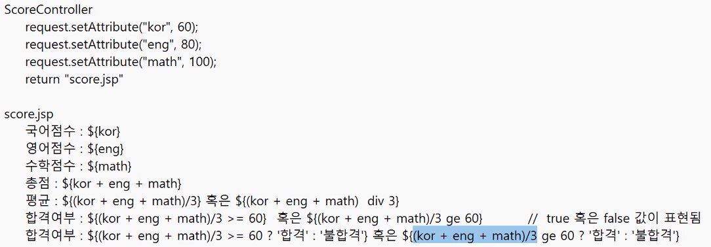
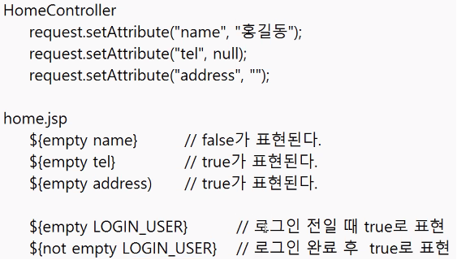
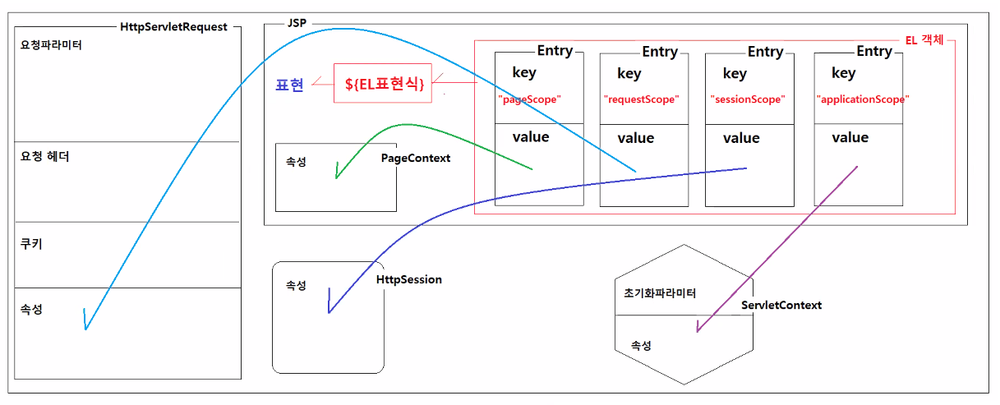
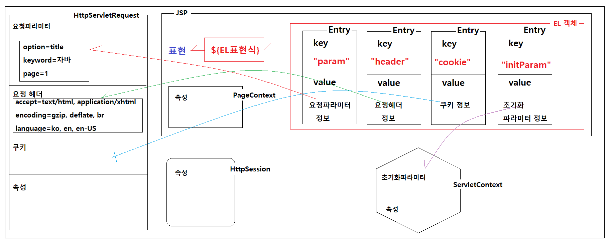
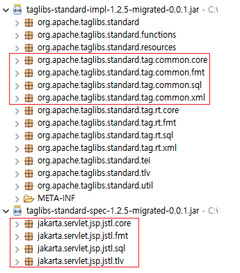
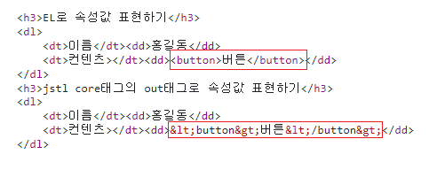
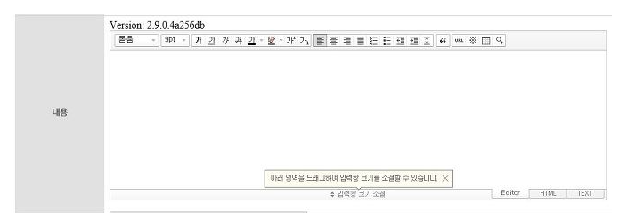
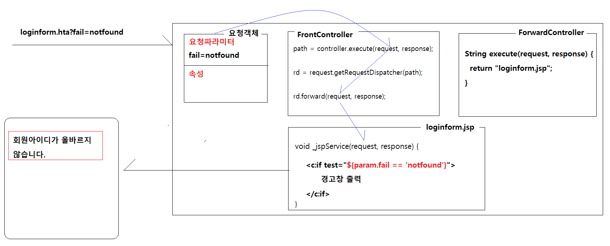

# 0704

- [0704](#0704)
- [EL](#el)
	- [EL 연산자](#el-연산자)
	- [EL의 내장객체](#el의-내장객체)
- [JSTL(JSP Standard Tag Library)](#jstljsp-standard-tag-library)
	- [JSTL 태그라이브러리의 태그 종류](#jstl-태그라이브러리의-태그-종류)
		- [Core 태그 라이브러리](#core-태그-라이브러리)
		- [국제화 태그](#국제화-태그)
		- [el내장객체의 사용](#el내장객체의-사용)
- [model2 실습](#model2-실습)

<small><i><a href='http://ecotrust-canada.github.io/markdown-toc/'>Table of contents generated with markdown-toc</a></i></small>

# EL
* Expression Language. 표현 언어
* JSP 2.0부터 포함
* 기능
  * 요청파라미터값, 초기화파라미터값의 표현
  * PageContext, 요청객체, 세션객체, 애플리케이션객체의 속성값 표현
  * 요청헤더정보, 쿠키값의 표현
  * 사칙연산, 비교연산, 논린연산자, 기타연산자 제공
  * 메소드 호출
* 형식 
  * `${EL표현식}`
  ```jsp
  <p>${표현식}</p>
  
  <input type="text" name="username" value="${표현식}" />
  <a href="list.hta?pageNo=${표현식}&cateNo=${표현식}">링크</a>
  <div id="box-${표현식}"> ... </div>
  ```
## EL 연산자
| 구분 | 연산 | 연산자 | 사용사례 |
| --- | --- | --- | --- |
| 사칙연산 | 덧셈 | + | ${표현식 + 표현식} |
| 사칙연산 |  뺄셈 | - | ${표현식 - 표현식} |
| 사칙연산 | 곱셈 | * | ${표현식 * 표현식} |
| 사칙연산 | 나눗셈 | div | ${표현식 div 표현식} |
| 사칙연산 | 나머지 | mod | ${표현식 mod 표현식} |
| 비교연산 | 크다 | gt | ${표현식 gt 표현식} |
| 비교연산 | 크거나 같다| ge | ${표현식 ge 표현식} |
| 비교연산 | 작다 | lt | ${표현식 lt 표현식} |
| 비교연산 | 작거나 같다 | le | ${표현식 le 표현식} |
| 비교연산 | 같다 | eq | ${표현식 gt 표현식} |		
| 비교연산 | 같지않다 | ne | ${표현식 ne 표현식} |
| 논리연산 | 논리곱 | and | ${표현식 gt 10000 && 표현식 eq 'VIP'} |
| 논리연산 | 논리합 | or | ${표현식 gt 50000 or 표현식 eq 5} |
| 논리연산 | 논리부정 | not	|	${not 표현식 eq 'VIP'} |
| 삼항연산 | 삼항연산 | ? : | 	${표현식 비교연산자 비교값 ? 값1 : 값2} |
| 기타연산 | 기타 | empty|  ${empty 표현식} 혹은 ${not empty 표현식} |

* EL안에서 홑따옴표('')로 표현해도 상관없다.
* empty 연산자가 true를 반환하는 경우
  * (EL표현식으로 표현하고자 하는 객체가 비어있는 경우)
    * 값이 null인 경우
    * "" 빈문자열인 경우
    * 배열이나 콜렉션의 길이가 0인 경우
    * 비어있는 맵인 경우
* 예시
  
  

## EL의 내장객체
* EL은 JSP의 요청파라미터, 속성, 스코프, 요청헤더정보, 초기화파라미터 정보에 접근할 수 있도록 해당 값을 제공하는 내장객체를 가지고 있다.

| 내장객체 | 사용예 | 설명 | 
| --- | --- | --- |
| **param** | ${param.파라미터명} | 요청파라미터값을 조회할 수 있다. <br/> request.getParameter("파라미터명")와 동일하다. |
| paramValues | ${paramValues.파라미터명} | 요청파라미터값을 조회할 수 있다. <br />request.getParameterValues("파라미터명")와 동일한다. |
| pageScope | ${pageScope.속성명} | PageContext에 저장된 속성(값, 객체)을 조회한다. |
| requestScope | ${requestScope.속성명} | HttpServletRequest에 저장된 속성을 조회한다. |
| sessionScope | ${sessionScope.속성명} | HttpSession에 저장된 속성을 조회한다. |
| applicationScope | ${applicationScope.속성명} | ServletContext에 저장된 속성을 조회한다. |
| **initParam** | ${initParam.초기화파라미터명} | 초기화파라미터값을 조회한다. |
| header | ${header.요청헤더명} | 요청헤더정보에서 헤더명에 해당하는 값을 조회한다. |
| cookie | ${cookie.쿠키명} | 쿠키명에 해당하는 쿠키값을 조회한다. |
| pageContext | ${pageContext.getter메소드이름} | PageContext의 getXXX()메소드의 실행결과를 조회한다. <br />JSP의 기본객체를 제공받을 수 있다. |

- 주의사항
  - pageScope, requestScope, sessionScope, applicationScope를 직접 명시해서 속성을 조회하지 말자.
  - EL은 `${속성명}`으로 표기하면 page , request , session , application의 순서로 해당 속성명으로 저장된 값이 있는지를 탐색한다.
  - 결론, 속성을 저장할 때 동일한 이름으로 다른 Scope에 저장하지만 않으면, 조회할 때 Scope를 앞에 적을 필요가 없다.

  

# JSTL(JSP Standard Tag Library)
- JSP 표준태그 라이브러리
- 스크립틀릿을 사용해서 작성했던 자바코드를 대체할 수 있다.
  ```jsp
  <%
	코드
  %>
  	위의 코드를
  <별칭:태그명 value="${}" />
 	 로 바꿔 사용할 수 있다.
  ```
  * 변수 선언/삭제, 값 출력, 제어문 처리, 반복문 처리, 숫자나 날짜에 대한 포맷팅, 국제화처리, URL처리
- 사용법  
  
  - JSTL 파일을 다운받아서 WEB-INF/lib에 복사한다.
  - JSP 파일에 사용할 태그라이브러리를 지시어를 사용해서 정의한다.
  ```jsp
    <%@ taglib prefix="별칭" uri="태그라이브러리식별자" %>
    <별칭:태그명 value="${EL표현식}" />
  ```

## JSTL 태그라이브러리의 태그 종류

- core 태그
  - 가장 많이 사용되는 태그 라이브러디다.
  - 변수/출력/제어문/반복문/URL 처리를 지원한다.
  - JSP에 아래의 지시어를 정의한다.
  ```jsp
    <%@ taglib prefix="c" uri="http://java.sun.com/jsp/jstl/core" %>
  ```
- fmt 태그
  - 숫자나 날짜에 대한 포맷팅을 지원한다.
  - 국제화처리를 지원한다.		
  - JSP에 아래의 지시어를 정의한다.
  ```jsp
    <%@ taglib prefix="fmt" uri="http://java.sun.com/jsp/jstl/fmt" %>
  ```
- function 태그
  - String 클래스의 주요 메소드 사용을 지원한다.
  - JSP에 아래의 지시어를 정의한다.
  ```jsp
    <%@ taglib prefix="fn" uri="http://java.sun.com/jsp/jstl/function" %>
  ```
- xml 태그
  - 거의 사용하지 않는다.
- sql 태그
  - 거의 사용하지 않는다.

### Core 태그 라이브러리
- **<c:out>** 태그
  - 값을 출력한다.
  - <%=값 %>, ${표현식} 과 동일한 작업을 수행한다.
  - XSS(Cross Site Scripting) 취약점 공격에 대한 가장 기본적인 방어을 지원한다.
    
    * XSS는 악의적인 사용자가 공격하려는 사이트에 스크립트를 넣어서 쿠키나 세션아이디와 같은 정보를 취득하는 것을 말한다.
    * 주로 공개된 게시판의 게시글에 html과 script 코드를 입력해서 해당 스크립트를 실행시키는 것이다.
    * 사이트 이용자가 작성하는 컨텐츠는 반드시 &lt;c:out /&gt;태그를 사용해서 출력하자.
    * 네이버스마트에디터와 같은 사용자가 입력하는 글작성 폼에서는 글자를 굵게, 기울어지게, 글자크기, 색 바꾸기 와 같은 기능을 구현하기 위해 EL태그로 작성한다.
      * 
      * > https://smarteditor.naver.com/desktop/index.html
  - 사용법
  ```jsp
    <c:out value="${표현식}" />
  ```
  - 주요 속성
    * value		
      + 출력할 값을 지정한다.
      + 생략할 수 없음
      ```jsp
        <c:out value="${book.title}" />
      ```
    * escapeXml
      + 특수문자(< > " ' &)를 변환할지 여부를 지정한다.
      + 기본값은 true다.
      + 생략가능
    * default		
      + value에서 지정한 값이 null인 경우 표현할 값을 지정한다.
      + 생략가능 
- **<c:if>** 태그
  - if문과 동일한 역할을 수행한다.
  - else에 해당하는 태그는 없다.
  - 사용법
  ```jsp
    <c:if test="${표현식}">
      HTML 컨텐츠
    </c:if>
    <!-- test에서 제시한 조건이 true면 HTML 컨텐츠가 화면에 출력된다. --->
  ```
  - 주요 속성
    * test
      - 검사조건을 정의한다.
      - 결과값이 boolean 타입이어야 한다.
      - 생략할 수 없다.

- **<c:choose> <c:when> <c:otherwise>** 태그
  - if ~ else if ~ else if ~ else 와 동일한 역할을 수행한다.
  - 사용법
  ```jsp
    <c:choose>
      <c:when test="${조건식1}">
        HTML 컨텐츠
        <!-- test에서 제시한 조건식1이 true면 HTML 컨텐츠가 화면에 출력된다. --->
      </c:when>
      <c:when test="${조건식2}">
        HTML 컨텐츠
        <!-- test에서 제시한 조건식2이 true면 HTML 컨텐츠가 화면에 출력된다. --->
      </c:when>
      <c:when test="${조건식3}">
        HTML 컨텐츠
        <!-- test에서 제시한 조건식3이 true면 HTML 컨텐츠가 화면에 출력된다. --->
      </c:when>
      <c:otherwise>
        HTML 컨텐츠
        <!-- test에서 제시한 조건식1, 조건식2, 조건식3이 전부 false면 HTML 컨텐츠가 화면에 출력된다. --->
      </c:otherwise>
    </c:choose>
  ```
    * <c:when>과 <c:otherwise>는 반드시 <c:choose>안에 위치해야 한다.
    * <c:when>은 조건식을 다르게 해서 여러 번 정의할 수 있다.
    * <c:otherwise>는 생략할 수 있고, 맨 마지작 <c:when> 다음에 정의해야 한다.
    * <c:when>으로 제시한 조건식이 true가 되면 남아있는 <c:when>은 검사하지 않는다.
    * <c:otherwise>는 <c:when>으로 제시한 조건이 모두 false로 판정될 때만 실행된다.
- **<c:forEach>** 태그
  - for문과 같은 역할을 수행한다.
  - 배열 혹은 콜렉션(List, Set)에 대해서 그 항목의 갯수만큼 반복작업을 수행한다.
  - 사용법
  ```jsp
    <c:forEach var="변수명" items="${표현식}">
      <p>${변수명}<p>
    </c:forEach>
  ```
    * items의 표현식으로 찾은 값이 반드시 배열 혹은 콜렉션이어야 한다.
    * 검색된 배열 혹은 콜렉션의 요소 갯수만큼 컨텐츠를 반복 출력한다.
    * var는 배열 혹은 콜렉션에서 반복수행시 해당 요소가 저장되는 변수의 이름을 지정한다.
  ```jsp
    <c:forEach var="변수명1" items="${표현식}" varStatus="변수명2">
      <p>${변수명2.count} ${변수명1}<p>
    </c:forEach>
  ```
    * varStatus에 지정된 변수에는 현재 반복상태정보를 담고 있는 객체가 전달된다.
    * 반복상태 정보 
      - index : 현재 추출한 요소의 인덱스번호(0부터 시작)
      - count : 현재 반복횟수(1부터 시작) 
      - first : 첫번째 요소인 경우 true
      - last  : 마지막번째 요소인 경우 false
  ```jsp
    <c:forEach var="변수명" begin="${표현식}" end="${표현식}">
      <a href="list.hta?pageno=${변수명}">${변수명}</a>
    </c:forEach>
  ```
    * begin은 시작값, end는 끝값을 지정한다.
    * begin과 end는 정수값이어야 한다.
    * begin, end의 구간만큼 컨텐츠를 반복출력한다.
    * var는 현재 숫자값을 저장하는 변수의 이름을 지정한다.
- <c:set> 태그
  - EL로 표현할 수 있는 값을 가진 변수를 선언한다.
  - 사용법
  ```jsp
    <c:set var="변수명" value="${표현식}" />
    <c:set var="변수명" value="값" />
    <c:set var="변수명" value="<%=값 %>" />
  ```
    * var 지정된 이름으로 값이 저장된다.
    * ${변수명}으로 저장된 값을 표현할 수 있다.
    * scope는 값이 저장될 객체를 지정한다.
    ```jsp
      <c:set var="a" value="길동" />
      <%-- pageContext.setAttribute("a", "길동"); --%>
      <p>${a}</p>
      
      <c:set var="b" value="길동" scope="page"/>
      <%-- pageContext.setAttribute("b", "길동"); --%>
      <p>${b}</p>

      <c:set var="c" value="유신" scope="request"/>
      <%-- request.setAttribute("c", "유신"); --%>
      <p>${c}</p>

      <c:set var="d" value="감찬" scope="session"/>
      <%-- session.setAttribute("d", "감찬"); --%>
      <p>${d}</p>

      <c:set var="e" value="순신" scope="application"/>
      <%-- application.setAttribute("e", "순신"); --%>
      <p>${e}</p>
    ```
- <c:remove> 태그
  - 지정된 이름의 값(객체)을 속성에서 삭제한다.
  - 사용법
  ```jsp
    <c:remove var="변수명" /> 
    
    <c:remove var="a" />
    <%-- pageContext.removeAttribute("a"); --%>
    
    <c:remove var="b" scope="page"/>
    <%-- pageContext.removeAttribute("b"); --%>
    
    <c:remove var="c" scope="request"/>
    <%-- request.removeAttribute("c"); --%>
    
    <c:remove var="d" scope="session"/>
    <%-- session.removeAttribute("d"); --%>
    
    <c:remove var="e" scope="application" />
    <%-- application.removeAttribute("e"); --%>				
  ```

- <c:url> 태그 
  - url을 생성한다.
  - 사용법
  ```jsp
    <c:url var="변수명" value="경로">
      <c:param name="이름1" value="값1" />
      <c:param name="이름2" value="값2" />
      <c:param name="이름3" value="값3" />
    </c:url>

    <a href="${변수명}">링크</a>
    <%-- <a href="경로?이름1=값1&이름2=값2&이름3=값3">링크</a> --%>
  ```
- <c:import> 태그
  - 지정된 파일을 include한다.
  - 사용법
  ```jsp
    <c:import url="포함시킬파일의 경로" />
  ```
    * url에는 프로젝트 내부 파일 및 외부파일(다른 웹서버의 파일) 포함 가능

### 국제화 태그
- <fmt:formatNumber> 태그
  - 숫자를 지정된 형식에 맞게 출력한다.
  - 사용법
  ```jsp
    <fmt:formatNumber value="${표현식}" />
  ```
  - 숫자에 콤마가 포함되어서 출력된다.
  ```jsp
    <fmt:formatNumber value="${표현식}" pattern="패턴문자열" />
  ```
    * 숫자가 지정된 패턴형식에 맞게 출력된다.
    * value에서 지정된 표현식으로 검색되는 값은 반드시 숫자값이어야 한다.
   
- <fmt:formatDate> 태그
  - 날짜를 지정된 형식에 맞게 출력한다.
  - 사용법
  ```jsp
    <fmt:formatDate value="${표현식}" />
  ```
  - 날짜가 년월일시분초 형태로 출력된다.
  ```jsp
    <fmt:formatDate value="${표현식}" pattern="패턴문자열" />
  ```
    * 날짜가 지정된 패턴형식에 맞게 출력된다.
    * value에서 지정된 표현식으로 검색되는 값은 반드시 Date 타입이어야 한다.

- <fmt:bundle>, <fmt:message> 태그
  - 국제화처리를 지원하는 태그다.
  - 사용법
  ```jsp
    <fmt:bundle basename="패키지경로.기본메세지번들파일명"></fmt:bundle>
  ```
    - JSP에서 사용할 메세지 번들 파일을 지정한다.
    - 국제화처리를 지원받기 위해서는 HTML 컨텐츠가 <fmt:bundle>와 </fmt:bundle> 안에 위치해야 한다.
- <fmt:message var="별칭" key="번들파일에 정의한 키" />
  - 번들파일에서 키에 해당하는 텍스트를 읽어서 출력한다.
  - 사용예
  ```jsp
    <h1><fmt:message key="label.home.title"/></h1>
    
    <fmt:message var="submit_message" key="label.home.btn.submit"/>
    <input type="submit" value="${submit_message}" />
  ```
- 국제화처리 절차
  - 지원할 각 언어별로 메세지 번들 파일을 만든다.
    + /src/resources/messages.properties	기본 메세지번들 파일
    + /src/resources/messages_ko.properties	한국어용 메세지번들 파일
    + /src/resources/messages_en.properties	영어용 메세지번들 파일
    + /src/resources/messages_ja.properties	일본어용 메세지번들 파일
      * 언어별 코드
        - 한국어 ko, 영어 en, 중국어 zh, 일본어 ja, 프랑스어 fr, 독일어 de, 스페인어 es
      * 국가별 코드
        - 한국 kr, 미국 us, 영국 gb, 중국 cn, 일본 jp, 프랑스 fr, 독일 de, 스페인 es
  - JSP 파일에서 메세지번들 파일의 기본 경로 및 이름을 설정한다.
  ```jsp
    <fmt:bundle basename="패키지경로.기본메세지번들파일명" />
  ```
  - 메세지를 표현할 곳에 메세지번들파일에서 정의한 키를 지정한다.
  ```jsp
    <fmt:message key="번들파일에 정의한 키" /> 
  ```

### el내장객체의 사용
* ${속성명}
	* pageContext -> request -> session -> servletContext 객체 순으로 지정된 속성명으로 속성값을 검색해서 표현
* ${pageScope.속성명}
	* 검색없이 PageContext객체에서 지정된 속성명으로 속성값을 검색해서 표현, 사용빈도 낮음
* ${requestScope.속성명}
	* 검색없이 HttpServletRequest객체에서 지정된 속성명으로 속성값을 검색해서 표현, 사용빈도 낮음
${sessionScope.속성명}
	* 검색없이 HttpSession객체에서 지정된 속성명으로 속성값을 검색해서 표현, 사용빈도 낮음
${applicationScope.속성명}
	* 검색없이 ServletContext객체에서 지정된 속성명으로 속성값을 검색해서 표현, 사용빈도 낮음

* ${param.요청파라미터명}
	* 요청객체의 요청파마미터값을 표현
* ${header.요청헤더명}
	* 요청객체의 요청헤더값을 표현, 사용빈도 낮음
* ${cookie.쿠키명}
	* 요청객체의 쿠키값을 표현, 사용빈도 낮음
* ${initParam.초기화파라미터명}
	* 애플리케이션 객체의 초기화 파라미터값을 표현, 사용빈도 낮음

# model2 실습

1. EL > JSTL
   * el, jstl 실습(비교, 출력)
   * 로그인, 로그아웃 (fail.invalid, fail.deny)
   * 게시글 목록 (c:if, c:forEach)
     * 게시글 리스트 기본 양식
        ```jsp
		<div class="row">
			<div class="col">
				<h1>게시글 목록</h1>
			</div>
		</div>
		<div class="row">
			<p>
				전체 게시글을 확인하세요 
				<%--
					${empty LOGIN_USER}
						LOGIN_USER라는 속성명으로 속성값을 조회했을 때 비어있으면 true로 판정된다.
						true로 판정되는 경우는 로그인하기 전인 경우다.
					${not empty LOGIN_USER}
						LOGIN_USER라는 속성명으로 속성값을 조회했을 때 속성값이 존재하면  true로 판정된다.
						true로 판정되는 경우는 사용자 인증이 완료되고 세션객체에 "LOGIN_USER" 속성명으로 User객체가 저장된 경우다.
						
					<c:if test="${empty LOGIN_USER}">
						<a href="form.hta" class="float-end btn btn-primary disabled">글쓰기</a>
					</c:if>
					<c:if test="${not empty LOGIN_USER}">
						<a href="form.hta" class="float-end btn btn-primary">글쓰기</a>
					</c:if>
				 --%>
				<a href="form.hta" class="float-end btn btn-primary ${empty LOGIN_USER ? 'disabled' : '' }">글쓰기</a>
			</p>
			
			<p>게시글 목록 : ${boardList }</p>
			<table class="table">
				<thead>
					<tr>
						<th>번호</th>
						<th>제목</th>
						<th>작성자</th>
						<th>등록일</th>
					</tr>
				</thead>
				<tbody>
				<%--
					${empty boardList }
						요청객체에서 boardList라는 속성명으로 저장된 속성값이 없으면 true로 판정된다.
						요청객체에서 boardList라는 속성명으로 조회된 속성값이 비어있거나 크기가 0이면(배열, 리스트의 크기) true로 판정된다.
				 --%>
				<c:if test="${empty boardList }">
					<tr>
						<td colspan="4" class="text-center"> 게시글 정보가 없습니다. </td>
					</tr>
				</c:if>
				<%--
					${not empty boardList }
						요청객체에서 boardList라는 속성명으로 조회된 속성값이 비어있지 않으면 true로 판정된다.'
						* BoardListController에서는  List<Board>객체를 boardList라는 속성명으로 요청객체에 저장했다.
						* List<Board>객체는 Board객체를 여러 개 저장하고 있는 List객체임으로 반복처리가 필요하다.
				 --%>
				<c:if test="${not empty boardList }">
					<c:forEach var="board" items="${boardList }">
						<tr>
							<td>${board.no }</td>
							<td><a href="detail.hta?no=${board.no }">${board.title }</a></td>
							<td>${board.writer.name }</td>
							<td><fmt:formatDate value="${board.createdDate }" pattern="yyyy년 M월 d일 EEEE a h시 m분 s초"/> </td>
						</tr>					
					</c:forEach>
				</c:if>
				</tbody>
			</table>
		</div>
	    ```