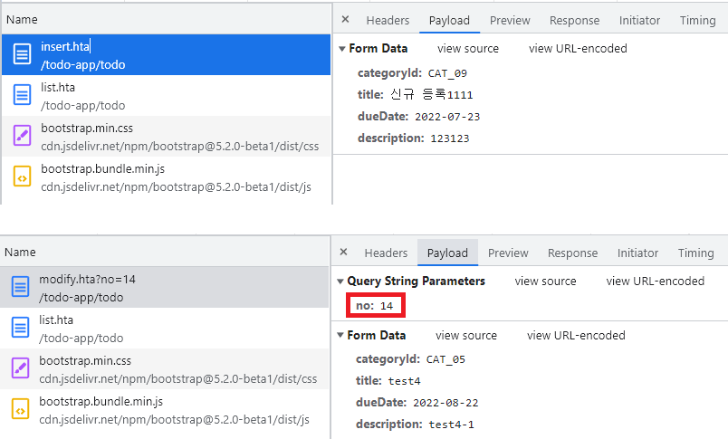
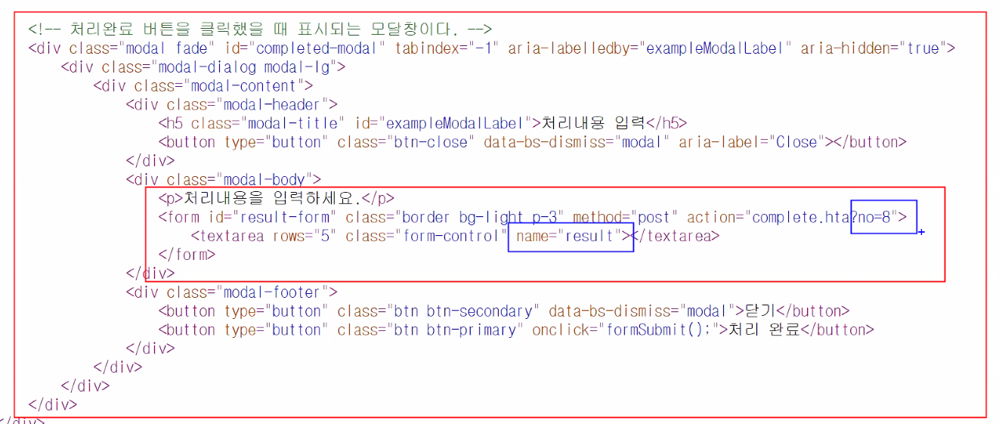

# 0705

- [0705](#0705)
- [TODO 애플리케이션 구현하기](#todo-애플리케이션-구현하기)
  - [준비단계](#준비단계)
  - [주요 코드](#주요-코드)
    - [삼항연산자](#삼항연산자)
    - [c:forEach](#cforeach)
    - [신규할일등록, 기존할일수정 차이](#신규할일등록-기존할일수정-차이)
    - [모달창](#모달창)

<small><i><a href='http://ecotrust-canada.github.io/markdown-toc/'>Table of contents generated with markdown-toc</a></i></small>

# TODO 애플리케이션 구현하기
1. 로그인 기능
2. 신규 할일 등록 기능
   1. 카테고리, 제목, 처리예정일, 내용, 사용자 아이디를 저장한다.
3. 로그인한 사용자의 할일 등록 기능
   1. 해당 사용자가 작성한 모든 할일을 처리예정일의 역순으로 조회한다.
   2. 번호, 카테고리명, 제목, 예정일, 완료여부를 출력한다.
   3. 목록 화면에서 완료처리 및 삭제가 가능하다.
   4. 목록에서 하나를 선택하면 할일 상세 정보로 이동한다.
4. 할일 상세 정보 조회 기능
   1. 번호, 카테고리명, 제목, 예정일, 내용, 완료여부, 처리결과, 완료날짜, 최종 수정일, 최종 등록일을 출력한다.
5. 할일 수정 기능
   1. 제목, 예정일, 내용을 수정할 수 있다.
6. 할일 완료 처리 기능
   1. 처리결과를 입력하고 완료처리할 수 있다.
7. 할일 삭제 기능
   1. 할일을 완전히 삭제한다.

## 준비단계
1. 라이브러리 복사
   1. ojdbc11.jar
   2. taglibs-standard-impl-1.2.5-migrated-0.0.1.jar
   3. taglibs-standard-spec-1.2.5-migrated-0.0.1.jar
2. views 폴더구성
   1. home.jsp
   2. loginform.jsp
   3. todo 폴더
      1. form.jsp
      2. list.jsp
      3. detail.jsp
      4. modifyform.jsp
3. src/main/java
   1. helper 패키지
   2. model2 패키지
   3. vo 패키지
      1. User.java
      2. Todo.java
      3. Category.java
   4. dao 패키지
      1. CategoryDao
      2. TodoDao
      3. UserDao
   5. controller 패키지
4. controller, dao, jsp 구현하기
   1. 로그인, 로그아웃
   2. 할일 등록
   3. 상세정보 조회
   4. 할일 수정
   5. 할일 삭제

## 주요 코드
### 삼항연산자
```jsp
<a href="modifyform.hta?no=${todo.no }" class="btn btn-warning ${todo.completed eq 'Y' ? 'disabled' : '' }">수정</a>
<a href="delete.hta?no=${todo.no }" class="btn btn-danger ${todo.completed eq 'Y' ? 'disabled' : '' }">삭제</a>
```
* 삼항연산자를 이용해 class에 'disabled' keyword로 스타일을 줄 수 있다.
* 완료된 할일의 경우 버튼을 수정, 삭제 버튼이 눌리지 않게 한다.

```jsp
<a href="form.hta" class="btn btn-primary float-end ${empty LOGIN_USER ? 'disabled' : '' }">새 할일 등록</a>
```
* 새 할일을 등록할 때 로그인한 상태가 아니면 버튼을 누를 수 없게 한다.

### c:forEach
```jsp
<c:forEach var="category" items="${categories }">
  <option value="${category.id }" ${category.id eq todo.category.id ? 'selected' : '' }>${category.name }</option>
</c:forEach>
```
* 카테고리 select버튼을 만들때 이미 선택된 옵션은 삼항연산자로 'selected' 속성값을 줘 선택된 상태로 먼저 보여지게 한다.
* c:forEach를 이용해 카테고리들을 반복 출력한다.

```jsp
<c:forEach var="todo" items="${todoList }">
  <tr>
    <td>${todo.no }</td>
    <td>${todo.category.name }</td>
    <td><a href="detail.hta?no=${todo.no }">${todo.title }</a></td>
    <td><fmt:formatDate value="${todo.dueDate }" pattern="yyyy-MM-dd"/></td>
    <td>${todo.completed }</td>
    <td>
      <a href="delete.hta?no=${todo.no }" class="btn btn-danger btn-xs ${todo.completed eq 'Y' ? 'disabled' : '' }">삭제</a>
      <a href="complete.hta?no=${todo.no }" class="btn btn-success btn-xs ${todo.completed eq 'Y' ? 'disabled' : '' }">완료</a>
    </td>
  </tr>					
</c:forEach>
```
* 전체 할일 목록을 조회하는 list.jsp에서 전체 목록을 조회하기 위해 c:forEach를 사용한다.

### 신규할일등록, 기존할일수정 차이

* 파라미터로 no가 전달되는 것이 다르다. 
  * 기존 데이터를 수정해야하므로 어떤 데이터를 수정할지 파라미터를 html태그 안에 hidden으로 보내든 url에 포함해 보내든 꼭 보내줘야 한다.
  * no와 같은 파라미터가 없으면 신규등록이라고 할 수 있다. 기존 정보가 필요하지 않기 때문이다.

### 모달창

* name 속성이 "result"인 textarea의 값을 전달하면 parameter로 전달되어 TodoCompleteController에서 요청객체의 값을 todo.setResult로 저장하면된다.
  * TodoCompleteController.java
  ```java
   package com.hta.todo.controller;

   import java.util.Date;

   import com.hta.todo.dao.TodoDao;
   import com.hta.todo.vo.Todo;

   import jakarta.servlet.http.HttpServletRequest;
   import jakarta.servlet.http.HttpServletResponse;
   import model2.Controller;
   import util.DateUtil;

   public class TodoCompleteController implements Controller {

      @Override
      public String execute(HttpServletRequest request, HttpServletResponse response) throws Exception {
         
         int no = Integer.parseInt(request.getParameter("no"));
         
         Todo todo = TodoDao.getInstance().getTodoByNo(no);
         
         todo.setCompleted("Y");
         Date date_now = new Date(System.currentTimeMillis());
         todo.setCompletedDate(date_now);
         todo.setUpdatedDate(date_now);
         todo.setResult(request.getParameter("result"));
         TodoDao.getInstance().updateTodo(todo);
         
         return "redirect:list.hta";
      }
   }
  ```