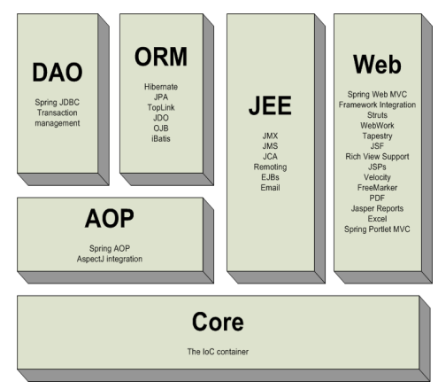
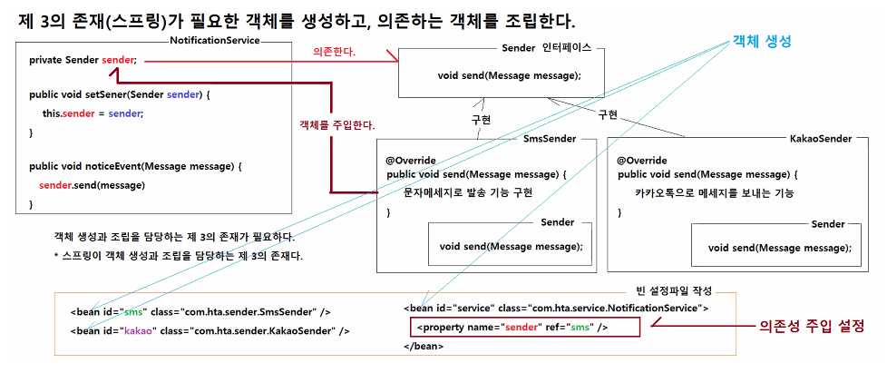
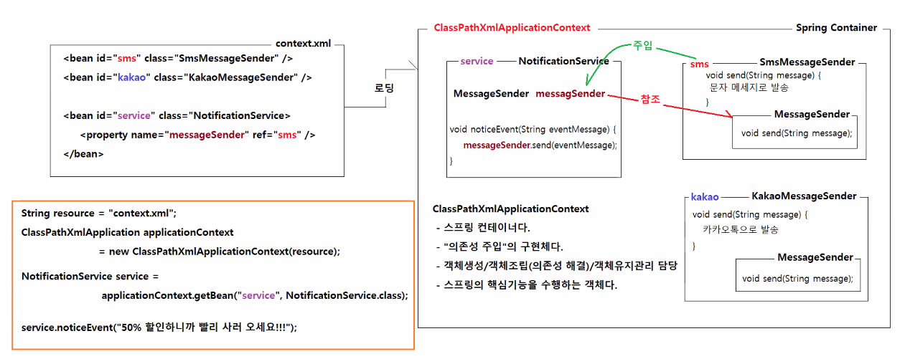

# 0706

- [0706](#0706)
- [스프링](#스프링)
  - [Spring 프레임워크의 개요](#spring-프레임워크의-개요)
      - [스프링 프레임워크의 구성](#스프링-프레임워크의-구성)
    - [IoC Container 개요](#ioc-container-개요)
      - [IoC 와 DI](#ioc-와-di)
      - [스프링과 스프링 컨테이너](#스프링과-스프링-컨테이너)
  - [실습](#실습)
    - [Maven 과 pom.xml](#maven-과-pomxml)
    - [bean과 property](#bean과-property)
    - [ClassPathXmlApplicationContext](#classpathxmlapplicationcontext)
    - [생성자 주입시 주의사항](#생성자-주입시-주의사항)

<small><i><a href='http://ecotrust-canada.github.io/markdown-toc/'>Table of contents generated with markdown-toc</a></i></small>

# 스프링
* 전자정부 표준프레임워크
  * > https://www.egovframe.go.kr/home/sub.do?menuNo=94
  * eGovFrameDev
  * 전자정부 표준프레임워크 이클립스를 사용해서 스프링 프레임워크를 실습한다.
* Spring.io
  * spring.io > projects > overview
  * Spring Framework, Spring Boot, Spring Data, Spring Security 이외에도 다양한 스프링 프로젝트가 있다.
  * Spring Framework
    * 의존성 주입, 트랜잭션 처리, 웹 앱, 데이터 엑세스, 메세징 처리 등 다양한 기능 제공
  * Spring Boot
    * 스프링 부트를 이용해 다양한 스프링 애플리케이션을 빠르게 만들 수 있다.
  * Spring Data
    * 어떤 DataBase를 사용하든 데이터의 종류에 상관없이 데이터 엑세스 방식을 추상화 해놓은 것. (CRUD repository)
  * Spring Cloud
    * 분산된 시스템에서 공통 패턴들을 빠르게 만들수 있는 도구들을 제공
    * (e.g. configuration management, service discovery, circuit breakers, intelligent routing, micro-proxy, control bus, one-time tokens, global locks, leadership election, distributed sessions, cluster state)
  * Spring Security
    * 사용자 인증(로그인), 인가(권한에 따른 기능별 접근 가능 여부 제어)와 같은 기능들 처리
  * Spring Batch
    * 주기적으로 반복적으로 자동으로 실행해야 하는 대규모의 데이터를 읽고 처리해야하는 작업을 batch작업이라고 한다.
  * Spring 다운받기
    * > https://spring.io/tools
    * 일부 자바 기술, 파일들을 사용할 수 없다. 따라서 전자정부 표준 프레임워크를 사용해 스프링을 실습한다.

## Spring 프레임워크의 개요
전자정부 표준프레임워크 실행환경 교육교재 page 29, 30
* jsp, servlet은 톰캣이 없으면 구동되지 않는다. (단점) 이러한 상황을 벗어나 다시 처음으로 돌아가 일반적인 자바 객체만으로 개발하고자 하는 방식이 스프링.
* 스프링은 평범한 자바클래스(POJO)를 가지고 엔터프라이즈 어플리케이션(서버에서 구동되는, 서버급 어플리케이션) 개발을 지원하는 프레임워크
#### 스프링 프레임워크의 구성
page 31
* 
1. Core
   * 가장 기본. IoC, 의존성 주입
2. AOP
   * 관점 지향 프로그래밍
3. DAO
   * JDBC 추상화 계층, 트랜잭션 관리 데이터베이스 접근방법 제공
4. ORM
   * 객체 관계 맵핑-JPA, Hibernate, iBatis. 데이터베이스 접근방법 제공
5. JEE
   * Java EE 기술
6. Web
   * Model2 방식의 웹 애플리케이션 개발

### IoC Container 개요
전자정부 표준프레임워크 실행환경 교육교재 page 32
#### IoC 와 DI
- IoC(Inversion of Control) 제어 역전
  - 어떤객체가 사용할 객체를 스스로 결정하는 것이 아니라, 제 3의 존재가 결정하는 것
    - 자신이 의존하는 객체를 직접 생성하지 않고 제 3의 존재가 결정한다. 즉, 객체를 획득하는 방법이 역전된 것이다.
    - 제어역전방식
      - DI(Dependency Inject: 의존성 주입): 의존하는 객체를 객체의 외부에서 주입시킨다.
      - DL(Dependency Lookup: 의존성 검색): 외부에서 미리 의존하는 객체를 생성하고, 특정 위치에 등록해두면 그 객체를 검색해서 사용한다.

- DI(Dependency Injection) 의존성 주입
  - 객체(모듈)간의 의존성을 객체(묘듈)의 외부(스프링)에서 주입시키는 것으로 IoC의 한 종류다.

#### 스프링과 스프링 컨테이너
- 스프링
  - POJO를 사용해서 자바 엔터프라이즈 애플리케이션 개발을 지원하는 오픈소스 프레임워크다.
  - POJO(Plain Old Java Object)
    - 평범한 자바 객체
    - 쉽게 정의하고 쉽게 생성하고 재사용 가능한 객체
    - 특정 서버나 특정 프레임워크에 종속되지 않는 자바 객체
  - Bean : 스프링에서의 객체를 지칭한다.
  - 스프링은 빈 팩토리(Bean Factory)다.
    - 애플리케이션에서 사용되는 객체를 생성하는 공장이다.
    - 스프링은 기본적으로 싱글턴 객체로 생성한다.
  - 스프링은 빈 어셈블러(Bean Assembler)다.
    - 애플리케이션에서는 여러 객체가 사용되는 각각의 객체들은 다른 객체를 사용(다른 객체에 의존성을 가진다.)한다.
    - 애플리케이션 실행에 사용되는 객체들간의 관계를 기준으로 객체들을 조립한다.
      * 어떤 객체와 어떤 객체를 조립해야 할지는 개발자가 지정한다.
  + 스프링을 사용해서 애플리케이션을 개발하는 것은 레고블록처럼 서로 조립하듯이 애플리케이션을 개발 할 수 있게 한다.
  + 스프링은 객체를 조립할 때 DI(의존성 주입)을 활용한다.

- 스프링 컨테이너 
  - 스프링 프레임워크가 제공하는 API(인터페이스와 클래스)다.
  - 객체 생성, 객체 조립(의존성 주입)을 담당하는 인터페이스 및 클래스들이다.
    * 스프링 컨테이너는 IoC의 구현체다.
  + 스프링 컨테이너의 종류
    1. BeanFactory 인터페이스
       - 객체생성, 의존성주입, 객체의 생명주기 관리 기능을 제공
       - 구현 클래스 : XmlBeanFactory
       - Spring-bean.jar 라이브러리에 포함되어 있다.    2. ApplicationContext 인터페이스
       - 객체생성, 의존성주입, 객체의 생명주기 관리, Spring AOP, 메세지 리소스처리(국제화처리), 이벤트 처리 기능 제공
        - 구현 클래스 : ClassPathXmlApplicationContext, FileSystemXmlApplicationContext, GenericXmlApplicationContext, AnnotationConfigApplicationContext
        - Spring-context.jar 라이브러리에 포함되어 있다.
    3. WebApplicaionContext 인터페이스
       - ApplicaionContext와 동일한 기능 + 웹 애플리케이션 환경에서 사용
       - 구현클래스 : XmlWebApplicationContext
       - Spring-web.jar 라이브러리에 포함되어 있다.

## 실습
* new maven project
  * Group-id : kr.co.hta
  * artifact-id : spring-di-1

* pon.xml 작성
  * property 
    * java version 11
  * build(plugin)
    * maven-compiler-plugin 11
  * dependency 추가
    * mavenrepository > spring context > 4.3.30
    > https://mvnrepository.com/artifact/org.springframework/spring-context/4.3.30.RELEASE

### Maven 과 pom.xml
* Maven
  - 자바 프로젝트 빌드도구
    - 자바 프로젝트 생성
    - 프로젝트 의존성 해결
    - 소스 컴파일
    - 단위 테스트
    - 패키징
    - 배포
    - 위의 작업들을 자동으로 수행하는 도구
  - 어플리케이션 프로젝트를 생성할 때, 프로젝트 정보/라이브러리 등을 관리
* pom.xml
  - 프로젝트 최상위 폭더에 위치하는 maven 설정 파일
  - (Project Object Model) pom.xml 파일은 maven으로 생성한 프로젝트 정보를 설정하는 파일이다.
  - 설정정보
    - 프로젝트 정보
      - `<group>`, `<artifacId>` 태그 - 프로젝트가 소속된 조직명, 프로젝트의 이름을 정의
      - `<packagin>` 태그 - 프로젝트 패키징 유형(jar, war, ear, pom)을 정의
      - `<name>` 태그 - 프로젝트명을 정의
      - `<properties>` 태그 - pom.xml안에서 사용되는 상수값을 설정하거나 자바 버전을 설정
    - 의존성 라이브러리 정보
      - `<dependencies>` 태그 - 프로젝트 실행에 필요한 의존성 라이브러리 정보를 정의
      - `<dependency>` 태그 - 의존성 라이브러리를 추가
      - 의존성 라이브러리 예시
        ```xml
        <dependency>
           <groupId>org.springframework</groupId>
           <artifactId>spring-context</artifactId>
           <version>4.3.30.RELEASE</version>
        </dependency>
        ```
    - 빌드정보
      - 프로젝트 빌드관련 정보를 설정한다.

### bean과 property
* 스프링 bean 설정 파일에 객체 생성, 객체 조립과 관련된 설정을 추가한다. 'context.xml'
* `<bean>` 태그는 객체 생성과 관련 설정을 지정
  * 스프링이 class속성에 지정된 클래스로 객체를 생성하고
  * id로 지정된 값을 객체를 식별하고 관리
* `<property>` 태그는 객체 조립과 관련된 설정을 지정
  * 스프링이 name 속성에 지정된 멤버변수에 ref속성에 지정된 값과 같은 id값을 가진 객체를 찾아서 조립시킨다.



### ClassPathXmlApplicationContext

* 스프링 컨테이너로 의존성 주입의 구현체
* 객체 생성, 조립, 유지관리를 담당한다.
* 스프링의 핵심기능을 수행

### 생성자 주입시 주의사항
```java
public class OrderService {
	private OrderDao orderDao;
	private ProductDao productDao;
	private UserDao userDao;

	public OrderService( ) {}

	public OrderService(OrderDao orderDao, ProductDao productDao, UserDao userDao) {
		this.orderDao = orderDao;
		this.productDao = productDao;
		this.userDao = userDao;
	}
}
```
```xml
<bean id="orderDao" class="x.y.z.OrderDao"></bean>
<bean id="productDao" class="x.y.z.ProductDao"></bean>
<bean id="userDao" class="x.y.z.UserDao"></bean>
<!-- 객체생성할 때 매개변수 없는 생성자를 실행 -->
<bean id="OrderService" class="x.y.z.OrderService">
</bean>
<!-- 객체생성할 때 매개변수 하나 있는 생성자를 실행, 오류 -->     public OrderService(OrderDao orderDao) { this.orderDao = orderDao; } 생성자가 있으면 오류 아님
<bean id="OrderService" class="x.y.z.OrderService">
	<constructor-arg name="orderDao" ref="orderDao"></constructor-arg>
</bean>
<!-- 객체생성할 때 매개변수 세개 있는 생성자를 실행-->
<bean id="OrderService" class="x.y.z.OrderService">
	<constructor-arg name="orderDao" ref="orderDao"></constructor-arg>
	<constructor-arg name="productDao" ref="productDao"></constructor-arg>
	<constructor-arg name="userDao" ref="userDao"></constructor-arg>
</bean>
```