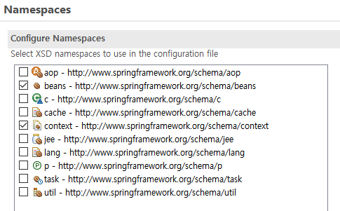

# 0707

- [0707](#0707)
- [스프링](#스프링)
  - [spring 실습2](#spring-실습2)
  - [오토와이어링](#오토와이어링)
    - [실습](#실습)
  - [spring-jdbc를 활용한 데이터베이스 엑세스](#spring-jdbc를-활용한-데이터베이스-엑세스)
    - [spring database access의 특징](#spring-database-access의-특징)
  - [람다식](#람다식)
    - [타입추론과 람다식](#타입추론과-람다식)
  - [ibatis와 mybatis](#ibatis와-mybatis)

<small><i><a href='http://ecotrust-canada.github.io/markdown-toc/'>Table of contents generated with markdown-toc</a></i></small>

# 스프링
## spring 실습2
spring-di-2
다양한 클래스 스프링으로 연결하기 

## 오토와이어링
전자정부 표준프레임워크 실행환경 교육교재 page 69
* 빈 등록과 의존성 주입 자동화하기
  * 애플리케이션의 규모가 커지면 클래스의 개수가 기하급수적으로 늘어난다.
  * 빈 설정파일에서 빈을 수동으로 등록하고, 의존성 주입을 수동으로 설정하는 것은 설정량이 너무 많고 유지보수가 어렵다.
* 빈 자동등록하기
  * Spring은 @Component, @RestController, @ControllerAdvice, @RestControllerAdivce, @Service, @Repository 어노테이션을 사용하여 빈들을 관리하는 기능을 제공한다.
  * 클래스에 위의 어노테이션 중 하나를 지정하면 <bean /> 정의 없이 자동으로 클래스를 스캔하고 스프링의 빈으로 등록시킨다.
    ```java
    // 스프링 컨테이너에 자동으로 등록시킬 클래스에 어노테이션을 지정한다.
    @Service
    public class UserService {

    }

    @Repository
    public class UserDao{

    }
    ```
  * 빈 설정파일에 아래의 태그를 추가한다 (`<bean>`태그 대신)
    * `<context-component-scan base-package="패키지경로" />`
    * 위와 같이 설정하면 지정된 패키지 경로 및 그 하위의 모든 패키지 경로에서 위에서 나열된 어노테이션이 부착된 클래스를 전부 스캔해 스프링의 빈으로 자동 등록시킨다.
* 자동 의존성 주입하기
  * Spring은 @Autowired, @Resource, @qualifier, @Required 어노테이션을 사용해서 Auto-wiring(빈 자동 묶기, 의존성 자동 주입)을 지원한다.
  * xml 설정파일에서 `<property />` `<constructor-arg />` 태그가 필요 없다.
  * 클래스의 Auto-wiring 설정하기
    ```java
    public class UserService {
      // 멤버변수에 어노테이션 지정하기
      @Autowired
      private UserDao userDao;
      // setter메소드를 정의할 필요가 없다.
    }
    ```
    ```java
    public class UserService {
      private UserDao userDao;
      // setter 메소드에 어노테이션 지정하기
      @Autowired
      public void setUserDao(UserDao userDao) {
        this.userDao = userDao;
      }
    }
    ```
    ```java
    public class UserController {
      private UserService userService;
      private OrderService orderService;
      //생성자 메소드에 어노테이션 지정하기
      @Autowired
      public UserController(UserService userService, OrderService orderService) }
      this.userService = userService;
      this.orderService = orderService;
    }
    ```
      * 3가지 방법 모두 의존성을 주입할 멤버변수를 적어야 한다.
      * 스프링 컨테이너에 해당하는 타입이 없으면 에러가 발생한다.
* 빈 설정 파일에 아래의 태그를 추가한다.
  * `context:annotation-config />
  * 위와 같이 설정하면 스프링의 빈으로 등록된 객체들을 분석해서 멤버변수, setter메소드, 생성자메소드에 @Autowired, @Resource, @qualifier, @Required 어노테이션이 지정되어 있는지 분석하고, 지정되어 있는 멤버변수의 타입, setter메소드의 매개변수 타입, 생성자메소드의 매개변수 타입과 타입이 일치하는 빈을 스프링 컨테이너 안에서 검색해서 자동으로 의존성 주입을 실행한다.

### 실습
1. Spring Bean Configuration file
   * namespace에서 context 체크
     * 
   * 코드 2줄
    ```xml
    <?xml version="1.0" encoding="UTF-8"?>
    <beans xmlns="http://www.springframework.org/schema/beans"
      xmlns:xsi="http://www.w3.org/2001/XMLSchema-instance"
      xmlns:context="http://www.springframework.org/schema/context"
      xsi:schemaLocation="http://www.springframework.org/schema/beans http://www.springframework.org/schema/beans/spring-beans.xsd
        http://www.springframework.org/schema/context http://www.springframework.org/schema/context/spring-context-4.3.xsd">

      <!-- 
        의존성 자동 주입을 지원하는 설정이다.
          * 스프링 컨테이너에 등록된 번들 중에서 멤버변수, setter메소드, 생성자 메소드에
            @Autowired, @Resource, @Required 등의 어노테이션이 부착되어 있으면 해당 타입과 일치하는
            객체를 스프링 컨테이너 안에서 검색한 다음 자동으로 의존성 주입을 수행한다.
          
          org.springframework.context.annotation.internalConfigurationAnnotationProcessor,
              org.springframework.context.annotation.internalAutowiredAnnotationProcessor,
              org.springframework.context.annotation.internalRequiredAnnotationProcessor,     
      -->
      <context:annotation-config />

      <!-- 
        빈 자동 등록을 지원하는 설정이다.
          * base-package 속성에 지정된 패키지 및 그 하위 패키지에서
          @Component, @Controller, @Service, @Repository 등의 어노테이션이 부착된 클래스를 스캔해서
          스프링 컨테이너의 빈으로 자동 등록시킨다.
      -->
      <context:component-scan base-package="kr.co.hta"></context:component-scan>

    </beans>
    ```
2. annotation 붙이기
   1. Controller(@Controller), Dao(@Repository), Service(@Service)
   2. 멤버변수(필드) or setter메소드 or 파라미터에 @Autowired 붙이기
* bean에 id를 지정하지 않으면 첫글자가 소문자로 바뀐 것이 id로 자동설정된다.

## spring-jdbc를 활용한 데이터베이스 엑세스


- DataSource  구현체를 스프링의 빈으로 등록한다.
   1. 라이브러리 의존성 추가
      ```xml
      <!-- jdbc를 활용한 데이터베이스 엑세스를 지원하는 스프링의 라이브러리 의존성 추가 -->
      <dependency>
         <groupId>org.springframework</groupId>
         <artifactId>spring-jdbc</artifactId>
         <version>4.3.30.RELEASE</version>
      </dependency>
      <!-- 오라클 JDBC 드라이버 라이브러리 의존성 추가 -->
      <dependency>
         <groupId>com.oracle.database.jdbc</groupId>
         <artifactId>ojdbc10</artifactId>
         <version>19.15.0.0.1</version>
      </dependency>
      <!-- 커넥션풀 구현체 라이브러리 의존성 추가 -->
      <dependency>
         <groupId>org.apache.commons</groupId>
         <artifactId>commons-dbcp2</artifactId>
         <version>2.9.0</version>
      </dependency>
      ```
   2. src/main/resources에 데이터페이스 연결정보가 포함된 database.properties  파일 생성
      * name, value 식으로 설정, 이름은 마음대로
      * 이 파일은 버전 관리 대상 x (push x)
      * 자바에서 환경설정정보를 설정할 때 많이 사용
      ```
      # 개발환경 데이터베이스 연결 정보
      db.driverClassName=oracle.jdbc.OracleDriver
      db.url=jdbc:oracle:thin:@localhost:1521:xe
      db.username=hr
      db.password=zxcv1234
      ```
   3. 스프링 빈 설정 파일에 database.properties 파일 정보를 읽어서 제공하는 객체를 스프링의 빈으로 등록하기
      ```xml
      <context:property-placeholder location="classpath:/database.properties"/>
      ```
   4. Connection Pool 구현객체를 스프링 컨테이너의 빈으로 등록하기
      ```xml
      <bean id="dataSource" class="org.apache.commons.dbcp2.BasicDataSource">
         <property name="driverClassName"    value="${db.driverClassName}"></property>
         <property name="url"             value="${db.url}"></property>
         <property name="username"          value="${db.username}"></property>
         <property name="password"          value="${db.password}"></property>
      </bean>
      ```
      
### spring database access의 특징
- Connection Pool을 필수적으로 사용한다
- 다양한 데이터베이스 엑세스 기술과 연동할 수 있다.
  - JDBC, JPA, ibatis, mybatis, hibernate 등
- 데이터베이스 엑세스 작업중 오류가 발생하면 DataAccessException 예외를 던진다.
  - SQLException이 발생하면 오류 코드를 확인하고 오류 코드에 맞는 DataAccessException의 하위 예외를 던진다.
  - DataAccessException은 RuntimeException의 하위 클래스이기 때문에 예외처리를 강제하지 않는다.

## 람다식
* 타입 추론으로 당연히 와야할 코드가 있다고 여겨지게 작성하는 코드
* 인터페이스에 추상메소드가 하나 여야 한다.
* return을 생락하면 마지막 값이 반환된다.
### 타입추론과 람다식
```java
매개변수가 없는 추상메소드를 가진 인터페이스
interface Pen {
	void draw( );
}

class Painter {
	public void drawPicture(Pen pen) {
		pen.draw( );
	}
}

Painter p = new Painter( );

class BlackPen implements Pen {
	public void draw( ) {
		System.out.println("까맣게 그린다.");
	}
}

Pen pen1 = new BlackPen( );
p.drawPicuture(pen1);

Pen pen2 = new Pen( ) {
	public void draw( ) {
		System.out.println("노랗게 그린다.");
	}
};
p.drawPicture(pen2);

Pen pen3 = new Pen( ) {
	public void draw( ) {
		System.out.println("빨갛게 그린다.");
	}
};
p.drawPicture(pen3);

Pen pen4 = ( ) -> System.out.println("파랗게 그린다.");
p.drawPicture(pen4);

p.drawPicture( ( ) -> System.out.println("하햫게 그린다.") );


매개변수와 반환값이 있는 추상메소드를 가진 인터페이스
interface Operation{
	int process(int x, int y);
}

class Calculator {
	public int calculate(Operation op) {
		int x = 10;
		int y = 2;
		return op.process(x, y);
	}
}

Calculator c = new Calculator( );

c.calculate( (a, b) -> a/b );
c.calculate( (a, b) -> {
	int result = a/b;
	return result;
});
```

## ibatis와 mybatis
