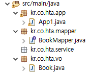

# 0708
- [0708](#0708)
- [MyBatis](#mybatis)
  - [개요](#개요)
    - [MyBatis 데이터 매퍼 서비스](#mybatis-데이터-매퍼-서비스)
    - [주요 구성요소](#주요-구성요소)
    - [MyBatis 데이터 매핑의 작동](#mybatis-데이터-매핑의-작동)
    - [Spring과 mybatis 연동](#spring과-mybatis-연동)
  - [실습](#실습)
    - [Spring-mybatis 연동](#spring-mybatis-연동)
    - [추가 기능 작성](#추가-기능-작성)

<small><i><a href='http://ecotrust-canada.github.io/markdown-toc/'>Table of contents generated with markdown-toc</a></i></small>

# MyBatis
> https://mybatis.org/mybatis-3/ko/index.html
- SQL Mapper Framework
- SQL 실행에 필요한 값을 가지고 있는 객체(파라미터 객체), SQL 실행 후 조회된 데이터를 저장할 객체(리절트 객체)을 매핑하면 PreparedStatement의 ?에 파라미터 객체의 값을 자동으로 바인딩하고 SQL 구문을 실행한 다음 실행결과가 저장된 ResuletSet의 값을 자동으로 리절트객체에 저장해서 반환한다.


## 개요
### MyBatis 데이터 매퍼 서비스
전자정부 표준 프레임워크 실행환경 교육교재 page38
* 개발자가 작성한 SQL문 혹은 저장프로시저 결과값을 자바 오브젝트에 자동 매핑하는 서비스
* 수동적인JDBC방식의 데이터처리 작업 코드와 달리 쿼리 결과와 오브젝트간 자동 매핑을 지원
* SQL문과 저장프로시저는 XML 혹은 어노테이션 방식으로 작성 가능

### 주요 구성요소
- Mapper 인터페이스
  * 테이블당 하나씩 생성한다.
  * 실행할 데이터베이스 엑세스 작업을 추상메소드를 정의한다.
  * 추상 메소드의 이름은 매핑된 SQL 구문의 아이디다.
  * 추상 메소드의 매개변수는  매핑된 SQL  구문의 파라미터 객체다.
  * 추상 메소드의 반환값은  매핑된 SQL의 리절트 객체다.
- Mapper 파일
  * 매핑된 SQL 구문(xml방식)
  * 테이블당 하나씩 생성한다.(테이블/Dao하나당 하나)
  * Mapper 인터페이스와 1:1로 연결된다.
  * Mapper 인터페이스에 정의된 추상메소드 갯수만큼 매핑된 SQL 구문을 정의한다.
  * Mapper 인터페이스에 정의된 추상메소드의 메소드 시그니처를 참조해서 매핑된 SQL 구문을 정의한다.
- Mapper 인스턴스
  * Mapper 인터페이스를 구현한 객체다.(매핑된 SQL 구문과 매핑되는 메소드)
  * SqlSession 객체가 자동으로 생성하는 객체다.
- mybatis 환경설정 파일
  * mybatis 동작을 위한 기본적인 환경설정 정보나 공통 정보를 정의한다.
  * mapper 파일을 등록한다.
- SqlSessionFactory
  * mybatis의 핵심 객체다.
  * 애플리케이션이 실행되는 동안 하나만 생성되는 객체다.
  * mybatis 설정정보를 읽어서 생성되면 매핑된 SQL 구문정보와 Mapper 인터페이스 정보를 가지고 있다.
  * 주요 API
    ```
    SqlSession openSession( )
    SqlSession openSession(boolean autoCommit)
    ```
- SqlSession
  * SqlSessionFactory로부터 획득한다.
  * 데이터베이스 엑세스 작업을 할 때마다 획득하고 반환한다.
  * 데이터베이스 엑세스 작업을 지원하는 메소드를 제공한다.
  * 매핑된 SQL 구문을 실행하는 Mapper 인터페이스의 구현객체를 제공한다.
  * 주요  API
    ```
    <T> T 		selectOne(String id, Object parameter)
    <T> List<T>	selectList(String id, Object parameter)
    int			insert(String id, Object parameter)
    int 			update(String id, Object parameter)
    int 			delete(String id, Object parameter)
        <T> T          getMapper(Class<T> classType)
    ```

### MyBatis 데이터 매핑의 작동

* MyBatis에서 개발자가 mapper파일(SQL구문), Mapper인터페이스(메소드), config파일(환경설정 및 파일 정보)을 작성하면 
* SqlSessionFactory가 SqlSession객체를 제공한다.
* SqlSession은 mapper파일과 Mapper인터페이스를 합쳐서 Mapper객체(매핑된 SQL구문 구현 메소드)를 만들어 제공한다.

### Spring과 mybatis 연동

* 스프링과 mybatis 연동했을 때 스프링 컨테이너 내부에 저장된 객체들 
  ```
  [PopertySourcesPlaceholderConfigurer#0,		- database.properties 파일정보를 관리하는 객체

  dataSource,									- Connection Pool 객체
  sqlSessionFactory,							- mybatis 핵심 객체, SqlSessionFactory 객체
  MapperScannerConfigurer#0,					- Mapper  인터페이스를 스캔해서 Mapper인터페이스 구현객체를 생성하고 스프링의 빈으로 등록하는 객첵

  internalConfigurationAnnotationProcessor,		- 어노테이션을 분석해서 빈 자동 등록, 의존성 자동주입을 지원하는 객체
  internalAutowiredAnnotationProcessor,
  internalRequiredAnnotationProcessor,
  internalEventListenerProcessor,
  internalEventListenerFactory,

  bookService,								- BookService 객체, @Service 어노테이션으로 자동 스캔해서 등록시킨 객체
  bookMapper]								- MapperScannerConfigurer 객체가 BookMapper 인터페이스를 구현하고, 스프링 빈으로 등록한 객체
  ```

## 실습
### Spring-mybatis 연동
* pom.xml 수정, log4j2 추가
  * artifactId 수정
    * `<artifactId>spring-mybatis</artifactId>`
  * Maven Repository - 의존성 추가
    > mybatis 라이브러리 의존성 추가 https://mvnrepository.com/artifact/org.mybatis/mybatis/3.5.10  
    > mybatis와 스프링 연동을 지원하는 라이브러리 의존성 추가 https://mvnrepository.com/artifact/org.mybatis/mybatis-spring/2.0.7
  * log4j2 추가
    ```xml
    <?xml version="1.0" encoding="utf-8" ?>
    <configuration status="warn">
      <Appenders>
            <Console name="console" target="SYSTEM_OUT">
                <PatternLayout pattern="%d{yyyy-MM-dd hh:mm:ss} %5p [%c] %m%n"/>
            </Console>
        </Appenders>
        
        <loggers>
            <root level="debug" additivity="true">
                <AppenderRef ref="console"/>
            </root>
        </loggers>
    </configuration>
    ```
1. 패키지 생성 및 자바파일(Value Object, Mapper 인터페이스) 작성
   1. pakage : kr.co.hta.mapper, kr.co.hta.service, kr.co.hta.vo, kr.co.hta.app  
      * 
   2. VO : kr.co.hta.vo/Book.java
      ```java
      public class Book {

        private int no;
        private String title;
        private String author;
        private String publisher;
        private String description;
        private int price;
        private int discountPrice;
        private String onSell;
        private int stock;
        private Date createdDate;
        private Date updatedDate;
      }
      ```
      * constructor, getter&setter, toString 추가
   3. Mapper interface : kr.co.hta.mapper/BookMapper.java
      ```java
      @Mapper
      public interface BookMapper {

        void insertBook(Book book);
        void deleteBookByNo(int no);
        void updateBook(Book book);
        List<Book> getAllbooks();
        Book getBookByNo(int no);
      }

      ```
2. BookMapper.xml
    ```java
    <?xml version="1.0" encoding="UTF-8"?>
    <!DOCTYPE mapper PUBLIC "-//mybatis.org//DTD Mapper 3.0//EN" "http://mybatis.org/dtd/mybatis-3-mapper.dtd" >
    <!-- 
      mapper태그
        매핑된 SQL구문을 포함하는 태그
          이 매퍼파일과 대응되는 Mapper인터페이스에 정의된 추상메소드를 참조해서 SQL구문을 작성한다.
        namespace 속성
          이 매퍼파일과 대응되는 Mapper인터페이스의 이름을 설정한다.
    -->
    <mapper namespace="kr.co.hta.mapper.BookMapper">

      <insert id="insertBook" parameterType="kr.co.hta.vo.Book">
        insert into store_books
        (book_no, book_title, book_author, book_publisher, book_description, book_price, book_discount_price, book_stock)
        values
        (store_books_seq.nextval, #{title}, #{author}, #{publisher}, #{description}, #{price}, #{discountPrice}, #{stock})
      </insert>
      
      <delete id="deleteBookByNo" parameterType="int">
        delete from store_books
        where book_no = #{value}
      </delete>
      
      <update id="updateBook" parameterType="kr.co.hta.vo.Book">
        update store_books
        set
          book_title = #{title},
          book_author = #{author},
          book_publisher = #{publisher},
          book_description = #{description},
          book_price = #{price},
          book_discount_price = #{discountPrice},
          book_on_sell = #{onSell},
          book_stock = #{stock},
          book_updated_date = sysdate
        where
          book_no = #{no}			
      </update>
      
      <select id="getAllbooks" resultType="kr.co.hta.vo.Book">
        select
          book_no 			as no,
          book_title 			as title,
          book_author 		as author,
          book_publisher 		as publisher,
          book_description 	as description,
          book_price 			as price,
          book_discount_price as discountPrice,
          book_on_sell 		as onSell,
          book_stock 			as stock,
          book_created_date 	as createdDate,
          book_updated_date 	as updatedDate
        from
          store_books
        order by
          book_no desc
      </select>
      
      <select id="getBookByNo" parameterType="int" resultType="kr.co.hta.vo.Book">
        select
          book_no 			as no,
          book_title 			as title,
          book_author 		as author,
          book_publisher 		as publisher,
          book_description 	as description,
          book_price 			as price,
          book_discount_price as discountPrice,
          book_on_sell 		as onSell,
          book_stock 			as stock,
          book_created_date 	as createdDate,
          book_updated_date 	as updatedDate
        from
          store_books
        order by
          book_no desc
        where
          book_no = #{value}
      </select>

    </mapper>

    ```
    * Exception
      * resultType을 작성하지 않으면 exception이 발생한다. 
        * Could not resolve type alias ''. 
      * id를 BookMapper.java와 일치시키지 않으면 에러가 발생한다.(getAllbooks 를 getAllBook으로 적었다.)
        * Invalid bound statement (not found): 
3. mybatis-config.xml
    ```xml
    <?xml version="1.0" encoding="UTF-8"?>
    <!DOCTYPE configuration PUBLIC "-//mybatis.org//DTD Config 3.0//EN" "http://mybatis.org/dtd/mybatis-3-config.dtd" >
    <configuration>
      <settings>
        <!-- mybatis 실행 로그를 Log4j2 로깅 라이브러리를 사용해서 출력한다 -->
        <setting name="logImpl" value="LOG4J2" />
        <!--
          null값이 허용된 컬럼에 null값이 저장될 때 JDBC 타입을 요규ㅜ하게 되는데, NULL, VARCHAR, OTHER 중 하나를 지정해야 한다.
          VARCHAR는 null값이 허용되는 컬럼의 타입이 char, varchar2 등 캐릭터 타입일 때 NULL값을 저장한다.
          OTHER은 null값이 허용되는 컬럼의 타입이 char, varchar2 텍스트타입이 아닌 다른 타입일 때 NULL값을 저장한다.
          NULL은 null값이 허용되는 컬럼의 타입과 상관없이 NULL값이 저장되게 한다.
        -->
            <setting name="jdbcTypeForNull" value="NULL" />
        </settings>
    </configuration>
    ```
    * setting name은 정해져 있다.
      > https://mybatis.org/mybatis-3/ko/configuration.html#settings
4. context.xml
   1.  namespace 설정 - mybatis-spring, context 체크
   ```xml
    <?xml version="1.0" encoding="UTF-8"?>
    <beans xmlns="http://www.springframework.org/schema/beans"
      xmlns:xsi="http://www.w3.org/2001/XMLSchema-instance"
      xmlns:mybatis-spring="http://mybatis.org/schema/mybatis-spring"
      xmlns:context="http://www.springframework.org/schema/context"
      xsi:schemaLocation="http://mybatis.org/schema/mybatis-spring http://mybatis.org/schema/mybatis-spring-1.2.xsd
        http://www.springframework.org/schema/beans http://www.springframework.org/schema/beans/spring-beans.xsd
        http://www.springframework.org/schema/context http://www.springframework.org/schema/context/spring-context-4.3.xsd">

      <context:property-placeholder location="classpath:/database.properties"/>
      
      <bean id="dataSource" class="org.apache.commons.dbcp2.BasicDataSource">
        <property name="driverClassName" value="${db.driverClassName}"></property>
        <property name="url" value="${db.url}"></property> 
        <property name="username" value="${db.username}"></property> 
        <property name="password" value="${db.password}"></property>		
      </bean>
      
      <!-- 
        mybatis 핵심객체 SqlSessionFactory를 스프링 컨테이너의 빈으로 등록하기
          SqlSessionFactoryBean
            - SqlSessionFactory객체를 생성해서 스프링의 빈으로 등록시키는 객체다.
            - xxxFactoryBean클래스는 xxxFactoryBean이 스프링 컨테이너의 빈으로 등록되는 것이 아니라,
              xxxFactoryBean이 내부적으로 생성해서 반환하는 객체가 스프링의 컨테이너의 빈으로 등록된다.
              - dataSource : Connection Pool 객체 의존성 주입
              - configLocation : mybatis 환경설정파일의 위치값 의존성 주입
              - mapperLocations : mapper 파일 정보 의존성 주입
      -->
      <bean id="sqlSessionFactory" class="org.mybatis.spring.SqlSessionFactoryBean">
        <property name="dataSource" ref="dataSource"></property>
        <property name="configLocation" value="classpath:/mybatis/mybatis-config.xml"></property>
        <property name="mapperLocations" value="classpath:/mybatis/mappers/*.xml"></property>	 	
      </bean>
      
      <!-- 
        <mybatis-spring:scan />
          - MapperScannerConfigurer객체를 스프링컨테이너의 빈으로 등록시키는 태그
            * Mapper 인터페이스를 스캔해서 Mapper 인스턴스(Mapper 인터페이스의 구현객체)를 생성하고, 스프링 컨테이너의 빈을 등록시키는 객체
          - 의존성 주입
            base-package : Mapper 인터페이스가 정의된 패키지 경로를 의존성 주입
            factory-ref : mybatis 핵심객체(SqlSessionFactory 객체)의 빈 아이디를 의존성 주입
        -->
      <mybatis-spring:scan base-package="kr.co.hta.mapper" factory-ref="sqlSessionFactory"/>
      
      <!-- 
        의존성 자동주입과 빈 자동 등록 설정
      -->
      <context:annotation-config/>	 
      <context:component-scan base-package="kr.co.hta" />
    </beans>
   ```
5. 실행해보기
   * mybatis-config.xml
     * 실행 로그를 Log4j2 로깅라이브러리로 출력할 수 있게 setting
     ```xml
      <?xml version="1.0" encoding="UTF-8"?>
      <!DOCTYPE configuration PUBLIC "-//mybatis.org//DTD Config 3.0//EN" "http://mybatis.org/dtd/mybatis-3-config.dtd" >
      <configuration>
        <settings>
          <!-- mybatis 실행 로그를 Log4j2 로깅 라이브러리를 사용해서 출력한다 -->
          <setting name="logImpl" value="LOG4J2" />
          <!--
            null값이 허용된 컬럼에 null값이 저장될 때 JDBC 타입을 요구하게 되는데, NULL, VARCHAR, OTHER 중 하나를 지정해야 한다.
            VARCHAR는 null값이 허용되는 컬럼의 타입이 char, varchar2 등 캐릭터 타입일 때 NULL값을 저장한다.
            OTHER은 null값이 허용되는 컬럼의 타입이 char, varchar2 텍스트타입이 아닌 다른 타입일 때 NULL값을 저장한다.
            NULL은 null값이 허용되는 컬럼의 타입과 상관없이 NULL값이 저장되게 한다.
          -->
              <setting name="jdbcTypeForNull" value="NULL" />
          </settings>
      </configuration>
     ```
   * App1.java
     * context.xml의 소스를 로드하고 BookMapper의 getAllbooks()로 모든 책 정보 가져오기.
      ```java
      public class App1 {
        
        public static void main(String[] args) {
          
          String resource = "context.xml";
          ApplicationContext context = new ClassPathXmlApplicationContext(resource);
          
          BookMapper bookMapper = context.getBean(BookMapper.class);
          List<Book> books = bookMapper.getAllbooks();
          System.out.println(books);
        }

      }
      ```
     * 

### 추가 기능 작성
1. 새 책 추가(App2)
2. 책 삭제(App3)
3. 가격으로 책 조회(App4)
4. 책 목록 조회(App5)

* vo 추가
  * Criteria.java
    ```java
    private String option;
    private String keyword;
    private int minPrice;
    private int maxPrice;
    private Date beginDate;
    private Date endDate;
    private String sort;
    private String direction;
    ``` 
 
* BookService.java
  * Exception가 발생할 수 있는 상황에 대해 유효한 상황 또는 값에 대해 bookMapper의 메소드를 실행시킨다.
    ```java
    @Autowired
      private BookMapper bookMapper;
      
      public void addNewBook(Book book) {
        
        List<Book> books = bookMapper.getAllBooks();
        Book foundBook = null;
        for (Book item : books) {
          if (item.getTitle().equals(book.getTitle())) {
            foundBook = item;
            break;
          }
        }
        
        if (foundBook == null) {
          bookMapper.insertBook(book);
        } else {
          foundBook.setStock(foundBook.getStock() + book.getStock());
          bookMapper.updateBook(foundBook);
        }
      }
      
      public void deleteBook(int bookNo) {
        Book book = bookMapper.getBookByNo(bookNo);
        
        if (book == null) {
          throw new RuntimeException("["+bookNo+"]번 책 정보가 존재하지 않습니다.");
        }
        
        if (book.getStock() > 0) {
          throw new RuntimeException("재고가 아직 남아있습니다.");
        }
        
        bookMapper.deleteBookByNo(bookNo);
      }
      
      public List<Book> searchBooksByPrice(int minPrice, int maxPrice) {
        if (minPrice > maxPrice) {
          throw new RuntimeException("유효한 범위의 가격이 아닙니다.");
        }
        if (maxPrice <= 0) {
          throw new RuntimeException("유효한 범위의 가격이 아닙니다.");
        }
        
        return bookMapper.getBooksByPrice(minPrice, maxPrice);
      }
      
      public List<Book> searchBooks(Criteria criteria) {
        return bookMapper.searchBooks(criteria);
      }
    ```
  * BookMapper.java, BookMapper.xml
    ```java
    List<Book> getBooksByPrice(@Param("minPrice") int minPrice, @Param("maxPrice") int maxPrice);
    List<Book> searchBooks(Criteria criteria);
    ```
    ```xml
    <!-- 
      List<Book> getBooksByPrice(@Param("minPrice") int minPrice, @Param("maxPrice") int maxPrice);
    -->
    <select id="getBooksByPrice" resultType="kr.co.hta.vo.Book">
      select
        book_no 			as no,
        book_title 			as title,
        book_author 		as author,
        book_publisher 		as publisher,
        book_description 	as description,
        book_price 			as price,
        book_discount_price as discountPrice,
        book_on_sell 		as onSell,
        book_stock 			as stock,
        book_created_date 	as createdDate,
        book_updated_date 	as updatedDate
      from
        store_books
      where
        book_price >= #{minPrice} and book_price &lt;= #{maxPrice}
    </select>
    
    <select id="searchBooks" parameterType="kr.co.hta.vo.Criteria" resultType="kr.co.hta.vo.Book">
      select
        book_no 			as no,
        book_title 			as title,
        book_author 		as author,
        book_publisher 		as publisher,
        book_description 	as description,
        book_price 			as price,
        book_discount_price as discountPrice,
        book_on_sell 		as onSell,
        book_stock 			as stock,
        book_created_date 	as createdDate,
        book_updated_date 	as updatedDate
      from
        store_books
      <where>
        <if test="option == '제목'">
          book_title like '%' || #{keyword} || '%'
        </if>
        <if test="option == '저자'">
          book_author like '%' || #{keyword} || '%'
        </if>
        <if test="option == '출판사'">
          book_publisher like '%' || #{keyword} || '%'
        </if>
        <if test="option == '가격'">
          book_price >= #{minPrice} and book_price &lt;= #{maxPrice}
        </if>
        <if test="option == '등록일'">
          book_created_date >= ${beginDate} and book_created_date &lt;= #{endDate}
        </if>
      </where>
    </select>
    ```
* 실행해보기
  * log4j2 수정(debug > info, logger) 
    ```java
    <loggers>
      <logger name="kr.co.hta.mapper" level="trace" />
    
        <root level="info" additivity="true">
            <AppenderRef ref="console"/>
        </root>
    </loggers>
    ```
  * App2.java
    ```java
    String resource = "context.xml";
    ApplicationContext context = new ClassPathXmlApplicationContext(resource);

    BookService bookService = context.getBean(BookService.class);
    
    Book book = new Book();
    book.setTitle("마이크로서비스 인 액션");
    book.setAuthor("모건 브루스");
    book.setPublisher("위키북스");
    book.setDescription("올바른 마이크로서비스 도입을 위한 완벽 실용서");
    book.setPrice(32000);
    book.setDiscountPrice(29000);
    book.setStock(10);
    
    bookService.addNewBook(book);
    ```
  * App3.java
    ```java
    String resource = "context.xml";
    ApplicationContext context = new ClassPathXmlApplicationContext(resource);

    BookService bookService = context.getBean(BookService.class);
    
    bookService.deleteBook(110041);
    ```
  * App4.java
    ```java
    String resource = "context.xml";
    ApplicationContext context = new ClassPathXmlApplicationContext(resource);
    BookService bookService = context.getBean(BookService.class);
    
    List<Book> books = bookService.searchBooksByPrice(10000, 50000);
    System.out.println(books);
    ```
  * App5.java
    ```java
    String resource = "context.xml";
    ApplicationContext context = new ClassPathXmlApplicationContext(resource);
    BookService bookService = context.getBean(BookService.class);
    
    Criteria criteria = new Criteria();
    criteria.setOption("제목");
    criteria.setKeyword("자바");
    
    List<Book> books = bookService.searchBooks(criteria);
    System.out.println(books);
    ```
* 실행결과
  * App2
    * 
  * App3
    * 
  * App4
    * 
  * App5
    * 