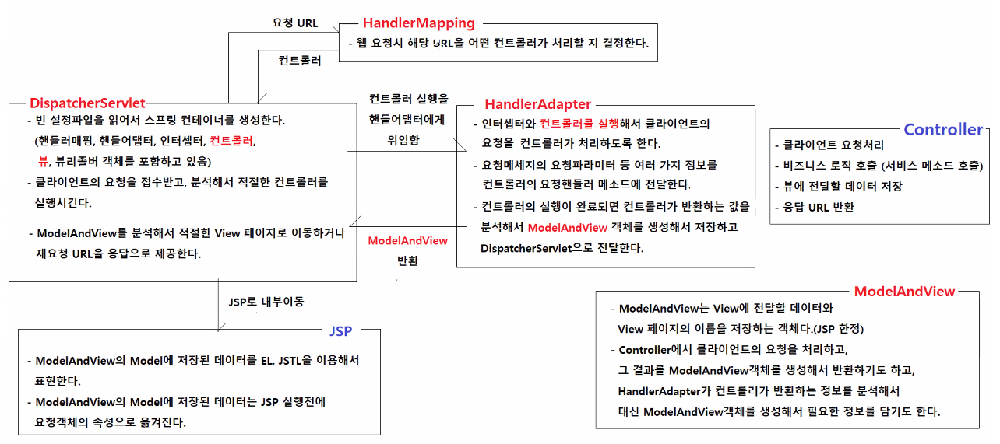
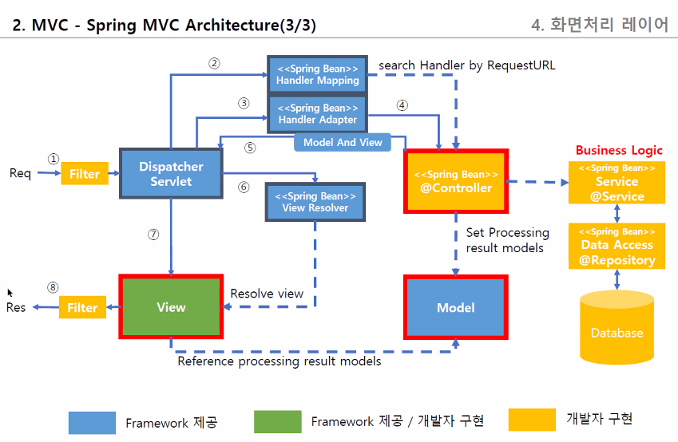
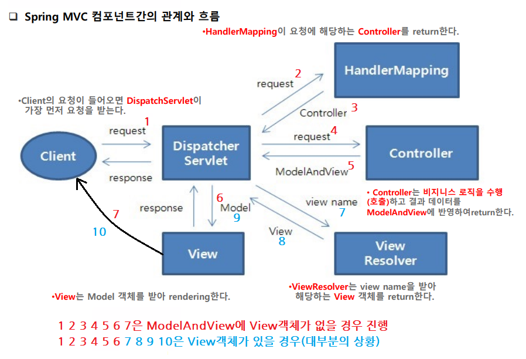
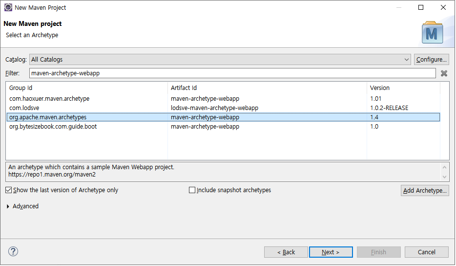
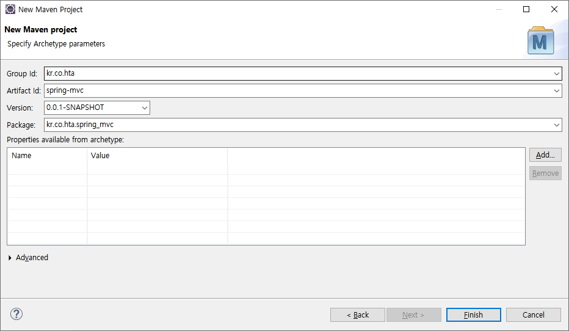
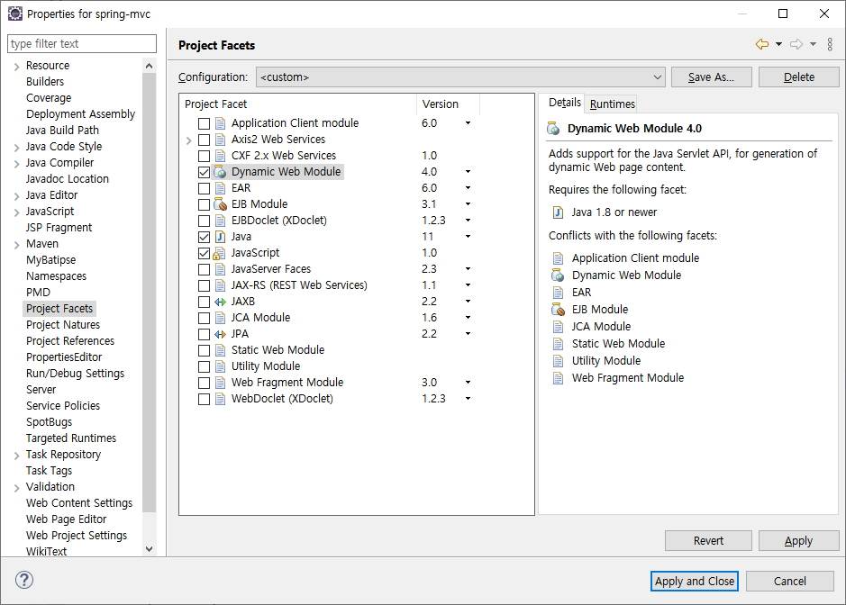
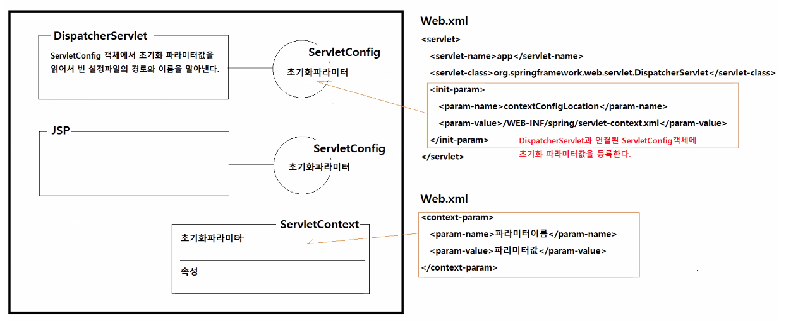

# 0712
- [0712](#0712)
- [Spring Web](#spring-web)
  - [MVC 패턴](#mvc-패턴)
  - [Spring MVC 주요 컴포넌트](#spring-mvc-주요-컴포넌트)
    - [동작 과정, 아키텍쳐](#동작-과정-아키텍쳐)
  - [프로젝트 실습](#프로젝트-실습)

<small><i><a href='http://ecotrust-canada.github.io/markdown-toc/'>Table of contents generated with markdown-toc</a></i></small>

# Spring Web
Model2 MVC 패턴을 사용한 스프링 웹 애플리케이션
## MVC 패턴
* Model
  1. 비즈니스 로직 수행, 뷰에 표현할 데이터 제공
  2. 데이터 그 자체(HttpServletRequest의 속성들)
  * 예시
    * Service 클래스, Dao클래스, Mapper 인터페이스
* Controller
  * 클라이언트의 요청 처리
  * Model과 View의 중계역할
    * 사용자의 요청을 받아 Model에 변경된 상태를 반영하고, 응답을 위한 view를 선택한다.
  * 예시
    * 사용자 정의 Controller 클래스
* View
  * Model의 데이터를 표현
  * Model이 데이터를 다양한 형식의 컨텐츠로 변환하는 객체 
    * 클라이언트의 파일 다운로드 요쳥(Model의 데이터 - xml, 엑셀, png...) > view는 데이터를 맞게 변환
  * 하나의 Model을 다양한 View에서 사용할 수 있다.
  * 예시
    * JSP, thymeleaf, JSONView, ExcelView, DownloadView
* FrontController
  * Controller와 View 사이의 중계역할
  * Spring에서는 DispatcherServlet이 FrontController 역할을 담당한다.
## Spring MVC 주요 컴포넌트
* DispatcherServlet
  * 스프링 MVC에서 FrontController의 역할을 수행하는 서블릿
  * 빈 설정파일을 읽어서 스프링 컨테이너를 생성한다.
    * HandlerMapping, HandlerAdapter, Intercepter, Controller, View, ViewResolver 객체를 포함하고 있다.
  * 클라이언트의 요청을 접수받고, 분석해서 적절한 컨트롤러를 실행시킨다.
  * 컨트롤러가 반환하는 ModelAndView를 분석해 적절한 응답 컨텐츠를 제공한다.
    * 컨트롤러의 실행이 완료되면 응답컨텐츠를 제공하는 뷰를 실행해서 클라이언트에게 응답이 보여지게 된다.
* HandlerMapping
  * 웹 요청시 해당 URL을 어떤 컨트롤러가 처리할 지 결정한다.
  * `HandlerExecutionChain getHandler(HttpServletRequest request) throws Exception;`
	* 요청 URL을 분석해서 적절한 컨트롤러 혹은 요청핸들러를 실행하는 HandlerExecutionChain객체를 반환한다. 
	* HandlerExecutionChain객체는 요청 처리와 관련된 인터셉터, 요청핸들러 정보를 가지고 포함하고 있는 객체다.
	* 대표적인 구현 클래스
		- RequestMappingHandlerMapping
  		- @RequestMapping, @GetMapping, @PostMapping, @PutMapping, @DeleteMapping 등 어노테이션 기반 매핑정보를 분석한다.
* HandlerAdapter
  * 인터셉터와 컨트롤러를 실행해서 클라이언트의 요청을 컨트롤러가 처리하도록 한다.
  * 요청메세지의 요청파라미터 등 여러 가지 정보를 컨트롤러의 요청핸들러 메소드에 전달한다.
  * 컨트롤러의 실행이 완료되면 컨트롤러가 반환하는 값을 분석해서 ModelAndView 객체를 생성해서 저장하고 DispathcerServlet으로 전달한다.
  * `ModelAndView handle(HttpServletRequest request, HttpServletResponse response, Object handler)`
	* HandlerExecutionChain에 포함된 요청핸들러를 실행하는 객체다.
	* 요청핸들러 메소드의 매개변수를 분석해서 매개변수의 인자로 전달한다.
	* 요청처리에 필요한 요청파라미터를 요청핸들러 메소드의 매개변수 인자로 전달한다.
	* 요청핸들러 메소드가 반환하는 정보로 적절한 ModelAndView객체를 DispatcherServlet에게 반환한다.
	* 대표적인 구현 클래스
		- RequestMappingHandlerAdapter
  		- RequestMappingHandlerMapping과 함께 사용되는 HandlerAdapter다
* Controller
  * 클라이언트 요청처리
  * 비즈니스 로직 호출(서비스 메소드 호출)
  * 뷰에 전달할 데이터 저장
  * 응답 URL반환
* ModelAndView 클래스
  * View에 전달할 데이터(Model)와 View 페이지의 이름을 저장하는 객체(JSP에서만)
    * Controller 수행 결과를 반영하는 Model데이터 객체와 이동할 페이지 정보(or View)로 구성
  * Controller에서 클라이언트의 요청을 처리하고, 그 결과를 ModelAndView객체를 생성해서 반환하기도 하고, 
  * HandlerAdapter가 컨트롤러가 반환하는 정보를 분석해서 대신 ModelAndView객체를 생성해서 필요한 정보를 담기도 한다.
* JSP 
  * View가 아니고 ViewTemplate
  * ModelAndView의 Model에 저장된 데이터를 EL, JSTL을 이용해서 표현한다.
  * ModelAndView의 Model에 저장된 데이터는 JSP 실행 전에 요청객체의 속성으로 옮겨진다.
- View 인터페이스
	- `void render(Map<String, ?> model, HttpServletRequest request, HttpServletResponse response) throws Exception;`
	* render() 메소드는 데이터를 특정한 타입의 컨텐츠로 변환해서 응답으로 보내는 메소드다.
	* model은 업무로직 수행결과로 획득한 데이터다.
	* request와 response는 클라이언트에게 응답을 보낼 때 필요한 정보나 메소드를 획득 실행하기 위해서 사용된다.	
	* DispatcherServlet이 컨트롤러의 요청핸들러 메소드를 실행하면 ModelAndView객체를 획득한다.
	* DispatcherServlet은 ModelAndView객체에서 View객체를 꺼내고, View객체의 render() 메소드를 실행한다.
	* render()메소드를 실행할 때, ModelAndView객체의 Model와 request, response를 메소드의 인자로 전달한다.
	* 스프링 MVC에서 모든 요청에 대한 응답은 항상 View객체의 render()메소드를 실행시켜서 제공된다.
	* 따라서, DispatcherServlet은 View객체가 필수적으로 필요하고, 만약 ModelAndView객체에 뷰이름이 저장되어 있으면 ViewResolver의 resolveViewName()메소드를 실행해서 적절한 View객체를 획득해야 한다.
	* 대표적인 구현클래스
		- InternalResourceView
		  * JSP로 내부이동하는 View다. 결과적으로 JSP가 실행되고, HTML 컨텐츠가 응답으로 보내진다.
		- JstlView
		  * JSP로 내부이동하는 View다. 결과적으로 JSP가 실행되고, HTML 컨텐츠가 응답으로 보내진다.
		- RedirectView
		  * 재요청 URL을 응답으로 보내는 View다.
- ViewResolver 인터페이스
  - `View resolveViewName(String viewName, Locale locale) throws Exception;`
	* 뷰이름을 전달받으면 적절한 View객체를 찾아서 반환하는 메소드다.	
	* DispatcherServlet이 컨트롤러의 요청핸들러 메소드를 실행하고 획득한 ModelAndView객체에 View객체 대신 뷰이름이 들어있으면 ViewResolver의 resolveViewName()메소드를 실행해서 적절한 View객체를 제공받아서 해당 View객체의 render() 메소드를 실행한다.	
	* 대표적인 구현클래스
		- InternalResourceViewResolver
		  * JSP를 기반으로 하는 웹 애플리케이션에서 DispatcherServlet의 기본 ViewResolver다.
		  * JSP로 내부이동시켜주는 View(InternalResourceView나 JstlView) 혹은 재요청URL을 응답으로 제공한 View(RedirectView)를 반환한다.

### 동작 과정, 아키텍쳐

  * DispatcherServlet가 요청 URL을 HandlerMapping에게 전달하면 HandlerMapping이 처리할 컨트롤러를 결정해 DispatcherServlet에게 알려준다
  * DispatcherServlet은 HandlerAdapter에게 컨트롤러의 실행을 위임한다.
  * HandlerAdapter는 ModelAndView를 DispatcherServlet에게 반환한다.
  * DispatcherServlet은 ModelAndView를 분석해서 적절한 View페이지로 이동하거나 재요청 URL을 응답으로 제공한다.
  * JSP로 내부이동
  * 파란색 글자인 JSP와 Controller를 개발자가 구현하고 다른 요소들은 Framework가 제공한다.




## 프로젝트 실습
* Maven project 생성(simple project 체크 x)
  * 
  * 
* 라이브러리 의존성 추가
  * javax.servlet-api
    * >https://mvnrepository.com/artifact/javax.servlet/javax.servlet-api/4.0.1
    * scope provided : 톰캣에 내장된(제공된) 라이브러리가 있을 경우 추가한 라이브러리를 사용하지 않는다.
  * javax.servlet.jsp-api
    * >https://mvnrepository.com/artifact/javax.servlet.jsp/javax.servlet.jsp-api/2.3.3
  * JSTL
    * >https://mvnrepository.com/artifact/javax.servlet/jstl
  * spring web mvc
    * >https://mvnrepository.com/artifact/org.springframework/spring-webmvc/5.2.22.RELEASE
  * logging(log4j2)관련
    * commons-logging, log4j-api, log4j-core, log4j-web, log4j-jcl
  * pom.xml 코드
    ```xml
    <?xml version="1.0" encoding="UTF-8"?>

    <project xmlns="http://maven.apache.org/POM/4.0.0"
      xmlns:xsi="http://www.w3.org/2001/XMLSchema-instance"
      xsi:schemaLocation="http://maven.apache.org/POM/4.0.0 http://maven.apache.org/xsd/maven-4.0.0.xsd">
      <modelVersion>4.0.0</modelVersion>

      <groupId>kr.co.hta</groupId>
      <artifactId>spring-mvc</artifactId>
      <version>0.0.1-SNAPSHOT</version>
      <packaging>war</packaging>

      <name>spring-mvc Maven Webapp</name>
      <!-- FIXME change it to the project's website -->
      <url>http://www.example.com</url>

      <properties>
        <project.build.sourceEncoding>UTF-8</project.build.sourceEncoding>
        <maven.compiler.source>11</maven.compiler.source>
        <maven.compiler.target>11</maven.compiler.target>
        <log4j.version>2.18.0</log4j.version>
      </properties>

      <dependencies>
        <!-- https://mvnrepository.com/artifact/org.springframework/spring-webmvc -->
        <dependency>
          <groupId>org.springframework</groupId>
          <artifactId>spring-webmvc</artifactId>
          <version>5.2.22.RELEASE</version>
        </dependency>
        
        <dependency>
          <groupId>commons-logging</groupId>
          <artifactId>commons-logging</artifactId>
          <version>1.2</version>
        </dependency>
        <dependency>
          <groupId>org.apache.logging.log4j</groupId>
          <artifactId>log4j-api</artifactId>
          <version>${log4j.version}</version>
        </dependency>
        <dependency>
          <groupId>org.apache.logging.log4j</groupId>
          <artifactId>log4j-core</artifactId>
          <version>${log4j.version}</version>
        </dependency>
        <dependency>
          <groupId>org.apache.logging.log4j</groupId>
          <artifactId>log4j-web</artifactId>
          <version>${log4j.version}</version>
          <scope>runtime</scope>
        </dependency>
        <dependency>
          <groupId>org.apache.logging.log4j</groupId>
          <artifactId>log4j-jcl</artifactId>
          <version>${log4j.version}</version>
        </dependency>

        <!-- 서블릿관련 라이브러리 의존성 추가 -->
        <dependency>
          <groupId>javax.servlet</groupId>
          <artifactId>javax.servlet-api</artifactId>
          <version>4.0.1</version>
          <scope>provided</scope>
        </dependency>
        <!-- JSP관련 라이브러리 의존성 추가 -->
        <dependency>
          <groupId>javax.servlet.jsp</groupId>
          <artifactId>javax.servlet.jsp-api</artifactId>
          <version>2.3.3</version>
          <scope>provided</scope>
        </dependency>
        <!-- JSTL관련 라이브러리 의존성 추가 -->
        <dependency>
          <groupId>javax.servlet</groupId>
          <artifactId>jstl</artifactId>
          <version>1.2</version>
        </dependency>


      </dependencies>

      <build>
        <finalName>spring-mvc</finalName>
        <pluginManagement><!-- lock down plugins versions to avoid using Maven 
            defaults (may be moved to parent pom) -->
          <plugins>
            <plugin>
              <artifactId>maven-clean-plugin</artifactId>
              <version>3.1.0</version>
            </plugin>
            <!-- see http://maven.apache.org/ref/current/maven-core/default-bindings.html#Plugin_bindings_for_war_packaging -->
            <plugin>
              <artifactId>maven-resources-plugin</artifactId>
              <version>3.0.2</version>
            </plugin>
            <plugin>
              <artifactId>maven-compiler-plugin</artifactId>
              <version>3.8.0</version>
            </plugin>
            <plugin>
              <artifactId>maven-surefire-plugin</artifactId>
              <version>2.22.1</version>
            </plugin>
            <plugin>
              <artifactId>maven-war-plugin</artifactId>
              <version>3.2.2</version>
            </plugin>
            <plugin>
              <artifactId>maven-install-plugin</artifactId>
              <version>2.5.2</version>
            </plugin>
            <plugin>
              <artifactId>maven-deploy-plugin</artifactId>
              <version>2.8.2</version>
            </plugin>
          </plugins>
        </pluginManagement>
      </build>
    </project>

    ```
* properties 수정
  * Projecdt Facets > 
    * Dynamic Web Module version : 4.0
    * java version : 11
    * 
* build path > New Source Folder
  * src/main/java
  * src/main/resources
* 컨트롤러 생성 : kr.co.hta.web.controller/HomeController.java
  ```java
  package kr.co.hta.web.controller;

  import org.springframework.stereotype.Controller;
  import org.springframework.ui.Model;
  import org.springframework.web.bind.annotation.GetMapping;

  /*
  * @Controller
  * 		- 스프링컨테이너의 빈으로 자동 등록되게 하는 어노테이션이다.
  * 		  <context:component-scan />의 스캔 대상 어노테이션이다.
  *      - 클라이언트의 HTTP 요청을 처리하는 컨트롤러 클래스임을 나타내는 어노테이션이다.
  */
  @Controller
  public class HomeController {

    /*
    * @GetMapping
    * 		- GET방식의 요청과 요청핸들러 메소드를 매핑시키는 어노테이션이다.	 
    * 		ex>	@GetMapping("/home.hta"), @GetMapping(path = "/home.hta")
    *      - public String home() {...}이 요청핸들러 메소드다.
    * 요청핸들러 메소드
    * 		- 클라이언트의 요청을 처리하는 메소드다.
    *      - 스프링의 요청핸들러 메소드는 반환타입, 메소드명, 매개변수에 대한 특별한 제약이 없다.
    *      - 요청핸들러 메소드의 반환타입이 String이면 반환값음 뷰(뷰페이지의 이름, 리다이렉트 URL)의 이름이다.
    *      - 요청핸들러 메소드의 매개변수에 Model 타입의 변수를 정의하면 뷰페이지에 값을 전달할 때 사용하는 
    *        Model객체를 전달받을 수 있다.
    *      - Model객체에 데이터를 저장하면 JSP에서 EL, JSTL로 표현할 수 있다.
    */
    @GetMapping(path = "/home.hta")
    public String home(Model model) {
      
      model.addAttribute("message", "스프링 MVC 웹 애플리케이션에빈다.");
      
      return "home.jsp";
    }
  }

  ```
* new folder : /WEB-INF/spring/sevlet-context.xml
  ```xml
  <?xml version="1.0" encoding="UTF-8"?>
  <beans xmlns="http://www.springframework.org/schema/beans"
    xmlns:xsi="http://www.w3.org/2001/XMLSchema-instance"
    xmlns:mvc="http://www.springframework.org/schema/mvc"
    xmlns:context="http://www.springframework.org/schema/context"
    xsi:schemaLocation="http://www.springframework.org/schema/mvc http://www.springframework.org/schema/mvc/spring-mvc-4.3.xsd
      http://www.springframework.org/schema/beans http://www.springframework.org/schema/beans/spring-beans.xsd
      http://www.springframework.org/schema/context http://www.springframework.org/schema/context/spring-context-4.3.xsd">

    <!-- @Autowired를 이용한 의존성 자동 주입을 지원하는 객체를 스프링 컨테이너에 등록시킨다. -->
    <context:annotation-config />
    <!-- 지정된 패키지에서 클래스를 스캔해서 스프링 컨테이너의 객체로 자동 등록시킨다. -->
    <context:component-scan base-package="kr.co.hta.web.controller" />

    <!-- Spring MVC관련 어노테이션을 분석하고 적절한 처리를 수행하는 객체를 스프링컨테이너에 등록시킨다. -->
    <mvc:annotation-driven />
  </beans>

  ```
* /WEB-INF/web.xml
  * 웹 애플리케이션 설정 파일
  * 서블릿, 필터, 리스너, 에러페이지 등을 설정한다.
    ```xml
    <?xml version="1.0" encoding="UTF-8"?>
    <web-app xmlns:xsi="http://www.w3.org/2001/XMLSchema-instance"
      xmlns="http://xmlns.jcp.org/xml/ns/javaee"
      xsi:schemaLocation="http://xmlns.jcp.org/xml/ns/javaee http://xmlns.jcp.org/xml/ns/javaee/web-app_4_0.xsd"
      id="WebApp_ID" version="4.0">
      
      <!-- 
        <servlet />
        * 서블릿을 톰캣에 배포(등록)하는 설정
          <servlet-name>app</servlet-name>
          <servlet-class>org.springframework.web.servlet.DispatcherServlet</servlet-class>
          * DispatcherServlet을 app이라는 이름으로 톰캣에 등록시킨다.
        <init-param />
          * 서블릿의 초기화 파라미터값을 설정하는 태그다.
          * 사용자정의 스프링 빈 설정파일의 경로와 이름을 DispatcherServlet에게 전달한다.
        <load-on-startup />
          * WAS가 기동되면 서블릿객체를 생성하고, 초기화 작업을 시작하게 하는 태그다.
          * 최초요청에 대해서 실행시간이 길어질수 있는 단점을 보완하기 위해 사용한다.
          * 지정된 숫자(우선순위)가 0보다 크면 톰캣컨테이너가 실행되면서 서블릿이 초기화된다.
      -->
      <servlet>
        <servlet-name>app</servlet-name>
        <servlet-class>org.springframework.web.servlet.DispatcherServlet</servlet-class>
        <init-param>
          <param-name>contextConfigLocation</param-name>
          <param-value>/WEB-INF/spring/servlet-context.xml</param-value>
        </init-param>
        <load-on-startup>1</load-on-startup>
      </servlet>
      
      <!--
        <servlet-mapping />
        * 요청URL과 서블릿을 매핑하는 태그
            <servlet-name>app</servlet-name>
            <url-pattern>*.hta</url-pattern>
            * 요청URL의 패턴이 *.hta이면 app이라는 이름으로 배포(등록)된 서블릿이 요청을 처리한다.
      -->
      <servlet-mapping>
        <servlet-name>app</servlet-name>
        <url-pattern>*.hta</url-pattern>
      </servlet-mapping>
    </web-app>
    ```
* `<init-param>`
  * `contextConfigLocation`이란 파라미터이름을 이용해 DispatcherServlet과 연결된 ServletConfig객체에 초기화파라미터 값을 등록한다.
  * ServletConfig와 ServletContext의 초기화 파라미터값 등록
    * 
* webapp/home.jsp
  ```jsp
  <%@ page language="java" contentType="text/html; charset=UTF-8"
      pageEncoding="UTF-8"%>
  <!DOCTYPE html>
  <html>
  <head>
  <meta charset="UTF-8">
  <title>Insert title here</title>
  </head>
  <body>
    <h1>홈 페이지</h1>
    <p>${message }</p>
  </body>
  </html>
  ```
* 서버에서 프로젝트를 add하고 실행한 뒤 웹 화면(크롬)에서 스프링-mvc의 실행을 확인할 수 있다.