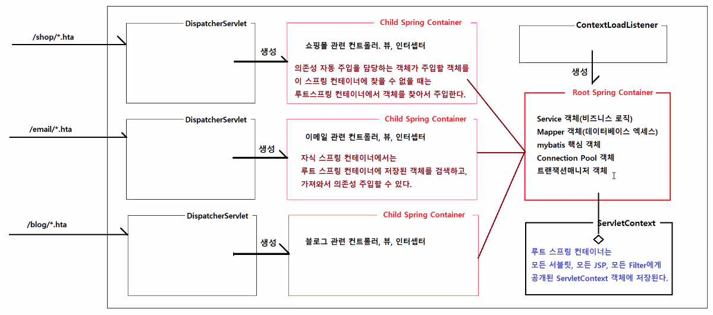

# 0713
- [0713](#0713)
- [Spring-MVC](#spring-mvc)
  - [`<filter />`](#filter-)
  - [Root Spring Container, Child Spring Container](#root-spring-container-child-spring-container)
  - [자바 웹의 주요 객체](#자바-웹의-주요-객체)
  - [실습](#실습)
  - [예외처리](#예외처리)
    - [실습 코드](#실습-코드)

<small><i><a href='http://ecotrust-canada.github.io/markdown-toc/'>Table of contents generated with markdown-toc</a></i></small>

# Spring-MVC

* Spring Container의 작동 과정

## `<filter />`
* 필터를 배포하는 태그
* CharacterEncodingFilter를 톰캣에 배포할 수 있다.
* 전역적인 설정, 공통으로 수행할 작업 세팅
  * 필터의 초기화 파라미터 값을 설정하는 태그인 `<init-param />`을 사용해 인코딩방식을 UTF-8방식으로 처리하도록 설정할 수 있다.
* web.xml에서 코드 추가
  ```xml
    <!-- 
      <filter />
        * 필터를 배포하는 태그다.
        <filter-name>encodingFilter</filter-name>
        <filter-class>org.springframework.web.filter.CharacterEncodingFilter</filter-class>
        * CharacterEncodingFilter를 encodingFilter라는 이름으로 톰캣에 배포한다.
      <init-param />
        * 필터의 초기화 파라미터값을 설정하는 태그다.
        * 인코딩방식을 UTF-8방식으로 처리하도록 설정한다.
    -->
    <filter>
      <filter-name>encodingFilter</filter-name>
      <filter-class>org.springframework.web.filter.CharacterEncodingFilter</filter-class>
      <init-param>
        <param-name>encoding</param-name>
        <param-value>UTF-8</param-value>
      </init-param>
    </filter>
    <filter-mapping>
      <filter-name>encodingFilter</filter-name>
      <url-pattern>*.hta</url-pattern>
    </filter-mapping>
  ```

## Root Spring Container, Child Spring Container

루트 스프링 컨테이너, 차일드 스프링 컨테이너
* DispatcherServlet이 만드는 스프링 컨테이너는 전용이다.
* 만약 공용으로 사용하는 기능(컨트롤러, 뷰, 인터셉터)가 있다면 Root 스프링 컨테이너에 담아 사용한다.
  * 서블릿용 컨테이너, 즉 child 스프링 컨테이너는 루트 컨테이너에서 생성한 전역적인 설정과 빈을 가져와 사용할 수 있지만 그 반대는 불가능하다.
* Root Spring Container는 ContextLoadLister가 생성하는 프로젝트 단위, 즉 애플리케이션마다 딱 하나만 생성되는 최상위 부모 컨테이너다.
  * 스프링 컨테이너의 종류
    * 루트 컨테이너
    * 각 서블릿들이 하나씩 가지는 컨테이너
    * 개발자가 만드는 컨테이너
* 컨테이너의 작동 : 톰캣 서버를 처음 구동하면, 
  1. Web.xml 파일 로딩 $\rarr$ 서블릿 컨테이너 구동
  2. 서블릿컨테이너 ContextLoaderListener 객체 생성 (web.xml 파일에 등록된)
  3. 이 때 ContextLoaderListener는 applicationContext.xml 파일을 로딩하여 스프링을 구동(Root 컨테이너)
  4. 동시에 Service 구현 클래스나 DAO 객체들이 메모리에 생성됨
  5. Clinet 요청 $\rarr$ 서블릿 컨테이너는 DispathcerServlet 객체를 생성
  6. Presnetation-layer.xml 파일을 로딩 > 두 번째 스프링 컨테이너 구동 (Controller 객체들이 메모리에 저장)

## 자바 웹의 주요 객체
* 서블릿, JSP
  * 클라이언트의 HTTP 요청을 처리하고 응답을 제공하는 객체
* 필터
  * 서블릿, JSP 실행 전, 실행 후 공통으로 수행할 작업을 필터로 구현한다.
  * 인코딩 필터, 암호화/복호화 필터, 인증/인가 관련 필터
    * 인증/인가 관련 기능은 Spring Security를 주로 사용한다.
    * 실제 개발 환경에서 필터를 잘 사용하진 않는다.
* 리스너
  * 웹 애플리케이션에서 특정 이벤트가 발생했을 때 실행할 작업을 구현하는 객체
    * ServletContext객체가 생성될때/폐기될때 이벤트 발생
      * ServletContextListner 인터페이스를 구현한 객체는 톰캣서버가 기동될 때, 톰캣서버가 종료될 때 수행할 작업을 구현할 수 있다.
      * Spring에서는 ServletContextListner인터페이스를 구현한 ContextLoaderListener를 제공한다.
      * ContextLoaderListener은 톰캣이 기동될 때 빈 설정파일을 읽어서 Root 스프링 컨테이너를 생성한다.
        ```java
        public class ContextLoaderListener implements ServletContextListener {
          public void contextInitialized(ServletContextEvent event) {
            initWebApplicationContext(event.getServletContext());
          }
        }
        ```
    * HttpServletRequest객체가 생성될때/폐기될때 이벤트 발생
    * HttpServletRequest객체에 속성이 저장될때/삭제될때 이벤트 발생
    * HttpSession객체가 생성될때/폐기될때 이벤트 발생
    * HttpSession객체의 속성이 저장될때/삭제될때/변경될때 이벤트 발생
  * ContextLoadListener(이 리스너 말고는 실제 개발 환경에서 거의 사용하지 않는다.)

## 실습

* 모든 책 조회, 책 한권 조회, 책 추가 기능을 추가한다.
  * BookController.java
    ```java
    package kr.co.hta.web.controller;

    import java.util.List;

    import org.springframework.beans.factory.annotation.Autowired;
    import org.springframework.stereotype.Controller;
    import org.springframework.ui.Model;
    import org.springframework.web.bind.annotation.GetMapping;
    import org.springframework.web.bind.annotation.PostMapping;
    import org.springframework.web.bind.annotation.RequestMapping;

    import kr.co.hta.service.BookService;
    import kr.co.hta.vo.Book;
    import kr.co.hta.web.form.BookRegisterForm;

    @Controller
    @RequestMapping("/book")
    public class BookController {

      @Autowired
      private BookService bookService;
      
      /*
      * http://localhost/spring-mvc/book/list.hta 요청을 처리하는 요청핸들러 메소드다.
      * 		요청파라미터 : 없음
      */
      @GetMapping("/list.hta")
      public String books(Model model) {
        System.out.println("BookController의 books() 메소드 실행됨");
        
        List<Book> books = bookService.getAllBooks();
        
        // 뷰에 전달할 데이터를 Model객체에 저장한다.
        model.addAttribute("bookList", books);
            
        // 뷰이름을 반환한다.
        return "list.jsp";
      }
      
      /*
      * http://localhost/spring-mvc/book/detail.hta?no=10 요청을 처리하는 요청핸들러 메소드다.
      * 		요청파라미터 : no
      */
      @GetMapping("/detail.hta")
      public String book(int no, Model model) {
        System.out.println("BookController의 book()메소드 실행됨");
        System.out.println("조회할 책번호: " + no);
        
        Book book = bookService.getBookDetail(no);
        
        model.addAttribute("book", book); 
        
        // 뷰이름을 반환
        return "detail.jsp";
      }
      
      @GetMapping("/form.hta")
      public String form() {
        // 뷰이름을 반환
        return "form.jsp";
      }
      
      @PostMapping("/add.hta")
      public String add(BookRegisterForm bookRegisterForm) {
        System.out.println("BookController의 add()메소드 실행됨");
        System.out.println("등록할 책정보: " + bookRegisterForm);
        
        bookService.addNewBook(bookRegisterForm);
        
        // 재요청 URL을 반환
        return "redirect:list.hta";
      }
    }

    ```
  * BookService.java
    ```java
    package kr.co.hta.service;

    import java.util.List;

    import org.springframework.beans.BeanUtils;
    import org.springframework.beans.factory.annotation.Autowired;
    import org.springframework.stereotype.Service;

    import kr.co.hta.mapper.BookMapper;
    import kr.co.hta.vo.Book;
    import kr.co.hta.web.form.BookRegisterForm;

    @Service
    public class BookService {

      @Autowired
      private BookMapper bookMapper;
      
      public List<Book> getAllBooks() {
        List<Book> books = bookMapper.getBooks();
        return books;
      }
      
      public Book getBookDetail(int no) {
        Book book = bookMapper.getBookByNo(no);
        return book;
      }
      
      public void addNewBook(BookRegisterForm bookRegisterForm) {
        Book book = new Book();
        BeanUtils.copyProperties(bookRegisterForm, book);
        
        int discountPrice = (int) (book.getPrice()*0.9);
        book.setDiscountPrice(discountPrice);
        
        bookMapper.insertBook(book);
      }
    }
    ```
  * BookMapper.java
    ```java
    package kr.co.hta.mapper;

    import java.util.List;

    import org.apache.ibatis.annotations.Mapper;

    import kr.co.hta.vo.Book;

    @Mapper
    public interface BookMapper {

      List<Book> getBooks();
      Book getBookByNo(int no);
      void insertBook(Book book);
      void updateBook(Book book);
    }

    ```
  * BookMapper.xml
    ```java
    <?xml version="1.0" encoding="UTF-8"?>
    <!DOCTYPE mapper PUBLIC "-//mybatis.org//DTD Mapper 3.0//EN" "http://mybatis.org/dtd/mybatis-3-mapper.dtd" >
    <mapper namespace="kr.co.hta.mapper.BookMapper">

      <!-- List<Book> getBooks(); -->	
      <select id="getBooks" resultType="kr.co.hta.vo.Book">
        select book_no as no, 
              book_title as title, 
              book_author as author,
              book_publisher as publisher,
              book_price as price
            from store_books 
            order by book_no desc
      </select>
      
      <!-- Book getBookByNo(int no); -->
      <select id="getBookByNo" parameterType="int" resultType="kr.co.hta.vo.Book">
        select book_no as no, 
              book_title as title, 
              book_author as author,
              book_publisher as publisher,
              book_description as description,
              book_price as price,
              book_discount_price as discountPrice,
              book_on_sell as onSell,
              book_stock as stock,
              book_created_date as createdDate,
              book_updated_date as updatedDate
        from store_books
        where book_no = ${value}      
      </select>
      
      <!-- void insertBook(Book book); -->
      <select id="insertBook" parameterType="kr.co.hta.vo.Book">
        insert into store_books
        (book_no, book_title, book_author, book_publisher, book_description, book_price, book_discount_price, book_stock)
        values
        (store_books_seq.nextval, #{title}, #{author}, #{publisher}, #{description}, #{price}, #{discountPrice}, #{stock})
      </select>
      
      <!-- void updateBook(Book book); -->
            
    </mapper>  
    ```
      * BookRegisterForm은 form.jsp에서 사용자가 입력하는 데이터만을 가진 클래스다.(입력폼의 입력요소 이름과 동일한 이름으로 멤버변수 선언)
* `BeanUtils.copyProperties(Object source, Object target)`메소드 활용
  * `BeanUtils.copyProperties(bookRegisterForm, book);`
  * 속성 정보를 복사해서 새로운 객체를 만드는것에 편리하게 사용할 수 있다.
  * 필드의 개수가 많으면 코드가 많아서 번거로울때 copyProperties로 편하게 필드(속성)을 복사해서 사용할 수 있다.
  * 첫 번째 인자인 source에는 getter메소드가, target에는 setter메소드가 존재하여야 한다.

## 예외처리
* 시스템 예외
  * 데이터베이스 엑세스 오류
  * 서버오류(nullpointer, numberformat, ...)
* 비즈니스로직 예외
  * 아이디 중복, 비밀번호 불일치, 잔고 부족, 재고 부족, ...
  * controller와 jsp페이지를 통해 예외처리 할 수 있다.
### 실습 코드
error/db.jsp
```jsp
<%@ page language="java" contentType="text/html; charset=UTF-8"
    pageEncoding="UTF-8"%>
<!DOCTYPE html>
<html>
<head>
    <meta charset="utf-8">
    <meta name="viewport" content="width=device-width, initial-scale=1">
    <title>Bootstrap demo</title>
    <link href="https://cdn.jsdelivr.net/npm/bootstrap@5.2.0-beta1/dist/css/bootstrap.min.css" rel="stylesheet">
  </head>
<body>
<nav class="navbar navbar-expand-sm bg-dark navbar-dark mb-3">
	<div class="container">
		<ul class="navbar-nav me-auto">
			<li class="nav-item"><a class="nav-link" href="/spring-mvc/home.hta">북스토어</a></li>
			<li class="nav-item"><a class="nav-link active" href="/spring-mvc/home.hta">홈</a></li>
			<li class="nav-item"><a class="nav-link" href="/spring-mvc/book/list.hta">도서 목록</a></li>
		</ul>
	</div>
</nav>
<div class="container mb-3">
	<div class="row my-3">
		<div class="col">
			<h1 class="fs-5 border p-2">데이터베이스 오류</h1>
		</div>
	</div>
	<div class="row">
		<div class="col">
			<div class="alert alert-danger">
				<strong>데이터베이스 오류</strong> 데이터베이스 엑세스 작업 중 오류가 발생하였습니다.
			</div>
		</div>
	</div>
</div>
<script src="https://cdn.jsdelivr.net/npm/bootstrap@5.2.0-beta1/dist/js/bootstrap.bundle.min.js"></script>
</body>
</html>
```

kr.co.hta.web.advice.ExceptionHandlerAdvice.java
```java
package kr.co.hta.web.advice;

import org.springframework.dao.DataAccessException;
import org.springframework.web.bind.annotation.ControllerAdvice;
import org.springframework.web.bind.annotation.ExceptionHandler;

/*
 * @ControllerAdvice
 * 		* 이 어노테이션이 부착된 클래스에서 구현한 내용은 모든 컨트롤러에서 적용된다.
 * 		* 예외처리, 요청파라미터값의 변환 기능등을 정의한다.
 */
@ControllerAdvice
public class ExceptionHandlerAdvice {

	/*
	 * @ExceptionHandler
	 * 		* 예외처리를 지원하는 어노테이션이다.
	 * 		* 컨트롤러에서 지정된 예외 및 그 자식 예외가 발생하면 예외처리 메소드가 실행된다.
	 */
	@ExceptionHandler(DataAccessException.class)
	public String handlerDatabaseAccessException(DataAccessException ex) {
		ex.printStackTrace();
		
		return "../error/db.jsp";
	}
	
	/*
	 * Exception 예외를 처리하는 메소드는 예상하지 못한 예외가 발생했을 때도 예외처리가 될 수 있도록 한다.
	 * 모든 예외는 Exception의 하위클래스기 때문에 어떤 예외라도 이 예외처리 메소드가 실행될 수 있다.
	 * 하지만, Exception보다 더 구체적인 예외가 존재하는 경우에는 더 구체적인 예외가 정의된 예외 처리 메소드가 실행된다.
	 */
	@ExceptionHandler(Exception.class)
	public String handlerException(Exception ex) {
		ex.printStackTrace();
		
		return "../error/db.jsp";
	}
}

```