# 0714
- [0714](#0714)
- [관점지향 프로그래밍](#관점지향-프로그래밍)
  - [Advice](#advice)
    - [Pointcut](#pointcut)
    - [@Aspect](#aspect)
    - [Around](#around)
  - [실습](#실습)
    - [코드](#코드)
- [Spring Boot](#spring-boot)
  - [특징](#특징)
    - [CoC 패러다임](#coc-패러다임)
    - [스프링 부트의 장점](#스프링-부트의-장점)
    - [@RestController](#restcontroller)
  - [실습](#실습-1)

<small><i><a href='http://ecotrust-canada.github.io/markdown-toc/'>Table of contents generated with markdown-toc</a></i></small>

# 관점지향 프로그래밍
Aspect Oriented Programming(AOP)
* 관점(Aspect)
  * 하나의 메소드에 구현된 소스코드를 공통기능 소스와 핵심기능 소스로 구분해서 바라보는 시각  
  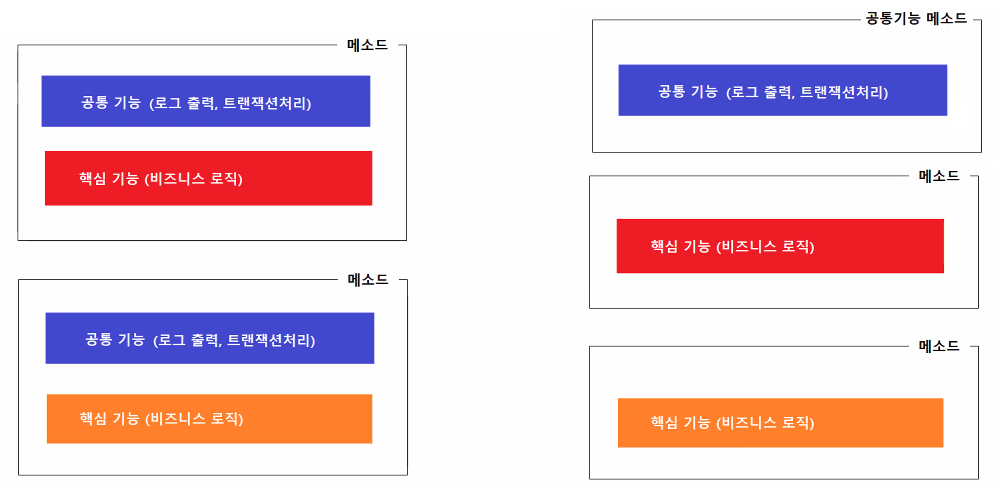
* 관점지향프로그래밍
  * 핵심기능과 공통기능을 분리하고 핵심기능이 실행될 때 분리해 놓은 공통기능이 함께 실행되도록 하는 프로그래밍  
  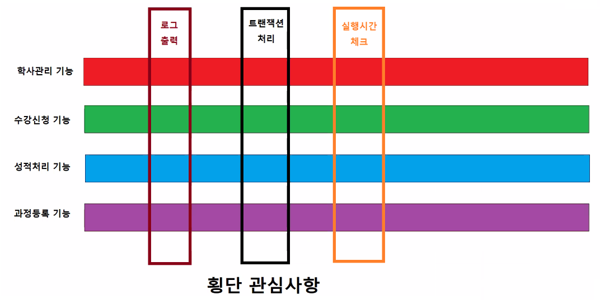
    * 횡단 관심사항(세로줄 요소), 핵심 관심사항(가로줄 요소)
* 주요 구성 요소
  * **Advice**
    * 핵심기능이 실행될 때 함께 실행할 공통 기능
    * What(실행할 공통기능) + When(실행 시점)을 포함하고 있다.
  * **Pointcut**
    * Advice 적용규칙
    * Where(공통기능이 적용되는 핵심기능 메소드)
  * Aspect
    * 관점지향프로그램 적용을 위한 구성 세트(Advice와 Pointcut을 합친 것)
    * where + what + when가 한 세트  
    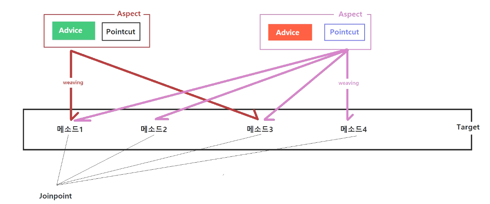
  * Weaving
    * Target에 Aspect를 적용하는 행위
    * Weaving의 결과로 생성되는 것이 Proxy객체다.
  * Proxy
    * Target에 Advice가 포함된 새로운 객체(Target을 대신한다.)

## Advice
* Advice 결합점 결합 타입(실행 시점-When)
  * **Before advice**: joinpoint 전에 수행되는 advice
  * **After returning advice**: joinpoint가 성공적으로 리턴된 후에 동작하는 advice
  * **After throwing advice**: 예외가 발생하여 joinpoint가 빠져나갈때 수행되는 advice
  * **After advice**: join point를 빠져나가는(정상적이거나 예외적인 반환) 방법에 상관없이 수행되는 advice
  * **Around advice**: joinpoint 전, 후에 수행되는 advice
### Pointcut
> 전자정부 표준프레임워크 실행환경_교육교재 P.102
* Pointcut 지정자
  - **execution**: 메소드 실행 결합점(join points)과 일치시키는데 사용된다.
  - **within**: 특정 타입에 속하는 결합점을 정의한다.
  - **this**: 빈 참조가 주어진 타입의 인스턴스를 갖는 결합점을 정의한다.
  - **target**: 대상 객체가 주어진 타입을 갖는 결합점을 정의한다.
  - **args**: 인자가 주어진 타입의 인스턴스인 결합점을 정의한다.
* Pointcut 표현식 조합
  - **'&&‘** : anyPublicOperation() && inTrading()
  - **'||'** : bean(*dataSource) || bean(*DataSource)
  - **'!'** : !bean(accountRepository)
* Pointcut 정의 예제
  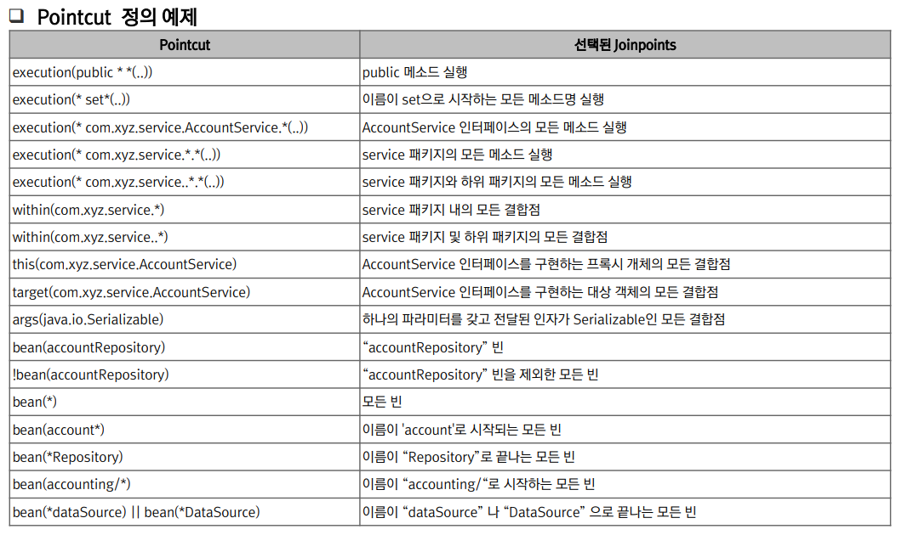

### @Aspect
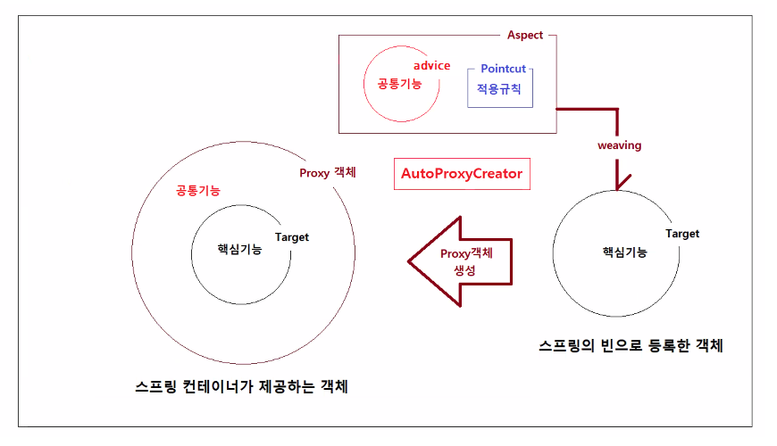
* AOP에 필요한 set을 포함하고 있는 클래스임을 나타내주는 어노테이션
* Auto Proxy Creator가 @Aspect 어노테이션을 찾아서 대상 객체에 대한 프록시를 생성한다.
  * Aspect에는 Advice와 Pointcut이 들어있고 즉, 공통기능과 적용규칙이 있고 공통기능과 Pointcut을 보고 적용대상이 되는 대상 객체를 찾는다.
  그리고 그 대상객체에다가 공통기능을 weaving 시켜가지고 프록시 객체를 만들어주는 것이 Auto Proxy Creator다.

### Around
* @Around 어노테이션
  * Object 반환
  * pointcut 표현식이라는 특정 패턴을 사용한 문자열을 지정해 이 지정된 패턴에 해당하는 메소드의 실행 전, 후로 동작한다.
* JoinPoint와 ProceedingJoinPoint
  * 공통적인 기능을 사용하는 메소드에 대한 정보를 제공한다.
  * 공통기능을 구현하는 메소드에 매개변수로 정의한다.
  * 대상객체, 대상메소드 이름, 대상메소드 매개변수등의 정보를 조회할 수 있다.
  * @Around Advice는 ProceedingJoinPoint를 사용
  * ProceedingJoinPoint인터페이스는 `Signature getSignature()`, `Object getTarget()`, `Object[] getArgs()`와 같은 메서드를 제공한다.

* SampleAspect.java
```java
package kr.co.hta.aspect;

import org.aspectj.lang.ProceedingJoinPoint;
import org.aspectj.lang.annotation.Around;
import org.aspectj.lang.annotation.Aspect;
import org.springframework.stereotype.Component;
import org.springframework.util.StopWatch;

@Component
@Aspect
public class SampleAspect {
	
	/*
	 * @Around Advice 구현하기
	 * 		- 반환타입은 Object다.
	 * 		- ProceedingJoinPoint 타입의 매개변수가 있다.
	 * 		- 메소드는 Throwable을 던진다.
	 * JoinPoint와 ProceedingJoinPoint
	 * 		- JoinPoint와 ProceedingJoinPoint 객체는 공통기능 적용되고 있는 대상 메소드에 대한 정보를 제공하는 객체다.
	 * 		- 공통기능을 구현하는 메소드에 매개변수로 정의하면 제공받을 수 있다.
	 * 		- 대상객체, 대상메소드의 이름, 대상 메소드의 매개변수 등의 정보를 조회할 수 있다.
	 * 		- @Around Advice는 JoinPoint 객체 대신 ProceedingJoinPoint 객체를 제공받아야 한다.
	 * 		- ProceedingJoinPoint객체는 대상 메소드를 실행시키는 기능을 가지고 있다.
	 */
	@Around("within(kr.co.hta.service.*)")
	public Object checkRunningTime(ProceedingJoinPoint joinPoint) throws Throwable {
		StopWatch stopWatch = new StopWatch();
		
		try {
			System.out.println("### 실행시간 측정 시작");
			stopWatch.start();
			// before 시점과 동일
			Object returnValue = joinPoint.proceed();
			// after-returning 시점과 동일
			return returnValue;
		} catch (Throwable e) {
			// after-returning 시점과 동일
			throw e;
		} finally {
			// after 시점과 동일
			System.out.println("### 실행시간 측정 시작");
			stopWatch.stop();
			
			long milliSeconds = stopWatch.getTotalTimeMillis();
			System.out.println("### 핵심기능 실행시간: " + milliSeconds + " 밀리초");
		}
	}
}

```
* 선언적 트랜잭션 - 스프링 프레임워크
  * 오류 발생시 자동 rollback, 오류 미발생시 auto commit과 같은 작업들을 개발자들이 일일이 신경쓰지 않아도 자동으로 처리해준다.

## 실습
AOP의 주요 구성 요소들을 활용해 프로젝트를 만들어 봄으로써 각 요소들의 기능과 작동을 이해한다.
* spring-aop프로젝트 생성
* 의존성 추가
  * springframework
  * log4j관련 라이브러리들
  * aspectj weaver
  * aspectj runtime
  * 위 2개의 라이브러리(aspectj)의 버전을 일치시키자.

### 코드
SampleAspect.java
```java
package kr.co.hta.aspect;

import org.aspectj.lang.ProceedingJoinPoint;
import org.aspectj.lang.annotation.Around;
import org.aspectj.lang.annotation.Aspect;
import org.springframework.stereotype.Component;
import org.springframework.util.StopWatch;

@Component
@Aspect
public class SampleAspect {
	
	/*
	 * @Around Advice 구현하기
	 * 		- 반환타입은 Object다.
	 * 		- ProceedingJoinPoint 타입의 매개변수가 있다.
	 * 		- 메소드는 Throwable을 던진다.
	 * JoinPoint와 ProceedingJoinPoint
	 * 		- JoinPoint와 ProceedingJoinPoint 객체는 공통기능 적용되고 있는 대상 메소드에 대한 정보를 제공하는 객체다.
	 * 		- 공통기능을 구현하는 메소드에 매개변수로 정의하면 제공받을 수 있다.
	 * 		- 대상객체, 대상메소드의 이름, 대상 메소드의 매개변수 등의 정보를 조회할 수 있다.
	 * 		- @Around Advice는 JoinPoint 객체 대신 ProceedingJoinPoint 객체를 제공받아야 한다.
	 * 		- ProceedingJoinPoint객체는 대상 메소드를 실행시키는 기능을 가지고 있다.
	 */
	@Around("within(kr.co.hta.service.*)")
	public Object checkRunningTime(ProceedingJoinPoint joinPoint) throws Throwable {
		StopWatch stopWatch = new StopWatch();
		
		try {
			System.out.println("### 실행시간 측정 시작");
			stopWatch.start();
			// before 시점과 동일
			Object returnValue = joinPoint.proceed();
			// after-returning 시점과 동일
			return returnValue;
		} catch (Throwable e) {
			// after-returning 시점과 동일
			throw e;
		} finally {
			// after 시점과 동일
			System.out.println("### 실행시간 측정 시작");
			stopWatch.stop();
			
			long milliSeconds = stopWatch.getTotalTimeMillis();
			System.out.println("### 핵심기능 실행시간: " + milliSeconds + " 밀리초");
		}

	}
}

```

LoggingAspect.java
```java
package kr.co.hta.aspect;

import org.aspectj.lang.annotation.Aspect;
import org.aspectj.lang.annotation.Before;
import org.springframework.stereotype.Component;

/*
 * @Aspect
 * 		관점지향 프로그래밍 적용에 필요한 세트(Advice와 Pointcut을 포함)를 포함하고 있는 클래스임을 표시한다.
 * @Component
 * 		<context:component-scan />의 스캔 대상으로 지정하는 어노테이션이다.
 */
@Component
@Aspect
public class LoggingAspect {
	
	/*
	 * 공통기능 실행시점을 지정하는 어노테이션
	 * 	@Before
	 * 		대상 메소드 실행전에 공통기능이 실행된다.
	 * 	@After
	 * 		대상 메소드가 실행되면(성공실행, 오류발생 여부와 상관없이) 공통기능이 실행된다.
	 * 	@AfterReturning
	 * 		대상 메소드가 오류없이 실행된 후에 공통기능이 실행된다.
	 * 	@AfterThrowing
	 * 		대상 메소드 실행 중 오류가 발생하면 공통기능이 실행된다.
	 * 	@Around
	 * 		대상 메소드 실행 전/후 공통기능이 실행된다.
	 */
	
/*	@Before("within(kr.co.hta.service.*)")
	public void 공통기능() {
		// what
		System.out.println("로그를 출력하는 공통기능이 실행됨");
	} 
	
	@Before
		When - 공통기능이 실행되는 시점을 지정한다.
	"within(kr.co.hta.service.*)"
		Where - 공통기능 적용규칙을 지정한다.
	System.out.println("로그를 출력하는 공통기능이 실행됨");
		What - 실행되는 공통기능
		
	>> 'service패키지 안에 있는 모든 클래스의 모든 메소드가 실행되기 전에 여기있는 공통기능을 실행한다.'라고 스프링에게 알려주고 있다.
*/
	
	@Before("within(kr.co.hta.service.*)")
	public void 공통기능() {
		System.out.println("로그를 출력하는 공통기능이 실행됨");
	} 
}

```

* interface와 구현 클래스(Service)를 이용해 실행 클래스(main method)에서 공통기능과 핵심기능이 어떤 실행 시점에 얼마의 시간이 소요되어 실행되는지 확인할 수 있다.
* 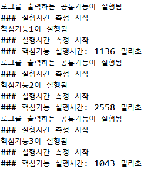

# Spring Boot
* 스트링 부트란 자바를 이용한 웹 개발을 하는데 최적화된 프레임워크다.
* python을 이용한 Django, Ruby를 이용한 Ruby on Rails, Javascript를 이용한 Node.js와 같이 Java를 이용한 Spring으로 웹 서비스를 쉽고 편하게 개발할 수 있다.
* > [spring.io](https://spring.io/)
## 특징
1. 마이크로서비스
   * 독립적으로 진화할 수 있는 마이크로서비스
     * 프로덕션급의 기능을 신속하게 제공
2. 반응성
   * Spring의 비동기식 비차단 아키텍처 
     * 컴퓨팅 리소스에서 더 많은 것을 얻을 수 있음
3. 클라우드
   * 플랫폼에 관계없이 서비스를 연결하고 확장
5. Web Apps
   * 모든 데이터 저장소에 연결된 빠르고 안전하며 응답성이 뛰어난 웹 애플리케이션
6. Serverless
   * 최고의 유연성
   * 수요에 따라 확장
7. Event Driven
   * 기업과 통합
   * 비즈니스 이벤트에 대응
   * 스트리밍 데이터에 대해 실시간으로 조치 가능
8. Batch
   * 자동화된 작업
   * 사용자에 맞게 한 번에 데이터를 오프라인으로 처리

### CoC 패러다임
* Convention over Configuration의 약자
* '설정보다 관례' 패러다임
* 프레임워크가 복잡해짐에 따라서 수많은 설정과 세팅을 해야하는 부담을 줄여주기 위해서 자주 사용하는 부분은 관례를 정하여 생략하고 이를 따르지 않을 경우에만 설정을 하도록 하는 것이다.
* 설정하지 않고 항상 하던 방식으로 같은 위치에 해당하는 파일들을 사용하면 설정파일에서 작성하지 않아도 된다.

### 스프링 부트의 장점
* 프로젝트를 의존성 주입과 같은 기술, 서비스들을 활용해 빠르고 간편하게 개발할 수 있다.
  * auto configuration(관련 라이브러리 자동 등록)
  * dependency injection
* 운영환경에서 간편한 실행
  * 프로젝트를 war, jar와 같은 파일로 배포하면 운영체제에 상관없이 mvnw spring-boot:run 과 같은 명령어로 실행하기만 하면 해당 프로젝트를 실행할 수 있다.

### @RestController
* RestController는 재요청 URL을 반환하지 않고 데이터를 반환한다.
* 단순한 문자열 뿐만 아니라 이름값을 반환하는 것도 가능하다.

## 실습
1. new project > Spring Starter Project
  * 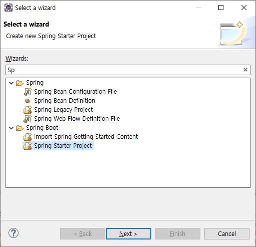
2. 프로젝트 세부사항 결정
  * 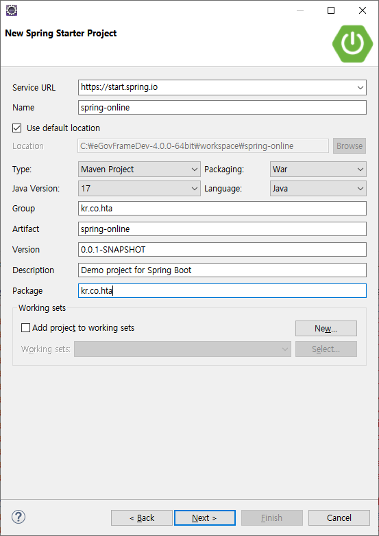
3. 프로젝트 의존성 추가  
  * 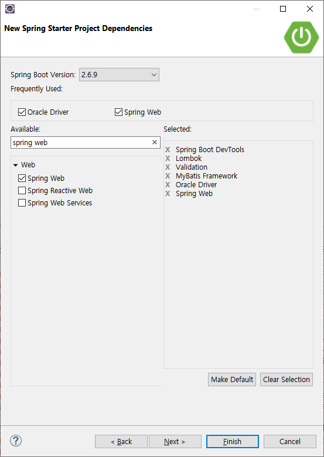
* 추가로 프로젝트 의존성 선택
  * 프로젝트 우클릭 > spring > add starter  
  * 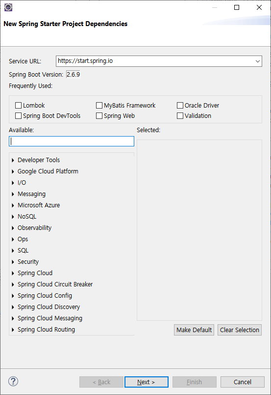

* application.properties : 환경설정 파일

1. SpringOnlineApplication.java 실행  
  * Console창에서 스프링 실행과 관련된 log를 확인할 수 있다.
  * 내장된 tomcat과 service, scanner 등의 실행을 확인할 수 있다.
* @SpringBootApplication
  * @SpringBootConfiguration, @EnableAutoConfiguration, @ComponentScan이 포함되어 있다.
  * 제공 이유 :  CoC

* 폴더 생성  - src/main/webapp/아래
  * resources, WEB-INF, WEB-INF/views
  * src/main/resources는 spring의 resource가 저장(화면 구성과 상관 x 리소스)
  * src/main/webapp/resources는 웹 관련 resource를 저장
    * 그림, css 등 (정적인 리소스)
  * 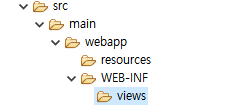

* 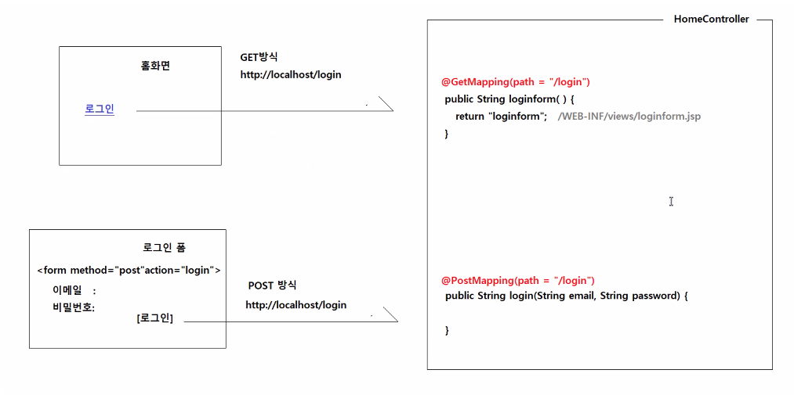
  * GET방식과 POST방식에 따라 다른 어노테이션을 적용한다.