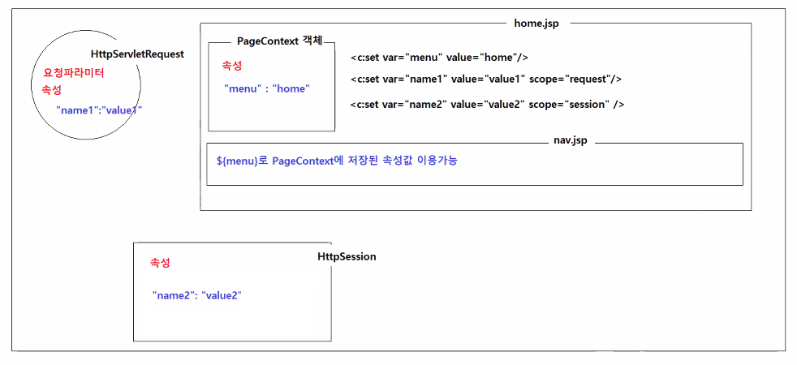
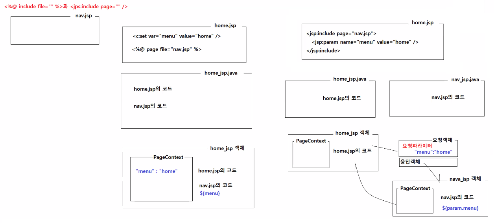
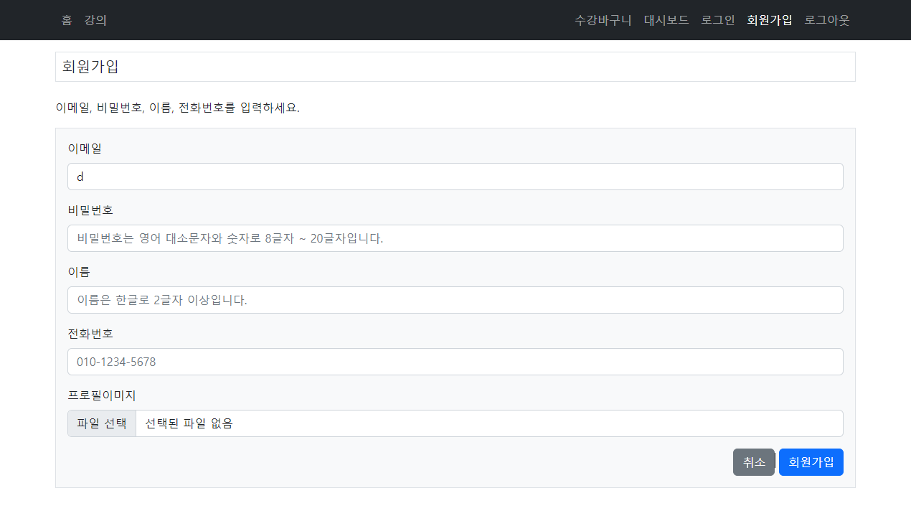
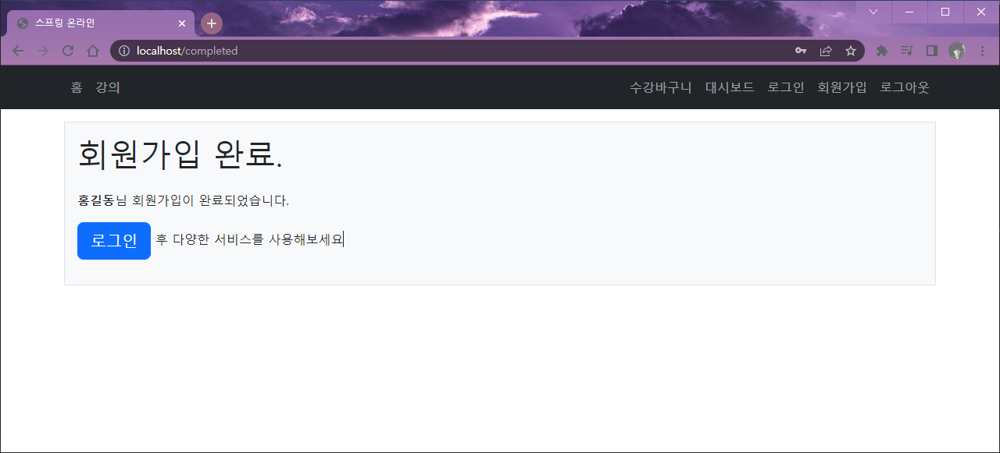
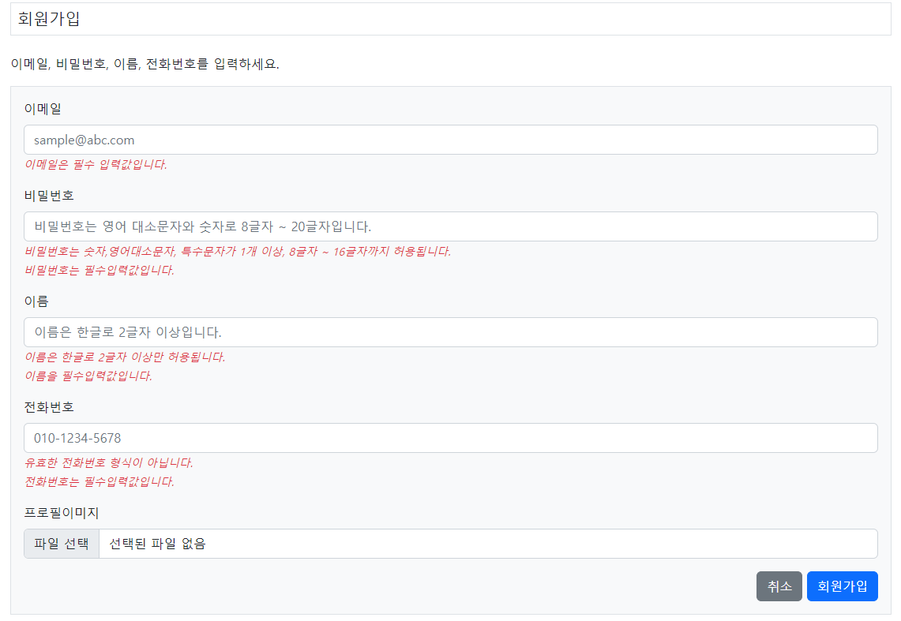
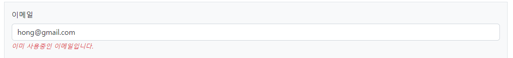
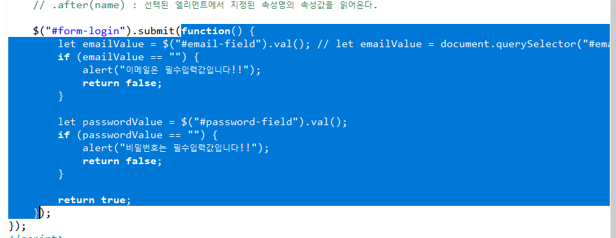

# 0715
- [0715](#0715)
- [Spring-online 실습](#spring-online-실습)
	- [클래스 별칭 지정하기](#클래스-별칭-지정하기)
	- [저장된 속성값 사용하기](#저장된-속성값-사용하기)
	- [회원가입 기능 구현하기](#회원가입-기능-구현하기)
	- [첨부파일 처리하기](#첨부파일-처리하기)
		- [MultipartFile](#multipartfile)
		- [실행해보기](#실행해보기)
	- [스프링에서 폼 입력값 유효성 체크하기](#스프링에서-폼-입력값-유효성-체크하기)
		- [유효성체크 적용하기](#유효성체크-적용하기)
		- [중복 입력값 유효성 체크](#중복-입력값-유효성-체크)
		- [실행해보기](#실행해보기-1)
	- [로그인/로그아웃 기능 구현하기](#로그인로그아웃-기능-구현하기)
- [jquery](#jquery)
	- [장점](#장점)
	- [*Write less, Do more*](#write-less-do-more)
	- [`$()`함수 사용법](#함수-사용법)
		- [`$(function() { ... })` 실습](#function----실습)

<small><i><a href='http://ecotrust-canada.github.io/markdown-toc/'>Table of contents generated with markdown-toc</a></i></small>

# Spring-online 실습
Spring Boot와 관련된 실습
## 클래스 별칭 지정하기
* @Alias 어노테이션
  * 매퍼파일에서 사용할 별칭을 지정한다.
* `<typeAliases>`
  * 지정된 패키지 또는 클래스에서 클래스의 첫 글자를 소문자로 변환한 형태의 별칭으로 등록한다.
  * @Alias 어노테이션이 있으면 그 어노테이션으로 지정한 이름이 별칭이 된다.
## 저장된 속성값 사용하기


* `<c:set>`태그 활용하기
	```jsp
	<ul class="navbar-nav me-auto">
			<li class="nav-item"><a class="nav-link ${menu eq 'home' ? 'active' : '' }" href="/">홈</a></li>
			<li class="nav-item"><a class="nav-link ${menu eq 'course' ? 'active' : '' }" href="/courses">강의</a></li>
		</ul>
		<ul class="navbar-nav">
			<li class="nav-item"><a class="nav-link ${menu eq 'cart' ? 'active' : '' }" href="/cart">수강바구니</a></li>
			<li class="nav-item"><a class="nav-link ${menu eq 'dashboard' ? 'active' : '' }" href="/dashboard">대시보드</a></li>
			<li class="nav-item"><a class="nav-link ${menu eq 'login' ? 'active' : '' }" href="/login">로그인</a></li>
			<li class="nav-item"><a class="nav-link ${menu eq 'register' ? 'active' : '' }" href="/register">회원가입</a></li>
			<li class="nav-item"><a class="nav-link" href="/logout">로그아웃</a></li>
		</ul>
	```
	* 속성값을 사용해 nav의 active 스타일 지정
	* 
## 회원가입 기능 구현하기
* nav의 로그인 버튼을 누르면 HomeCountroller에 의해 /login으로 GET매핑되어 loginform으로 이동된다.
* 사용자가 submit 버튼을 클릭하면 POST매핑으로 유효성 체크 후 redirect된다.
* BeanUtils.copyProperties()를 통해 같은 이름을 가진 UserRegisterForm, User의 필드를 복사해 저장할 수 있다.(profileFile값을 제외한 UserRegisterForm의 필드 값들이 복사됨.)

## 첨부파일 처리하기
* MultipartFile 인터페이스 객체 활용하기
* enctype="multipart/form-data" 속성 지정
* 회원가입시 첨부파일이 있으면 User 객체에 저장하고 resource폴더에 저장시킨다. 그리고 InputStream을 이용해 업로드된 첨부파일을 읽어온다.

### MultipartFile
* 주요 API
	* String getOriginalFilename()
		* 첨부파일명을 반환한다.
	* String getContentType()
		* 첨부파일의 컨텐츠 타입을 반환한다.
	* boolean isEmpty()
		* 첨부파일이 업로드되지 않았을 때 true를 반환한다.
	* long getSize()
		* 첨부파일의 크기를 byte 단위로 반환한다.
	* byte[] getBytes()
		* 첨부파일의 데이터를 byte[]배열로 반환한다.
	* InputStream getInputStream()
		* 업로드된 첨부파일을 읽어오는 읽기 전용 스트림을 반환한다.

### 실행해보기


## 스프링에서 폼 입력값 유효성 체크하기
1. 폼입력값 유효성 체크를 지원하는 라이브러리 의존성 추가
	```xml
	<dependency>
		<groupId>org.springframework.boot</groupId>
		<artifactId>spring-boot-starter-validation</artifactId>
	</dependency>
	```
2. 폼입력값에 대한 유효성 검사 조건이 추가된 Form 클래스 정의하기
	```java
	public class UserRegisterForm {
		@NotBlank(message="이메일은 필수입력값임")
		@Email(messsage="유효한 이메일이 아님")
		String email;

		...
	}
	```
3. 스프링의 `<form:xxx />`태그를 이용해서 입력폼을 작성하기
	```jsp
	<form:form method="post" action="register" modelAttribute="userRegisterForm">
		이메일
		<form:input path="email" />  
			<form:input path="email"/>은 <input type="text" name="email" />로 변환된다.
			path속성은 input의 name속성이다. 
			path속성의 값은 UerRegisterForm의 멤버변수 이름과 동일하다.
		<form:errors path="email" /> 
			유효성체크를 통과하지 못했을 때 오류메세지가 표시되는 곳이다.
			유효성체크 결과가 저장된 BindingResult에 path속성에 지정된 필드명으로 에러정보가 존재하면 오류메세지가 표시된다.
	</form:form>
	```
4. 입력폼화면을 제공하는 요청핸들러 메소드에서 폼입력값을 저장할 객체를 미리 생성해서 모델에 저장하기
	```java
	public String registerform(Model model) {
		
		// <form:form modelAttribute="userRegisterForm"/>의 modelAttribute 속성명과 같은 이름으로 저장한다.
		model.addAttribute("userRegisterForm", new UserRegisterForm());	

		return "register";
	}
	```
5. 입력폼값을 제출받아서 처리하는 요청핸들러 메소드에서 유효성 체크와 관련된 어노테이션과 객체를 매개변수에 추가한다.
	```java
	// @Valid는 유효성 검사를 수행할 값을 포함하고 있는 객체 앞에 붙인다.
	// 유효성 검사를 수행할 결과를 저장하는 BindingResult는 바로 다음에 적는다.
	public String register(@Valid UserRegisterForm userRegister, BindingResult errors) {

	}
	```
6. errors객체에 오류가 포함되어 있는지 여부를 체크하고 오류가 포함되어 있으면 입력폼으로 내부이동시킨다.
	```java
	public String register(@Valid UserRegisterForm userRegister, BindingResult errors) {
		if (errors.hasErrors()) {}
			return "registerform";
		}
	}
	```

### 유효성체크 적용하기
* spring-boot-starter-validation 의존성 추가(pom.xml)
* @NotBlank, @Email, @Pattern 어노테이션 및 정규식으로 유효성 검사 조건 설정
  ```java
	package kr.co.hta.web.form;

	import javax.validation.constraints.Email;
	import javax.validation.constraints.NotBlank;
	import javax.validation.constraints.Pattern;

	import org.springframework.web.multipart.MultipartFile;

	import lombok.Getter;
	import lombok.Setter;
	import lombok.ToString;

	@Getter
	@Setter
	@ToString
	public class UserRegisterForm {
		
		@NotBlank(message = "이메일은 필수 입력값입니다.")
		@Email(message = "유효한 이메일 형식이 아닙니다.")
		private String email;
		
		@NotBlank(message = "비밀번호는 필수입력값입니다.")
		@Pattern(regexp = "^(?=.*[A-Za-z])(?=.*\\d)(?=.*[~!@#$%^&*()+|=])[A-Za-z\\d~!@#$%^&*()+|=]{8,16}$", message = "비밀번호는 숫자,영어대소문자, 특수문자가 1개 이상, 8글자 ~ 16글자까지 허용됩니다.")
		private String password;
		
		@NotBlank(message = "이름을 필수입력값입니다.")
		@Pattern(regexp = "^[가-힣]{2,}$", message = "이름은 한글로 2글자 이상만 허용됩니다.")
		private String name;
		
		@NotBlank(message = "전화번호는 필수입력값입니다.")
		@Pattern(regexp = "^\\d{2,3}-\\d{3,4}-\\d{4}$", message = "유효한 전화번호 형식이 아닙니다.")
		private String phone;
		
		private MultipartFile profileFile;
	}

	/*
		MultipartFile
			스프링에서 첨부파일 처리를 위해 제공하는 객체다.
			* MultipartFile 객체는 항상 null 아니다.
			파일의 첨부 여부와 상관없이 항상 null이 아니다.
			단, 해당 입력필드가 disabled 상태일 때는 null이다. 
			* 주요 API
				String getOriginalFilename()
					첨부파일명을 반환한다.
				String getContentType()
					첨부파일의 컨텐츠 타입을 반환한다.
				boolean isEmpty()
					첨부파일이 업로드되지 않았을 때 true를 반환한다.
				long getSize()
					첨부파일의 크기를 byte 단위로 반환한다.
				byte[] getBytes()
					첨부파일 데이터를 byte[]배열로 반환한다.
				InputStream getInputStream()
					업로드된 첨부파일을 읽어오는 읽기 전용 스트림을 반환한다.
	*/
  ```
* @Valid 어노테이션으로 검사
* BindingResult에 검사 결과를 저장.
  * hasError()로 에러 유무 체크
  ```java
	@PostMapping(path = "/register")
	public String register(@Valid UserRegisterForm userRegisterForm, BindingResult errors) throws Exception {

		if (errors.hasErrors()) {
			return "registerform";
		}
		
		/*
		User user = userService.getUserDetail(userRegisterForm.getEmail());
		if(user != null) {
			errors.rejectValue("email", null, e.getMessage());
			return "registerform";
		}
		*/
		
		try {
			userService.addNewUser(userRegisterForm);
		} catch (OnlineApplicationException e) {
			// BindingResult객체에 오류내용을 수동으로 추가하기
			errors.rejectValue("email", null, e.getMessage());
			return "registerform";
		}
		
		return "redirect:/completed";
	}
  ```
* `<form:form>`, `<form:input>`, `<form:password>`, `<form:errors>`를 이용해 화면구현 폼을 수정한다.
  * 속성은 type을 지우고 name속성은 path로 바꾸고 modelAttribute속성을 추가한다.
  * modelAttrivute는 controller에서 미리 생성해놓은 객체로 폼 입력값을 담는다.
	```jsp
	<form:form class="border bg-light p-3" method="post" action="register" modelAttribute="userRegisterForm" enctype="multipart/form-data">
		<div class="mb-3">
			<label for="email-field" class="form-label">이메일</label>
			<form:input class="form-control" path="email" id="email-field" placeholder="sample@abc.com"/>
			<form:errors path="email" class="text-danger small fst-italic"></form:errors>
		</div>
		<div class="mb-3">
			<label for="password-field" class="form-label">비밀번호</label>
			<form:password class="form-control" path="password" id="password-field" placeholder="비밀번호는 영어 대소문자와 숫자로 8글자 ~ 20글자입니다."/>
			<form:errors path="password" class="text-danger small fst-italic"></form:errors>
		</div>
		<div class="mb-3">
			<label for="name-field" class="form-label">이름</label>
			<form:input class="form-control" path="name" id="name-field" placeholder="이름은 한글로 2글자 이상입니다."/>
			<form:errors path="name" class="text-danger small fst-italic"></form:errors>
		</div>
		<div class="mb-3">
			<label for="tel-field" class="form-label">전화번호</label>
			<form:input class="form-control" path="phone" id="phone-field" placeholder="010-1234-5678"/>
			<form:errors path="phone" class="text-danger small fst-italic"></form:errors>
		</div>
		<div class="mb-3">
			<label for="tel-field" class="form-label">프로필이미지</label>
			<input type="file" class="form-control" name="profileFile" id="profile-file-field" />
		</div>
		<div class="text-end">
			<a href="/" class="btn btn-secondary">취소</a>
			<button type="submit" class="btn btn-primary">회원가입</button>
		</div>
	</form:form>
	```
* 실행해보기
  * 항목별 유효성 체크
  * 아무것도 입력하지 않았을 때 각 항목마다 유효성 체크 후 에러 메세지를 출력한다.
  * 

### 중복 입력값 유효성 체크
이미 존재하는 이메일을 회원가입할때 입력한 경우 유효성 체크하여 에러 메세지를 띄운다.
* addNewUser()에서, 즉 유저를 가입하는 메소드에서 userRegisterForm의 이메일(입력받은 유저정보객체의 이메일)과 일치하는 이메일을 기존의 유저정보에서 가져와 null값이 아니면 에러 메세지를 보여준다.
 	 ```java
	User user = userMapper.getUserByEmail(userRegisterForm.getEmail());
			if (user != null) {
				throw new OnlineApplicationException("이미 사용중인 이메일입니다.");
			}
  	```
* try~catch구문 또는 if구문을 통해 오류 내용을 체크하고 에러 메세지를 보여준다. 그리고 입력폼으로 return시킨다.(homeController에서 if 구문으로 메소드를 추가하여 user의 이메일을 가져와 유저 이메일에 대한 입력값 유효성 체크를 할 수 있다.)
	```java
	/*
	User user = userService.getUserDetail(userRegisterForm.getEmail());
	if(user != null) {
		errors.rejectValue("email", null, e.getMessage());
		return "registerform";
	}
	*/

	try {
		userService.addNewUser(userRegisterForm);
	} catch (OnlineApplicationException e) {
		// BindingResult객체에 오류내용을 수동으로 추가하기
		errors.rejectValue("email", null, e.getMessage());
		return "registerform";
	}
	```
* OnlineApplicationException extends RuntimeException
  * RuntimeException이 범위가 너무 넓으므로 새로운 Exception을 하나 정의해서 입력값 유효성 체크에서 사용한다.
  ```java
	package kr.co.hta.exception;

	public class OnlineApplicationException extends RuntimeException {
		
		private static final long serialVersionUID = 7299015771786044145L;

		public OnlineApplicationException(String message) {
			super(message);
		}
		
		public OnlineApplicationException(String message, Throwable cause) {
			super(message, cause);
		}
	}

  ```

### 실행해보기
* 중복 입력값 유효성 체크
  * 동일한 이메일의 회원이 이미 있을 경우 에러 메세지를 출력한다.
  * 모든 항목별 유효성 체크가 끝난뒤 이메일 중복에 대한 유효성 체크를 시작하는 순서로 코딩되어 있으므로 다른 값을 다 입력해야 해당 에러 메세지가 뜬다.
  * 

## 로그인/로그아웃 기능 구현하기
* HttpSession 객체를 이용한 로그인/로그아웃 구현
	```java
	@PostMapping(path = "/login")
	public String login(@RequestParam("email") String email, @RequestParam("password") String password, HttpSession session) {
		
		try {
			User user = userService.login(email, password);
			session.setAttribute("LOGIN_USER", user); // 방법1 세션객체에 넣어준다.
			
		} catch (OnlineApplicationException e) {
			return "redirect:/login?fail=invalid";
		}
		
		return "redirect:/";
	}

	@GetMapping(path = "/logout")
	public String logout(HttpSession session) {
		session.invalidate();
		
		return "redirect:/";
	}
	```

* SessionAttributes와 Model, SessionStatus를 이용한 로그인/로그아웃
	```java
	@Controller
	/*
	* @SessionAttributes
	* 		Model객체에 저장되는 객체 중에서 지정된 속성명(LOGIN_USER)으로 저장되는 것만 HttpSession객체에 저장시킨다.
	*/
	@SessionAttributes("LOGIN_USER")
	public class HomeController {
		...
		...
		...

		@PostMapping(path = "/login")
		public String login(@RequestParam("email") String email, @RequestParam("password") String password, Model model) {
			try {
				User user = userService.login(email, password);
				model.addAttribute("LOGIN_USER", user);
			
			} catch (OnlineApplicationException e) {
				return "redirect:/login?fail=invalid";
			}

			return "redirect:/";
		}
		
		@GetMapping(path = "/logout")
		public String logout(SessionStatus sessionStatus) {
			// SessionStatus객체는 @SessionAttributes로 HttpSession객체에 저장시킨 속성을 삭제한다.
			sessionStatus.setComplete();
			
			return "redirect:/";
		}
	```

* UserService.java에서 유효성 체크 (에러메세지)
	```java
	public User login(String email, String password) {
		User user = userMapper.getUserByEmail(email);
		if (user == null) {
			throw new OnlineApplicationException("아이디 혹은 비밀번호가 올바르지 않습니다.");
		}
		if (!user.getPassword().equals(password)) {
			throw new OnlineApplicationException("아이디 혹은 비밀번호가 올바르지 않습니다.");
		}
		return user;
	}
	```

* nav.jsp 조건문으로 디자인 수정
	```java
	<c:if test="${not empty LOGIN_USER }">
		<li class="nav-item"><a class="nav-link ${menu eq 'cart' ? 'active' : '' }" href="/cart">수강바구니</a></li>
		<li class="nav-item"><a class="nav-link ${menu eq 'dashboard' ? 'active' : '' }" href="/user/dashboard">대시보드</a></li>
		<li class="nav-item"><a class="nav-link" href="/logout">로그아웃</a></li>
	</c:if>
	<c:if test="${empty LOGIN_USER }">
		<li class="nav-item"><a class="nav-link ${menu eq 'login' ? 'active' : '' }" href="/login">로그인</a></li>
		<li class="nav-item"><a class="nav-link ${menu eq 'register' ? 'active' : '' }" href="/register">회원가입</a></li>
	</c:if>
	```
	* 로그인중일때 아닐때 다르게 nav 탭이 표시된다.

# jquery
- 경량의 자바스크립트 라이브러리
- **크로스 브라우징**을 지원
  - 최대한 많은 브라우저에서 깨지지 않고 의도한 대로 올바르게 화면이 출력되도록 하는 것.(호환성)
- css3 선택자를 지원
  - ex) `document.querySelector("div p")` : div의 첫번째 p
## 장점
- **강력한 선택자를 지원**
- HTML DOM을 조작하는 다양한 메소드를 지원
- 스타일을 쉽게 조작
- 애니메이션 효과 구현
- 단순한 이벤트 처리
- 쉬운 AJAX 처리
## *Write less, Do more*
- 강력한 선택자 
  - 선택자 함수 : `$("#box")`
- **묵시적인 반복** 수행 
  - 엘리먼트 삭제, 숨김, 보이게, 스타일 변경
  - ex) `$("p").hide();`, `$("p").show();` : p태그 모두 숨김, 보이게 (반복을 묵시적으로 한번에 처리한다.)
- **메소드 체이닝**을 지원
  - 위에서 나열된 장점들을 구현하는 메소드들을 가지고 있는 결과세트(ex. ResultSet)가 `$("p")`와 같은 선택자로 선택한 요소들에 대해 생성된다.
  - `$("p").addClass('text-danger')`로 다시 선택하면 해당하는 요소에 대해 다시 메소드 결과 세트가 생성된다.(메소드 체이닝 : 여러 메소드를 이어서 호출한다. 즉 메소드가 객체를 반환하면 그 반환값객체가 또 다른 메소드를 호출할 수 있다.)
## `$()`함수 사용법
1. `$("selector")`
   * selector 표현식에 해당하는 엘리먼트를 검색한다.
   * jquery집합객체를 반환한다.
   * jquery집합객체 = 검색된 엘리먼트 + 다양한 메소드
2. `$(function() { ... })`
   * `$()` 함수 안에 익명함수 `function() { ... }` 를 작성한다.
   * HTML Document객체가 준비되면(DOM객체가 준비되면) 함수가 자동으로 실행된다.
   * `$(document).ready(function() { ... })`와 같은 시점에 실행된다.
3. `$(document객체) 혹은 $(element객체)`
   * `$("#box")` 함수의 실행결과 ----> jQuery집합객체[검색된 엘리먼트 + 좋은 메소드]
   * var el = document.getElementById("box");
        el    ----> 태그정보 + 허접한 메소드
        $(el) ----> jQuery집합객체[el + 좋은 메소드]	
4. `$("html태그")`
   * 작성된 html태그에 해당하는 엘리먼트 객체를 생성하고,
                  생성된 엘리먼트를 포함하는 jQuery집합객체[생성된 엘리먼트 + 좋은 메소드]를 반환한다.
   * `$("<p>연습입니다.</p>")` --> jQuery집합객체[p엘리먼트 + 좋은 메소드]
    `$("<p>연습입니다.</p>").css("color", 'red').click(function() { ... });`

### `$(function() { ... })` 실습
로그인폼에서 유효성 체크기능 jquery로 구현하기.
* loginform.jsp
	```jsp
	$(function() {
		// $("#form-login") : 아이디가 form-login인 엘리먼트를 선택한다. -> jquery객체(선택된 앨리먼트 + 메소드)
		// .submit(함수) : 선택된 엘리먼트에서 submit 이벤트가 발생하면 실행될 함수를 등록시킨다.
		
		// .val() : 선택된 입력요소의 값을 읽어온다. input박스 또는 case박스의 값을 가져올때 사용한다.
		// .text() : 선택된 엘리먼트가 포함하고 있는 텍스트 컨텐츠를 읽어온다.
		// .html() : 선택된 엘리먼트가 포함하고 있는 html 컨텐츠를 읽어온다.
		// .after(name) : 선택된 엘리먼트에서 지정된 속성명의 속성값을 읽어온다.

		$("#form-login").submit(function() {
			let emailValue = $("#email-field").val(); // let emailValue = document.querySelector("#email-field").value;
			if (emailValue == "") {
				alert("이메일은 필수입력값입니다.");
				return false;
			}

			let passwordValue = $("#password-field").val();
			if (passwordValue == "") {
				alert("비밀번호는 필수입력값입니다.");
				return false;
			}

			return true;
		});
	});
	```
* 
  * 블록된 부분은 이벤트핸들러함수라고도 한다.(.submit(함수)에서 안에있는 함수를 의미)
  * 이벤트핸들러함수가 false를 반환하면 기본동작(a태그 - 링크로이동, form태그 - 입력값 제출) 메소드가 실행되지 않는다.