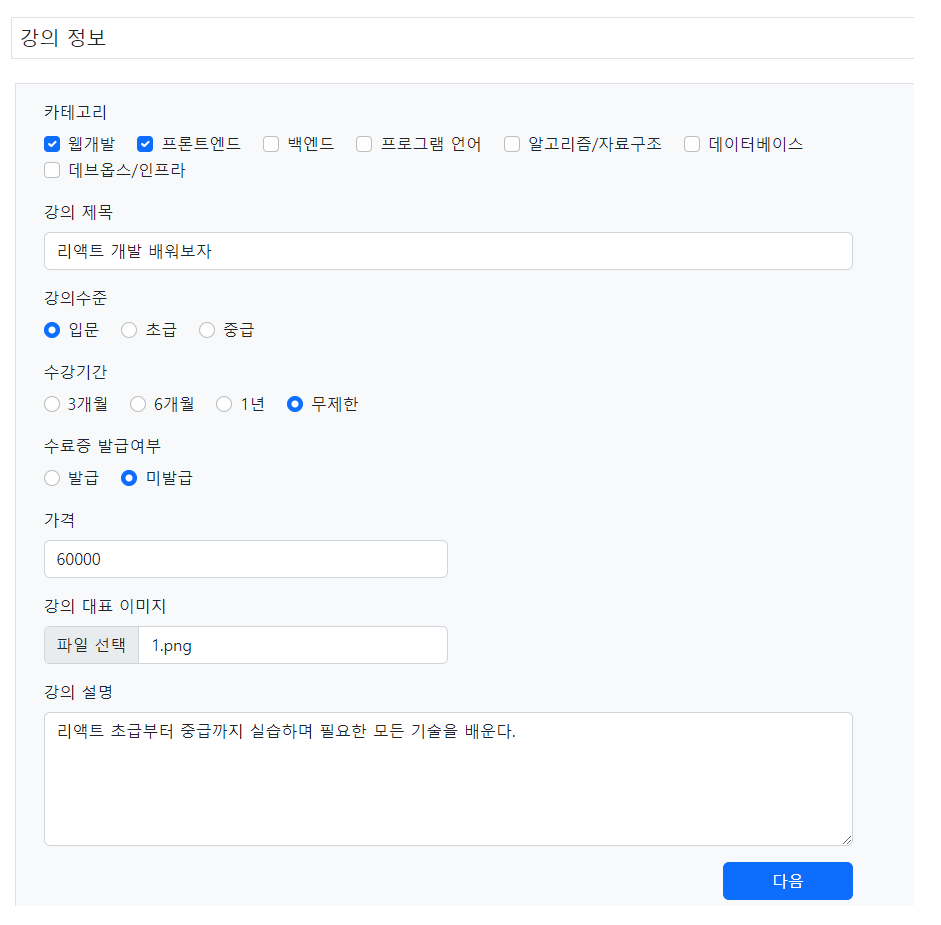

# 0719
- [0719](#0719)
- [Spring Boot](#spring-boot)
	- [새 강의 등록하기](#새-강의-등록하기)
		- [form1에서 categories객체 불러오기의 작동](#form1에서-categories객체-불러오기의-작동)
	- [입력폼 객체 만들기](#입력폼-객체-만들기)
		- [실습관련파일](#실습관련파일)
	- [selectKey 태그](#selectkey-태그)
		- [실습관련파일](#실습관련파일-1)
	- [트랜잭션 처리하기](#트랜잭션-처리하기)
		- [스프링의 선언적 트랜잭션 처리](#스프링의-선언적-트랜잭션-처리)
		- [스프링부트를 사용하지 않을 경우 트랜잭션 처리하기](#스프링부트를-사용하지-않을-경우-트랜잭션-처리하기)
		- [실습관련파일](#실습관련파일-2)
	- [세션을 이용한 데이터 초기화하기](#세션을-이용한-데이터-초기화하기)
		- [관련실습파일](#관련실습파일)

<small><i><a href='http://ecotrust-canada.github.io/markdown-toc/'>Table of contents generated with markdown-toc</a></i></small>

# Spring Boot
spring-online 프로젝트에서 온라인 교육 사이트 앱 실습
## 새 강의 등록하기
1. DB 수정
  * COURSE_IMAGENAME 추가
  * 오타 수정(STUDENT)
2. form1 수정
  * 강의 대표 이미지 추가 (파일형식 input)
  * 수료증 발급여부 추가
3. CatgoryMapper.java  
  * 카테고리 조회 메소드 추가(전체 조회, 한개 조회)
4. VO : Category.java
  * Getter, Setter, ToString 어노테이션
5. CategoryMapper.xml
    * 카테고리 조회 sql 정의
	```xml
	<?xml version="1.0" encoding="UTF-8"?>
	<!DOCTYPE mapper PUBLIC "-//mybatis.org//DTD Mapper 3.0//EN" "http://mybatis.org/dtd/mybatis-3-mapper.dtd" >
	<mapper namespace="kr.co.hta.mapper.CategoryMapper">

		<!-- List<Category> getAllCategories(); -->
		<select id="getAllCategories" resultType="Category">
			select category_id as id, category_name as name
			from online_categories
			order by category_id asc
		</select>
		
		<!-- Category getCategoryById(String categoryId); -->
		<select id="getCategoryById" parameterType="string" resultType="Category">
			select category_id as id, category_name as name
			from online_categories
			where category_id = #{value}
		</select>
		
	</mapper>
	```
6. CourseService 작성
  * categoryMapper.getAllCategories() 호출
7. CourseController 작성
  * courseService.getAllcategories() 호출
  * `model.addAttribute("categories", cateogires)`
8. form1.jsp에서 작성
  * forEach로 모든 카테고리 출력

### form1에서 categories객체 불러오기의 작동
DispatcherServlet, ModelAndView, HandlerAdater, InternalResourceViewResolver의 동작  

* CourseController가 실행되면 즉 /form1 매핑이 요청되면,
* CourseService > CategoryMapper.getAllDCategories > CategoryMapper.xml에서 DB data 조회 > categories에 카테고리목록 정보 저장됨.
* Model객체에 String "categories"에 categoires (카테고리목록 정보)가 저장됨.
  * DB에서 가져온 categories data가 `List<Cateogory> categories`에 저장되고 model객체에 "categories"라는 이름으로 `categories` 배열객체가 저장된다. 
  * 또 model객체에 저장된 String속성 data가 ModelAndView에 저장된다.
* DispatcherServlet는 ModelAndView를 전달받는다.
* InternalResourceViewResolver는 저장된 설정에 따라 해당하는 파일을 찾아서, 만약 있으면 JstlView를 DispatcherServlet에 반환한다.
* DispatcherServlet은 render()메소드를 실행한다. ModelAndView를 렌더링해서(model에 저장된 객체가 요청객체 속성으로 저장된다.) JstlView로 보내고 해당 객체는 속성으로 form1.jsp의 `<c:forEach var="category" items="${categories}">`로 전달된다.
* items 속성의 객체로 categories가 연결되었다.

## 입력폼 객체 만들기
회원가입 또는 게시글 등록과 같은 사용자의 데이터를 입력폼으로 받아 저장하는 서비스의 경우 사용자가 입력하는 데이터들을 포함하는 입력폼 객체(클래스)를 만들어 활용한다.
* ~~RegisterForm.java
* MultipartFile
  * 첨부파일 처리를 위해 제공하는 스프링 도구
  * 여러 개의 첨부파일을 저장할 때 : `List<MultipartFile>`
### 실습관련파일
CourserRegisterForm 작성
* 입력폼에 맞게 객체를 만들어 사용한다.
  * 테이블에 컬럼은 VO를 사용, 입력 데이터는 Form 사용
  * form1.jsp에서 name 속성을 확인해 필드를 작성
* 
  * form2작성 전 작동과정 확인
1. form2 수정
2. CourseRegisterForm에 추가
3. CourseController 추가
4. CourserService.addNewCourse() 작성
5. CourseController.insert()에서 `courseService.addNewCourse(loginUser, courseRegisterForm);`추가
* VO 객체 작성
  * CourseCategory, CourseLearning, CourseTag, CourseRecommendation, Course
* CourseMapper.java, CourseMapper.xml 작성
  * oracle db - 시퀀스 작성 : `CREATE SEQUENCE ONLINE_COURSE_SEQ;`

## selectKey 태그
  * 구문이 실행되기 전 또는 후에 실행할 SQL문을 정의할 수 있다. 
  * 주요 속성
    * keyProperty
      * SQL 실행결과를 파라미터객체의 어느 변수에 저장할 지 지정한다.
    * resultType
      * SQL 실행결과로 획득되는 값의 타입을 지정한다.
    * order
      * insert문 보다 먼저 실행할지, 나중에 실행할지 지정한다.
### 실습관련파일
* CourseMapper.xml
	```xml
	<?xml version="1.0" encoding="UTF-8"?>
	<!DOCTYPE mapper PUBLIC "-//mybatis.org//DTD Mapper 3.0//EN" "http://mybatis.org/dtd/mybatis-3-mapper.dtd" >
	<mapper namespace="kr.co.hta.mapper.CourseMapper">

		<!-- 
			<selectKey />
				insert 구문이 실행되기 전에 실행할 SQL문을 정의할 수 있다.
				<selectKey />를 사용해서 실행한 SQL문의 실행결과를 파라미터객체에 저장할 수 있다.
				주요 속성
					keyProperty	
						SQL문 실행결과를 파라미터객체의 어느 변수에 저장할 지  지정한다.
					resultType
						SQL문 실행결과로 획득되는 값의 타입을 지정한다.
					order
						insert문 보다 먼저 실행할지, insert문 보다 나중에 실행할지 지정한다.
						
						
				<insert id="insertCourse" parameterType="Course">
					<selectKey keyProperty="no" resultType="int" order="BEFORE">
						select online_course_seq.nextval 
						from dual
					</selectKey>
					* <selectKey />태그의 SQL문을 insert문보다 먼저 실행시킨다. 						order="BEFORE"
					* <selectKey />태그의 SQL문을 실행하면 실행결과로 정수값이 획득된다. 				resultType="int"
					* <selectKey />태그의 SQL문 실행후 획득된 값을 Course객체의 no변수에 저장시킨다. 	keyProperty="no"
				</insert>
		-->

		<!-- void insertCourse(Course course); -->
		<insert id="insertCourse" parameterType="Course">
			<selectKey keyProperty="no" resultType="int" order="BEFORE">
				select online_course_seq.nextval 
				from dual
			</selectKey>
			insert into online_courses
			(course_no, course_title, course_grade, course_description, course_price,
			course_period, course_certificate_completion, user_id, course_imagename)
			values
			(#{no}, #{title}, #{grade}, #{description}, #{price},
			#{period}, #{certificateCompletion}, #{user.id}, #{imagename})
		</insert>
		
		<!-- void insertCourseCategory(CourseCategory courseCategory); -->
		<insert id="insertCourseCategory" parameterType="CourseCategory">
			insert into online_course_categories
			(course_no, category_id)
			values
			(#{courseNo}, #{categoryId})
		</insert>	
		
		<!-- void insertCourseLearning(CourseLearning courseLearning); -->
		<insert id="insertCourseLearning" parameterType="CourseLearning">
			insert into online_course_learnings
			(course_no, course_learning)
			values
			(#{courseNo}, #{learning})
		</insert>
		
		<!-- void insertCourseRecommendation(CourseRecommendation courseRecommendation); -->
		<insert id="insertCourseRecommendation" parameterType="CourseRecommendation">
			insert into online_course_recommendations
			(course_no, course_recommended_target)
			values 
			(#{courseNo}, #{target})
		</insert>
		
		<!-- void insertCourseTag(CourseTag courseTag); -->
		<insert id="insertCourseTag" parameterType="CourseTag">
			insert into online_course_tags
			(course_no, course_tag)
			values
			(#{courseNo}, #{tag})
		</insert>
	</mapper>
	```

* CourseService에서 CourseMapper를 autowired해서 addNewCourse()작성
  * 강의정보 등의 강의 관련 정보 저장하기
* 강의 등록하기 잘 작동하는지 확인
  * 
  * 
  * 
    * course/complete으로 연결되고 DB에도 데이터가 잘 저장 되었다.

## 트랜잭션 처리하기
* 데이터의 일관성을 위해서 데이터 처리과정 도중 하나라도 문제가 생기면 데이터가 아예 저장되지 않는다.(롤백)
* 한번에 여러 번의 insert작업을 진행할 경우 auto-commit 기능에 의해 insert마다 데이터가 저장되게 되는데. 이를 방지하고자 Service 파일에 @Transactional 어노테이션을 붙여 트랜잭션 처리를 할 수 있다.
### 스프링의 선언적 트랜잭션 처리
- PlatformTransactionManager 인터페이스를 구현한 다양한 트랜잭션 매니저 클래스를 지원한다.
- 대표적인 트랜잭션 매니저
  - DataSourceTransactionManager - spring jdbc, ibatis, mybatis 기술을 사용한 경우
  - HibernateTransactionManager - hibernate 프레임워크를 사용한 경우
  - JpaTransactionManager - JPA 기술을 사용한 경우
  - JtaTransactionManager - 자바 트랜잭션 API 기술을 사용한 경우
- 모든 트랜잭션 매니저 구현 클래스는 동일한 사용법을 가진다.
  - 사용하는 데이터베이스 엑세스 기술이 서로 다르더라도 트랜잭션 처리방법은 동일하다.
  - 스프링부트는 라이브러리 의존성을 분석해서 적절한 트랜잭션 매니저 객체를 스프링 컨테이너의 빈으로 등록하고, 해당 객체를 AOP로 적용가능한 상태로 설정한다.
  - 그래서 사용하는 데이터베이스 엑세스 기술에 상관없이 @Transactional 어노테이션을 지정한 클래스의 모든 메소드가 실행될 때마다 해당 메소드의 실행전/후에 트랜잭션처리와 관련된 작업을 자동으로 수행한다.
- 선언적 트랜잭션 처리는 트랜잭션 처리와 관련된 코드를 작성하지 않고, @Transactional 어노테이션을 지정하는 것으로 트랜잭션처리가 되도록 하는 것
### 스프링부트를 사용하지 않을 경우 트랜잭션 처리하기
1. 사용하는 테이터베이스 엑세스 기술에 맞는 트랜잭션 매니저를 스프링컨테이너의 빈으로 등록한다.
	```xml
	<bean id="transactionManager" class="DataSourceTransactionManager">
		<property name="dataSource" ref="dataSource" />
    </bean>
	```
2. @Transactional 어노테이션을 기반으로 트랜잭션처리가 지원되도록하는 설정을 추가한다
   `<tx:annotation-driven>`
### 실습관련파일
* CourseService.java
	```java
	package kr.co.hta.service;

	import java.io.IOException;
	import java.util.List;

	import org.springframework.beans.factory.annotation.Autowired;
	import org.springframework.stereotype.Service;
	import org.springframework.transaction.annotation.Transactional;
	import org.springframework.web.multipart.MultipartFile;

	import kr.co.hta.mapper.CategoryMapper;
	import kr.co.hta.mapper.CourseMapper;
	import kr.co.hta.vo.Category;
	import kr.co.hta.vo.Course;
	import kr.co.hta.vo.CourseCategory;
	import kr.co.hta.vo.CourseLearning;
	import kr.co.hta.vo.CourseRecommendation;
	import kr.co.hta.vo.CourseTag;
	import kr.co.hta.vo.User;
	import kr.co.hta.web.form.CourseRegisterForm;

	/*
	* @Transactional
	* 		- 선언적 트랜잭션 처리를 지원하는 어노테이션이다.
	* 		- @Transactional 어노테이션이 지정된 인터테이스의 구현클래스, @Transactional 어노테이션이 지정된 구현클래스의 모든 메소드들이
	* 		  실행될 때마다 트랜잭션처리가 지원된다.
	* 		- @Transactional 어노테이션이 지정된 곳의 메소드가 실행되면, 메소드 실행전에 새로운 트랜잭션이 시작된다.
	*        메소드를 실행하는 동안 오류 없이 메소드가 종료되면 해당 트랜잭션안에서 실행한 모든 작업을 데이터베이스에 반영시키는
	*        commit이 실행되고, 메소드를 실행하는 동안 오류가 발생하면 해당 트랜잭션안에서 실행한 모든 작업의 데이터베이스 반영을 취소시키는
	*        rollback이 실행된다.
	*    	- 선언적 트랜잭션 처리가 필요한 곳은 비즈니스 로직을 수행하기 위해서 여러번의 데이터베이스 엑세스 작업을 실행하는
	*        서비스 클래스다.
	*/
	@Service
	@Transactional
	public class CourseService {

		@Autowired
		private CategoryMapper categoryMapper;
		@Autowired
		private CourseMapper courseMapper;
		
		public List<Category> getAllCategories() {
			return categoryMapper.getAllCategories();
		}
		
		public void addNewCourse(User loginUser, CourseRegisterForm courseRegisterForm) throws IOException {
			//강의정보 저장하기
			Course course = new Course();
			course.setTitle(courseRegisterForm.getTitle());
			course.setGrade(courseRegisterForm.getGrade());
			course.setDescription(courseRegisterForm.getDescription());
			course.setPrice(courseRegisterForm.getPrice());
			course.setPeriod(courseRegisterForm.getPeriod());
			course.setCertificateCompletion(courseRegisterForm.getCertificate());
			course.setUser(loginUser);
			courseMapper.insertCourse(course);
			
			// 강의 카테고리정보 저장하기
			List<String> categoryIds = courseRegisterForm.getCategoryIds();
			for (String categoryId : categoryIds) {
				courseMapper.insertCourseCategory(new CourseCategory(course.getNo(), categoryId));
			}
			
			// 강의 학습내용정보 저장하기
			List<String> learnings = courseRegisterForm.getLearnings();
			for (String learning : learnings) {
				courseMapper.insertCourseLearning(new CourseLearning(course.getNo(), learning));
			}
			
			// 강의 대상정보 저장하기
			List<String> targets = courseRegisterForm.getTargets();
			for (String target : targets) {
				courseMapper.insertCourseRecommendation(new CourseRecommendation(course.getNo(), target));
			}
			
			// 강의 태그정보 저장하기
			List<String> tags = courseRegisterForm.getTags();
			for (String tag : tags) {
				courseMapper.insertCourseTag(new CourseTag(course.getNo(), tag));
			}
		}
	}

	```

## 세션을 이용한 데이터 초기화하기
특정 이름으로 저장된 객체를 clear하기 위해 아래의 코드를 사용한다.   
세션객체를 배열({세션객체1,세션객체2,...})로 여러개 저장 할 수 있다.
* sessionStatus.setComplete();
* @sessionAttribute

### 관련실습파일
* CourseController.java
```java
// 생략

@SessionAttributes("{courseRegisterForm}")
public class CourseController {

	// 중략

	@PostMapping(path = "/insert")
	public String insert(@LoginUser User loginUser, @ModelAttribute("courseRegisterForm") CourseRegisterForm courseRegisterForm, SessionStatus sessionStatus) throws IOException {
		courseService.addNewCourse(loginUser, courseRegisterForm);
		
		// 세션에 "courseRegisterFrom"이름으로 저장된 객체를 clear 시킨다.
		sessionStatus.setComplete();
		
		return "redirect:/course/complete";
	}

// 생략
```