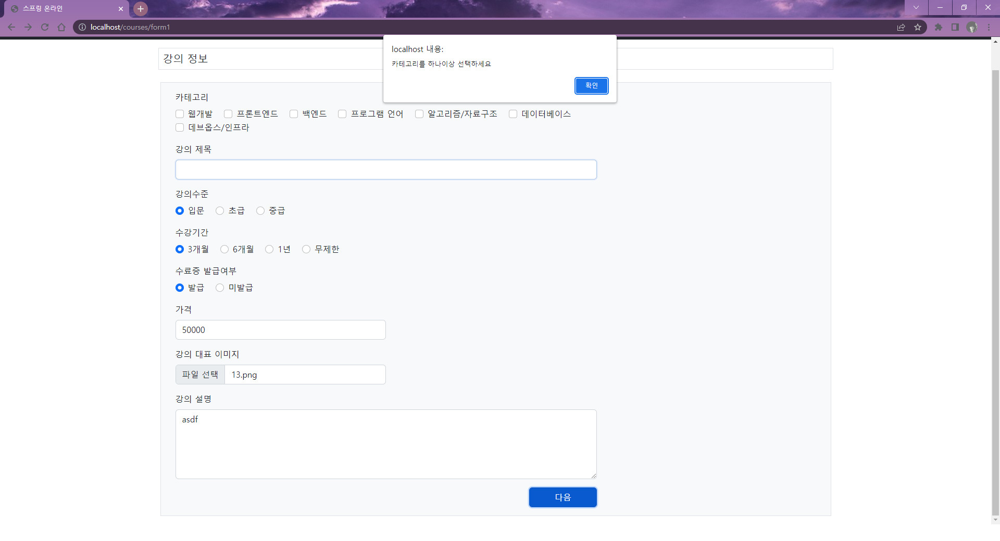
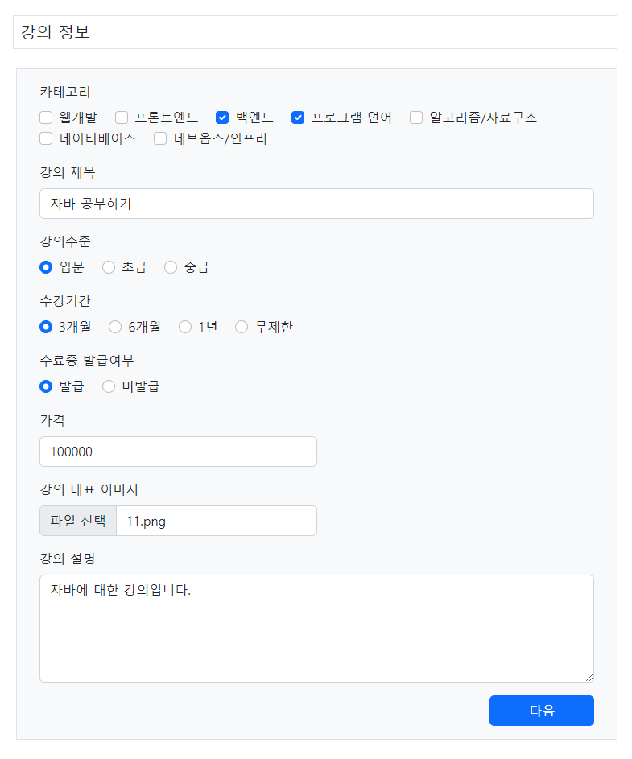
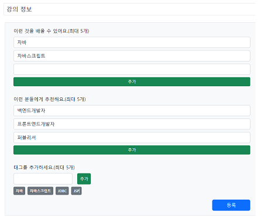
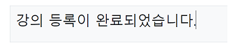
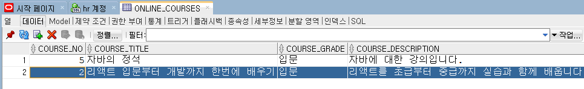
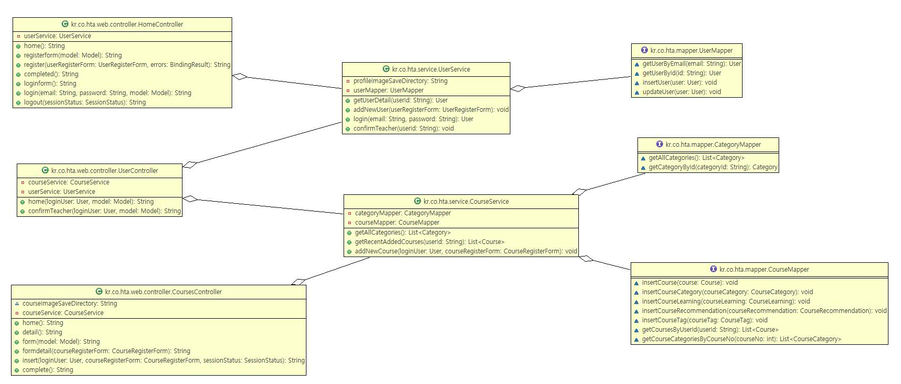
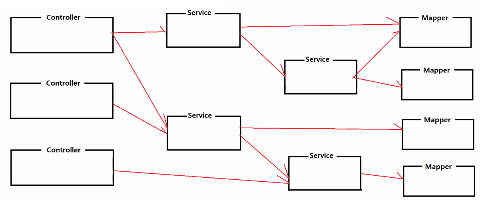

# 0720
- [0720](#0720)
- [jQuery](#jquery)
	- [jQuery객체의 주요 API](#jquery객체의-주요-api)
- [Spring Boot](#spring-boot)
	- [강의정보 등록시 입력값 확인하기](#강의정보-등록시-입력값-확인하기)
		- [***기본이벤트값의 실행(true/false에 따른)***](#기본이벤트값의-실행truefalse에-따른)
		- [실습결과](#실습결과)
	- [등록된 과정/카테고리 출력하기](#등록된-과정카테고리-출력하기)
		- [실습결과](#실습결과-1)
	- [클래스다이어그램](#클래스다이어그램)

<small><i><a href='http://ecotrust-canada.github.io/markdown-toc/'>Table of contents generated with markdown-toc</a></i></small>

# jQuery
>[jhta github document](https://github.com/eungsu/documents/blob/master/05-front-end/04%20jquery.txt)
- 자바스크립트 라이브러리
- 앨리먼트 검색 및 선택, 앨리먼트 조작, 이벤트 처리, ajax 요청
- 주요 API
  - `$("선택자")`
    - >[반드시 기억해야 하는 CSS 선택자 30개](https://code.tutsplus.com/ko/tutorials/the-30-css-selectors-you-must-memorize--net-16048)
    - 선택자에 해당하는 엘리먼트가 포함된 *jQuery객체를 반환*한다.
    - jQuery객체에는 선택된 엘리먼트와 그 엘리먼트를 대상으로 실행할 수 있는 메소드가 포함되어 있다.
    - `$("P")`
    - `$(".btn")`
    - `$("#name-field")`
    - `$("box div")`
    - `$(input[name='learnings']")`
  - `$(function() { ... })`
    - HTML Document객체가 준비되면 함수가 자동으로 실행된다.
    - `<body onload="함수();">`와`$(function() { ... })`
      - `<body onload="함수();">`는 HTML Document객체가 생성되고, 브라우저에 전부 표시된 후에 해당 함수가 자동으로 실행된다.
      - `$(function() { ... })`는 HTML Document객체가 생성되고, 브라우저에 표시되기 전에 해당함수가 자동으로 실행된다.(더 빠른 시점에 실행된다. 더 선호 되는 방식)
      - *jQuery객체를 반환하지 않는다.*
  - `$(엘리먼트)`
    - 지정된 엘리먼트를 jQuery객체에 포함시키고 있는 *jQuery객체를 반환*한다.
    - 즉 엘리먼트는 javascript가 기본으로 제공하는 메소드만 사용할 수 있고, `$(엘리먼트)`는 엘리먼트를 대상으로 jQuery객체가 가지고 있는 다양한 기능을 사용할 수 있다.
      ```javascript
	  let el = document.getElementById("#box");
	  // el -> HTML Element 객체
	  // $(el) -> jQuery 객체, 엘리먼트를 대상으로 다양한 jQuery 기능을 사용할 수 있다.
	  ```
  - `$("html 컨텐츠")`
    - 지정된 html 컨텐츠로 HTML 엘리먼트 객체를 생성하고, 그 엘리먼트가 포함된 *jQuery객체를 반환*한다.
      ```javascript
	  let htmlContent = "<p>안녕하세요</p>";
	  // htmlContent -> 단순 텍스트
	  // $("<p>안녕하세요</p>") -> jQuery 객체, html 컨텐츠가 표현하는 엘리먼트를 포함하고 있는 jQuery 객체
	  ```
## jQuery객체의 주요 API
- jQuery객체는 jQuery선택자에 의해 반환된 객체다.
  - `$(function() { ... })`API는 jQuery객체를 반환하지 않지만 
  - `$("선택자")`, `$(엘리먼트)`, `$("html 컨텐츠")`이 3개의 API는 jQuery객체를 반환한다.
- 이벤트 처리
  - 선택된 엘리먼트에서 지정한 이벤트가 발생했을 때 실행될 이벤트 햄들러 함수를 등록한다.
  - jQuery 사용 전
    ```html
	<button onclick="fn()">클릭</button>
    <script>
		function fn() {
			//수행할 작업;
		}
	</script>
	```
  - jQuery로 이벤트 처리 (비침투적인 방식)
	```html
	<button id="btn-cancel">클릭</button>
    <script>
		$("#btn-cancel").on('click',function() {
			//수행할작업
		})
	</script>
	```
  - 이벤트 처리 주요 API
    - ***.on("이벤트명", 이벤트핸들러함수)***
      - 선택된 엘리먼트에서 지정된 이벤트가 *발생할 때 마다* 실행될 이벤트핸들러 함수를 등록한다.
    - ***.one("이벤트명", 이벤트핸들러함수)***
      - 선택된 엘리먼트에서 지정된 이벤트가 *처음 발생했을 때만* 실행될 이벤트핸들러 함수를 등록한다.
    - ***.off("이벤트명")***
      - 선택된 엘리먼트에서 지정된 이벤트가 *발생했을 때* 실행될 이벤트 핸들러 함수를 제거한다.
    - ***.trigger("이벤트명")***
      - 선택된 엘리먼트에서 지정된 이벤트가 *강제로 발생하게* 한다.
    - ***.click(이벤트핸들러함수)***
      - 엘리먼트를 클릭했을 때 실행할 이벤트 핸들러 함수를 등록한다.
      - button, a, div, span, img 등 모든 엘리먼트에서 사용가능하다.
    - ***.keyup(이벤트핸들러함수)***
      - 키보드 입력시 key가 up될 때 실행할 이벤트 핸들러 함수를 등록한다.
      - input, password, textarea 등 엘리먼트에서 주로 사용한다.
    - ***.change(이벤트핸들러함수)***
      - 체크상태가 변경될 때, 선택된 옵션이 변경될 때 `<input type="number" />`에서 위/아래버튼으로 숫자를 변경할 때 실행할 이벤트핸들러 함수를 등록한다.
      - checkbox, radio, select 등 엘리먼트에서 주로 사용한다.
    - ***.submit(이벤트핸들러함수)***
      - 폼입력요소가 서버로 제출되기 전에 실행할 이벤트핸들러 함수를 등록한다.
      - form 엘리먼트에서 사용
    - ***.hover(이벤트햄들러함수, 이벤트핸들러함수)***
      - 마우스가 엘리먼트 안으로 진입했을 때, 엘리먼트를 벗어났을 때 실행할 이벤트핸들러 함수를 등록한다.
    - ***.scroll(이벤트햄들러함수)***
      - 화면이 스크롤될 때 실행될 이벤트핸들러 함수를 등록한다.
      - window객체에서 주로 사용한다.
      - >[MDN - scroll](https://developer.mozilla.org/ko/docs/Web/API/Document/scroll_event)
      - >[scroll event handler가 작동하지 않을때](https://velog.io/@euneun/scroll-event-handler%EA%B0%80-%EC%9E%91%EB%8F%99%ED%95%98%EC%A7%80-%EC%95%8A%EC%9D%84%EB%95%8C ) 
      - >[jQuery 웹페이지 최하단에 도달했을 때 스크롤 이벤트 작동(페이지 바닥 감지)](https://www.pinkcoding.com/class/web/jQuery/window-bottom-scroll-event/)
- 이벤트처리 예시
  ```html
  <script>
	$(function() {

		$("#box .btn-primary").click(function() {
			//HTML 엘리먼트 조작하기
		})

		$(":checkbox[name='toggle-checkbox']").change(function() {
			//HTML 엘리먼트 조작하기
		})

		$("#form-login").submit(function() {
			//HTML 엘리먼트 조작하기
		})

	})
  </script>
  ```
- HTML 조작
  - 조회기능
    - ***.text()***
	  - 엘리먼트의 텍스트 컨텐츠를 반환한다.
	  - `<p>안녕하세요</p>`
	  - `$("p").text() -> 안녕하세요`
    - ***.html()***
	  - 엘리먼트의 HTML 컨텐츠를 반환한다.
	  - `<div><p>안녕하세요</p></div>`
	  - `$("div").html() -> "<p>안녕하세요<p>`
    - ***.val()***
	  - 폼입력요소의 값을 반환한다.
	  - input, select, textarea에만 사용
    - ***.attr(name)***
      - 엘리먼트에서 지정된 속성명의 속성값을 반환한다.
      - `<a href="detail.hta">`
      - `$("a").attr('href') -> "detail.hta"`
    - ***.prop(name)***
      - 엘리먼트에서 지정된 프로퍼티명의 속성값을 반환한다.
      - checked, disabled, readOnly 프로퍼티값을 조회한다.
      - true/false 중 하나다.
      - checked는 checkbox, radio만 가능
      - readOnly는 checkbox, radio, input, select, textarea에서 가능
      - disabled는 checkbox, radio, input, select, textarea, button에서 가능
  - 변경기능
    - .text(text)
    - .html(htmlContent)
    - .val(value)
    - .attr(name, value)
    - .prop(name, value)
  - 클래스 조작하기
    - .addClass(클래스)
      - 엘리먼트에 지정된 클래스속성값을 추가한다.
      - `<button class="btn btn-primary">` // `$(".btn").addClass("btn-lg"); ---> <button class="btn btn-primary btn-lg">`
    - .removeClass(클래스)
      - 엘리먼트에 지정된 클래스속성값을 삭제한다.
      - `<button class="btn btn-primary btn-lg">` // `$(".btn").removeClass("btn-lg"); ---> <button class="btn btn-primary">`
    - .toggleClass(클래스)
      - 엘리먼트에서 지정된 클래스속성값을 토글시킨다.(***있으면 삭제, 없으면 추가***)
      - `<button class="btn btn-primary">` 			// `$(".btn").toggleClass("btn-lg"); ---> <button class="btn btn-primary btn-lg">`
      - `<button class="btn btn-primary btn-lg">`	// `$(".btn").toggleClass("btn-lg"); ---> <button class="btn btn-primary">`
    - hasClass(클래스)
      - 엘리먼트가 지정된 클래스속성값을 포함하고 있으면 true를 반환한다.
  - 엘리먼트 추가/삭제하기
    - .append(htmlcontent)
      - 엘리먼트의 ***마지막번째 자식엘리먼트 뒤에 추가***한다.
    - .prepend(htmlcontent)
      - 엘리먼트의 ***첫번째 자식엘리먼트 앞에 추가***한다.
    - .before(htmlcontent)
      - 엘리먼트 ***앞에 추가***한다.
    - .after(htmlcontent)
      - 엘리먼트 ***다음에 추가***한다.
      ```HTML
	  <p>before</p>
	  <div>
		<p>prepend</p>
		<p></p>
		<p></p>
		<p>append</p>
	  </div>
	  <p>after</p>

	  $('div').append("<p>append</p>")
	  $('div').prepend("<p>prepend</p>")
	  $('div').before("<p>before</p>")
	  $('div').after("<p>after</p>")
	  ```
    - .remove()
      - 엘리먼트를 삭제한다.
      ```html
	  <!-- .remove() 실행전 -->
	  <div>
		<p></p>
		<p></p>
	  </div>
	  $("div").remove();
	  <!-- .remove() 실행후 -->
	  ```
    - .empty()
      - 엘리먼트의 모든 자식 엘리먼트를 삭제한다.
	  ```html
	  <!-- .empty() 실행전 -->
	  <div>
		<p></p>
		<p></p>
	  </div>
	  $)"div".empty();
	  <!-- .empty() 실행후 -->
	  <div>
	  </div>
	  ```

- HTML 돌아다니기

- 기타 함수
  - `$(선택자).each(함수)`
    - 선택자로 선택된 엘리먼트의 갯수만큼 함수를 실행한다.
    - `function(index, element) { ... }`
      - index는 0부터 시작하는 인덱스값을 함수가 실행될 때마다 전달받는다.
      - element는 선택된 엘리먼트들을 0번째부터 함수가 실행될 때마다 하나씩 전달받는다.
        - index와 element는 전부 생략할 수 있다.
        - index와 element를 전부 생략하는 경우 함수실행될 때마다 전달되는 엘리먼트는 함수내부에서 this로 전달받는다.
	```jsp
	<p>10000</p>
	<p>15000</p>
	<p>10000</p>
	<p>20000</p>
	let totalPrice = 0;
	$("p").each(function(index, element) {
		let price = parseInt( $(element).text( ) );
		totalPrice += price;
	});

	$("p").each(function() {
		let price = parseInt( $(this).text( ) );
		totalPrice += price;
	});
	console.log("총금액: " + totalPrice);
	```
  -	`$.each(배열, 함수)`
  	- 배열의 아이템 갯수만큼 함수를 실행한다.
  	- `function(index, item) { ... }`
    	- index는 0부터 시작하는 인덱스값을 함수가 실행될 때마다 전달받는다.
		- item은 배열의 아이템들을 0번째부터 함수가 실행될 때마다 하나씩 전달받는다.

# Spring Boot
spring-online 프로젝트에서 온라인 교육 사이트 앱 실습
## 강의정보 등록시 입력값 확인하기
강의 정보 등록하기 폼에서 카테고리, 강의 제목, 가격, 강의 대표 이미지, 강의 설명을 모두 채워 넣거나 조건에 맞아야만 다음 버튼이 눌러지게, 즉 등록되게 한다.
* form1 수정 
  * div id 설정
  * script 추가
    * >[jquery - checkbox 컨트롤하기](https://junho85.pe.kr/625)
```jsp
<%@ page language="java" contentType="text/html; charset=UTF-8" pageEncoding="UTF-8"%>
<%@ include file="../common/tags.jsp" %>
<!DOCTYPE html>
<html>
<head>
<meta charset="UTF-8">
<meta name="viewport" content="width=device-width, initial-scale=1">
<link href="https://cdn.jsdelivr.net/npm/bootstrap@5.2.0-beta1/dist/css/bootstrap.min.css" rel="stylesheet">
<link rel="stylesheet" href="https://cdn.jsdelivr.net/npm/bootstrap-icons@1.9.0/font/bootstrap-icons.css">
<script src="https://cdn.jsdelivr.net/npm/bootstrap@5.2.0-beta1/dist/js/bootstrap.bundle.min.js"></script>
<script src="https://code.jquery.com/jquery-3.6.0.min.js"></script>
<title>스프링 온라인</title>
</head>
<body>
<%@ include file="../common/nav.jsp" %>
<div class="container my-3">
	<div class="row my-3">
		<div class="col">
			<h1 class="fs-5 border p-2">강의 정보</h1>
		</div>
	</div>
	<div class="row mb-3 px-3">
		<div class="col border bg-light">
			<form id="form-course" class="col-8 p-3" method="post" action="form2" enctype="multipart/form-data">
				<div class="mb-3">
					<label class="form-label">카테고리</label>
					<div>
					<c:forEach var="category" items="${categories }">
						<div class="form-check form-check-inline">
							<input class="form-check-input" type="checkbox" name="categoryIds" value="${category.id }">
							<label class="form-check-label" >${category.name }</label>
						</div>					
					</c:forEach>
					</div>
				</div>
				<div class="mb-3">
					<label class="form-label">강의 제목</label>
					<input class="form-control " type="text" name="title">
				</div>
				<div class="mb-3">
					<label class="form-label">강의수준</label>
					<div>
						<div class="form-check form-check-inline">
							<input class="form-check-input" type="radio" name="grade" value="입문" checked="checked">
							<label class="form-check-label" >입문</label>
						</div>
						<div class="form-check form-check-inline">
							<input class="form-check-input" type="radio" name="grade" value="초급">
							<label class="form-check-label" >초급</label>
						</div>
						<div class="form-check form-check-inline">
							<input class="form-check-input" type="radio" name="grade" value="중급">
							<label class="form-check-label" >중급</label>
						</div>
					</div>
				</div>
				<div class="mb-3">
					<label class="form-label">수강기간</label>
					<div>
						<div class="form-check form-check-inline">
							<input class="form-check-input" type="radio" name="period" value="3개월" checked="checked">
							<label class="form-check-label" >3개월</label>
						</div>
						<div class="form-check form-check-inline">
							<input class="form-check-input" type="radio" name="period" value="6개월">
							<label class="form-check-label" >6개월</label>
						</div>
						<div class="form-check form-check-inline">
							<input class="form-check-input" type="radio" name="period" value="1년">
							<label class="form-check-label" >1년</label>
						</div>
						<div class="form-check form-check-inline">
							<input class="form-check-input" type="radio" name="period" value="무제한">
							<label class="form-check-label" >무제한</label>
						</div>
					</div>
				</div>
				<div class="mb-3">
					<label class="form-label">수료증 발급여부</label>
					<div>
						<div class="form-check form-check-inline">
							<input class="form-check-input" type="radio" name="certificate" value="발급" checked="checked">
							<label class="form-check-label" >발급</label>
						</div>
						<div class="form-check form-check-inline">
							<input class="form-check-input" type="radio" name="certificate" value="미발급">
							<label class="form-check-label" >미발급</label>
						</div>
					</div>
				</div>
				<div class="mb-3">
					<label class="form-label">가격</label>
					<input class="form-control w-50" type="number" name="price" value="50000">
				</div>
				<div class="mb-3">
					<label class="form-label">강의 대표 이미지</label>
					<input class="form-control w-50" type="file" name="imageFile" >
				</div>
				<div class="mb-3">
					<label class="form-label">강의 설명</label>
					<textarea class="form-control" rows="5" name="description"></textarea>
				</div>
				<div class="text-end">
					<button type="submit" class="btn btn-primary px-5">다음</button>
				</div>				
			</form>
		</div>
	</div>
</div>
<script type="text/javascript">
$(function() {
	$("#form-course").submit(function() {
		// 선택된 카테고리가 하나이상인지 체크하기
		let checkedCategoryLength = $(":checkbox[name=categoryIds]:checked").length;
		if (checkedCategoryLength === 0) {
			alert("카테고리를 하나이상 선택하세요");
			return false;
		}
		// 제목필드에 값이 있는지 체크하기
		let titleValue = $.trim( $(":input[name=title]").val() );
		if (titleValue === "") {
			alert("제목은 필수 입력값입니다.");
			return false;
		}
		
		// 가격필드에 올바른 값이 설정되었는지 체크하기
		let priceValue = parseInt($(":input[name=price]").val());
		if (priceValue < 0) {
			alert("가격이 유효한 값이 아닙니다.");
			return false;
		}
		
		// 강의 이미지가 설정되어있는지 체크하기
		let imageFileValue = $.trim( $(":file[name=imageFile]").val() );
		if (imageFileValue === "") {
			alert("강의 이미지를 첨부해주세요");
			return false;
		}
		
		// 설명필드에 값이 있는지 체크하기
		let descriptionValue = $("textarea[name=description]").val();
		if (descriptionValue === "") {
			alert("내용은 필수입력값입니다.");
			return false;
		}
		
		return true;
	});
})
</script>
</body>
</html>
```

### ***기본이벤트값의 실행(true/false에 따른)***
* form, a 태그는 submit 이동에 대한 기본이벤트값이 (서버로 데이터 전달, 링크로 이동으로) 지정되어 있다.
* 만약 해당 이벤트(submit, click)에 대한 리턴 값이 true면 기본이벤트가 실행되고 false면 실행되지 않는다.

* form2 수정
  * 사용자와의 상호작용(form, input, button 등)에 해당하는 만큼 id를 부여하고 script를 작성한다.
  * 태그 추가의 경우 span태그와 input 태그를 같이 추가해야되므로 id를 
  * jQuery 변수명 앞에는 `$`문자를 붙이기를 좋아한다.(더 쉽게 이해할 수 있다.)
```jsp
<%@ page language="java" contentType="text/html; charset=UTF-8" pageEncoding="UTF-8"%>
<%@ include file="../common/tags.jsp" %>
<!DOCTYPE html>
<html>
<head>
<meta charset="UTF-8">
<meta name="viewport" content="width=device-width, initial-scale=1">
<link href="https://cdn.jsdelivr.net/npm/bootstrap@5.2.0-beta1/dist/css/bootstrap.min.css" rel="stylesheet">
<link rel="stylesheet" href="https://cdn.jsdelivr.net/npm/bootstrap-icons@1.9.0/font/bootstrap-icons.css">
<script src="https://cdn.jsdelivr.net/npm/bootstrap@5.2.0-beta1/dist/js/bootstrap.bundle.min.js"></script>
<script src="https://code.jquery.com/jquery-3.6.0.min.js"></script>
<title>스프링 온라인</title>
</head>
<body>
<%@ include file="../common/nav.jsp" %>
<div class="container my-3">
	<div class="row my-3">
		<div class="col">
			<h1 class="fs-5 border p-2">강의 정보</h1>
		</div>
	</div>
	<div class="row mb-3 px-3">
		<div class="col border bg-light">
			<form id="form-course" class="col-8 p-3" method="post" action="insert">
				<div class="mb-3">
					<label class="form-label">이런 것을 배울 수 있어요.(최대 5개)</label>
					<input class="form-control mb-2" type="text" name="learnings">
					<button type="button" class="btn btn-success btn-sm mb-3 w-100" id="btn-add-learning">추가</button>
				</div>
				<div class="mb-3">
					<label class="form-label">이런 분들에게 추천해요.(최대 5개)</label>
					<input class="form-control  mb-2" type="text" name="targets">
					<button type="button" class="btn btn-success btn-sm mb-3 w-100" id="btn-add-target">추가</button>
				</div>
				<div class="mb-3">
					<label class="form-label">태그를 추가하세요.(최대 5개)</label>
					<div class="d-flex justify-content-start">
						<input class="form-control w-25 me-3" type="text" id="input-tag">
						<button type="button" class="btn btn-success btn-sm "  id="btn-add-tag">추가</button>
					</div>
					<div class="mb-3 mt-2">
						<div id="tag-box"></div>
					</div>
				</div>
				<div class="text-end">
					<button type="submit" class="btn btn-primary px-5">등록</button>
				</div>				
			</form>
		</div>
	</div>
</div>
<script type="text/javascript">
$(function() {
	$("#btn-add-learning").click(function() {
		let learningFieldLength = $(":input[name=learnings]").length;
		if (learningFieldLength >= 5) {
			alert("최대 5개까지만 가능합니다.");
			return;
		}
		// 이벤트 핸들러 함수안에서 사용하는 this에는 이벤트가 발생한 그 엘리먼트가 들어있다.
		// this는 엘리먼트 객체다.
		// $(this)가 반환하는 객체는 jQuery 객체다.
		let content = '<input class="form-control mb-2" type="text" name="learnings">';
		$(this).before(content);
	});
	
	$("#btn-add-target").click(function() {
		let targetFieldLength = $(":input[name=targets]").length;
		if (targetFieldLength >= 5) {
			alert("최대 5개까지만 가능합니다.");
			return;
		}
		let content = '<input class="form-control  mb-2" type="text" name="targets">';
		$(this).before(content);
	});
	
	$("#btn-add-tag").click(function() {
		let $div = $("#tag-box");
		let $input = $("#input-tag");

		let tagLength = $(":input[name=tags]").length;
		if (tagLength >= 5) {
			alert("최대 5개까지만 가능합니다.");
			$input.val("");
			return;
		}
		
		let value = $input.val();
		if (value != "") {
			let spanContent = '<span class="badge text-bg-secondary rounded-1 p-2 me-2">'+value+'</span>';
			let hiddenContent = '<input type="hidden" name="tags" value="'+value+'" />'
			
			$div.before(spanContent);
			$div.append(hiddenContent);
			
			$input.val("");
		}		
	});
	
	$("#form-course").submit(function() {
		// 배울 수 있는 것 항목에 빈 값이 있는지 체크한다.
		let existEmptyLearning = false;
		$(":input[name=learnings]").each(function(index, element) {
			if ($(element).val() === "") {
				existEmptyLearning = true;
			}
		});
		if (existEmptyLearning) {
			alert("배울 수 있는 것 항목에 빈 값이 있습니다.");
			return false;
		}
		
		// 추천항목에 빈값이 있는지 체크한다.
		let existEmptyTarget = false;
		$(":input[name=targets]").each(function() {
			if ($(this).val() === "") {
				existEmptyTarget = true;
			}
		});
		if (existEmptyTarget) {
			alert("추천 항목에 빈 값이 있습니다.");
			return false;
		}
		
		// 태그가 하나 이상 있는지 체크한다.
		if ($("#tag-box input").length === 0) {
			alert("태그는 하나 이상 등록해야 합니다.");
			return false;
		}
		
		return true;
	});
	
})
</script>
</body>
</html>
```

### 실습결과

* 항목별로 입력하지 않으면 alert를 출력한다.
* 
## 등록된 과정/카테고리 출력하기
* CourseMapper인터페이스에서 유저아이디에 따른 과정 목록을 조회하는 추상메소드와 과정번호에 따른 과정카테고리목록을 가져오는 추상메소드를 추가
* VO수정 - CourseCategory, Category
* CourseMapper.xml 에서 SQL문, resultMap(Course객체) 작성
```xml
	<resultMap type="Course" id="CourseResultMap">
		<id column="course_no" property="no"/>
		<result column="course_title" property="title"/>
		<result column="course_grade" property="grade"/>
		<result column="course_description" property="description"/>
		<result column="course_price" property="price"/>
		<result column="course_discount_price" property="discountPrice"/>
		<result column="course_period" property=""/>
		<result column="course_certificate_completion" property="certificateCompletion"/>
		<result column="course_review_count" property="reviewCount"/>
		<result column="course_review_score" property="reviewScore"/>
		<result column="course_student_count" property="studentCount"/>
		<result column="course_disabled" property="disabled"/>
		<result column="course_created_date" property="createdDate"/>
		<result column="course_updated_date" property="updatedDate"/>
		<result column="user_id" property="user.id"/>
		<result column="course_imagename" property="imagename"/>
	</resultMap>
	
	<resultMap type="Course" id="CourseWithCategoriesResultMap" extends="CourseResultMap">
		<collection property="categories" column="course_no" select="kr.co.hta.mapper.CourseMapper.getCourseCategoriesByCourseNo"></collection>
	</resultMap>
	
	<!-- List<Course> getCoursesByUserId(String userId); -->
	<select id="getCoursesByUserId" parameterType="string" resultMap="CourseWithCategoriesResultMap">
		select *
		from online_courses
		where user_id = #{value}
		order by course_no desc
	</select>
	
	<!-- List<CourseCategory> getCourseCategoriesByCourseNo(int courseNo); -->
	<select id="getCourseCategoriesByCourseNo" parameterType="int" resultType="CourseCategory">
		select A.course_no as courseNo,
		       A.category_id as "category.id",
		       B.category_name as "category.name"
		from online_course_categories A, online_categories B
		where A.course_no = #{value}
		and A.category_id = B.category_id			
	</select>	
```

* CourseService.java에서 최근 등록된 과정들을 조회하는 메소드 추가(courseMapper의 getCourseByUserId(userId)를 리턴한다.)
```java
	public List<Course> getRecentAddedCourses(String userId) {
		return courseMapper.getCourseByUserId(userId);
	}
```
* UserController.java에서 /dashboard로 매핑될때 courses를 가져와 model에 저장하는 코드 추가
```java
	@GetMapping("/dashboard")
	public String home(@LoginUser User loginUser, Model model) {
		User user = userService.getUserDetail(loginUser.getId());
		model.addAttribute("user", user);
		
		List<Course> courses = courseService.getRecentAddedCourses(user.getId());
		model.addAttribute("courses", courses);
		
		return "user/home";
	}
```
* user/home.jsp 수정
  * 지시공유자일 경우에만 최근 등록한 강의 항목이 보이도록 한다.
  * courses를 DB에서 조회한 값 출력한다.
```jsp
<c:if test="${user.teacher eq 'Y' }">
	<div class="row mb-3">
		<div class="col-12">
			<div class="card">
				<div class="card-header">최근 등록한 강의</div>
				<div class="body p-3">
					<table class="table">
						<colgroup>
							<col width="20%">
							<col width="60%">
							<col width="20%">
						</colgroup>
						<thead>
							<tr>
								<th>카테고리</th>
								<th>제목</th>
								<th>가격</th>
							</tr>
						</thead>
						<tbody>
						<c:choose>
							<c:when test="${empty courses }">
								<tr>
									<td colspan="3" class="text-center">등록된 강의가 없습니다.</td>
								</tr>
							</c:when>
							<c:otherwise>
								<c:forEach var="course" items="${courses }">
									<tr>
										<td>${course.categories[0].category.name }</td>
										<td><a href="">${course.title }</a></td>
										<td><fmt:formatNumber value="${course.price }"/> 원</td>
									</tr>
								</c:forEach>
							</c:otherwise>
						</c:choose>
						</tbody>
					</table>
					<div class="text-end">
						<a href="" class="btn btn-primary btn-sm">내가 등록한 강의 전부 보기</a>
					</div>
				</div>
			</div>
		</div>
	</div>
</c:if>
```

### 실습결과
웹에서 강의정보 등록하고 DB 확인





## 클래스다이어그램 
Controller, Service, Mapper의 연결(참조)

* Controller는 Service를 참조하고 Service는 Mapper를 참조한다.
* Controller가 Mapper를 참조해선 안된다.
* Controller, Service, Mapper의 참조 예시
  * 