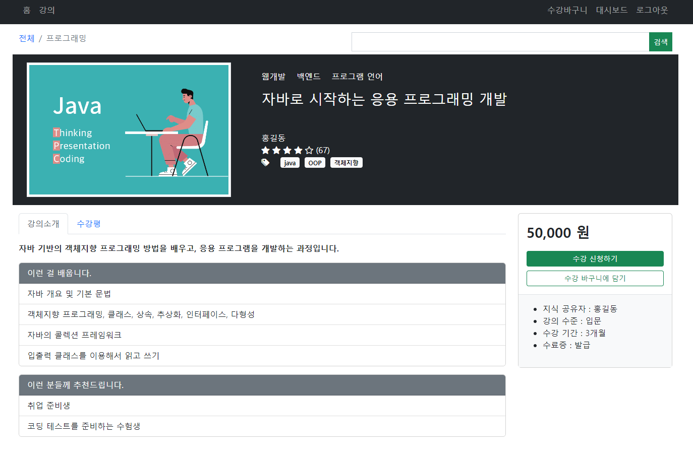
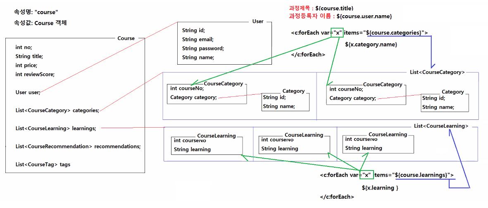
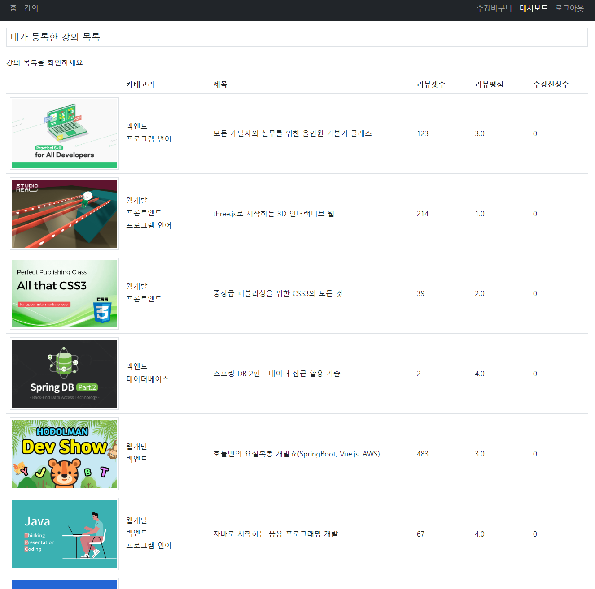
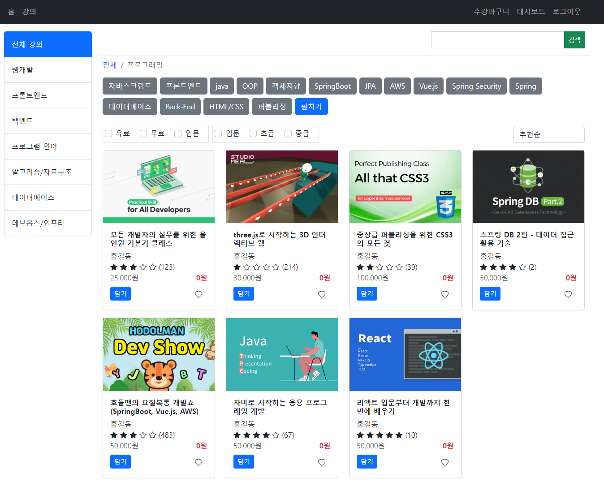

# 0721
- [0721](#0721)
- [Spring Boot](#spring-boot)
	- [강의상세페이지 구현하기](#강의상세페이지-구현하기)
		- [구현과정](#구현과정)
	- [지식 전달자 강의목록 구현하기](#지식-전달자-강의목록-구현하기)
		- [구현과정](#구현과정-1)
	- [강의목록페이지 구현하기](#강의목록페이지-구현하기)
		- [구현 과정](#구현-과정)
		- [forEach의 varStatus 속성](#foreach의-varstatus-속성)

<small><i><a href='http://ecotrust-canada.github.io/markdown-toc/'>Table of contents generated with markdown-toc</a></i></small>

# Spring Boot
spring-online 프로젝트에서 온라인 교육 사이트 앱 실습
## 강의상세페이지 구현하기
* 강의 제목 또는 한개의 강의에 해당하는 범위를 클릭하면 강의 상세 페이지로 이동한다.
* 강의와 관련된 정보들을 조회해 보여준다.
  * 이미지, 제목, 카테고리, 추천수, 별점, 태그, 설명, 배우는 내용, 추천하는 사람, 가격, 지식공유자  


  
### 구현과정
1. Mapper
   * CourseMapper.java 추상인터페이스에서 추상메소드 정의
     * 강의 목록, 강의 카테고리 목록, 강의 러닝 목록, 강의 추천 목록, 강의 태그 목록을 가져오는 추상메소드 정의
```java
	List<Course> getCoursesByUserId(String userId);
	List<CourseCategory> getCourseCategoriesByCourseNo(int courseNo);
	List<CourseLearning> getCourseLearningsByCourseNo(int courseNo);
	List<CourseRecommendation> getCourseRecommendationByCourseNo(int courseNo);
	List<CourseTag> getCourseTagsByCourseNo(int courseNo);
	
	Course getCourseByNo(int courseNo);
```
   * CourseMapper.xml 매퍼파일안의 `<mapper>`태그에서 정의
     * `<select>`태그, `<resultMap>`태그를 활용해 강의와 관련된 다양한 정보들을 DB에서 가져오는 코드(SQL문) 작성
```xml
	<resultMap type="Course" id="CourseResultMap">
		<id column="course_no" property="no"/>
		<result column="course_title" property="title"/>
		<result column="course_grade" property="grade"/>
		<result column="course_description" property="description"/>
		<result column="course_price" property="price"/>
		<result column="course_discount_price" property="discountPrice"/>
		<result column="course_period" property="period"/>
		<result column="course_certificate_completion" property="certificateCompletion"/>
		<result column="course_review_count" property="reviewCount"/>
		<result column="course_review_score" property="reviewScore"/>
		<result column="course_student_count" property="studentCount"/>
		<result column="course_disabled" property="disabled"/>
		<result column="course_created_date" property="createdDate"/>
		<result column="course_updated_date" property="updatedDate"/>
		<result column="course_imagename" property="imagename"/>
		<association property="user" column="user_id" select="kr.co.hta.mapper.UserMapper.getUserById"></association>
	</resultMap>

	<!-- List<CourseCategory> getCourseCategoriesByCourseNo(int courseNo); -->
	<select id="getCourseCategoriesByCourseNo" parameterType="int" resultType="CourseCategory">
		select A.course_no as courseNo,
		       A.category_id as "category.id",
		       B.category_name as "category.name"
		from online_course_categories A, online_categories B
		where A.course_no = #{value}
		and A.category_id = B.category_id			
	</select>
	
	<!-- List<CourseLearning> getCourseLearningsByCourseNo(int courseNo); -->
	<select id="getCourseLearningsByCourseNo" parameterType="int" resultType="CourseLearning">
		select course_no as courseNo, course_learning as learning
		from online_course_learnings
		where course_no = #{value}
	</select>
	
	<!-- List<CourseRecommendation> getCourseRecommendationsByCourseNo(int courseNo); -->
	<select id="getCourseRecommendationsByCourseNo" parameterType="int" resultType="CourseRecommendation">
		select course_no as courseNo, course_recommended_target as target
		from online_course_recommendations
		where course_no = #{value}
	</select>
	
	<!-- List<CourseTag> getCourseTagsByCourseNo(int courseNo); -->
	<select id="getCourseTagsByCourseNo" parameterType="int" resultType="CourseTag">
		select course_no as courseNo, course_tag as tag
		from online_course_tags
		where course_no = #{value}
	</select>
	
	<resultMap type="Course" id="CourseDetailResultMap" extends="CourseResultMap">
		<collection property="categories" column="course_no" select="kr.co.hta.mapper.CourseMapper.getCourseCategoriesByCourseNo"></collection>
		<collection property="learnings" column="course_no" select="kr.co.hta.mapper.CourseMapper.getCourseLearningsByCourseNo"></collection>
		<collection property="recommendations" column="course_no" select="kr.co.hta.mapper.CourseMapper.getCourseRecommendationsByCourseNo"></collection>
		<collection property="tags" column="course_no" select="kr.co.hta.mapper.CourseMapper.getCourseTagsByCourseNo"></collection>
	</resultMap>
		
	<!-- Course getCourseByNo(int courseNo); -->
	<select id="getCourseByNo" parameterType="int" resultMap="CourseDetailResultMap">
		select *
		from online_courses
		where course_no = #{value}
	</select>
```

2. Service
   * CourseService.java에서 Mapper와 Controller를 연결하는 메소드 정의
     * 방법 2개
       1. resultMap으로 구현한 `courseMapper.getCourseByNo(courseNo);`을 return
       2. resultMap으로 구현하지 않고 Course객체에 값을 넣는 메소드를 정의
```java
	// 1번째 방법 : resultMap 사용
	public Course getCourseDetail(int courseNo) {
		/*
	 		<resultMap type="Course" id="CourseDetailResultMap" extends="CourseResultMap">
				<collection property="categories" column="course_no" select="getCourseCategoriesByCourseNo"></collection>
				<collection property="learnings" column="course_no" select="getCourseLearningsByCourseNo"></collection>
				<collection property="recommendations" column="course_no" select="getCourseRecommendationByCourseNo"></collection>
				<collection property="tags" column="course_no" select="getCourseTagsByCourseNo"></collection>
			</resultMap>

			<select id="getCourseByNo" parameterType="int" resultMap="CourseDetailResultMap">
				select *
				from online_courses
				where course_no = #{value}
			</select>
		 */
		return courseMapper.getCourseByNo(courseNo);
	}
	
	//	2번쨰 방법 : Course 객체 사용
	public Course getCourseDetail(int courseNo) {
		/*
	 		<select id="getCourseByNo" parameterType="int" resultMap="CourseResultMap">
				select *
				from online_courses
				where course_no = #{value}
			</select>		  
		 */
		Course course = courseMapper.getCourseByNo(courseNo);

		List<CourseCategory> categories = courseMapper.getCourseCategoriesByCourseNo(course.getNo());
		List<CourseLearning> learnings = courseMapper.getCourseLearningsByCourseNo(course.getNo());
		List<CourseRecommendation> recommendations = courseMapper.getCourseRecommendationByCourseNo(course.getNo());
		List<CourseTag> tags = courseMapper.getCourseTagsByCourseNo(course.getNo());
		
		course.setCategories(categories);
		course.setLearnings(learnings);
		course.setRecommendations(recommendations);
		course.setTags(tags);
		
		return course;
		
	}
```

3. Controller
   * CoursesController.java
     * course객체를 가져와 Model 속성으로 저장하고 "course/detail"URL로 GET매핑한다.
```java
	@GetMapping(path = "/detail")
	public String detail(@RequestParam("no") int courseNo, Model model) {
		Course course = courseService.getCourseDetail(courseNo);
		model.addAttribute("course", course);
		
		return "course/detail";
	}
```

4. JSP
   * detail.jsp
     * 필요한 정보 또는 정보리스트를 필요시 forEach문을 사용하여 model에 저장된 속성 "course"에서 적절하게 뽑아서 사용한다.
     * Course객체의 구조를 파악하고 필요한 Data를 적절하게 얻어 내야 한다.
       * ex) 강의 카테고리 이름 : course.categories를 forEach로 한개씩 var(courseCategory)에 저장하고 courseCategory.category.name으로 꺼낸다. 
     * 사용한 강의 관련 Data
       * 이미지
       * 강의카테고리
       * 강의 제목
       * 강의 유저 이름
       * 리뷰스코어에 따른 별점 디자인
       * 리뷰카운트
       * 강의 태그
       * 강의 설명
       * 강의 러닝
       * 강의 추천
```jsp
<%@ page language="java" contentType="text/html; charset=UTF-8" pageEncoding="UTF-8"%>
<%@ include file="../common/tags.jsp" %>
<!DOCTYPE html>
<html>
<head>
<meta charset="UTF-8">
<meta name="viewport" content="width=device-width, initial-scale=1">
<link href="https://cdn.jsdelivr.net/npm/bootstrap@5.2.0-beta1/dist/css/bootstrap.min.css" rel="stylesheet">
<link rel="stylesheet" href="https://cdn.jsdelivr.net/npm/bootstrap-icons@1.9.0/font/bootstrap-icons.css">
<script src="https://cdn.jsdelivr.net/npm/bootstrap@5.2.0-beta1/dist/js/bootstrap.bundle.min.js"></script>
<script src="https://code.jquery.com/jquery-3.6.0.min.js"></script>
<title>스프링 온라인</title>
</head>
<body>
<%@ include file="../common/nav.jsp" %>
<div class="container my-3">
	<div class="row mb-1">
		<div class="col-6">
			<nav aria-label="breadcrumb">
				<ol class="breadcrumb">
					<li class="breadcrumb-item"><a href="/courses" class="text-decoration-none">전체</a></li>
					<li class="breadcrumb-item active" aria-current="page">프로그래밍</li>
				</ol>
			</nav>
		</div>
		<div class="col-6 text-end">
			<form>
				<div class="input-group">
					<input type="text" class="form-control rounded-0"  name="keyword">
					<button class="btn btn-success btn-sm rounded-0" type="button" >검색</button>
				</div>
			</form>				
		</div>
	</div>
	<div class="row mb-3 bg-dark p-3">
		<div class="col-4">
			
		</div>
		<div class="col-8 bg-dark p-3 ps-5 text-white">
			<p>
			<c:forEach var="courseCategory" items="${course.categories }">
				<span class="me-3">${courseCategory.category.name }</span>
			</c:forEach>
			</p>
			<h3 class="w-bold mb-5">${course.title }</h3>
			<p class="m-0">${course.user.name }</p>
			<p class="m-0">
				<i class="bi ${course.reviewScore gt 0 ? 'bi-star-fill' : 'bi-star' }"></i>
				<i class="bi ${course.reviewScore gt 1 ? 'bi-star-fill' : 'bi-star' }"></i>
				<i class="bi ${course.reviewScore gt 2 ? 'bi-star-fill' : 'bi-star' }"></i>
				<i class="bi ${course.reviewScore gt 3 ? 'bi-star-fill' : 'bi-star' }"></i>
				<i class="bi ${course.reviewScore gt 4 ? 'bi-star-fill' : 'bi-star' }"></i>
				(${course.reviewCount })
			</p>
			<p class="m-0">
				<i class="bi bi-tags-fill me-3"></i>
				<c:forEach var="courseTag" items="${course.tags }">
					<span class="rounded-1 badge text-bg-light me-1">${courseTag.tag }</span>
				</c:forEach>
			</p>
		</div>
	</div>
	<div class="row mb-3">
		<div class="col-9">
			<nav>
  				<div class="nav nav-tabs" id="nav-tab" role="tablist">
					<button class="nav-link active" id="nav-home-tab" data-bs-toggle="tab" data-bs-target="#nav-home" type="button" role="tab" aria-controls="nav-home" aria-selected="true">강의소개</button>
					<button class="nav-link" id="nav-review-tab" data-bs-toggle="tab" data-bs-target="#nav-review" type="button" role="tab" aria-controls="nav-review" aria-selected="false">수강평</button>
				</div>
			</nav>
			<div class="tab-content" id="nav-tabContent">
				<div class="tab-pane fade show active pt-3" id="nav-home" role="tabpanel" aria-labelledby="nav-home-tab" tabindex="0">
					<p class="fw-bold">${course.description }</p>
					
					<div class="card mb-3">
						<div class="card-header text-bg-secondary">이런 걸 배웁니다.</div>
						<ul class="list-group list-group-flush">
						<%-- 
							items="${course.learnings }" -> List<CourseLearning>
							var="courseLearning" <--- courseLearning(courseNo, learning 멤버변수 보유) 객체 하나
						--%>
						<c:forEach var="courseLearning" items="${course.learnings }">
    						<li class="list-group-item">${courseLearning.learning }</li>
						</c:forEach>
						</ul>
					</div>
					
					<div class="card mb-3">
						<div class="card-header text-bg-secondary">이런 분들께 추천드립니다.</div>
						<ul class="list-group list-group-flush">
						<%-- 
							items="${course.recommendations }" -> List<CourseRecommendation>
							var="courseRecommendation" <--- courseRecommendation(courseNo, target 멤버변수 보유) 객체 하나
						--%>
						 <c:forEach var="courseRecommendation" items="${course.recommendations }">
    						<li class="list-group-item">${courseRecommendation.target }</li>
						 </c:forEach>
  						</ul>
					</div>
					
				</div>
				<div class="tab-pane fade" id="nav-review" role="tabpanel" aria-labelledby="nav-review-tab" tabindex="0">
					<!-- 리뷰목록을 표시한다 -->
					<p>이 과정에 등록된 수강생들의 리뷰를 확인하세요!</p>
				</div>
			</div>
		</div>
		<div class="col-3">
			<div class="card">
				<div class="card-body border-bottom ">
					<p class="card-text"><strong class="fs-3"><fmt:formatNumber value="${course.price }"/> 원</strong></p>
					<div>
						<a href="request?no=${course.no }" class="btn btn-success w-100 btn-sm mb-2">수강 신청하기</a>
						<a href="/cart/add?no=${course.no }" class="btn btn-outline-success w-100 btn-sm">수강 바구니에 담기</a>
					</div>
				</div>
				<div class="card-body bg-light">
					<ul>
						<li>지식 공유자 : ${course.user.name }</li>
						<li>강의 수준 : ${course.grade }</li>
						<li>수강 기간 : ${course.period }</li>
						<li>수료증 : ${course.certificateCompletion }</li>
					</ul>
				</div>
			</div>
		</div>
	</div>
</div>
</body>
</html>
```
* 아직 구현하지 않은 기능 목록
  * 수강평(리뷰)목록 tab
  * 수강 신청하기 기능
  * 수강바구니 담기 기능 미구현


* 복잡한 Course객체에서 필요한 데이터들을 forEach를 이용해 반복해서 꺼내기

## 지식 전달자 강의목록 구현하기
* 사용자가 로그인후 대시보드 탭에서 '최근 등록한 강의' 섹션을 확인할 수 있다.
* '내가 등록한 강의 전부 보기' 버튼을 클릭하면 '내가 등록한 강의 목록' 페이지로 연결된다.
* 해당 사용자의 강의 목록을 올바른 이미지, 제목, 리뷰 등의 정보를 조회해 보여준다.



### 구현과정
1. Controller
   * UserController.java
     * loginUser의 강의 목록을 가져와 모델 객체에 저장하고 user/courses로 GET 매핑한다.
```java
	@GetMapping("/courses")
	public String courses(@LoginUser User loginUser, Model model) {
		List<Course> courses = courseService.getMyCourses(loginUser.getId());
		model.addAttribute("courses", courses);
		
		return "user/courses";
	}
```
2. Service
   * CoursesService.java
     * controller와 mapper를 연결해주는 역할.
     * mapper에서 메소드를 호출해 사용.
```java
	public List<Course> getMyCourses(String userId) {
		return courseMapper.getCoursesByUserId(userId);
	}
```
3. Mapper
   * CourseMapper.java
     * 추상인터페이스로 유저아이디에 따라 강의목록을 조회하는 추상메소드 정의
```java
List<Course> getCoursesByUserId(String userId);
```
   * CourseMapper.xml
     * mapper태그로 추상인터페이스에 정의한 추상메소드를 구체적으로 정의하고 DB에서 데이터를 조회(select SQL문)한다.
     * CourseResultMap을 확장한 CourseWithCategoriesResultMap을 사용해 getCoursesByUserId라는 select SQL문을 정의한다.
```xml
	<resultMap type="Course" id="CourseResultMap">
		<id column="course_no" property="no"/>
		<result column="course_title" property="title"/>
		<result column="course_grade" property="grade"/>
		<result column="course_description" property="description"/>
		<result column="course_price" property="price"/>
		<result column="course_discount_price" property="discountPrice"/>
		<result column="course_period" property="period"/>
		<result column="course_certificate_completion" property="certificateCompletion"/>
		<result column="course_review_count" property="reviewCount"/>
		<result column="course_review_score" property="reviewScore"/>
		<result column="course_student_count" property="studentCount"/>
		<result column="course_disabled" property="disabled"/>
		<result column="course_created_date" property="createdDate"/>
		<result column="course_updated_date" property="updatedDate"/>
		<result column="course_imagename" property="imagename"/>
		<association property="user" column="user_id" select="kr.co.hta.mapper.UserMapper.getUserById"></association>
	</resultMap>
	
	<resultMap type="Course" id="CourseWithCategoriesResultMap" extends="CourseResultMap">
		<collection property="categories" column="course_no" select="kr.co.hta.mapper.CourseMapper.getCourseCategoriesByCourseNo"></collection>
	</resultMap>
	
	<!-- List<Course> getCoursesByUserId(String userId); -->
	<select id="getCoursesByUserId" parameterType="string" resultMap="CourseWithCategoriesResultMap">
		select *
		from online_courses
		where user_id = #{value}
		order by course_no desc
	</select>
```
4. JSP
   * user/courses.jsp
     * 간단하게 강의 목록을 보여주는 페이지를 생성
```jsp
<%@ page language="java" contentType="text/html; charset=UTF-8" pageEncoding="UTF-8"%>
<%@ include file="../common/tags.jsp" %>
<!DOCTYPE html>
<html>
<head>
<meta charset="UTF-8">
<meta name="viewport" content="width=device-width, initial-scale=1">
<link href="https://cdn.jsdelivr.net/npm/bootstrap@5.2.0-beta1/dist/css/bootstrap.min.css" rel="stylesheet">
<script src="https://cdn.jsdelivr.net/npm/bootstrap@5.2.0-beta1/dist/js/bootstrap.bundle.min.js"></script>
<script src="https://code.jquery.com/jquery-3.6.0.min.js"></script>
<title>스프링 온라인</title>
</head>
<body>
<c:set var="menu" value="dashboard" />
<%@ include file="../common/nav.jsp" %>
<div class="container my-3">
	<div class="row my-3">
		<div class="col">
			<h1 class="fs-5 border p-2">내가 등록한 강의 목록</h1>
		</div>
	</div>
    <div class="row mb-3">
        <div class="col">
        	<p>강의 목록을 확인하세요</p>
        	<table class="table">
        		<colgroup>
        			<col width="20%">
        			<col width="15%">
        			<col width="*%">
        			<col width="10%">
        			<col width="10%">
        			<col width="10%">
        		</colgroup>
        		<thead>
        			<tr>
        				<th></th>
        				<th>카테고리</th>
        				<th>제목</th>
        				<th>리뷰갯수</th>
        				<th>리뷰평점</th>
        				<th>수강신청수</th>
        			</tr>
        		</thead>
        		<tbody>
        		<c:choose>
        			<c:when test="${empty courses }">
        				<tr>
        					<td colspan="6" class="text-center">등록된 과정이 없습니다.</td>
       					</tr>
   					</c:when>
   					<c:otherwise>
   						<c:forEach var="course" items="${courses }">
   							<tr class="align-middle">
   								<td></td>
   								<td>
   								<c:forEach var="cc" items="${course.categories }">
   									<div class="mb-1">${cc.category.name }</div>
   								</c:forEach>
  								</td>
  								<td><a href="/courses/detail?no=${course.no }" class="text-decoration-none text-dark">${course.title }</td>
  								<td>${course.reviewCount }</td>
  								<td>${course.reviewScore }</td>
  								<td>${course.studentCount }</td>
							</tr>
						</c:forEach>
					</c:otherwise>
				</c:choose>
        		</tbody>
        	</table>
        </div>
    </div>
</div>
</body>
</html>
```
5. homepage 링크연결(참조)
   * home.jsp
     * 절대참조로 파일 위치를 정확히 확인하고 작성한다.
     * courses/detail.jsp와 다르게 courses만 적는다. (현재URL에서 같은 user아래 위치하기 때문)
```jsp
<div class="text-end">
	<!-- 
		현재URL : localhost/user/dashboard
		링크주소: localhost/user/courses
		-->
	<a href="courses" class="btn btn-primary btn-sm">내가 등록한 강의 전부 보기</a>
</div>
```

## 강의목록페이지 구현하기
* 상위 header nav의 강의 탭을 클릭하면 강의 페이지로 연결된다.
* 강의목록페이지
  * 전체 강의 및 카테고리별 강의목록을 조회할 수 있다.
  * 태그별로 강의 목록을 조회할 수 있다.
  * 태그의 경우 선택/비선택에 따라 디자인과 조회목록이 달라진다.
  * 태그펼치기 버튼을 클릭하면 저장된 모든 태그를 보여준다/감춘다(15개까지 보여준다.).



### 구현 과정
1. Controller
   * CoursesController.java
```java
	@GetMapping
	public String home(String cat, Model model) {
		List<String> tags = courseService.getAllTags();
		model.addAttribute("tags", tags);
	
		List<Category> categories = courseService.getAllCategories();
		model.addAttribute("categories", categories);

		List<Course> courses = courseService.getCoursesByCategoryId(cat);
		model.addAttribute("courses", courses);
		
		return "course/home";
	}
```
2. Service
   * CourseService.java
```java
	public List<Category> getAllCategories() {
		return categoryMapper.getAllCategories();
	}

	public List<Course> getCoursesByCategoryId(String categoryId) {
		return courseMapper.getCoursesByCategoryId(categoryId);
	}

	public List<String> getAllTags() {
		return courseMapper.getAllTags();
	}
```
3. Mapper
   * CourseMapper.java 인터페이스
```java
	List<String> getAllTags();

	List<Course> getCoursesByCategoryId(@Param("categoryId") String categoryId);
```
   * CourseMapper.xml
```xml
	<!-- List<Course> getCoursesByCategoryId(String categoryId); -->
	<select id="getCoursesByCategoryId" resultMap="CourseResultMap">
		select *
		from online_courses
		<if test="categoryId != null">
			where course_no in (select course_no
							    from online_course_categories
							    where category_id = #{categoryId})
		</if>
		order by course_no desc
	</select>

	<!-- List<String> getAllTags(); -->
	<select id="getAllTags" resultType="string">
		select distinct course_tag
		from online_course_tags
	</select>
	
```
   * CategoryMapper.java 인터페이스
```java
	List<Category> getAllCategories();
```
   * CategoryMapper.xml
```xml
	<!-- List<Category> getAllCategories(); -->
	<select id="getAllCategories" resultType="Category">
		select category_id as id, category_name as name
		from online_categories
		order by category_id asc
	</select>
```
4. JSP
   * course/home.jsp
     * 왼쪽 nav카테고리 리스트구현
       * param.cat이 비어있으면 전체 강의가 active bootstrap디자인 추가, category.id와 일치하면 해당하는 카테고리가 class에 active추가
       * 카테고리는 Model의 categories 속성의 값을 가져와 forEach로 반복 출력한다.
     * 태그 선택/비선택 구현
       * Model의 tags 속성을 `varStatus="loop"`속성을 추가한 c:forEach태그로 구현
       * loop.count(1부터 세었을 때 현재 번호) 가 15보다 클 경우 extend-tag라는 class명을 붙이고(script에서 사용) d-none 부트스트랩디자인클래스를 붙인다.
       * 태그 스크립트 구현
         * box-buttons 아이디의 extend-tag 클래스인 요소를 태그버튼을 클릭했을 때 toggleClass() 메소드로 "d-none"디자인속성을 부여한다.
         * toggle은 특정 디자인요소를 끄거나 키는 용도로 사용하는 것이다.
         * box-buttons 아이디의 요소를 `on('click', '현재상태', 함수() {}) `메소드로 사용자가 클릭했을 때 'btn-secondary' 또는 'btn-success'인지 확인해 반대로 바꾼다.
         * 2개의 디자인요소가 서로 반대되는 상황에서 삭제/추가 될 수 있는 방법이다.
         
```jsp
<%@ page language="java" contentType="text/html; charset=UTF-8" pageEncoding="UTF-8"%>
<%@ include file="../common/tags.jsp" %>
<!DOCTYPE html>
<html>
<head>
<meta charset="UTF-8">
<meta name="viewport" content="width=device-width, initial-scale=1">
<link href="https://cdn.jsdelivr.net/npm/bootstrap@5.2.0-beta1/dist/css/bootstrap.min.css" rel="stylesheet">
<link rel="stylesheet" href="https://cdn.jsdelivr.net/npm/bootstrap-icons@1.9.0/font/bootstrap-icons.css">
<script src="https://cdn.jsdelivr.net/npm/bootstrap@5.2.0-beta1/dist/js/bootstrap.bundle.min.js"></script>
<script src="https://code.jquery.com/jquery-3.6.0.min.js"></script>
<title>스프링 온라인</title>
</head>
<body>
<%@ include file="../common/nav.jsp" %>
<div class="container my-3">
	<div class="row mb-3">
		<div class="col-2">
			<!-- 카테고리 리스트  -->
			<div class="list-group">
				<a href="courses" class="list-group-item list-group-item-action py-3 ${empty param.cat ? 'active' : '' }">전체 강의</a>
				<c:forEach var="category" items="${categories }">
					<a href="courses?cat=${category.id }" class="list-group-item list-group-item-action py-3 ${param.cat eq category.id ? 'active' : '' }"> ${category.name }</a>
				</c:forEach>
			</div>
		</div>
		<div class="col-10">
			<div class="row justify-content-md-end border-bottom mb-2">
				<div class="col col-4">
					<form>
						<div class="input-group mb-3">
							<input type="text" class="form-control rounded-0"  name="keyword">
							<button class="btn btn-success btn-sm rounded-0" type="button" >검색</button>
						</div>
					</form>				
				</div>
			</div>
			<div class="row mb-3">
				<div class="col-12">
					<nav aria-label="breadcrumb">
						<ol class="breadcrumb">
							<li class="breadcrumb-item"><a href="/courses" class="text-decoration-none">전체</a></li>
							<li class="breadcrumb-item active" aria-current="page">프로그래밍</li>
						</ol>
					</nav>
					<div id="box-buttons">
						<c:forEach var="tag" items="${tags }" varStatus="loop">
							<button class="btn btn-secondary mb-2 ${loop.count gt 15 ? 'extend-tag d-none' : '' }">${tag }</button>
						</c:forEach>
						<button class="btn btn-primary mb-2" id="btn-toggle-tags">펼치기</button>
					</div>
				</div>
			</div>
			<div class="row mb-3">
				<div class="col-10 d-flex justified-content-start">
					<div class="border p-1 me-2">
						<div class="form-check form-check-inline ">
  							<input class="form-check-input" type="checkbox" value="option1">
 							<label class="form-check-label" >유료</label>
						</div>
						<div class="form-check form-check-inline">
							<input class="form-check-input" type="checkbox" value="option2">
							<label class="form-check-label" >무료</label>
						</div>
						<div class="form-check form-check-inline">
							<input class="form-check-input" type="checkbox" value="option2">
							<label class="form-check-label" >입문</label>
						</div>
					</div>
					<div class="border p-1">
						<div class="form-check form-check-inline">
							<input class="form-check-input" type="checkbox" value="option2">
							<label class="form-check-label" >입문</label>
						</div>
						<div class="form-check form-check-inline">
							<input class="form-check-input" type="checkbox" value="option2">
							<label class="form-check-label" >초급</label>
						</div>
						<div class="form-check form-check-inline">
							<input class="form-check-input" type="checkbox" value="option2">
							<label class="form-check-label" >중급</label>
						</div>
					</div>
				</div>
				<div class="col-2">
					<select class="form-control">
						<option> 추천순</option>
						<option> 최신순</option>
						<option> 평점순</option>
					</select>
				</div>
			</div>
			<div class="row mb-3">
			<c:choose>
				<c:when test="${empty courses }">
					<div class="col-12">
						<p class="text-center">검색결과가 존재하지 않습니다.</p>
					</div>
				</c:when>
				<c:otherwise>
					<c:forEach var="course" items="${courses }">
						<div class="col-3 mb-3">
							<div class="card">
								
								<div class="card-body">
									<h5 class="card-title fs-6"><strong>${course.title }</strong></h5>
									<p class="card-text m-0">${course.user.name }</p>
									<p class="card-text m-0">
										<i class="bi ${course.reviewScore gt 0  ? 'bi-star-fill' : 'bi-star' }"></i>
										<i class="bi ${course.reviewScore gt 1  ? 'bi-star-fill' : 'bi-star' }"></i>
										<i class="bi ${course.reviewScore gt 2  ? 'bi-star-fill' : 'bi-star' }"></i>
										<i class="bi ${course.reviewScore gt 3  ? 'bi-star-fill' : 'bi-star' }"></i>
										<i class="bi ${course.reviewScore gt 4  ? 'bi-star-fill' : 'bi-star' }"></i>
										(${course.reviewCount })
									</p>
									<p class="card-text m-0">
										<span class="text-muted text-decoration-line-through"><fmt:formatNumber value="${course.price }" />원</span>
										<strong class="text-bold text-danger float-end"><fmt:formatNumber value="${course.discountPrice }" />원</strong>
									</p>
									<div class="mt-2">
										<a class="btn btn-primary btn-sm" >담기</a>
										<button class="btn border-0 float-end"><i class="bi bi-heart"></i></button>
									</div>
								</div>
							</div>
						</div>
					</c:forEach>
				</c:otherwise>
			</c:choose>
			</div>
		</div>
	</div>
</div>
<script type="text/javascript">
$(function() {
	let $extendTags = $("#box-buttons .extend-tag");
	
	$("#btn-toggle-tags").click(function() {
		// this는 클릭한 버튼 엘리먼트다.
		let text = $(this).text();
		$(this).text(text === "펼치기" ? "접기" : "펼치기")
		
		$extendTags.toggleClass("d-none");
	});
	
	$("#box-buttons").on("click", '.btn-secondary', function() {
		$(this).removeClass("btn-secondary").addClass("btn-success");
	});
	$("#box-buttons").on('click', '.btn-success', function() {
		$(this).removeClass("btn-success").addClass("btn-secondary");
	});
})
</script>
</body>
</html>
```

### forEach의 varStatus 속성
JSTL에서 forEach 태그의 varStatus속성
> [[JSP/JSTL] JSTL, foreach에서의 varStatus 속성 이용
출처: https://postitforhooney.tistory.com/entry/JSPJSTL-JSTL-foreach에서의-varStatus-속성-이용 [PostIT:티스토리]](https://postitforhooney.tistory.com/entry/JSPJSTL-JSTL-foreach%EC%97%90%EC%84%9C%EC%9D%98-varStatus-%EC%86%8D%EC%84%B1-%EC%9D%B4%EC%9A%A9)

* 반복문 안에서 변수상태를 활용할 수 있게 해주는 속성이다.
* 활용 가능한 상태변수
  * varStatus상태명.current
    * 현재 변수 번호
  * varStatus상태명.count
    * 1부터의 순서
  * varStatus상태명.index
    * 0부터의 순서
  * varStatus상태명.first
    * 첫번째인지 여부
    * index == 0 이면 true, count == 1 이면 true
  * varStatus상태명.last
    * 마지막인지 여부
    * index == 마지막 번호면 true
  * varStatus상태명.begin
    * forEach의 시작 번호
  * varStatus상태명.end
    * forEach의 끝 번호
  * varStatus상태명.step
    * forEach의 증가값
* 사용예시
```jsp
<c:foreach items="${list}" var="list" varStatus="status">
	<c:out value="${status.index}" /> / <c:out value="${status.end}" />
</c:foreach>

<c:forEach var="tag" items="${tags }" varStatus="loop">
	<button class="btn btn-secondary mb-2 ${loop.count gt 15 ? 'extend-tag d-none' : '' }">${tag }</button>
</c:forEach>
```