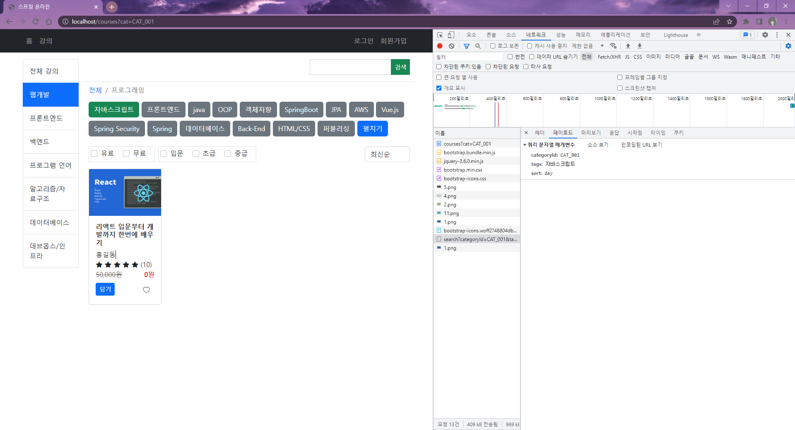
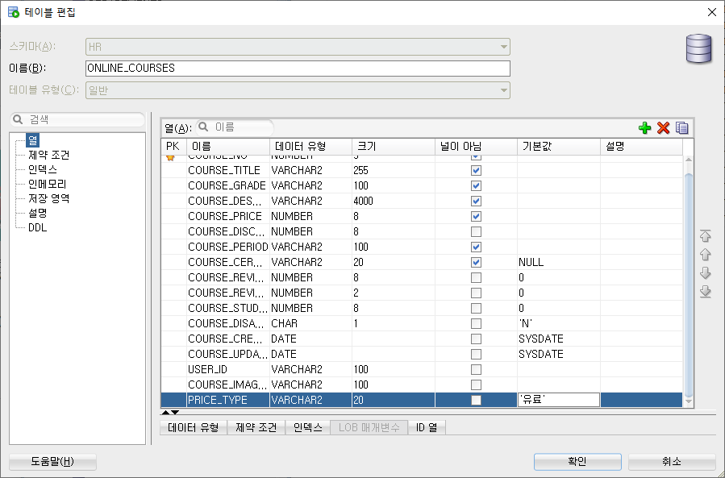

# 0722
- [0722](#0722)
- [Spring Boot](#spring-boot)
	- [강의 검색하기](#강의-검색하기)
		- [구현 과정](#구현-과정)
		- [data-*속성](#data-속성)
		- [XMLHttpRequest](#xmlhttprequest)
		- [jQuery.getJSON()](#jquerygetjson)

<small><i><a href='http://ecotrust-canada.github.io/markdown-toc/'>Table of contents generated with markdown-toc</a></i></small>

# Spring Boot
spring-online 프로젝트에서 온라인 교육 사이트 앱 실습
## 강의 검색하기
* 태그, 정렬방식, 분류 조건에 따른 강의목록 검색하기
* 비동기 자바스크립트 통신 방식을 사용한 데이터 조회하기(새로고침 없이 사용자가 설정한 조건에 따라 데이터를 보여줄 수 있다.)

### 구현 과정
1. Criteria
   * CourseCriteria.java 작성
   * 강의 페이지에서 조건에 일치하는 검색을 도와주는 객체로 카테고리아이디, 태그목록, 유료/무료여부목록, 등급목록, 정렬종류라는 멤버변수들을 가지고 있다.
```java
package kr.co.hta.criteria;

import java.util.List;

import lombok.Getter;
import lombok.Setter;
import lombok.ToString;

@Getter
@Setter
@ToString
public class CourseCriteria {

	private String categoryId;
	private List<String> tags;
	private List<String> pays;
	private List<String> grades;
	private String sort;
	
}

```
2. JSP
   * course/home.jsp
     * ajax 스크립트 작성
```jsp
<script type="text/javascript">
$(function() {
	let $extendTags = $("#box-buttons .extend-tag");
	
	$("#btn-toggle-tags").click(function() {

		let text = $(this).text();
		$(this).text(text === "펼치기" ? "접기" : "펼치기")
		
		$extendTags.toggleClass("d-none");
	});
	
	// 태그를 선택할 때
	$("#box-buttons").on("click", '.btn-secondary', function() {
		// this에는 지금 클릭한 버튼 엘리먼트가 있다.
		// $(this) 함수의 실행결과는 jQuery객체를 반환한다.
		// jQuery객체에는 this가 가지고 있는 엘리먼트가 포함되어 있다.
		// 따라서, this에 해당하는 엘리먼트 객체에 다양한 jQuery 메소드를 적용할 수 있다.
		$(this).removeClass("btn-secondary").addClass("btn-success");
		
		// 히든 필드 정의
		// $(this).attr("data-tag")은 <button data-tag="자바스크립트">자바스크립트</button>에서 data-tag속성값을 조회한다.
		// 조회된 값으로 히든필드를 정의 <input type="hidden" name="tags" value="자바스크립트">
		let hiddenField = '<input type="hidden" name="tags" value="'+$(this).attr("data-tag")+'">';
		// 히든 필드를 아이디가 box-buttons 엘리먼트 안에 추가
		$("#box-buttons").append(hiddenField);
		
		searchCourses();
	});
	// 태그선택을 해제할 때
	$("#box-buttons").on('click', '.btn-success', function() {
		$(this).removeClass("btn-success").addClass("btn-secondary");
		
		// $(this).attr("data-tag")은 <button data-tag="자바스크립트">자바스크립트</button>에서 data-tag속성값을 조회한다.
		let tag = $(this).attr("data-tag");
		// 히든필드 중에서 $("#box-buttons input[name=tags][value='자바스크립트']")로 히든필드를 선택하고 삭제한다.
		$("#box-buttons input[name=tags][value='" + tag + "']").remove();
		
		searchCourses();
	});
	// 가격유형을 체크/해제할 때
	$(":checkbox[name=pays]").change(function() {
		searchCourses();
	});
	// 등급유형을 체크/해제할 때
	$(":checkbox[name=grades]").change(function() {
		searchCourses();
	});
	// 정렬기준을 선택할 때
	$(":checkbox[name=sort]").change(function() {
		searchCourses();
	});
	function searchCourses() {
		// $(폼).serialize()는 폼의 모든 입력요소값을 쿼리스트링으로 변환한다.
		let queryString = $("#form=search-courses").serialize();
		
		/*
					// xhr 객체 생성
			1 ----- let xhr = new XMLHttpRequest();
			
					// xhr객체의 readyState값이 변경될 때 마다 이벤트가 발생하는데 그때 실행되는 함수를 등록
			2 ----- xhr.onreadystatechange = function() {
					     // xhr객체의 readyState값이 4, xhr객체가 서버로부터 받은 http 응답코드가 200일 때만
						 // xhr객체의 responseText에서 서버가 보낸 응답데이터(주로 json 형식의 텍스트 데이터)를 조회한다.
			5 -----		 if (xhr.readyState === 4 && xhr.status === 200) {
			5 ----- 			let jsonText = xhr.responseText;
			5 ----- 			// 조회된 json 형식의 텍스트를 자바스크립트객체나 배열로 변환한다.
			5 -----				let courses = JSON.parse(jsonText);
			5 -----				// HTML 컨텐츠 생성, 웹페이지에 반영
						 }
					} 
			
					// xhr 객체 초기화. 요청방식, 요청URL을 지정
			3 ----- xhr.open("GET", "/courses/search?" + queryString);
			
					// 서버로 http요청을 보냄
			4 ----- xhr.send();
		*/
		let xhr = new XMLHttpRequest();
		xhr.onreadystatechange = function() {
			if (xhr.readyState === 4 && xhr.status === 200) {
				let jsonText = xhr.responseText;
				let courses = JSON.parse(jsonText);
				console.log(courses);
			}
		} 
		xhr.open("GET", "/courses/search?" + queryString);
		xhr.send();
	}
})
</script>
```
* 크롬개발자도구 네트워크탭에서 확인하기
   * 태그 선택/비선택, 정렬방식 변경, 카테고리 변경 등의 상호작용시에 크롬 개발자 도구의 네트워크 탭에서 쿼리스트링 파라미터들이 변하는 것을 확인할 수 있다.
   * 

3. CoursesController
   * ResponseBody는 메소드 반환값을 응답메세지로 담아 보낸다.
```java
	/*
	 * @ResponseBody
	 * 		요청핸들러 메소드가 반환하는 값을 클라이언트로 보내게 하는 어노테이션이다.
	 * 		요청핸들러 메소드가 반환하는 값을 응답메세지의 바디부에 담아서 클라이언트로 보낸다.
	 * 		요청핸들러 메소드가 반환하는 값은 JSON 형식의 텍스트로 변환되어서 응답메세지의 바디부에 담긴다.
	 */
	@GetMapping("/search")
	@ResponseBody
	public List<Course> search(CourseCriteria criteria) {
		return courseService.getCoursesByCategoryId(null);
	}
```

4. vo/User.java
  * @JsonIgnore 붙이기
    * 필드객체 위에 이 어노테이션을 붙이면 Json응답을 보낼 때 필드값을 보내지 않는다.
    * 이름을 제외한 변수에 @JsonIgnore어노테이션 사용
```java
	@JsonIgnore
	private String id;
	@JsonIgnore
	private String email;
	@JsonIgnore
	private String password;
	private String name;
	@JsonIgnore
	private String phone;
	@JsonIgnore
	private String profileImage;
	@JsonIgnore
	private String disabled;
	@JsonIgnore
	private String teacher;
	@JsonIgnore
	private Date createdDate;
	@JsonIgnore
	private Date updatedDate;
```

5. CourseMapper.java
  * 
```java
	List<Course> getCoursesByCriteria(CourseCriteria criteria);
```
6. CourseMapper.xml
  * 다양한 검색조건에 맞게 where태그 작성
    * 카테고리, 태그, 유무료, 등급
```xml
	<!-- List<Course> getCoursesByCriteria(CourseCriteria criteria); -->
	<select id="getCoursesByCriteria" parameterType="kr.co.hta.criteria.CourseCriteria" resultMap="CourseResultMap">
		select *
		from online_courses
		<where>
			<if test="categoryId != null">
				course_no in (select course_no
			                  from online_course_categories
			                  where category_id = #{categoryId})
			</if>
			<if test="tags != null">
				and course_no in (select course_no
				                  from online_course_tags
				                  where course_tag in 
				                  <foreach collection="tags" item="tag" open="(" close=")" separator=",">
				                  	#{tag}
				                  </foreach>)
			</if>
			<if test="pays != null">
				and price_type in
				<foreach collection="pays" item="pay" open="(" close=")" separator=",">
					#{pay}
				</foreach>
			</if>
			<if test="grades != null">
				and course_grade in 
				<foreach collection="grades" item="grade" open="(" close=")" separator=",">
					#{grade}
				</foreach>
			</if>
		</where>
		<choose>
			<when test="sort == 'day'">
				order by course_no desc
			</when>
			<when test="sort == 'score'">
				order by course_review_score desc
			</when>
			<when test="sort == 'price'">
				order by course_price asc
			</when>
		</choose>
	</select>
```

7. 테이블 편집
  * ONLINE_COURSES에서 열 추가
  * 

8. CourseService.java
```java
	public List<Course> searchCourses(CourseCriteria criteria) {
		return courseMapper.getCoursesByCriteria(criteria);
	}
```
9. CourseController.java
```java
	/*
	 * @ResponseBody
	 * 		요청핸들러 메소드가 반환하는 값을 클라이언트로 보내게 하는 어노테이션이다.
	 * 		요청핸들러 메소드가 반환하는 값을 응답메세지의 바디부에 담아서 클라이언트로 보낸다.
	 * 		요청핸들러 메소드가 반환하는 값은 JSON 형식의 텍스트로 변환되어서 응답메세지의 바디부에 담긴다.
	 */
	@GetMapping("/search")
	@ResponseBody
	public List<Course> search(CourseCriteria criteria) {
		return courseService.searchCourses(criteria);
	}
```

10. home.jsp
    * 수정 및 추가 작성
    * 조건에 따른 강의 목록을 조회하기 위해 name속성을 이용해 CourseCriteria의 변수와 이름을 갖게 설정하였다.
    * `data-`로 시작하는 속성을 정의해 필요할때 해당 속성을 조회할수 있도록 예약하였다.
```jsp
<%@ page language="java" contentType="text/html; charset=UTF-8" pageEncoding="UTF-8"%>
<%@ include file="../common/tags.jsp" %>
<!DOCTYPE html>
<html>
<head>
<meta charset="UTF-8">
<meta name="viewport" content="width=device-width, initial-scale=1">
<link href="https://cdn.jsdelivr.net/npm/bootstrap@5.2.0-beta1/dist/css/bootstrap.min.css" rel="stylesheet">
<link rel="stylesheet" href="https://cdn.jsdelivr.net/npm/bootstrap-icons@1.9.0/font/bootstrap-icons.css">
<script src="https://cdn.jsdelivr.net/npm/bootstrap@5.2.0-beta1/dist/js/bootstrap.bundle.min.js"></script>
<script src="https://code.jquery.com/jquery-3.6.0.min.js"></script>
<title>스프링 온라인</title>
</head>
<body>
<%@ include file="../common/nav.jsp" %>
<div class="container my-3">
	<div class="row mb-3">
		<div class="col-2">
			<!-- 카테고리 리스트  -->
			<div class="list-group">
				<a href="courses" data-category="" class="list-group-item list-group-item-action py-3 ${empty param.cat ? 'active' : '' }">전체 강의</a>
				<c:forEach var="category" items="${categories }">
					<a href="courses?cat=${category.id }" data-category="${category.id }" class="list-group-item list-group-item-action py-3 ${param.cat eq category.id ? 'active' : '' }"> ${category.name }</a>
				</c:forEach>
			</div>
		</div>
		<div class="col-10">
			<div class="row justify-content-md-end border-bottom mb-2">
				<div class="col col-4">
					<form>
						<div class="input-group mb-3">
							<input type="text" class="form-control rounded-0"  name="keyword">
							<button class="btn btn-success btn-sm rounded-0" type="button" >검색</button>
						</div>
					</form>				
				</div>
			</div>
			<form id="form-search-courses">
			<c:if test="${not empty param.cat }">
				<input type="hidden" name="categoryId" value="${param.cat }" />		
			</c:if>			
			<div class="row mb-3">
				<div class="col-12">
					<nav aria-label="breadcrumb">
						<ol class="breadcrumb">
							<li class="breadcrumb-item"><a href="/courses" class="text-decoration-none">전체</a></li>
							<li class="breadcrumb-item active" aria-current="page">프로그래밍</li>
						</ol>
					</nav>
					<div id="box-buttons">
						<c:forEach var="tag" items="${tags }" varStatus="loop">
							<button type="button" class="btn btn-secondary mb-2 ${loop.count gt 15 ? 'extend-tag d-none' : '' }"  data-tag="${tag }" >${tag }</button>
						</c:forEach>
						<button type="button" class="btn btn-primary mb-2" id="btn-toggle-tags">펼치기</button>
					</div>
				</div>
			</div>
			<div class="row mb-3">
				<div class="col-10 d-flex justified-content-start">
					<div class="border p-1 me-2">
						<div class="form-check form-check-inline ">
  							<input class="form-check-input" type="checkbox" data-pay="유료" name="pays" value="유료">
 							<label class="form-check-label" >유료</label>
						</div>
						<div class="form-check form-check-inline">
							<input class="form-check-input" type="checkbox" data-pay="무료" name="pays" value="무료">
							<label class="form-check-label" >무료</label>
						</div>
					</div>
					<div class="border p-1">
						<div class="form-check form-check-inline">
							<input class="form-check-input" type="checkbox" data-grade="입문" name="grades" value="입문">
							<label class="form-check-label" >입문</label>
						</div>
						<div class="form-check form-check-inline">
							<input class="form-check-input" type="checkbox" data-grade="초급" name="grades" value="초급">
							<label class="form-check-label" >초급</label>
						</div>
						<div class="form-check form-check-inline">
							<input class="form-check-input" type="checkbox" data-grade="중급" name="grades" value="중급">
							<label class="form-check-label" >중급</label>
						</div>
					</div>
				</div>
				<div class="col-2">
					<select class="form-control" name="sort">
						<option value="day" selected> 최신순</option>
						<option value="score"> 평점순</option>
						<option value="price"> 가격순</option>
					</select>
				</div>
			</div>
			</form>
			<div class="row mb-3" id="box-courses">
			<c:choose>
				<c:when test="${empty courses }">
					<div class="col-12">
						<p class="text-center">검색결과가 존재하지 않습니다.</p>
					</div>
				</c:when>
				<c:otherwise>
					<c:forEach var="course" items="${courses }">
						<div class="col-3 mb-3">
							<div class="card">
								
								<div class="card-body">
									<h5 class="card-title fs-6"><strong>${course.title }</strong></h5>
									<p class="card-text m-0">${course.user.name }</p>
									<p class="card-text m-0">
										<i class="bi ${course.reviewScore gt 0  ? 'bi-star-fill' : 'bi-star' }"></i>
										<i class="bi ${course.reviewScore gt 1  ? 'bi-star-fill' : 'bi-star' }"></i>
										<i class="bi ${course.reviewScore gt 2  ? 'bi-star-fill' : 'bi-star' }"></i>
										<i class="bi ${course.reviewScore gt 3  ? 'bi-star-fill' : 'bi-star' }"></i>
										<i class="bi ${course.reviewScore gt 4  ? 'bi-star-fill' : 'bi-star' }"></i>
										(${course.reviewCount })
									</p>
									<p class="card-text m-0">
										<span class="text-muted text-decoration-line-through"><fmt:formatNumber value="${course.price }" />원</span>
										<strong class="text-bold text-danger float-end"><fmt:formatNumber value="${course.discountPrice }" />원</strong>
									</p>
									<div class="mt-2">
										<a class="btn btn-primary btn-sm" >담기</a>
										<button class="btn border-0 float-end"><i class="bi bi-heart"></i></button>
									</div>
								</div>
							</div>
						</div>
					</c:forEach>
				</c:otherwise>
			</c:choose>
			</div>
		</div>
	</div>
</div>
<script type="text/javascript">
$(function() {
	let $extendTags = $("#box-buttons .extend-tag");
	
	$("#btn-toggle-tags").click(function() {
		// this는 클릭한 버튼 엘리먼트다.
		let text = $(this).text();
		$(this).text(text === "펼치기" ? "접기" : "펼치기")
		
		$extendTags.toggleClass("d-none");
	});
	
// 강의 검색하기
	
	// 태그를 선택할 때
	$("#box-buttons").on("click", '.btn-secondary', function() {
		// this에는 지금 클릭한 button 엘리먼트가 있다.
		// $(this)함수의 실행결과는 jQuery객체를 반환한다.
		// jQuery객체에는 this가 가지고 있는 엘리먼트가 포함되어 있다.
		// 따라서, this에 해당하는 엘리먼트 객체에 다양한 jQuery 메소드를 적용할 수 있다.
		$(this).removeClass("btn-secondary").addClass("btn-success");
		
		// 히든 필드 정의
		// $(this).attr("data-tag")은 <button data-tag="자바스크립트">자바스크립트</button>에서 data-tag 속성값을 조회한다.
		// 조회된 값으로 히든필드를 정의 <input type="hidden" name="tags" value="자바스크립트'">
		let hiddenField = '<input type="hidden" name="tags" value="'+$(this).attr("data-tag")+'">';
		// 히든 필드를 아이디가 box-buttons 엘리먼트 안에 추가
		$("#box-buttons").append(hiddenField);
		
		searchCourses();
	});
	// 태그 선택을 해제할 때
	$("#box-buttons").on('click', '.btn-success', function() {
		$(this).removeClass("btn-success").addClass("btn-secondary");
		
		// $(this).attr("data-tag")은 <button data-tag="자바스크립트">자바스크립트</button>에서 data-tag 속성값을 조회한다.
		let tag = $(this).attr("data-tag");
		// 히든필드 중에서 $("#box-buttons input[name=tags][value='자바스크립트']")로 히든필드를 선택하고 삭제한다.
		$("#box-buttons input[name=tags][value='" + tag + "']").remove();		
		
		searchCourses();
	});
	// 가격 유형을 체크/해제할 때
	$(":checkbox[name=pays]").change(function() {
		searchCourses();
	});
	// 등급 유형을 체크/해제할 때
	$(":checkbox[name=grades]").change(function() {
		searchCourses();
	});
	// 정렬기준을 선택할 때
	$("select[name=sort]").change(function() {
		searchCourses();
	});
	
	function searchCourses() {
		let queryString = $("#form-search-courses").serialize();
		let $box = $("#box-courses").empty();
		
		$.getJSON("/courses/search", queryString, function(courses) {
			if (courses.length == 0) {
				let content = `
					<div class="col-12">
						<p class="text-center">검색결과가 존재하지 않습니다.</p>
					</div>
				`;
				$box.append(content);
			} else {
	            $.each(courses, function(index, course) {
	                let content = '';
	                content += '<div class="col-3 mb-3">';
	                content += '   <div class="card">';
	                content += '      ';
	                content += '      <div class="card-body">';
	                content += '         <h5 class="card-title fs-6"><strong>'+ course.title +'</strong></h5>';
	                content += '         <p class="card-text m-0">'+ course.user.name +'</p>';
	                content += '         <p class="card-text m-0">';
	                content += '            <i class="bi '+ (course.reviewScore > 0 ? 'bi-star-fill' : 'bi-star') +'"></i>';
	                content += '            <i class="bi '+ (course.reviewScore > 1 ? 'bi-star-fill' : 'bi-star') +'"></i>';
	                content += '            <i class="bi '+ (course.reviewScore > 2 ? 'bi-star-fill' : 'bi-star') +'"></i>';
	                content += '            <i class="bi '+ (course.reviewScore > 3 ? 'bi-star-fill' : 'bi-star') +'"></i>';
	                content += '            <i class="bi '+ (course.reviewScore > 4 ? 'bi-star-fill' : 'bi-star') +'"></i>';
	                content += '            ('+ course.reviewCount +')';
	                content += '         </p>';
	                content += '         <p class="card-text m-0">';
	                content += '            <span class="text-muted text-decoration-line-through">'+ course.price.toLocaleString() +'원</span>';
	                content += '            <strong class="text-bold text-danger float-end">'+ course.discountPrice.toLocaleString() +'원</strong>';
	                content += '         </p>';
	                content += '         <div class="mt-2">';
	                content += '            <a class="btn btn-primary btn-sm" >담기</a>';
	                content += '            <button class="btn border-0 float-end"><i class="bi bi-heart"></i></button>';
	                content += '         </div>';
	                content += '      </div>';
	                content += '   </div>';
	                content += '</div>';
	                
	                $box.append(content);
	             })            
	          }
	       })
	    }
	
	
	/* function searchCourses() {
		// $(폼).serialize()는 폼의 모든 입력요소값을 쿼리스트링으로 변환한다.
		let queryString = $("#form-search-courses").serialize();
		
		
			// xhr 객체 생성
		//	1 ----- let xhr = new XMLHttpRequest();
		//
		//	// xhr객체의 readyState값이 변경될 때 마다 이벤트가 발생하는데 그때 실행되는 함수를 등록
		//	2 ------ xhr.onreadystatechange = function() {
		//		// xhr객체의 readyState값이 4, xhr객체가 서버로부터 받은 http 응답코드가 200일 때만
		//		// xhr객체의 responseText에서 서버가 보낸 응답데이터(주로 json 형식의 텍스트 데이터)를 조회한다.
		//	5 ----------	if (xhr.readyState === 4 && xhr.status === 200) {
		//	5 ----------		let jsonText = xhr.responseText;
		//	5 ----------		// 조회된 json 형식의 텍스트를 자바스크립트 객체나 배열로 변환한다.
		//	5 ----------		let courses = JSON.parse(jsonText);
		//	5 ----------		// HTML 컨텐츠 생성, 웹페이지에 반영
		//		}
		//	}
		//	
		//	// xhr 객체 초기화. 요청방식, 요청URL을 지정
		//	3 ----- xhr.open("GET", "/courses/search?" + queryString);
		//	
		//	// 서버로 http 요청을 보냄
		//	4 ----- xhr.send();
		
		
		let $box = $("#box-courses").empty();
		
		let xhr = new XMLHttpRequest();
		xhr.onreadystatechange = function() {
			if (xhr.readyState === 4 && xhr.status === 200) {
				let jsonText = xhr.responseText;
				let courses = JSON.parse(jsonText);
				
				if (courses.length == 0) {
					let content = `
						<div class="col-12">
							<p class="text-center">검색결과가 존재하지 않습니다.</p>
						</div>
					`;
					
					$box.append(content);
				} else {
					$.each(courses, function(index, course) {
						let content = `
							<div class="col-3 mb-3">
								<div class="card">
									
									<div class="card-body">
										<h5 class="card-title fs-6"><strong id="course-title"></strong></h5>
										<p class="card-text m-0" id="course-user"></p>
										<p class="card-text m-0">
											<i class="" id="course-start-1"></i>
											<i class="" id="course-start-2"></i>
											<i class="" id="course-start-3"></i>
											<i class="" id="course-start-4"></i>
											<i class="" id="course-start-5"></i>
											(<span id="course-review-count"></span>)
										</p>
										<p class="card-text m-0">
											<span class="text-muted text-decoration-line-through" id="course-pricee"> 원</span>
											<strong class="text-bold text-danger float-end" id="course-discount-price"> 원</strong>
										</p>
										<div class="mt-2">
											<a class="btn btn-primary btn-sm" >담기</a>
											<button class="btn border-0 float-end"><i class="bi bi-heart"></i></button>
										</div>
									</div>
								</div>
							</div>
						`;
						
						
						//	courses -> [{no:6, title:"리액트 연습", user:{name:"홍길동"}, reviewCount:10, price:50000, ... },
						//				{no:9, title:"스프링" Data JPA", user:{name:"홍길동"}, reviewCount:54, price:80000, ...},
						//				{no:11, title:"자바 제대로 배우기", user:{name:"홍길동"}, reviewCount:32, price:45000, ...},]
						//	
						//	course -> {no:6, title:"리액트 연습", user:{name:"홍길동"}, reviewCount:10, price:50000, ... }
						
						$.each(courses, function(index, course) {
							//html 컨텐츠로 생성된 엘리먼트를 포함하는 jQuery 객체 생성
							let $el = $(content);
							// 생성된 jQuery객체에 포함된 엘리먼트를 찾아서 값을 설정하기
							$el.find("img").attr("src", "resources/images/course/" + course.imagename);
							$el.find("#course-title").text(course.title);
							$el.find("#course-user").text(course.user.name);
							for (let i=1; i<=5; i++) {
								$el.find("#course-star-"+i).addClass(course.reviewScore > (i-1) ? "bi bi-star-fill" : 'bi bi-star');
							}
							$el.find("#course-review-count").text(course.reviewCount);
							$el.find("#course-price").text(course.price.toLocaleString() + " 원");
							$el.find("#course-discount-price").text(course.discountPrice.toLocaleString() + " 원");
							// 생성된 jQuery객체를 $box jQUery객체에 포함된 엘리먼트의 자식 엘리먼트로 추가하기
							$box.append($el);
						})
					})
				}
			}
		}
		xhr.open("GET", "/courses/search?" + queryString);
		xhr.send();
	} */
	
})
</script>
</body>
</html>
```

### data-*속성
* 비표준 속성의 충돌을 방지하기 위한 속성으로 dataset프로퍼티를 사용해 data 속성에 접근할 수 있다.
* 해당 프로젝트에서 data- 속성은 히든필드 정의 중 원하는 속성값을 조회하기 위해 사용하였다. 
* script에서 `$(this).attr("data-tag")`와 같이 사용해 원하는 엘리먼트에서 this에 해당하는 엘리먼트의 data-tag 속성값을 가져오기 위해 사용하였다

### XMLHttpRequest
* XHR 객체는 서버와 상호작용하기 위해 사용한다.
* XHR를 사용하면 페이지의 새로고침 없이 URL에서 데이터를 가져올 수 있다.
* XHR은 AJAX프로그래밍에 많이 사용된다.
* 프로젝트에서 XHR을 활용한 실습코드
```javascript
// $(폼).serialize()는 폼의 모든 입력요소값을 쿼리스트링으로 변환한다.
let queryString = $("#form-search-courses").serialize();

// xhr 객체 생성
let xhr = new XMLHttpRequest();

// xhr객체의 readyState값이 변경될 때 마다 이벤트가 발생하는데 그때 실행되는 함수를 등록
xhr.onreadystatechange = function() {
	// xhr객체의 readyState값이 4, xhr객체가 서버로부터 받은 http 응답코드가 200일 때만
	// xhr객체의 responseText에서 서버가 보낸 응답데이터(주로 json 형식의 텍스트 데이터)를 조회한다.
	if (xhr.readyState === 4 && xhr.status === 200) {
		let jsonText = xhr.responseText;
		// 조회된 json 형식의 텍스트를 자바스크립트 객체나 배열로 변환한다.
		let courses = JSON.parse(jsonText);
		// HTML 컨텐츠 생성, 웹페이지에 반영
		if (courses.length == 0) { // 조회된 데이터가 없을 경우
			// html content 생성
		} else { // 조회된 데이터가 있을 경우
			// html content 생성
		}
	}
}

// xhr 객체 초기화. 요청방식, 요청URL을 지정
xhr.open("GET", "/courses/search?" + queryString);

// 서버로 http 요청을 보냄
xhr.send();
```
* 작동 순서
  1. XHR객체 생성
  2. 이벤트 발생시 실행되는 함수 `onreadystatechange`
  3. XHR객체 초기화
  4. 서버에 HTTP 요청
  5. `onreadystatechange` 함수의 내용 실행됨.
     * 특정 조건일 때 서버가 보낸 응답데이터를 조회
     * json 텍스트 데이터를 JSON.parse()로 자바스크립트 객체나 배열로 변환
     * HTML 컨텐츠를 생성해 웹페이지에 반영

### jQuery.getJSON()
> https://api.jquery.com/jquery.getjson/#jQuery-getJSON-url-data-success
* 위의 xhr과 동일한 기능 수행
* Ajax 함수의 속기버전
	```js
	$.ajax({
	dataType: "json",
	url: url,
	data: data,
	success: success
	});
	```
* `$.getJSON(url, 데이터, 함수(){})`
  * url : 요청이 전송되는 URL이 포함된 문자열
  * 데이터 : 요청과 함께 서버로 전송되는 일반 객체 또는 문자열
  * 함수 : 요청이 성공시 실행되는 콜백 함수
* 예시 : Flicker JSONP API에서 레이니어 산의 가장 최근 사진 4장을 로드한다.
```jsp
<!doctype html>
<html lang="en">
<head>
  <meta charset="utf-8">
  <title>jQuery.getJSON demo</title>
  <style>
  img {
    height: 100px;
    float: left;
  }
  </style>
  <script src="https://code.jquery.com/jquery-3.5.0.js"></script>
</head>
<body>
 
<div id="images"></div>
 
<script>
(function() {
  var flickerAPI = "https://api.flickr.com/services/feeds/photos_public.gne?jsoncallback=?";
  $.getJSON( flickerAPI, {
    tags: "mount rainier",
    tagmode: "any",
    format: "json"
  })
    .done(function( data ) {
      $.each( data.items, function( i, item ) {
        $( "" ).attr( "src", item.media.m ).appendTo( "#images" );
        if ( i === 3 ) {
          return false;
        }
      });
    });
})();
</script>
 
</body>
</html>
```