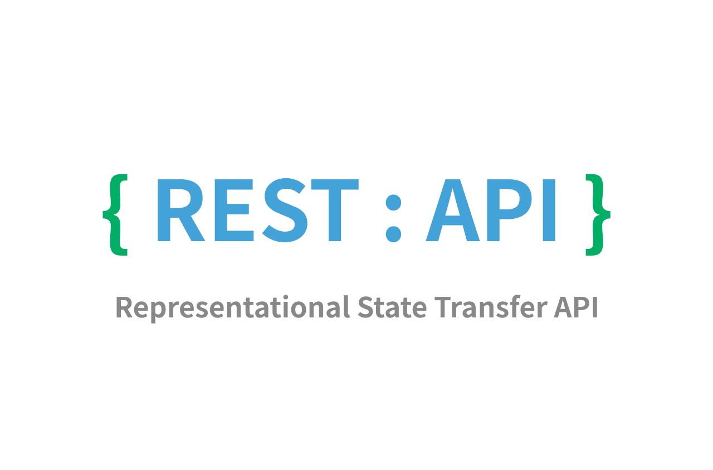
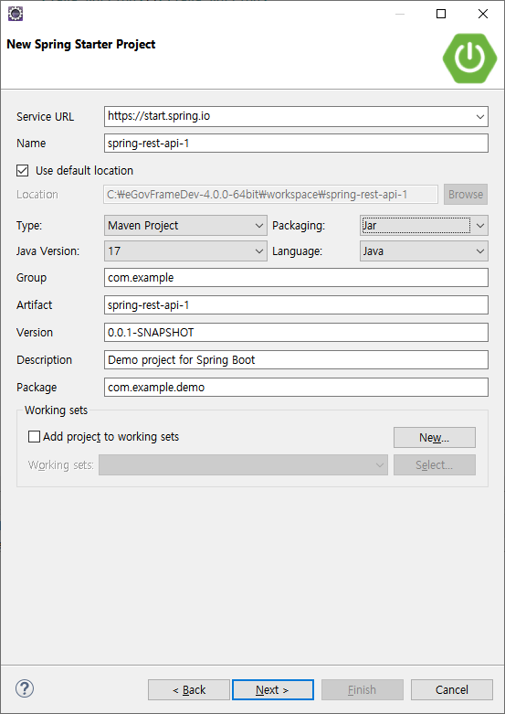
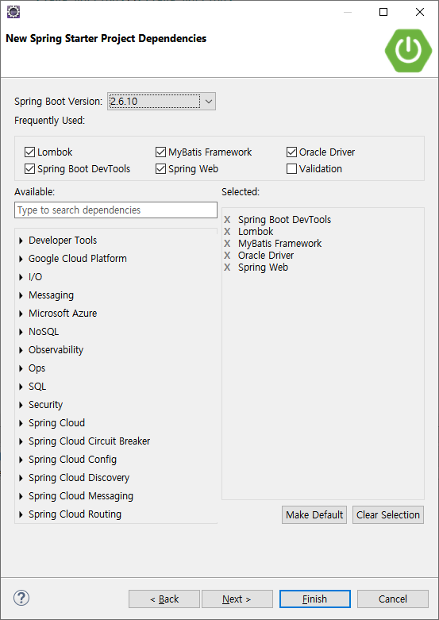
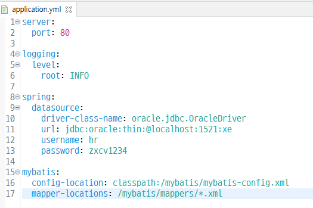
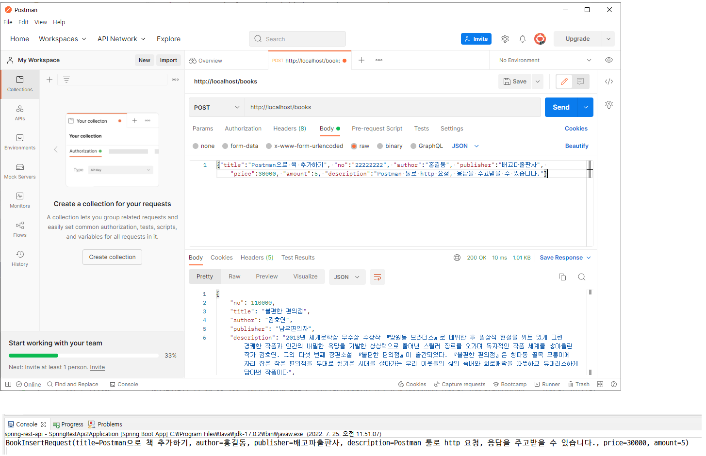

# 0725
- [0725](#0725)
- [Spring REST API](#spring-rest-api)
	- [REST](#rest)
	- [REST API](#rest-api)
	- [Postman 개발툴](#postman-개발툴)
- [Spring REST API 실습](#spring-rest-api-실습)
	- [REST API로 구현할 기능의 요청메세지 예시](#rest-api로-구현할-기능의-요청메세지-예시)
		- [ResponseEntity](#responseentity)
	- [책 관련 CRUD 기능 구현](#책-관련-crud-기능-구현)
	- [응답메세지 패턴 지정하기](#응답메세지-패턴-지정하기)
	- [사용자 지정 응답메세지로 예외처리하기](#사용자-지정-응답메세지로-예외처리하기)

<small><i><a href='http://ecotrust-canada.github.io/markdown-toc/'>Table of contents generated with markdown-toc</a></i></small>

# Spring REST API
## REST

Representational State Transfer  
하나의 URI는 하나의 자원을 대표한다.  
http의 주요 저자인 로이필딩이 2000년도에 발표  
(HTTP는 서버와 클라이언트 간의 데이터(주로 HTML)를 주고받는 규칙을 의미)  
* REST의 정의
  * Representational State Transfer의 약자
  * 서버의 자원을 이름(자원의 표현, URI)으로 구분해서 해당 자원의 상태(정보, JSON or XML)를 주고  받는 것	
  * REST는 HTTP 프로토콜을 이용해서 클라이언트와 서버가 서로 데이터를 주고 받는다.
  * REST는 URI(Uniform Resource Identifier)를 사용해서 자원을 구분(명시)한다.
  * REST는 HTTP Method(GET, POST, PUT, DELETE)를 사용해서 자원에 대한 Operation을 명시한다.(행위에 대한 정의)
  	- GET		: 조회(Read)
  	- POST		: 생성(Create)
  	- PUT		: 수정(Update)
  	- DELETE	: 삭제(Delete)
* REST의 장점
  * HTTP 프로토콜을 사용하기 때문에 별도의 인프라를 구축할 필요가 없다.
  * HTTP 프로토콜의 모든 플랫폼에서 사용 가능하다.
  * REST API 메세지는 의도하는 바를 명확하게 나타내며, 그 의도를 쉽게 파악할 수 있다.
* REST의 사용 목적
  * 애플리케이션의 통합 혹은 분리
  * 다양한 클라이언트에서 사용가능(다양한 환경의 브라우저와 다양한 모바일 디바이스와 데이터교환이 가능하다.)
  * 서로 다른 플랫폼의 자원에 대한 서비스
* REST의 구성
  * URI
    * 자원에 대한 식별자
    * 모든 자원은 고유한 URI를 가진다
  * HTTP Method
    * 자원에 대한 행위를 정의한다
  * Represensation
    * 클라이언트가 자원의 상태(데이터)에 대한 조작을 요청하면 서버가 보내는 응답이다.
    * REST에서는 하나의 자원을 JSON, XML 등의 형태로 표현(Represensation)한다.
    * 클라이언트와 서버가 JSON, XML을 서로 주고 받는다. 

## REST API

* ***REST API 설계에서 가장 중요한 2가지***
  1. ***URI는 정보의 자원을 표현한다.***
  2. ***자원에 대한 행위는 HTTP method로 표현한다.***
  > https://meetup.toast.com/posts/92
* REST API의 정의
  * REST를 기반으로 서비스API 애플리케이션을 구현하는 것
  * 대부분의 Open API(누구나 사요할 수 있도록 공개된 API: 구글 맵, 다음지도, 네이버 지도, 공공데이터 포탈 등), 마이크로서비스 애플리케이션들이 REST API를 구현(제공)한 것이다.
  * Spring MVC를 활용하면 REST API를 쉽게 구현할 수 있다.
* REST API 설계

	CRUD				  |HTTP Method		 |URI			   |요청메세지		|응답메세지
	--------------------|------------------|-----------------|-----------------|----------
	자원의 목록 조회 	   |GET			      |/resource		|				|JSON, XML
	자원 하나의 정보 조회|GET				  |/resource/${id}	 |				|JSON, XML
	자원을 생성 	      |POST				 |/resource			|JSON, XML		|
	자원을 수정 	      |PUT				 |/resource/${id}	|JSON, XML		|
	자원을 삭제 	      |DELETE			 |/resource/${id}	|				|

* 스프링 MVC로 REST API 구현
	```java
	@RestController
	public class BookController {

		@GetMapping("/books")
		public ResponseEntity<List<Book>> list() { ... }

		@GetMapping("/books/${no}")
		public ResponseEntity<Book> info(@PathVariable("no") int no) { ... }

		@PostMapping("/books")
		public ResponseEntity<Void> save(@RequestBody Book book) { ... }

		@PutMapping("/books/${no}")
		public ResponseEntity<Void> update(@PathVariable("no") int no, @RequestBody Book book) { ... }

		@DeleteMapping("/books/${no}")
		public ResponseEntity<Void> delete(@PathVariable("no") int no) { ... }
	}
	```
	* `ResponseEntity<T>`
    	* HTTP 응답을 표현하는 객체다.
    	* HTTP 응답코드와 HTTP 응답 메세지를 포함하는 객체다.
    	* Spring REST API 구현할 때 요청핸들러 메소드의 반환타입으로 사용한다.

## Postman 개발툴
>https://www.postman.com/
* http요청을 보내고 응답을 보여주는 서비스/개발도구
* 간단하게 GET, POST 방식의 요청에 대해 Params, Authorization, Headers, Body, Pre-request Script 와 같은 내용을 지정한 형식으로 확인할 수 있다.
* 웹 브라우저 대신 사용 가능하다.
* 메소드를 구현 전에도 간편하게 통신 데이터를 확인할 수 있다.

# Spring REST API 실습
* 프로젝트 생성
  * new Spring Starter Project
  * 
  * 
* 프로젝트 기본 틀 구축하기
  * application.properties > application.yml (야믈파일)
  * 
* package 구축
  * (mapper, service, vo, web.controller)

## REST API로 구현할 기능의 요청메세지 예시
```
GET		/books
	모든 책목록 정보를 조회, 모든 책목록정보를 JSON 형식의 컨텐츠로 제공
GET 	/books/10
	10번 책에 대한 상세정보 조회, 조회된 책정보를 JSON 형식의 컨텐츠로 제공
POST	/books
	새로운 책정보를 생성
	요청메세지
		REST 방식
		-------------------------------------------------------------------------------
		| GET /books HTTP/1.1
		| Accept: ....
		| Accept-Language: ....
		| Content-Type: ....
		| 
		| {"title":"이것이 자바다", "author":"신용권", "publisher":"한빛미디어", "description":"이 책은 ....", ...}
		|
		--------------------------------------------------------------------------------
		public ResponseEntity<Void> saveBook(@RequestBody BookInsertRequest bookInsertRequest) {...}

		옛 버전
		-------------------------------------------------------------------------------
		| GET /books HTTP/1.1
		| Accept: ....
		| Accept-Language: ....
		| Content-Type: ....
		| 
		| title=이것이 자바다&author=신용권&publisher=한빛미디어&description=이 책은 ....
		|
		--------------------------------------------------------------------------------
		public String saveBook(BookRegisterForm bookRegisterForm) {...}

```

### ResponseEntity
BookRestController 참고
* ***사용자의 HttpRequest에 대한 응답 데이터를 포함하는 클래스***
* ***상태코드(Status), 헤더(headers), 바디(T body) 응답데이터(ResponseData)등을 담을 수 있다***.
* Spring Framework에서 제공하는 클래스 중 HttpEntity는 HTTP 요청(Request) 또는 응답(Response)에 해당하는 HttpHeader와 HttpBody를 포함하는 클래스로 이 HttpEntity 클래스를 상속받아 구현한 클래스가 RequestEntity, ResponseEntity 클래스. 
* ResponseEntity는 사용자의 HttpRequest에 대한 응답 데이터를 포함하는 클래스. 따라서 HttpStatus, HttpHeaders, HttpBody를 포함한다.
* `books, HttpStatus.OK`는 bookService.getAllBooks()로 부터 가져온 책 목록을 *body*로 'books' 사용하여 제대로 응답을 했을 경우 200상태코드를 반환한다는 의미이다.

## 책 관련 CRUD 기능 구현
* 기본 틀 구축하기
  * vo 작성(Book), mapper interface, service, RestController, mybatis-config, mapper.xml 기본 작업(파일생성, 설정파일 작성)
* BookMapper 인터페이스 메소드 정의
```java
@Mapper
public interface BookMapper {

	List<Book> getBooks();
	Book getBookByNo(int no);
	void insertBook(Book book);
	void updateBook(Book book);
}
```
* BookMapper.xml resultMap, select, insert, update 태그 작성 - 책 목록 조회, 책 조회, 책 추가, 책 수정(삭제)
```xml
<mapper namespace="com.example.demo.mapper.BookMapper" >

	<resultMap type="com.example.demo.vo.Book" id="SimpleBookResultMap">
		<id column="book_no" property="no"/>
		<result column="book_title" property="title"/>
		<result column="book_author" property="author"/>
		<result column="book_publisher" property="publisher"/>
		<result column="book_price" property="price"/>
		<result column="book_discount_price" property="discountPrice"/>
	</resultMap>
	
	<resultMap type="com.example.demo.vo.Book" id="BookResultMap" extends="SimpleBookResultMap">
		<result column="book_description" property="description"/>
		<result column="book_on_sell" property="onSell"/>
		<result column="book_stock" property="stock"/>
		<result column="book_created_date" property="createdDate"/>
		<result column="book_updated_date" property="updatedDate"/>
	</resultMap>
	
	<!-- List<Book> getBooks(); -->
	<select id="getBooks" resultMap="SimpleBookResultMap">
		select *
		from store_books
		order by book_no desc
	</select>
	
	<!-- Book getBookByNo(int no); -->
	<select id="getBookByNo" parameterType="int" resultMap="BookResultMap">
		select *
		from store_books
		where book_no = #{value}
	</select>
	
	<!-- void insertBook(Book book); -->
	<insert id="insertBook" parameterType="com.example.demo.vo.Book">
		<selectKey keyProperty="no" resultType="int" order="BEFORE">
			select store_books_seq.nextval
			from dual
		</selectKey>
		insert into store_books
		(book_no, book_title, book_author, book_publisher, book_description, book_price, book_discount_price, book_stock, book_created_date, book_updated_date)
		values
		(#{no}, #{title}, #{author}, #{publisher}, #{description}, #{price}, #{discountPrice}, #{stock}, sysdate, sysdate)
	</insert>
	
	<!-- void updateBook(Book book); -->
	<update id="updateBook" parameterType="com.example.demo.vo.Book">
		update store_books
		set
			book_title = #{title},
			book_author = #{author},
			book_publisher = #{publisher},
			book_description = #{description},
			book_price = #{price},
			book_discount_price = #{discountPrice},
			book_on_sell = #{onSell},
			book_stock = #{stock},
			book_updated_date = sysdate
		where book_no = #{no}
	</update>
</mapper>
```
* BookService 메소드 정의
  * 책 조회시 책 정보가 없을 경우 예외처리
  * 삭제처리의 경우 onSell을 'N'으로 수정.
```java
@Service
public class BookService {

	@Autowired
	BookMapper bookMapper;
	
	public List<Book> getAllBooks() {
		return bookMapper.getBooks();
	}
	
	public Book getBookDetail(int bookNo) {
		Book book = bookMapper.getBookByNo(bookNo);
		if (book == null) {
			throw new RuntimeException("["+bookNo+"]번 책 정보가 존재하지 않습니다.");
		}
		return book;
	}
	
	public void saveBook(Book book) {
		bookMapper.insertBook(book);
	}
	
	public void updateBook(Book book) {
		Book savedBook = this.getBookDetail(book.getNo());
		savedBook.updateBook(book);
		
		bookMapper.updateBook(savedBook);
	}
	
	public void deleteBook(int bookNo) {
		Book savedBook = this.getBookDetail(bookNo);
		savedBook.setOnSell("N");
		
		bookMapper.updateBook(savedBook);
	}
	
}

```
* RestController 작성하기
  * BookRestController.java
    * 
```java
package com.example.demo.web.controller;

import java.util.List;

import org.springframework.beans.factory.annotation.Autowired;
import org.springframework.web.bind.annotation.DeleteMapping;
import org.springframework.web.bind.annotation.GetMapping;
import org.springframework.web.bind.annotation.PathVariable;
import org.springframework.web.bind.annotation.PostMapping;
import org.springframework.web.bind.annotation.PutMapping;
import org.springframework.web.bind.annotation.RequestBody;
import org.springframework.web.bind.annotation.RestController;

import com.example.demo.service.BookService;
import com.example.demo.vo.Book;
import com.example.demo.web.request.BookRequest;
import com.example.demo.web.response.ListResponseData;
import com.example.demo.web.response.ResponseData;
import com.example.demo.web.response.SingleResponseData;

@RestController
public class BookRestController {

	@Autowired
	BookService bookService;
	
	@GetMapping(path = "/books")
	public ListResponseData<Book> books() {
		List<Book> books = bookService.getAllBooks();
		return ListResponseData.create(books);
	}
	
	@GetMapping(path = "/books/{no}")
	public SingleResponseData<Book> book(@PathVariable("no") int bookNo) {
		Book book = bookService.getBookDetail(bookNo);
		return SingleResponseData.create(book);
	}
	
	@PostMapping(path = "/books")
	public ResponseData saveBook(@RequestBody BookRequest bookRequest) {
		Book book = Book.createBook(bookRequest);
		bookService.saveBook(book);
		
		return ResponseData.create(true, "책이 등록되었습니다.");
	}
	
	@PutMapping(path = "/books/{no}")
	public ResponseData updateBook(@PathVariable("no") int bookNo, @RequestBody BookRequest bookRequest) {
		Book book = Book.createBook(bookRequest);
		book.setNo(bookNo);
		
		bookService.updateBook(book);
		
		return ResponseData.create(true, "책 정보가 수정되었습니다.");
	}
	
	@DeleteMapping(path = "/books/{no}")
	public ResponseData deleteBook(@PathVariable("no") int bookNo) {
		bookService.deleteBook(bookNo);
		
		return ResponseData.create(true, "책 정보가 삭제되었습니다.");
	}
	
	/*
	 * @GetMapping(path = "/books") public ResponseEntity<List<Book>> books() {
	 * List<Book> books = bookService.getAllBooks();
	 * 
	 * // return ResponseEntity.ok(books); return new
	 * ResponseEntity<List<Book>>(books, HttpStatus.OK); }
	 * 
	 * @GetMapping(path = "/books/{no}") public ResponseEntity<Book>
	 * book(@PathVariable("no") int bookNo) { Book book =
	 * bookService.getBookDetail(bookNo);
	 * 
	 * return new ResponseEntity<Book>(book, HttpStatus.OK); }
	 * 
	 * @PostMapping("/books") public ResponseEntity<Void> saveBook(@RequestBody
	 * BookRequest bookRequest) { Book book = Book.createBook(bookRequest);
	 * bookService.saveBook(book);
	 * 
	 * return new ResponseEntity<Void>(HttpStatus.CREATED); }
	 */
}
```

* com.example.demo.web.request.BookRequest.java
    * 값을 전달받아서 담기 위한 객체 생성
* postman툴에서 Post Mapping 중간 실행실습(책추가하기)
  * 

## 응답메세지 패턴 지정하기
응답메세지 형태 정형화
* com.example.demo.web.response
* ResponseData.java
```java
@Getter
@Setter
public class ResponseData {
	private boolean success;
	private String message;
	
	public ResponseData() {}

	public static ResponseData create(boolean success ,String message) {
		ResponseData responseData = new ResponseData();
		responseData.setSuccess(success);
		responseData.setMessage(message);

		return responseData;
	}
}

```
* SingleResponseDate.java
```java
@Getter
@Setter
public class SingleResponseData<T> extends ResponseData {

	private T item;
	
	public static <T> SingleResponseData<T> create(T item) {
		SingleResponseData<T> responseData = new SingleResponseData<T>();
		responseData.setSuccess(true);
		responseData.setItem(item);

		return responseData;
	}
}
```
* responseDate객체의 Success변수에 성공 여부를 저장하고 Item변수에 데이터(item)을 저장해 반환한다.

## 사용자 지정 응답메세지로 예외처리하기
* com.example.demo.web.advice
* ExceptionHandlerAdvice.java
  * @RestControllerAdvice 어노테이션으로 예외처리를 할 수 있다.
  * 실제로는 사용자 정의 Exception을 사용한다.(ex: RuntimeException > BookRuntimeException)
  * handleRuntimeException의 경우 응답메세지를 지정하는 과정을 거쳐 사용자 정의 데이터 형식인 ResponseData를 반환한다.
```java
@RestControllerAdvice
public class ExceptionHandlerAdvice {

	@ExceptionHandler(DataAccessException.class)
	public ResponseData handleDataAccessException(DataAccessException e) {
		e.printStackTrace();
		
		return ResponseData.create(false, "데이터베이스 엑세스 오류가 발생하였습니다.");
	}
	
	@ExceptionHandler(RuntimeException.class)
	public ResponseData handleRuntimeException(RuntimeException e) { // ResponseData.create()를 반환
		e.printStackTrace();
		
		return ResponseData.create(false, e.getMessage());
	}
	
	@ExceptionHandler(Exception.class)
	public ResponseData handleException(Exception e) {
		e.printStackTrace();
		
		return ResponseData.create(false, "서버 내부에 오류가 발생하였습니다.");
	}
}
```