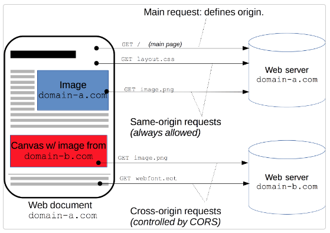
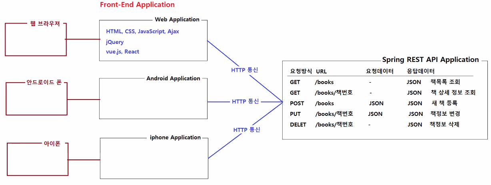
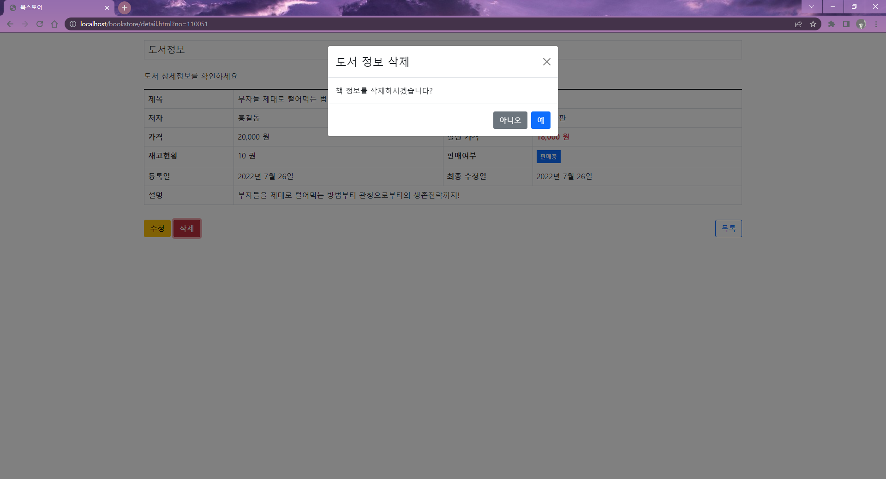
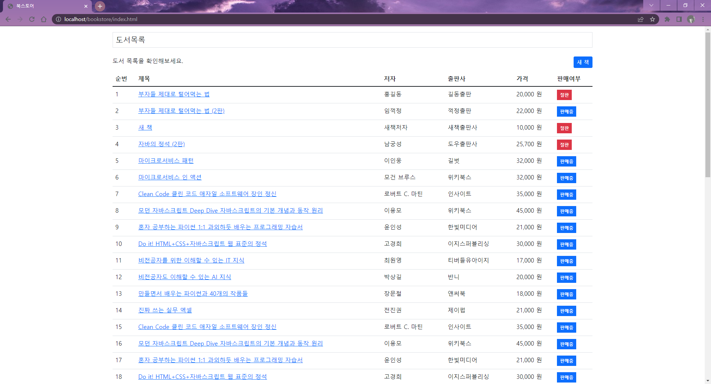
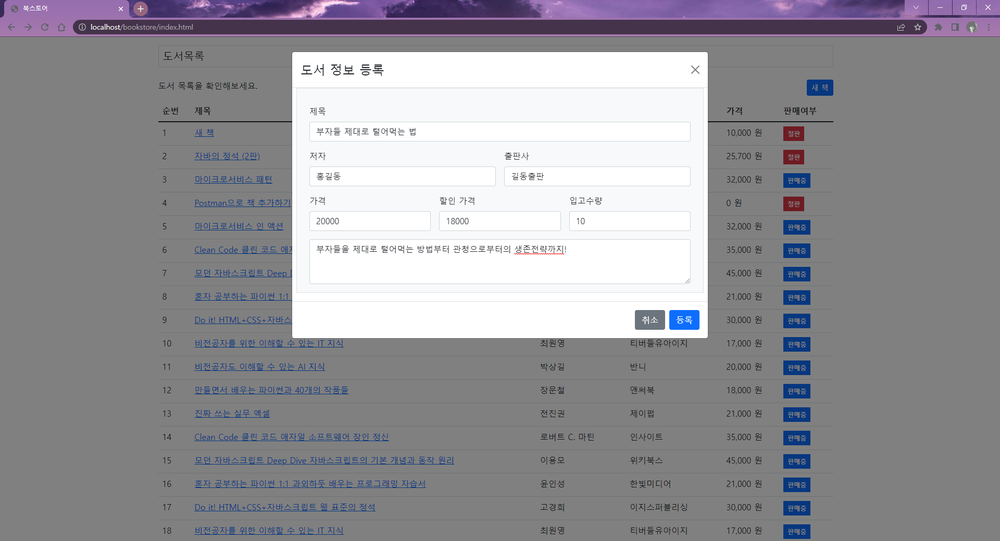
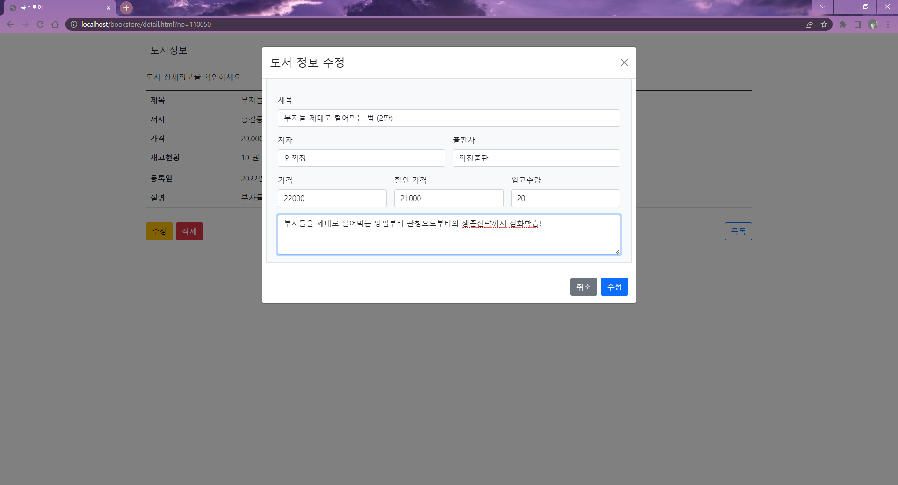
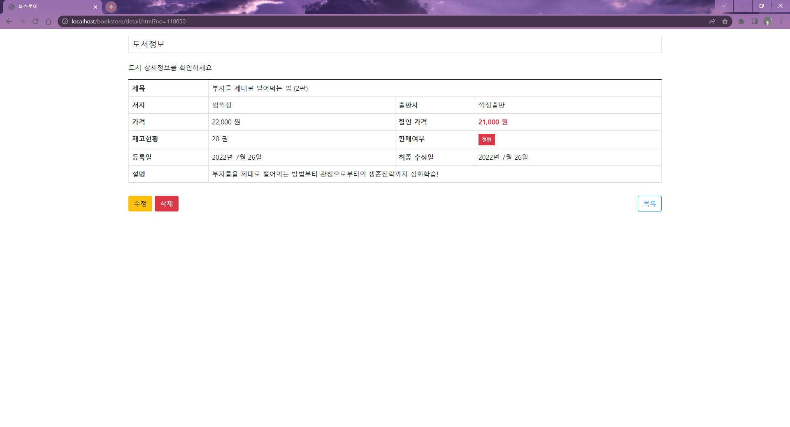

# 0726
- [0726](#0726)
- [CORS](#cors)
	- [CORS를 이용한 HTTP 통신](#cors를-이용한-http-통신)
- [실습](#실습)
	- [도서목록조회하기](#도서목록조회하기)
	- [도서 상세정보 조회하기](#도서-상세정보-조회하기)
	- [책 삭제하기](#책-삭제하기)
	- [새 책 등록하기](#새-책-등록하기)
	- [책 수정하기](#책-수정하기)
	- [도서정보 새로고침하기](#도서정보-새로고침하기)

<small><i><a href='http://ecotrust-canada.github.io/markdown-toc/'>Table of contents generated with markdown-toc</a></i></small>

# CORS

> https://developer.mozilla.org/ko/docs/Web/HTTP/CORS
* 교차 출처 리소스 공유 
  * 추가 HTTP 헤더를 사용하여, 한 출처에서 실행 중인 웹 애플리케이션이 다른 출처의 선택한 자원에 접근할 수 있는 권한을 부여하도록 브라우저에 알려주는 체제
* CORS 오류
  * main 요청과 다른 도메인(서버)에서 HTTP 요청을 하면 브라우저가 제한한다.

## CORS를 이용한 HTTP 통신

* Spring REST API application에서 조회/추가/수정/삭제의 기능을 거쳐 생성된 JSON 데이터를 Front-End Application에서 사용할 수 있다.
* 2개의 서버(포트,앱)가 HTTP 통신한다.

# 실습 
spring-rest-api에서 만들어진 JSON 데이터를 받아 사용하는 서점앱

* Dynamic web app 프로젝트 생성 : bookstore
* build path/facet java 버전 : 17/11
* port: 80
  * spring-rest-api 의 포트를 3000으로 변경
* Mapper
* bootstrap, jquery 라이브러리를 head에 추가
	```html
	<link href="https://cdn.jsdelivr.net/npm/bootstrap@5.1.3/dist/css/bootstrap.min.css" rel="stylesheet">
	<script src="https://cdn.jsdelivr.net/npm/bootstrap@5.1.3/dist/js/bootstrap.bundle.min.js"></script>
	<script src="https://ajax.googleapis.com/ajax/libs/jquery/3.6.0/jquery.min.js"></script>
	```

## 도서목록조회하기
* jQuery를 이용한 CORS
    * `getJSON("해당하는 URL")`을 통해 데이터를 전달받는다.
  		> https://api.jquery.com/jquery.getjson/
    * 예외처리 후 책정보가 1개이상 조회되면 content 변수에 백틱을 이용해 html 컨텐츠를 한번에 담는다.
    * EL태그를 이용해 번호, 제목, 저자, 출판사 등과 같은 값을 JSON객체에서 추출해 사용한다.
	```html
	<script type="text/javascript">
	$(function() {
		
		//tbody $jQuery객체 생성
		let $tbody = $('#table-book-list tbody');
		
		//교차 출처 데이터 공유
		$.getJSON("http://localhost:3000/books")
		.done(function(data) {
			$tbody.empty();
			// 오류 응답을 받음
			if (!data.success) {
				let content = `
					<tr>
						<td colspan="6" class="text-center">책 목록을 조회할 수 없습니다.</td>
					</tr>
				`
				$tbody.append(content)
				return;
			}
			
			let books = data.items;
			// 책정보가 하나도 조회되지 않았음
			if (books.legnth == 0) {
				let content = `
					<tr>
						<td colspan="6" class="text-center">책 정보가 존재하지 않습니다.</td>
					</tr>
				`
				$tbody.append(content)
				return;
			}
			
			// 책정보가 1개 이상 조회되었음
			$.each(books, function(index, book) {
				let content = `
					<tr>
						<td>${index + 1}</td>
						<td><a href="detail.html?no=${book.no}" data-book-no="${book.no}">${book.title}</a></td>
						<td>${book.author}</td>
						<td>${book.publisher}</td>
						<td>${book.price.toLocaleString()} 원</td>
						<td><span class="badge ${book.onSell === 'Y' ? 'bg-primary' : 'bg-secondary'}">${book.onSell === 'Y' ? "판매중" : "절판"}</span</td>
					</tr>
				`;
				$tbody.append(content);			
	/* 			
				let content = '';
				content += '<tr>';
				content += '<td>'+ (index + 1) +'</td>';
				content += '<td>'+ book.title +'</td>';
				content += '<td>'+ book.author +'</td>';
				content += '<td>'+ book.publisher +'</td>';
				content += '<td>'+ book.price +' 원</td>';
				content += '<td>'+ book.discountPrice +' 원</td>';
				content += '</tr>';
				$tbody.append(content); 
	*/			
			});

		})
	});
	</script>
	```

* CORS 오류 해결
  * `@CrossOrigin("*")` 어노테이션 사용
  >[[Spring] CrossOrigin Annotation 정리](https://velog.io/@modsiw/Spring-CrossOrigin-Annotation-%EC%A0%95%EB%A6%AC)

* 스크립트에서 백틱(``)을 이용한 html 코드 작성하기
  * JSP 파일에서는 `$`가 EL 태그를 의미하기 때문에 백틱을 이용해 jQuery 문법인 `$(function(){})`를 작성할 수 없다. 따라서 ''홑따옴표를 사용한다. 하지만 index.html은 html 파일이므로 ``백틱을 사용한다.
  >[자바스크립트에서 " ' ` 따옴표, 억음 부호의 차이](https://hi098123.tistory.com/255)

## 도서 상세정보 조회하기
* URLSearchParams API 사용하기
	> https://developer.mozilla.org/ko/docs/Web/API/URLSearchParams
	```js
	// http://localhost/bookstore/detail.html?no=23에서 no값 조회하기
	// 자바스크립트에서 쿼리스트링의 요청파라미터값 조회하기
	let params = new URLSearchParams(document.location.search);
	let bookNo = params.get("no");
	alert(bookNo);
	```

* @JsonFormat으로 날짜 패턴 지정하기
  * vo객체에서 해당하는 날짜의 패턴을 지정해서 객체를 생성할 수 있도록 한다.
  ```java
  @JsonFormat(pattern = "yyyy년 M월 d일")
  private Date createdDate;
  @JsonFormat(pattern = "yyyy년 M월 d일")
  private Date updatedDate;
  ```

* javascript null 값 체크하기
  > https://helloworldjavascript.net/pages/160-null-undefined.html
	```html
	<th>최종 수정일</th>
	<td>${book.updatedDate == null ? '' : book.updatedDate}</td>
	```

## 책 삭제하기
* 수정, 삭제, 목록 버튼 div를 추가한다.
	```html
		<div class="row mb-3">
			<div class="col-6">
				<button class="btn btn-warning" id="btn-open-modify-modal">수정</button>
				<button class="btn btn-danger" id="btn-open-delete-modal">삭제</button>
			</div>
			<div class="col-6 text-end">
				<a href="index.html" class="btn btn-outline-primary">목록</a>
			</div>
		</div>
	```
* 수정, 삭제 모달창 div를 추가한다. 
    * id를 정확하게 지정한다.(엘리먼트-동사-명사)
	```html
	<div class="modal" id="modal-modify-book">
		<div class="modal-dialog">
			<div class="modal-content">
				<div class="modal-header">
					<h4 class="modal-title">도서 정보 수정</h4>
					<button type="button" class="btn-close" data-bs-dismiss="modal"></button>
				</div>
				<div class="modal-body">
					
				</div>
				<div class="modal-footer">
					<button type="button" class="btn btn-secondary" data-bs-dismiss="modal">취소</button>
					<button type="button" class="btn btn-primary" id="btn-modify-book">수정</button>
				</div>
			</div>
		</div>
	</div>
	<div class="modal" id="modal-delete-book">
		<div class="modal-dialog">
			<div class="modal-content">
				<div class="modal-header">
					<h4 class="modal-title">도서 정보 삭제</h4>
					<button type="button" class="btn-close" data-bs-dismiss="modal"></button>
				</div>
				<div class="modal-body">
					책 정보를 삭제하시겠습니까?
				</div>
				<div class="modal-footer">
					<button type="button" class="btn btn-secondary" data-bs-dismiss="modal">아니오</button>
					<button type="button" class="btn btn-primary" id="btn-delete-book">예</button>
				</div>
			</div>
		</div>
	</div>
	```
* 삭제 모달창 script를 추가한다.
	```js
	// 모달 객체 생성하기
	let modifyBookModal = new bootstrap.Modal(document.getElementById("modal-modify-book"));
	let deleteBookModal = new bootstrap.Modal(document.getElementById("modal-delete-book"));
	```
* `$ajax({})`를 이용한 삭제기능 요청코드 작성
    * 요청방식, 요청URL, 응답데이터타입, 성공시실행메소드를 작성한다.
	```js
	// 상세페이지에서 '삭제'버튼 클릭시
	$("#btn-open-delete-modal").click(function() {
		deleteBookModal.show();
	});
	
	// 삭제모달창에서 '예'버튼 클릭시
	$("#btn-delete-book").click(function() {
		deleteBookModal.hide();
		
		$.ajax({
			type: "DELETE",										// 요청방식을 지정한다.
			url: "http://localhost:3000/books/" + bookNo, 		// 요청URL을 지정한다.
			dataType: 'json',									// 응답데이터의 타입을 지정한다.
			success: function(data) {							// 성공적인 응답이 왔을 때 실행되는 메소드다.
				alert(data.message);
				location.href = "index.html";
			}
		});
	});
	```
* 삭제하기 기능확인

* 삭제 후 새로고침된 화면


## 새 책 등록하기
* index.html에서 버튼 div 추가
* 새 책 등록 모달 div 추가
* 새 책 등록하는 모달 script 추가, 등록기능 요청코드 작성
	```html
	<script type="text/javascript">
	$(function() {
		let bookFormModal = new bootstrap.Modal(document.getElementById("modal-form-book"));
		let $tbody = $("#table-book-list tbody");
		
		function refreshBookList() {
			$tbody.empty();
			
			$.getJSON("http://localhost:3000/books")
			.done(function(data) {
				$tbody.empty();
				// 오류 응답을 받음
				if (!data.success) {
					let content = `
						<tr>
							<td colspan="6" class="text-center">책 목록을 조회할 수 없습니다.</td>
						</tr>
					` 
					$tbody.append(content)
					return;			 
				}
				
				let books = data.items;
				// 책정보가 하나도 조회되지 않았음
				if (books.length === 0) {
					let content = `
						<tr>
							<td colspan="6" class="text-center">책 정보가 존재하지 않습니다.</td>
						</tr>
					` 
					$tbody.append(content)
					return;	
				}
				
				// 책정보가 1개 이상 조회되었음
				$.each(books, function(index, book) {
					let content = `
						<tr>
							<td>${index + 1}</td>
							<td><a href="detail.html?no=${book.no}" data-book-no="${book.no}">${book.title}</a></td>
							<td>${book.author}</td>
							<td>${book.publisher}</td>
							<td>${book.price.toLocaleString()} 원</td>
							<td><span class="p-2 rounded-0 badge ${book.onSell === 'Y' ? 'bg-primary' : 'bg-danger'}">${book.onSell === 'Y' ? '판매중' : '절판'}</span></td>
						</tr>
					`;
					$tbody.append(content);
				});			
			});		
		}
		
		$("#btn-open-form-modal").click(function() {
			bookFormModal.show();
		});
		
		$("#btn-add-book").click(function() {		
			let book = {
				title: $("#book-title-field").val(),
				author: $("#book-author-field").val(),
				publisher: $("#book-publisher-field").val(),
				description: $("#book-description-field").val(),
				price: $("#book-price-field").val(),
				discountPrice: $("#book-disocunt-price-field").val(),
				stock: $("#book-stock-field").val()
			}
			bookFormModal.hide();
			$.ajax({
				type: "POST",								// HTTP 요청 방식: 'GET', 'POST', 'PUT', 'DELETE' 중 하나
				url: 'http://localhost:3000/books',			// 요청 URL
				data: JSON.stringify(book),					// 서버로 보내는 데이터,  json 형식으로 변환 후 전송해야 한다.
				contentType: "application/json",			// 서버로 보내는 요청메세지의 컨텐츠 타입
				dataType: 'json',							// 서버로부터 받을 것으로 예상되는 응답메세지의 컨텐츠 타입
				success: function(data) {					// 성공적인 응답이 왔을 실행되는 함수, data에는 서버가 보내는 응답 데이터가 있다.
					alert(data.message);
					refreshBookList();
				}
			});
			
		});
		
		refreshBookList();
	});
	</script>
	```
* 등록하기 기능확인

## 책 수정하기
* 책 수정하는 모달 script 추가, 등록기능 요청코드 작성
	```js
	// 수정하기 버튼 클릭시
	$("#btn-open-modify-modal").click(function() {
		$("#book-title-field").val(book.title);
		$("#book-author-field").val(book.author);
		$("#book-publisher-field").val(book.publisher);
		$("#book-price-field").val(book.price);
		$("#book-disocunt-price-field").val(book.discountPrice);
		$("#book-stock-field").val(book.stock);
		$("#book-description-field").val(book.description);

		modifyBookModal.show();
	});

	// 수정 모달창에서 수정 완료 버튼 클릭시
	$("#btn-modify-book").click(function() {
		let book = {
			title: $("#book-title-field").val(),
			author: $("#book-author-field").val(),
			publisher: $("#book-publisher-field").val(),
			description: $("#book-description-field").val(),
			price: $("#book-price-field").val(),
			discountPrice: $("#book-disocunt-price-field").val(),
			stock: $("#book-stock-field").val()
		};
		modifyBookModal.hide();
		
		$.ajax({
			type: 'PUT',
			url: "http://localhost:3000/books/" + bookNo,
			data: JSON.stringify(book),
			contentType: 'application/json',
			dataType: 'json',
			success: function(data) {
				alert(data.message);
				refreshBook();
			}
		});
		
	});
	```
* 수정하기 기능확인


## 도서정보 새로고침하기
* 도서정보를 HTML로 출력하는 코드를 함수 안에 넣어서 필요할 때마다 도서정보를 새로 불러올 수 있도록 하는 새로고침 함수를 정의한다.
* 도서 등록, 수정, 삭제 시 새로고침한다.(도서정보를 새로 불러와 html코드가 새롭게 작성됨)
    * 도서 등록시 새로고침 : index.html에서 refreshBookList()
	```js
	function refreshBookList() {
		$tbody.empty();
		
		$.getJSON("http://localhost:3000/books")
		.done(function(data) {
			$tbody.empty();
			// 오류 응답을 받음
			if (!data.success) {
				let content = `
					<tr>
						<td colspan="6" class="text-center">책 목록을 조회할 수 없습니다.</td>
					</tr>
				` 
				$tbody.append(content)
				return;			 
			}
			
			let books = data.items;
			// 책정보가 하나도 조회되지 않았음
			if (books.length === 0) {
				let content = `
					<tr>
						<td colspan="6" class="text-center">책 정보가 존재하지 않습니다.</td>
					</tr>
				` 
				$tbody.append(content)
				return;	
			}
			
			// 책정보가 1개 이상 조회되었음
			$.each(books, function(index, book) {
				let content = `
					<tr>
						<td>${index + 1}</td>
						<td><a href="detail.html?no=${book.no}" data-book-no="${book.no}">${book.title}</a></td>
						<td>${book.author}</td>
						<td>${book.publisher}</td>
						<td>${book.price.toLocaleString()} 원</td>
						<td><span class="p-2 rounded-0 badge ${book.onSell === 'Y' ? 'bg-primary' : 'bg-danger'}">${book.onSell === 'Y' ? '판매중' : '절판'}</span></td>
					</tr>
				`;
				$tbody.append(content);
			});			
		});		
	}
  	```
    * 도서 수정, 삭제 시 새로고침 : detail.html에서 refreshBook()
	```js
	function refreshBook() {
		$.getJSON('http://localhost:3000/books/' + bookNo)
		 .done(function(data) {
			 if (!data.success) {
				 let content = `
				 	<tr>	
				 		<td colspan="4" class="text-center">${data.message}</td>
				 	</tr>
				 `
				 $tbody.html(content);
				 return;
			 }
			 
			 book = data.item;
			 let content = `
			 	<tr>
			 		<th>제목</th>
			 		<td colspan='3'>${book.title}</td>
			 	</tr>
			 	<tr>
			 		<th>저자</th>
			 		<td>${book.author}</td>
			 		<th>출판사</th>
			 		<td>${book.publisher}</td>
			 	</tr>
			 	<tr>
			 		<th>가격</th>
			 		<td>${book.price.toLocaleString()} 원</td>
			 		<th>할인 가격</th>
			 		<td><strong class="text-danger">${book.discountPrice.toLocaleString()} 원</strong></td>
			 	</tr>
			 	<tr>
			 		<th>재고현황</th>
			 		<td>${book.stock} 권</td>
			 		<th>판매여부</th>
			 		<td><span class="p-2 rounded-0 badge ${book.onSell === 'Y' ? 'bg-primary' : 'bg-danger'}">${book.onSell === 'Y' ? '판매중' : '절판'}</span></td>
			 	</tr>
			 	<tr>
			 		<th>등록일</th>
			 		<td>${book.createdDate}</td>
			 		<th>최종 수정일</th>
			 		<td>${book.updatedDate}</td>
			 	</tr>
			 	<tr>
			 		<th>설명</th>
			 		<td colspan="3">${book.description}</td>
			 	</tr>
			 `
			 
			 $tbody.html(content);
		 })
	};
	```
* 도서정보 수정 후 alert창에서 확인을 클릭하면 수정된 내용으로 도서정보페이지가 새로고침 된다.
* 새로고침확인
  * (수정/삭제/등록된 새로운 데이터로 페이지 재구성확인)
