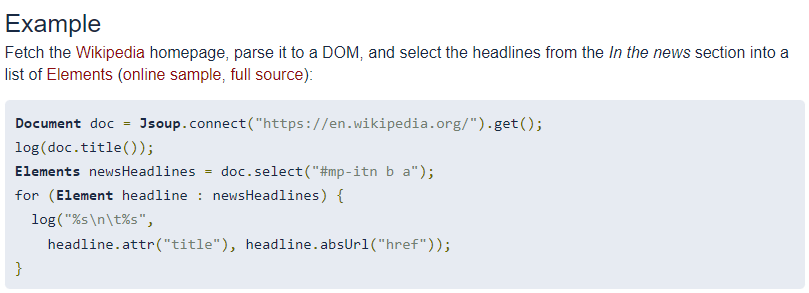

# Jsoup
데이터 크롤링을 위한 Jsoup 활용하기

## 참고링크
> https://jsoup.org/



## 사용법
1. Maven repository 사이트에서 Jsoup java HTML Parser 검색
   >https://mvnrepository.com/artifact/org.jsoup/jsoup
   * pom.xml에 Jsoup 라이브러리 추가
2. apache POI 에서 사용법을 확인할 수 있다.
   1. pom.xml에 POI 라이브러리를 추가
   >https://poi.apache.org/index.html
   >https://poi.apache.org/components/spreadsheet/quick-guide.html
   * 엑셀 문서를 만들 수 있다.

## Jsoup 실습
* 여기어때에서 서울을 검색하고 모텔 조건을 체크한 후 Jsoup을 이용해 데이터 크롤링
  >https://www.goodchoice.kr/product/result?keyword=%EC%84%9C%EC%9A%B8

* URL을 통한 데이터 크롤링
  * HTML DOM 객체 생성
  * HTML 문서 객체를 이용해 accomodation 객체 생성
```java
...

Document doc = Jsoup.connect(url).get();

Elements elements = doc.select("li.list_4");

for (Element element : elements) {
    accommodationList.add(getAccommodation(element));
}

return accommodationList;

...

Element aEl = element.select("a").first();
String detailUrl = aEl.attr("abs:href");
// 상세페이지와 연결하고, 상세페이지 HTML 문서를 표현하는 Document 객체를 획득한다.
Document detailDoc = Jsoup.connect(detailUrl).get();

accomodation.setID()

...
```

* 엑셀 문서 및 시트 생성
  * 헤더부 생성 (0번째 열)
  * 각 열 생성 및 데이터 저장
  * 응답객체 생성해 웹페이지로 전송 또는 DB로 전달
```java
...

Sheet sheet = workbook

Row headerRow = sheet.createRow(0);

for (int i = 0; i < columnNames.length; i++) {
    headerRow.
}

int size = accomodation.size();

for (int i = 0; i < size; i++) {
    Accomdation acc = accommdations.get(i);

    Row dataRow sheet.createRow(i + 1);
    dataRow.createCell(0).setCellValue(acc.getId());
    ...
}

response.setContentType("application/octet-stream");
response.setHeader("Content-Disposition", "attachment; filename=" + URLEncoder.encode("숙소정보.xlsx", "utf-8"));
workbook.write(response.getOutputStream());
```