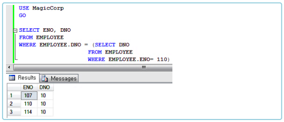
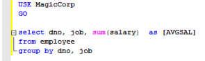
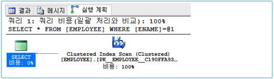
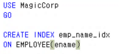
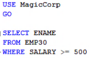
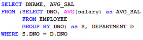

>   
> [jhta.step.or.kr](https://jhta.step.or.kr)

# 0330
# SQL활용

- [0330](#0330)
- [SQL활용](#sql활용)
- [9차시 조인 질의문](#9차시-조인-질의문)
  - [조인](#조인)
    - [간단한 조인](#간단한-조인)
      - [SQL에서 간단한 조인 표기법](#sql에서-간단한-조인-표기법)
      - [조인문 작성 시 유의 사항](#조인문-작성-시-유의-사항)
  - [다양한 조인 구문](#다양한-조인-구문)
    - [카티샨 프로덕트(Cartesian Product : X)](#카티샨-프로덕트cartesian-product--x)
    - [동등 조인](#동등-조인)
    - [자연 조인](#자연-조인)
      - [MS-SQL](#ms-sql)
      - [Oracle](#oracle)
    - [쎄타 조인](#쎄타-조인)
      - [쎄타 조인의 예](#쎄타-조인의-예)
    - [셀프 조인](#셀프-조인)
    - [다중 조인](#다중-조인)
    - [ANSI 조인](#ansi-조인)
    - [외부 조인](#외부-조인)
- [10차시 중첩 질의문](#10차시-중첩-질의문)
  - [중첩 질의문의 개요](#중첩-질의문의-개요)
    - [1. 중첩 질의문의 개념](#1-중첩-질의문의-개념)
      - [조인 질의문과 중첩 질의문](#조인-질의문과-중첩-질의문)
      - [중첩 질의문의 필요성](#중첩-질의문의-필요성)
      - [중첩 질의문의 표현](#중첩-질의문의-표현)
    - [2. 단일행 서브 쿼리와 다중행 서브 쿼리](#2-단일행-서브-쿼리와-다중행-서브-쿼리)
      - [단일행 서브 쿼리](#단일행-서브-쿼리)
      - [다중행 서브 쿼리](#다중행-서브-쿼리)
      - [단일행 서브 쿼리의 예](#단일행-서브-쿼리의-예)
      - [다중행 서브 쿼리 – 단일행 비교 연산자 사용 시 오류](#다중행-서브-쿼리--단일행-비교-연산자-사용-시-오류)
      - [다중행 비교 연산자](#다중행-비교-연산자)
      - [다중행 서브 쿼리 : IN](#다중행-서브-쿼리--in)
      - [다중행 서브 쿼리 : ANY](#다중행-서브-쿼리--any)
      - [다중행 서브 쿼리 : ALL](#다중행-서브-쿼리--all)
      - [다중행 비교 연산자](#다중행-비교-연산자-1)
  - [다양한 중첩 질의문](#다양한-중첩-질의문)
    - [1. 다중 컬럼 서브 쿼리](#1-다중-컬럼-서브-쿼리)
      - [다중 컬럼 서브 쿼리란?](#다중-컬럼-서브-쿼리란)
      - [다중 컬럼 서브 쿼리의 예](#다중-컬럼-서브-쿼리의-예)
    - [2. 상호 연관 서브 쿼리](#2-상호-연관-서브-쿼리)
      - [비상호 연관 서브 쿼리](#비상호-연관-서브-쿼리)
      - [상호 연관 서브 쿼리](#상호-연관-서브-쿼리)
      - [상호 연관 서브 쿼리](#상호-연관-서브-쿼리-1)
    - [3. 중첩 질의문 작성 시 주의점](#3-중첩-질의문-작성-시-주의점)
      - [다중행 서브 쿼리 시 단일행 비교 연산자와 사용하는 경우](#다중행-서브-쿼리-시-단일행-비교-연산자와-사용하는-경우)
      - [다중행 서브 쿼리 시 단일행 비교 연산자와 사용하는 경우](#다중행-서브-쿼리-시-단일행-비교-연산자와-사용하는-경우-1)
- [11차시 집합 연산자와 집단 연산자](#11차시-집합-연산자와-집단-연산자)
  - [집합 연산자](#집합-연산자)
    - [1. 집합 연산자](#1-집합-연산자)
      - [집합 연산자](#집합-연산자-1)
      - [UNION의 예](#union의-예)
      - [INTERSECT의 예](#intersect의-예)
      - [EXCEPT의 예](#except의-예)
    - [2. UNION과 UNION ALL](#2-union과-union-all)
      - [UNION ALL의 사용](#union-all의-사용)
    - [3. 외부 합집합](#3-외부-합집합)
      - [합병 호환성](#합병-호환성)
      - [합병 호환성의 불일치](#합병-호환성의-불일치)
      - [SQL에서의 외부 합집합](#sql에서의-외부-합집합)
      - [SQL에서의 외부 합집합](#sql에서의-외부-합집합-1)
  - [집단 연산자](#집단-연산자)
    - [1. 집단 함수](#1-집단-함수)
      - [집단 함수란?](#집단-함수란)
      - [집단 함수의 예](#집단-함수의-예)
      - [분산(VAR)](#분산var)
      - [표준 편차(STDEV)](#표준-편차stdev)
      - [분산(VAR)과 표준 편차(STDEV)](#분산var과-표준-편차stdev)
      - [COUNT(*)와 COUNT(속성명)](#count와-count속성명)
    - [2. GROUP BY와 HAVING](#2-group-by와-having)
      - [GROUP BY](#group-by)
      - [GROUP BY 사용 시 주의점](#group-by-사용-시-주의점)
      - [HAVING](#having)
    - [3. ROLLUP과 CUBE](#3-rollup과-cube)
      - [다중 속성 GROUP BY](#다중-속성-group-by)
      - [ROLLUP 연산자](#rollup-연산자)
      - [CUBE 연산자](#cube-연산자)
      - [GROUPING SETS 함수](#grouping-sets-함수)
- [12차시 순위 계산](#12차시-순위-계산)
  - [순위 함수](#순위-함수)
    - [1. TOP() 함수](#1-top-함수)
      - [질의 결과 튜플 수의 제한](#질의-결과-튜플-수의-제한)
      - [동률이 있을 때 모두 보고 싶은 경우](#동률이-있을-때-모두-보고-싶은-경우)
      - [정렬 기준 특정 비율까지만 보고 싶은 경우](#정렬-기준-특정-비율까지만-보고-싶은-경우)
    - [2. RANK() 함수](#2-rank-함수)
      - [RANK 함수](#rank-함수)
      - [RANK() 함수](#rank-함수-1)
      - [DENSE_RANK() 함수](#dense_rank-함수)
      - [ROW_NUMBER() 함수](#row_number-함수)
      - [*NTILE(n) 함수](#ntilen-함수)
  - [그룹 별 순위](#그룹-별-순위)
    - [1. 그룹 별 순위 지정](#1-그룹-별-순위-지정)
      - [기존 RANK() 함수 문법](#기존-rank-함수-문법)
      - [PARTITION BY 속성명](#partition-by-속성명)
      - [그룹별 특정 등수의 정보를 보고 싶은 경우](#그룹별-특정-등수의-정보를-보고-싶은-경우)
    - [2. 그룹 별 집단 함수](#2-그룹-별-집단-함수)
      - [그룹 별 집단 함수의 적용](#그룹-별-집단-함수의-적용)
      - [PARTITION BY를 이용해서도 그룹 별 집단 함수를 적용할 수 있음](#partition-by를-이용해서도-그룹-별-집단-함수를-적용할-수-있음)
    - [3. 행 순서 함수](#3-행-순서-함수)
      - [행 순서 함수란?](#행-순서-함수란)
      - [FIRST_VALUE 함수](#first_value-함수)
      - [LAG / LEAD 함수](#lag--lead-함수)
- [13차시 인덱스와 뷰](#13차시-인덱스와-뷰)
  - [인덱스](#인덱스)
    - [1. 인덱스의 개념](#1-인덱스의-개념)
      - [인덱스(Index)](#인덱스index)
      - [인덱스가 효율적인 경우](#인덱스가-효율적인-경우)
      - [인덱스 생성 / 삭제 구문](#인덱스-생성--삭제-구문)
    - [2. 인덱스의 종류](#2-인덱스의-종류)
      - [고유 인덱스 vs 비고유 인덱스](#고유-인덱스-vs-비고유-인덱스)
      - [고유 인덱스 vs 비고유 인덱스](#고유-인덱스-vs-비고유-인덱스-1)
      - [단일 인덱스 vs 결합인덱스](#단일-인덱스-vs-결합인덱스)
      - [DESCENDING INDEX](#descending-index)
      - [집중 인덱스 vs 비집중 인덱스](#집중-인덱스-vs-비집중-인덱스)
      - [질의 수행 시 인덱스를 사용하는지 확인하기](#질의-수행-시-인덱스를-사용하는지-확인하기)
      - [질의 수행 시 인덱스를 사용하는지 확인하기](#질의-수행-시-인덱스를-사용하는지-확인하기-1)
      - [질의 수행 시 인덱스를 사용하는지 확인하기](#질의-수행-시-인덱스를-사용하는지-확인하기-2)
      - [질의 수행 시 인덱스를 강제로 사용하게 하기](#질의-수행-시-인덱스를-강제로-사용하게-하기)
  - [뷰](#뷰)
    - [뷰의 개념](#뷰의-개념)
      - [뷰(View)란?](#뷰view란)
      - [뷰의 필요성](#뷰의-필요성)
      - [뷰의 장·단점](#뷰의-장단점)
      - [뷰의 생성](#뷰의-생성)
      - [뷰의 종류](#뷰의-종류)
      - [뷰에 대한 갱신 연산](#뷰에-대한-갱신-연산)
      - [뷰에 대한 갱신 연산](#뷰에-대한-갱신-연산-1)
      - [인라인 뷰란?](#인라인-뷰란)
      - [인라인 뷰의 예제](#인라인-뷰의-예제)
      - [인라인 뷰의 예제](#인라인-뷰의-예제-1)
      - [WITH 절](#with-절)
      - [뷰의 정의 보기](#뷰의-정의-보기)
- [14차시 사용자 관리](#14차시-사용자-관리)
  - [보안](#보안)
    - [1.통제](#1통제)
      - [보안](#보안-1)
      - [보안에 대한 통제](#보안에-대한-통제)
    - [2. 접근 제어](#2-접근-제어)
      - [권한이 부여되지 않은 데이터의 검색이나 변경을 방지함](#권한이-부여되지-않은-데이터의-검색이나-변경을-방지함)
      - [접근 제어 구조](#접근-제어-구조)
      - [권한 부여 규정](#권한-부여-규정)
  - [권한부여](#권한부여)
    - [1. 뷰 기반 기법](#1-뷰-기반-기법)
      - [뷰 기반 기법이란?](#뷰-기반-기법이란)
      - [뷰 기반 기법의 문제점](#뷰-기반-기법의-문제점)
      - [튜플 삽입의 제약](#튜플-삽입의-제약)
      - [뷰 기반 기법의 문제점](#뷰-기반-기법의-문제점-1)
    - [2. GRANT / REVOKE 기법](#2-grant--revoke-기법)
      - [GRANT / REVOKE](#grant--revoke)
      - [GRANT 구문](#grant-구문)
      - [REVOKE / DENY 구문](#revoke--deny-구문)
    - [3. MS-SQL에서의 권한 부여](#3-ms-sql에서의-권한-부여)
      - [인증 모드](#인증-모드)
      - [윈도우 인증](#윈도우-인증)
      - [SQL-Server 인증](#sql-server-인증)
      - [인증 모드](#인증-모드-1)
      - [DB 사용자](#db-사용자)
      - [Login 객체 생성 및 사용자 등록](#login-객체-생성-및-사용자-등록)
    - [MS-SQL에서의 권한 부여](#ms-sql에서의-권한-부여)
- [15차시 저장 프로시저와 사용자 정의 함수](#15차시-저장-프로시저와-사용자-정의-함수)
  - [프로시저](#프로시저)
    - [1. 프로시저의 개념](#1-프로시저의-개념)
    - [프로시저](#프로시저-1)
      - [일반 질의문과의 차이점](#일반-질의문과의-차이점)
      - [프로시저 생성 구문](#프로시저-생성-구문)
      - [프로시저 실행 문법](#프로시저-실행-문법)
      - [프로시저 수정 문법](#프로시저-수정-문법)
      - [단순 프로시저 생성 및 호출](#단순-프로시저-생성-및-호출)
    - [2. 프로시저의 매개변수](#2-프로시저의-매개변수)
      - [매개 변수](#매개-변수)
      - [입력 매개변수의 선언](#입력-매개변수의-선언)
      - [입력 매개변수 프로시저 예제](#입력-매개변수-프로시저-예제)
      - [출력 매개변수란?](#출력-매개변수란)
      - [출력 매개변수 선언](#출력-매개변수-선언)
      - [출력 매개변수](#출력-매개변수)
      - [출력 매개변수 프로시저 예제](#출력-매개변수-프로시저-예제)
  - [사용자 정의 함수](#사용자-정의-함수)
    - [1. 프로시저와의 차이점](#1-프로시저와의-차이점)
      - [사용자 정의 함수](#사용자-정의-함수-1)
      - [프로시저](#프로시저-2)
      - [사용자 정의 함수의 특징](#사용자-정의-함수의-특징)
      - [사용자 정의 함수의 선언](#사용자-정의-함수의-선언)
      - [사용자 정의 함수의 예](#사용자-정의-함수의-예)
    - [2. 테이블 반환 함수](#2-테이블-반환-함수)
      - [테이블 반환 함수](#테이블-반환-함수)
      - [프로시저 + 뷰](#프로시저--뷰)
      - [테이블 반환 함수의 선언](#테이블-반환-함수의-선언)
      - [테이블 반환 함수의 예](#테이블-반환-함수의-예)
- [16차시 트리거](#16차시-트리거)
  - [무결성 규정](#무결성-규정)
    - [1. 무결성의 의미](#1-무결성의-의미)
      - [무결성](#무결성)
      - [무결성 서브 시스템](#무결성-서브-시스템)
    - [2. 제약 조건](#2-제약-조건)
      - [무결성 규정 대상](#무결성-규정-대상)
      - [도메인 무결성 대상](#도메인-무결성-대상)
      - [릴레이션의 무결성 규정](#릴레이션의-무결성-규정)
      - [상태 제약과 과도 제약](#상태-제약과-과도-제약)
      - [상태 제약과 과도 제약](#상태-제약과-과도-제약-1)
      - [집합 제약과 튜플 제약](#집합-제약과-튜플-제약)
      - [즉시 제약과 지연 제약](#즉시-제약과-지연-제약)
  - [트리거 활용](#트리거-활용)
    - [1. 트리거의 개념](#1-트리거의-개념)
      - [트리거(TRIGGER)](#트리거trigger)
      - [프로시저 Vs. 트리거](#프로시저-vs-트리거)
      - [무결성과 트리거(TRIGGER)](#무결성과-트리거trigger)
      - [수행 기점에 따른 트리거의 분류](#수행-기점에-따른-트리거의-분류)
      - [inserted와 deleted 테이블](#inserted와-deleted-테이블)
    - [2. 트리거의 구동](#2-트리거의-구동)
      - [트리거 생성 문법](#트리거-생성-문법)
      - [AFTER 트리거(또는 FOR 트리거) 구동 예](#after-트리거또는-for-트리거-구동-예)
    - [2. 트리거의 구동](#2-트리거의-구동-1)
      - [AFTER 트리거(또는 FOR 트리거) 구동 예](#after-트리거또는-for-트리거-구동-예-1)
      - [INSTEAD OF 트리거 구동 예](#instead-of-트리거-구동-예)
    - [3. DDL 트리거](#3-ddl-트리거)
      - [DDL 트리거](#ddl-트리거)
      - [트리거의 변경과 삭제](#트리거의-변경과-삭제)
- [과제](#과제)

<small><i><a href='http://ecotrust-canada.github.io/markdown-toc/'>Table of contents generated with markdown-toc</a></i></small>


---
# 9차시 조인 질의문
## 조인
* 하나의 SQL 질의문에 의해서 여러 테이블에 저장된 데이터를 한 번에 조회할 수 있는 기능
* 두 개 이상의 테이블을 결합 한다는 의미
### 간단한 조인
#### SQL에서 간단한 조인 표기법
1. FROM 절에 조인에 참여하는 두 테이블을 기록함
   1. 콤마로 구분
2. WHERE 절에 조인 조건을 기술
```sql
SELECT DNAME
FROM EMPLOYEE, DEPARTMENT
WHERE ENO = 103 AND EMPLOYEE.DNO = DEPARTMENT.DNO
```
#### 조인문 작성 시 유의 사항
* 칼럼 이름의 모호성
  * 서로 다른 두테이블의 컬럼 명이 같을 경우
    * 예 : `DNO = DNO`
      * DBMS에서 어느 속성이 어느 테이블에 있는 것인지 알 수 없어짐
      ```SQL
      SELECT DNAME
      FROM EMPLOYEE, DEPARTMENT
      WHERE ENO = 103 AND DNO = DNO
      ```
  * 해결방법
    * 컬럼 이름 앞에 테이블 이름을 접두사로 사용
    * 테이블 이름과 컬럼이름은 점으로 구분
      * 예 : `DEPARTMENT.DNO = EMPLOYEE.DNO`
* 테이블 별명
  * 테이블 이름이 긴 경우 SQL문 작성이 힘듦
    * 테이블 이름 대신 별명 사용이 가능함
    * FROM 절에 테이블 이름 다음에 공백을 두고 별명을 정의함
* 별명 작성 규칙
  * 별명은 최대 30자까지 가능함
  * 하나의 SQL에서 테이블 이름과 별명을 혼용해서 쓸 수 없음
  * 테이블의 별명은 해당 SQL문에서만 유효함


## 다양한 조인 구문
### 카티샨 프로덕트(Cartesian Product : X)
* 두 테이블에 속한 튜플들의 모든 가능한 쌍을 생성함
  * 일반적인 방법
  * FROM 절에 두 개 이상의 테이블명을 기록함
    * WHERE 절에는 조인 조건을 기술하지 아니함
       * 예 `SELECT * FROM EMPLOYEE, DEPARTMENT`

### 동등 조인
```
조인 조건이 "=" 인 경우
```
* 조인 조건으로 일반적으로 "="을 많이 씀
### 자연 조인
```
조인 조건을 명시하지 않고 조인한다고 할 때  
두 테이블에 공통으로 나타나는 속성의 동등 조인으로 생각함
```
* 동등 조인과 질의 결과의 구조(스키마)가 똑같지는 않음
#### MS-SQL
* 자연 조인을 명시적으로 지원하지는 않음
#### Oracle
* 자연 조인을 지원하며 FROM 절에 다음과 같이 씀  
`FROM 테이블명 NATURAL JOIN 테이블명`
  * ⇨ WHERE 절에 조인 조건을 쓰지 않음
### 쎄타 조인
```
조인 조건으로 <, >, <=, >=, != 등을 쓸 수 있음
```
* 일반적인 조인 조건에 대하여 쎄타 조인이라고 함
  * 예: 다른 사원의 봉급 보다 많은 봉급을 받는 사원들의 이름 찾기
    

#### 쎄타 조인의 예
* Q) SALGRADE 테이블에서 각 봉급의 하한과 상한에 따른 등급(Grade)이 정해져 있음
  * 
* Q) 각 사원의 급여에 따라서 SALGRADE를 참조하여 사원의 등급 출력
  * 조인 조건  
    `lowsal <= salary and salary <= highsal`
  * 
* Q) 각 사원의 급여에 따라서 SALGRADE를 참조하여 사원의 등급 출력
  * SALGRADE의 lowsal과 highsal은 상한과 하한임
  * between 연산자로 변환할 수 있음
    * 


### 셀프 조인
```
하나의 테이블 내에 있는 컬럼끼리 연관시켜 조인이 필요한 경우
```
* Q) 각 사원의 이름과 그 사원의 관리자 이름 검색
  * 
  * 사원 이름 : EMPLOYEE.NAME
  * 각 사원의 관리자 번호 : EMPLOYEE.MANAGER
  * 관리자 이름 : EMPLOYEE.NAME
  * 사원의 관리자 또한 사원임
* 조인 대상 테이블이 두 개 인데 동일한 테이블임
  * 물리적으로 1개임
  * 논리적으로 서로 다른 테이블이라고 생각하면 됨
    * ⇨ 이외에는 다른 조인과 똑같음
* 어떻게 서로 다른 테이블이라고 SQL로 할까?
   * 별명을 이용함
* Q) 각 사원의 이름과 그 사원의 관리자 이름 검색
  * 


### 다중 조인
* 조인 질의의 경우
  * 조인에 참여하는 테이블이 2개 ⇨ 보통 ‘2중 조인’(2-way join)이라고 함
* 다중 조인(m-way join)
  * 경우에 따라서 여러 테이블들 간의 조인이 필요한 경우도 있음
* Q) 쎄타 조인의 예제를 확장하여 각 사원별 이름, 급여 등급, 그리고 부서명 검색
  * 사원 테이블의 부서 번호를 통해 부서 테이블을 참조하여 부서명을 가지고 와야 함
  * 사원 테이블의 급여로부터 급여등급 테이블의 등급을 가지고 와야 함
    * ⇨3개의 테이블을 조인해야 함(3중 조인)
  * 이름 : employee 테이블
  * 급여등급 : salgrade 테이블
  * 부서명 : department 테이블
  * 조인조건
    ```sql
    employee와 salgrade
    salary between lowsal and highsal
    employee와 department
    dno = dno
    ```
* Q) 사원별 이름, 급여등급, 부서명 출력
    * 

### ANSI 조인
```
SQL을 표준화할 때 만든 ANSI 표준 문법
```
* 기존 SQL과 차이점
  * 조인 조건을 WHERE로 표현하지 않고 FROM 절에 표현함
* ANSI 조인의 종류
  * CROSS JOIN
  * INNER JOIN
  * OUTER JOIN
    * ⇨ T-SQL 문법과 다소 상이해서 지원되지 않는 부분도 있음
* 크로스 조인(Cross Join)
  * 카티샨 프로덕트(Cartesian Product)의 다른 표현 법
  * `FROM 테이블명 CROSS JOIN 테이블명`

* 내부 조인(Inner Join)
    * 일반적인 조건의 Ansi 조인 표기법
    * `FROM 테이블명 INNER JOIN 테이블명 ON 조인조건`
    * `FROM 테이블명 JOIN 테이블명 ON 조인조건`
    * 
    * 

### 외부 조인
* 일반적인 조인은 조인 조건을 만족하는 튜플들만이 조인 결과에 나옴
  * ⇨ 정보의 손실
* 조인 조건을 만족하지 않는 튜플들도 결과로 보고 싶은 경우
  * ⇨ 조인에 참여하는 테이블에 속한 모든 튜플을 출력함
* ANSI 조인 표기법 : 명시적 표기법
  * LEFT OUTER JOIN : 왼쪽 테이블에 있는 튜플들은 다 나옴
  * RIGHT OUTER JOIN : 오른쪽 테이블에 있는 튜플들은 다 나옴
  * FULL OUTER JOIN : 양쪽 테이블에 있는 튜플들은 다 나옴
* Q) 각 사원의 이름과 그 사원의 관리자 이름 검색
  * 관리자가 없는 사원들도 질의 결과에 포함되어야 함
  * 


---
# 10차시 중첩 질의문
## 중첩 질의문의 개요
### 1. 중첩 질의문의 개념 
```
하나의 SQL문의 결과를 다른 SQL문에 전달함 
두 개의 SQL문을 하나의 SQL로 처리함 
```
#### 조인 질의문과 중첩 질의문 
* 이론적으로 중첩 질의문은 조인 구문과 표현능력이 동일함
* 중첩 질의문의 필요성 ⇨ 조인의 필요성과 동일함
#### 중첩 질의문의 필요성 
```
하나의 SQL 질의문이 하나의 테이블만 검색할 수 있다고 하는 경우
```
* Q) 사번이 103인 사원의 부서명을 알고 싶을 때
  1. 사번이 103번인 사원의 부서 번호를 파악함
  2. 해당 부서 번호와 같은 부서 번호를 가지고 부서명을 부서테이블에서 검색함
    * ⇨ 매우 불편함 ⇨ 조인 구문 사용(조인 구문 어려움) ⇨ 중첩 질의문
    * 


#### 중첩 질의문의 표현 
* SQL문 안에 SQL문이 포함되어 있음
  * 

### 2. 단일행 서브 쿼리와 다중행 서브 쿼리
#### 단일행 서브 쿼리 
* 서브 쿼리의 결과로 하나의 튜플만이 반환됨
* 서브 쿼리의 검색 조건이 후보키에 연관되어 있을 경우가 많음
#### 다중행 서브 쿼리 
* 서브 쿼리의 결과로 여러 개의 튜플들이 반환됨
* -> 단일행 서브 쿼리와 다중행 서브 쿼리를 구분해야 할까? 
```
일반적인 비교 연산자인 =, <, <=, >, >=, !=등은 속성값 간의 비교 연산임 
```
  * 집합에 대한 비교 연산이 안됨
#### 단일행 서브 쿼리의 예 
* Q) 사원 번호 110번과 같은 부서에 근무하는 사원들의 사원 번호와 부서번호 검색
  * 사원번호가 기본키 임으로 사원번호 110번은 1명 밖에 없음
    * ⇨ 단일행 서브 쿼리
  * =, <, <=, >, >=, != 등을 사용할 수 있음
    * 


#### 다중행 서브 쿼리 – 단일행 비교 연산자 사용 시 오류 
* Q) 봉급이 500이상인 사원과 같은 부서에 근무하는 사원들의 이름, 봉급, 부서번호 구하기
  * 
#### 다중행 비교 연산자 
* IN
  * 속성값이 여러 값들 중 하나이기만 하면 참
  * “= OR”의 의미
* ANY 또는 SOME
  * 메인 쿼리 비교 조건에서 서브 쿼리의 결과와 하나라도 일치하면 참
  * IN과의 차이점은 >, >=, <=, <과 같은 범위 비교와도 같이 사용이 가능함
  * = ANY와 = SOME은 IN과 같은 의미임
* ALL
  * 메인 쿼리 비교 조건에서 서브 쿼리의 결과와 모두 일치하면 참

#### 다중행 서브 쿼리 : IN 
* Q) 봉급이 500이상인 사원과 같은 부서에 근무하는 사원들의 이름, 봉급, 부서번호 구하기
  * 
#### 다중행 서브 쿼리 : ANY 
* Q) 부서 번호 20에 근무하는 한 직원의 봉급 보다 많은 봉급을 받는 직원들의 이름, 봉급, 부서번호 출력
  * 
#### 다중행 서브 쿼리 : ALL 
* Q) 부서 번호 10에 근무하는 모든 직원들의 봉급 보다 많은 봉급을 받는 직원들의 이름, 봉급, 부서번호 출력
  * 

#### 다중행 비교 연산자 
* EXISTS
  * 서브 쿼리의 결과가 하나라도 존재하면 참이 되는 연산자
* NOT EXISTS
  * EXISTS와 상반되는 연산자
* Q) 봉급과 커미션의 합이 500이 넘는 사원이 존재하면 모든 사원의 이름 출력
  * 


## 다양한 중첩 질의문 
### 1. 다중 컬럼 서브 쿼리 
#### 다중 컬럼 서브 쿼리란? 
* 다중 컬럼 서브 쿼리 : 서브 쿼리의 결과가 여러 개의 속성들로 구성되어 주
쿼리의 조건과 비교하는 서브 쿼리임
  * 복수 개의 서브 쿼리들로 구성됨
  * 메인 쿼리와 서브 쿼리의 비교 대상 칼럼을 분리하여 개별적으로 비교한 후 AND 연산에 의해 최종 결과를 출력함
#### 다중 컬럼 서브 쿼리의 예 
* Q) 사원번호 101인 사원과 동일 부서에 동일한 급여를 지급받는 직원 구하기
  * 
* 다양한 중첩 질의문 
### 2. 상호 연관 서브 쿼리 
#### 비상호 연관 서브 쿼리 
* 앞서 보았던 서브 쿼리들은 서브 쿼리의 결과가 메인 쿼리에서 검사하는 튜플에는 영향 받지 않고 그 결과가 일정함
  * ⇨ 부서 테이블의 어떤 튜플들을 검색하던지 간에 서브 쿼리
  ```sql
  SELECT DNO FROM 
  EMPLOYEE WHERE 
  EMPLOYEE.ENO =103
  ```
    * 항상 일관되게 부서번호 30을 반환함 
    * 

#### 상호 연관 서브 쿼리 
```
메인 쿼리절과 서브 쿼리 간에 검색 결과를 교환하는 서브 쿼리
``` 
* 메인 쿼리와 서브 쿼리 간의 결과를 교환하기 위하여 서브 쿼리의 WHERE 
조건절에서 메인 쿼리의 테이블과 연결함
* 서브 쿼리의 조건절에 메인 쿼리에서 사용하는 테이블의 속성이 나타남
  * -> 메인 쿼리에서 어떤 튜플에 대한 조건을 비교하는가에 따라서 서브 쿼리의 결과가 다르게 나타남 
* 상호 연관 서브 쿼리 사용법
  ```sql
  SELECT 속성리스트
  FROM table1
  WHERE table1.속성 비교연산자 (
  SELECT 속성리스트
  FROM table2
  WHERE table2.속성 비교연산자 table1.속성)
  ```
* 주의 사항
  * 메인 쿼리에서 table1에 속한 튜플을 하나씩 접근하여 WHERE 절 수행 시 서브 쿼리가 반복적으로 수행됨으로 성능이 매우 떨어질 수 있음
    * ⇨ 조인 구문을 이용하는 것이 더 효율적임
#### 상호 연관 서브 쿼리 
* Q) 각 사원에 대하여 관리자와 동일 부서에서 근무하는 사원들의 이름, 급여, 
부서 번호 출력
  * 사원마다 관리자가 달라짐
  * 

### 3. 중첩 질의문 작성 시 주의점 

#### 다중행 서브 쿼리 시 단일행 비교 연산자와 사용하는 경우 
* 중첩 질의문 사용 시 오류가 없도록 IN, ANY, ALL을 기본적으로 사용함
  * 
* 서브 쿼리 내에서는 ORDER BY 절을 사용하면 안됨
  * 
* 서브 쿼리의 결과가 NULL일 경우, 메인 쿼리의 결과 또한 NULL임
  * 
#### 다중행 서브 쿼리 시 단일행 비교 연산자와 사용하는 경우 
* 서브 쿼리가 NULL을 반환할 경우, 메인 쿼리에서 결과를 생성하고 싶으면 “NOT EXISTS” 를 사용함
    ```sql
    SELECT ENO, ENAME, SALARY, DNO
    FROM EMPLOYEE
    WHERE NOT EXISTS (SELCT DNO
                FROM EMPLOYEE
                WHERE ENO = 500)
    ```


---
# 11차시 집합 연산자와 집단 연산자
## 집합 연산자
### 1. 집합 연산자 
#### 집합 연산자 
* 테이블을 구성하는 튜플 집합에 대한 테이블의 부분 집합을 결과로 반환하는
연산자
* UNION : 합집합
* INTERSECT : 교집합
* EXCEPT : 차집합(Oracle에선 MINUS로 사용)
#### UNION의 예 
* Q) 부서 번호 10인 사원들과 직급이 staff인 사원들 검색
  * 

#### INTERSECT의 예 
* Q) 부서 번호 10이고 직급이 staff인 사원들 검색
  * 
#### EXCEPT의 예 
* Q) 부서 번호 10인 사원들 중 직급이 staff인 사원들 검색
  * 

### 2. UNION과 UNION ALL 
```
집합 연산자를 대상 테이블을 집합으로 봄 
```
  * 따라서 결과도 집합임    * ⇨중복을 허용하지 않음
```
필요에 따라서 중복된 결과도 보고 싶은 경우 
```
  * UNION ALL을 사용 
#### UNION ALL의 사용 
* Q) 부서 번호 10인 사원들과 직급이 staff인 사원들 검색(중복 허용)
  * 

### 3. 외부 합집합 
#### 합병 호환성 
```
∪, ∩, - 연산의 피연산자(릴레이션)들이 지켜야 할 제약 조건 
```
  *  차수(Degree : 속성의 수)가 같아야 함
  *  대응되는 속성 쌍 별로 타입(또는 도메인)이 같아야 함
  *  대응되는 속성 쌍 별로 의미(Semantic)가 같아야 함
#### 합병 호환성의 불일치
```
두 질의 결과가 합병 호환성을 만족하지 않음 
합집합하고 싶은 경우 
```
* -> 외부 합집합(U+) 
#### SQL에서의 외부 합집합 
* 두 질의 결과의 속성 수와 타입이 일치되게 만듦
* NULL은 모든 속성에서 사용할 수 있는 속성값임
  * ⇨ 이를 이용하여 강제로 동일한 구조가 되게 함
 
#### SQL에서의 외부 합집합 
* 두 질의 결과의 속성 수와 타입이 일치되게 만듦
* NULL은 모든 속성에서 사용할 수 있는 속성값임
  * ⇨ 이를 이용하여 강제로 동일한 구조가 되게 함
* 외부 합집합의 예
  * 두 질의 결과에서 공통인 속성은 dno밖에 없음
  * 다른 것들은 NULL로 출력하도록 함
  * ⇨ 속성의 수 : 각각 4개, 타입도 일치함
  * ⇨ 합집합 할 수 있음
    * 
 
## 집단 연산자
### 1. 집단 함수 
#### 집단 함수란? 
* 테이블의 전체 행을 하나 이상의 컬럼을 기준으로 그룹화하여 해당 그룹 별 통계 값을 출력하는 함수
  * Q) 전체 직원의 평균 봉급을 구하기
    * 
* 집단 함수의 종류 
  * SUM : 그룹의 합계
  * AVG : 그룹의 평균
  * COUNT : 그룹의 개수
  * MAX : 그룹의 최대값
  * MIN : 그룹의 최소값
  * STDEV : 그룹의 표준편차
  * VAR : 그룹의 분산
```
일반적으로 집단 함수는 NULL값을 제외한 속성값들의 통계 값을 반환함 
```
#### 집단 함수의 예 
* Q) 사원의 최대 봉급, 최소 봉급 구하기
  * 
#### 분산(VAR) 
* 각 값이 평균과 얼마나 떨어져 있는지에 대한 통계 값
* 각 값과 평균의 차에 대한 차(즉, 편차)의 제곱의 평균
  * 편차는 음수이거나 양수 일수 있음으로 편차를 제곱하여 양수로 나타내고 이들의 합에 대한 평균을 구함
    $$
    (sumi=1,n (xi- M)2)/N
    $$
      * Xi : 각 값
      * M : 평균
      * N : 값의 개수
#### 표준 편차(STDEV) 
* 분산의 경우 편차에 대한 제곱으로 나타내므로 평균과의 단위가 맞지 않음
* 단위를 맞추기 위하여 분산의 제곱근을 표준편차로 사용함
  $$
  STDEV = VAR1/2
  $$
#### 분산(VAR)과 표준 편차(STDEV) 
* Q) 사원들의 급여 평균, 분산, 표준편차 구하기
  * NULL값을 제외한 모든 행의 평균, 분산, 표준편차가 구해짐
    * 

#### COUNT(*)와 COUNT(속성명) 
* COUNT(*)
  * 테이블에서 조건을 만족하는 행의 개수를 반환하는 함수
  * *는 모든 속성들이란 의미임
* COUNT(속성명)
  * 속성값이 NULL이 아닌 속성값의 개수
* COUNT(DISTINCT 속성명)
  * 속성값이 NULL이 아니며 중복되지 않는 속성값들의 개수
  * SUM, AVG도 DISTINCT를 쓸 수 있음
  * MIN, MAX에서는 DISTINCT가 의미가 없음
* Q) 사원 테이블의 튜플수와 COMMISION의 개수 구하기
  * 
* Q) 사원의 직급(JOB)의 수와 중복되지 않는 직급(JOB)의 수 구하기
  * 
### 2. GROUP BY와 HAVING 
#### GROUP BY 
* 특정 속성을 기준으로 테이블 전체를 그룹으로 나누기 위한 절
  * 예 부서별 사원의 평균 봉급
    ```SQL  
    SELECT 컬럼_리스트
    FROM 테이블명
    WHERE 조건
    GROUP BY 컬럼_리스트
    ```
  * Q) 부서별 사원들의 평균 봉급과 부서번호 검색하기
    * D
* * 집단 연산자 
#### GROUP BY 사용 시 주의점 
1. SELECT 절에는 집단 연산자나 GROUP BY에 사용한 속성명만을 사용할 수 있음
2. 공통되는 속성값으로 그룹핑을 했으므로, 각 그룹에서 개별 튜플을 접근할 수 없음
   * Q) 부서별 사원들의 평균 봉급과 부서번호, 사원이름 검색하기(오류)
     * 
#### HAVING 
* 각 그룹에 대한 제약 조건을 기술할 때 사용함
* HAVING 절은 GROUP BY 절의 종속절임
  * GROUP BY없이 HAVING은 나타날 수 없음
* WHERE 절은 테이블 전체에 대한 제약 조건을 나타냄
  * Q) 부서의 최대 봉급이 500초과인 부서에 대해서만 부서별 사원들의 평균 봉급과 부서 번호 출력하기
    *     
 
### 3. ROLLUP과 CUBE 
#### 다중 속성 GROUP BY 
* 하나 이상의 속성들을 이용하여 그룹을 나누고, 그룹별로 다시 서브 그룹을
나누고자 할 때 사용함
```
GROUP BY 컬럼1, 컬럼2, …, 컬럼n
```
  * Q 부서별 직급별 사원들의 봉급 합 구하기
    * 
#### ROLLUP 연산자 
* GROUP BY절의 그룹 조건에 따라서 그룹핑 하고 각 그룹에 대한 부분합을
구하는 연산자
* GROUB BY절에 n개의 속성 명이 있으면, n+1개의 그룹핑 조합이 나옴
* GROUB BY c1, c2, c3일 때
  * 각 그룹 c1, c2, c3 별 합
  * 각 그룹 c1, c2 별 합
  * 그룹 c1 별 합
  * 전체 합
* Q) ROLLUP 연산자를 이용하여 부서별 직급별 사원들의 봉급 합 구하기
  * 
 
#### CUBE 연산자 
* GROUP BY 절의 그룹 조건에 따라서 그룹핑하고 각 그룹의 조합에 따른
부분합을 구하는 연산자
* GROUB BY절에 n개의 속성명이 있으면 2n개의 그룹핑 조합이 나옴
* GROUB BY c1, c2, c3일 때
  * 각 그룹 c1, c2, c3 별 합
  * 각 그룹 c1, c2 별 합, c1, c3 별 합, c2, c3 별 합
  * 그룹 c1 별 합, c2 별 합, c3 별 합
  * 전체 합
* Q) CUBE 연산자를 이용하여 부서별 직급별 사원들의 봉급 합 구하기
  * 
#### GROUPING SETS 함수 
```
여러 개의 GROUP조건을 표시하고 싶은 경우
```
* 예) 부서 별 급여 합과 직급별 급여 합을 한번에 보고 싶음
GROUPING SETS 함수를 이용함 
```
부서, 직급별 합을 보고 싶지 않은 경우
```
* -> GROUPING SETS 함수를 이용함
  * 


---
# 12차시 순위 계산
## 순위 함수
### 1. TOP() 함수
#### 질의 결과 튜플 수의 제한 
* 질의 결과는 ORDER BY 절을 이용하여 정렬할 수 있음
* ORDER BY 정렬 기준에서 특정 등수 / 비율까지만 보고 싶은 경우
  * ⇨Top(n) 함수를 이용함
    ```sql
    SELECT TOP(n) 속성명
    …
    ORDER BY 속성명
    ```
  * Q 사원들 중 급여 기준 5등까지만 결과로 출력하기
    ```sql
    select top(5) *
    from employee
    order by salary desc
    ```
    * 5등에 동률이 있을 경우 임의로 한 개만 출력함

#### 동률이 있을 때 모두 보고 싶은 경우 
* WITH TIES를 사용함
    ```sql
    SELECT TOP(n) WITH TIES 속성명
    …
    ORDER BY 속성명
    ```
  * Q 사원들 중 급여 기준 5등까지만 결과로 출력하기
    ```sql
    select top(5) with ties *
    form employee
    order by salary desc
    ```
    * 5등에 동률이 있을 경우 모두 출력함

#### 정렬 기준 특정 비율까지만 보고 싶은 경우 
* Top(n) PERCENT를 이용함
* 상위 n%까지만을 출력하게 됨
    ```sql
    SELECT TOP(n) PERCENT [WITH TIES] 속성명
    …
    ORDER BY 속성명
    ```
  * Q 사원들 중 급여 기준 20%까지만 결과로 출력하기
    ```sql
    select top(20) percent *
    from employee
    order by salary desc
    ```

### 2. RANK() 함수 
```
TOP() 함수를 쓰면 결과 수를 제한함 
```
  * TOP() 함수는 등수를 구할 수 없음
#### RANK 함수 
* 각 튜플에 등수를 표시함
```sql
RANK 함수 over (order by 속성명 [asc|desc] )
```
* 속성 기준 오름차순(asc)또는 내림차순(desc)으로 정렬된 상태에 대하여
등수 지정
* 다양함 RANK 함수가 있음
#### RANK() 함수 
```sql
SELECT 속성명, RANK () OVER (ORDER BY 속성명 [asc|desc] )
```
* 동률에 대하여 동일 등수 배정
* 비연속식 등수 배정
  * 예 1,2,2,4,…
* Q) 사원에 대하여 이름, 급여, 급여에 대한 내림차순 RANK() 값 출력하기
  ```sql
  select ename, salary, rank() over(order by salary desc) as rank
  from employee
  ```
#### DENSE_RANK() 함수 
* `SELECT 속성명, DENSE_RANK () OVER (ORDER BY 속성명)`
* 동률에 대하여 동일 등수 배정
* 연속식 등수 배정
  * 예) 1,2,2,3,…
* Q) 사원에 대하여 이름, 급여, 급여에 대한 DENSE_RANK() 값 출력하기
    ```sql
    select ename, salary, dense_rank() over(order by salary desc)as rank
    from employee
    ```

#### ROW_NUMBER() 함수 
```sql
SELECT 속성명, ROW_NUMBER () OVER (ORDER BY 속성명)
```
* 동률에 대하여 임의 등수 배정
* 연속식 등수 배정
  * 예 1,2,3,4,…
* Q) 사원에 대하여 이름, 급여, 급여에 대한 ROW_NUMBER() 값 출력하기
```sql
select ename, salary, row_number() over(order by salary desc) as rank
from employee
```

#### *NTILE(n) 함수 
* 전체 튜플을 n개로 균등 분할하여 순위 지정
  * 예 
    * 결과 튜플이 20개이고 n이 10이면, 1등 2개, 2등 2개, …, 10등 2개로 등수 지정
    * 결과 튜플수가 n으로 나누어 떨어지지 않으면 1등부터 추가적으로 배정함
    * 결과 튜플이 22개이고 n이 10이면 1등 3개, 2등 3개, 3등 2개, …, 10등 2개로 등수 지정
* Q) 사원에 대하여 이름, 급여, 급여에 대한 내림차순으로 5등분 하여 등분순위 출력하기
    ```sql
    select ename, salary, NTILE(5) over(order by salary desc) as rank
    from employee
    ```

## 그룹 별 순위
### 1. 그룹 별 순위 지정 
#### 기존 RANK() 함수 문법 
* 전체 결과에 대한 속성값 기준 등수 지정이 됨
  * 특정 그룹별 순위 지정은 어떻게 할까?
    * 부서별로 구분해서 각 부서 내에서 봉급 순위를 알아봄
#### PARTITION BY 속성명 
* 튜플들을 속성값에 따라서 그룹핑함
* 각 그룹에 대하여 순위 함수를 적용함
```sql
RANK() over (PARTITION BY dno ORDER BY salary desc)
```
* “DNO별로 분류하고 각 분류된 소그룹에서 salary기준 내림차순하고
순위를 나타내시오.”라는 의미임
* Q) DNO별로 분류하고 각 분류된 소그룹에서 salary기준 내림차순하고 순위 나타내기
  ```sql
  select ename, salary, dno,
            rank() over(partition by dno order by salary desc) as rank_dept
  from employee
  ```
#### 그룹별 특정 등수의 정보를 보고 싶은 경우 
* WHERE 절을 같이 활용함
```sql
RANK() over (PARTITION BY dno ORDER BY salary desc) AS 속성명
…
WHERE 속성명 = 등수
```
* Q) 각 부서에서 급여 순위 2등인 사원의 부서번호, 이름과 급여 출력하기
  * 인라인 뷰를 사용함
  ```sql
  select *
  from 
        (select dno, ename, salary, rank() over(partition by dno order by salary desc) as rank_cal from employee) as temp
  where rank_val =2
  ```
### 2. 그룹 별 집단 함수
#### 그룹 별 집단 함수의 적용
```sql
SELECT 집단 함수 ~ GROUP BY~ 
```
#### PARTITION BY를 이용해서도 그룹 별 집단 함수를 적용할 수 있음 
```sql
SELECT 집단함수() OVER (PARTITION BY 속성명)
```
* Q) PARTITION BY를 이용하여 부서별 급여의 평균 출력하기
  ```sql
  select dno,
         AVG(salary) over(partition by dno ) as avg_sal_dept
  from employee
  ```

### 3. 행 순서 함수 
#### 행 순서 함수란? 
* 행 순서 함수 : 정렬된 대상에서 특정 순위의 튜플들을 추출할 필요가 있을 때
사용되는 함수
  * FIRST_VALUE 함수
    * 정렬 대상에서 첫 번째 데이터 추출
  * LAG / LEAD 함수
    * 지정된 순서에서 선행 / 후행 데이터를 참조하는 함수

#### FIRST_VALUE 함수
* Q) 각 부서별 최고 급여액 출력하기
  ```sql
  select distinct dno, first_value(salary)
                over(partition by dno order by salary desc) as higest_sal
  from employee
  ```

#### LAG / LEAD 함수 
* 정렬 기준 선행 값 / 후행 값을 추출함
* Q 각 사원별 이름, 급여와 급여 순위 상 선행 순위의 급여, 급여 순위 상 후행 순위의
급여 출력하기
```sql
select DISTINCT ename, salary,
                LAB(salary, 1) over(order by salary desc) as LAG_VAL,
                LEAD(salary, 1) over(order by salary desc) as LEAD_VAL
from employee
```


---
# 13차시 인덱스와 뷰
## 인덱스
### 1. 인덱스의 개념
#### 인덱스(Index)
* 검색 성능을 향상 시키기 위한 부가적인 자료 구조
* 질의 명령문의 검색 속도를 향상시키기 위해 칼럼에 대해 생성하는 객체
* 포인터를 이용하여 테이블에 저장된 데이터를 랜덤 액세스하기 위한 목적으로 사용
#### 인덱스가 효율적인 경우
* WHERE 절이나 조인 조건절에서 자주 사용되는 칼럼의 경우
* 전체 데이터 중에서 10~15%이내의 데이터를 검색하는 경우
* 두 개 이상의 칼럼이 WHERE 절이나 조인 조건에서 자주 사용되는 경우
* 테이블에 저장된 데이터의 변경이 드문 경우
  * 색인은 부가적인 자료 구조임
  * 데이터 삽입 시 비효율적임

#### 인덱스 생성 / 삭제 구문
* 색인 생성
```sql
CREATE INDEX 색인명
ON 테이블명(속성명, 속성명,…)
```
* 색인 삭제
```sql
DROP INDEX 색인명
ON 테이블명
```
### 2. 인덱스의 종류
1. 고유 인덱스 vs 비고유 인덱스
2. 단일 인덱스 vs 결합 인덱스
3. DESCENDING INDEX
4. 집중 인덱스 vs 비집중 인덱스
#### 고유 인덱스 vs 비고유 인덱스
* 고유 인덱스
  * 유일 값을 가지는 속성에 대하여 생성하는 색인
  * 각 키 값은 테이블의 하나의 튜플과 연관됨
* 비고유 인덱스
  * 중복된 값을 가지는 속성에 생성하는 인덱스
  * 키 값은 여러 개의 튜플들과 연관됨
* 기본키
  1. 테이블이 기본키에 대해서는 자동으로 고유색인이 생성됨
    * ⇨ Primary Index
    * 기본키는 중복을 허용하지 않음
  2. 새로운 튜플을 삽입 할 때마다 키값이 고유값인지 검사해야 함
  3. 테이블에 속한 튜플들이 많다면 매우 느림
    * -> 고유 색인을 이용함
* 관계형 테이블의 검색
  1. 테이블 검색 시 기본키만을 사용하지 않음
  예 학생 테이블에서 학번이 100번인 학생 검색하기
  2. 실제로는 학생을 검색할 때는 학번보다 이름을 이용하는 경우가 더 많음
  3. 검색을 빨리 하려면 조건에 많이 사용되는 컬럼에 대하여 색인을 생성함
     * ⇨ Secondary Index

#### 고유 인덱스 vs 비고유 인덱스
* 고유 인덱스의 생성
  * 고유 인덱스를 생성할 때는 UNIQUE 키워드를 사용함
* Q)부서 테이블에 부서 이름에 대하여 고유 색인 생성하기
  * 
* 비고유 인덱스의 생성
  * UNIQUE 없이 색인을 생성하면 비고유 색인이 됨
* Q) 부서 테이블에 부서 위치에 대하여 비고유 색인 생성하기
  * 

#### 단일 인덱스 vs 결합인덱스
* 단일 인덱스
  * 하나의 속성만으로 구성된 색인
  * 앞에서 보인 예들은 단일 인덱스들임
* 결합 인덱스
  * 두 개 이상의 속성들에 대하여 생성된 색인
* 결합 인덱스의 생성
  * Q) 직원 테이블에서 부서 번호와 급여에 대하여 결합 인덱스 생성하기
    * 

#### DESCENDING INDEX
* 일반적인 색인들은 속성값에 대하여 오름차순으로 정렬되어 저장됨
  * DESCENDING INDEX : 특별히 속성별로 정렬 순서를 지정하여 결합 인덱스를 생성하는 방법
    * 색인 생성 시에 각 속성별로 정렬순서(DESC, ASC)를 정해줌
* DESCENDING INDEX의 생성
  * Q) 사원에 대하여 부서 번호는 오름차순, 급여는 내림차순으로 하여 색인 생성하기
    * 
#### 집중 인덱스 vs 비집중 인덱스
* 집중 인덱스
  * 테이블의 튜플이 저장 된 물리적 순서 해당 색인의 키값 순서와 동일하게
유지되도록 구성된 색인
  * 기본키에 대하여 생성된 색인은 집중 인덱스임
  * 테이블의 튜플들이 기본키에 오름차순으로 정렬되어 저장되어 있고 기본키 색인
또한 기본키에 따라서 오름차순으로 정렬되어 있음
  * 집중 인덱스는 하나의 테이블에 대하여 하나만 생성할 수 있음
* 비집중 인덱스
  * 집중 인덱스가 아닌 인덱스들

#### 질의 수행 시 인덱스를 사용하는지 확인하기
* Q) 사원 이름이 ‘e1’인 사원의 정보 검색하기
```sql
SELECT * FROM EMPLOYEE WHERE ENAME = ‘e1’
```

#### 질의 수행 시 인덱스를 사용하는지 확인하기
* MS-SQL에서 질의 수행 계획 보는 방법
  1. 질의 수행 전 클릭해서 수행 계획 보기 선택
    * 
  2. 실행 계획 탭이 생김
    * 

#### 질의 수행 시 인덱스를 사용하는지 확인하기
* MS-SQL에서 질의 수행 계획 보는 방법
  * 질의 수행 방법
    * 기본키(ENO)에 생성된 색인
    * 처음부터 scan하는 형태로 이용함
  * 

#### 질의 수행 시 인덱스를 강제로 사용하게 하기
1. 질의는 eno로 탐색하는 것이 아니라 ENAME을 가지고 탐색하는 질의임
   ```sql
   SELECT * FROM EMPLOYEE WHERE ENAME = ‘e1’
   ```
2. employee테이블의 ename을 가지고 색인 mp_name_idx을 만듦
   * ⇨질의 수행기가 해당 색인을 사용하지 않음
```
강제로 emp_name_idx를 사용하게 할 수 없을까?
```
* 
3. FROM 절에 WITH(INDEX= INDEX_NAME)을 추가하여 강제로 특정 색인을
사용하게 함
   * 앞선 질의에서 emp_name_idx를 사용하게 함
4. 색인을 사용하는지 질의수행 계획 확인
   * emp_name_idx를 통해서 이름이 e1인 튜플의 기본키값을 파악함 (index Seek) 
   * 파악된 기본키를 이용하여 기본 색인(PK_EMPLOYEE__...)을 검색하여 결과를 찾도록 수행됨

## 뷰
### 뷰의 개념
#### 뷰(View)란?
* 하나 이상의 기본 테이블이나 다른 뷰를 이용하여 생성되는 가상 테이블
  * 기본 테이블은 디스크에 공간이 할당되어 데이터를 저장함
  * 뷰는 데이터 딕셔너리(Data Dictionary) 테이블에 뷰에 대한 정의(SQL문)만 저장되어 디스크 저장 공간 할당이 이루어지지 않음
  * 전체 데이터 중에서 일부만 접근할 수 있도록 함
  * 뷰에 대한 수정 결과는 뷰를 정의한 기본 테이블에 적용됨
  * 뷰를 정의한 기본 테이블에서 정의된 무결성 제약조건은 그대로 유지됨

#### 뷰의 필요성
* 사용자 마다 특정 객체만 조회할 수 있도록 할 필요가 있음
  * 모든 직원에 대한 정보를 모든 사원이 볼 수 있도록 하면 안 됨
* 복잡한 질의문을 단순화 할 수 있음
* 데이터의 중복성을 최소화할 수 있음
 * 예) 판매부(Sale)에 속한 사원들을 따로 관리하고 싶은 경우
   * ⇨판매부에 속한 사원들만을 사원테이블에서 찾아서 다른 테이블로 만들면
중복성이 발생함
   * ⇨이럴 때 뷰가 필요함
#### 뷰의 장·단점
* 장점
  * 논리적 독립성을 제공함
  * 데이터의 접근 제어(보안)
  * 사용자의 테이터 관리 단순화
  * 여러 사용자의 다양한 데이터 요구 지원
* 단점
  * 뷰의 정의 변경 불가
  * 삽입, 삭제, 갱신 연산에 제한이 있음

#### 뷰의 생성
* 뷰의 생성 구문
```sql
CREATE VIEW 뷰이름
AS SQL문(select 문)
```
* 뷰의 삭제 구문
```sql
DROP VIEW 뷰이름
```
* Q) 사원 테이블에 부서번호 30인 사원들의 뷰 생성하기
  * 
* Q) 뷰를 이용하여 부서번호 30인 사원들 중 급여가 500이상인 사원들의 이름 구하기
  * 

#### 뷰의 종류
* 단순 뷰
  * 하나의 기본 테이블 위에 정의된 뷰
* 복합 뷰
  * 두 개 이상의 기본 테이블로부터 파생된 뷰
#### 뷰에 대한 갱신 연산
* 무결성 제약 조건, 표현식, 집단연산, GROUP BY 절의 유무에 따라서 DML(Data Manipulation Language)문 사용이 제한적임
  * 데이터 조작 언어(DML : Data Manipulation Language) : INSERT, DELETE, UPDATE, SELECT 문과 같이 데이터의 삽입, 삭제, 변경, 검색을 할 수 있게 하는 데이터 조작문
* Q) 사원 테이블에서 평균 연봉을 구하는 뷰 생성하기
  * 

#### 뷰에 대한 갱신 연산
* Q) 평균 연봉 뷰에 대하여 평균 연봉 10 증가시키기
  * 
    * 뷰가 집단연산의 결과일 경우, 뷰를 통한 갱신 연산은 불가능함

#### 인라인 뷰란?
* 하나의 질의문 내에서만 생성되어 사용 되어지고 질의문 수행 종료 후에는
사라지는 뷰
  * 뷰의 명시적인 선언(즉, Create View 문)이 없음
  * FROM 절에서 참조하는 테이블의 크기가 클 경우, 필요한 행과 속성만으로
  구성된 집합으로 정의하여 질의문을 효율적으로 구성함
  * FROM 절에서 서브 쿼리를 사용하여 생성하는 임시 뷰
#### 인라인 뷰의 예제
* Q) 부서별 평균 급여 파악하기
   * ⇨ 부서 번호로 나와 있음
   * ⇨ 부서명도 알고 싶음
   * ⇨ 사원 테이블과 부서 테이블 조인이 필요함


#### 인라인 뷰의 예제
* Q) 인라인 뷰를 이용하여 부서별 부서명, 평균 급여 출력하기
* FROM 절
  * inline view S 선언
  * 부서번호 및 평균
* WHERE 절
  * 부서테이블과 S와의 조인

#### WITH 절
* 인라인 뷰의 또 다른 정의 방법
  * FROM 절에 임시 질의 결과를 정의하는 대신 WITH 절을 이용하여 임시 테이블을
생성함
```sql
WITH 임시테이블명(속성명)
AS (SELECT ~ FROM ~ WHERE)
```
* Q) WITH 절을 사용하여 부서별 급여평균, 부서명을 출력하기
  * WITH 절의 AS문 이후의 질의 결과를 S라는 임시 테이블로 생성함
  * 메인 질의문에서는 S 테이블과 부서 테이블의 조인으로 표현함

#### 뷰의 정의 보기
* 뷰의 정의 내용을 보고 싶을 경우
  * SP_HELPTEXT라는 저장 프로시져를 이용함
* 저장 프로시져를 수행하는 명령문
  * EXEC
* Q) EMP30 뷰의 정의 파악하기
  * 


---
# 14차시 사용자 관리
## 보안
### 1.통제 
#### 보안 
* 불법적인 데이터의 폭로나 변경 또는 파괴로부터 데이터베이스를 보호하는 것
#### 보안에 대한 통제 
1. 법적, 윤리적 통제
   * 법, 윤리 ⇨ 심리적 보안
2. 행정, 관리적 통제
   * 오용을 탐지하고 방지함
3. 물리적 통제
   * 적극적, 물리적 보안으로 위반을 예방, 탐지함
4. 기술적 통제
   * 하드웨어 통제
   * 소프트웨어 통제
   * 데이터베이스 통제
     * DBMS 보안 서브 시스템 ⇨ 접근 제어
### 2. 접근 제어 
#### 권한이 부여되지 않은 데이터의 검색이나 변경을 방지함 
1. 직접 접근 제어
   * 사용자 신분증 확인(ID)
   * 신분증 본인 확인을 위한 인증(PASSWORD)
   * 요청 데이터 객체에 대한 요청 연산 권한(권한 부여)
2. 간접 접근 제어
   * 한 장소에서 다른 장소로의 데이터 흐름 제어
   * 개인의 비밀 데이터로부터 작성된 통계정보에 대한 추론 제어
   * 전송이나 저장 데이터의 암호화 시스템 작동과 사용자 상호작용의 감시
#### 접근 제어 구조 
* 신분증
  * 지문, 성문, ID
* 인증
  * 권한 부여 테이블
    * 사용자, 접근 가능한 데이터와 연산
* 데이터베이스 정보
* 요구되는 연산
  * 메인 메모리에 있는 권한 부여 테이블
  * 사용자 활동 로깅
#### 권한 부여 규정 
* 권한 부여 규정은 DCL로 명세함
* 명세된 규정은 데이터 딕셔너리(Data Dictionary)에서 관리함

## 권한부여
### 1. 뷰 기반 기법
#### 뷰 기반 기법이란? 
* 뷰를 이용한 권한 부여
* 특정 뷰에 대하여 특정 사용자만 보도록 지정함
* 민감한 데이터를 권한이 없는 사용자로부터 은닉할 수 있음
* 릴레이션의 수직적 / 수평적 서브셋을 제한할 수 있음
#### 뷰 기반 기법의 문제점 
```SQL
CREATE VIEW ST1
  AS SELECT SNO, NAME, SAL
    FROM STUDENT
      WHERE YEAR ≤ 4
```
#### 튜플 삽입의 제약 
`INSERT INTO S1(SNO, NAME, YEAR): <‘E5’,. LEE’, 5>`
#### 뷰 기반 기법의 문제점 
* 알려진 값의 NULL 값
  * ST는 DEPTNO가 12인 뷰인데 삽입될 때는 12대신 NULL이 들어감
```SQL
CREATE VIEW ST2
  AS SELECT SNO, YEAR
    FROM STUDENT
    WHERE DEPTNO＝12
 INSERT INTO ST2 (SNO, YEAR):
            <'E5', 2>
```

### 2. GRANT / REVOKE 기법 
#### GRANT / REVOKE 
* 특정 데이터와 연산을 특정 사용자만 수행할 수 있도록 권한 부여하는 DCL 문
  * GRANT문
    * 자신에게 허용된 권한을 다른 사용자에게 부여하는 구문
  * REVOKE문
    * 다른 사용자에게 허용한 권한을 철회하는 구문
  * DENY문
    * 다른 사용자에게 특정 권한을 불허하는 구문
#### GRANT 구문 
`GRANT [권한|ALL] ON 데이터객체 TO 사용자`
* 데이터객체가 테이블 또는 뷰일 경우
  * 권한 : SELECT, INSERT, UPDATE, DELETE, REFERENCE 등 사용 권한
* 데이터객체가 데이터베이스일 경우
  * 권한 : CREATE [DB, TABLE, VIEW] 등의 권한
  * 주의점 : DROP 권한은 일반적으로 생성자(주인)만 가짐
* ALL : 모든 권한을 말함
#### REVOKE / DENY 구문 
```
REVOEK 권한 ON 데이터객체 TO 사용자
DENY 권한 ON 데이터객체 TO 사용자
```
### 3. MS-SQL에서의 권한 부여 
#### 인증 모드 
* MS-SQL은 인증과 권한 부여가 분리되어 있음
  * 인증을 위해서는 로그인 객체가 필요함
    * ⇨ 인증 : MS-SQL Sever에 접속할 수 있다는 것
* 권한 부여를 위해서는 사용자 객체가 필요함
  * 인증되었다고 모든 객체(테이블 등)을 접근할 수 있다는 것은 아님
  * 사용자 마다 다른 권한을 가질 수 있음
#### 윈도우 인증
* 별도의 ID나 비밀번호 없이 Windows에 접속한 사용자로 MS-SQL에 연결할 수
있도록 하는 인증방식
#### SQL-Server 인증
* 윈도우 인증과는 무관하게 SQL-Server에 등록된 로그인 계정으로 인증
* Windows 운영체제의 보완과는 상관없이 SQL-Server 계정으로 접속 가능
* 보안의 취약성으로 MS사에서는 권장하지 않음
* 실무에서는 SQL-Server 인증을 빈번히 사용함
  * 보안이 상대적으로 취약하지만 외부 컴퓨터에서 SQL-Server에 접근하여 사용하려면 SQL-Server 인증이 보다 편리함

#### 인증 모드 
* 인증모드 변경
  * 
* 인증모드 변경
  * ⇨ 이후 컴퓨터 재시작 필수
    * 
#### DB 사용자 
* 로그인이 되었다고 MS-SQL Server가 관리하는 모든 데이터베이스들을 자동 접근할 수 있다면 심각한 보안 위협이 됨
  * -> 데이터베이스 별로 사용자 등록을 해야 함 
#### Login 객체 생성 및 사용자 등록 
* SSMS를 이용하여 user1 로그인 객체를 생생하고 MagicCorp 데이터베이스에 사용자를 등록함
  * SQL-Server 인증 방식으로 만듦

### MS-SQL에서의 권한 부여 
1. Login 객체 생성

2. 사용자 등록
   * 데이터베이스 역할(Rule) 멤버 자격
     * 사용자가 해당 DB에 어떤 역할인지 지정함

   * 데이터베이스 역할(Rule) 멤버 자격
     * 주요 역할 멤버
       * db_accessadmin : 로그인에 대한 추가나 제거 권한
       * db_owner : DB의 모든 구성 및 유지 작업 가능
       * public : 디폴트로 부여되는 최소한의 권한

3. MS-SQL 재 시작 후 SQL-Server 인증 방식으로 해서 user1 로그인

4. user1 로그인
   * test02 DB에는 역할이 없으므로 접근 불가
   * MagicCorp에 접근은 가능하지만 권한 부여된 것이 없어서 테이블 접근은

5. T-SQL을 이용한 로그인 객체와 사용자 등록
   * MS-SQL을 종료하고 재 시작함
   * Windows 인증 모드로 연결하여 관리자가 되어야 함
   * user3 계정을 만듦

6. user3에게 DEPARTMENT 테이블에 대한 검색(Select) 및 수정(Update) 권한
   * 허가를 거부하거나 해지하려면 DENY 또는 REVOKE를 씀

7. user3로 로그인하여 DEPARTMENT 검색

8. user3로 로그인하여 DEPARTMENT에 새로운 튜플 삽입
   * insert 권한이 없음으로 삽입이 불가능 함

9. 관리자로 로그인하여 user3의 DEPARTMENT 테이블에 insert 권한 추가 부여
   * insert 권한이 없음으로 삽입이 불가능 함

10. 관리자로 로그인하여 user3의 DEPARTMENT 테이블에 insert 권한 추가 부여

11. 관리자로 로그인하여 user1에게도 DEPARTMENT 테이블에 select insert 권한 추가


---
# 15차시 저장 프로시저와 사용자 정의 함수
## 프로시저
### 1. 프로시저의 개념 
### 프로시저 
* 자주 자용되는 질의문들을 하나로 묶어서 저장해두고 필요할 때마다 명령문처럼 실행할 수 있도록 해주는 것
  * 선택적으로 매개변수를 받아 일련의 질의문을 실행시켜 결과를 돌려주는 것
  * 범용 언어의 프로시저 ⇨ 함수와 유사한 개념
#### 일반 질의문과의 차이점 
* 일반 질의문
  * 사용자 또는 응용 프로그램이 실행하고자 하는 SQL문을 DBMS에 전송하고 그 결과를 받음
  * 대량의 복잡한 질의문들이 반복적으로 입력되면 그만큼 시스템에 부담이 됨
  * DBMS에도 처리해야 하는 일이 늘어남
* 프로시저
  * 프로시저 내용은 DBMS에 포함되어 있고 실행 방안도 미리 작성되어 있음
  * 사용자나 응용 프로그램은 프로시저 이름과 매개변수 값(필요 시)만을 전송하면 됨
    * ⇨ 복잡한 SQL문의 단순화
#### 프로시저 생성 구문 
```SQL
CREATE [PROCEDURE|PROC] 프로시저이름
AS 
BEGIN SQL문 END //BEGIN END는 SQL문이 하나만 있다면 생략 가능
```
#### 프로시저 실행 문법 
```SQL
EXEC 프로시저이름
```
#### 프로시저 수정 문법 
```SQL
ALTER PROCEDURE 프로시저이름
AS SQL문
DROP PROCEDURE 프로시저이름
```
#### 단순 프로시저 생성 및 호출 
* Q) MagicCorp DB에 employ 테이블에서 사번이 109인 사원의 이름, 직급, 급여를
검색하는 emp_pro 프로시저 생성하기
  ```SQL
  CREATE PROCEDURE emp_pro
  AS
  SELECT ENAME, JOB, SALARY
  FROM EMPLOYEE
  WHERE ENO = 109
  ```  
* Q) emp_pro 호출하기
  ```SQL
  EXEC EMP_PRO
  ```
* Q) emp_pro 프로시저를 수정하여 사원번호 110번의 정보 검색하기
  ```SQL
  ALTER PROCEDURE EMP_PRO
  FROM EMPLOYEE
  WHERE ENO = 110
  ```

### 2. 프로시저의 매개변수 
#### 매개 변수 
* 프로시저 실행 시 조건값 등을 변경 할 수 없을까?
  * 사원번호 109번에 대한 정보를 추출하는 저장 프로시저를 생성하고 이를 110번에 대한 정보를 추출하도록 저장 프로시저 변경
    * ⇨ 저장 프로시저 수행 시 사원번호를 입력으로 주어 해당 사원정보를 추출하도록 할 수 없을까?
      * -> 매개 변수를 사용함 
    * 저장 프로시저 수행 시 수행 질의문에 특정 값을 매개변수로 전달할 수 있도록 하여 다양한 조건을 하나의 질의문으로 수행할 수 있도록 지원해 줌
#### 입력 매개변수의 선언 
* 생성
```sql
CREATE PROCEDURE 프로시저이름
@매개변수명 타입, …
AS SQL문
```
* 실행
```sql
EXEC 프로시저이름 매개변수값
```
#### 입력 매개변수 프로시저 예제 
* Q) MagicCorp DB에 employ 테이블에서 임의의 사번을 입력 받아 해당 사원의 사번, 이름, 직급, 급여를 검색하는 emp_pro_para 프로시저 생성하기
  * 
* Q) 사원번호 101, 102등 임의 사원번호를 입력하여 emp_pro_para 수행하기
  * 
#### 출력 매개변수란? 
* 입력 매개변수와 반대로 프로시저의 처리 결과값을 반환하는 매개변수
#### 출력 매개변수 선언 
```sql
CREATE PROCEDURE 프로시저이름
@매개변수명 타입 OUTPUT, …
AS 
SELECT @매개변수명= 속성명
FROM … WHERE…
```
#### 출력 매개변수 
* 출력 매개변수 값 받기
  * 프로시저 실행 전에 매개변수를 선언함(DECLARE 문 이용)
  * 선언된 매개변수를 출력함(SELECT 문 이용)
  * 프로시저 실행 전에 매개변수를 선언함(DECLARE 문 이용)
    ```sql
    DECLARE @매개변수명
    ```
  * 프로시저 실행
    ```sql
    EXEC 프로시저명 @매개변수명 OUTPUT
    ```
  * 선언된 매개변수를 출력함(SELECT 문 이용)
    ```sql
    SELECT @매개변수명    
    ```
#### 출력 매개변수 프로시저 예제 
* Q) 사원 테이블에서 부서번호인 사원들의 평균급여를 알아내는 프로시저 emp_out_put_para 작성하기
  * 
* Q) emp_out_put_para를 호출하여 그 결과 출력하기
  * 
  * 호출 전 출력 매개변수 값을 받을 변수 선언 필요

## 사용자 정의 함수 
### 1. 프로시저와의 차이점 
#### 사용자 정의 함수 
* 프로시저와 달리 RETURN문을 이용하여 하나의 값을 반드시 반환해야 함
#### 프로시저 
* RETURN문을 이용하여 값을 반환함
  * ⇨ 프로시저의 반환 값은 int 형만 가능하고 프로시저의 결과가 아닌 상태값 만을 반환함
#### 사용자 정의 함수의 특징 
1. 사용자 정의 함수는 프로시저와 달리 다양한 타입의 값을 반환할 수 있음
2. 함수이므로 질의문 내에서 사용이 가능함
#### 사용자 정의 함수의 선언 
* 기본적으로 프로시저와 유사함
```sql
CREATE FUNCTION 함수명
(@매개변수명 타입, … )
RETURNS 반환타입
AS 
[BEGIN] SQL 문 [END]
```
* 주의점
  * SQL문 내에는 반드시 RETURN문이 있어야 함
#### 사용자 정의 함수의 예 
* Q) 임의의 부서 번호를 입력하면 해당 부서 사원들의 최대 급여를 반환하는 함수 MAX_SAL 생성하기
  * 
* Q) MAX_SAL 함수를 이용하여 부서번호 30의 최대 급여와 동일한 급여를 받는 사원 정보를 출력하기
  * 
  * 사용자 정의 함수 호출 시에는 반드시 접두사로 “dbo.”을 넣어야 함

### 2. 테이블 반환 함수 
#### 테이블 반환 함수 
* 함수 결과로 테이블을 반환하는 함수
#### 프로시저 + 뷰 
* 함수 결과로 테이블이 반환됨으로 SELECT 문의 FROM 절 등에서 쓸 수 있음
  * ⇨ 뷰와 유사한 성격
#### 테이블 반환 함수의 선언
```sql 
CREATE FUNCTION 함수명
( @매개변수명 타입, ….)
RETURNS @반환변수 TABLE (테이블정의)
AS
[BEGIN] SQL 문 [END]
```
#### 테이블 반환 함수의 예 
* Q) 부서번호를 입력 받아 해당 부서 사원들의 사원번호와 이름을 반환하는 사용자 정의 함수 EMP_DEPT 생성하기
  * 
* Q) 사용자 정의 함수 EMP_DEPT를 이용하여 20번 부서의 사원번호, 사원명 출력하기
  ```sql
  SELECT *
  FROM dbo.ENP_DEPT(20)
  ```


---
# 16차시 트리거
## 무결성 규정 
### 1. 무결성의 의미 
#### 무결성 
* 정밀성, 정확성, 정당성
* 허가 받은 사용자가 수행하는 갱신 작업에서 의미적 오류를 방지함
* 의미적 제약의 개념
#### 무결성 서브 시스템 

* 일관성
  * 데이터베이스에서 병행 트랜잭션들이 상호 작용으로부터 의미상 모순이 없도록 하는 것
* 신뢰성
  * 시스템의 오동작으로부터 오류가 발생하지 않도록 하는 것
* DBMS의 한 구성 요소
* 무결성 규정을 유지 관리함
* 데이터베이스의 무결성을 유지함
* 트랜잭션이 수행하는 갱신 연산이 무결성 규정을 위반하지 않는가를 감시함
  * 위반 시 거부, 보고, 취소 / 복귀를 수행함
 
### 2. 제약 조건 
#### 무결성 규정 대상 
1. 도메인
   * 형식
   * 타입
   * 범위
2. 기본키, 외래키
   * 개체 무결성(Entity Integrity)
   * 참조 무결성(Referencial Integrity)
3. 종속성(묵시적 제약조건)
   * 함수 종속
   * 다치 종속
   * 조인 종속
4. 관계
   * 내부 관계
   * 외부 관계
#### 도메인 무결성 대상 
* 도메인 정의
  * 도메인 이름
  * 데이터 형
* 삽입이나 갱신 연산에 적용
#### 릴레이션의 무결성 규정 
* 릴레이션을 조작하는 과정에서의 의미적 제약조건을 명세함
* 연산 수행 전 / 후에 대한 제약 조건을 규정함
  * 삽입
  * 삭제
  * 갱신
* 분류
  1. 상태 제약과 과도 제약
  2. 집합 제약과 튜플 제약
  3. 즉시 제약과 지연 제약
#### 상태 제약과 과도 제약 
* 상태 제약
  * 릴레이션 상태에 대한 제약
    * 일관성 있는 상태 유지
  * 정적 제약
    * 각 릴레이션 상태가 모두 만족해야 하는 규정
    * 데이터베이스 상태의 유효성
#### 상태 제약과 과도 제약 
* 상태 제약
  * 키 속성의 제약 : 유일성
  * NULL 값의 제약 : 이름은 NULL 값일 수 없음
  * 관계 제약 : 참조 무결성
    * 예) 모든 학생은 하나의 학과에만 속함
  * 도메인 제약 : 유효한 값
    * 예) 학생의 학년은 1, 2, 3, 4 중에 하나이어야 함
  * 의미 무결성 제약
    * 예) 직원의 월급은 그의 관리자의 월급보다 높을 수 없음
* 과도 제약
  * 동적 제약
  * 데이터베이스의 한 상태에서 다른 상태로 변환되는 과정에서 적용되는 규정
  * 데이터베이스 상태의 변환 전과 후의 비교
    * 변환 전과 후에 모두 적용됨
      * 예) 월급은 감소될 수 없음
#### 집합 제약과 튜플 제약 
* 집합 제약
  * 튜플 집합 전체에 대한 제약
    * 예) 직원 전체의 평균 급여는 300을 넘을 수 없음
* 튜플 제약
  * 처리되고 있는 튜플에만 적용됨
    * 예) 직원 급여의 최대는 500을 넘을 수 없음
      * ⇨ 한 직원의 급여를 변경할 때 500이 넘는지만 감시하면 됨
#### 즉시 제약과 지연 제약 
* 즉시 제약
  * 삽입 / 삭제 / 갱신 연산이 수행될 때마다 적용되는 제약 규정
* 지연 제약
  * 트랜잭션이 완전히 수행된 후에 적용되는 제약 규정


## 트리거 활용 
### 1. 트리거의 개념 
#### 트리거(TRIGGER) 
* 방아쇠, 제동기, 계기, 유인, 자극이란 사전적 의미
* DBMS에서 특정 사건이 발생 시 자동으로 일련의 과정이 수행되는 프로시저
#### 프로시저 Vs. 트리거 
* 프로시저 : 사용자가 직접 EXEC 명령어를 이용하여 프로시저를 수행함
* 트리거 : 특정 조건을 만족하면 자동으로 수행되도록 하는 저장 프로시저
  * ⇨ 특정 사건이 발생될 때만 실행되는 프로시저
  * ⇨ 사용자가 트리거를 따로 호출할 필요 없음
#### 무결성과 트리거(TRIGGER) 
* 트리거는 데이터의 변경이 발생될 때 수행됨
    * ⇨ 데이터 변경 시 무결성에 문제가 발생되면 이를 보완할 수 있도록 자동으로 프로시저를 수행하도록 트리거를 정의해 놓으면 무결성을 유지시킬 수 있음
  * 단점 : 테이블 선언 시 정의한 제약조건에 비하여 성능이 저하됨
  * 장점 : 프로시저와 더불어 데이터베이스 내에 업무 규칙을 구현할 수 있음
#### 수행 기점에 따른 트리거의 분류 
* AFTER 트리거
  * 이벤트(삽입 / 삭제 / 변경) 발생 직후 실행되는 트리거
  * 테이블에 대해서만 작성됨
* BEFORE 트리거
  * 이벤트(삽입 / 삭제 / 변경) 발생 이전에 실행되는 트리거
  * 일반적으로 BEFORE 트리거는 지원되지 않음
* INSTEAD OF 트리거
  * 이벤트(삽입 / 삭제 / 변경) 발생 시 해당 이벤트 대신 구동되는 트리거
    * ⇨ 다른 작업을 수행하는 트리거
  * INSTEAD OF 트리거를 활용하여 BEFORE 트리거 같은 역할을 수행시킬 수 있음
#### inserted와 deleted 테이블 
* 트리거 작동 시 생성되는 임시 테이블
  * 사건에 따라서 둘 중 하나 또는 둘 다 만들어짐
    * 

### 2. 트리거의 구동 
#### 트리거 생성 문법 
```SQL
CREATE TRIGGER 트리거명
ON 테이블명
[for / after / instead of] [insert / update / delete]
AS 
SQL문
```
  * for는 after와 같은 것임
  * ON 테이블에 의해 테이블에 내용이 추가 / 삭제되면 inserted 또는 deleted라는 가상 테이블에 자동으로 추가되고 이를 이용하여 트리거를 수행시키게 됨
#### AFTER 트리거(또는 FOR 트리거) 구동 예 
* 새로운 업무 규칙
  * 신입 직원들의 급여는 무조건 100임
  * 기존 직원들을 이 규칙에 적용 받지 않음
  * Employee 테이블에 새로운 튜플이 들어 올 때 마다 salary 속성을 자동으로 100이 되게 하면 됨


### 2. 트리거의 구동 
#### AFTER 트리거(또는 FOR 트리거) 구동 예 
* Q) 사원 테이블이 300번인 사원 삽입하기
급여가 100으로 설정됨
  
#### INSTEAD OF 트리거 구동 예 
* INSTEAD OF 트리거
  * 뷰나 테이블에 삽입 / 삭제 / 변경 연산에 대응되어 다른 작업을 수행하는 트리거
1. DEPARTMENT 테이블에 갱신이 일어나면 갱신이 불가능하다고 메시지
출력하기
   * 갱신은 일어나지 않게 하기
      ```SQL
      CREATE TRIGGER NO_UPDATE
      ON DEPARTMENT
      INSTEAD OF UPDATE
      AS
      BEGIN

      PRINT('DEPARTMENT에 대한 UPDATE는 하지 마시오')

      END
      ```
2. DEPARTMENT의 LOC 속성값을 모두 ‘SEOUL’로 변경하기
   * 트리거로 인하여 안됨
      ```SQL
      SELECT * FROM DEPARTMENT

      UPDATE DEPARTMENT
      SET LOC = 'SEOUL'

      SELECT * FROM DEPARTMENT
      ```

### 3. DDL 트리거 
#### DDL 트리거 
* CREATE, ALTER, DROP과 같은 DDL문이 발생시 구동되는 트리거
  * DML 트리거와 유사함
  * 정의 시 ON 테이블명 대신 ON DATABASE를 사용함
  * INSTEAD OF 트리거는 지원 안 함
```SQL
CREATE TRIGGER 트리거명
ON DATABASE
{FOR|AFTER} {DROP_TABLE|CREATE_TABLE|ALTER_TABLE}
AS SQL문
```
* Q) 테이블 삭제 시 자동으로 ROLLBACK이 발생되어 테이블이 삭제되지 않도록 하는 DDL 트리거 만들기
  ```SQL
  CREATE TRIGGER ROLLBACK_TRIGGER
  ON DATABASE
  AS
  BEGIN
  PRINT('DDL Trigger: ROLLBACK')

  END
  ```
  * EMPLOYEE 테이블을 삭제해도 삭제되지 않음
#### 트리거의 변경과 삭제 
* DCL문임으로 DROP과 ALTER문을 씀
```SQL
DROP TRIGGER 트리거명
ALTER TRIGGER 트리거명
```

# 과제
상품 정보를 저장하는 테이블을 생성하는 DDL 구문 작성

상품번호, 상품이름, 제조회사, 가격, 할인가격, 재고현황, 판매여부, 상품정보 변경일자, 상품정보 등록일자

상품번호는 테이블의 기본키다.

상품이름, 제조회사 가격은 null을 허용하지 않는다.

```sql
CREATE TABLE product (
  no NUMBER(6) NOT NULL PRIMARY KEY,
  name VARCHAR(255) NOT NULL,
  company VARCHAR(255) NOT NULL,
  price NUMBER(10) NOT NULL,
  discounted_price NUMBER(10),
  stock NUMBER(10),
  on_sell char(1) check (product_on_sell in ('Y', 'N')) defalut 'Y',
  change_date DATE DEFAULT SYSDATE,
  registration_date DATE DEFAULT SYSDATE
)
```