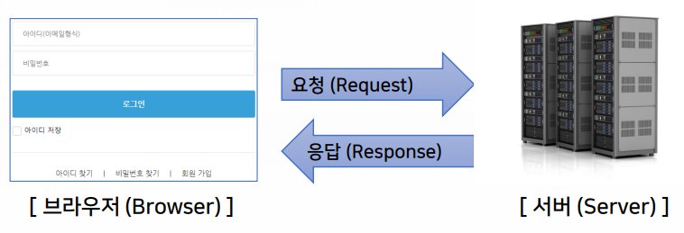
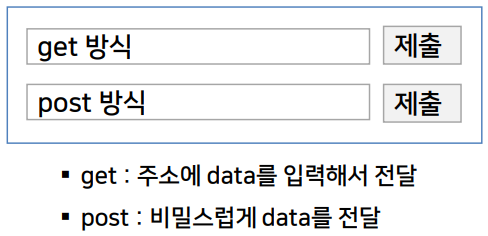

>   
> [jhta.step.or.kr](https://jhta.step.or.kr)

# 0331
# 웹 표준에 맞는 HTML5 프로그래밍

- [0331](#0331)
- [웹 표준에 맞는 HTML5 프로그래밍](#웹-표준에-맞는-html5-프로그래밍)
- [1차시 웹 프로그래밍 이해하기](#1차시-웹-프로그래밍-이해하기)
  - [1. 웹 프로그래밍의 개요](#1-웹-프로그래밍의-개요)
  - [2. 웹 프로그래밍 관련 주요 구성 요소](#2-웹-프로그래밍-관련-주요-구성-요소)
  - [3. 실습 환경 구축하기](#3-실습-환경-구축하기)
- [2차시](#2차시)
  - [1. HTML5의 기본구성](#1-html5의-기본구성)
  - [2. 텍스트와 링크 태그](#2-텍스트와-링크-태그)
  - [3. 미디어 태그](#3-미디어-태그)
- [3차시	웹 페이지 구조화하기](#3차시웹-페이지-구조화하기)
  - [1. 웹 페이지 구조화와 시맨틱 태그](#1-웹-페이지-구조화와-시맨틱-태그)
  - [2. 리스트와 표](#2-리스트와-표)
  - [3. 입력양식 (폼)](#3-입력양식-폼)
- [4차시	CSS3를 활용한 시각적 효과 꾸미기](#4차시css3를-활용한-시각적-효과-꾸미기)
  - [1. CSS3의 개요](#1-css3의-개요)
  - [2. CSS3의 표현방법](#2-css3의-표현방법)
  - [3. CSS3의 단위, 색상, 글자 속성](#3-css3의-단위-색상-글자-속성)
- [5차시	CSS3를 활용한 폼 꾸미기](#5차시css3를-활용한-폼-꾸미기)
  - [1. CSS Box모델의 개념과 관련 요소](#1-css-box모델의-개념과-관련-요소)
  - [2. CSS 아이콘과 링크](#2-css-아이콘과-링크)
- [6차시	다양한 레이아웃의 구성과 기능](#6차시다양한-레이아웃의-구성과-기능)
  - [1. 위치, 유동성, 부트스트랩](#1-위치-유동성-부트스트랩)
  - [2. 플렉스 시스템과 그리드 시스템](#2-플렉스-시스템과-그리드-시스템)
- [7차시	화면설계 확인하기](#7차시화면설계-확인하기)
  - [1. 와이어프레임](#1-와이어프레임)
  - [2. 레이아웃 구현하기](#2-레이아웃-구현하기)
- [8차시	화면설계 UI 해석하기](#8차시화면설계-ui-해석하기)
  - [1. 자바스크립트와 제이쿼리](#1-자바스크립트와-제이쿼리)
  - [2. 세로형 메뉴 구현하기](#2-세로형-메뉴-구현하기)
  - [3. 가로형 메뉴 구현하기](#3-가로형-메뉴-구현하기)

<small><i><a href='http://ecotrust-canada.github.io/markdown-toc/'>Table of contents generated with markdown-toc</a></i></small>


---
# 1차시 웹 프로그래밍 이해하기
## 1. 웹 프로그래밍의 개요
* 웹 프로그래밍
    - 하이퍼텍스트 프로토콜 (hypertext protocol)을 활용하여, 월드 와이드 웹 (WWW: World Wide Web)을 통해 정보를 공유하는 환경을 구현하는 것
* **HTML5**
    - 하이퍼텍스트 (Hyper text) : 텍스트, 이미지, 영상 같은 문서의 개체가 서로 연결되어 있는 것
    - 마크업 언어 (Markup Language) : 태그 (tag)를 이용하여 문서나 데이터의 구조를 명시하는 언어
* **javaScript**
    - 웹을 풍부하게 만들어주는 상대적으로 가벼운 프로그래밍 언어
* **CSS3**
    - 캐스캐이딩 (Cascading) : 우선 순위에 따라 적용하는 것
    - 스타일 시트 (Style Sheets) : 웹 페이지의 스타일 (디자인)을 정의 하는 것
## 2. 웹 프로그래밍 관련 주요 구성 요소
* 웹 브라우저 : 사파리, 파이어폭스, **크롬**, 엣지, 오페라 등
* 웹 편집기
- 텍스트 편집기 (Text Editor) : 노트패드++, 에디트 플러스, 울트라 에디트
- 코드 에디터 (Code Editor) : **비주얼 스튜디오 코드**, 서브라임 텍스트, 아톰, 브라켓, 드림위버 등
  - 비주얼 스튜디오 코드 확장 설치하기
    1. 한국어 확장팩(Korean Language Pack)
    2. HTML Preview
    3. Live Server
    4. Beautify
- 웹 기반 코드 편집기 (Web based Code Editor), 통합개발환경 (Integrated Development Enviroment) : 코드팬, 라이브위브, 구름 IDE 등
* 네이티브 앱, 웹 앱, 하이브리드 앱
## 3. 실습 환경 구축하기
* **크롬** 설치하고 개발자 도구 살펴보기
* **비주얼 스튜디오 코드**와 확장 설치하기
* **w3schools.com**의 Tutorial 살펴보기


---
# 2차시	
## 1. HTML5의 기본구성
* 시작과 끝이 없는 태그는 “img”, “br”, “hr”이 있고, 태그의 구조는 
속성(Attribute)과 속성값(Value)임
* HTML5 문서태그는 html, head, title, body, base, meta, link, style, 
script, h1…h6, div, span, p, br, hr 등이 있음
## 2. 텍스트와 링크 태그
* 제목과 본문 태그에는 h1…h6, p, br, hr, div, pre, 특수문자 등이 있음
* 글자 모양 태그에는 b, strong, i, em, small, sub, sup, ins, del, 
mark 등이 있음
* 하이퍼링크 태그에는 a, href, URL, 절대주소, 상대주소, 이미지에 링크
설정 등이 있음
  - a : 하이퍼링크를 의미함
  - href: 파일의 경로(주소)
  -URL : 절대주소, 상대주소

## 3. 미디어 태그
* 이미지 태그에는 img, src, alt, width, height 등이 있음
* 오디오 태그는
    ```html
    <audio controls="controls">
        <source src="audio-1.mp3" type="audio/mpeg"> 
    </audio>
    ```
  * 예시 (마크다운도 된다.)  
    <audio controls="controls">
        <source src="audio-1.mp3" type="audio/mpeg"> 
    </audio>
* 비디오 태그는
    ```html
    <video width="640" controls="controls">
        <source src="STEP.mp4" type="video/mp4">
    </video>
    ```
  * 예시 (마크다운도 된다.)  
    <video width="640" controls="controls">
    <source src="STEP.mp4" type="video/mp4">
    </video>   
* Youtube 영상 등 외부 영상을 삽입할 때에는
`<iframe> ……</iframe>`까지의 소스를 HTML 코드에 붙여 넣고, 
동영상 주소 부분을 제외하고 모두 삭제함
  * 예시 (마크다운도 된다.)   
    <iframe> ……</iframe>

    
---
# 3차시	웹 페이지 구조화하기
## 1. 웹 페이지 구조화와 시맨틱 태그
* 공간 분할 태그
  - `div` : 블록 (Block) 형식으로 공간 분할
  - `span` : 인라인 (Inline)형식으로 공간 분할
  - 공간 분할 태그 : CSS3를 활용해 레이아웃 구성할때 매우 유용함
* 시맨틱 태그
  - `Sementic` : 의미론적인, 즉, 태그에 의미를 부여한다는 뜻
* 주요 웹 사이트의 시맨틱 태그 사용 현황
  - 웹 사이트의 태그 사용 현황 확인 방법
    1. 크롬으로 주요 사이트 접속
    2. 마우스 오른쪽 버튼을 클릭해서 페이지 소스보기선택
    3. 소스 보기 창에서 찾기 (ctrl+F)를 선택
    4. 주요 태그의 개수 확인해보기
  - 
    - 디자인, 구성에 따라 각 tag의 사용 빈도가 다르다.
      - 구글 : 심플한 디자인
      - 페이스북 : 동시에 다양한 사용자 정보 호출 > header , 공간 분할이 많이 필요한 구성
      - 네이버 : 가로형 목록 (요소 나열) > span

```html
<!DOCTYPE html>
<html lang="ko">
<head>
<meta charset="UTF-8">
<title>공간 분할 태그</title>
</head>
<body>
<p>
<span>Span: inline 1</span>
<span>Span: inline 2</span>
<span>Span: inline 3</span>
</p>
<p>
<div>Div: blockline 1</div>
<div>Div: blockline 2</div>
<div>Div: blockline 3</div>
</p>
</body>
</html>
``` 
<p>
<span>Span: inline 1</span>
<span>Span: inline 2</span>
<span>Span: inline 3</span>
</p>
<p>
<div>Div: blockline 1</div>
<div>Div: blockline 2</div>
<div>Div: blockline 3</div>
</p>

## 2. 리스트와 표
* 리스트 (list) 태그
  - `<li> ol </li>` : 순서가 있는 목록
  - `<li> ul </li>` : 순서가 없는 목록
  - `<dt> dl </dt>` : 정의 목록
  - `<dd> dl </dd>` : 정의 설명

* 테이블 (table) 태그
  - `<table></table>` : 표 삽입
  - `<tr></tr>` : 행 삽입
  - `<th></th>` : 제목 삽입
  - `<td></td>` : 내용 삽입

```html
<h2>순서가 있는 목록</h2>
<ol>
<li>ol(ordered list): 순서가 있는 목록 1</li>
<li>ol(ordered list): 순서가 있는 목록 2</li>
<li>ol(ordered list): 순서가 있는 목록 3</li>
</ol>

<h2>순서가 없는 목록</h2>
<ul>
<li>ul(unordered list): 순서가 없는 목록 1</li>
<li>ul(unordered list): 순서가 없는 목록 2</li>
<li>ul(unordered list): 순서가 없는 목록 3</li>
</ul>
<dl>
<dt>dl(description list): 정의 목록</dt>
<dd>dl(description list): 정의 목록 1</dd>
<dd>dl(description list): 정의 목록 2</dd>
<dd>dl(description list): 정의 목록 3</dd>
</dl>

<h2>중첩 목록 (Nested list)</h2>
<ul>
<li>
<b>프론트 앤드 (Front end) 프로그램</b>
<ol>
<li>HTML5</li>
<li>CSS3</li>
<li>JavaScript</li>
</ol>
</li>
<li>
<b>백 앤드 (Back end) 프로그램</b>
<ol>
<li>Java</li>
<li>PHP</li>
<li>Python</li>
</ol>
</li>
</ul>

<table border="1">
<tr>
<th>태그(Tag)</th> <th>설명</th>
</tr>
<tr>
<td>table</td> <td>표 삽입</td>
</tr>
<tr>
<td>tr</td> <td>표에 행(table row) 삽입</td>
</tr>
<tr>
<td>th</td> <td>표 제목(table heading) 삽입</td>
</tr>
<tr>
<td>td</td> <td>표 내용(table data) 삽입</td>
</tr>
</table>

<table border="1">
<tr>
<th>태그(Tag)</th>
<th>속성 (Attribute)</th>
<th>설명</th>
</tr>
<tr>
<td>table</td> <td>boder</td> <td>표 삽입</td>
</tr>
<tr>
<td rowspan="2">th, td</td>
<td>colspan</td>
<td>셀의 너비 지정</td>
</tr>
<tr>
<td>rowspan</td>
<td>셀의 높이 지정</td>
</tr>
</table>
```

## 3. 입력양식 (폼)
* 입력 양식 유형

* 입력 양식 작동 원리
  * 
    ```html
    <form action="https://www.google.com/" method="get/post">
    <input type="text" name="search"
        placeholder="get/post 방식">
    <input type="submit">
    </input>
    </form>
    ```
  * 
* 다양한 양식 (form)태그
    ```html
    form>
    <p>text: 
    <input type="text" placeholder="이곳에 텍스트를 입력하세요!" />
    </p>
    <p>button: <input type="button" value="이곳을 클릭!" /></p>
    <p>
    checkbox:
    <label><input type="checkbox" />front-end</label>
    <label><input type="checkbox" />back-end</label>
    </p>
    <p>file: <input type="file" /></p>
    <p>password: <input type="password" /></p>
    <p>
    radio:
    <label><input type="radio" name="sex" value="male" />남</label>
    <label><input type="radio" name="sex" value="female" />여</label>
    <button type="submit">Submit</button>
    </p>
    <p>reset: <input type="reset" /></p>
    <p>color: <input type="color" /></p>
    <p>datetime-local: <input type="datetime-local" /></p>
    <p>email: <input type="email" /></p>
    <p>range: <input type="range" /></p>
    <p>time: <input type="time" /></p>
    <p>url: <input type="url" placeholder="https://example.com" /></p>
    <p>select:
    <select>
    <option>김밥</option><option>떡볶이</option>
    <option>순대</option><option>오뎅</option>
    </select>
    </p>
    </form>
    ```
    * 
* MDN과 Codepen을 활용한 태그 연습
  - MDN : https://developer.mozilla.org/en-US/
  - Codepen : https://codepen.io/


---
# 4차시	CSS3를 활용한 시각적 효과 꾸미기
## 1. CSS3의 개요
* CSS3의 개념 및 형식
  * HTML: 문서의 내용
  * css : 문서의 스타일
 

* CSS3의 적용 예
  * 
* 선택자의 종류
  * .class
  * #id
  * *
  * element
  * element, element, ..
  


## 2. CSS3의 표현방법
* 외부 스타일 시트
```html
<!DOCTYPE html>
<html>
  <head>
    <link rel="stylesheet" type="text/css" href="mystyle.css" />
</head>
    <h1>This is a heading</h1>
    <p>This is a paragraph.</p>
  <body>
</html>
```
```css  
"mystyle.css"    
body {
  background-color:
h1 {
  color: navy;
  margin-left: 20px;
}
```

* 내부 스타일 시트
```html
<!DOCTYPE html>
<html>
<head>
<style>
body {
background-color: linen;
}

h1 {
color: maroon;
margin-left: 40px;
}
</style>
</head>
<body>
    <h1>This is a heading </h1>
    <p>This is a paragraph.</p>
</body>
</html>
```

* 인라인 스타일 시트
```html
<!DOCTYPE html>
<html>
<body>
<h1 style="color: blue; text-align: center;"> This is a heading</h1>
<p style="color: red;">This is a paragraph.</p>
</body>
</html>
```


## 3. CSS3의 단위, 색상, 글자 속성
* CSS3의 단위
  * 고정 크기 단위(cm, mm, in, px, pt, pc)
  * 가변 크기 단위(em, ex, ch, rem, vw, vh, vmin, vmax, %)
* CSS3의 색상
  * CSS 색상의 종류(Background Color, Text Color, Border Color)
* CSS Text
  * Color, Alignment, Decoration, Transformation, Spacing
* CSS Font
  * font-family
  * font-style
  * font-weight
  * font-size

> [css gen garden](http://www.csszengarden.com/)
> [w3schools css selector](https://www.w3schools.com/css/css_selectors.asp)


---
# 5차시	CSS3를 활용한 폼 꾸미기
## 1. CSS Box모델의 개념과 관련 요소
* CSS BOX모델 : HTML의 요소는 박스 모양으로 구성되며마진(Margin), 보더(Border), 패딩(Padding), 콘텐츠(Content)로 구분
* CSS Padding, Borders, Margins Properties (속성)
  - Padding : 콘텐츠(Content)와 보더(Border)와의 간격
  - Border : 전체 요소의 테두리
  - Margin : 보더(Border)로부터 실제 콘텐츠(Content)가 표시될 수 있는 간격
  - 
* CSS Outline : 요소를 두드러지게 보이게 하는 선을 지정
  - Outline의 종류 : dotted, dashed, solid, double, groove, ridge, 
inset, outset
  - 색상의 지정도 가능
* CSS Display
  - block : 박스형태(div, h1~h6, p, form, header, footer, section)
  - inline : 한 라인에 보여 줄 수 있는 형태(span, a, img)
  - display : 화면에 콘텐츠가 표현되는 방식(none, block, inline, inline-block)
  - visibility : 화면에콘텐츠가 표현되는 방식(visible, hidden, collapse)

## 2. CSS 아이콘과 링크
* CSS Icons(아이콘)
  - Font awesome : script에 fontawsome JavaScript 불러온 후 아이콘의 이름을 명시하여 적용
    - 
    - 
  - Bootstrap : `<head>`안에 Bootstrap사이트 링크 삽입 후 아이콘의 이름을 명시하여 적용
    - 
    - 
  - google : `<head>`안에 google의 아이콘 사이트링크 삽입 후 아이콘의 이름을 명시하여 적용
    - 
    - 
* CSS Link(링크)
  - default : 파란색과밑줄
  - CSS로 스타일변경 가능

3. CSS 리스트, 주석, 이미지 갤러리
* Lists item Markers(표시자)
  - 다양한 표시자의 예 : circle, square, upper-roman, lower-alpha, url로 직접 이미지 삽입 가능
  ```html
  <style>
      ul {list-style-image: url('sqpurple.gif')}
  </style>
  ```
* CSS Commentes (주석) : 코드의 혼동 방지, 편리한 유지 보수, 실제 코드에 영향을 주지 않음
  - CSS : //(한 줄), /* */(여러 줄)
- HTML : `<!-- -->`
  - JavaScript : //(한 줄), /* */(여러 줄)
* Image Gallery
  - CSS로 이미지갤러리를 선언하면 각 이미지를 클릭했을 때 특정 이미지를 확대해서 나타나게 하는 것이 특징


---
# 6차시	다양한 레이아웃의 구성과 기능
## 1. 위치, 유동성, 부트스트랩
* CSS position 속성 : 요소의 위치 결정 유형 지정
* CSS float 속성 : 다른 요소가 왼쪽 또는 오른쪽으로 배치되도록 함. 주로 이미지에 사용됨.
* Bootstrap : 반응형 웹의 모바일 우선 프론트 엔드 웹 개발을 위한 무료 오픈 소스 CSS 프레임 워크
## 2. 플렉스 시스템과 그리드 시스템
* 플렉스 (flex) 시스템의 개념
  - 개념 : Flexbox (Flexible Box) 모듈로도 불림, Flexbox 인터페이스 내의 아이템 간 공간 배분과 강력한 정렬 기능을 제공하기 위한 1차원 레이아웃 모델
* 그리드 (grid) 시스템의 개념
  - 개념 : 한번의 선언으로 명시적 속성들과 암시적 속성들을 빠르게 설정하는 방법
  - 명시적 속성 : grid-template-rows, grid-template-columns, and grid-template-areas
  - 암시적 속성 : grid-auto-rows, grid-auto-columns, and grid-auto-flow
  -  
  - 
    ```css
    .container {
      grid-template-areas:
         "header header header"
         " a main b "
         " . . . "
         "footer footer footer";
    }
    ```
* 반응형 웹 디자인 (Responsive Web Design)의 개념과 특징
  - 개념 : 다양한 기기 (데스크탑, 노트북, 태블릿, 스마트폰 등)의 화면 크기에 상관없이 자연스럽게 보이도록 디자인 하는 것
  - 참고사이트 :
    - https://github.com
    - https://www.magicleap.com/en-us
    - 뷰 포트 : 웹 페이지의 가시 영역
      - 
  - 특징 : 모든 장치 (Device)에서 웹 페이지를 보기 좋게하고 HTML과 CSS만으로 구현 가능함(프로그램도 자바스크립트도 아님)
  - 
* 미디어 쿼리 (media queries)의 개념과 특징
  - 개념 : @media을 사용하여 미디어 별로 style을 지정하는 것
  - 
  - 


---
# 7차시	화면설계 확인하기
## 1. 와이어프레임
* 와이어프레임(wireframe)의 개념
  - 웹사이트의 회로도 (schematic) 또는 청사진 (blueprint)라고도 불리우며, 웹사이트의 골격을 나타내는 시각적 가이드
  - 
* 와이어프레임(wireframe)의 구성요소
  - Wrap : 전체 박스
  - Header : 헤더
  - Slide : 이미지 슬라이드
  - Contents : 콘텐츠
  - Footer : 푸터
  - Tab Menu : 탭메뉴
  - Pop-up : 팝업창


* 와이어프레임(wireframe) 의 종류
  - 가로형과 세로형이 있음

## 2. 레이아웃 구현하기
* HTML 기본구성 입력과 CSS Reset하기
  - 웹에디터의 Emmet 기능을 활용하여 html 기본 구성을 완성함
```html
<!DOCTYPE html>
<html lang="ko">
    <head>
        <meta charset="utf-8" />
        <title>Layout</title>
        <link rel="stylesheet" href="css/style.css" type="text/css"
/>
    </head>
    <body></body>
</html>
```
  - HTML 태그에 대한 기본 CSS요소를 초기화 : `.clearfix::after { .. }` -> float으로 인한 버그 해결
* HTML 기본 레이아웃 구현하기
  - header, slide, Main Contents, footer에 대한 HTML 영역을 구현
```html
body>
<div class="wrap">
<header>header 영역
<h1>
<a href="#"> </a>
</h1>
</header>
<div class="slide">slide 영역</div>
<div class="contents"> Main Contents 영역 </div>
<footer>footer 영역</footer>
</div>
</body>
```

* CSS로 스타일 구현하기
  - header, slide, Main Contents, footer에 대한 CSS 스타일을 구현
```css
.wrap {
width: 1200px;
margin: 0 auto;
background: #111
}
header {
width: 100%; height: 100px;
}
.slide {
width: 100%; height: 300px;
background: #222;
}
.contents {
width: 100%; height: 200px;
background: #333;
}
footer {
width: 100%; height: 100px;
background: #444;
}
```

* Header 영역 구조 꾸미기
  - ul, li, a에 대한 HTML 영역 구조를 제작함
```html
<header class="clearfix">
header 영역
<h1>
<a href="#">
</a>
</h1>
<nav>
<ul class="gnb">
<li>
<a href="#">MENU-1</a>
<ul class="sub">
<li><a href="#">SubMenu-1</a></li>
<li><a href="#">SubMenu-2</a></li>
<li><a href="#">SubMenu-3</a></li>
<li><a href="#">SubMenu-4</a></li>
</ul>
</li>
<li>
<a href="#">MENU-2</a>
<ul class="sub">
<li><a href="#">SubMenu-1</a></li>
<li><a href="#">SubMenu-2</a></li>
<li><a href="#">SubMenu-3</a></li>
<li><a href="#">SubMenu-4</a></li>
</ul>
```

* 메뉴 영역 꾸미기
  - ul, li, a에 대한 CSS 스타일을 제작함
```css
wrap {
   width: 1200px; margin: 0 auto;
}
header {
   width: 100%;
   height: 100px;
   background: #fff;
}
header h1 {
   float: left;
   width: 100px;
   padding-top: 30px;
}
header nav {
   float: right;
   width: 700px;
   padding-top: 30px;
} 
header nav ul.gnb {
   width: 100%;
   text-align: center;
   font-size: 18px;
}
header nav ul.gnb > li {
   width: 25%; float: left;
}
header nav ul.gnb > li > a {
   font-size: 22px;
}
```
* wrap : 전체 컨텐츠를 감싸는 영역
* header h1 : 제목에 대한 스타일
* clearfix : CSS 초기화

```css
header nav ul.gnb > li > ul.sub > li {
width: 100%;
height: 40px;
}
header nav ul.gnb > li > ul.sub > li > a {
display: block;
width: 100%;
height: 100%;
}
header nav ul.gnb > li > ul.sub > li:hover {
background: #000080;
color: #fff;
}
```
* 마우스가 컨텐츠 위로 올라갔을 때 효과를 주는 스타일


---
# 8차시	화면설계 UI 해석하기
## 1. 자바스크립트와 제이쿼리
* 자바스크립트 (JavaScript)의 개념
  * html : 웹문서의 기본 골격
    ```html
    <!DOCTYPE html>
    <html>
    <head>
    <meta name="viewport" content="width=device-width, initial-scale=1">
    </head>
    <body>
    <p>Click the "CLICK ME" button:</p>
    <button onclick="myFunction()">CLICK ME</button>
    <div id="myDIV">
    This is example for you!
    </div>
    </body>
    </html>
    ```
    * button 태그로 CLICK ME 버튼 생성
    * onclick =“myFunction()” 함수를 지정
  * css : 모양-디자인 (스타일)
    ```css
    <style>
    .mystyle {
    width: 100%;
    padding: 25px;
    background-color: #33CC33;
    color: white;
    font-size: 25px;
    box-sizing: border-box;
    }
    </style>
    ```
    * 버튼을 눌렀을 때 나타나는 결과에대한 CSS
  * JavaScript : 웹 문서에 움직임(액션) 제공
    ```html
    <script>
    function myFunction() {
    var element = document.getElementById("myDIV");
    element.classList.toggle("mystyle");
    }
    </script>
    ```
    * 선언된 onclick=“myFunction()” 함수를 사용자가 디자인
    * 버튼을 사용자가 클릭하면 이벤트가 발생한다.
  * JQuery : HTML의 클라이언트 사이드 조작을 단순화 하도록 설계된 크로스 플랫폼의 자바스크립트 라이브러리
    * 자바스크립트 라이브러리로서 자바스크립트 프로그래밍을 단순화
    * 학습하기 쉬움
    * 웹프로그래밍 시간을 단축
    * 제이쿼리 (JQuery) 버전
      * 3.x.x 버전
        - 가장 최신 버전 (2020년 7월 현재) v3.5.1, Ajax를 지원
      * 2.x.x 버전
        - IE 6~8 버전을 지원하지 않음
        - 1.x.x 버전이 간소화 되어 용량이 작음
      * 1.x.x 버전
        - 구형 브라우저에 가장 안정적임
        - 공공기관 사이트를 작업한다면, 이 버전 사용을 권장
        - 1.x.x 버전 중 가장 안정적인 버전은 JQuery-1.12.4
      - 제이쿼리 (JQuery) 사용법
        * Local 파일 사용
            ```html
            <head>
            <script src="jQuery-1.12.4.js"></script>
            </head>
            ```
        * CDN (Content Delivery Network) 사용
            ```html
            <head>
            <script
            src="https://ajax.googleapis.com/ajax/libs/jQuery/3.5.1/jQuery.min.js">
            </script>
            </head>
            ```

## 2. 세로형 메뉴 구현하기
* 와이어프레임에 제시된 지시사항확인하기
  - 세로형 메뉴 구현하기를 위한 와이어프레임 확인하기 : 위에서 아래로 내려오는 메뉴 구성
  - 
* HTML 기본 구성 입력하기
  * nav 태그 이용
  - ul, li 태그를 이용해서각 메뉴 구성
  - 각 메뉴에 ul, li,를 이용해서 서브 메뉴 구성
    ```html
    <nav class="menu">
    <ul class="nav">
    <li>
    <a href="#">MENU1</a>
    <ul class="submenu">
    <li><a href="#">SubMenu1</a></li>
    <li><a href="#">SubMenu2</a></li>
    <li><a href="#">SubMenu3</a></li>
    <li><a href="#">SubMenu4</a></li>
    </ul>
    </li>
    <li>
    <a href="#">MENU2</a>
    <ul class="submenu">
    <li><a href="#">SubMenu1</a></li>
    <li><a href="#">SubMenu2</a></li>
    <li><a href="#">SubMenu3</a></li>
    <li><a href="#">SubMenu4</a></li>
    </ul>
    </li>
    <li>
    <a href="#">MENU3</a>
    <ul class="submenu">
    <li><a href="#">SubMenu1</a></li>
    <li><a href="#">SubMenu2</a></li>
    <li><a href="#">SubMenu3</a></li>
    <li><a href="#">SubMenu4</a></li>
    </ul>
    </li>
    <li>
    <a href="#">MENU4</a>
    <ul class="submenu">
    <li><a href="#">SubMenu1</a></li>
    <li><a href="#">SubMenu2</a></li>
    <li><a href="#">SubMenu3</a></li>
    <li><a href="#">SubMenu4</a></li>
    </ul>
    </li>
    </ul>
    </nav>
    ```
  - nav 태그 이용
  - ul, li 태그를 이용해서각 메뉴 구성
  - 각 메뉴에 ul, li,를 이용해서 서브 메뉴 구성
* CSS 작업하기
  * nav 전체 스타일링하기
  - 각 메뉴 스타일링, 마우스 오버 효과주기
  - 서브 메뉴 스타일링, 마우스 오버 효과주기
    ```css
    menu {
    width: 180px;
    top: 100px;
    text-align: center;
    }
    .nav > li {
    float: left;
    width: 180px;
    }
    .nav > li > a {
    height: 40px;
    width: 180px;
    line-height: 40px;
    font-size: 16px;
    font-weight: bold;
    background-color: #222328;
    color: #ffffff;
    }
    .nav > li > a:hover {
    background-color: #930930;
    color: #ffff00;
    }
    submenu {
    float: left;
    width: 100%;
    display: none;
    }
    .submenu > li > a {
    height: 40px;
    width: 180px;
    line-height: 40px;
    font-size: 14px;
    font-weight: bold;
    background-color: #cccccc;
    color: #ffffff;
    }
    .submenu > li > a:hover {
    background-color: #999999;
    color: #ffff00;
    }
    ```
    * 네비게이션의 텍스트 스타일 지정
    * 네비게이션의 각 메뉴에 마우스를 올렸을때 나타나는효과
    * 서브메뉴의 텍스트 스타일 지정
    * 서브메뉴의 각 목록에 마우스를 올렸을 때 나타나는 효과

* 자바스크립트 작업하기
- HTML 문서에 스크립트추가
    ```HTML
    <head>
    <meta charset="utf-8" />
    <title>STEP</title>
    <link href="css/style.css" type="text/css" rel="stylesheet" />
    <script src="script/jQuery-1.12.4.js"></script>
    <script src="script/script.js" defer
    type="text/javascript"></script>
    </head>
    ```
    * 마우스를 올렸을때 하이라이트가 되게하는 작업
    * CDN방식이 아닌 로컬 파일에 저장하여 사용

- 메뉴에 지정된 함수에 사용자 지정 효과주기
  * 자바스크립트 문서에 메뉴 관련 내용 구현하기
    ```JS
    // JavaScript Document
    jQuery(document).ready (function () {
      $('.nav>li')
        .mouseover (function () {
          $(this).find('.submenu').stop().slideDown (500);
        })
        .mouseout (function () {
          $ (this).find('.submenu').stop().slideUp (500);
        });
    });
    ```
    * nav의 하위로지정된 li 태그 모두에 적용
    * mouseover : 마우스가 지정된 컨텐츠 위에 올라갔을 때 효과
    * mouseout : 마우스가 지정된 컨텐츠에서 벗어났을 때 효과


  - HTML 문서에 스크립트추가
  - 메뉴에 지정된 함수에 사용자 지정 효과주기

## 3. 가로형 메뉴 구현하기
* 와이어프레임에 제시된 지시사항확인하기

  - 가로형 메뉴 구현하기를 위한 와이어프레임 확인하기 : 좌에서 우로 펼쳐지는 메뉴 구성
* HTML 기본 구성 입력하기
    ```HTML
    <nav class="menu">
    <ul class="nav">
    <li>
    <a href="#">MENU1</a>
    <ul class="submenu">
    <li><a href="#">SubMenu1</a></li>
    <li><a href="#">SubMenu2</a></li>
    <li><a href="#">SubMenu3</a></li>
    <li><a href="#">SubMenu4</a></li>
    </ul>
    </li>
    <li>
    <a href="#">MENU2</a>
    <ul class="submenu">
    <li><a href="#">SubMenu1</a></li>
    <li><a href="#">SubMenu2</a></li>
    <li><a href="#">SubMenu3</a></li>
    <li><a href="#">SubMenu4</a></li>
    </ul>
    </li>
    <li>
    <a href="#">MENU3</a>
    <ul class="submenu">
    <li><a href="#">SubMenu1</a></li>
    <li><a href="#">SubMenu2</a></li>
    <li><a href="#">SubMenu3</a></li>
    <li><a href="#">SubMenu4</a></li>
    </ul>
    </li>
    <li>
    <a href="#">MENU4</a>
    <ul class="submenu">
    <li><a href="#">SubMenu1</a></li>
    <li><a href="#">SubMenu2</a></li>
    <li><a href="#">SubMenu3</a></li>
    <li><a href="#">SubMenu4</a></li>
    </ul>
    </li>
    </ul>
    </nav>
    ```
  - nav 태그 이용
  - ul, li 태그를 이용해서각 메뉴 구성
  - 각 메뉴에 ul, li,를 이용해서 서브 메뉴 구성
* CSS 작업하기
  - nav 전체 스타일링하기
  - 각 메뉴 스타일링, 마우스 오버 효과주기
  - 서브 메뉴 스타일링, 마우스 오버 효과주기
    ```CSS
    .menu {
    float: right;
    height: 100x;
    width: 800px;
    z-index: 1;
    }
    .nav {
    float: right;
    margin-top: 30px;
    margin-right: 10px;
    }
    .nav > li {
    float: left;
    }
    .nav > li > a {
    height: 40x;
    width: 180px;
    line-height: 40px;
    font-size: 16px;
    font-weight: bold;
    text-align: center;
    background-color: #0066ad;
    color: #ffffff;
    }
    .nav > li > a:hover {
    background-color: #30a3f3;
    }
    .submenu {
    width: 180px;
    position: absolute;
    display: none;
    z-index: 1;
    }
    .submenu > li > a {
    height: 35px;
    line-height: 35px;
    font-size: 14px;
    font-weight: bold;
    text-align: center;
    background-color: #ababab;
    color: #ffffff;
    }
    .submenu > li > a:hover {
    background-color: #30a3f3;
    }
    ```
    * 네비게이션의 하위 li 태그에 대한 효과
    * 마우스를 메뉴에 올렸을 때 나타나는 효과
    * 메뉴의 서브메뉴에 마우스를 올렸을때 나타나는효과

* 자바스크립트 작업하기
  - HTML 문서에 스크립트추가
    ```html
    <head>
    <meta charset="utf-8" />
    <title>STEP</title>
    <link href="css/style.css" type="text/css" rel="stylesheet" />
    <script src="script/jQuery-1.12.4.js"></script>
    <script src="script/script.js" defer
    type="text/javascript"></script>
    </head>
    ```
  - 메뉴에 지정된 함수에 사용자 지정 효과주기
    ```js
    // JavaScript Document
    jQuery(document).ready (function () {
        $('.nav>li')
            .mouseover(function () {
                $(this).find ('.submenu').stop().slideDown(500);
            })
            .mouseout(function () {
                $ (this).find('.submenu').stop().slideUp(500);
            });
    });
    ```
    * nav의 하위로지정된 li 태그 모두에 적용
    * mouseover : 마우스가 지정된 컨텐츠 위에 올라갔을 때 효과
    * mouseout : 마우스가 지정된 컨텐츠에서 벗어났을 때 효과