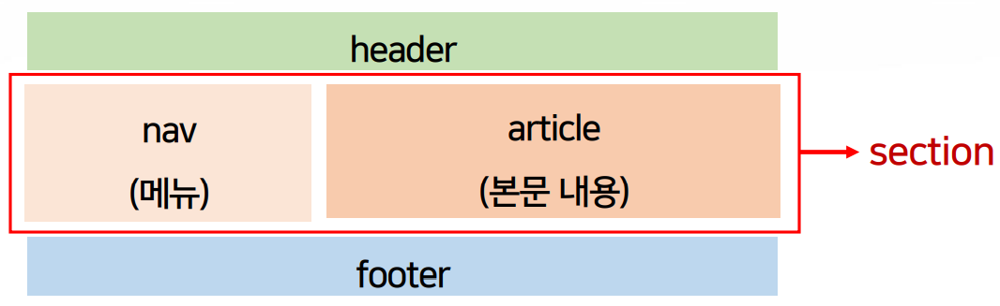

>   
> [jhta.step.or.kr](https://jhta.step.or.kr)

# 0401
# 웹 표준에 맞는 HTML5 프로그래밍

- [0401](#0401)
- [웹 표준에 맞는 HTML5 프로그래밍](#웹-표준에-맞는-html5-프로그래밍)
- [9차시	UI 설계 확인하기](#9차시ui-설계-확인하기)
  - [1. 이미지 슬라이드(좌우)](#1-이미지-슬라이드좌우)
  - [2. 이미지 슬라이드(상하)](#2-이미지-슬라이드상하)
  - [3. 페이드 인-아웃 구현하기](#3-페이드-인-아웃-구현하기)
- [10차시 UI를 통해 화면 구현하기](#10차시-ui를-통해-화면-구현하기)
  - [1. CSS 레이어 팝업](#1-css-레이어-팝업)
  - [2. JQuery 모달 팝업](#2-jquery-모달-팝업)
  - [3. Bootstrap 모달 팝업](#3-bootstrap-모달-팝업)
  - [4. w3.css 이미지 팝업](#4-w3css-이미지-팝업)
- [11차시 탭 메뉴를 통한 흐름 제어 구현하기](#11차시-탭-메뉴를-통한-흐름-제어-구현하기)
  - [1. CSS/W3.CSS를 활용한 탭 메뉴](#1-cssw3css를-활용한-탭-메뉴)
  - [2. JavaScript를 활용한 탭 메뉴](#2-javascript를-활용한-탭-메뉴)
  - [3. JQuery를 활용한 탭 메뉴](#3-jquery를-활용한-탭-메뉴)
  - [4. BootStrap을 활용한 탭 메뉴](#4-bootstrap을-활용한-탭-메뉴)
- [12차시 반응형 웹(RWD)화면 구현하기](#12차시-반응형-웹rwd화면-구현하기)
  - [1. Float 활용 화면 구현](#1-float-활용-화면-구현)
  - [2. W3.CSS 활용 화면 구현](#2-w3css-활용-화면-구현)
  - [3. Grid 활용 화면 구현](#3-grid-활용-화면-구현)
  - [4. Media query 활용 화면 구현](#4-media-query-활용-화면-구현)
- [13차시 요구사항에 맞추어 사이트 디자인하기](#13차시-요구사항에-맞추어-사이트-디자인하기)
  - [1. 요구사항 살펴보기](#1-요구사항-살펴보기)
  - [2. HTML로 구조 꾸미기](#2-html로-구조-꾸미기)
  - [3. CSS로 모양 디자인하기](#3-css로-모양-디자인하기)
  - [4. JavaScript로 기능 더하기](#4-javascript로-기능-더하기)
- [14차시 포트폴리오 웹 프로그래밍](#14차시-포트폴리오-웹-프로그래밍)
  - [1. 포트폴리오 사이트의 명세화](#1-포트폴리오-사이트의-명세화)
  - [2. HTML로 구조 꾸미기](#2-html로-구조-꾸미기-1)
  - [3. CSS로 모양 디자인하기](#3-css로-모양-디자인하기-1)
  - [4. JavaScript로 기능 더하기](#4-javascript로-기능-더하기-1)
  - [과제](#과제)
  - [제출답안](#제출답안)
- [화면 설계(응용SW개발)](#화면-설계응용sw개발)
- [1차시 화면 설계 개요](#1차시-화면-설계-개요)
    - [응용 SW 엔지니어](#응용-sw-엔지니어)
  - [사용자 인터페이스](#사용자-인터페이스)
    - [사용자 인터페이스 제공](#사용자-인터페이스-제공)
    - [사용자 인터페이스의 분류](#사용자-인터페이스의-분류)
    - [예) 쇼핑몰의 업무 흐름](#예-쇼핑몰의-업무-흐름)
    - [사용자 측면에서 인터페이스 고려 사항 예시](#사용자-측면에서-인터페이스-고려-사항-예시)
  - [화면 설계 원칙](#화면-설계-원칙)
  - [접근성](#접근성)
  - [사용자 경험(UX)](#사용자-경험ux)
    - [긍정적/부정적 UX](#긍정적부정적-ux)
    - [사용자 경험 디자인](#사용자-경험-디자인)
      - [디자인 방법론](#디자인-방법론)
  - [화면 설계 과정](#화면-설계-과정)
    - [UI 요구사항](#ui-요구사항)
    - [정보시스템 구축](#정보시스템-구축)
    - [UI 요구사항 확인하기](#ui-요구사항-확인하기)
    - [UI 프로토타입](#ui-프로토타입)
    - [와이어프레임](#와이어프레임)
    - [스토리보드](#스토리보드)
    - [화면 설계서](#화면-설계서)
    - [UI 흐름 설계](#ui-흐름-설계)
    - [UI 상세 설계](#ui-상세-설계)
- [2차시 관련 업무 분석](#2차시-관련-업무-분석)
  - [UI 업무 분석 개선작업](#ui-업무-분석-개선작업)
    - [인터뷰 조사](#인터뷰-조사)
    - [역공학 분석](#역공학-분석)
    - [UI 관련 업무개선(PI)](#ui-관련-업무개선pi)
  - [UI 참고 모델 분석](#ui-참고-모델-분석)
    - [서비스 참조 모델](#서비스-참조-모델)
    - [UI 업무 모델 분석 사례](#ui-업무-모델-분석-사례)

<small><i><a href='http://ecotrust-canada.github.io/markdown-toc/'>Table of contents generated with markdown-toc</a></i></small>


---
# 9차시	UI 설계 확인하기
## 1. 이미지 슬라이드(좌우)
* CSS로 구현하기
  * `@keyframes`를 이용함
  * margin-left로 좌측 좌표를 선언하여 좌우 슬라이드를 구현할 수 있음
```html
<html lang="ko">
<head>
<meta charset="UTF-8" />
<title>Automatical Slide In Horizontly</title>
<link rel="stylesheet" href="css/style.css" />
</head>
<body>
<div class="wrap">
<div class="slide">
<ul>
<li></li>
<li></li>
<li></li>
<li></li>
</ul>
</div>
</div>
</body>
</html>
```
```css
*
{
margin: 
0 auto;
padding: 
0
;
}
ul
,
li
{
list
-style: none;
}
.wrap
{
width: 503px
;
display: block;
margin
-left: auto;
margin
-right: auto;
}
.slide
{
height: 300px
;
overflow: hidden;
}
.slide ul
{
width: calc(100% * 
4);
display: flex; -webkit-animation: slide 8s infinite;
animation: slide 8s infinite;
}
.slide li
{
width: calc(100% / 
4);
height: 300px
;
text
-align: center;
}
```
```css
@keyframes slide {
0% { margin-left: 0; }
10% { margin-left: 0; }
25% { margin-left: -100%; }
35% { margin-left: -100%; }
50% { margin-left: -200%; }
60% { margin-left: -200%; }
75% { margin-left: -300%; }
85% { margin-left: -300%; }
100% { margin-left: 0; }
}

@keyframes animationname {keyframes-selector {css-styles;}}
animation: name duration timing-function delay iteration-count 
direction fill-mode play-state;
```
* JavaScript로 구현하기
  * 지정시간마다 반복되는 setInterval()함수를 활용함
  * animate메소드를 통해 지정시간마다 요소의 left속성ㅇ르 할당하여 구현할 수 있음

```js
<!DOCTYPE html>
<html lang="ko">
<head>
<meta charset="UTF-8" />
<title>Automatic Slide Show1</title>
<link rel="stylesheet" href="css/style.css" />
<script
src="https://ajax.googleapis.com/ajax/libs/jquery/3.2.1/jquery.
min.js"></script>
<script src="script/script.js"></script>
</head>
<body>
<div class="contents">
<h3>Automatic Slide Show1</h3>
<div class="banner">
<ul>
<li></li>
<li></li>
<li></li>
<li></li>
<li></li>
</ul>
</div>
</div>
</body>
</html>
```
```css
body {
font-size: 11pt;
padding: 0;
margin: 0;
text-align: center;
}
h3 {
color: #85144b;
font-size: 14pt;
margin: 2 auto;
padding: 2px;
}
.contents {
width: 400px;
height: 280px;
background-color: #d6d6d6;
margin: 0 auto;
}
.banner {
position: relative;
width: 340px;
height: 210px;
top: 1px;
margin: 0 auto;
padding: 0;
overflow: hidden;
}
.banner ul {
position: absolute;
margin: 0px;
padding: 0;
list-style: none;
}
.banner ul li {
float: left;
width: 340px;
height: 210px;
margin: 0;
padding: 0;
}
```
```js
$(document).ready(function () {
var $banner = $(".banner").find("ul");
var $bannerWidth = $banner.children().outerWidth(); 
var $bannerHeight = $banner.children().outerHeight(); 
var $bannerLength = $banner.children().length; 
var rollingId;
rollingId = setInterval(function () { rollingStart(); }, 
2000); 
function rollingStart() {
$banner.css("width", $bannerWidth * $bannerLength + "px");
$banner.animate({
left: -$bannerWidth + "px" }, 2500, function () {
$(this).append("<li>" + $(this).find("li:first").html() 
+ "</li>");
$(this).find("li:first").remove();
$(this).css("left", 0);
});
}
});
```

## 2. 이미지 슬라이드(상하)
* CSS로 구현하기
  * `@keyframes를 이용함`
  * margin-top로 상단 좌표를 선언하여 상하 슬라이드를 구현할 수 있음
```html
<!DOCTYPE html>
<html lang="ko">
<head>
<meta charset="UTF-8" />
<title>Automatical Slide In Vertically</title>
<link rel="stylesheet" href="css/style.css" />
</head>
<body>
<div class="wrap">
<div class="slide">
<ul>
<li></li>
<li></li>
<li></li>
<li></li>
</ul>
</div>
</div>
</body>
</html>
```
```css
*
{
margin: 
0 auto;
padding: 
0
;
}
ul
,
li
{
list
-style: none;
}
.wrap
{
width: 503px
;
display: block;
margin
-left: auto;
margin
-right: auto;
}
.slide
{
height: 300px
;
overflow: hidden;
}
.slide ul
{
height: calc(100% * 
4);
-webkit
-animation: slide 8s infinite;
animation: slide 8s infinite;
}
.slide li
{
height: calc(100% / 
4);
}

@keyframes slide {
0% { margin-top: 0; }
10% { margin-top: 0; }
25% { margin-top: -300px; }
35% { margin-top: -300px; }
50% { margin-top: -600px; }
60% { margin-top: -600px; }
75% { margin-top: -900px; }
85% { margin-top: -900px; }
100% { margin-top: 0; }
}
```

* JavaScript로 구현하기
  * 지정 시간마다 반복되는 setInterval()함수를 활용함
  * animate 메소드를 통해 지정 시간마다 요소의 top속성을 할당하여 구현할 수 있음

```html
<!DOCTYPE html>
<html lang="ko">
<head>
<meta charset="UTF-8" />
<title>Automatic Slide Show2</title>
<link rel="stylesheet" href="css/style.css" />
<script
src="https://ajax.googleapis.com/ajax/libs/jquery/3.2.1/jquery.
min.js"></script>
<script src="script/script.js"></script>
</head>
<body>
<div class="contents">
<h3>Automatic Slide Show2</h3>
<div class="banner">
<ul>
<li></li>
<li></li>
<li></li>
<li></li>
<li></li>
</ul>
</div>
</div>
</body>
</html>
```
```css
body {
font-size: 11pt;
padding: 0;
margin: 0;
text-align: center;
}
h3 {
color: #85144b;
font-size: 14pt;
margin: 2 auto;
padding: 2px;
}
.contents {
width: 400px;
height: 280px;
background-color: #d6d6d6;
margin: 0 auto;
}
.banner {
position: relative;
width: 340px;
height: 210px;
top: 1px;
margin: 0 auto;
padding: 0;
overflow: hidden;
}
.banner ul {
position: absolute;
margin: 0px;
padding: 0;
list-style: none;
}
.banner ul li {
width: 340px;
height: 210px;
margin: 0;
padding: 0;
}
```
```js
$(document).ready(function () {
var $banner = $(".banner").find("ul");
var $bannerWidth = $banner.children().outerWidth(); 
var $bannerHeight = $banner.children().outerHeight(); 
var $bannerLength = $banner.children().length; 
var rollingId;
rollingId = setInterval(function () { rollingStart(); }, 
2000); 
function rollingStart() {
$banner.css("height", $bannerHeight + "px");
$banner.animate({
top: -$bannerHeight + "px" }, 1500, function () {
$(this).append("<li>" + $(this).find("li:first").html() 
+ "</li>");
$(this).find("li:first").remove();
$(this).css("top", 0);
});
}
}); 
```

## 3. 페이드 인-아웃 구현하기
* CSS로 구현하기
  * `keyframes`를 이용함
  * opacity로 투명도를 선언하여 페이드 인-아웃을 구현할 수 있음

```html
<!DOCTYPE html>
<html lang="ko">
<head>
<meta charset="UTF-8" />
<title>Fade-In & Fade-Out Automatically</title>
<link rel="stylesheet" href="css/style.css" />
</head>
<body>
<div class="wrap">
<div class="slide">
<ul>
<li></li>
<li></li>
<li></li>
<li></li>
</ul>
</div>
</div>
</body>
</html>
```
```css
*
{
margin: 
0 auto;
padding: 
0
;
}
ul
,
li
{
list
-style: none;
}
.wrap
{
width: 503px
;
display: block;
margin
-left: auto;
margin
-right: auto;
}
.slide
{
height: 300px
;
overflow: hidden;
}
.slide ul
{
position: relative;
height: 100%;
}
.slide li {
position: absolute;
left: 0;
right: 0;
top: 0;
bottom: 0;
opacity: 0;
animation: fade 8s infinite;
}
.slide li:nth-child(1) { animation-delay: 0s }
.slide li:nth-child(2) { animation-delay: 2s }
.slide li:nth-child(3) { animation-delay: 4s }
.slide li:nth-child(4) { animation-delay: 6s }
@keyframes fade {
0% { opacity: 0; }
5% { opacity: 1; }
25% { opacity: 1; }
30% { opacity: 0; }
100% { opacity: 0; }
}
```


* JavaScript로 구현하기
  * 지정시간마다 호출하는 setTimeout()함수를 활용함
  * style.display속성을 'none', 'block'으로 할당하여 페이드 인-아웃을 구현할 수 있음

```html
<!DOCTYPE html>
<html lang="ko">
<head>
<meta charset="UTF-8" />
<title>Automatic Fade-In & Fade-Out</title>
<link href="css/style.css" type="text/css" rel="stylesheet" />
<script src="script/jquery-1.12.4.js"></script>
<script src="script/script.js" defer
type="text/javascript"></script>
</head>
<body>
<div class="slideshow-container">
<div class="mySlides fade">
<div class="numbertext">1 / 3</div>

</div>
<div class="mySlides fade">
<div class="numbertext">2 / 3</div>

</div>
</div>
<br />
<div style="text-align: center;">
<span class="dot"></span>
<span class="dot"></span>
<span class="dot"></span>
</div>
</body>
</html>
```
```css
*
{
box
-sizing: border
-box;
}
body
{
font
-family: Verdana, sans
-serif;
}.mySlides
{
display: none;
}
img
{
vertical
-align: middle;
}
.slideshow
-container
{
max
-width: 1000px
;
position: relative;
margin: auto;
}.text
{
color: #f2f2f2;
font
-size: 15px
;
padding: 8px 12px
;
position: absolute;
bottom: 8px
;
width: 100%
;
text
-align: center;
}
.numbertext {
color: #f2f2f2;
font-size: 12px;
padding: 8px 12px;
position: absolute;
top: 0;
}
.dot {
height: 15px;
width: 15px;
margin: 0 2px;
background-color: #bbb;
border-radius: 50%;
display: inline-block;
transition: background-color 0.6s ease;
}
.active {
background-color: #717171;
}
.fade {
-webkit-animation-name: fade;
-webkit-animation-duration: 1.5s;
animation-name: fade;
animation-duration: 1.5s;
}
@-webkit-keyframes fade {
from {
opacity: 0.4;
}
to {
opacity: 1;
}
}
@keyframes fade {
from {
opacity: 0.4;
}
to {
opacity: 1;
}
}
```
```js
var slideIndex = 0;
showSlides();
function showSlides() {
var i;
var slides = document.getElementsByClassName('mySlides');
var dots = document.getElementsByClassName('dot');
for (i = 0; i < slides.length; i++) {
slides[i].style.display = 'none';
}
slideIndex++;
if (slideIndex > slides.length) {
slideIndex = 1;
}
for (i = 0; i < dots.length; i++) {
dots[i].className = dots[i].className.replace(' active', 
'');
}
slides[slideIndex - 1].style.display = 'block';
dots[slideIndex - 1].className += ' active';
setTimeout(showSlides, 2000);
}
```

---
# 10차시 UI를 통해 화면 구현하기
## 1. CSS 레이어 팝업
* HTML과 CSS만으로 구현
* HTMl에 모달 관련 클래스 이름을 명시
* CSS의 요소:hover 특성을 이용하여 opacity속성을 1로 할당함으로서 레이어 팝업을 구현
  
```html
<!DOCTYPE html>
<html lang="ko">
<head>
<meta charset="UTF-8" />
<title>Layer Popup</title>
<link rel="stylesheet" href="css/style.css" />
</head>
<body>
<div class="wrap">
<label for="modal" class="button">Click here to open Layer Popup!!!
</label>
</div>
<input type="checkbox" id="modal" class="hidden" />
<div class="box_modal">
<label for="modal" class="closer">Close</label>
<div class="text">
<h3>Layer Popup</h3>
<p>
[학습목표]<br />
소프트웨어 아키텍처 세부 구현 지침과 UI 표준 및 지침을
반영하여,<br />
확인된 UI 설계를 구현할 수 있다.<br />
레이어 팝업을 CSS로 구현할 수 있다.<br />
레이어 팝업을 JavaScript로 구현할 수 있다.<br />
모달 레이어 팝업을 CSS로 구현할 수 있다.<br />
모달 레이어 팝업을 JavaScript로 구현할 수 있다.
</p>
</div>
</div>
</body>
</html>
```
```css
* { box-sizing: border-box; margin: 0 auto;}
body { margin: 0;}
.hidden {display: none; visibility: hidden;}
.wrap {
display: block;
position: fixed;
top: 0; bottom: 0; left: 0; right: 0;
text-align: center;
background: #fff;
padding-top: 25px;}
.button {
font-size: 20px; font-weight: 600;
vertical-align: middle; cursor: pointer;}
.box_modal {
float: center;
width: 600px; height: 240px;
margin-top: 80px; background: #ccc;
border: 1px solid #000; overflow: hidden;
visibility: collapse; opacity: 0.6;
filter: alpha(opacity=60);
transition: all .2s ease;
transform: scale(0, 0);
text-align: center;
}
.box_modal:hover { opacity: 1;
filter: alpha(opacity=100);}
.closer { position: absolute;
width: 60px; height: 30px;
top: 0; right: 0;
background: #eee;
border-left: 1px solid #aaa;
border-bottom: 1px solid #111;
text-align: center;
line-height: 26px;
font-size: 16x;
cursor: pointer;}
.text { 
display: inline-block;
padding: 20px;}
.text h3 { font-size: 20px; margin: 0;}
.text p { font-size: 18px;}
input#modal[type=checkbox]:checked ~ .box_modal {
visibility: visible;
transform: scale(1, 1);
}
```


## 2. JQuery 모달 팝업
* JQuery파일을 연결함
* HTML에 모달 관련 클래스 이름을 명시함
* JavaScript파일에서 요소 클릭시, fadeIn(); 및 fadeOut(); 메소드를 호출함으로서 레이어 팝업을 구현함

```html
<!DOCTYPE html>
<html lang="ko">
<head>
<meta charset="UTF-8" />
<title>Modal Layer Popup</title>
<link rel="stylesheet" href="css/style.css" />
<script src="script/jquery-1.12.4.js"></script>
<script src="script/script.js" defer type="text/javascript">
</script>
</head>
<body>
<div class="open-popup">
<h1>Modal Layer Popup</h1>
<button>열기</button>
</div>
<div class="modal">
<div class="modal-contents">
<h2>UI를 통해 화면 구현하기 학습목표</h2>
<p>
소프트웨어 아키텍처 세부 구현 지침과 UI 표준 및
지침을 반영하여,<br />
확인된 UI 설계를 구현할 수 있다.<br />
CSS를 활용해서 레이어 팝업(Layer Popup)을 구현할 수
있다.<br />
JQuery를 활용해서 모달 팝업(Modal Popup)을 구현할 수
있다.<br />
Bootstrap을 활용해서 모달 팝업(Modal Popup)을 구현할
수 있다.<br />
w3.css를 활용해서 이미지 팝업(Image Popup)을 구현할
수 있다.<br />
</p>
<button class="close-popup">닫기</button>
</div>
</div>
</body>
</html>
```
```css
* {
margin: 0 auto;
padding: 0;
}
body{
width:100%;
background-color:#ffffff;
font-size:18px;
}
.open-popup {
text-align: center;
cursor: pointer;
}
.modal {
background-color: rgba(0, 0, 0, 0.3);
position: absolute;
height: 800px;
top: 0;
left: 0;
width: 100%;
display: none;
}
.modal-contents {
margin-top: 100px;
background-color: #fff;
width: 600px;
text-align: center;
}
.close-popup {
cursor: pointer;
}
```
```js
$('.open-popup').click(function () {
// $('.modal').show()//
$('.modal').fadeIn();
});
$('.close-popup').click(function () {
// $('.modal').show()//
$('.modal').fadeOut();
});
```

## 3. Bootstrap 모달 팝업
* https://getbootstrap.com
* bootstrap 파일을 연결
* 모달이 필요한 요소에 data-toggle="modal" 및 data-target="모달 팝업 아이디명"을 명시
* 모달 팝업이 되는 요소에 아이디를 입력
* bootstrap을 통해 자동으로 구현됨

```html
<!DOCTYPE html>
<html lang="ko">
<head>
<title>Modal Popup by Bootstrap</title>
<meta charset="utf-8" />
<link rel="stylesheet“ 
href="https://maxcdn.bootstrapcdn.com/bootstrap/4.5.0/css/boots
trap.min.css">
<link rel="stylesheet" href="css/style.css" />
<script
src="https://ajax.googleapis.com/ajax/libs/jquery/3.5.1/jquery.
min.js"></script>
<script
src="https://cdnjs.cloudflare.com/ajax/libs/popper.js/1.16.0/um
d/popper.min.js"></script>
<script
src="https://maxcdn.bootstrapcdn.com/bootstrap/4.5.0/js/bootstr
ap.min.js"></script>
</head>
<body>
<div class="container">
<div class="wrap">
<h2>Modal Popup by Bootstrap</h2>
<button type="button" class="btn btn-primary" data-toggle="modal" data-target="#myModal">Open modal
</button>
</div>
<div class="modal" id="myModal">
<div class="modal-dialog">
<div class="modal-content">
<div class="modal-header">
<h4 class="modal-title">[학습목표]</h4>
<button type="button" class="close" data-dismiss="modal">&times;</button>
</div>
<div class="modal-body">
<p>
소프트웨어 아키텍처 세부 구현 지침과 UI 표준 및
지침을 반영하여,<br />
CSS를 활용해서 레이어 팝업(Layer Popup)을 구현할
수 있다.<br />
JQuery를 활용해서 모달 팝업(Modal Popup)을 구현할
수 있다.<br />
Bootstrap을 활용해서 모달 팝업(Modal Popup)을
구현할 수 있다.<br />
w3.css를 활용해서 이미지 팝업(Image Popup)을
구현할 수 있다.
</p>
</div>
<div class="modal-footer">
<button type="button" class="btn btn-danger" data-dismiss="modal">Close</button>
</div>
</div>
</div>
</div>
</div>
</body>
</html>
```
```css
* {
margin: 0 auto; padding: 0; list-style: none;
}
body {
width: 1200px;
background-color: #ffffff;
font-size: 18px;
}
.wrap {
display: block;
position: fixed;
top: 0; bottom: 0; left: 0; right: 0;
text-align: center;
background: #fff;
padding-top: 25px;
}
.modal-content {
width: 560px;
text-align: center;
}
.modal-dialog {
margin-top: 120px;
text-align: center;
}
```

## 4. w3.css 이미지 팝업
* https://www.w3schools.com/w3css/
* w3school에서 제공하는 적응형 CSS라이브러리임
* 최신 반응형(Responsive)웹에 유용함
* 모든 브라우저, 모든 장치에 적용할 수 있음

```html
<!DOCTYPE html>
<html lang="kr">
<head>
<meta charset="UTF-8">
<title>Image Modal by W3.CSS</title>
<link rel="stylesheet"
href="https://www.w3schools.com/w3css/4/w3.css">
<script src="script/script.js" defer
type="text/javascript"></script>
</head>
<body>
<div class="w3-container">
<h2>W3.CSS Modal Image Gallery</h2>
<p>Click on the images to display them in full size.</p>
</div>
<div class="w3-row-padding">
<div class="w3-container w3-third">

</div>
<div class="w3-container w3-third">

</div>
<div class="w3-container w3-third">

</div>
</div>
<div id="modal01" class="w3-modal"
onclick="this.style.display='none'">
<span class="w3-button w3-hover-red w3-xlarge w3-display-topright">&times;</span>
<div class="w3-modal-content w3-animate-zoom">

</div>
</div>
</body>
</html>
```
```js
function onClick(element) {
document.getElementById("img01").src = element.src;
document.getElementById("modal01").style.display = "block";
}
```


---
# 11차시 탭 메뉴를 통한 흐름 제어 구현하기
## 1. CSS/W3.CSS를 활용한 탭 메뉴
* CSS를 활용한 탭 메뉴(tab menu)
  - HTML 작성하기 : stylesheet 필요
  - CSS 작성하기 : 스타일과 animation효과로 탭 작동 구현하기
```html
<!DOCTYPE html>
<html lang="ko">
<head>
<meta charset="UTF-8" />
<title>Tab Menu with CSS</title>
<link rel="stylesheet" href="css/style.css" />
</head>
<body>
<h2>Tab Menu with CSS</h2>
<div class="wrapper">
<input class="radio" id="one" name="group" type="radio" checked />
<input class="radio" id="two" name="group" type="radio" />
<input class="radio" id="three" name="group" type="radio" />
<input class="radio" id="four" name="group" type="radio" />
<div class="tabs">
<label class="tab" id="one-tab" for="one">HTML5</label>
<label class="tab" id="two-tab" for="two">CSS</label>
<label class="tab" id="three-tab" for="three">JavaScript</label>
<label class="tab" id="four-tab" for="four">W3.CSS</label>
</div>
<div class="panels">
<div class="panel" id="one-panel">
<div class="panel-title">HTML5</div>
<p>문서의 개체<br />하이퍼 텍스트<br />마크업 언어</p>
</div>
<div class="panel" id="two-panel">
<div class="panel-title">CSS</div>
<p>캐스캐이딩<br />스타일 시트<br />디자인 요소</p>
</div>
<div class="panel" id="three-panel">
<div class="panel-title">JavaScript</div>
<p>웹을 풍부하게 만들어주는<br />상대적으로 가벼운<br
/>프로그래밍 언어</p>
</div>
<div class="panel" id="four-panel">
<div class="panel-title">W3.CSS</div>
<p>W3.CSS는 기본적으로 데스크톱, 태블릿 및<br />모바일
디자인을 지원하는
<br />최신 CSS프레임 워크입니다.</p>
</div>
</div>
</div>
</body>
</html>
```
```css
body {
background: rgba(255, 215, 0, 0.9);
}
h2 {
color: #000;
text-align: center;
font-size: 2em;
}
h4 {
color: #123;
text-align: center;
font-size: 1.5em;
}
.wrapper {
display: flex;
flex-direction: column;
align-items: center;
}
.tab {
cursor: pointer;
padding: 10px 20px;
margin: 0px 2px;
background: #000;
color: #fff;
display: inline-block;
border-radius: 3px 3px 0px 0px;
}
.panels {
background: #fff;
box-shadow: 0 20px 20px rgba(0, 0, 0, 0.8);
min-height: 200px;
width: 100%;
max-width: 500px;
border-radius: 3px;
overflow: hidden;
padding: 20px;
}
.panel {
display: none;
-webkit-animation: fadein 0.8s;
animation: fadein 0.8s;
}
@-webkit-keyframes fadein {
from { opacity: 0; }
to { opacity: 1; }
}
@keyframes fadein {
from { opacity: 0; }
to { opacity: 1; }
}
.panel-title {
font-size: 1.5em;
font-weight: bold;
}
p {
font-size: 1.5em;
color: rgba(0, 0, 205, 0.9);
text-align: center;
}
.radio { display: none; }
#one:checked ~ .panels #one-panel,
#two:checked ~ .panels #two-panel,
#three:checked ~ .panels #three-panel,
#four:checked ~ .panels #four-panel {
display: block;
}
#one:checked ~ .tabs #one-tab,
#two:checked ~ .tabs #two-tab,
#three:checked ~ .tabs #three-tab,
#four:checked ~ .tabs #four-tab {
background: #fff;
color: #000;
border-top: 3px solid #000;
}
```

* W3.CSS를 활용한 탭 메뉴(tab menu)
  - HTML 작성하기: CDN방식으로 W3.CSS 불러오기
  - JavaScript 작성하기 : 각 탭을 클릭하면 선택된 컨테이너의 콘텐츠가 보이도록 구현

```html
<!DOCTYPE html>
<html>
<head>
<title>Tab Menu with</title>
<link rel="stylesheet"
href="https://www.w3schools.com/w3css/4/w3.css" />
<script src="script/script.js" defer
type="text/javascript"></script>
</head>
<body>
<div class="w3-container">
<h2>Tab Menu with W3.CSS</h2>
<div class="w3-bar w3-black">
<button class="w3-bar-item w3-button tablink w3-red"
onclick="openSTEP(event,'national’)”>HTML5</button>
<button class="w3-bar-item w3-button tablink"
onclick="openSTEP(event,'citizen')">CSS</button>
<button class="w3-bar-item w3-button tablink"
onclick="openSTEP(event,'industry')">JavaScript</button>
<button class="w3-bar-item w3-button tablink"
onclick="openSTEP(event,'training’)”>W3.CSS</button>
</div>
<div id="national" class="w3-container w3-border
STEP">
<h2>HTML5</h2>
<p>문서의 개체<br />하이퍼 텍스트<br />마크업 언어</p>
</div>
<div id="citizen" class="w3-container w3-border STEP"
style="display: none;">
<h2>CSS</h2>
<p>캐스캐이딩<br />스타일 시트<br />디자인 요소</p>
</div>
<div id="industry" class="w3-container w3-border STEP"
style="display: none;">
<h2>JavaScript</h2>
<p>웹을 풍부하게 만들어주는<br />상대적으로 가벼운<br
/>프로그래밍 언어</p>
</div>
<div id="training" class="w3-container w3-border STEP"
style="display: none;">
<h2>W3.CSS</h2>
<p>W3.CSS는 기본적으로 데스크톱, 태블릿 및<br />모바일
디자인을 지원하는
<br />최신 CSS프레임 워크입니다.</p>
</div>
</div>
</body>
</html>
```
```js
function openSTEP(evt, STEPName) {
var i, x, tablinks;
x = document.getElementsByClassName('STEP');
for (i = 0; i < x.length; i++) {
x[i].style.display = 'none';
}
tablinks = document.getElementsByClassName('tablink');
for (i = 0; i < x.length; i++) {
tablinks[i].className = tablinks[i].className.replace(' w3-
red', '');
}
document.getElementById(STEPName).style.display = 'block';
evt.currentTarget.className += ' w3-red';
}
```


## 2. JavaScript를 활용한 탭 메뉴
* HTML 작성하기 : head에 stylesheet와 JavaScript 호출
* CSS 작성하기 : `maring : 0;`으로 reset하기
* JavaScript 작성하기 : 
  * 함수를 사용해서작동 구현.
  * document.getElementsBy를 사용해서 탭이 많아도 자동으로 JavaScript가 개수를 파악하고 구현

```html
<!DOCTYPE html>
<html>
<head>
<meta charset="UTF-8" />
<title>Tab Menu with JavaScript</title>
<link href="css/style.css" type="text/css" rel="stylesheet"
/>
<script src="script/script.js" defer
type="text/javascript"></script>
</head>
<body>
<button class="tablink" onclick="openPage('national', this, 
'DarkGreen’)” 
id="defaultOpen">HTML5</button>
<button class="tablink" onclick="openPage('citizen', this, 
'Navy’)”>CSS</button>
<button class="tablink" onclick="openPage('industry', this, 
'Maroon’)”>JavaScript</button>
<button class="tablink" onclick="openPage('training', this, 
'Indigo’)”>W3.CSS</button>
<div id="national" class="tabcontent">
<h3>HTML5</h3>
<p>문서의 개체<br />하이퍼 텍스트<br />마크업 언어</p>
</div>
<div id="citizen" class="tabcontent">
<h3>CSS</h3>
<p>캐스캐이딩<br />스타일 시트<br />디자인 요소</p>
</div>
<div id="industry" class="tabcontent">
<h3>JavaScript</h3>
<p>웹을 풍부하게 만들어주는<br />상대적으로 가벼운<br
/>프로그래밍 언어</p>
</div>
<div id="training" class="tabcontent">
<h3>W3.CSS</h3>
<p>W3.CSS는 기본적으로 데스크톱, 태블릿 및<br />모바일
디자인을 지원하는
<br />최신 CSS프레임 워크입니다.</p>
</div>
</body>
</html>
```
```css
body, html { height: 100%; margin: 0; font-family: Arial; }
p, h3 { text-align: center; }
.tablink { background-color: #555; color: white; float: left; 
border: none; 
outline: none; cursor: pointer; padding: 14px 16px; fontsize: 17px; width: 25%;}
.tablink:hover { background-color: #777; }
.tabcontent {
color: white;
display: none;
padding: 100px 20px;
height: 100%;
}
#national { background-color: DarkGreen; }
#citizen { background-color: Navy; }
#industry { background-color: Maroon; }
#training { background-color: Indigo; }
```
```js
function openPage(pageName, elmnt, color) {
var i, tabcontent, tablinks;
tabcontent = document.getElementsByClassName('tabcontent');
for (i = 0; i < tabcontent.length; i++) {
tabcontent[i].style.display = 'none';
}
tablinks = document.getElementsByClassName('tablink');
for (i = 0; i < tablinks.length; i++) {
tablinks[i].style.backgroundColor = '';
}
document.getElementById(pageName).style.display = 'block';
elmnt.style.backgroundColor = color;
}
document.getElementById('defaultOpen').click();
```

## 3. JQuery를 활용한 탭 메뉴
* HTML 작성하기 : head에 stylesheet, 사용자 작성 JavaScript
* CSS 작성하기 : 최초 실행시 나타나는탭을 제외하고 모두 나타나지 않게 `display : none`으로 설정
* jQeury 작성하기 : 선택된 탭이 click을 통해 하나씩 표현 될 수 있도록 함수 작성

```html
<!DOCTYPE html>
<html lang="ko">
<head>
<meta charset="UTF-8">
<title>Tab Menu with jquery</title>
<link href="css/style.css" type="text/css" rel="stylesheet">
<script src="script/jquery-1.12.4.js"></script>
<script src="script/script.js" defer type="text/javascript"></script>
</head>
<body>
<div class="tab_wrap">
<div class="tab_menu_container">
<button class="tab_menu_btn on" type="button">HTML5</button>
<button class="tab_menu_btn" type="button">CSS</button>
<button class="tab_menu_btn" type="button">JavaScript</button>
<button class="tab_menu_btn" type="button">W3.CSS</button>
</div>
<div class="tab_box_container">
<div class="tab_box on"><p>문서의 개체<br />하이퍼 텍스트<br
/>마크업 언어</p></div>
<div class="tab_box"><p>캐스캐이딩<br />스타일 시트<br />디자인
요소</p></div>
<div class="tab_box"><p>웹을 풍부하게 만들어주는<br />상대적으로
가벼운<br />프로그래밍 언어</p></div>
<div class="tab_box"><p>W3.CSS는 기본적으로 데스크톱, 태블릿 및<br
/>모바일 디자인을 지원하는
<br />최신 CSS프레임 워크입니다.</p></div>
</div>
</div>
</body>
</html>
```
```css
body { background-color: Linen; }
button { background: none; border: 0; outline: 0; cursor: 
pointer; }
.tab_wrap { text-align: center; }
.tab_menu_btn { width: 100px; height: 40px; transition: 0.3s
all; font-size: 18px; }
.tab_menu_btn.on { border-bottom: 3px solid Gold; font-weight: 
700; color: navy; }
.tab_menu_btn:hover { color: navy; }
.tab_box { display: none; padding: 20px; }
.tab_box.on { display: block; }
.tab_box_container { font-size: 18px; text-align: center; }
```
```js
$('.tab_menu_btn').on('click', function () {
$('.tab_menu_btn').removeClass('on');
$(this).addClass('on');
var idx = $('.tab_menu_btn').index(this);
$('.tab_box').hide();
$('.tab_box').eq(idx).show();
});
```

## 4. BootStrap을 활용한 탭 메뉴
* Bootstrap: 반응형 웹의 모바일 우선 프론트엔드 웹 개발을위한 무료 오픈 소스 CSS 프레임 워크
* HTML 작성하기 : head에 bootstrap에서 CSS, JQuery에서 JavaScript, bootstrap에서 JavaScript 호출

```html
<!DOCTYPE html>
<html lang="ko">
<head>
<title>Tab Menu with Bootstrap</title>
<meta charset="utf-8">
<link rel="stylesheet"
href="https://maxcdn.bootstrapcdn.com/bootstrap/3.4.1/css/bootstrap.min.css
">
<script
src="https://ajax.googleapis.com/ajax/libs/jquery/3.5.1/jquery.min.js">
</script>
<script
src="https://maxcdn.bootstrapcdn.com/bootstrap/3.4.1/js/bootstrap.min.js"><
/script>
</head>
<body>
<div class="container">
<h2>Tab Menu with Bootstrap</h2>
<a href="https://www.w3schools.com/bootstrap/bootstrap_tabs_pills.asp">
https://www.w3schools.com/bootstrap/bootstrap_tabs_pills.asp
</a>
<ul class="nav nav-tabs">
<li class="active"><a data-toggle="tab" href="#home">HTML5</a></li>
<li><a data-toggle="tab" href="#menu1">CSS</a></li>
<li><a data-toggle="tab" href="#menu2">JavaScript</a></li>
<li><a data-toggle="tab" href="#menu3">W3.CSS</a></li>
</ul>
<div class="tab-content">
<div id="home" class="tab-pane fade in active">
<h3>HTML5</h3>
<p>문서의 개체<br />하이퍼 텍스트<br />마크업 언어</p>
</div>
<div id="menu1" class="tab-pane fade">
<h3>CSS</h3>
<p>캐스캐이딩<br />스타일 시트<br />디자인 요소</p>
</div>
<div id="menu2" class="tab-pane fade">
<h3>JavaScript</h3>
<p>웹을 풍부하게 만들어주는<br />상대적으로 가벼운<br />프로그래밍
언어</p>
</div>
<div id="menu3" class="tab-pane fade">
<h3>W3.CSS</h3>
<p>W3.CSS는 기본적으로 데스크톱, 태블릿 및<br />모바일 디자인을
지원하는
<br />최신 CSS프레임 워크입니다.</p>
</div>
</div>
</div>
</body>
</html>
```


---
# 12차시 반응형 웹(RWD)화면 구현하기
## 1. Float 활용 화면 구현
* CSS Layout Float 실행결과
  * 
* HTML 작성하기 : 화면 구성을 위한 영역 지정(header, section, nav, article, footer 등)
  * 
* CSS 작성하기 : @media를 사용한 반응형 웹 구현

```html
<!DOCTYPE html>
<html lang="ko">
<head>
<title>CSS Template</title>
<meta charset="utf-8" />
<link rel="stylesheet" href="css/style.css" />
</head>
<body>
<h2>CSS Layout Float-Float 속성 활용하기</h2>
<p>In this example, we have created a header, two 
columns/boxes and a footer. On smaller screens,
the columns will stack on top of each other.</p>
<p>브라우저의 화면 크기를 조정해보세요.</p>
<header>
<h2>Cities</h2>
</header>
<section>
<nav>
<ul>
<li><a href="#">Menu1</a></li>
<li><a href="#">Menu2</a></li>
<li><a href="#">Menu3</a></li>
</ul>
</nav>
<article>
<h1>London</h1>
<p>London is the capital city of England. It is the 
most populous city in the United Kingdom,
with a metropolitan area of over 13 million 
inhabitants.</p>
<p>Standing on the River Thames, London has been a 
major settlement for two millennia, 
its history going back to its founding by the 
Romans, who named it Londinium.</p>
</article>
</section>
<footer>
<p>Footer</p>
</footer>
</body>
</html>
```
```css
* { box-sizing: border-box; }
body { font-family: Arial, Helvetica, sans-serif; }
header {
background-color: #666;
padding: 30px;
text-align: center;
font-size: 35px;
color: white;
}
/*
 nav를 왼쪽 정렬. 전체 넓이의 30%로 지정 
*/
nav {
float: left;
width: 30%;
height: 300px; /* only for demonstration, should be removed 
*/
background: #ccc;
padding: 20px;
}
nav ul {
list-style-type: none;
padding: 0; 
}
/*
 article을 왼쪽 정렬. 전체 넓이의 70%로 지정
*/
article {
float: left;
padding: 20px;
width: 70%;
background-color: #f1f1f1;
height: 300px; /* only for demonstration, should be removed */
}
section:after {
content: "";
display: table;
clear: both;
}
footer {
background-color: #777;
padding: 10px;
text-align: center;
color: white;
}
/*
 반응형 웹을 구현
*/
@media (max-width: 600px) {
nav, article {
width: 100%;
height: auto; 
}
}
```

## 2. W3.CSS 활용 화면 구현
* W3.CSS Layout 실행결과 : W3 easy alignment를 사용해서 텍스트의 위치와 색을 구현
* HTML 작성하기 : W3schools.com을 호출하기
  - W3-container, W3-cell, W3-color 등
* CSS 작성하기 : 넓이, 색상 등 이미 HTML에 구현된 것 외의 스타일링 지정하기

```html
<!DOCTYPE html>
<html>
<title>W3.CSS Layout</title>
<link rel="stylesheet"
href="https://www.w3schools.com/w3css/4/w3.css" />
<link rel="stylesheet" href="css/style.css" />
<body>
<h2>W3.CSS Layout</h2>
<div class="w3-container w3-red w3-cell w3-cell-top">
<p>Hello W3.CSS Layout.</p>
<p>Hello W3.CSS Layout.</p>
<p>Hello W3.CSS Layout.</p>
<p>Hello W3.CSS Layout.</p>
</div>
<div class="w3-container w3-green w3-cell w3-cell-middle">
<p>Hello W3.CSS Layout.</p>
</div>
<div class="w3-container w3-blue w3-cell w3-cell-bottom">
<p>Hello W3.CSS Layout.</p>
</div>
<br>
<table class="w3-table">
<caption>W3.CSS 색 이름</caption>
<tr>
<td class="w3-red" style="width: 50%;">
<p>Red</p>
</td>
<td class="w3-pink" style="width: 50%;">
<p>Pink</p>
</td>
</tr>
<tr>
<td class="w3-purple" style="width: 50%;">
<p>Purple</p>
</td>
<td class="w3-deep-purple" style="width: 50%;">
<p>Deep Purple</p>
</td>
</tr>
<tr>
<td class="w3-indigo" style="width: 50%;">
<p>Indigo</p>
</td>
<td class="w3-blue" style="width: 50%;">
<p>Blue</p>
</td>
</tr>
<tr>
<td class="w3-light-blue">
<p>Light Blue</p>
</td>
<td class="w3-cyan">
<p>Cyan</p>
</td>
</tr>
<tr>
<td class="w3-aqua">
<p>Aqua</p>
</td>
<td class="w3-teal">
<p>Teal</p>
</td></tr>
<tr><td class="w3-green">
<p>Green</p>
</td>
<td class="w3-light-green">
<p>Light Green</p>
</td>
</tr>
<tr>
<td class="w3-lime">
<p>Lime</p>
</td>
<td class="w3-sand">
<p>Sand</p>
</td>
</tr>
<tr>
<td class="w3-khaki">
<p>Khaki</p>
</td>
<td class="w3-yellow">
<p>Yellow</p>
</td>
</tr>
<tr>
<td class="w3-amber">
<p>Amber</p>
</td>
<td class="w3-orange">
<p>Orange</p>
</td>
</tr>
<tr>
<td class="w3-deep-orange">
<p>Deep Orange</p>
</td>
<td class="w3-blue-gray">
<p>Blue Gray</p>
</td>
</tr>
<td class="w3-brown">
<p>Brown</p>
</td>
<td class="w3-light-gray">
<p>Light Gray</p>
</td>
</tr>
<tr>
<td class="w3-gray">
<p>Gray</p>
</td>
<td class="w3-dark-gray">
<p>Dark Gray</p>
</td>
</tr>
<tr>
<td class="w3-pale-red">
<p>Pale Red</p>
</td>
<td class="w3-pale-yellow">
<p>Pale Yellow</p>
</td>
</tr>
<tr>
<td class="w3-pale-green">
<p>Pale Green</p>
</td>
<td class="w3-pale-blue">
<p>Pale Blue</p>
</td>
</tr>
</table>
</body>
</html>
```
* W3.CSS로 레이아웃지정

```css
.w3-table {
width: 600px;
font-size: 14px;
}
p {
text-align: center;
margin: 0 0;
}
```
* color table이 600px을 기준으로 반응형 웹에 적용 되도록 설정

## 3. Grid 활용 화면 구현
* HTML 작성하기 : div 태그를 이용한 영역 구성, 각 영역이름 지정
* CSS 작성하기 : display: grid를 사용. 그리드 영역에 지정된 이름만으로 화면 구성
* Grid 활용 화면 구현 실행결과: 별도의 코드없이도 영역 구현

```html
<!DOCTYPE html>
<html>
<head>
<title>Grid Layout</title>
<link rel="stylesheet" href="css/style.css" />
</head>
<body>
<h1>Grid Layout</h1>
<p>This grid layout contains six columns and three rows:</p>
<div class="grid-container">
<div class="item1">Header</div>
<div class="item2">Menu</div>
<div class="item3">Main</div>
<div class="item4">Right</div>
<div class="item5">Footer</div>
</div>
</body>
</html>
```
```css
.item1 { grid-area: header; }
.item2 { grid-area: menu; }
.item3 { grid-area: main; }
.item4 { grid-area: right; }
.item5 { grid-area: footer; }
.grid-container {
display: grid;
grid-template-areas:
'header header header header header header'
'menu main main main right right'
'menu footer footer footer footer footer';
grid-gap: 1px;
background-color: #2196F3;
padding: 5px;
}
.grid-container > div {
background-color: rgba(255, 255, 255, 0.8);
text-align: center;
padding: 20px 0;
font-size: 30px;
}
```
* grid를 사용한 display를 선언
* 그리드 영역에 지정된 이름만으로 화면 구성 가능

## 4. Media query 활용 화면 구현
* 반응형 (Responsive) 화면 구현 실행결과 : 웹 페이지를 구성하는 영역이 화면의 크기에 따라 사용자의 편의에 맞게 변함
* HTML 작성하기
* CSS 작성하기 : @media로 반응형 웹 구현. max-width를 사용하여 디바이스 크기 지정 가능

```html
!DOCTYPE html>
<html>
<head>
<title>Images Side by Side</title>
<link rel="stylesheet" href="css/style.css" />
</head>
<body>
<h2>Images Side by Side</h2>
<p>float 속성과 clearfix를 이용한 경우</p>
<p>media query를 추가한 경우</p>
<p>브라우저 창의 크기를 변화시키며 그 차이를 비교해보자!</p>
<p><a
href="https://www.w3schools.com/howto/tryit.asp?filename=tryhow_cs
s_images_side_by_side_resp">
[출처]w3schools.com의 howto tutorial</a></p>
<div class="row">
<div class="column">

</div>
<div class="column">

</div>
<div class="column">

</div>
</div>
</body>
</html>
```
```css
* {
box-sizing: border-box;
}
.column {
float: left;
width: 33.33%;
padding: 5px;
}
/* Clearfix (clear floats) */
.row::after {
content: "";
clear: both;
display: table;
}
/* Responsive layout */
@media screen and (max-width: 500px) {
.column {
width: 100%;
}
}
```


---
# 13차시 요구사항에 맞추어 사이트 디자인하기
## 1. 요구사항 살펴보기
* 웹디자인기능사 예시 문제를 예시로 요구사항 명세 분석
  - 문제 개요, 와이어프레임, 영역별 지시사항
  - 
  - 
  - 
  - 
  - 
  - 
  - 
* Q-Net 사이트에서다운로드 가능

## 2. HTML로 구조 꾸미기
* HTML – 기본세팅 : 예시 문제를 통해 구성을 확인
  - head, A.header, B.Slide, C.Contetns, Modal, Footer, Footer with SNS
* 메뉴 영역인 Header 꾸미기 : ul과 li 태그를 사용한 메뉴 구성
* 이미지 슬라이드 영역인 Slide 꾸미기
  - 슬라이드에 사용할 이미지의경로를 확인하고 img태그를 사용해서 삽입, alt에 해당 이미지에대한 설명 추가
* 탭메뉴, 공지사항, 갤러리, 배너 영역인Contents 꾸미기
  - 클릭을 통해 해당 페이지로 이동할 수 있도록 a 태그 사용과 경로 작성
  - 갤러리에 사용될 이미지를 ul과 li태그를 사용해서정렬
* 모달 팝업 영역인 모달 꾸미기
  - 팝업에 사용할 콘텐츠 작성, 닫기 버튼 구현
* 하단 메뉴 영역인 Footer 꾸미기
  - logo, copyright, 하단 메뉴 구성

```html
<!DOCTYPE html>
<html lang="ko">
<head>
<meta charset="utf-8" />
<title>하늘천문대</title>
<link href="css/style.css" type="text/css" rel="stylesheet"
/>
<script src="javascript/jquery-1.12.4.js"></script>
<script src="javascript/script.js" defer
type="text/javascript">
</script>
</head>
<body>
<!--==== A. header 시작 ====-->
<header>
<div class="top">
<div class="logo">
<a href="#">
</a>
</div>
<nav class="menu">
<ul class="navi">
<li>
<a href="#">하늘천문대</a>
<ul class="submenu">
<li><a href="#">천문대소개</a></li>
<li><a href="#">인사말</a></li>
<li><a href="#">오시는길</a></li>
</ul>
</li>
<li>
<a href="#">이용안내</a>
<ul class="submenu">
<li><a href="#">프로그램</a></li>
<li><a href="#">관람시간표</a></li>
<li><a href="#">이달의 별자리</a></li>
</ul>
</li>
<li>
<a href="#">천문대예약</a>
<a href="#">천문대예약</a>
<ul class="submenu">
<li><a href="#">예약하기</a></li>
<li><a href="#">예약확인</a></li>
<li><a href="#">예약취소</a></li>
</ul>
</li>
<li>
<a href="#">커뮤니티</a>
<ul class="submenu">
<li><a href="#">공지사항</a></li>
<li><a href="#">방문후기</a></li>
<li><a href="#">자유게시판</a></li>
</ul>
</li>
</ul>
</nav>
</div>
</header>
<!--==== A. header 끝 ====-->
<div class="wrap">
<!--==== B. Slide 시작 ====-->
<div class="imageSlide">
<a href="#">

<span class="imgtext">천체 투영실</span></a
>
<a href="#">

<span class="imgtext">강원 천문대</span></a
>
<a href="#">

<span class="imgtext">VR 체험존</span></a
>
</div>
<!--==== C. Contents 시작 ====-->
<div class="contents">
<ul class="tabmenu">
<li class="active">
<a href="#">공지사항</a>
<div class="notice">
<ul>
<li>
<a href="#">보건의료인 입장료 감면 이벤트! 
<span>2020.07.13</span></a>
</li>
<li>
<a href="#">코로나19로 인한 관람 안내
<span>2020.07.13</span></a>
</li>
<li>
<a href="#">임시휴관으로 인한 환불안내
<span>2020.07.13</span></a>
</li>
<li>
<a href="#">코로나19로 인한 임시휴관
<span>2020.07.13</span></a>
</li>
</ul>
</div>
</li>
<li>
<a href="#">갤러리</a>
<div class="gallery">
<ul>
<li>
<a href="#"></a>
</li>
<li>
<a href="#"></a>
</li>
<li>
<a href="#"></a>
</li>
</ul>
</div>
</li>
</ul>
<div class="contentsRight">
<div class="banner">
<a href="#">

<h4 class="bntext">배너</h4>
</a>
</div>
<div class="shortcut">
<a href="#">

<h4 class="shortcutText">바로가기</h4>
</a>
</div>
</div>
</div>
</div>
<!-- B. Slide/C. Contents 끝 -->
<!-- modal 시작 -->
<div id="modal">
<div class="modalOpen">
<div class="modalTitle">보건의료인 입장료 감면
이벤트!</div>
<div class="modalBody">
코로나19 진료를 위해 혼신의 힘을 다하고 있는 의료진을
격려하고자 입장료 감면 이벤트를 진행합니다.<br />
-이벤트기간<br />
-할인대상<br />
-할인율<br />
-할인대상임을 확인할 수 있는 서류를 꼭 지참해주세요!
</div>
<div class="btn">닫기</div>
</div>
</div>
<!-- footer 시작 -->
<footer>
<div class="bottomLogo">
<a href="#"></a>
</div>
<div class="footerRight">
<div class="footerMenu">
<ul>
<li><a href="#">하단메뉴1</a></li>
<li><a href="#">하단메뉴2</a></li>
<li><a href="#">하단메뉴3</a></li>
</ul>
</div>
<div class="copyright">
COPYRIGHT by e-KoreaTech. ALL RIGHTS RESERVED
</div>
</div>
</footer>
<!--==== footer 끝 ====-->
</body>
</html>
```
* HTML – Footer with SNS
```html
<footer>
<div class="bottomLogo">
<a href="#"></a>
</div>
<div class="copyright">
COPYRIGHT by e-KoreaTech. ALL RIGHTS RESERVED
</div>
<div class="sns">
<ul>
<li><a href="#"></a></li>
<li><a href="#"></a></li>
<li><a href="#"></a></li>
</ul>
</div>
</footer>
```

## 3. CSS로 모양 디자인하기
```css
@charset "utf-8";
* {
margin: 0 auto;
padding: 0;
list-style: none;
font-family: '맑은 고딕';
color: #333333;
}
body {
width: 1200px;
background-color: #ffffff;
font-size: 20px;
}
a {
text-decoration: none;
display: block;
}
header {
height: 100px;
width: 1200px;
}
.top {
height: 100px;
width: 1200px;
}
.logo {
float: left;
height: 100px;
width: 250px;
}
.logo img {
float: left;
height: 42px;
width: 180px;
margin-top: 30px;
margin-left: 25px;
}
.menu {
float: right;
height: 100x;
width: 800px;
z-index: 1;
}
.navi {
float: right;
margin-top: 30px;
margin-right: 10px;
}
.navi > li {
float: left;
}
.navi > li > a {
height: 40x;
width: 180px;
line-height: 40px;
font-size: 16px;
font-weight: bold;
text-align: center;
background-color: #0066ad;
color: #ffffff;
}
@charset "utf-8";
* {
margin: 0 auto;
padding: 0;
list-style: none;
font-family: '맑은 고딕';
color: #333333;
}
body {
width: 1200px;
background-color: #ffffff;
font-size: 20px;
}
a {
text-decoration: none;
display: block;
}
header {
height: 100px;
width: 1200px;
}
.top {
height: 100px;
width: 1200px;
}
.logo {
float: left;
height: 100px;
width: 250px;
}
.navi > li > a:hover {
background-color: #30a3f3;
}
.submenu {
width: 180px;
position: absolute;
display: none;
z-index: 1;
}
.submenu > li > a {
height: 35px;
line-height: 35px;
font-size: 14px;
font-weight: bold;
text-align: center;
background-color: #ababab;
color: #ffffff;
}
.submenu > li > a:hover {
background-color: #30a3f3;
}
.wrap {
height: 500px;
width: 1200px;
}
.imageSlide {
height: 300px;
width: 1200px;
position: relative;
overflow: hidden;
}
.imageSlide > a {
display: block;
position: absolute;
}
.imgtext {
height: 50px;
width: 500px;
position: absolute;
margin: -30px 0 0 -250px;
text-align: center;
color: #ffffff;
font-weight: bold;
line-height: 50px;
background-color: rgba(40,40,40,0.5);
left: 50%;
top: 50%;
}
.contents {
float: left;
height: 200px;
width: 1200px;
position: absolute;
}
.tabmenu {
float: left;
height: 180px;
width: 395px;
margin-top: 10px;
margin-bottom: 10px;
}
.tabmenu > li {
float: left;
width: 100px;
line-height: 30px;
}
.tabmenu > li > a {
display: block;
font-size: 16px;
text-align: center;
background-color: #cccccc;
border: 1px solid #dddddd;
border-bottom: none;
}
.tabmenu > li > a:hover {
background-color: #eeeeee;
}
.tabmenu > li:first-child a {
border-right: none;
}
.tabmenu > li.active > a {
background-color: #ffffff;
}
.tabmenu > li div {
position: absolute;
left: 0px;
height: 0;
overflow: hidden;
}
.tabmenu > li.active div {
width: 393px;
height: 148px;
border: 1px solid #dddddd;
z-index: 1;
}
.notice ul {
float: left;
width: 393px;
margin-top: 12px;
margin-bottom: 12px;
}
.notice li {
height: 32px;
line-height: 32px;
font-size: 15px;
margin-left: 10px;
margin-right: 10px;
}
.notice li:nth-child(2n) {
background-color: #cccccc;
}
.notice li span {
float: right;
}
.notice li:hover {
font-weight: bold;
}
.gallery li {
float: left;
margin-top: 15px;
margin-left: 5px;
}
.gallery img {
height: 100px;
width: 100px;
padding: 10px;
}
.gallery li:hover {
opacity: 0.5;
}
.contentsRight {
float: right;
height: 200px;
width: 800px;
}
.banner {
float: left;
height: 180px;
width: 395px;
margin-top: 10px;
margin-bottom: 10px;
}
.banner img {
float: left;
height: 180px;
width: 395px;
}
.bntext {
float: left;
height: 40px;
width: 300px;
position: absolute;
text-align: center;
color: #ffffff;
font-weight: bold;
line-height: 40px;
background-color: 
rgba(40, 40, 40, 0.3);
left: 450px;
top: 80px;
}
.banner img:hover {
opacity: 0.5;
}
.shortcut {
float: right;
height: 180px;
width: 400px;
margin-top: 10px;
margin-bottom: 10px;
}
.shortcut img {
float: right;
height: 180px;
width: 400px;
}
.shortcutText {
float: right;
height: 40px;
width: 300px;
position: absolute;
text-align: center;
color: #ffffff;
font-weight: bold;
line-height: 40px;
background-color: 
rgba(40, 40, 40, 0.3);
left: 850px;
top: 80px;
}
.shortcut img:hover {
opacity: 0.5;
}
#modal {
width: 100%;
height: 100%;
position: absolute;
left: 0;
top: 0;
background: rgba(0, 0, 0, 0.6);
z-index: 1;
display: none;
}
#modal.active {
display: block;
}
.modalOpen {
width: 500px;
height: 300px;
position: fixed;
left: 40%;
top: 20%;
background-color: #ffffff;
}
.modalTitle {
margin-top: 30px;
text-align: center;
line-height: 16px;
font-size: 20px;
font-weight: bold;
}
.modalBody {
padding: 30px;
text-align: center;
font-size: 16px;
line-height: 30px;
}
.btn {
height: 20px;
width: 80px;
cursor: pointer;
display: block;
text-align: center;
font-size: 15px;
font-weight: bold;
border-radius: 3px;
background: #cccccc;
position: absolute;
right: 10px;
bottom: 10px;
}
footer {
height: 100px;
width: 1200px;
background-color: #0066ad;
} .bottomLogo {
float: left;
height: 100px;
width: 250px;
}
bottomlogo img {
float: left;
height: 42px;
width: 180px;
margin-top: 30px;
margin-left: 25px;
}
.footerRight {
float: right;
height: 100px;
width: 600px;
}
.footerMenu {
height: 50px;
width: 600px;
text-align: center;
font-size: 18px;
line-height: 30px;
}
.footerMenu li {
margin-top: 10px;
display: inline-block;
width: 100px;
}
.footerMenu li a {
color: #ffffff;
}
.footerMenu li:hover {
font-weight: bold;
}
.copyright {
height: 50px;
width: 600px;
text-align: center;
font-size: 16px;
line-height: 50px;
color: #ffffff;
}
```

* CSS – Footer with SNS
```css
footer {
height: 100px;
width: 1200px;
background-color: #ababab;
}
.bottomLogo {
float: left;
height: 50px;
width: 200px;
background-color: #ababab;
margin-top: 30px;
margin-left: 20px;
}
.copyright {
float: left;
height: 100px;
width: 600px;
text-align: center;
font-size: 14px;
line-height: 100px;
}
.sns {
float: right;
height: 100px;
width: 300px;
}
.sns ul {
float: right;
margin-right: 20px;
margin-top: 25px;
}
.sns ul li {
display: inline-block;
}
.sns img {
height: 45px;
width: 45x;
padding: 5px;
}
.sns img:hover {
opacity: 0.5;
}
```

## 4. JavaScript로 기능 더하기
* HTML 구성요소의 기능을 JavaScript로 구현함
  - 메뉴 : mouseover, mouseout을 통해 메뉴가 아래로 내려오고 다시 올라가도록 기능 구현
  - imageSlide가 사용자가 지정한 시간동안 페이드 인, 페이드 아웃의 방법으로 보여지도록 기능 구현
  - modal popup이 클릭이벤트를 통해 보여지고 닫기 버튼을 통해 사라지도록 기능 구현

```js
// JavaScript Document
jQuery(document).ready(function () {
$('.navi>li')
.mouseover(function () {
$(this).find('.submenu').stop().slideDown(500);
})
.mouseout(function () {
$(this).find('.submenu').stop().slideUp(500);
});
$('.imageSlide a:gt(0)').hide();
setInterval(function () {
$('.imageSlide a:firstchild').fadeOut().next('a').fadeIn().end().appendTo('.imageSlide');
}, 3000);
$(function () {
$('.tabmenu>li>a').click(function () {
$(this).parent().addClass('active').siblings().removeClass('active');
return false;
});
});
$('.notice li:first').click(function () {
$('#modal').addClass('active');
});
$('.btn').click(function () {
$('#modal').removeClass('active');
});
});
```


---
# 14차시 포트폴리오 웹 프로그래밍
## 1. 포트폴리오 사이트의 명세화
* 예시 사이트를 각 기능별 메뉴에 대해 구현 방법을 명세화
  1. w3schools.com의 W3.CSS/Bootstrap 활용 포트폴리오 사이트
      1. 포트폴리오 사이트의 명세화
  2. 포트폴리오 웹 사이트의 예 – Dr.Chul Hwan Lee
      1. 포트폴리오 사이트의 명세화
      2. HTML로구조꾸미기
* 각 단계별로 코딩하기 보다는 기존 사이트를 활용해서수정 보완의 방법으로 구현

## 2. HTML로 구조 꾸미기
* cdn방식으로 w3schools.com, google font, font-awesome 주소로 호출하기
* 사용자의 CSS, JavaScript 파일을 사용하여 직접 기능 구현
* 명세화에 따라 내용을 현행화하여 코딩
* W3.CSS를 사용함으로써 편리하게 화면 구성

```html
<!DOCTYPE html>
<html>
<title>Portpolio by W3.CSS Template</title>
<meta charset="UTF-8" />
<link rel="stylesheet"
href="https://www.w3schools.com/w3css/4/w3.css" />
<link rel="stylesheet"
href="https://fonts.googleapis.com/css?family=Lato" />
<link rel="stylesheet"
href="https://cdnjs.cloudflare.com/ajax/libs/
font-awesome/4.7.0/css/font-awesome.min.css" />
<link rel="stylesheet"
href="css/style.css"
type="text/css" />
<script src="script/script.js" defer
type="text/javascript"></script>
<body>
<!-- Navbar (sit on top) -->
<div class="w3-top">
<div class="w3-bar" id="myNavbar">
<a class="w3-bar-item w3-button w3-hover-black 
w3-hide-medium w3-hide-large w3-right" href=”
javascript:void(0);" onclick="toggleFunction()"
title="Toggle Navigation Menu">
<i class="fa fa-bars"></i
></a>
<a href="#home" class="w3-bar-item w3-button">HOME</a>
<a href="#about" class="w3-bar-item w3-button 
w3-hide-small"><i class="fa fa-user"></i> ABOUT</a>
<a href="#portfolio" class="w3-bar-item w3-button 
w3-hide-small"><i class="fa fa-th"></i> PORTFOLIO</a>
<a href="#contact" class="w3-bar-item w3-button 
w3-hide-small"><i class="fa fa-envelope"></i>
CONTACT</a>
<a href="#" class="w3-bar-item w3-button 
w3-hide-small w3-right w3-hover-red">
<i class="fa fa-search"></i></a>
</div>
<!-- Navbar on small screens -->
<div id="navDemo" class="w3-bar-block w3-white w3-hide w3-hidelarge w3-hide-medium">
<a href="#about" class="w3-bar-item w3-button"
onclick="toggleFunction()">ABOUT</a>
<a href="#portfolio" class="w3-bar-item w3-button"
onclick="toggleFunction()">PORTFOLIO</a>
<a href="#contact" class="w3-bar-item w3-button"
onclick="toggleFunction()">CONTACT</a>
<a href="#" class="w3-bar-item w3-button">SEARCH</a>
</div>
</div>
<!-- First Parallax Image with Logo Text -->
<div class="bgimg-1 w3-display-container w3-opacity-min" id="home">
<div class="w3-display-middle" style="white-space: nowrap;">
<span class="w3-center w3-padding-large w3-black w3-xlarge w3-
wide w3-animate-opacity">Dr. <span class="w3-hide-small">LEE's</span>
World</span>
</div>
</div>
<!-- Container (About Section) -->
<div class="w3-content w3-container w3-padding-64" id="about">
<h3 class="w3-center">ABOUT ME</h3>
<p class="w3-center">
<em><strong>Education</strong></em>
</p>
<p>
Doctor of Education, Instructional Design &amp; Technology, 
Univ. of Pittsburgh<br />
Master of Science in Information Science, Univ. of Pittsburgh<br
/>
Master of Education, Yonsei University<br />
Bachelor of Law, Yonsei University
</p>
<div class="w3-row">
<div class="w3-col m6 w3-center w3-padding-large">
<p>
<b><i class="fa fa-user w3-margin-right"></i>Dr. Chul Hwan 
Lee</b>
</p>
<br />

</div>
<!-- Hide this text on small devices -->
<div class="w3-col m6 w3-hide-small w3-padding-large">
<p>
<em><strong>Experience</strong></em>
</p>
<p>
Teacher, 4 Elementary School in Seoul<br />
Researcher, School of Education, University of Pittsburgh<br
/>
Professor, GyeongIn National University of Education<br />
Visiting Scholar, University of Pittsburgh<br />
Adjunct Professor, Seoul Digital University<br />
Adjunct Professor, Hanyang Cyber University<br />
Tutor, Credu(Multicampus)
</p>
</div>
</div>
<p class="w3-large w3-center w3-padding-16">Im really good at:</p>
<p class="w3-wide"><i class="fa fa-desktop"></i>Instructional 
Design &amp; Technology</p>
<div class="w3-light-grey">
<div class="w3-container w3-padding-small w3-dark-grey w3-
center" style="width: 90%;">90%</div>
</div>
<p class="w3-wide"><i class="fa fa-laptop"></i>Front-End Web 
Programming(HTML5, CSS3, JavaScript)</p>
<div class="w3-light-grey">
<div class="w3-container w3-padding-small w3-dark-grey w3-
center" style="width: 85%;">85%</div>
</div>
<p class="w3-wide"><i class="fa fa-photo"></i>Back-End Web 
Programming(Python, MySQL)</p>
<div class="w3-light-grey">
<div class="w3-container w3-padding-small w3-dark-grey w3-center"
style="width: 75%;">75%</div>
</div>
</div>
<div class="w3-row w3-center w3-dark-grey w3-padding-16">
<div class="w3-quarter w3-section">
<span class="w3-xlarge">14+</span><br />
Partners
</div>
<div class="w3-quarter w3-section">
<span class="w3-xlarge">55+</span><br />
Projects Done
</div>
<div class="w3-quarter w3-section">
<span class="w3-xlarge">89+</span><br />
Happy Clients
</div>
<div class="w3-quarter w3-section">
<span class="w3-xlarge">150+</span><br />
Meetings
</div>
</div>
<!-- Second Parallax Image with Portfolio Text -->
<div class="bgimg-2 w3-display-container w3-opacity-min">
<div class="w3-display-middle">
<span class="w3-xxlarge w3-text-white w3-wide">PORTFOLIO</span>
</div>
</div>
<!-- Container (Portfolio Section) -->
<div class="w3-content w3-container w3-padding-64" id="portfolio">
<h3 class="w3-center">The world is beautiful!</h3>
<p class="w3-center">
<em>Rainbow <br />
by William Wordsworth</em
><br />
My heart leaps up when I behold<br />
A rainbow in the sky :<br />
So was it when my life began ;<br />
So is it now I am a man ;<br />
So be it when I shall grow old,<br />
Or let me die!<br />
The Child is father of the Man ;<br />
And I could wish my days to be<br />
Bound each to each by natural piety!
</p>
<br />
<!-- Responsive Grid. Four columns on tablets, laptops and 
desktops. Will stack on mobile devices/small screens (100% width) -->
<div class="w3-row-padding w3-center">
<div class="w3-col m3">

</div>
<div class="w3-col m3">

</div>
<div class="w3-col m3">

</div>
<div class="w3-col m3">
<div class="w3-col m3">

</div>
</div>
<div class="w3-row-padding w3-center w3-section">
<div class="w3-col m3">

</div>
<div class="w3-col m3">

</div>
<div class="w3-col m3">

</div>
<div class="w3-col m3">

</div>
<button class="w3-button w3-padding-large w3-light-grey"
style="margin-top: 64px;">LOAD MORE</button>
</div>
</div>
<!-- Modal for full size images on click-->
<div id="modal01" class="w3-modal w3-black"
onclick="this.style.display='none’”>
<span class="w3-button w3-large w3-black w3-display-topright"
title="Close Modal Image"><i class="fa fa-remove"></i></span>
<div class="w3-modal-content w3-animate-zoom w3-center w3-
transparent w3-padding-64">

<p id="caption" class="w3-opacity w3-large"></p>
</div>
</div>
<!-- Third Parallax Image with Portfolio Text -->
<div class="bgimg-3 w3-display-container w3-opacity-min">
<div class="w3-display-middle">
<span class="w3-xxlarge w3-text-white w3-wide">CONTACT</span>
</div>
</div>
<!-- Container (Contact Section) -->
<div class="w3-content w3-container w3-padding-64" id="contact">
<h3 class="w3-center">WHERE I WORK</h3>
<p class="w3-center"><em>I'd love your feedback!</em></p>
<div class="w3-row w3-padding-32 w3-section">
<div class="w3-col m4 w3-container">

</div>
<div class="w3-col m8 w3-panel">
<div class="w3-large w3-margin-bottom">
<i class="fa fa-map-marker fa-fw w3-hover-text-black w3-
xlarge w3-margin-right"></i> Seoul, Republic of Korea<br />
<i class="fa fa-phone fa-fw w3-hover-text-black w3-xlarge w3-
margin-right"></i> Phone: +82 1062539076<br />
<i class="fa fa-envelope fa-fw w3-hover-text-black w3-xlarge 
w3-margin-right"></i> Email: chlee56@gmail.com<br />
</div>
<p>Swing by for a cup of <i class="fa fa-coffee"></i>, or leave me a 
note:</p>
<form action="/action_page.php" target="_blank">
<div class="w3-row-padding" style="margin: 0 -16px 8px -16px;">
<div class="w3-half">
<input class="w3-input w3-border" type="text"
placeholder="Name" required name="Name" />
</div>
<div class="w3-half">
<input class="w3-input w3-border" type="text"
placeholder="Email" required name="Email" />
</div>
</div>
<input class="w3-input w3-border" type="text"
placeholder="Message" required name="Message" />
<button class="w3-button w3-black w3-right w3-section"
type="submit"><i class="fa fa-paper-plane"></i> SEND MESSAGE</button>
</form>
</div>
</div>
</div>
<!-- Footer -->
<footer class="w3-center w3-black w3-padding-64 w3-opacity w3-hoveropacity-off">
<a href="#home" class="w3-button w3-light-grey"><i class="fa faarrow-up w3-margin-right"></i>To the top</a>
<div class="w3-xlarge w3-section">
<i class="fa fa-facebook-official w3-hover-opacity"></i>
<i class="fa fa-instagram w3-hover-opacity"></i>
<i class="fa fa-youtube w3-hover-opacity"></i>
<i class="fa fa-twitter w3-hover-opacity"></i>
<i class="fa fa-linkedin w3-hover-opacity"></i>
</div>
<p>Powered by <a
href="https://www.w3schools.com/w3css/default.asp" title="W3.CSS"
target="_blank" class="w3-hover-text-green">w3.css</a></p>
</footer>
</body>
</html>
```

## 3. CSS로 모양 디자인하기
* HTML 요소에 대한 스타일을 CSS에서 꾸밈
* W3.CSS로 이미 지정된 스타일을제외한 스타일링
* parallax effect를 사용하여스크롤을 내릴 때 자연스러운 이미지 변화 구현
* 각 요소별 클래스명을 따로 주어 특성별 스타일을 차별화
* @media를 이용한 반응형 웹 구현

```css
/* Third image (Contact) */
.bgimg-3 {
background-image: url("../images/bg3.jpg");
min-height: 400px;
}
.w3-wide {letter-spacing: 10px;}
.w3-hover-opacity {cursor: pointer;}
/* Turn off parallax scrolling for tablets and phones */
@media only screen and (max-device-width: 1600px) {
.bgimg-1, .bgimg-2, .bgimg-3 {
background-attachment: scroll;
min-height: 400px;
}
}
```

## 4. JavaScript로 기능 더하기
* 요소의 아이디나 클래스 선택자로 스타일선언
* 이미지 갤러리를 클릭했을 때 모달 팝업과 같이 표현되도록기능 설정
* 요소의 아이디나 클래스 선택자로 토글 기능을구현

```js
// Modal Image Gallery
function onClick(element) {
document.getElementById('img01').src = element.src;
document.getElementById('modal01').style.display = 'block';
var captionText = document.getElementById('caption');
captionText.innerHTML = element.alt;
}
// Change style of navbar on scroll
window.onscroll = function () {
myFunction();
};
function myFunction() {
var navbar = document.getElementById('myNavbar');
if (document.body.scrollTop > 100 || 
document.documentElement.scrollTop > 100) {
navbar.className = 'w3-bar' + ' w3-card' + ' w3-animatetop' + ' w3-white';
} else {
navbar.className = navbar.className.replace(' w3-card w3-
animate-top w3-white', '');
}
}
// Used to toggle the menu on small screens when clicking on 
the menu button
function toggleFunction() {
var x = document.getElementById('navDemo');
if (x.className.indexOf('w3-show') == -1) {
x.className += ' w3-show';
} else {
x.className = x.className.replace(' w3-show', '');
}
}
```


---
## 과제 
반응형 웹의 장점에 대해서 조사하고 작성하시오.
## 제출답안
1. 더 많은 사용자 : 모든 모양과 다양한 크기의 장치에서 사용할 수 있으므로 더 많이 접속한다.
2. 분석 모니터링 용이 : 사이트 관련 정보에 대한 분석 시 하나의 자료만 분석하면 된다.
3. 유지보수 용이 : 하나의 소스로 관리하므로 유지보수가 쉽고 편리하다.
4. SEO(검색 엔진 최적화)가 향상 : 구글은 모바일 사용자를 위한 검색 결과를 개선하기 위해 반응형 웹 사이트를 선호한다. 따라서 검색 시 더 잘 보이는 높은 곳에 위치시킨다.
5. 디자인과 브랜드의 일관성 : 반응형 웹사이트는 모든 기기에서 동일한 디자인을 유지한다.
6. 이탈률 감소 : 사용자는 자신의 기기에서 사용되지 않는 웹사이트를 더이상 사용하지 않게 된다. 따라서 반응형 웹사이트는 이탈률이 감소한다.
7. 전환율 향상 : 더 많은 사용자에게 부드럽고 쉬운 경험을 제공해 전환률이 증가하고 매출도 증가한다.


---
# 화면 설계(응용SW개발)

---
# 1차시 화면 설계 개요

### 응용 SW 엔지니어
* 응용 SW 엔지니어 직무자 - 컴퓨터 프로그래밍 언어로 각 업무에 맞는 소프트웨어 기능을 설계, 구현 및 테스트하고, 사용자에게 배포하며, 버전 관리를 통한 제품 성능 향상과 서비스 개선 업무를 수행하는 삶

## 사용자 인터페이스
* 사용자 인터페이스는 정보시스템에서 화면으로 지칭하는 요소와 가장 큰 관련이 있음
* 사용자 인터페이스는 기계, 특히 컴퓨터와 사용자(인간) 사이의 상호 작용과 정보 교환을 위한 인터페이스
* 컴퓨터 상호작용(HCI:Human-Computer Interaction_등의 용어로 표현
* 요즘은 사용자 경험을 중시하는 추세로 UI/UX(User Interface/ User Experience)라고 하기도 함

### 사용자 인터페이스 제공
* 입력/출력
* 좋은 사용자 인터페이스는 사용자 경험(UX)기반으로 설계

### 사용자 인터페이스의 분류
* GUI (Graphical User Interface)
* WUI (Web User Interface)
* CLI (Command-Line Interface)
* Batch Interface
* Touch Interface
* 음성 사용자 인터페이스

### 예) 쇼핑몰의 업무 흐름
1. 모바일기기로 주문 접수
2. 해당 상품의 결제를 위해 카드사와 연동 처리
3. 주문 배송지 확인
4. 택배사에 송장 접수 및 배송 의뢰

> 쇼핑 앱, 주문접수 시스템 결제 연동 시스템, 배송 지시 시스템을 구축해야 한다.


### 사용자 측면에서 인터페이스 고려 사항 예시
1. 원하는 물건을 카테고리에서 쉽게 찾을 수 있도록 app 구현
2. 이벤트 상품이 맨 앞에 나와 있어야 한다
3. 편리한 결제
4. 빠른 배송

## 화면 설계 원칙
1. 직관성
2. 일관성
3. 효율성

* 최소 당황의 원칙 : 사용자가 익숙한 상황에 맞춰 설계(문 손잡이는 문의 중간에 위치 - 손으로 잡기 쉬운 위치)

## 접근성
* 접근성 : 장애인 뿐만 아니라 모든 사람이 정보통신 기기 및 서비스를 손쉽게 활용할 수 있도록 만드는 것
* 예) 장애인과 노인들을 위해 개발된 리모콘, 전화, 자동문 등의 제품들이 널리 보급되면서 모든 사람들이 편리하게 사용하게 되었다.
* 웹/모바일 접근성 : 어떠한 사용자(장애인, 노인 등)및 기술환경에서도 사용자가 전문적인 능력 없이 웹 사이트/모바일 기기 등에서 제공하는 모든 정보에 접근할 수 있도록 보장하는 것
* NHN Web Content Accessibility Guidelines(NWCAG) 1.0(웹접근성 나눔 사이트)를 기반으로 웹 접근성을 확보한다.
  * 

## 사용자 경험(UX)
* 사용자가 어떤 시스템, 제품, 서비스를 직,간접적으로 이요하면서 느끼고 생각하게 되는 총체적 경험
* 단순히 기능이나 절차상의 만족 뿐 아니라 전반적인 지각 가능한 모든 면에서 사용자가 참여, 사용, 관찰하고 상호 교감을 통해서 알 수 있는 가치 있는 경험

### 긍정적/부정적 UX
* 긍정적 UX는 성공의 주요 사항으로 다양한 분야에서 중요 과제로서 사용자의 니즈 만족, 충성도 향상을 위한 목표임ㅁ
* 부정적 UX는 목적을 이루지 못할 때, 또는 목적을 이루더라도 감정적, 이성적, 경제적으로 편리하지 못하거나 부정적인 반응을 불러일으키는 경험을 의미함.
### 사용자 경험 디자인
긍정적인 사용자 경험을 개발, 창출하기 위해서 학술적, 실무적으로 이를 만들어 내고자 하는 일


* 전체적인 경험, 그것의 제공자, 경험을 통해 사용자가 갖게 되는 긍정적 경험 이상의 것
* 인터랙션 순서를 정립


#### 디자인 방법론
1. 선호도 조사
2. 이해도 검증
3. 발상적 검증


## 화면 설계 과정


1. 관련 업무 분석
2. 관련 시스템 분석
3. UI 요구사항 도출 및 수집
4. UI 요구사항 정의 확정
5. UI 요구사항 확인 및 검증
6. UI 프로토타입 제작 검토
7. 와이어프레임 작성
8. 스토리 보드 작성
9. 화면 설계서 작성
10. UI 흐름 설계
11. UI 상세 설계

### UI 요구사항
* UI 요구사항을 확인하기 위해 모든 요구사항의 분석 및 확인이 선행되어야 함
* 요구사항을 분석하기 위해 관련 업무 분석 및 관련 시스템 분석을 수행해야 함
* 부적절하거나 개선해야 하는 업무 절차가 자연스럽게 반영된 업무 모델을 기준으로 신규시스템이 구축

### 정보시스템 구축
* 목적
  * 신규 업무에 대해 신규 시스템 구축
  * 기존 시스템에 성능이나 기능 추가
  * 개선사항 적용을 위해 더 개선된 새로운 시스템 구축

* 현행 시스템 분석 작업은 매우 중요
* 시스템의 구성 기능, 소프트웨어, 하드웨어, 네트워크 등의 구성을 파악해야 함

### UI 요구사항 확인하기
* 도출과정
  1. 관련 업무와 시스템 분석
  2. 사전분석을 통해 도출된 요구사항은 하나하나 확인
  3. 요구사항 확인 후 정제된 요구사항으로 최종 시스템을 가정한 모델 도출
* 분석 방법
  1. 회의, 서면을 통한 의견 교환 및 UI 요구사항 검토
  2. 샘플 제작 - 요구사항이 제대로 도출되었는지 확인
  3. 모델 정의 - 요구사항의 적절성 확인

> 이렇게 구현된 내용은 이해관계자 모두에게 확인 작업을 해야하고, 이해관계자가 검증, 검토 및 확인 절차를 통해 최종 완료된 검토 내용은 관계자에게 열람하게 하고, 최종 프로젝트 종료 시까지 UI요구사항을 확인한 검토 기준으로 고려되어야 함.

### UI 프로토타입
* 프로토타입을 제작할지 말지 결정
* 소프트웨어 아키텍처의 설계 원리를 확인
* 프로토타입 유스케이스 작성

### 와이어프레임
* 간단한 모양만을 사용해 인터페이스를 시각적으로 묘사
* 와이어(철사)로 설계된 모양
* 구조, 콘텐츠, 기능을 설명하는데 사용
* 와이어프레임보다 좀 더 높은 수준으로 프로토타입을 작성하기도 함

### 스토리보드
* 정보시스템 구축 시 각 화면의 구성 및 기능에 대해 설명해 놓은 자료 (시나리오)

### 화면 설계서
* 실제 정보시스템에서 사용자가 직접 조작하는 화면에 대해 개발자가 구현할 수 있는 수준으로 설계된 문서
* 리스트 및 설명, 트랜잭션, DB등의 연결 관계 작성
* UI 흐름 설계와 UI 상세 설계가 반영되어 있음.

### UI 흐름 설계
* 화면과 폼의 흐름 설계
* 제약사항을 화면과 폼 흐름 설계에 반영


### UI 상세 설계
* 사용자의 편의성을 고려한 메뉴 구조 설계
* 하위 시스템 단위의 내, 외부 화면과 폼을 설계


---
# 2차시 관련 업무 분석
## UI 업무 분석 개선작업
> UI 요구사항을 확인하기 위해 모든 요구사항의 분석 및 확인을 해야 하고 요구사항을 분석하기 위해 관련 업무 분석 및 관련 시스템 분석을 해야 한다.
* UI 화면 설계 전 요구사항을 확인하고, 그 중 UI 화면 설계에 영향을 미치는 요구사항을 도출
* 정보시스템 구축을 위한 전반적 요구사항 도출 과정과 별도로 UI 설계를 염두에 두고 UI에 대한 요구사항 도출 과정을 전체 요구사항 도출 과정과 유사하게 진행하기도 함
* 이렇게 도출된 UI 요구사항에 대한 확인과정을 거쳐야 함


### 인터뷰 조사
* 화면 설계에 필요한 요건 사항을 해당 관련자 및 책임자에게 인터뷰 회의 등으로 도출해 냄.
* UI 업무 모델(프로토타입, 목업)을 만들고 이를 업무 및 시스템 관련자에게 제시하면서 인터뷰로 업무 모델을 확정

* 수행 방법
  1. 인터뷰 전 질문 목록 작성
  2. 인터뷰 결과 작성(필수) - 회의록 양식, 나열식
  * 

### 역공학 분석
* 구현물을 보고 설계도를 만든다.
* 개발 완료 후 sw 시스템의 구성요소를 알아내고 구성요소들 간의 관계식별, object 시스템을 분석
* 개발 완료된 프로그램이나 문서 등을 이용해 새로운 개발을 하기 위한 정보를 얻고 문서를 만드는 것
* 순공학에 상대되는 개념(설계부터 순차적으로 이루어지지 않는다.)
* 업무 분석 정의 과정 중 자료가 부족하거나 신뢰할 수 없는 가장 어려운 환경에서 업무 모델을 도출해 내는 유일한 방법
  * 
* 과정 
  1. 이미 구축된 시스템의 업무 흐름을 하나하나 분석
  2. 현재 운영중인 시스템을 역으로 분석하는 방법도 가능

### UI 관련 업무개선(PI)
* 화면 UI에 영향을 미치는 업무를 개선하려는 작업의 작은 의미
* 현실의 업무, 현재 사용하는 시스템의 화면에서 미리 개선점을 도출해 업무, 화면을 미리 개선하고 새로운 시스템, 화면을 구축한다.


## UI 참고 모델 분석
* UI 설계를 해야 하는 업무가 해당 회사가 처음 수행하는 업무이거나, 기존의 존재한 업무를 분석할 수 없는 상황 (예를 들면, 업무 매뉴얼, 담당자 부재 등)이라면, 국내외 유사 업무 참고 모델을 통하여 업무를 분석할 수 밖에 없음
* 업무 참조 모델을 사용하는 경우 다음과 같은 방식으로 진행함
  1. 일반적 업무 분석 방법 - 유사기업의 업무지침, 매뉴얼 등을 얻을 수 있고, 기업 담당자와의 인터뷰나 회의 등의 협조가 가능한 경우
  1. 역공학의 방법 - 경쟁사이거나 협조가 쉽지 않은 경우


  * 업무를 분석하여 정보시스템 구성
  * 해당 정보시스템 내 화면 구성

### 서비스 참조 모델
* 업무수행과 목표달성을 지원하는 서비스 요소를 분류하기 위한 기능 중심의 평가 지향적 참조 모델
* 업무와 서비스의 연계 및 재사용을 촉진하고 중복 개발을 방지하기 위한 것.(공공 부문의 애플리케이션 서비스 식별)
* 예) 대국민 서비스, 정부 내 지원 서비스, 공통 기술 서비스
  * 

### UI 업무 모델 분석 사례
* 인터넷 쇼핑몰 업무 모델 분석
  * 국내외 인터넷 쇼핑몰 시스템의 업무 흐름 분석
    * 국내외 쇼핑몰 사이트에서 회원가입 및 상품 구매 경험이 있다면 이해하기 쉽다.
* 목적에 따라 서로 다른 방법으로 참고 모델을 얻는다.
  * 은행 -> 타사의 인터넷 모바일 뱅킹
  * 인강 -> 유사 인강 사이트, 사이버 대학 사이트 체험
* 작성한 업무 흐름 예시) 
  * 
* IA 도출 - 3 Depth 메뉴 구조
  * 
* 여러 개의 모델을 참고하고 개성을 추가하여 화면 UI구성
  * 쿠팡, 티몬, 옥션의 구성이 비슷하다.