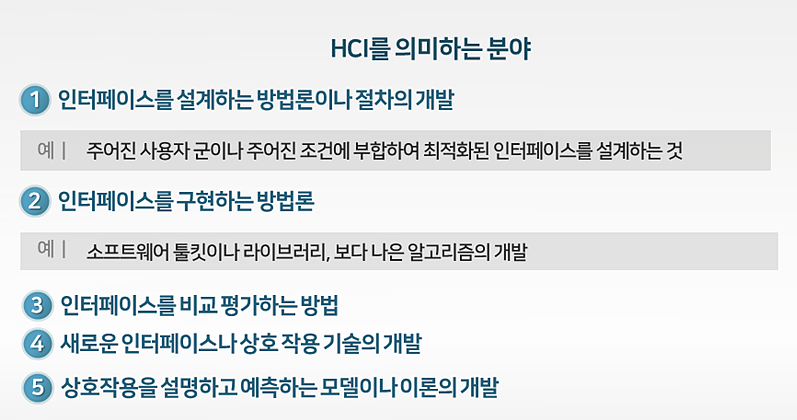
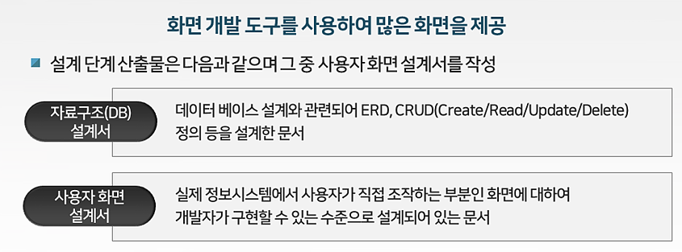

>   
> [jhta.step.or.kr](https://jhta.step.or.kr)

# 0404
# 화면 설계(응용SW개발)

- [0404](#0404)
- [화면 설계(응용SW개발)](#화면-설계응용sw개발)
- [3차시	관련 시스템 분석](#3차시관련-시스템-분석)
  - [1. 현행 시스템 자료수집](#1-현행-시스템-자료수집)
  - [2. 채널 시스템 분석](#2-채널-시스템-분석)
- [4차시 UI 요구사항 도출 및 수집](#4차시-ui-요구사항-도출-및-수집)
  - [1. UI 요구사항 도출 기법](#1-ui-요구사항-도출-기법)
  - [2. UI 요구사항 수집활동](#2-ui-요구사항-수집활동)
- [5차시	UI 요구사항 정의확정](#5차시ui-요구사항-정의확정)
  - [1. 요구 공학](#1-요구-공학)
  - [2. UI 요구사항 분류](#2-ui-요구사항-분류)
- [6차시	UI 요구사항 확인 및 검증](#6차시ui-요구사항-확인-및-검증)
  - [1. UI요구사항 확인기법](#1-ui요구사항-확인기법)
  - [2. UI 요구사항 반영확인](#2-ui-요구사항-반영확인)
- [7차시 UI 프로토타입 제작 검토](#7차시-ui-프로토타입-제작-검토)
  - [1. UI 프로토타입 이해](#1-ui-프로토타입-이해)
  - [2. UI 프로토타입 제작 검토](#2-ui-프로토타입-제작-검토)
- [8차시 와이어프레임 작성](#8차시-와이어프레임-작성)
  - [1. 와이어프레임 개요](#1-와이어프레임-개요)
  - [2. 와이어프레임 작성사례](#2-와이어프레임-작성사례)
- [9차시 스토리보드 작성](#9차시-스토리보드-작성)
  - [1. 스토리보드 IA 개요](#1-스토리보드-ia-개요)
  - [2. 스토리보드, IA 작성사례](#2-스토리보드-ia-작성사례)
- [10차 화면 설계서 작성](#10차-화면-설계서-작성)
  - [1. 최종 화면 설계서 작성 사례1](#1-최종-화면-설계서-작성-사례1)
  - [2. 최종 화면 설계서 작성 사례2](#2-최종-화면-설계서-작성-사례2)

<small><i><a href='http://ecotrust-canada.github.io/markdown-toc/'>Table of contents generated with markdown-toc</a></i></small>

---
# 3차시	관련 시스템 분석
## 1. 현행 시스템 자료수집
* 일반적인 요구사항 도출 과정 중 시스템 관련사항을 분석하는 단계에서 도출된 ‘현행 시스템 분석서’를 바탕으로 UI 관련 요구사항을 선별하여 도출함
* Front-end는 사용자로부터 다양한 형태의 입력을 받아 Back-end가 사용할 수 있는 규격에 따라 처리하는 역할을 하고 반대로 Back-end는 Back-end에서 처리한 것을 Front-end를 통해 사용자에게 보여주는 역할을 함
* Front-end 부분은 사용자가 접하는 사용자 인터페이스(User Interface)와 밀접한 관계

## 2. 채널 시스템 분석
* 화면 설계 시 다양한 채널 시스템을 고려해야 함
* 다양한 채널 시스템 중 주요 시스템은 다음과 같음
  1. 클라이언트(CS)채널
     - Client-Server 아키텍처상의 Client를 의미
     - 일반적인 윈도우 프로그램의 화면 UI를 고려해야 함
     - 예) 엑셀 및 워드 화면, 윈도우프로그램으로 구현된 업무 화면
  1. 웹 채널
     - IE나 크롬 등 웹 브라우저를 통하여 조회되는 화면
  2. 모바일 채널
     - 스마트 폰, 스마트 패드 등의 화면
  4. 기타
     - ARS 시스템, 이메일 응답 시스템, 안내물 DM 등의 인쇄 화면, 증명서 발급시스템의 화면 등

---
# 4차시 UI 요구사항 도출 및 수집
## 1. UI 요구사항 도출 기법
* UI 요구사항을 추출하려면 다음을 통해 방향성을 결정해야 함
  1. UI 관련 개발목표 정의
  2. UI/UX전략 마련
* UI/UX 개발 목표를 공유, 개발 범위를 선정을 위해 수행해야
할 사항
  1. 경영진의 UI/UX 관련 개발 요구사항 조사 및 정의
  2. 자사 및 타사 사용자 분석, 트렌드 분석
  3. 관계자 개발 목표 협의 및 공유 워크샵
* UX전략은 ‘사용자, 비즈니스, 기술적 관점’의 목표를 설정한 후 UI/UX에 ‘사용자의 편의성, 차별화, 혁신, 경쟁’ 등을 어떻게 반영할 지 계획하는 것

## 2. UI 요구사항 수집활동
* UI 요구사항 수집을 위한 인터뷰 및 분석 절차
  1. 대상자 선정
  2. 일정계획
  3. 질문 작성
  4. 인터뷰 수행
  5. 분석 및 정리
* UI 요구사항 수집활동 뿐만 아니라 경영, 마케팅 등 많은 분야에서 인터뷰, 분석을 위해 많이 사용하는 방법
  1. SWOT 분석
  2. FAW(Force At Work)분석
  3. 심층 인터뷰(In Depth Interview)
  4. 포커스 그룹 인터뷰(Focus Group Interview)
  5. 육색사고모자(6 Thinking Hats)
  6. 어피니티 다이어그램(Affinity Diagram)
  7. 피쉬본(Fishbone) 분석
  8. 휴리스틱 평가(Heuristic Evaluation)
  9. 선호도 평가(Preference Evaluation)

---
# 5차시	UI 요구사항 정의확정
## 1. 요구 공학
* 요구공학 : 요구사항 관리에 포함되는 모든 생명주기(SDLC)활동과 이를 지원하는 모든 프로세스를 포함하는 개념
* 요구 공학의 최종 산출물 = 요구사항 명세서
* 일반적 요구 공학
  - 시스템 구현 전 요구 사항과 프로세스 단계에 초점을 맞춤
* UI 관점의 요구 공학: HCI 전체 설계 과정을 다룸
  * 
  * 요구공학 : '인간-컴퓨터 상호작용'을 의미하고, 이는 인간과 컴퓨터 간의 상호작용에 대해 연구하는 분야
* 소프트웨어의 요구 사항과 인간 중심 설계는 모두 설계 단계 전 반드시 고려하여 할 사항

## 2. UI 요구사항 분류
* UI 요구사항 분류를 위해 페르소나를 많이 활용함
  * 페르소나
    * 잠재적 사용자 및 구매자들의 다양한 목적과 관찰된 행동 패턴을 응집시켜 놓은 원형
    * 사용자를 보다 면하게 분석하기 위해 '공통된 경험 특성을 가진 사용자(Persona)'를 정의하여 그들의 이용행태와 동기, 니즈, 태도 등을 서술하게 하는 방법
* UI 요구사항을 추출하는 절차
  1. 페르소나를 정의 및 분류
  2. 정황 시나리오 리스트 작성
  3. UI 요구사항을 추출 한 후 최종적으로 전체 요구사항에 포함하여 작성

---
# 6차시	UI 요구사항 확인 및 검증
## 1. UI요구사항 확인기법
* UI 설계 원칙: 직관성, 유효성, 학습성, 유연성
* UI 설계 지침: 사용자 중심, 일관성, 단순성, 결과 예측 가능
* UI 설계 고려사항: 가시성, 표준화, 접근성, 명확성, 오류 발생 해결
  * 
  * 
* UI 표준 및 지침 확인 절차
  1. UI 스타일 가이드 내 정의된 내용 확인
  2. UI 패턴 모델 내 정의된 내용 확인
  3. UI 표준 수립을 위한 조직 구성 및 활동 수행
  4. UI 표준을 위한 환경 분석

## 2. UI 요구사항 반영확인
* 여러 경로를 통해 수집, 작성된 요구사항을 검토하고, 목적을 기준으로 데이터 요구, 기능 요구, 제품 품질속성, 제약사항으로 요구사항을 작성
* 도출된 UI 요구사항들을 바탕으로 UI 전체적인 구조를 파악 및 검토하고, 내부 구성 요소들의 종류와 각각의 표현 방식 등을 검토

---
# 7차시 UI 프로토타입 제작 검토
## 1. UI 프로토타입 이해
* 프로토타입(사전적의미) : 새로운 컴퓨터 시스템이나 소프트웨어의 설계 또는 성능, 구현가능성, 운용가능성을 평가하거나 요구 사항을 좀 더 잘 이해하고 결정하기 위하여 전체적인 기능을 간략한 형태로 구현한 시제품
* 소프트웨어 개발에서는 정식 절차에 따라 완전한 소프트웨어를 만들기 전에 사용자의 요구를 받아 일단 모형을 만들고 이 모형을 사용자와 의사소통하는 도구로 활용함 

## 2. UI 프로토타입 제작 검토
* UI 프로토타입을 작성하기 전 단계
  1. 사전에 소프트웨어 설계에 관련된 UI 흐름을 확인
  2. 사용자 행동 흐름을 확인
  3. 행동에 따른 설계 원리를 생각하고 처리 흐름을 확인
  4. 프로토타입 유즈케이스 작성
* UI 프로토타입 제작 단계
  1. UI 프로토타입의 초기 내용을 페이퍼 프로토타입이나 디지털방식으로 작성
  2. UI 프로토타입을 상세 작성
  3. UI 프로토타입의 적정성 검토

---
# 8차시 와이어프레임 작성
## 1. 와이어프레임 개요
* 와이어프레임
  * 와이어프레임(Wireframe, 골격)은 제품을 구성하는 서로 다른 레이아웃을 정적인 낮은 충실도(low fidelity) 상태로 재현한 것
  * 간단한 모양만을 사용하여 인터페이스를 시각적으로 묘사한 것
* 와이어프레임 특징
  - 이름에서 알 수 있듯이 와이어(철사,선으로만 그림)로 설계된 모양
  - 의사소통 수단
  - 작업에 대한 기록으로 사용됨
* 와이어프레임 작성방법
  - 펜과 종이를 사용하여 스케치
  - 전문 와이어프레임 프로그램 도구로 제작
  - 

## 2. 와이어프레임 작성사례
* 와이어프레임 작성 전 필수사항
  - 실제 화면 설계를 위해 유사한 화면을 사용해 본 경험, 유사한 업무를 처리하는 화면에 대한 레퍼런스 조사
* 와이어프레임을 잘 작성하려면?
  * 디자인 감각이 있는 다른 사람의 화면 설계 자료를 보고 다른 설계자들은 와이어프레임을 어떻게 제작하고 있는지 꾸준히 관찰
* 와이어프레임 작성방법
  * 간략히 손으로 스케치 → 와이어프레임 작성 → 실제 화면 수준으로 구현 → 화면 코드 작성

---
# 9차시 스토리보드 작성
## 1. 스토리보드 IA 개요
* 스토리보드(Storyboard)
  * UX구현에 수반되는 사용자와 목표, 인터페이스 간 상호작용을 시각화하여, 개발자/디자이너와의 의사소통을 돕는 도구
  * 화면 설계와 관련된 와이어프레임, 포트폴리오, 워크플로우, IA

## 2. 스토리보드, IA 작성사례
* 스토리보드를 작성한다는 것은?
* 기능 리스트를 작성하고, 사용자 행위 흐름도를 작성한 후, 화면 구조도인 IA를 작성한 다음, 각각의 단위 화면 설계서를 작성하는 것
* UI 화면 구현과 관련된 기능을 추출하기 위하여 정보시스템 구축 프로젝트의 요건 정의 단계에서 도출된 기능 요구사항을 중심으로 화면 구현과 연관된 기능리스트를 도출 후, 업무 프로세스 흐름도를 통하여 사용자 행위 흐름도 (User Task-Flow)를 도출함
* IA를 계층식(트리구조)으로 작성하고, 도표형식으로 시스템 참고사항을 포함하여 작성한 후, 각각의 단위화면별로 화면설계서를 작성

---
# 10차 화면 설계서 작성
## 1. 최종 화면 설계서 작성 사례1
* 
* 
* 화면 설계 시 고려하는 주 요소
  - 구축하고자 하는 정보시스템의 목적에 따라 화면설계에서 고려하는 주 요소는 다음과 같이 구분할 수 있음
    1. 감성적 디자인이나 화면의 특별 기능 등이 필요로 하는 경우
    2. 화면 개발 도구를 사용하여 많은 화면을 제공하는 경우 

* 감성적 디자인이나 화면의 특별 기능 등이 필요로 하는 경우 
  * 화면 기획자의 기획의도에 대한 프로젝트 산출물이 화면 설계서의 구성 요소가 됨
  * 
* 스토리보드의 의미
  * 화면 설계서와 스토리보드를 혼재하여 현장에서 사용하지만 실제 화면 설계서의 일부로 스토리보드를 이해해야 함
* 
* 
* 

## 2. 최종 화면 설계서 작성 사례2
* 회사의 인사 시스템, 회계시스템, 재고관리 시스템과 같은 대부분 내부 직원용 정보시스템들은 첫 진입 메인 화면의 디자인이나 상징 컨셉이 중요한 것이 아니고 많은 업무처리를 하여야 하는 만큼, 업무 처리용 각 화면을 구현하는 것이 중요함
* 화면 설계서 문서
  - 프로젝트 기간 내에 개발할 모든 화면을 도출
  - 사용자와 인터페이스 하기 위해 도출된 항목을 구체적으로 상세화 하기 위해 사용
  - 
  - 
  - 
  - 
  - 