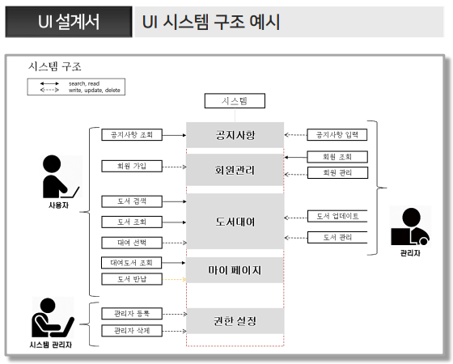
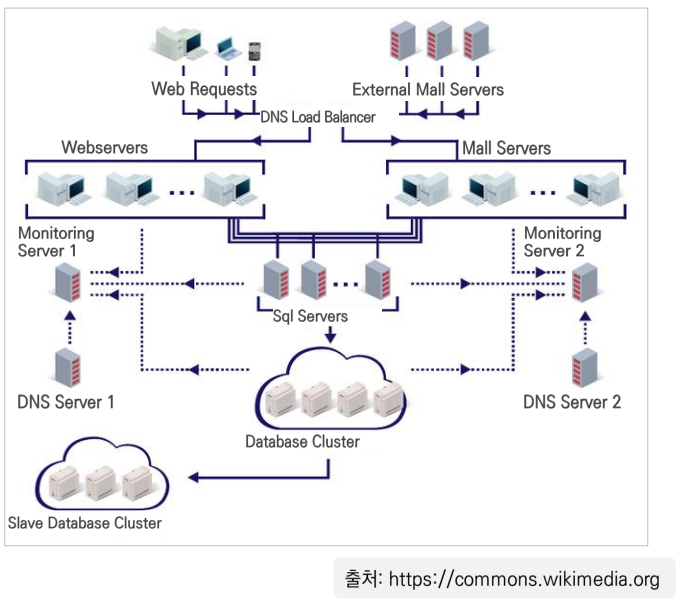
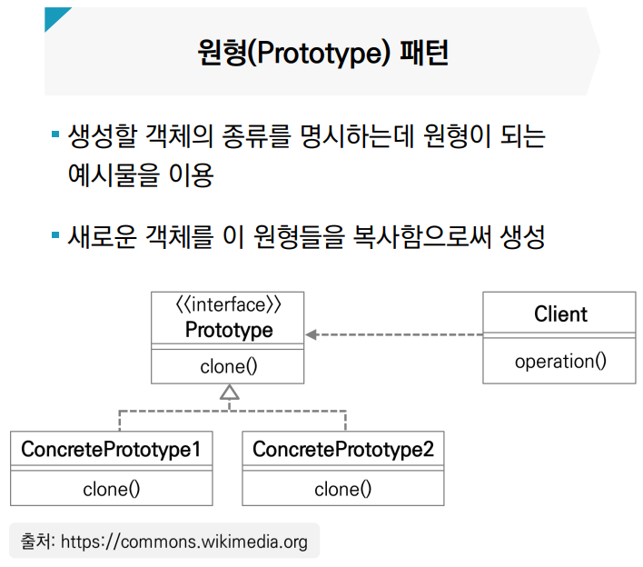
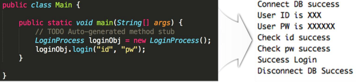
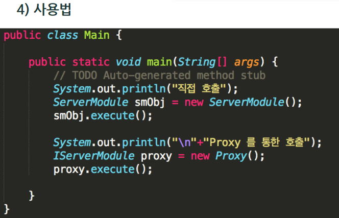
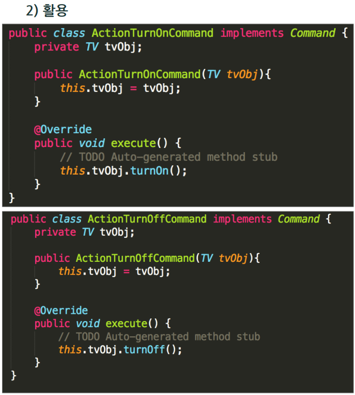

>   
> [jhta.step.or.kr](https://jhta.step.or.kr)

# 0405
# 화면 설계(응용SW개발)

- [0405](#0405)
- [화면 설계(응용SW개발)](#화면-설계응용sw개발)
- [11차시 UI 흐름 설계](#11차시-ui-흐름-설계)
  - [1. UI 설계서 구성](#1-ui-설계서-구성)
  - [2. UI 흐름 설계](#2-ui-흐름-설계)
- [12차시 UI 상세 설계](#12차시-ui-상세-설계)
  - [1. UI 시나리오 구성](#1-ui-시나리오-구성)
  - [2. UI 상세 설계](#2-ui-상세-설계)
- [과제](#과제)
  - [답안 작성](#답안-작성)
- [화면구현 part1](#화면구현-part1)
- [1차시 아키텍처 설계 프로세스](#1차시-아키텍처-설계-프로세스)
  - [1. 화면 구현 및 아키텍처의 이해](#1-화면-구현-및-아키텍처의-이해)
  - [2. 아키텍처 모델, 역할, 뷰](#2-아키텍처-모델-역할-뷰)
  - [3. 아키텍처 설계의 중요성 및 원칙](#3-아키텍처-설계의-중요성-및-원칙)
- [2차시 아키텍처 종류](#2차시-아키텍처-종류)
  - [1. 비즈니스 아키텍처](#1-비즈니스-아키텍처)
  - [2. 시스템 아키텍처](#2-시스템-아키텍처)
  - [3. 데이터 아키텍처](#3-데이터-아키텍처)
- [3차시 소프트웨어 디자인 패턴과 생성 패턴](#3차시-소프트웨어-디자인-패턴과-생성-패턴)
  - [1. 소프트웨어 디자인 패턴](#1-소프트웨어-디자인-패턴)
  - [2. 소프트웨어 생성 패턴](#2-소프트웨어-생성-패턴)
- [4차시 소프트웨어 구조 패턴과 행동 패턴](#4차시-소프트웨어-구조-패턴과-행동-패턴)
  - [1. 소프트웨어 구조 패턴](#1-소프트웨어-구조-패턴)
  - [2. 소프트웨어 행동 패턴](#2-소프트웨어-행동-패턴)
- [5차시 UI 스토리보드 작성](#5차시-ui-스토리보드-작성)
  - [1. 스토리보드 이해](#1-스토리보드-이해)
  - [2. 스토리보드 작성법](#2-스토리보드-작성법)
- [6차시 Wireframe, Mockup을 이용한 UI 설계](#6차시-wireframe-mockup을-이용한-ui-설계)
  - [1. UI 설계 용어](#1-ui-설계-용어)
  - [2. Wireframe, Mockup 실습](#2-wireframe-mockup-실습)

<small><i><a href='http://ecotrust-canada.github.io/markdown-toc/'>Table of contents generated with markdown-toc</a></i></small>

---
# 11차시 UI 흐름 설계
## 1. UI 설계서 구성

* UI 흐름 설계를 위해 UI 설계서 구성, UI 유용성 파악, 스토리보드의 파악을 함
* UI 설계서 구성
  * UI 설계서 표지, UI 설계서 개정 이력, UI 요구사항 정의, 시스템 구조, 사이트 맵, 프로세스 정의, 화면 설계 등으로 이루어짐
* UI 유용성 파악
  * 사용자의 원래 목적을 명확히 파악하여 불필요한 부가 기능 때문에 시스템 성능이 떨어지지 않도록 해야 함
* 스토리보드 파악
  * 정책이나 프로세스 및 콘텐츠의 구성, 와이어프레임(UI, UX), 기능에 대한 정의, 데이터베이스의 연동 등 구축하는 서비스에 대한 대부분의 정보가 수록되어 있는 문서인 스토리보드를 파악해야 함

## 2. UI 흐름 설계
* UI 설계서 적정성 확인
  * 시스템에서의 실행 차 및 평가 차를 줄이기 위한 UI 설계 원리를 확인
* 화면과 폼의 흐름 설계
  1. 화면에 표현되어야 할 기능 작성
  2. 화면의 입력 요소 확인
  3. UI 요구사항이 잘 반영되었는지 확인
  4. 기능 및 양식 등을 확인

---
# 12차시 UI 상세 설계
## 1. UI 시나리오 구성
* UI 상세 설계에 있어 시나리오 작성은 반드시 필요함
* 시나리오 작성시 고려사항
  1. 주요 키의 위치와 기능
  2. 공통 UI 요소
  3. 기본 스크린 레이아웃
  4. 기본 인터랙션 규칙
  5. 공통 단위 태스크 흐름
  6. 케이스 문서

* UI 시나리오 문서 작성시 기억할 사항
  1. 완전성
  2. 일관성
  3. 이해성
  4. 가독성
  5. 수정 용이성
  6. 추적 용이성
  7. 모범적인 UI시나리오 문서의 효과

## 2. UI 상세 설계
* UI 요구사항과 UI 표준 및 지침에 따라, 사용자의 편의성을 고려한 메뉴 구조를 설계해야 하며 이를 위하여 UI 상세 설계를 위한 요구사항을 최종 확인함
1. 메뉴 구조 설계
   * 요구사항을 최종 확인
   * UI 설계서 표지 및 개정 이력 작성
   * UI 구조 설계
     1. UI 요구사항들 재확인
     2. UI프로토타입을 재확인
     3. UI 요구사항들과 UI 프로토타입에 기초해 UI 시스템 구조 설계
        * 
   * 사용자 기반 메뉴 구조 설계
     1. UI 시스템 구조를 바탕으로 사이트맵 구조 설계
     2. 사용자 관점의 요구 프로세스들을 진행순서에 맞춰 정리
        * 
   * 화면 설계
     * 화면 설계 및 각 페이지 별로 필요한 화면 설계
        * (UI 프로토타입과 UI프로세스정의를 참고)
        * 
* 다음은 UI 설계 원리를 검토하고, 화면과 폼 등의 UI 화면에 대한 상세한 내용을 설계함
2. 하위 시스템 설계
    * 실행 차를 줄이기 위한 UI 설계 원리 검토
    * 평가 차를 줄이기 위한 UI 설계 원리 검토
    * UI 검토(Iteration)을 수행하고 보완
    * UI 시연으로 사용성 검토 및 검증 수행
      * 

# 과제
* 상품 주문 시스템의 상품 주문 UI 흐름을 확인하고, 작성하시오.
* 사용자가 상품 상세 화면에서 바로구매 버튼을 클릭했을 때, UI흐름을 생각해보고 작성한다.
## 답안 작성

---
# 화면구현 part1

---
# 1차시 아키텍처 설계 프로세스
## 1. 화면 구현 및 아키텍처의 이해
* 화면 구현의 이해
  * 화면 구현
    * 우리가 일상에서 눈으로 보는 다양한 서비스를 만들어 내는 것
  * 소프트웨어에서의 아키텍처
    * 무형으로 존재하는 다양한 동작들을 어떻게 구현할지 설계하고 그 뼈대를 만들어 내는 것
  * 소프트웨어에서의 화면 구현
    * 입력과 출력을 모두 포함하는 개념
* 아키텍처의 이해
  * 시스템에 대한 기본 조직 체계로, 시스템을 이루는 구성요소와 구성요소들 사이의 관계, 구성요소와 주변 환경들과 관계 및  시스템의 진화와 설계를 지배하는 원칙들로 실체화
  * 이해하고 추론할 정도의 간결성을 유지하게 하며 추상적인 표현을 사용하여 복잡도를 관리하고, 시스템이 포함해야 할 것들을 가시화하여 이해당사자 간의 관심사에 따른 모형을 제시할 수 있고 원활한 의사소통 수단이 됨

## 2. 아키텍처 모델, 역할, 뷰
* 시스템에 관계되는 여러 이해관계자의 관점을 반영한 다양한 모델의 집합
* 아키텍처는 시스템 품질 속성을 실현하게 해주며 의사결정이 시스템의 진화에 따라 변경 타당성을 파악하고 관리하게 도와줌
* 아키텍처를 통해 이해당사자 간의 의사소통이 가능하며, PM과 아키텍트가 비용 및 일정을 예측할 수 있도록 도움

## 3. 아키텍처 설계의 중요성 및 원칙
* 아키텍처 구축 프로세스
  * 시스템환경의 이해 → 요구 사항 분석 → 아키텍처 분석 → 아키텍처 설계 → 검증 및 승인
  * 요구 사항 분석 단계에서는 이해관계자의 다양한 요구사항을 이해하고 분석하며 요구 사항을 정형화하여 기능적, 비기능적 요구 사항으로 분류 및 명세 작업을 진행
* 설계 상세 절차 
  * 요구 사항 분석 → 설계 뷰 작성 → 설계 검증

---
# 2차시 아키텍처 종류
## 1. 비즈니스 아키텍처
* 기업의 미션, 비전 목표를 정의
* 비즈니스 모델 및 구조를 정의하며 비즈니스 모델을 위한 기능과 프로세스를 정의함
* 경영 혁신 도구로 쓰이며 기업에 대한 다양한 관점을 반영하며, 효율적인 변경 및 확장성을 가져야 함
* 비즈니스 아키텍처의 효과로 경영 활동과 현재 제안된 IT 투자 간의 관련성 파악이 가능하며 기술 변화가 기업에 미치는 영향을 파악할 수 있음

## 2. 시스템 아키텍처
* 구성요소간의 관계 및 시스템 외부환경과 관계가 나타나며 요구사항 및 시스템 전체 수명 주기를 고려하여 설계해야 함
* 시스템이 어떻게 동작하는지 나타내는 구조를 도식화 함
  * 
* 시스템 아키텍처를 통하여 전체 구조를 파악 가능하며 이기종 간의 상호 운영성 확보 및 다양한 시스템 구성요소의 상호 작용을 정의함
* 시스템 아키텍처 구성 기술로는 시스템 플랫폼, OS, 기타 소프트웨어, Storage 기술, 이중화, 부하 분산 기술이 있음
   * 

## 3. 데이터 아키텍처 

* 최상위의 단계에서부터 데이터베이스단계까지 데이터에 관한 모든 구조를 통합하여 연계시킨 아키텍처
* 기능, 프로세스, 애플리케이션에 활용될 핵심 데이터 및 정보를 명확히 정의해야 함
* 목적: 전사적인 데이터 아키텍처 구축

---
# 3차시 소프트웨어 디자인 패턴과 생성 패턴
## 1. 소프트웨어 디자인 패턴
* 소프트웨어 디자인에서 특정 문맥, 상황에서 공통으로 발생하는 문제에 대해 재사용 가능한 해결책
  * 
* 유지 보수하기 쉬운 객체지향 시스템을 만들 수 있음
* 알고리즘과 같이 프로그램 코드로 바로 변환될 수 있는 형태는 아니지만, 특정 상황에서 구조적인 문제를 해결하는 방식을 설명함
* 업무 논의 및 디자인 문서를 작성할 때 상호 간에 의사 결정 용어로 쓰일 수 있음
* 디자인 패턴은 목적에 따라서 소프트웨어 생성 패턴, 구조 패턴, 행위 패턴 3가지로 분류됨
* 소프트웨어 생성 패턴에는 싱글톤, 빌더, 팩토리 메서드, 추상 팩토리, 원형 패턴이 있음
  * 
  * 
  * 
  * 
  * 
* 구조 패턴에는 적응자, 브리지, 컴포지트, 데코레이터, 퍼사드, 프록시 패턴이 있음
  * 
  * 
  * 
  * 
  * 
  * 
* 행위 패턴에는 커맨드, 인터프리터, 이터레이터, 메디에이터, 옵저버, 상태, 스트레이트지, 템플릿, 비지터 패턴이 있음
  * 
  * 
  * 
  * 
  * 
  * 
  * 
  * 
  * 

## 2. 소프트웨어 생성 패턴
* 싱글톤 패턴은 애플리케이션이 시작될 때 어떤 클래스가 한 번만 메모리에 할당하고 그 메모리에 인스턴스를 만들어서 사용하며, 최초 생성된 인스턴스를 재사용하여 사용하기 위한 패턴 임
* 팩토리 메소드 패턴은 객체를 생성하기 위한 인터페이스를 정의하는데 어떤 클래스의 인스턴스를 만들지는 서브 클래스에서 결정하는 패턴 임
* 빌더 패턴은 복잡한 객체를 생성하는 방법과 표현하는 방법을 정의하는 클래스를 별도로 분리하여 서로 다른 표현이라도 이를 생성할 수 있는 동일한 구축 공정을 제공할 수 있도록 함

---
# 4차시 소프트웨어 구조 패턴과 행동 패턴
## 1. 소프트웨어 구조 패턴
* 클래스나 객체의 합성에 관한 패턴
* Adapter 패턴
  * 패턴 클래스의 인터페이스를 사용자가 기대하는 다른 인터페이스로 변환하는 패턴
  * 호환성이 없는 인터페이스 때문에, 함께 동작할 수 없는 클래스들이 함께 작동하도록 해주는 패턴
  * 실습
    * Person 클래스
      * 
    * 메세지 보내는 함수, 인터페이스
      * 
    * 코드1
      * 
    * 코드2
      * 
    * 사용법
      * 
*  Facade 패턴
  * 서브 시스템에 있는 인터페이스 집합에 통합된 하나의 인터페이스를 제공, 서브 시스템을 좀 더 쉽게 사용하기 위해 고수준의 인터페이스를 정의
  * 실습
    * 
    * 
    * 
* Proxy 패턴
  * 어떤 다른 객체로 접근하는 것을 통제하기 위해 그 객체의 매니저 또는 자리 채움자를 제공하는 패턴
  * 실습
    * 
    * 
    * 
    * 
* Composite 패턴
  * 객체들의 관계를 트리 구조로 구성하여 부분-전체 계층을 표현하는 패턴으로, 사용자가 단일 / 복합객체 모두 동일하게 다루도록 하는 패턴
  * 실습
    * 
    * 
    * 
    * 

## 2. 소프트웨어 행동 패턴
* 클래스나 객체들이 상호작용하는 방법과 책임을 분산하는 방법을 정의하는 패턴
* Observer 패턴
  * 객체들 사이에 1 : N의 의존관계를 정의하여 어떤 객체의 상태가 변할 때, 의존관계에 있는 모든 객체들이 통지 받고 자동으로 갱신될 수 있게 만드는 패턴
  * 실습
    * 
    * 
    * 
    * 
    * 
    * 
* Iterator 패턴
  * 내부 표현부를 노출하지 않고 어떤 객체 집합의 원소들을 순차적으로 접근할 방법을 제공하는 패턴
  * 실습
    * 
    * 
    * 
    * 
    * 
* Command패턴
  * 요청을 객체로 캡슐화하여 서로 다른 사용자의 매개변수화, 요청 저장 또는 로깅, 연산의 취소를 지원하게 만드는 패턴
  * 실습
    * 
    * 
    * 
    * 
    * 
    * 
* Mediator 패턴
  * 한 집합에 속해있는 객체들의 상호작용을 캡슐화하는 객체를 정의하는 패턴
  * 중재자는 객체들이 직접 서로 참조하지 않도록 함으로써 객체들 간의 느슨한 연결을 촉진시키며 객체들의 상호작용을 독립적으로 다양화 가능
  * 실습
    * 
    * 
    * 
    * 
    * 

---
# 5차시 UI 스토리보드 작성
## 1. 스토리보드 이해
* 스토리보드의 정의
  * UX 구현에 수반되는 사용자와 목표, 인터페이스 간 상호작용을 시각화하여 개발자, 디자이너와의 의사소통을
돕는 도구
  * 완성해야 할 서비스이 예상되는 사용자 경험을 미리 보기 위한 방법론
* 스토리보드 작성 목적
  * 서비스에 필요한 기능 조각 간의 관계를 설명, 설계에서 필요한 조각들을 모아서 순서대로 놓고, 배치하고, 쌓아서 조립하는 것
* 실제 개발 단계에서 발생할 수 있는 문제점을 미리 발견하고 대처하기 위해 스토리보드 작성
* 스토리보드의 구성요소
  * Feature List
  * User Task-flow
  * Information Architecture
  * Wireframe
  * Workflow

## 2. 스토리보드 작성법
* 스토리보드 표지: 프로젝트 명, 문서 버전 정보, 최종업데이트 일자, 작성자 등의 정보를 기재
  * 
* 문서 버전 관리: 협업을 하는 프로젝트에서 버전 관리 정보가 중요하며 이는 팀 전체가 정확하게 내용을 공유하고 유기적으로 개발이 진행될 수 있게 함
  * 
* 목차: 업무 효율을 높임
  * 
* Information Architecture: 사이트맵과 비슷한 의미의 내용으로 사용자 입장에서 복잡하지 않게 설계
  * 
* 공통 모듈: 공통으로 사용되는 기능
  * 
* Description: 화면 설계 시 화면에 대한 자세한 설명은 Description을 이용하여 설명하며 최대한 직관적으로 설명 및 표기
  * 

---
# 6차시 Wireframe, Mockup을 이용한 UI 설계
## 1. UI 설계 용어
* Wireframe
  * 
  * 일정 단축과 제한적 사고 타파를 위해 작성
  * Wireframe은 UI 중심의 화면 레이아웃을 설계하며, 선과 뼈대를 만드는 것으로 시각적인 프레임워크, 버튼 배치, 페이지 요소
  등의 계층 구조 등 페이지 구조와 구조성 측면의 결과를 통합적으로 적용하는 작업
  * Wireframe을 작성하면 개발 구성원과 소통에 용이하며, 시각적인 문서작업, 업무의 방향성 그리고 화면이 어떻게 동작하는지에 대하여 이해를 높일 수 있음
  * Wireframe의 작성 3단계는 견적, 기능, 유용성과 디자인 초안 단계로 구성
    * 견적 단계: 예산 수립, 작업 일정 등을 계획하기 위해 대략적으로 견적이 필요하며 화면 흐름에 대한 계획을 세움
    * 기능 단계: 화면들을 상세하게 설계하여 리스트 업을 하며 화면과 플로우에 맞게 컨트롤러들을 디자인
    * 유용성과 디자인 초안 단계: 사용성을 가다듬고 앱의 전체적인 Look을 결정하며 데이터 모델과 컨트롤러 레이아웃을 반복적으로 검토
* Mockup
  * 
  * Mockup은 실물과 흡사한 정적인 형태의 모형이며 서비스 개발 전에 결과물을 그려보는 것을 의미
* Prototype
  * 
  * Prototype은 다양한 인터랙션을 결합하여 실제 서비스처럼 작동하는 동적인 형태의 모형을 작성하는 것

* UI 설계도구
    1. Power Mockup
    2. Balsamiq Mockup
    3. Kakao Oven
    4. AXURE

## 2. Wireframe, Mockup 실습
* 실제 화면을 구현하기 전에 의사소통을 위해 간단하게 배치를 구현하여 보기 위한 툴
* 여러 화면을 생성함
* 생성한 각 화면에서 버튼, 그림 등 요소들을 배치함
* 배치한 요소들을 공유하여 기획자, 개발자 등 개발에 참여하는 모든 사람들과 의사소통을 수행
* 실습과정
  * ovenapp.io에서 실습
  1. 로그인
  2. 프로젝트 생성 - 프로젝트이름, 상세내용, 기본 화면 사이즈, 테스트 URL 공유 설정
  3. 새 페이지 생성 - 제목, 내용 입력
  4. 링크 연결하기 - 페이지끼리 연결 가능
  5. 프로젝트 대쉬보드에서 확인 -> 톱니바퀴 모양 설정버튼 클릭 -> QR코드/URL : 작성한 페이지 확인 가능 (이해관계자들과 소통을 위해 사용함.)
  * 지속적으로 회의와 소통을 통해 수정을 하고 공유하며 작업하기 용이하다.

