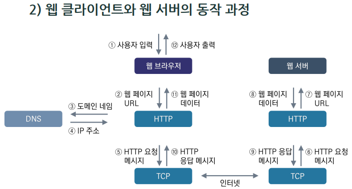

>   
> [jhta.step.or.kr](https://jhta.step.or.kr)

# 0406
# 화면구현 part1

- [0406](#0406)
- [화면구현 part1](#화면구현-part1)
- [7차시](#7차시)
  - [1. User Interface(사용자 인터페이스)](#1-user-interface사용자-인터페이스)
  - [2. User Experience(사용자 경험)](#2-user-experience사용자-경험)
- [8차시](#8차시)
  - [1. UI 내비게이션의 이해](#1-ui-내비게이션의-이해)
  - [2. 내비게이션 디자인 및 원칙](#2-내비게이션-디자인-및-원칙)
- [9차시](#9차시)
  - [1. 인터랙션 디자인](#1-인터랙션-디자인)
  - [2. 프로토타입](#2-프로토타입)
- [10차시](#10차시)
  - [1. 아키텍처 분석](#1-아키텍처-분석)
  - [2. 아키텍처 결정](#2-아키텍처-결정)
- [11차시](#11차시)
  - [1. UI 설계 검토](#1-ui-설계-검토)
  - [2. UI 설계 피드백](#2-ui-설계-피드백)
- [12차시](#12차시)
  - [1. 프로토타입 확인 및 피드백](#1-프로토타입-확인-및-피드백)
- [과제](#과제)
  - [답안 제출](#답안-제출)
- [화면구현 part2](#화면구현-part2)
- [1차시 HTML5](#1차시-html5)
  - [1. 웹이란?](#1-웹이란)
    - [특징](#특징)
    - [구성요소](#구성요소)
    - [동작](#동작)
  - [2. HTML5 기능](#2-html5-기능)
    - [개념](#개념)
    - [HTML4와 페이지 기술 방식 차이](#html4와-페이지-기술-방식-차이)
    - [주요 기능](#주요-기능)
- [2차시 HTML5 글자 태그](#2차시-html5-글자-태그)
  - [1. 제목, 본문, 앵커, 글자 태그](#1-제목-본문-앵커-글자-태그)
    - [제목 태그](#제목-태그)
    - [본문 태그](#본문-태그)
    - [앵커 태그](#앵커-태그)
    - [글자 태그](#글자-태그)

<small><i><a href='http://ecotrust-canada.github.io/markdown-toc/'>Table of contents generated with markdown-toc</a></i></small>

---
# 7차시
## 1. User Interface(사용자 인터페이스)

* 사용자 인터페이스(UI)는 사람들이 컴퓨터, 시스템, 기기 동구 등 그 사이에서 일어나는 상호작용을 매개하고 그것에 반응하는 방법임
* 좋은 사용자 인터페이스는 심리학과 생리학에 기반하여 사용자가 필요로 하는 요소를 쉽게 찾고 사용하며, 그 요소로 명확하게 의도한 결과를 쉽게 얻어 낼 수 있어야 함
* 입력, 출력의 상호작용 수단과 방식을 제공함
* UI의 종류로는 CLI, TUI, GUI, AUI, NUI가 있으며 사용자들의 디바이스의 발달로 NUI가 많이 발전하고 있음
* UI의 기본 원칙으로는 직관성, 유효성, 학습성, 유연성을 가져야 함
## 2. User Experience(사용자 경험)
* 사용자가 어떤 시스템, 제품, 서비스를 이용하면서 느끼고 생각하게 되는 지각과 반응, 행동 등의 경험을 말하며, 경험의 작용 대상과 인간의 반응을 이해하는 것임
* 보기 좋은 시각물을 만드는 것보다 풍부한 사용자 경험을 제공하는 것이 목표임
* 양질의 사용자 경험을 제공하기 위해서 사용자를 이해하고 인지적, 감성적, 행위적 특성을 발견하여 사용자의 Needs를 도출한 디자인을 만들어 내야함
* UX 설계 시 사용자가 어떻게 받아들이고, 어떤 상황에서, 무엇을 느끼며, 어떻게 반응하는지에 대한 관점을 파악해야 함
* UX 기획 및 디자인 프로세스: 비즈니스 전략 → 디자인 전략 수립 → UX디자인 컨셉 → UX 디자인 개발 수행

---
# 8차시
## 1. UI 내비게이션의 이해

* 내비게이션은 사용자가 서비스의 정보를 쉽게 찾고 접근할 수 있도록 도와주는 가장 중요한 역할을 하는 인터페이스 디자인임
* 이동 경로나 방법, 혹은 그것을 돕는 구조와 인터페이스 디자인 등을 포괄하는 표현임
* 사용자가 원하는 콘텐츠를 빠르고 정화하게 찾을 수 있도록 해야함
* 사이트 내에서 사용자가 어느 위치에 있는지 표현해야 함
* 최대한 일관성을 유지하고 사용자의 목적에 맞는 피드백과 지원요소를 제공해야 좋은 내비게이션임
* 내비게이션 구성요소: 내비게이션 바, 풀다운 메뉴, 로컬 검색엔진, 버튼/아이콘, 사이트맵, 링크 걸린 텍스트
  * 
  * 
  * 
  * 
* 내비게이션은 서비스 내에서 빠르게 로딩이 되어야 하며 간결하게 사이트가 한눈에 보일 수 있도록 구성되어야 함
## 2. 내비게이션 디자인 및 원칙
* 내비게이션의 형태에 따른 분류 : 롤오버메뉴, 팝업메뉴, 풀다운메뉴, 이미지 맵을 이용한 메뉴
  * 
  * 
  * 
  * 
* Global navigation은 사이트 전체에 걸쳐 모든 페이지에 노출되어 있어서 언제든 상위 메뉴로 접근할 수 있게 도와주는 최상위 메뉴임
*  Local navigatio은 global navigation 보다 휘발성이 있기 때문에 다른 페이지 종류, 콘텐츠 포멧에 링크할 때 사용함
* 그밖에 Associative navigation, Contextual navigation, Adaptive navigation, Utility navigation 등이 있음
* 내비게이션을 기획할 때 사용자의 목적과 요구에 맞는 내비게이션을 구축하고, 일관성이 있으며 직관적인 메뉴 구성을 해야 함

---
# 9차시
## 1. 인터랙션 디자인
* 인터랙션 디자인(Interaction Design, IxD)는 상호작용 단방향 서비스가 아닌 사용자와 서비스, 제품 간의 서로 교류가 가능한 양방향 통신이나 서비스를 의미
* 단순히 디자인을 표현하기 위함이 아니라 사용자의 편의성과 사용자의 호기심을 불러일으키는 디자인을 함
* 대표적인 인터랙션 디자인 방법
  * 애니메이션 효과, 마이크로 인터랙션 등이 있음
* UI Design과 Interaction Design은 UX Design의 입 부분이며, IxD 는 사용자가 인터페이스를 통하여 시스템을 이용하는 일련의
상호작용임
  
* 인터랙션 디자인 요소
  * 움직임, 공간, 시간, 외관, 질감, 소리를 이용하여 디자인할 수 있음
* 인터랙션 디자인을 위한 접근 방법으로 고려할 요소
  * 시스템, 기능, 사용자, 사용자의 목표, 직관적 디자인 등을 고려하여 접근
## 2. 프로토타입
* 개발 접근법 중 하나로써 개발 초기에 시스템의 모형을 간단히 만들어 사용자가 직접 사용함
* 다양한 디바이스의 발달로 인터랙션 디자인을 적용한 프로토타이핑을 이용하여 사용자의 경험을 극대화 시킬 수 있음
* UX 관점의 스토리 라인, 페이지 레이아웃을 가시화할 수 있음
* 프로토타이핑은 사용자의 요구분석을 통하여 나온 사항을 정리한 후 시스템 설계자는 CASE 도구를 이용하여 프로토타이핑을 개발함
* 개발된 프로토타이핑을 이용하여 사용자는 실제 사용을 통하여 요구사항을 확인하고 보완점을 제안하며 시스템 설계자는 반영될 사항을 수정 및 보안 작업을 반복하여 실행하여 요구사항을 만족하게 함
* 프로토타이핑은 개발 초기에 활용하여 개발 시간 및 비용을 단축 및 절감을 할 수 있음

---
# 10차시
## 1. 아키텍처 분석

* 아키텍처는 의사결정의 중요한 수단으로 아키텍처 분석은 프로젝트 초반에 문제를 찾아내어 좀 더 좋은 품질의 소프트웨어 아키텍처 설계를 가능하게 함
* 아키텍처 분석은 문제점을 조기 식별할 수 있게 하며 시트 품질, 프로젝트 일정, 예산 조직 구조 등에 영향을 줌
* 아키텍처 분석을 통하여 이해관계자 간의 의사소통, 명확한 품질 목표를 정의하여 우선순위를 결정 가능한 이점이 있음
* 분석 시점은 일반적으로 요구사항 분석 후 상세설계 전에 분석을 시행하지만 최근 들어 개발 라이프 사이클 모든 기간 동안 언제든지 분석을 수행하기도 함
## 2. 아키텍처 결정
* 아키텍처 평가 기법은 아키텍처의 접근법인 품질 속성에 미치는 영향을 판단하여 아키텍처 적합성을 판단 및 평가하는 표준
기법으로 가시적 평가, 비가시적 평가 유형으로 분류할 수 있음 * ATAM 기법
  * 아키텍처의 품질 속성에 초점을 맞춘 평가기법으로 품질 속성 간의 상충관계를 평가함
* CBAM 기법
  * 아키텍처의 경제적 측면에 초점을 맞춘 기법
*  SAAM 기법
  * 사용자의 요구사항 시나리오와 아키텍처 간의 매핑을 통하여 적합성을 분석하는 기법
  * 
* ADR 기법
  * 아키텍처 구성요소 간의 응집도를 평가하는 기법
* ARID 기법
  * 전체 아키텍처가 아닌 특정 부분에 대한 품질요소에 집중하여 평가하는 방법
  * 

---
# 11차시
## 1. UI 설계 검토
* UI 설계 개발 프로세스: UX/UI 기획 → UI 설계문서 작성 → GUI 디자인 → GUI 가이드라인 → 코딩 개발
  * 
* 우리가 제공하려는 서비스에서 상호작용을 설계하여 좋은 사용성과 상호 작용 수단과 방식을 제공 할 수 있도록 설계 되어야 함
* 설계 단계마다 각각의 산출물들을 이용하여 이해관계자들 간의 커뮤니케이션 수단으로 사용할 수 있음
* 디자인 가이드라인 작성 시 사용자의 최우선 목적에 맞는지 고려하여 작성하며 최대한 간결하고 정보를 적절하게 전달할 수 있어야 함
  * 
* 설계 시 고려사항으로는 실제 화면과 1:1 구도로 작업을 진행하며, 컨텐츠 구성 및 배치는 반드시 이유와 목적을 가져야 함
  * 
  * 모든 기획은 사용자의 입장을 고려하여 설계되었는지 확인해야 함
  * 
## 2. UI 설계 피드백
* 초기 UI 디자인 피드백은 서비스 기획 의도, 법률, 보안, 사내 정책 등을 고려할 수 있음
* 디자인 및 개발 중 UI 피드백은 디자인 중간 진행 사항을 체크하여 개발 중 구현에 이슈가 있거나 일정상 이슈, 개발 결과와 다른 UI가 개발되었는지 확인할 수 있음
* UI디자인 검증 방법: 사용성 테스트, Heuristic Evaluation, Cognitive Walkthrough
* 사용성 테스트는 사용자의 니즈를 발견하는 방법으로 상세한 문제점 진단 및 개선 방향을 제시 가능한 방법
* Heuristic Evalustion은 평가 척도에 따른 준수 여부를 사용성 전문가들이 판단하는 방법론
* Cognitive Walkthrough는 인지적 시찰법이라고 하면 시스템을 얼마나 이해하고 배우기 쉬운지 평가하는 사용자 조사 방법론임

---
# 12차시
## 1. 프로토타입 확인 및 피드백
* 프로토타입은 시제품이 나오기 전에 제품의 원형을 의미하며 프로토타이핑은 개발자들과 사용자들의 의사소통 상의 효과를 증진시키기 위한 시스템 개발 기법
* 프로토타이핑 과정
  1. 가장 먼저 사용자의 요구분석을 위해 시스템 설계자와 사용자 간에 함께 작업
  2. 4세대 언어 또는 CASE도구를 이용하여 개발
  3. 사용자가 프로토타입을 사용하여 요구사항을 확인 및 보안 점을 제안
  4. 프로토타입을 수정과 보완 작업
  5. 3 ~ 4 단계 반복
* 장단점
  * 장점
    * 사용자 중심 개발방법으로 최종 사용자의 요구를 극대화 가능
    * 개발 시간을 단축
    * 초기 오류 발견으로 변경 용이
  * 단점
    * 시스템의 문서로 만드는 과정이 지나치게 축소될 가능성 -> 추후 유지보수의 불필요한 노력 발생
    * 최종적으로 수정 및 변경 발생 시 개발 시간 소요와 비용 발생
    * 전체 품질과 장기적인 유지보수가 어려워질 수도 있음
* 목적과 필요성
  * 요고분석의 어려움 해결
  * 요구사항에 대해 사용자와 의사소통 및 개발 타당성 검토
  * 서비스의 플로우 또는 구조를 점검
* 프로토타입의 종류
  * 콘셉트를 신속하게 표현
  * 인터랙션/ 기능 위주로 표현
  * 디자인/사용성 위주 표현
  * 높은 품질의 프로토타입
* 저수준 프로토타이핑 
  * 빠른 시간안에 프로토타이핑이 필요한 경우.
  * 작은 공간과 적은 시간을 들여 구현 가능
  * 종류
    * 스케치
      * 비교적 간단한 형태
      * 브레인 스토임 하는 재료로 활용
      * 페이퍼 프로토타이핑을 위한 전 단계 또는 그 자체
    * 페이퍼 프로토타입
      * 종이로 간단하게
      * 빠르고 간단하고 어디서나 가능하고 협업이 쉽고 수정이 용이함
    * 와이어 프레임
      * 페이퍼 프로토타이핑 결과를 한 단계 더 구현 충실도가 높은 형태로 정리하는 데 적합
      * UI 구성, 콘텐츠 배치, 내비게이션 흐름 등을 표현하는 데 활용
      * 정적인 화면들로 구성(사용 흐름 표현 안됨)
* 고수준 프로토타이핑은 프로토타이이핑 툴을 이용하여 인터랙션과 서비스 플로우를 확인 할 수 있으며 사용자가 직접 참여한 사용성 평가 등에서 많이 활용되는 방법

> [prototypr.io](https://prototypr.io/home/)

# 과제

## 답안 제출

---
# 화면구현 part2

---
# 1차시 HTML5
## 1. 웹이란?
* WWW(World Wide Web, w3)라는 용어로 쓰임
* 웹은 인터넷이 연결된 컴퓨터들을 통해 사람들이 정보를 공유할 수 있는 전 세계적인 정보공간임
### 특징
* 텍스트나 그림, 소리, 영상 등과 같은 멀티미디어 정보를 하이퍼텍스트 방식으로 연결함
* HTML 언어를 사용하여 누구나 자신만의 문서 작성을 할 수 있음
* 웹상의 문서에는 누구나 검색하고, 접근 가능한 HTTP라는 프로토콜을 사용
### 구성요소

* 웹은 웹 클라이언트, 웹 브라우저, HTTP프로토콜, 웹서버, 웹애플리케이션으로 구성되어 있음
* 웹 클라이언트
  * 필요한 데이터를 웹 서버에 요청하는 주체
* 웹 브라우저
  * Request Message를 작성하여 웹 서버에 전달
  * 웹 서버로부터 전달받은 Response Message를 해석해 사용자에게 보여주는 소프트웨어
  * Internet Explorer, Firefox, Chrome, Netscape Navigator 등
* HTTP(Hyper Text Transfer Protocol)
  * 웹상에서 정보를 주고 받을 수 있는 프로토콜
  * Hyper Text를 전달하기 위해 만들어진 프로토콜
  * TCP 80번 Port를 사용(HTTPS 경우 433번 포트 사용)
  * OSI 7 Layer 7계층에 해당
  * Text 기반으로 이루어져 있으며 Binary가 아님
  * 암호화 되지 않은 평문을 전송, 근본적으로 Sniffing에 취약
  * TCP를 사용하지만 연결 지향적 성격을 버림(서버와 계속 세션을 맺고 있는 게 아니라 원하는 정보를 받으면 세션을 종료함)
* 웹 서버
  * 클라이언트의 요청에 따라 HTML 문서를 클라이언트에게 제공
* 웹 애플리케이션
  * 브라우저 등을 통해 접근할 수 있는 응용 프로그램
  * HTTP에서 동작하는 프로그램
  * ASP, JSP, PHP, ASPX와 같은 확장자를 가진 웹 애플리케이션
### 동작

* 웹 클라이언트가 정보를 요청하면 서버는 해당 정보를 응답

  
1. 사용자가 웹브라우저를 통해 찾고 싶은 웹 페이지의 URL주소 입력
2. 웹브라우저가 HTTP를 사용해 DNS 서버에 요청
3. 입력한 URL 주소 중에 도메인 네임 부분을 DNS 서버에서 검색
4. DNS 서버에서 해당 도메인 네임에 해당하는 IP주소를 찾아 입력한 URL 정보와 함께 전달
5. URL 정보와 전달받은 IP 주소는 HTTP 프로토콜을 사용하여 HTTP 요청 메시지를 생성하고
6. TCP 프로토콜을 사용해 인터넷을 거쳐 해당 IP 주소의 컴퓨터로 전송됨
7. 도착한 HTTP 요청 메세지는 HTTP 프로토콜을 사용해 웹 페이지 URl 정보로 변환
8. 웹서버는 도착한 웹 페이지 URL 정보에 해당하는 데이터를 검색함
9. 검색된 웹 페이지 데이터는 또다시 HTTP 프로토콜을 사용하여 HTTP 응답 메시지를 생성하여
10. TCP 프로토콜을 사용하여 인터넷을 거쳐 요청한 클라이언트로 전송
11. 도착한 HTTP, 응답 메세지는 HTTP 프로토콜을 사용해 웹 페이지 데이터로 변환
12. 변환된 웹 페이지 데이터는 웹 브라우저에 의해 출력되어 사용자가 볼 수 있게 됨
## 2. HTML5 기능
### 개념
* HTML의 5번째 버전으로 World Wide Web 핵심 마크업 언어임
* 비디오, 오디오 등 다양한 부가 기능과 최신 멀티미디어 콘텐츠를 액티브 X(플러그인) 없이 브라우저에서 쉽게 사용할 수 있게 함
### HTML4와 페이지 기술 방식 차이

### 주요 기능
* 3D, Graphics & Effects 다양한 2차원 및 3차원 그래픽 기능을 지원함
* CSS3 글씨체, 색상, 배경 등 다양한 스타일 및 이펙트 기능 제공함
* Multimedia 비디오 및 오디오 기능을 자체적으로 지원함
* Performance & Integration HTML5 추가 기능을 통해 기존 웹의 성능 극대화함
* Connectivity 웹에서 서버측과 직접적인 양방향 통신 가능함
* Device Access 카메라, 동작센서 등의 H/W 기능을 웹에서 직접적으로 제어 할 수 있음
* Offline & Storage 네트워크 미지원 환경에서도 웹 이용이 가능함
* SEMANTICS 웹 자료에 의미를 부여하여 사용자 의도에 맞는 맞춤형 검색을 제공함

---
# 2차시 HTML5 글자 태그
## 1. 제목, 본문, 앵커, 글자 태그
### 제목 태그
* \<hn>…\</hn>: 제목 태그
  * n은 1부터 6까지 숫자를 사용
  * h1 태그가 가장 큰 글씨 제목으로 지정하는 것이며, h6은 가장 작은 글씨 제목으로 지정
### 본문 태그
* \
…\
: 단락을 지정하는 태그
* \ : 줄바꿈
* \
: 수평선
* \<blockquote>…\</blockquote>: 인용문을 사용할 때 쓰는 태그
* \<pre>…\</pre>: HTML 상에서 사용자가 입력한 대로 출력하는 태그 (글자, 글꼴, 줄바꿈을 입력한 그대로 출력)
### 앵커 태그
* 한 페이지 내의 책갈피 이동이나 다른 페이지로 이동하는 태그
* \<a href = "이동할 웹페이지 주소">링크 텍스트\</a>로 사용
  * href 속성을 함께 사용해야 화면을 이동할 수 있음
* target 속성: 지정된 href 주소를 보여줄 웹 프라우저의 위치를 지정
  * 
* download 속성: 지정된 href 주소를 보여주지 않고 파일로 다운받게 해줌
### 글자 태그

* \<b>: 굵은 글자
* \<i>: 기울어진 글자
* \<small>: 작은 글자 
* \: 아래에 달라붙는 글자
* \<ins>: 밑줄 글자
* \<del>: 가운뎃줄이 그어진 글자
