>   
> [jhta.step.or.kr](https://jhta.step.or.kr)

# 0407
# 화면구현 part2

- [0407](#0407)
- [화면구현 part2](#화면구현-part2)
- [3차시 HTML5 목록 및 테이블 태그](#3차시-html5-목록-및-테이블-태그)
  - [1. 기본 목록 및 정의 목록 태그](#1-기본-목록-및-정의-목록-태그)
  - [2. 테이블 태그](#2-테이블-태그)
- [4차시 HTML5 미디어 태그](#4차시-html5-미디어-태그)
  - [1. 이미지 태그](#1-이미지-태그)
  - [2. 오디오 태그](#2-오디오-태그)
  - [3. 비디오 태그](#3-비디오-태그)
- [5차시	HTML5 입력양식 태그](#5차시html5-입력양식-태그)
  - [1. input 태그](#1-input-태그)
    - [form 태그](#form-태그)
    - [input 태그](#input-태그)
  - [2. textarea, select 태그](#2-textarea-select-태그)
    - [textarea 태그](#textarea-태그)
    - [select 태그](#select-태그)
  - [3. fieldset, legend 태그](#3-fieldset-legend-태그)
- [6차시	HTML5 영역 태그](#6차시html5-영역-태그)
  - [1. div, span 영역 태그](#1-div-span-영역-태그)
  - [2. HTML5 시멘틱 구조 태그](#2-html5-시멘틱-구조-태그)
    - [시멘틱 웹](#시멘틱-웹)
    - [시멘틱 태그](#시멘틱-태그)
- [7차시	CSS와 선택자](#7차시css와-선택자)
  - [1. CSS, 선택자 개요](#1-css-선택자-개요)
  - [2. 선택자 종류](#2-선택자-종류)
- [8차시	CSS3 스타일](#8차시css3-스타일)
  - [1. CSS3 단위 및 그레디언트](#1-css3-단위-및-그레디언트)
  - [2. CSS3 속성](#2-css3-속성)
- [9차시	레이아웃](#9차시레이아웃)
  - [1. 웹페이지 레이아웃](#1-웹페이지-레이아웃)
    - [레이아웃 요소](#레이아웃-요소)
  - [2. 반응형 웹페이지 레이아웃](#2-반응형-웹페이지-레이아웃)
    - [미디어 쿼리](#미디어-쿼리)
    - [뷰포트](#뷰포트)
- [10차시 자바스크립트](#10차시-자바스크립트)
  - [1. 자바스크립트(JavaScript)](#1-자바스크립트javascript)
    - [개념](#개념)
    - [문법](#문법)
    - [식별자 작성방식](#식별자-작성방식)
    - [주석](#주석)
    - [출력](#출력)
    - [적용방법](#적용방법)
    - [타입과 연산자](#타입과-연산자)
  - [2. 함수와 제어문](#2-함수와-제어문)
    - [자바스크립트 함수](#자바스크립트-함수)
    - [자바스크립트 함수의 특징](#자바스크립트-함수의-특징)
    - [반환문](#반환문)
    - [함수의 유효 범위](#함수의-유효-범위)
    - [함수 호이스팅](#함수-호이스팅)
    - [조건문](#조건문)
    - [반복문](#반복문)
- [0408](#0408)
- [화면구현 part2](#화면구현-part2-1)
- [11차시 jQuery 기본](#11차시-jquery-기본)
  - [1. jQuery 개요](#1-jquery-개요)
  - [2. jQuery 응용](#2-jquery-응용)
- [12차시 jQuery 활용](#12차시-jquery-활용)
  - [1. jQuery UI 위젯](#1-jquery-ui-위젯)
  - [2. jQuery UI 위젯 및 플러그인 실습](#2-jquery-ui-위젯-및-플러그인-실습)
- [과제](#과제)
  - [답안](#답안)

<small><i><a href='http://ecotrust-canada.github.io/markdown-toc/'>Table of contents generated with markdown-toc</a></i></small>


---
# 3차시 HTML5 목록 및 테이블 태그
## 1. 기본 목록 및 정의 목록 태그
* 기본 목록을 생성할 때는 \<ul>, \<ol>, \<li> 태그를 이용하여 생성
  * \<li> 태그는 실질적으로 목록의 내용이 되는 태그
  * \<ul> 태그는 순서가 없는 목록을 만들 때 사용
  * \<ol> 태그는 순서가 있는 목록을 만들 때 사용하며 start 
속성을 이용하여 시작하는 번호 지정 가능
* 정의 목록을 생성할 때는 \<dl>, \<dt>, \<dd> 태그를 이용하여 생성
  * \<dl> 태그는 정의 목록을 선언할 때 사용
  * \<dt> 태그는 용어의 제목
  * \<dd> 태그는 용어에 대한 설명을 나타내는 태그
## 2. 테이블 태그
* 테이블 태그는 이전에는 전체 화면을 테이블로 구조화 하는데 사용되었지만 최근에는 실제 표를 만들 때만 주로 쓰임
* \<caption> 태그는 표의 제목을 나타낼 수 있는 태그
* \<th>는 테이블 헤더를 나타내고 \<tr>은 행을 의미하고 \<td>는 테이블의 데이터를 생성함
* 테이블의 속성들은 HTML5에서는 지원하지 않고 CSS 속성에서 따로 선언함


---
# 4차시 HTML5 미디어 태그
## 1. 이미지 태그
* \ 태그는 src, alt 두 가지 필수 속성을 가짐
* HTML 페이지에 이미지가 삽입되지 않으며 이미지는 HTML 페이지에 링크가 되며 참조가 됨
* 기존 HTML4.01 가지는 align, border, hspace, vspace 속성은 지원됐지만 HTML5에서는 정식 지원은 하지 않음
* width, height 속성은 이미지의 너비와 높이는 픽셀 단위로 지정함
## 2. 오디오 태그
* \<audio> 태그는 음악 또는 기타 오디오 스트림과 같은 사운드를 정의함
* mp3, wav, ogg 3가지 형식의 파일 포멧을 지원하지만, 브라우저마다 지원되지 않는 형식도 있음
* \<source> 태그는 HTML5 선언 포멧에서 사용되며, 같은 미디어 요소에 대한 여러 미디어 리소스(파일형식)를 지정하는 데 사용하고, 브라우저에서 선택할 수 있는 대체 미디어 파일을 지정할 수 있음
## 3. 비디오 태그
* \<video> 태그는 무비 클립이나 다른 비디오 스트림과 같은 비디오를 지정함
* MP4, WebM, Ogg 3가지 형식의 파일 포멧을 지원하지만 브라우저마다 지원되지 않는 형식도 있음
* HTML5에서 새롭게 제공하는 태그임


---
# 5차시	HTML5 입력양식 태그
## 1. input 태그
* 사용자 입력을 위한 양식을 만들 때 form 태그와 input 태그를 이용하여 생성함
### form 태그
* form 태그는 input, textarea, button, select, option, optgtoup, fieldset, label을 하나 이상 포함 가능함
* 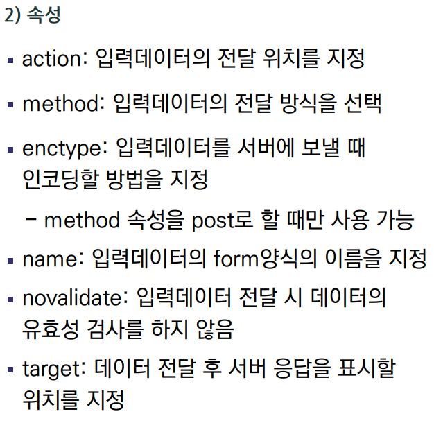
### input 태그
* 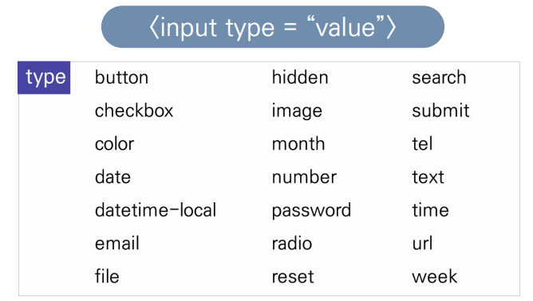
* input 태그의 type 속성을 이용하여 원하는 컨트롤을 선택하여 생성함
## 2. textarea, select 태그
### textarea 태그
* 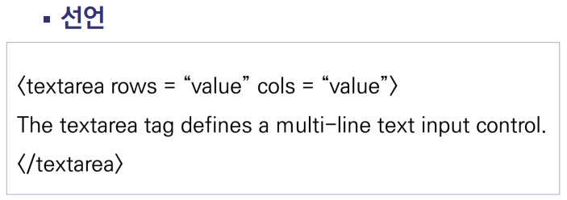
* 여러 줄 텍스트 입력할 때는 textarea 태그를 이용하여 선언하며 텍스트 입력 문자 수는 무제한으로 입력할 수 있지만 maxlength 속성을 이용하여 글자 수를 제한할 수 있음
### select 태그
* 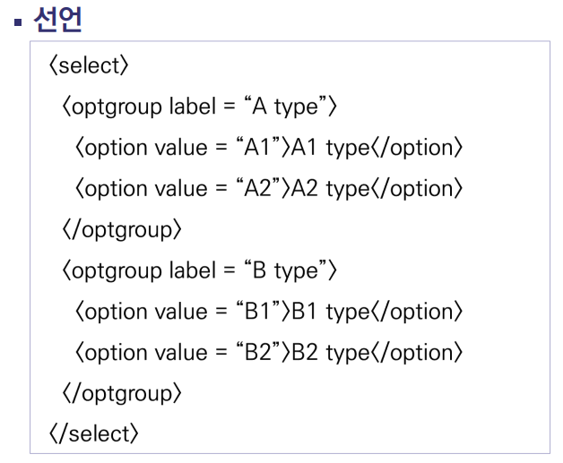
* select 태그는 드랍다운 목록을 정의함
* option 태그를 이용하여 목록의 항목을 정의함
* optgroup 태그를 이용하여 목록의 항목을 그룹화할 수 있음
## 3. fieldset, legend 태그
* 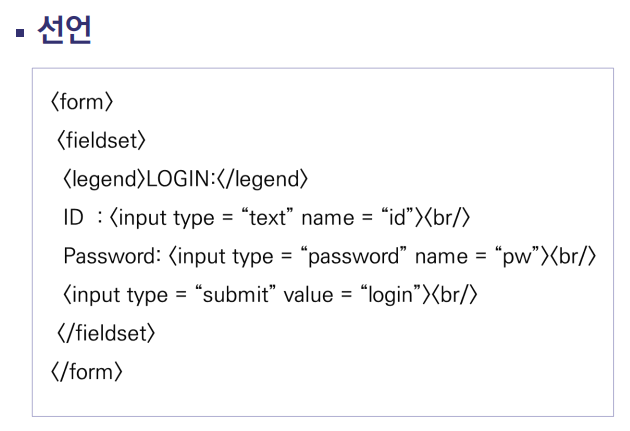
* 양식의 관련 요소를 그룹화하는데 사용하며 그룹화한 캡션은 legend 태그를 이용하여 정의함
* legend 태그는 field set 태그와 함께 사용하기도 하지만 독립적으로 사용할 수 있음


---
# 6차시	HTML5 영역 태그
## 1. div, span 영역 태그
* div, span 태그는 웹 페이지의 영역을 정의하는 태그로서 사용됨
* div 태그는 block 영역을 정의하면 span 태그는 inline block 영역을 나타냄
* CSS 스타일을 지정하거나 JavaScript로 특정 작업을 수행하기 위해 다른 HTML요소의 컨테이너로 사용됨
## 2. HTML5 시멘틱 구조 태그
### 시멘틱 웹
* 의미론적 웹이라는 뜻으로 리소스에 대한 정보와 자원 사이의 관계-의미 정보를 컴퓨터가 처리할 수 있는 형태로 표현함
* 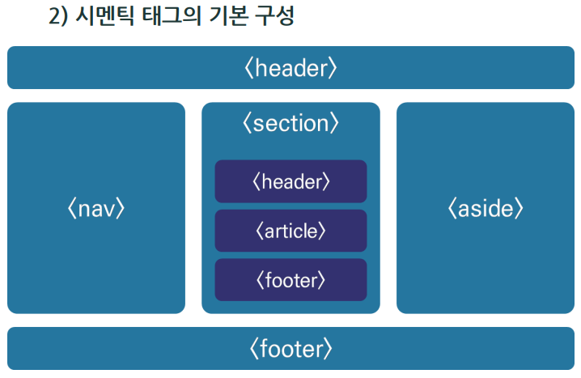
### 시멘틱 태그
  * header: 문서의 서론이나 섹션의 목차, 검색, 로고 등이 들어가는 곳
  * nav: 페이지 이동을 위한 메뉴들이 모여 있는 곳
  * aside: 사이드에 위치하는 공간으로 보조 메뉴나 광고, 위젯 등을 배치하는 곳
  * section: 여러 중심 내용을 감싸는 공간
  * article: 글자가 많이 들어가는 부분을 의미하며 컨텐츠의 내용이 들어가는 부분
  * footer: 저작자의 정보가 들어가는 부분으로 화면의 하단에 주로 위치


---
# 7차시	CSS와 선택자
## 1. CSS, 선택자 개요
* CSS는 HTML, XHTML, XML 같은 문서의 스타일을 꾸밀 때 사용하는 스타일 시트 언어임
* 글꼴이나, 배경색, 너비와 높이, 위치 등 레이아웃을 지정할 수 있음
* CSS 파일 하나만 수정하면 같은 CSS 파일을 쓰는 HTML 문서가 한번에 수정됨
* CSS 블록은 선택자, 스타일 속성, 스타일 값으로 구성됨
  * 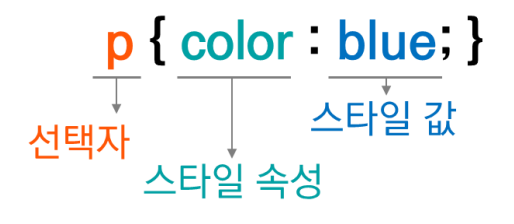
* 선택자를 사용하는 이유는 HTML 요소를 찾기 위해 이름, ID, 클래스, 특성 등을 지정하여 원하는 스타일 기능을 적용할 수 있음
  * 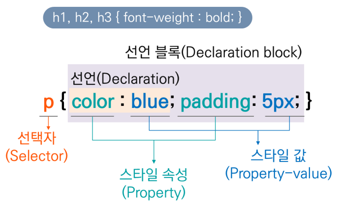
* 선택자는 기본적으로 가지고 있는 우선순위 규칙을 가지고 있고 우선순위가 같은 그룹에 속해 있다면 선택자의 종류와 수에 따라 우선순위가 결정됨
* 일반적으로 HTML 문서의 전반적인 스타일을 적용 후 구체적인 선택자는 일반적인 선택자보다 우선순위를 높여서 스타일을 적용해야 함
  * 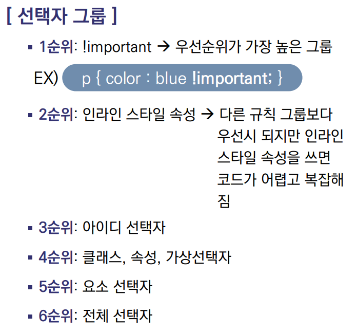
## 2. 선택자 종류
* 전체 선택자는 *으로 선언하며 HTML 페이지 내부의 모든 태그를 선택함
* 타입 선택자는 태그명이 element인 특정 태그를 선택함
* 클래스 선택자는 .className으로 선언하며 지정된 요소를 찾아서 선택함
* ID 선택자는 #id로 선언하며 지정된 id 속성값을 찾아서 선택함
* 속성 선택자는 속성값의 조건에 따라 다양한 스타일을 지정할 수 있음


---
# 8차시	CSS3 스타일
## 1. CSS3 단위 및 그레디언트
* CSS 속성은 width, margin, padding, font-size, border-width 등과 같이 길이값을 사용함
* 단위는 절대 단위와 상대 단위 2가지 유형이 있음
  * 절대 길이 단위: 화면크기가 다양하기 때문에 사용하지 않는 것을 권장함
  * 상대 길이 단위: 다른 길이 등록 정보와 관련된 길이를 지정함
* 색상의 단위 종류: HEX 코드, RGB, RGBA, HSL, HSLA
  * 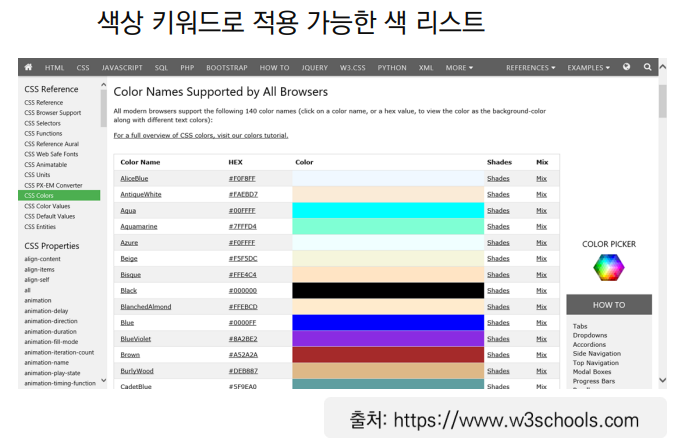
* URL 함수를 이용하여 이미지 파일이나 폰트 파일을 불러올 때 사용함
A* 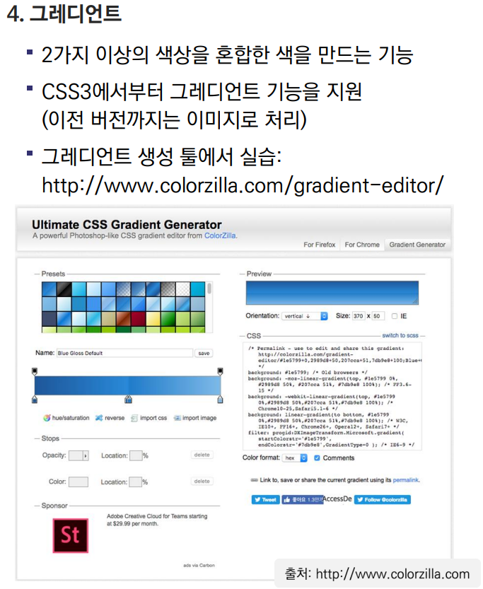
## 2. CSS3 속성
* 가시 속성은 태그가 화면에 보이는 방식을 지정하는 속성임
* 박스 속성은 웹페이지의 레이아웃을 구성할 때 가장 중요한 스타일 속성임
* margin, border, padding, width, height로 구성됨
* 배경 속성을 이용하여 배경 이미지를 변경하거나 크기 그리고 반복 설정할 수 있음
* 폰트 속성을 이용하여 폰트의 종류, 크기, 기울기, 두께 정렬 방식을 결정할 수 있음
* 위치 속성은 절대적 위치 좌표와 상대적 위치 좌표를 이용하여 요소의 위치를 결정할 수 있음
* float 속성은 태그 요소가 어떻게 떠다니는지 지정할 수 있으며 절대적 위치를 사용하는 요소는 float 속성을 무시함


---
# 9차시	레이아웃
## 1. 웹페이지 레이아웃
### 레이아웃 요소
* 웹사이트는 여러 열로 구분되어 내용을 표시함
* HTML5에서는 시멘틱 구조로 영역을 구분함
* 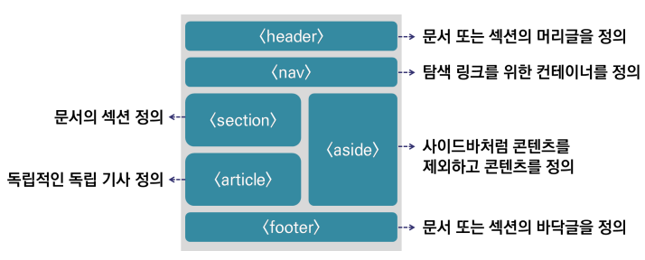
* 영역 분할 순서
  * 웹페이지 구성 → 구성 영역 분리 → 구성 영역을 행 단위로 분리 → 나누어진 행의 내부 요소를 분리
## 2. 반응형 웹페이지 레이아웃
* 웹사이트 레이아웃을 만들 때 유저가 사용하는 모니터의 화면 해상도를 고려해야 함
* 고려하지 않고, 제작할 경우 콘텐츠를 보는 데 불편함
* 반응형 웹은 사용자의 해상도를 고려하여 화면을 구성함
### 미디어 쿼리
* @media를 이용하여 해상도에 따라 레이아웃을 지정함
  * 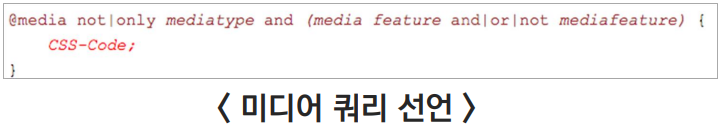
### 뷰포트
* 브라우저의 화면에 대한 특별한 정보를 제공하기 위하여 뷰포트 meta 태그를 사용함
  * 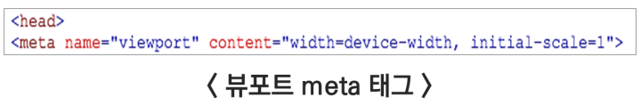


---
# 10차시 자바스크립트
## 1. 자바스크립트(JavaScript)
### 개념
* 웹페이지를 동적으로 콘텐츠를 바꾸고, 프로그래밍적으로 제어하기 위해 고안된 언어로서 객체기반의 스크립트 언어
### 문법
* 자바스크립트의 실행문은 세미콜론( ; ) 구분
* 대소문자를 구분함
* 상수(Literal)는 직접 표현되는 값 그 자체를 의미
### 식별자 작성방식
* Camel Case 방식
  * `var firstVar = 10;`
* Underscore Case방식
  * `var second_var = 20;`
### 주석
* 한 줄 주석 : `// 주석문`
* 여러 줄 주석 : `/* 주석문 */`
### 출력
* 자바스크립트로 HTML 페이지에 출력을 할 수 있음
* 방법
  * window.alert()
  * HTML DOM 요소를 이용한 innerHTML프로퍼티
    * 
  * document.write(), console.log()
    * 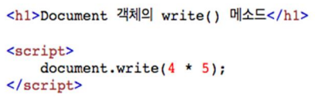
* HTML 어디서든 자바스크립트를 사용할 수 있지만 외부 파일로 따로 관리하는 것이 유지보수 및 가독성에 좋음
### 적용방법
* 내부 자바스크립트 코드로 적용
  * head, body 어디에 추가하든 상관없음
  * 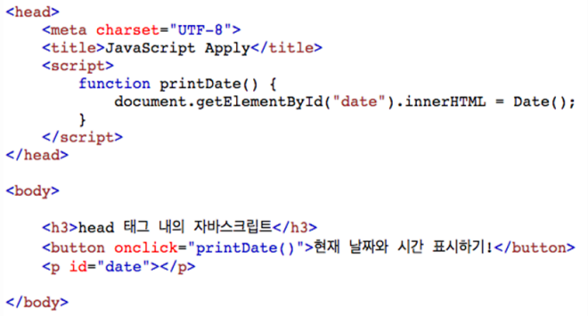
* 외부 자바스크립트 파일로 적용
  * HTML 코드와 자바스크립트 코드를 분리하면 유지보수 및 가독성이 좋음
  * 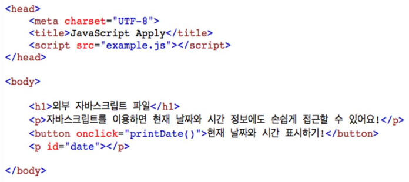
### 타입과 연산자
* 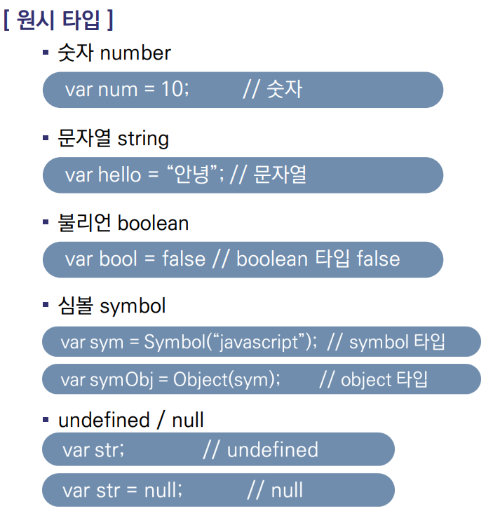 
* 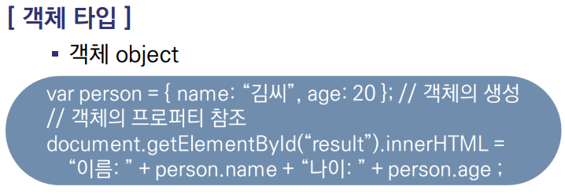
* 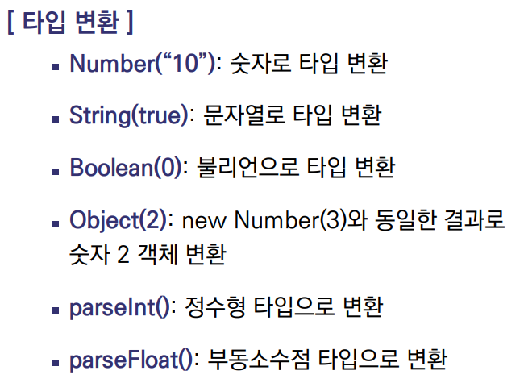
* 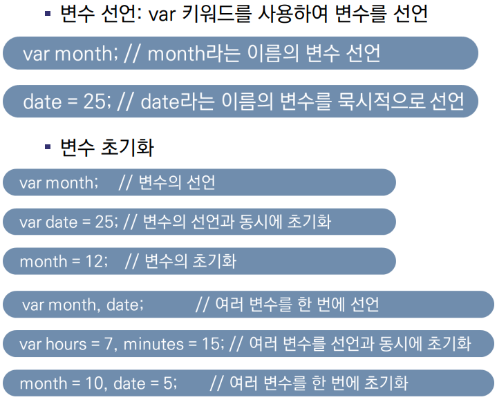
* 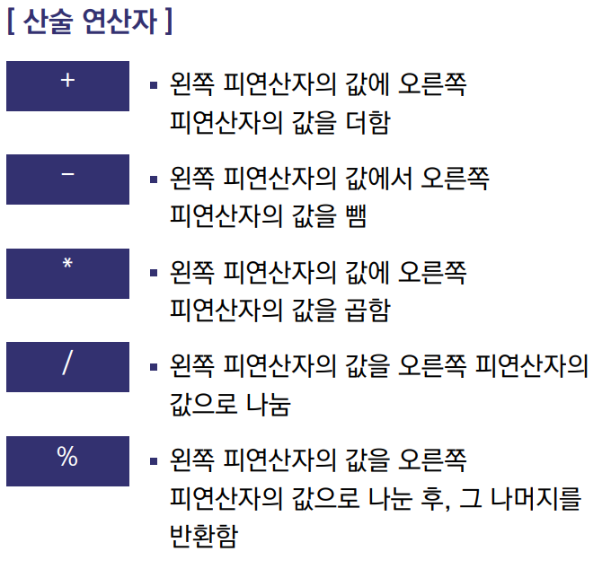
* 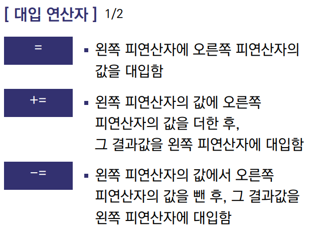
* 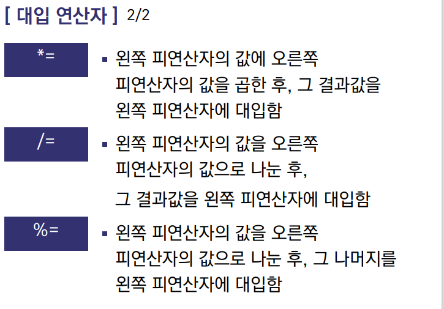
* 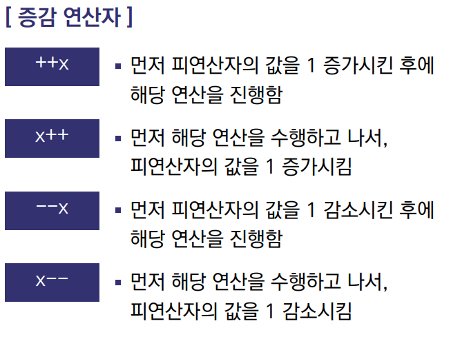
* 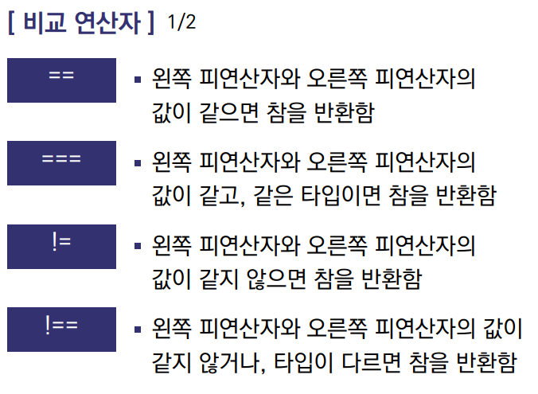
* 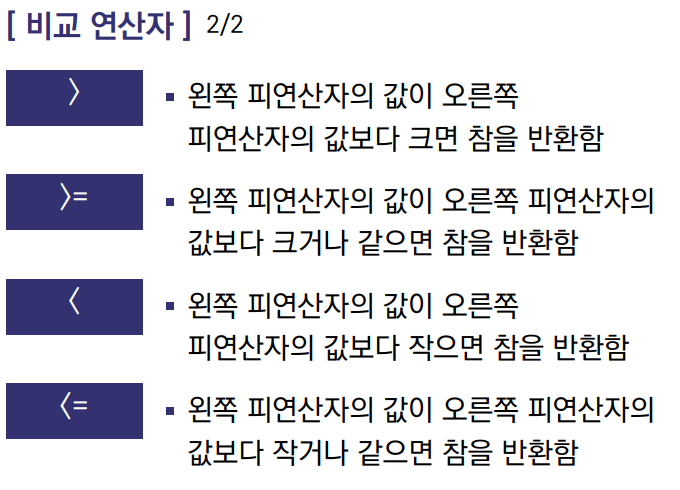
* 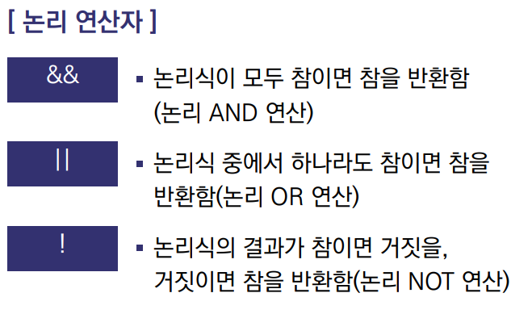

## 2. 함수와 제어문
### 자바스크립트 함수
* 하나의 특별한 목적의 작업을 수행하도록 설계된 독립적인 블록
* 자바스크립트에서는 함수도 하나의 데이터 타입
### 자바스크립트 함수의 특징
* 함수를 변수에 대입하거나 함수에 프로퍼티를 지정하는 것도 가능
* 다른 함수 내에 중첩되어 정의 가능
* function 키워드로 선언하며 중괄호({ }) 안에 자바스크립트 내부 실행문을 넣어서 작성함
* 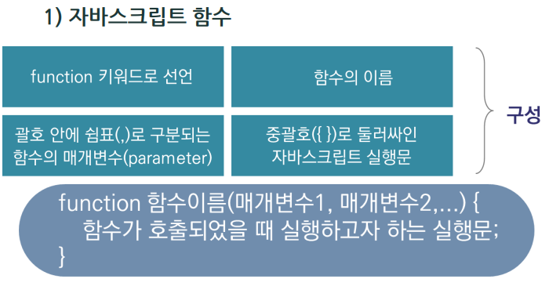
### 반환문
* return키워드를 사용해 특정한 목적을 수행하고 결과를 반환 받음
* 함수의 실행을 중단할 수 있음
* 배열이나 객체를 포함한 모든 타입의 값 반환 가능
* 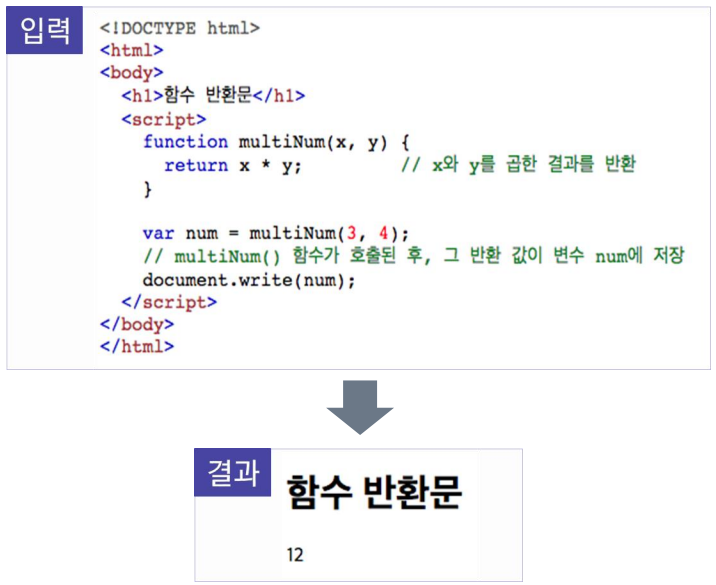
### 함수의 유효 범위
* 전역 변수 vs 지역 변수
* 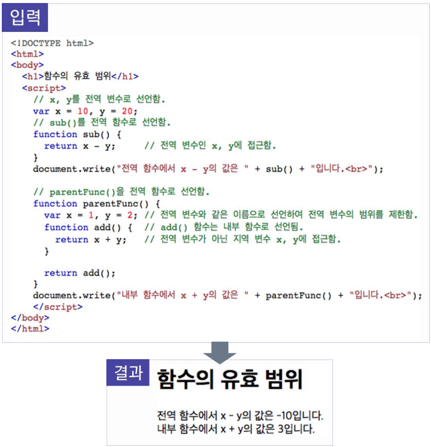
### 함수 호이스팅
* 자바스크립트 함수 안에 있는 모든 변수의 선언은 함수의 맨 처음으로 이동한 것처럼 동작
* 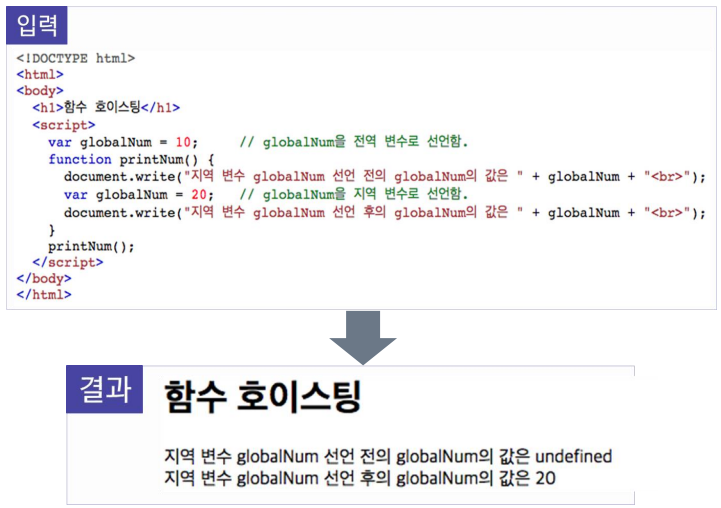
### 조건문
* 조건문은 프로그램 내에서 주어진 표현식의 결과에 따라 별도의 명령을 수행하도록 제어함
  1. If 문
     * 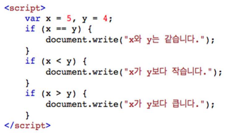
  2. If - else 문
     * 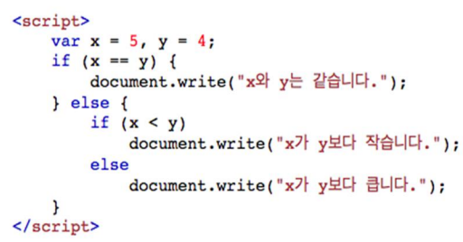
  3. if - else if - else 문
     * 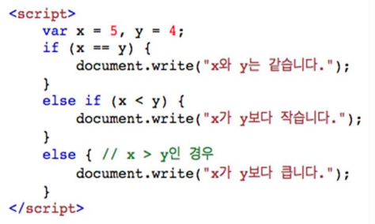
  4. 삼항 연산자 조건문
     * 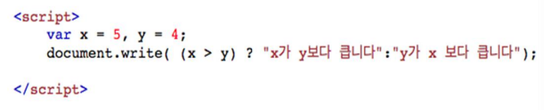
  5. switch 문
     * 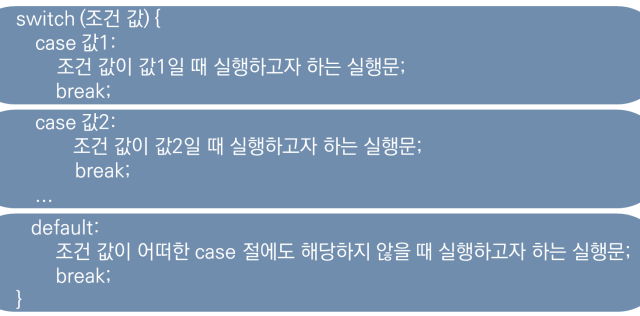
### 반복문
* 반복문은 특정 조건을 만족할 때까지 계속해서 주어진 실행문을 반복 실행함
  1. while 문 
    * 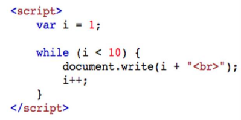
  2. do-while 문 
    * 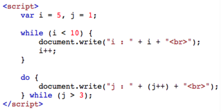
  3. for 문
    * 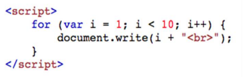
  4. for - in 문
    * 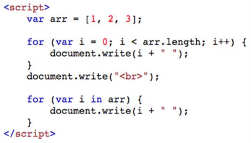
  5. for - of 문
    * 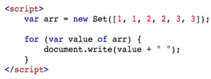


---
---
# 0408
# 화면구현 part2


---
# 11차시 jQuery 기본
## 1. jQuery 개요
* 자바스크립트 언어를 간편하게 사용할 수 있도록 단순화시킨 오픈소스 기반의 자바스크립트 라이브러리로 HTML의 클라이언트 사이드 조작을 단순화 하도록 설계됨
* jQuery 라이브러리는 jQuery라는 이름의 객체로 생성됨
* 중복되는 기능과 코드가 엉키는 것을 피하고 이미 개발된 많은 플로그인을 쉽고 빠르게 이용할 수 있음
* 브라우저마다 다르게 발생하는 이벤트, 객체 등을 처리하고자 여러 개의 메서드를 사용하지 않고 jQuery에서 제공되는 메서드 또는 문장으로 간단하게 해결 가능함
* jQuery 파일은 자바스크립트 파일(.js)형태로 존재하며 사용하기 위하여 웹페이지에 로드해야 함
  * 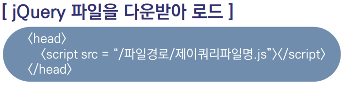
  * 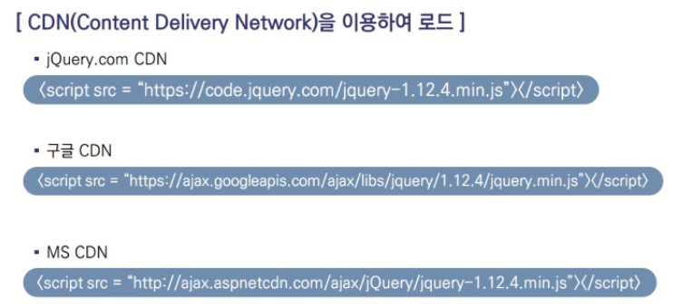
* `$` 기호는 jQuery를 의미하고 이를 접근할 수 있게 하는 식별자이고 동작 함수를 정의하여 선택된 요소에 원하는 동작을 설정함
  * 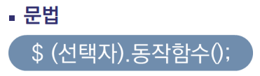
* 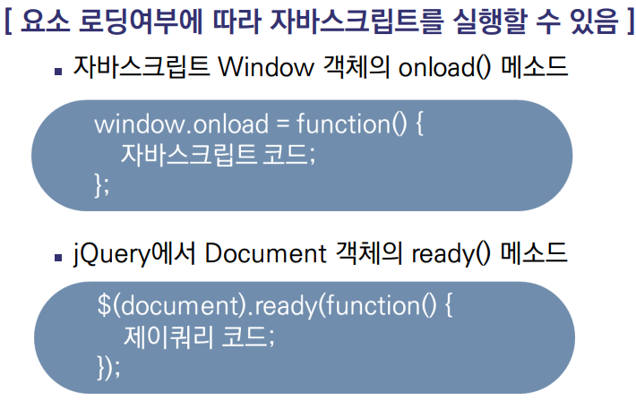
## 2. jQuery 응용
* 선택자를 이용하여 적용할 요소를 선택하고 선택자는 CSS선택자 및 jQuery 선택자를 이용함
    ```js
    $("*")                        // 모든 요소 선택
    $(this)                       // 현재 html 요소 선택
    $("p.intro")                  // 클래스명이 intro인 모든 <p> 요소 선택
    $("p:first")                  // 첫번째 <p> 요소들 선택
    $("ul li:first")              // 첫번째 <ul>의 첫번째 <li> 요소 선택
    $("ul li:first-child")        // 모든 <ul>의 첫번째 <li> 요소들 선택
    $("[href]")                   // href 속성을 가진 모든 요소 선택
    $("a[target = '_blank']")     // _blank 값과 같은 target 속성을 가진 모든 <a> 요소 선택
    $("a[target! = '_blank']")    // _blank 값과 같지 않은 target 속성을 가진 모든 <a> 요소 선택 
    $(":button")                  // button 타입인 모든 <input> 요소와 모든 <button> 요소 선택
    $("tr:even")                  // 모든 짝수인 <tr> 요소 선택
    $("tr:odd")                   // 모든 홀수인 <tr> 요소 선택
    ```
* HTML 요소를 탐색할 수 있는 기능을 제공하며 요소의 스타일(프로퍼티) 를 설정할 수 있음
* 사용자가 마우스를 움직이거나 클릭하거나 텍스트 박스에 글을 쓰는 등 모든 동작들을 이벤트라고 하며 특정 요소에 이벤트 핸들러를 연결하여 지정된 이벤트를 웹브라우저에서 동작하게 함
* 태그 요소 조작 : 선택자
  ```js
  // 필터링에 사용 가능한 선택자
  :eq(n)
  :gt(n)
  :lt(n)
  :even
  :odd
  :first
  :last
  :animated
  :header
  :lang(언어)
  :not
  :root
  :target
  :contains(텍스트)
  :has(선택자)
  :empty
  :parent
  
  // input요소를 선택할 수 있는 선택자
  :button
  :checkbox
  :file
  :image
  :password
  :radio
  :reset
  :submit
  :text
  :input
  :checked
  :selected
  :focus
  :disabled
  :enabled
  ```
* 태그 요소 조작 : 탐색
  ```js
  // 조상 요소 탐색
  .parent()
  .parents()
  .paraentsUntil()
  .closest()

  // 형제 요소 탐색
  .siblings()
  .next()
  .nextAll()
  .nextUntil()
  .prev()
  .prevAll()
  .prevUntil()

  // 자손 요소 탐색
  .children()
  .find()
  
  // 기타 탐색
  .add()
  .addBack()
  .each()
  .end()
  .offsetParent()
  .contents()
  ```
* 스타일 메소드
  ```js  
  // 프로퍼티 설정
  .css()
  .attr()
  .prop()
  .removeAttr()
  .removeProp()

  // 클래스 설정
  .addClass()
  .removeClass()
  .ToggleClass()
  .hasClass()
  ```
* 이벤트 메소드
  ```js
  // 이벤트 연결
  .on()

  // 마우스 이벤트 메소드
  .click()
  .dblclick()
  .hover()
  .mousedown()
  .mouseenter()
  .mouseleave()
  .mousemove()
  .mouseout()
  .mouseover()
  .mouseup()

  // 키보드 이벤트 메소드
  .keydown()
  .keyup()
  .keypress()

  // 입력 양식 이벤트 메소드
  .blur()
  .change()
  .select()
  .submit()
  .focus()
  .focusin()
  .focusout()
  ```


---
# 12차시 jQuery 활용
## 1. jQuery UI 위젯
* jQuery UI 인터랙션
  1. 인터렉션
     * Draggable: 마우스 드래그로 엘리먼트를 이동함
     * Droppable: 엘리먼트 위에 드래그한 엘리먼트를 드롭할 수 있도록 이벤트 감지
     * Resizeable: 엘리먼트의 크기를 변경할 수 있는 UI 제공
     * Selectable: 엘리먼트를 선택할 수 있는 UI를 제공
     * Sortable: 엘리먼트를 정렬할 수 있는 UI를 제공
  2. 위젯
     * Accordion: 아코디언 형태의 UI를 제공
       * 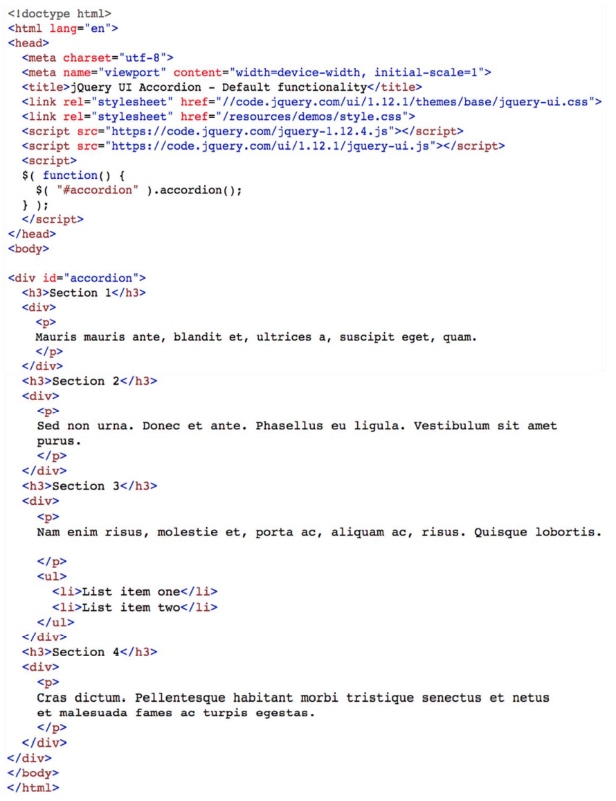
       * 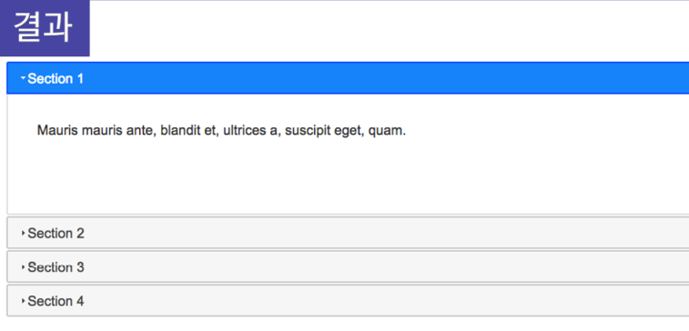
     * Autocomplete: 자동완성 기능과 UI를 제공
       * 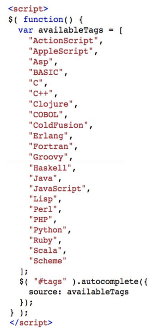
       * 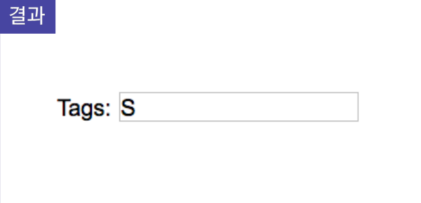
     * Button: 엘리먼트 버튼처럼 보이도록 하는 UI를 제공
     * Datepicker: 날짜 선택 도구 UI를 제공
       * 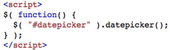
       * 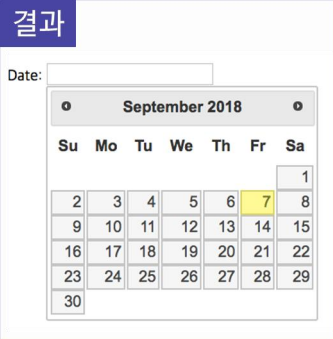
     * Dialog: 알림창 레이어를 띄울 수 있는 UI를 제공
     * Progressbar: 진행 막대 UI를 제공
       * 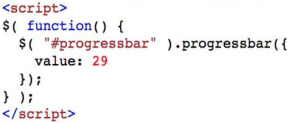
       * 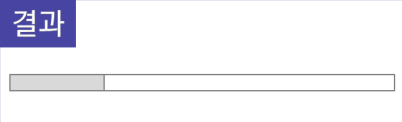
     * Slider: 슬라이더 막대 형식의 입력도구를 제공
       * 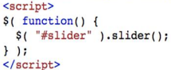
       * 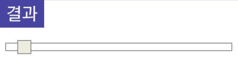
     * Tabs: 탭 메뉴 형식의 UI를 제공
       * 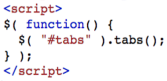
       * 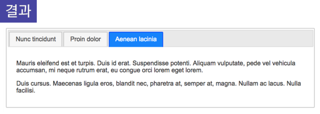
* jQuery UI 위젯 지원 종류
  * Accordion, Autocomplete, Button, Datapicker, Dialog, Progressbar, Slider, Tabs UI
## 2. jQuery UI 위젯 및 플러그인 실습
* jQuery 공식 홈페이지에서는 유저들이 jQuery를 이용하여 만든 플러그인을 등록하고 이를 검증하여 많은 사람들이 사용할 수 있도록 제공함
  > https://plugins.jquery.com
* UI를 구성할 때 직접 만들어 사용할 수 있지만 이미 공개되어 있는 플러그인을 활용하여 작성하면 개발 시간을 단축 시킬 수 있음


# 과제
* 회원가입 입력 폼 작성
* 아이디, 비밀번호, 이름, 이메일 정보를 입력받는다.
* form, label, input, button 사용
## 답안
```html
<h3>회원가입</h3>
<form name="login">
  
  <label for="name">아이디</label>
  <input type="text" id="name" placeholder="아이디를 입력하세요." required>

  <label for="password">비밀번호</label>
  <input type="password" id="password" placeholder="비밀번호를 입력하세요." required>

  <label for="id">이름</label>
  <input type="text" id="name" autofocus required>

  <label for="email">이메일</label>
  <input type="email" id="email"  placeholder="이메일을 입력하세요" required>

  <button type="submit">가입 완료</button>

</form>
```