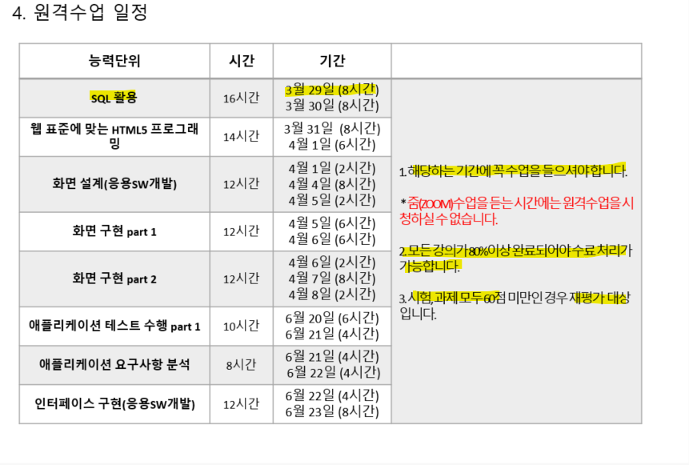

>   
> [jhta.step.or.kr](https://jhta.step.or.kr)

# 0621
# 애플리케이션 테스트 수행 part1

- [0621](#0621)
- [애플리케이션 테스트 수행 part1](#애플리케이션-테스트-수행-part1)
  - [7차시 단위 기능 테스트 실행](#7차시-단위-기능-테스트-실행)
    - [단위 기능 테스트 실행](#단위-기능-테스트-실행)
  - [8차시 통합 기능 테스트 계획서 확인](#8차시-통합-기능-테스트-계획서-확인)
    - [통합 기능 테스트 계획서 확인](#통합-기능-테스트-계획서-확인)
  - [9차시 통합 기능 테스트 실행](#9차시-통합-기능-테스트-실행)
    - [통합 기능 테스트 실행](#통합-기능-테스트-실행)
  - [10차시 테스트 커버리지](#10차시-테스트-커버리지)
    - [테스트 커버리지](#테스트-커버리지)
    - [참고문헌](#참고문헌)
- [애플리케이션 요구사항 분석](#애플리케이션-요구사항-분석)
  - [1차시 애플리케이션 요구사항 분석 개요](#1차시-애플리케이션-요구사항-분석-개요)
    - [애플리케이션요구사항관리의개념및필요성](#애플리케이션요구사항관리의개념및필요성)
    - [애플리케이션 요구사항의 유형](#애플리케이션-요구사항의-유형)
    - [애플리케이션 요구사항의 관리 프로세스](#애플리케이션-요구사항의-관리-프로세스)
  - [2차시 애플리케이션 요구사항 도출 기법 및 프로세스](#2차시-애플리케이션-요구사항-도출-기법-및-프로세스)
    - [집단 창의력 및 집단 의사 결정 기법](#집단-창의력-및-집단-의사-결정-기법)
    - [프로토타이핑 기법](#프로토타이핑-기법)
  - [3차시 애플리케이션 요구사항 분석 기법](#3차시-애플리케이션-요구사항-분석-기법)
    - [사용자 시나리오 및 유스케이스 기반 분석](#사용자-시나리오-및-유스케이스-기반-분석)
    - [데이터 모델 및 객체 행위 기반 분석](#데이터-모델-및-객체-행위-기반-분석)
    - [페르소나 기반 분석](#페르소나-기반-분석)
    - [MVP(Minimum Viable Product) 기반분석](#mvpminimum-viable-product-기반분석)
  - [4차시](#4차시)
    - [애플리케이션 요구사항 분류](#애플리케이션-요구사항-분류)
    - [애플리케이션 요구사항 우선순위 할당](#애플리케이션-요구사항-우선순위-할당)

<small><i><a href='http://ecotrust-canada.github.io/markdown-toc/'>Table of contents generated with markdown-toc</a></i></small>

---
## 7차시 단위 기능 테스트 실행
### 단위 기능 테스트 실행
* 단위 기능 테스트 실행을 위하여 테스트 관리 시스템에서 테스트 케이스를 확인
* 애플리케이션을 실행하여 단위 기능 테스트를 실행
* 애플리케이션 단위 기능 테스트 수행 도중 결함이 발생하면 테스트 관리 시스템에 등록하고 테스트는 실패로 처리
* 개발자가 결함 수정을 완료하면 애플리케이션 테스터는 해당 결함을 재 테스트
* 애플리케이션 테스터가 해당 결함을 재 테스트한 결과, 결함 수정이 완료되었으면 테스트 관리 시스템에서 해당 결함을 종료

## 8차시 통합 기능 테스트 계획서 확인
### 통합 기능 테스트 계획서 확인
* 통합 기능 테스트의 목적과 범위를 명확하게 확인
* 통합 기능 테스트의 수행 절차를 이해해야 하며, 특히, 테스트 수행 절차, 결함 관리 절차에 대하여 이해해야 함
* 테스터가 수행할 통합 기능 테스트 케이스를 확인하고, 실제 화면을 보면서 샘플 데이터를 입력하여 오류가 없는지 확인
* 테스트 데이터는 충분히 있는지, 테스트 환경 구성은 어떻게 되어 있는지 확인
* 테스트 시작 및 종료 기준에 대해서 명확하게 이해

## 9차시 통합 기능 테스트 실행
### 통합 기능 테스트 실행
* 통합 기능 테스트 케이스 확인
* 통합 기능 테스트를 실행 시, 결함이 발생하면 테스트 관리 시스템에 결함을 등록
* 결함을 등록하는 가장 효과적인 방법은 결함이 발생한 화면을 캡처하여 붙이는 것
* 개발자가 결함 수정을 완료하면 테스터는 해당 결함을 재 테스트 하여 결함의 수정 여부를 확인
* 통합 기능 테스트 실행은 테스트 결과가 예상 결과와 같을 때에 합격 처리

## 10차시 테스트 커버리지
### 테스트 커버리지
* 테스트 커버리지: 테스트 수행에 있어서 테스트의 품질을 측정할 수 있는 도구
* 테스트 커버리지: 구문, 조건, 결정, 조건/결정, 변경조건/결정, 다중조건 커버리지 등
* 테스트 커버리지 측정 기대효과: 객관적인 품질 지표 생성, 테스트 완성도 측정 가능, 테스트 완료 시점 예측 가능 등
* 테스트 커버리지는 통합 테스트 이전 단계에는 개발 및 단위 테스트 커버리지 측정에 활용하고, 통합 테스트 단계에서는 차수가 지속되는 동안 테스트 커버리지 누적 기능을 활용하여 지속적인 커버리지 측정이 가능
### 참고문헌
> - 권원일 외 3명 저, 개발자도 알아야 할 소프트웨어 테스팅 실무 3편, ISTQB, 2015년
> - NIPA/STA 테스트컨설팅, 소프트웨어 테스트 실무 가이드, STA테스팅컨설팅, 2012년

---
# 애플리케이션 요구사항 분석

## 1차시 애플리케이션 요구사항 분석 개요
### 애플리케이션요구사항관리의개념및필요성
- 요구사항이란 시스템 개발 분야에서 어떤 과제를 수행하기 위하여 필요한 조건이나 능력을 말함
- 애플리케이션 요구사항이란 애플리케이션의 문제를 해결하거나 목적 달성을 위하여 사용자가 원하는 조건 혹은 역량임
- 애플리케이션 요구사항 관리는 사용자 요구사항을 식별, 분석, 명세, 변경, 추적, 검증하는 활동임
### 애플리케이션 요구사항의 유형
- 요구사항: 기능, 비기능, 기타 요구사항
- 비기능 요구사항: 성능, 데이터, 테스트, 보안 등
### 애플리케이션 요구사항의 관리 프로세스
- 식별, 분석, 명세, 변경, 검증

## 2차시 애플리케이션 요구사항 도출 기법 및 프로세스
### 집단 창의력 및 집단 의사 결정 기법
- 집단 창의력 기법 : 브레인스토밍, 명목집단기법, 아이디어/ 마인드매핑 기법, 친화도 기법 등
- 집단 의사 결정 기법 : 만장일치, 다수결, 과반수, 단독의사 결정 기법
### 프로토타이핑 기법
- 제품의 실제 제작에 앞서 예상 제품의 작동 모형을 제공하여 요구사항에 대한 초기 피드백을 구하는 기법

## 3차시 애플리케이션 요구사항 분석 기법
### 사용자 시나리오 및 유스케이스 기반 분석
- 사용자 시나리오 기반 분석은 애플리케이션 제품에 대하여 사용자가 실제로 사용하는 시나리오를 분석함
- 유즈케이스 기반 분석은 UML의 유즈케이스를 기반으로 요구사항을 분석하는 기법임
### 데이터 모델 및 객체 행위 기반 분석
- 데이터 모델 기반 분석:사용자 요구사항에서 데이터 모델을 추출하여 이를 기반으로 시스템의 구조를 분석함
- 객체 행위 기반 분석: 객체 간의 행위(Behavior)를 분석함으로써 사용자요구사항을보다 상세하게 분석함
### 페르소나 기반 분석
- 어떤 제품 혹은 서비스를 사용할만한 목표 인구 집단 안에 있는 다양한 사용자 유형들을 대표하는 가상의 인물을 내세워 이들의 요구사항을 분석함
### MVP(Minimum Viable Product) 기반분석
- 제품의 중요 기능만 최소로 구현하여 고객의 피드백을 받은 후, 이를 반복하면서 지속적으로 제품의 품질을 향상시키는 기법임
- 린 스타트업 방법론에서 제품을 개발하기 위한 수단으로 MVP기법을 많이 사용함

## 4차시 
### 애플리케이션 요구사항 분류
- 애플리케이션 요구사항은 기능 요구사항, 비기능 요구사항, 기타 요구사항으로 분류함
- 기능 요구사항은 애플리케이션이 수행해야할 기능적 측면의 요구사항을 의미함
- 기능 요구사항은 사용자 요건 도출, 요구사항 상세화, 기능 점수 산출 단계로 나누어짐
- 비기능 요구사항은 기능을 제외한 성능, 품질, 보안 등의 요구사항을 의미함
### 애플리케이션 요구사항 우선순위 할당
- 페어와이즈 비교 기법은 요구사항을 둘씩 비교하여 우선순위를 선정하는 기법임
- 비용-가치 기법은 요구사항에 대한 구현 비용과 가치를 비교하여 우선순위 선정함
- 100달러 할당 기법은 이해관계자가 각각의 요구사항에 가상의 돈을 할당하여 우선순위 산정함
- MoSCoW기법은 필수, 희망, 선택, 보류로 요구사항을 분류하여 우선순위 산정함