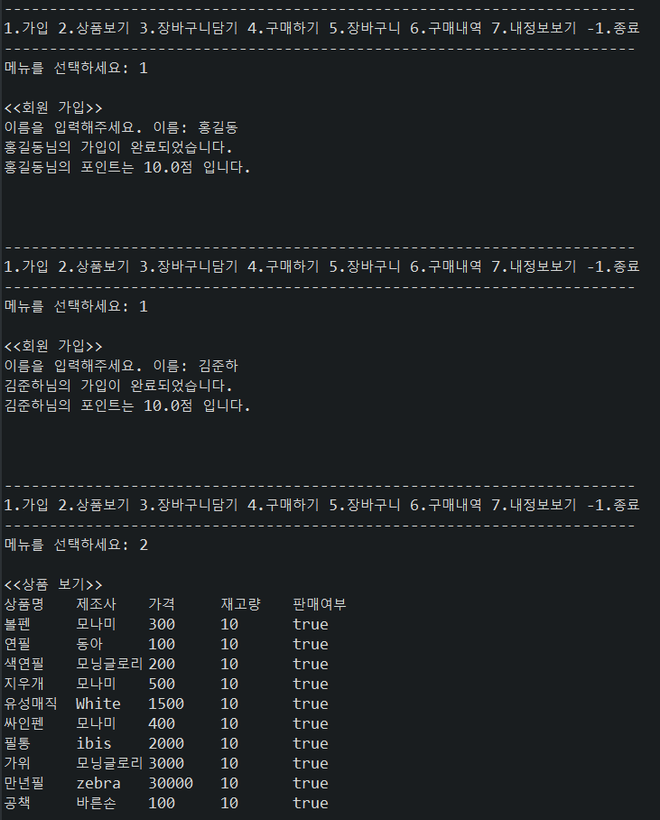
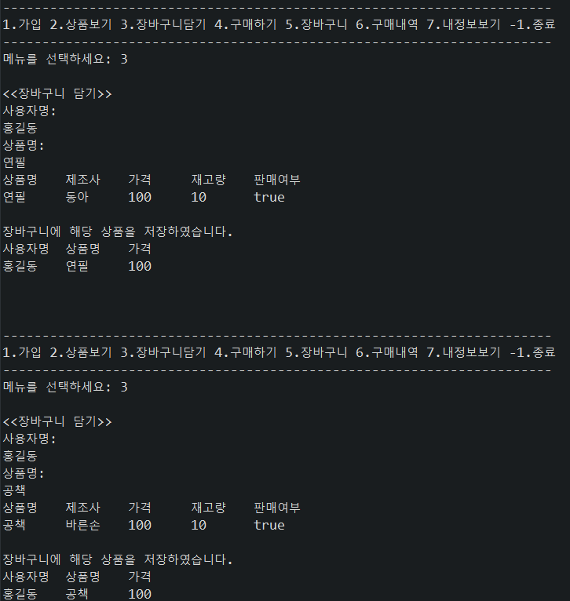
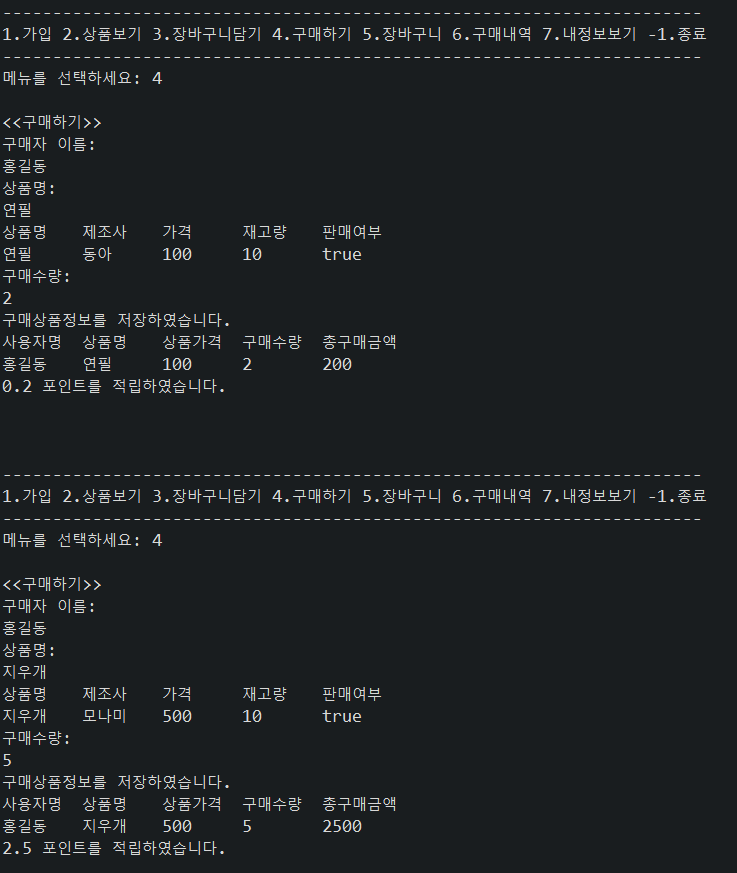
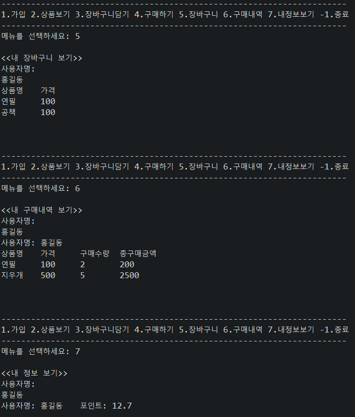
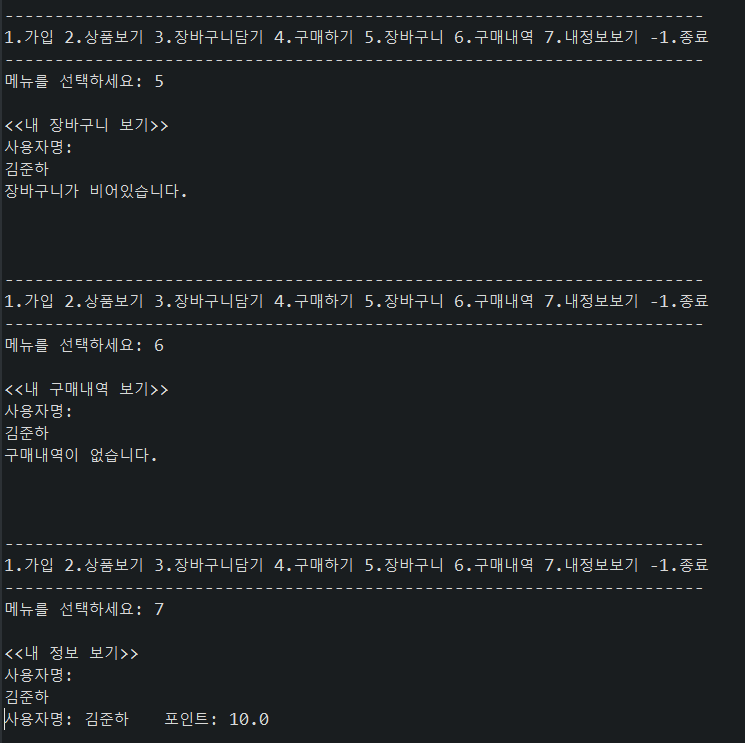

- [0318](#0318)
	- [과제 - Store App](#과제---store-app)
		- [추가과제](#추가과제)
		- [과제 작성 코드](#과제-작성-코드)
			- [store.java](#storejava)
			- [UserRepository.java](#userrepositoryjava)
			- [ProductRepository.java](#productrepositoryjava)
			- [OrderItemRepository.java](#orderitemrepositoryjava)
			- [CartItemRepository.java](#cartitemrepositoryjava)
		- [작성 과정](#작성-과정)
			- [주의사항 및 신경쓴 점.](#주의사항-및-신경쓴-점)
			- [실행결과](#실행결과)
- [0319](#0319)
	- [과제2 Store 앱 기능 추가](#과제2-store-앱-기능-추가)
		- [과정](#과정)
		- [작성코드](#작성코드)
			- [Store.java](#storejava-1)
			- [CartItem.java](#cartitemjava)
			- [CartItemRepository.java](#cartitemrepositoryjava-1)
			- [ProductItemRepository.java](#productitemrepositoryjava)
	- [Store app1 코드 추가 수정](#store-app1-코드-추가-수정)
		- [과정](#과정-1)
			- [Store.java](#storejava-2)
			- [UserRepository.java](#userrepositoryjava-1)
			- [ProductRepository.java](#productrepositoryjava-1)
			- [OrderItemRepository.java](#orderitemrepositoryjava-1)
			- [CartItemRepository.java](#cartitemrepositoryjava-2)

<small><i><a href='http://ecotrust-canada.github.io/markdown-toc/'>Table of contents generated with markdown-toc</a></i></small>

# 0318
## 과제 - Store App

* app1 만들기
  * 회원가입, 상품 조회, 장바구니 담기, 구매하기, 장바구니 조회, 구매내역 조회, 내 정보 조회 기능 구현.

### 추가과제
1. 장바구니에 같은 사람이 같은 상품을 못 담게
2. 장바구니의 메뉴 한꺼번에 구매 > 장바구니에서 삭제.

### 과제 작성 코드
#### store.java
```java
package app1;

public class Store {

	public static void main(String[] args) {
		KeyboardReader reader = new KeyboardReader();
		ProductRepository productRepo = new ProductRepository();
		UserRepository userRepo = new UserRepository();
		CartItemRepository cartItemRepo = new CartItemRepository();
		OrderItemRepository orderItemRepo = new OrderItemRepository();

		while (true) {
			System.out.println("\n\n");
			System.out.println("----------------------------------------------------------------------");
			System.out.println("1.가입 2.상품보기 3.장바구니담기 4.구매하기 5.장바구니 6.구매내역 7.내정보보기 -1.종료");
			System.out.println("----------------------------------------------------------------------");
			System.out.print("메뉴를 선택하세요: ");
			int menu = reader.readInt();
			System.out.println();

			if (menu == 1) {
				System.out.println("<<회원 가입>>");
				// 사용자명을 입력받는다.
				System.out.print("이름을 입력해주세요. 이름: ");
				String username = reader.readString();
				// User객체에 사용자명을 저장한다.
				User user = new User(username);
				// UserRepository객체의 saveUser(user)를 실행해서 사용자정보를 저장시킨다.
				userRepo.saveUser(user);
				System.out.println(user.name + "님의 " + "가입이 완료되었습니다.");
				System.out.println(user.name + "님의 " + "포인트는 " + user.point + "점 입니다.");

			} else if (menu == 2) {
				System.out.println("<<상품 보기>>");
				// ProductRepository객체의 getAllProduct()를 실행해서 모든 상품정보를 조회한다.
				Product[] products = productRepo.getAllProducts();
				// 조회된 상품정보를 회면에 출력한다.
				System.out.println("상품명\t제조사\t가격\t재고량\t판매여부");
				for (int i = 0; i < products.length; i++) {
					if (products[i] == null) {
						break;
					}
					System.out.println(products[i].name + "\t" + products[i].maker + "\t" + products[i].price + "\t"
							+ products[i].stock + "\t" + products[i].onSell);
				}

			} else if (menu == 3) {
				System.out.println("<<장바구니 담기>>");
				// 사용자명과 상품명을 입력받는다.
				System.out.println("사용자명: ");
				String username = reader.readString();
				// UserRepository객체에서 getUserByName(username)을 실행해서 사용자명에 해당하는 사용자정보(User)를
				// 조회한다.
				User user = userRepo.getUserByname(username);
				if (user == null) {
					System.out.println("[경고]" + username + " 사용자 정보를 찾을 수 없습니다.");
				} else {
					System.out.println("상품명: ");
					String name = reader.readString();
					// ProductRepository객체의 getProductByName(name)을 실행해서 상품명에 해당하는 상품정보를 조회한다.
					Product product = productRepo.getProductByName(name);

					if (product == null) {
						System.out.println("[경고]" + name + " 상품 정보를 찾을 수 없습니다.");
					} else {
						System.out.println("상품명\t제조사\t가격\t재고량\t판매여부");
						System.out.println(product.name + "\t" + product.maker + "\t" + product.price + "\t"
								+ product.stock + "\t" + product.onSell);
						// CartItem객체를 생성해서 사용자명, 상품명, 상품가격을 저장한다.
						CartItem cartItem = new CartItem(username, name, product.price);
						// CartItemRepository객체의 saveCartItem(cartItem)을 실행해서 장바구니아이템을 저장시킨다.
						cartItemRepo.saveCartItem(cartItem);
						System.out.println("\n장바구니에 해당 상품을 저장하였습니다.");
						System.out.println("사용자명\t상품명\t가격");
						System.out.println(cartItem.username + "\t" + cartItem.name + "\t" + cartItem.price);
					}
				}

			} else if (menu == 4) {
				System.out.println("<<구매하기>>");
				// 사용자명을 입력받는다.
				System.out.println("구매자 이름: ");
				String username = reader.readString();
				// UserRepository객체에서 getUserByName(username)을 실행해서 사용자명에 해당하는 사용자정보(User)를
				// 조회한다.
				User user = userRepo.getUserByname(username);
				if (user == null) {
					System.out.println("[경고]" + username + " 사용자 정보를 찾을 수 없습니다.");
				} else {
					// 상품명을 입력받는다.
					System.out.println("상품명: ");
					String name = reader.readString();
					// ProductRepository객체의 getProductByName(name)을 실행해서 상품명에 해당하는 상품정보(Product)를
					// 조회한다.
					Product product = productRepo.getProductByName(name);
					if (product == null) {
						System.out.println("[경고]" + name + " 상품 정보를 찾을 수 없습니다.");
					} else {
						System.out.println("상품명\t제조사\t가격\t재고량\t판매여부");
						System.out.println(product.name + "\t" + product.maker + "\t" + product.price + "\t"
								+ product.stock + "\t" + product.onSell);
						// 구매수량을 입력받는다.
						System.out.println("구매수량: ");
						int quantity = reader.readInt();
						// OrderItem객체를 생성해서 사용자명, 상품명, 상품가격, 구매수량을 저장한다.
						OrderItem orderItem = new OrderItem(user.name, product.name, product.price, quantity);
						// OrderItemRepository객체의 saveOrderItem(orderItem)을 실행해서 구매상품정보를 저장시킨다.
						orderItemRepo.saveOrderItem(orderItem);
						System.out.println("구매상품정보를 저장하였습니다.");
						System.out.println("사용자명\t상품명\t상품가격\t구매수량\t총구매금액");
						System.out.println(orderItem.username + "\t" + orderItem.name + "\t" + orderItem.price + "\t"
								+ orderItem.quantity + "\t" + orderItem.orderPrice);
						// 총구매금액의 0.1%를 사용자 포인트로 적립시킨다.
						double pointsEarned = orderItem.price * orderItem.quantity * 0.001;
						user.point = user.point + pointsEarned;
						System.out.println(pointsEarned + " 포인트를 적립하였습니다.");
						// 구매수량만큼 Product객체의 재고를 감소시킨다.
						product.stock = product.stock - quantity;
					}
				}

			} else if (menu == 5) {
				System.out.println("<<내 장바구니 보기>>");
				// 사용자명을 입력받는다.
				System.out.println("사용자명: ");
				String username = reader.readString();
				// UserRepository객체에서 getUserByName(username)을 실행해서 사용자명에 해당하는 사용자정보(User)를
				// 조회한다.
				User user = userRepo.getUserByname(username);
				if (user == null) {
					System.out.println("[경고]" + username + " 사용자 정보를 찾을 수 없습니다.");
				} else {
					// CartItemRepository객체의 getCartItemsByUsername(username)을 실행해서 사용자명에 해당하는
					// 장바구니아이템(CartItem[])을 조회한다.
					CartItem[] userCartItems = cartItemRepo.getCartItemsByUsername(username);
					// 조회된 장바구니 아이템 정보를 출력한다.
					if (userCartItems[0] == null) {
						System.out.println("장바구니가 비어있습니다.");
					} else {
						System.out.println("상품명\t가격");
						for (CartItem cartItem : userCartItems) {
							if (cartItem == null) {
								break;
							} else {
								System.out.println(cartItem.name + "\t" + cartItem.price);
							}
						}
					}
				}

			} else if (menu == 6) {
				System.out.println("<<내 구매내역 보기>>");
				// 사용자명을 입력받는다.
				System.out.println("사용자명: ");
				String username = reader.readString();
				// UserRepository객체에서 getUserByName(username)을 실행해서 사용자명에 해당하는 사용자정보(User)를
				// 조회한다.
				User user = userRepo.getUserByname(username);
				if (user == null) {
					System.out.println("[경고]" + username + " 사용자 정보를 찾을 수 없습니다.");
				} else {
					// OrderItemRepository객체의 getOrderItemsByUsername(username)을 실행해서 사용자명에 해당하는
					// 구매정보아이템(OrderItem[])을 조회한다.
					OrderItem[] userOrderItems = orderItemRepo.getOrderItemsByUsername(username);
					// 조회된 구매 아이템 정보를 출력한다.
					if (userOrderItems[0] == null) {
						System.out.println("구매내역이 없습니다.");
					} else {
						System.out.println("사용자명: " + username);
						System.out.println("상품명\t가격\t구매수량\t총구매금액");
						for (OrderItem orderItem : userOrderItems) {
							if (orderItem == null) {
								break;
							} else {
								System.out.println(orderItem.name + "\t" + orderItem.price + "\t" + orderItem.quantity
										+ "\t" + orderItem.orderPrice);
							}
						}
					}
				}

			} else if (menu == 7) {
				System.out.println("<<내 정보 보기>>");
				// 사용자명을 입력받는다.
				System.out.println("사용자명: ");
				String username = reader.readString();
				// UserRepository객체에서 getUserByName(username)을 실행해서 사용자명에 해당하는 사용자정보(User)를
				// 조회한다.
				User user = userRepo.getUserByname(username);
				if (user == null) {
					System.out.println("[경고]" + username + " 사용자 정보를 찾을 수 없습니다.");
				} else {
					// 조회된 사용자 정보를 출력한다.
					System.out.println("사용자명: " + user.name + "\t포인트: " + user.point);
				}

			} else if (menu == -1) {
				System.out.println("[Store 프로그램 종료]");
				reader.close();
				break;

			} else {
				System.out.println("[경고] 잘못 입력하셨습니다.");
			}
		}

	}

}

```

#### UserRepository.java
```java
package app1;

public class ProductRepository {

	Product[] db = new Product[20];
	int savedPosition = 0;

	public ProductRepository() {
		db[0] = new Product("볼펜", "모나미", 300);
		db[1] = new Product("연필", "동아", 100);
		db[2] = new Product("색연필", "모닝글로리", 200);
		db[3] = new Product("지우개", "모나미", 500);
		db[4] = new Product("유성매직", "White", 1500);
		db[5] = new Product("싸인펜", "모나미", 400);
		db[6] = new Product("필통", "ibis", 2000);
		db[7] = new Product("가위", "모닝글로리", 3000);
		db[8] = new Product("만년필", "zebra", 30000);
		db[9] = new Product("공책", "바른손", 100);
	}

	// 모든 상품정보를 반환하는 기능
	Product[] getAllProducts() {
		return db;
	}

	// 상품명에 해당하는 상품정보를 반환하는 기능
	Product getProductByName(String name) {
		for (Product product : db) {
			if (product == null) {
				break;
			} else if (product.name.equals(name)) {
				return product;
			}
		}
		return null;
	}
}

```

#### ProductRepository.java
```java
package app1;

public class ProductRepository {

	Product[] db = new Product[20];
	int savedPosition = 0;

	public ProductRepository() {
		db[0] = new Product("볼펜", "모나미", 300);
		db[1] = new Product("연필", "동아", 100);
		db[2] = new Product("색연필", "모닝글로리", 200);
		db[3] = new Product("지우개", "모나미", 500);
		db[4] = new Product("유성매직", "White", 1500);
		db[5] = new Product("싸인펜", "모나미", 400);
		db[6] = new Product("필통", "ibis", 2000);
		db[7] = new Product("가위", "모닝글로리", 3000);
		db[8] = new Product("만년필", "zebra", 30000);
		db[9] = new Product("공책", "바른손", 100);
	}

	// 모든 상품정보를 반환하는 기능
	Product[] getAllProducts() {
		return db;
	}

	// 상품명에 해당하는 상품정보를 반환하는 기능
	Product getProductByName(String name) {
		for (Product product : db) {
			if (product == null) {
				break;
			} else if (product.name.equals(name)) {
				return product;
			}
		}
		return null;
	}
}

```

#### OrderItemRepository.java
```java
package app1;

public class OrderItemRepository {

	OrderItem[] db = new OrderItem[20];
	int savePosition = 0;

	// OrderItem을 전달받아서 저장하는 기능
	void saveOrderItem(OrderItem orderItem) {
		db[savePosition] = orderItem;
		savePosition++;
	}

	// 사용자이름을 전달받아서 그 사용자가 등록한 OrderItem을 반환하는 기능
	OrderItem[] getOrderItemsByUsername(String username) {
		OrderItem[] userOrderItems = new OrderItem[20];
		int savePosition2 = 0;
		for (OrderItem orderItem : db) {
			if (orderItem == null) {
				break;
			}
			if (orderItem.username.equals(username)) {
				userOrderItems[savePosition2] = orderItem;
				savePosition2++;
			}
		}
		return userOrderItems;
	}
}

```

#### CartItemRepository.java
```java
package app1;

public class CartItemRepository {

	CartItem[] db = new CartItem[20];
	int savePosition = 0;

	// CartItem 객체를 전달받아서 저장하는 기능
	void saveCartItem(CartItem cartItem) {
		db[savePosition] = cartItem;
		savePosition++;
	}

	// 사용자이름을 전달받아서 그 사용자가 등록한 CartItem을 반환하는 기능
	CartItem[] getCartItemsByUsername(String username) {
		CartItem[] userCartItems = new CartItem[20];
		int savePosition2 = 0;
		for (CartItem cartItem : db) {
			if (cartItem == null) {
				break;
			}
			if (cartItem.username.equals(username)) {
				userCartItems[savePosition2] = cartItem;
				savePosition2++;
			}
		}
		return userCartItems;		
	}

	// 사용자이름을 전달받아서 그 사용자가 등록한 모든 CartItem을 삭제하는 기능

}

```


### 작성 과정
1. 회원가입
   1. 유저정보 저장 `userRepo.saveUser(user)`
      * savePositoion++;
   2. 저장 유무 확인

2. 상품 보기
   1. 모든 상품 조회 `productRepo.getAllProducts()`
      * db 전체 return

3. 장바구니 담기
   1. 유저 정보 조회 `userRepo.getUserByName(username)`
   2. 사용자 정보 유무 확인
      * 없으면 경고
   3. 상품 정보 조회 `productRepo.getProductByName(name)`
      * 없으면 경고
   4. 장바구니아이템 객체 생성
   5. 장바구니정보 저장  `cartItemRepo.saveCartItem(cartItem)`
  
4. 구매하기
   1. 유저정보 조회 `userRepo.getUserByName(username)`
   2. 상품정보 조회 `productRepo.getProductByName(name)`
   3. 구매상품정보 저장 `orderItemRepo.saveOrderItem(orderItem)`
   4. 포인트 적립, 재고 감소

5. 내 장바구니 보기
   1. 유저정보 조회 `userRepo.getUserByName(username)`
   2. 장바구니 아이템 조회 `cartItemRepo.getCartItemsByUsername(username)`

6. 내 구매내역 보기
   1. 유저정보 조회 `userRepo.getUserByName(username)`
   2. 구매정보아이템 조회 `orderItemRepo.getOrderItemsByUsername(username)`
  
7. 내 정보 보기
   1. 유저정보 조회 `userRepo.getUserByName(username)`

8. 종료
   * reader.close();
   * break;

#### 주의사항 및 신경쓴 점.
* 조회기능 수행문 양식 최대한 통일
  * 향상된 for문, break, return user / return null
* 사용자를 조회하여 유무 확인 후 경고문 출력 or 수행문 통일
  * if (user == null) {} else {}
* 출력 양식 최대한 통일
* 일반 for문 향상된 for문으로 수정
* 메뉴 고를때 잘못 입력시 경고문

#### 실행결과






# 0319
## 과제2 Store 앱 기능 추가
1. 장바구니에 같은 사람이 같은 상품을 못 담게
2. 장바구니의 메뉴 한꺼번에 구매 > 장바구니에서 삭제.
### 과정
1. **장바구니에 중복 방지 기능**
2. 장바구니 전체 삭제 기능
3. 장바구니 한개 삭제 기능
   * 전체 삭제에 이용
4. 장바구니 담기 - 구매수량 입력받기
   * CartItem Quantity 필드추가
   * 수량 관련 경고문 출력
5. **장바구니 한번에 구매하고 전체 삭제하기**
   * OrderItemRepo에 OrderItem 객체로 저장
   * 전체 삭제 기능을 이용

### 작성코드
#### Store.java
```java
package app1;

public class Store {

	public static void main(String[] args) {
		KeyboardReader reader = new KeyboardReader();
		ProductRepository productRepo = new ProductRepository();
		UserRepository userRepo = new UserRepository();
		CartItemRepository cartItemRepo = new CartItemRepository();
		OrderItemRepository orderItemRepo = new OrderItemRepository();

		while (true) {
			System.out.println("\n\n");
			System.out.println("----------------------------------------------------------------------");
			System.out.println("1.가입 2.상품보기 3.장바구니담기 4.구매하기 5.장바구니 6.구매내역 7.내정보보기 -1.종료");
			System.out.println("----------------------------------------------------------------------");
			System.out.print("메뉴를 선택하세요: ");
			int menu = reader.readInt();
			System.out.println();

			if (menu == 1) {
				System.out.println("<<회원 가입>>");
				// 사용자명을 입력받는다.
				System.out.print("이름을 입력해주세요. 이름: ");
				String username = reader.readString();
				// User객체에 사용자명을 저장한다.
				User user = new User(username);
				// UserRepository객체의 saveUser(user)를 실행해서 사용자정보를 저장시킨다.
				userRepo.saveUser(user);
				System.out.println(user.name + "님의 " + "가입이 완료되었습니다.");
				System.out.println(user.name + "님의 " + "포인트는 " + user.point + "점 입니다.");

			} else if (menu == 2) {
				System.out.println("<<상품 보기>>");
				// ProductRepository객체의 getAllProduct()를 실행해서 모든 상품정보를 조회한다.
				Product[] products = productRepo.getAllProducts();
				// 조회된 상품정보를 회면에 출력한다.
				System.out.println("상품명\t제조사\t가격\t재고량\t판매여부");

				for (Product product : products) {
					if (product == null) {
						break;
					}
					System.out.println(product.name + "\t" + product.maker + "\t" + product.price + "\t" + product.stock
							+ "\t" + product.onSell);
				}

			} else if (menu == 3) {
				System.out.println("<<장바구니 담기>>");
				// 사용자명과 상품명을 입력받는다.
				System.out.print("사용자명: ");
				String username = reader.readString();

				// UserRepository객체에서 getUserByName(username)을 실행해서 사용자명에 해당하는 사용자정보(User)를
				// 조회한다.
				User user = userRepo.getUserByname(username);
				if (user == null) {
					System.out.println("[경고]" + username + " 사용자 정보를 찾을 수 없습니다.");
				} else {
					// 상품명을 입력받는다.
					System.out.println("상품명: ");
					String name = reader.readString();
					// ProductRepository객체의 getProductByName(name)을 실행해서 상품명에 해당하는 상품정보(Product)를
					// 조회한다.
					Product product = productRepo.getProductByName(name);
					if (product == null) {
						System.out.println("[경고]" + name + " 상품 정보를 찾을 수 없습니다.");
					} else {
						System.out.println("상품명\t제조사\t가격\t재고량\t판매여부");
						System.out.println(product.name + "\t" + product.maker + "\t" + product.price + "\t"
								+ product.stock + "\t" + product.onSell);
						// 구매수량을 입력받는다.
						System.out.println("구매수량: ");
						int quantity = reader.readInt();
						// getQuantityByName()로 재고량을 검색하고 구매수량과 비교하여 부족할시 경고
						int stock = productRepo.getQuantityByName(name);
						while (quantity > stock) {
							System.out.println("[경고] 재고가 부족합니다.");
							System.out.println("현재 재고량은 " + stock + "개 입니다.");
							System.out.print("다시 입력해주세요: ");
							quantity = reader.readInt();
						}
						// CartItem객체를 생성해서 사용자명, 상품명, 상품가격을 저장한다.
						CartItem cartItem = new CartItem(username, name, product.price, quantity);
						// CartItemRepository객체의 saveCartItem(cartItem)을 실행해서 장바구니아이템을 저장시킨다.
						// 장바구니에 같은 사람이 같은 상품을 못담게 한다.
						boolean isOverlap = cartItemRepo.isOverlap(username, cartItem);
						if (isOverlap) {
							System.out.println(username + "님의 장바구니에 같은 상품이 이미 있습니다.");
						} else {
							cartItemRepo.saveCartItem(cartItem);
							System.out.println(username + "님의 장바구니에 " + cartItem.name + "를 저장하였습니다.");
							System.out.println("사용자명\t상품명\t가격");
							System.out.println(cartItem.username + "\t" + cartItem.name + "\t" + cartItem.price);
						}
					}
				}

			} else if (menu == 4) {
				System.out.println("<<구매하기>>");
				// 사용자명을 입력받는다.
				System.out.println("구매자 이름: ");
				String username = reader.readString();
				// UserRepository객체에서 getUserByName(username)을 실행해서 사용자명에 해당하는 사용자정보(User)를
				// 조회한다.
				User user = userRepo.getUserByname(username);
				if (user == null) {
					System.out.println("[경고]" + username + " 사용자 정보를 찾을 수 없습니다.");
				} else {
					// 상품명을 입력받는다.
					System.out.println("상품명: ");
					String name = reader.readString();
					// ProductRepository객체의 getProductByName(name)을 실행해서 상품명에 해당하는 상품정보(Product)를
					// 조회한다.
					Product product = productRepo.getProductByName(name);
					if (product == null) {
						System.out.println("[경고]" + name + " 상품 정보를 찾을 수 없습니다.");
					} else {
						System.out.println("상품명\t제조사\t가격\t재고량\t판매여부");
						System.out.println(product.name + "\t" + product.maker + "\t" + product.price + "\t"
								+ product.stock + "\t" + product.onSell);
						// 구매수량을 입력받는다.
						System.out.println("구매수량: ");
						int quantity = reader.readInt();
						// OrderItem객체를 생성해서 사용자명, 상품명, 상품가격, 구매수량을 저장한다.
						OrderItem orderItem = new OrderItem(user.name, product.name, product.price, quantity);
						// OrderItemRepository객체의 saveOrderItem(orderItem)을 실행해서 구매상품정보를 저장시킨다.
						orderItemRepo.saveOrderItem(orderItem);
						System.out.println("구매상품정보를 저장하였습니다.");
						System.out.println("사용자명\t상품명\t상품가격\t구매수량\t총구매금액");
						System.out.println(orderItem.username + "\t" + orderItem.name + "\t" + orderItem.price + "\t"
								+ orderItem.quantity + "\t" + orderItem.orderPrice);
						// 총구매금액의 0.1%를 사용자 포인트로 적립시킨다.
						double pointsEarned = orderItem.price * orderItem.quantity * 0.001;
						user.point = user.point + pointsEarned;
						System.out.println(pointsEarned + " 포인트를 적립하였습니다.");
						// 구매수량만큼 Product객체의 재고를 감소시킨다.
						product.stock = product.stock - quantity;
					}
				}

			} else if (menu == 5) {
				System.out.println("--------------------------------------------------------------------");
				System.out.println("1.내 장바구니 보기   2. 장바구니 전체 구매  3. 장바구니 전체 삭제  -1 메뉴로 가기");
				System.out.println("--------------------------------------------------------------------");
				System.out.print("메뉴를 선택하세요: ");
				int menu2 = reader.readInt();
				System.out.println();
				while (true) {
					if (menu2 == 1) {
						System.out.println("<<내 장바구니 보기>>");
						// 사용자명을 입력받는다.
						System.out.print("사용자명: ");
						String username = reader.readString();
						// UserRepository객체에서 getUserByName(username)을 실행해서 사용자명에 해당하는 사용자정보(User)를
						// 조회한다.
						User user = userRepo.getUserByname(username);
						if (user == null) {
							System.out.println("[경고]" + username + " 사용자 정보를 찾을 수 없습니다.");
						} else {
							// CartItemRepository객체의 getCartItemsByUsername(username)을 실행해서 사용자명에 해당하는
							// 장바구니아이템(CartItem[])을 조회한다.
							CartItem[] userCartItems = cartItemRepo.getCartItemsByUsername(username);
							// 조회된 장바구니 아이템 정보를 출력한다.
							if (userCartItems[0] == null) {
								System.out.println("장바구니가 비어있습니다.");
							} else {
								System.out.println("상품명\t가격");
								for (CartItem cartItem : userCartItems) {
									if (cartItem == null) {
										break;
									} else {
										System.out.println(cartItem.name + "\t" + cartItem.price);
									}
								}
							}
						}
						break;

					} else if (menu2 == 2) {
						// 사용자명을 입력받는다.
						System.out.print("사용자명: ");
						String username = reader.readString();
						// UserRepository객체에서 getUserByName(username)을 실행해서 사용자명에 해당하는 사용자정보(User)를
						// 조회한다.
						User user = userRepo.getUserByname(username);
						if (user == null) {
							System.out.println("[경고]" + username + " 사용자 정보를 찾을 수 없습니다.");
						} else {
							// 장바구니 전체 구매하기.
							System.out.print("장바구니 전체를 구매하시겠습니까? 예/아니오 : ");
							String buyCartAll = reader.readString();
							if (buyCartAll.equals("예")) {
								cartItemRepo.BuyUserCartItem(username);
								cartItemRepo.deleteAllCartItem(username);
								System.out.println("장바구니 전체 구매완료");
							} else if (buyCartAll.equals("아니오")) {
								System.out.println("구매 취소하였습니다.");
							} else {
								System.out.println("잘못 입력하셨습니다.");
							}
						}
						break;

					} else if (menu2 == 3) {
						// 사용자명을 입력받는다.
						System.out.print("사용자명: ");
						String username = reader.readString();
						// UserRepository객체에서 getUserByName(username)을 실행해서 사용자명에 해당하는 사용자정보(User)를
						// 조회한다.
						User user = userRepo.getUserByname(username);
						if (user == null) {
							System.out.println("[경고]" + username + " 사용자 정보를 찾을 수 없습니다.");
						} else {
							// 장바구니 전체 삭제.
							System.out.print("장바구니 전체를 삭제하시겠습니까? 예/아니오 : ");
							String deleteCartAll = reader.readString();
							if (deleteCartAll.equals("예")) {
								cartItemRepo.deleteAllCartItem(username);
								System.out.println("장바구니 삭제완료");
							} else if (deleteCartAll.equals("아니오")) {
								System.out.println("삭제 취소하였습니다.");
							} else {
								System.out.println("잘못 입력하셨습니다.");
							}
						}
						break;
					} else if (menu2 == -1) {
						break;
					} else {
						System.out.println("잘못 입력하셨습니다.");
					}
				}
			} else if (menu == 6) {
				System.out.println("<<내 구매내역 보기>>");
				// 사용자명을 입력받는다.
				System.out.println("사용자명: ");
				String username = reader.readString();
				// UserRepository객체에서 getUserByName(username)을 실행해서 사용자명에 해당하는 사용자정보(User)를
				// 조회한다.
				User user = userRepo.getUserByname(username);
				if (user == null) {
					System.out.println("[경고]" + username + " 사용자 정보를 찾을 수 없습니다.");
				} else {
					// OrderItemRepository객체의 getOrderItemsByUsername(username)을 실행해서 사용자명에 해당하는
					// 구매정보아이템(OrderItem[])을 조회한다.
					OrderItem[] userOrderItems = orderItemRepo.getOrderItemsByUsername(username);
					// 조회된 구매 아이템 정보를 출력한다.
					if (userOrderItems[0] == null) {
						System.out.println("구매내역이 없습니다.");
					} else {
						System.out.println("사용자명: " + username);
						System.out.println("상품명\t가격\t구매수량\t총구매금액");
						for (OrderItem orderItem : userOrderItems) {
							if (orderItem == null) {
								break;
							} else {
								System.out.println(orderItem.name + "\t" + orderItem.price + "\t" + orderItem.quantity
										+ "\t" + orderItem.orderPrice);
							}
						}
					}
				}

			} else if (menu == 7) {
				System.out.println("<<내 정보 보기>>");
				// 사용자명을 입력받는다.
				System.out.println("사용자명: ");
				String username = reader.readString();
				// UserRepository객체에서 getUserByName(username)을 실행해서 사용자명에 해당하는 사용자정보(User)를
				// 조회한다.
				User user = userRepo.getUserByname(username);
				if (user == null) {
					System.out.println("[경고]" + username + " 사용자 정보를 찾을 수 없습니다.");
				} else {
					// 조회된 사용자 정보를 출력한다.
					System.out.println("사용자명: " + user.name + "\t포인트: " + user.point);
				}

			} else if (menu == -1) {
				System.out.println("[Store 프로그램 종료]");
				reader.close();
				break;

			} else {
				System.out.println("[경고] 잘못 입력하셨습니다.");
			}

		}

	}
}
```
* 전체코드

#### CartItem.java
```java
package app1;

public class CartItem {

	String username; // 사용자명
	String name; // 상품명
	int price; // 상품가격
	int quantity; // 구매수량

	public CartItem(String username, String name, int price, int quantity) {
		this.username = username;
		this.name = name;
		this.price = price;
		this.quantity = quantity;
	}
}

```

#### CartItemRepository.java
```java
package app1;

public class CartItemRepository {

	CartItem[] db = new CartItem[20];
	int savePosition = 0;

	// CartItem 객체를 전달받아서 저장하는 기능
	void saveCartItem(CartItem cartItem) {
		db[savePosition] = cartItem;
		savePosition++;
	}

	// 사용자이름을 전달받아서 그 사용자가 등록한 CartItem을 반환하는 기능
	CartItem[] getCartItemsByUsername(String username) {
		CartItem[] userCartItems = new CartItem[20];
		int savePosition2 = 0;
		for (CartItem cartItem : db) {
			if (cartItem == null) {
				break;
			}
			if (cartItem.username.equals(username)) {
				userCartItems[savePosition2] = cartItem;
				savePosition2++;
			}
		}
		return userCartItems;
	}

	// CartItem 객체를 전달받아서 중복 여부를 boolean여부로 알려준다.
	boolean isOverlap(String username, CartItem cartItem) {
		CartItem[] userCartItems = getCartItemsByUsername(username);
		for (CartItem userCartItem : userCartItems) {
			if (userCartItem == null) {
				break;
			} else if (userCartItem.name.equals(cartItem.name)) {
				return true;
			}
		}
		return false;
	}

	// 사용자이름을 전달받아서 그 사용자가 등록한 모든 CartItem을 구매하는 기능
	void BuyUserCartItem(String username) {
		CartItem[] userCartItems = getCartItemsByUsername(username);
		OrderItemRepository orderItemRepo = new OrderItemRepository();
		for (CartItem userCartItem : userCartItems) {
			if (userCartItem == null) {
				break;
			} else {
				OrderItem orderItem = new OrderItem(userCartItem.username, userCartItem.name, userCartItem.price,
						userCartItem.quantity);
				orderItemRepo.saveOrderItem(orderItem);
			}
		}
	}

	// 사용자이름을 전달받아서 그 사용자가 등록한 모든 CartItem을 삭제하는 기능
	void deleteAllCartItem(String username) {
		CartItem[] userCartItems = getCartItemsByUsername(username);

		for (CartItem userCartItem : userCartItems) {
			if (userCartItem == null) {
				break;
			}
			deleteCartItem(userCartItem);
		}
	}

	// 하나의 CartItem을 삭제하는 기능
	void deleteCartItem(CartItem cartItem) {

		int currIndex = 0;
		for (int i = 0; i < db.length; i++) {
			if (cartItem == db[i]) {
				db[i] = null;
				currIndex = i;
			}
		}

		for (int i = currIndex; i < savePosition; i++) {
			db[i] = db[i + 1];
		}

		db[savePosition - 1] = null;
		if (savePosition != 0) {
			savePosition--;
		}
	}
}
```

#### ProductItemRepository.java
```java
package app1;

public class ProductRepository {

	Product[] db = new Product[20];
	int savedPosition = 0;

	public ProductRepository() {
		db[0] = new Product("볼펜", "모나미", 300);
		db[1] = new Product("연필", "동아", 100);
		db[2] = new Product("색연필", "모닝글로리", 200);
		db[3] = new Product("지우개", "모나미", 500);
		db[4] = new Product("유성매직", "White", 1500);
		db[5] = new Product("싸인펜", "모나미", 400);
		db[6] = new Product("필통", "ibis", 2000);
		db[7] = new Product("가위", "모닝글로리", 3000);
		db[8] = new Product("만년필", "zebra", 30000);
		db[9] = new Product("공책", "바른손", 100);
	}

	// 모든 상품정보를 반환하는 기능
	Product[] getAllProducts() {
		return db;
	}

	// 상품명에 해당하는 상품정보를 반환하는 기능
	Product getProductByName(String name) {
		for (Product product : db) {
			if (product == null) {
				break;
			} else if (product.name.equals(name)) {
				return product;
			}
		}
		return null;
	}
	
	// 상품명에 해당하는 상품 재고량을 반환하는 기능
	int getQuantityByName(String name) {
		for (Product product : db) {
			if (product == null) {
				break;
			} else if (product.name.equals(name)) {
				return product.stock;
			}
		}
		return 0;
	}
}

```

## Store app1 코드 추가 수정
강사님 공유 코드를 보고 코드 추가 및 수정.
### 과정
1. 주석작성
2. 경고문 수정 if else -> if, continue;
3. UserRepository db에 5명 추가
4. UserRepository 
   1. saveUser -> boolean 리턴타입
   2. existUsername
5. 장바구니 전체 구매
   * cartItemRepo.BuyUserCartItem(username) : 장바구니 모든 CartItem을 OrderItem으로 저장한다.
   * 문제점 : 메뉴 -> 구매내역 선택시 장바구니 전체 구매로 구매한 리스트가 나오지 않는다. 아마도 저장이 되지 않는듯.
#### Store.java
```java
package app1;

public class Store {

	public static void main(String[] args) {
		KeyboardReader reader = new KeyboardReader();
		ProductRepository productRepo = new ProductRepository();
		UserRepository userRepo = new UserRepository();
		CartItemRepository cartItemRepo = new CartItemRepository();
		OrderItemRepository orderItemRepo = new OrderItemRepository();

		while (true) {
			System.out.println("\n\n");
			System.out.println("----------------------------------------------------------------------");
			System.out.println("1.가입 2.상품보기 3.장바구니담기 4.구매하기 5.장바구니 6.구매내역 7.내정보보기 -1.종료");
			System.out.println("----------------------------------------------------------------------");

			System.out.print("메뉴를 선택하세요: ");
			int menu = reader.readInt();
			System.out.println();

			if (menu == 1) {
				System.out.println("<<회원 가입>>");

				System.out.print("이름을 입력해주세요. 이름: ");
				String username = reader.readString();

				User user = new User(username);

				boolean isSaved = userRepo.saveUser(user);
				if (isSaved) {
					System.out.println("[완료] 새 사용자정보가 저장되었습니다.");
				} else {
					System.out.println("[오류] 동일한 이름을 가진 사용자가 이미 존재합니다.");
				}

			} else if (menu == 2) {
				System.out.println("<<상품 보기>>");

				Product[] products = productRepo.getAllProducts();

				System.out.println("상품명\t제조사\t가격\t재고량\t판매여부");

				for (Product product : products) {
					if (product == null) {
						break;
					}
					System.out.println(product.name + "\t" + product.maker + "\t" + product.price + "\t" + product.stock
							+ "\t" + product.onSell);
				}

			} else if (menu == 3) {
				System.out.println("<<장바구니 담기>>");

				System.out.print("사용자명: ");
				String username = reader.readString();

				User user = userRepo.getUserByName(username);
				if (user == null) {
					System.out.println("[경고]" + username + " 사용자 정보를 찾을 수 없습니다.");
					continue;
				}

				System.out.println("상품명: ");
				String name = reader.readString();
				Product product = productRepo.getProductByName(name);
				if (product == null) {
					System.out.println("[경고]" + name + " 상품 정보를 찾을 수 없습니다.");
					continue;
				}

				System.out.println("상품명\t제조사\t가격\t재고량\t판매여부");
				System.out.println(product.name + "\t" + product.maker + "\t" + product.price + "\t" + product.stock
						+ "\t" + product.onSell);
				System.out.println("구매수량: ");
				int quantity = reader.readInt();
				int stock = productRepo.getQuantityByName(name);
				while (quantity > stock) {
					System.out.println("[경고]" + name + " 상품 재고가 부족합니다.");
					System.out.println("현재 재고량은 " + stock + "개 입니다.");
					System.out.print("다시 입력해주세요: ");
					quantity = reader.readInt();
				}

				CartItem cartItem = new CartItem(username, name, product.price, quantity);
				boolean isOverlap = cartItemRepo.isOverlap(username, cartItem);
				if (isOverlap) {
					System.out.println(username + "님의 장바구니에 같은 상품이 이미 있습니다.");
				} else {
					cartItemRepo.saveCartItem(cartItem);
					System.out.println(username + "님의 장바구니에 " + cartItem.name + " 상품을 저장하였습니다.");
					System.out.println("사용자명\t상품명\t가격\t구매수량");
					System.out.println(cartItem.username + "\t" + cartItem.name + "\t" + cartItem.price + "\t"
							+ cartItem.quantity);
				}

			} else if (menu == 4) {
				System.out.println("<<구매하기>>");

				System.out.println("구매자 이름: ");
				String username = reader.readString();
				User user = userRepo.getUserByName(username);
				if (user == null) {
					System.out.println("[경고]" + username + " 사용자 정보를 찾을 수 없습니다.");
					continue;
				}

				System.out.println("상품명: ");
				String name = reader.readString();
				Product product = productRepo.getProductByName(name);
				if (product == null) {
					System.out.println("[경고]" + name + " 상품 정보를 찾을 수 없습니다.");
					continue;
				}

				System.out.println("상품명\t제조사\t가격\t재고량\t판매여부");
				System.out.println(product.name + "\t" + product.maker + "\t" + product.price + "\t" + product.stock
						+ "\t" + product.onSell);

				System.out.println("구매수량: ");
				int quantity = reader.readInt();
				int stock = productRepo.getQuantityByName(name);
				while (quantity > stock) {
					System.out.println("[경고]" + name + " 상품 재고가 부족합니다.");
					System.out.println("현재 재고량은 " + stock + "개 입니다.");
					System.out.print("다시 입력해주세요: ");
					quantity = reader.readInt();
				}

				OrderItem orderItem = new OrderItem(user.name, product.name, product.price, quantity);
				orderItemRepo.saveOrderItem(orderItem);

				System.out.println("구매상품정보를 저장하였습니다.");
				System.out.println("사용자명\t상품명\t상품가격\t구매수량\t총구매금액");
				System.out.println(orderItem.username + "\t" + orderItem.name + "\t" + orderItem.price + "\t"
						+ orderItem.quantity + "\t" + orderItem.orderPrice);

				double pointsEarned = orderItem.price * orderItem.quantity * 0.001;
				user.point += pointsEarned;
				System.out.println(pointsEarned + " 포인트를 적립하였습니다.");
				product.stock -= quantity;

				if (product.stock == 0) {
					product.onSell = false;
				}
				System.out.println("[완료] 주문아이템 정보가 저장되었습니다.");

			} else if (menu == 5) {
				while (true) {
					System.out.println("--------------------------------------------------------------------");
					System.out.println("1.내 장바구니 보기   2. 장바구니 전체 구매  3. 장바구니 전체 삭제  -1 메뉴로 가기");
					System.out.println("--------------------------------------------------------------------");
					System.out.print("메뉴를 선택하세요: ");
					int menu2 = reader.readInt();
					System.out.println();

					if (menu2 == 1) {
						System.out.println("<<내 장바구니 보기>>");

						System.out.print("사용자명: ");
						String username = reader.readString();

						User user = userRepo.getUserByName(username);
						if (user == null) {
							System.out.println("[경고]" + username + " 사용자 정보를 찾을 수 없습니다.");
							continue;
						}

						CartItem[] userCartItems = cartItemRepo.getCartItemsByUsername(username);
						if (userCartItems[0] == null) {
							System.out.println("장바구니가 비어있습니다.");
							continue;
						}

						System.out.println("상품명\t가격\t");
						for (CartItem cartItem : userCartItems) {
							if (cartItem == null) {
								break;
							} else {
								System.out.println(cartItem.name + "\t" + cartItem.price + "\t" + cartItem.quantity);
							}
						}
						break;

					} else if (menu2 == 2) {
						System.out.print("사용자명: ");
						String username = reader.readString();

						User user = userRepo.getUserByName(username);
						if (user == null) {
							System.out.println("[경고]" + username + " 사용자 정보를 찾을 수 없습니다.");
							continue;
						}

						System.out.print("장바구니 전체를 구매하시겠습니까? 예/아니오 : ");
						String buyCartAll = reader.readString();
						if (buyCartAll.equals("예")) {
							cartItemRepo.BuyUserCartItem(username);
							cartItemRepo.deleteAllCartItem(username);
							System.out.println("장바구니 전체 구매완료");

//							OrderItem[] userOrderItems = orderItemRepo.getOrderItemsByUsername(username);
//							if (userOrderItems[0] == null) {
//								System.out.println("구매내역이 없습니다.");
//								continue;
//							}
//							System.out.println("<<구매 내역>>");
//							System.out.println("사용자명: " + username);
//							System.out.println("상품명\t가격\t구매수량\t총구매금액");
//							for (OrderItem orderItem : userOrderItems) {
//								if (orderItem == null) {
//									break;
//								} else {
//									System.out.println(orderItem.name + "\t" + orderItem.price + "\t" + orderItem.quantity
//											+ "\t" + orderItem.orderPrice);
//								}
//							}							

						} else if (buyCartAll.equals("아니오")) {
							System.out.println("구매 취소하였습니다.");
						} else {
							System.out.println("잘못 입력하셨습니다.");
						}
						break;

					} else if (menu2 == 3) {
						System.out.print("사용자명: ");
						String username = reader.readString();
						User user = userRepo.getUserByName(username);
						if (user == null) {
							System.out.println("[경고]" + username + " 사용자 정보를 찾을 수 없습니다.");
							continue;
						}
						System.out.print("장바구니 전체를 삭제하시겠습니까? 예/아니오 : ");
						String deleteCartAll = reader.readString();
						if (deleteCartAll.equals("예")) {
							cartItemRepo.deleteAllCartItem(username);
							System.out.println("장바구니 삭제완료");
						} else if (deleteCartAll.equals("아니오")) {
							System.out.println("삭제 취소하였습니다.");
						} else {
							System.out.println("잘못 입력하셨습니다.");
						}
						break;

					} else if (menu2 == -1) {
						break;

					} else {
						System.out.println("잘못 입력하셨습니다.");
					}
				}

			} else if (menu == 6) {
				System.out.println("<<내 구매내역 보기>>");

				System.out.println("사용자명: ");
				String username = reader.readString();

				User user = userRepo.getUserByName(username);
				if (user == null) {
					System.out.println("[경고]" + username + " 사용자 정보를 찾을 수 없습니다.");
					continue;
				}

				OrderItem[] userOrderItems = orderItemRepo.getOrderItemsByUsername(username);
				if (userOrderItems[0] == null) {
					System.out.println("구매내역이 없습니다.");
					continue;
				}

				System.out.println("사용자명: " + username);
				System.out.println("상품명\t가격\t구매수량\t총구매금액");
				for (OrderItem orderItem : userOrderItems) {
					if (orderItem == null) {
						break;
					} else {
						System.out.println(orderItem.name + "\t" + orderItem.price + "\t" + orderItem.quantity + "\t"
								+ orderItem.orderPrice);
					}
				}

			} else if (menu == 7) {
				System.out.println("<<내 정보 보기>>");

				System.out.println("사용자명: ");
				String username = reader.readString();

				User user = userRepo.getUserByName(username);
				if (user == null) {
					System.out.println("[경고]" + username + " 사용자 정보를 찾을 수 없습니다.");
				} else {
					System.out.println("사용자명: " + user.name + "\t포인트: " + user.point);
				}

			} else if (menu == -1) {
				System.out.println("[Store 프로그램 종료]");
				reader.close();
				break;

			} else {
				System.out.println("[경고] 잘못 입력하셨습니다.");
			}

		}

	}
}
```

#### UserRepository.java
```java
package app1;

public class UserRepository {

	User[] db = new User[10];
	int savePosition = 0;

	UserRepository() {
		db[savePosition++] = new User("홍길동");
		db[savePosition++] = new User("김유신");
		db[savePosition++] = new User("이순신");
		db[savePosition++] = new User("강감찬");
		db[savePosition++] = new User("류관순");
	}
	
	/**
	 * 사용자정보를 전달받아서 배열에 저장하고, 성공여부를 반환한다.
	 * @param user 새 사용자 정보
	 * @return 저장 성공여부를 반환한다.
	 */
	boolean saveUser(User user) {
		// 전달받은 사용자 정보에 포함된 이름과 동일한 이름을 가진 사용자정보가 배열에 존재하는지 체크한다.
		if (existUsername(user.name)) {
			return false;
		}
		// 배열에 사용자 정보가 존재하지 않으면 새 사용자 정보를 저장한다.
		db[savePosition] = user;
		savePosition++;
		
		return true;
	}

	/**
	 * 이름을 전달받아서 배열에 저장된 사용자중에서 같은 이름을 가진 사용자정보를 찾아서 반환한다.
	 * @param name 사용자이름
	 * @return 사용자명이 일치하는 사용자정보, 사용자정보가 존재하지 않으면 null을 반환환다.
	 */
	User getUserByName(String name) {
		for (User user : db) {
			if (user == null) {
				break;
			} else if (user.name.equals(name)) {
				return user;
			} 
		}
		return null;
	}
	
	/**
	 * 이름을 전달받아서 배열에 저장된 사용자중에서 같은 이름을 가진 사용자가 존재하는지 여부를 반환한다.
	 * @param name 사용자이름
	 * @return 존재여부, 존재하면 true를 반환한다.
	 */
	boolean existUsername(String name) {
		return getUserByName(name) != null ? true : false;
	}
}

```

#### ProductRepository.java
```java
package app1;

public class ProductRepository {

	Product[] db = new Product[20];
	int savedPosition = 0;

	public ProductRepository() {
		db[0] = new Product("볼펜", "모나미", 300);
		db[1] = new Product("연필", "동아", 100);
		db[2] = new Product("색연필", "모닝글로리", 200);
		db[3] = new Product("지우개", "모나미", 500);
		db[4] = new Product("유성매직", "White", 1500);
		db[5] = new Product("싸인펜", "모나미", 400);
		db[6] = new Product("필통", "ibis", 2000);
		db[7] = new Product("가위", "모닝글로리", 3000);
		db[8] = new Product("만년필", "zebra", 30000);
		db[9] = new Product("공책", "바른손", 100);
	}

	/**
	 * 모든 상품정보를 반환한다.
	 * @return 상품정보가 저장된 배열
	 */
	Product[] getAllProducts() {
		return db;
	}

	/**
	 * 상품명을 전달받아 상품정보를 반환한다.
	 * @param name
	 * @return 상품정보, 해당 상품이 존재하지 않으면 null을 반환한다.
	 */
	Product getProductByName(String name) {
		for (Product product : db) {
			if (product == null) {
				break;
			} else if (product.name.equals(name)) {
				return product;
			}
		}
		return null;
	}
	
	// 상품명에 해당하는 상품 재고량을 반환하는 기능
	/**
	 * 상품명을 전달받아 해당 상품의 재고량을 반환한다.
	 * @param name
	 * @return 재고량, 해당 상품이 존재하지 않으면 0을 반환한다.
	 */
	int getQuantityByName(String name) {
		for (Product product : db) {
			if (product == null) {
				break;
			} else if (product.name.equals(name)) {
				return product.stock;
			}
		}
		return 0;
	}
}

```

#### OrderItemRepository.java
```java
package app1;

public class OrderItemRepository {

	OrderItem[] db = new OrderItem[20];
	int savePosition = 0;

	/**
	 * 주문아이템 정보를 전달받아서 배열에 저장한다.
	 * @param orderItem 주문아이템 정보
	 */
	public void saveOrderItem(OrderItem orderItem) {
		db[savePosition] = orderItem;
		savePosition++;
	}

	/**
	 * 사용자이름을 전달받아서 그 사용자가 주문한 모든 주문아이템정보를 반환한다.
	 * @param username 사용자이름
	 * @return 주문아이템 정보 배열
	 */
	OrderItem[] getOrderItemsByUsername(String username) {
		OrderItem[] userOrderItems = new OrderItem[20];
		int savePosition2 = 0;
		for (OrderItem orderItem : db) {
			if (orderItem == null) {
				break;
			}
			if (username.equals(orderItem.username)) {
				userOrderItems[savePosition2] = orderItem;
				savePosition2++;
			}
		}
		return userOrderItems;
	}
}

```

#### CartItemRepository.java
```java
package app1;

public class CartItemRepository {

	CartItem[] db = new CartItem[20];
	int savePosition = 0;

	/**
	 * 장바구니 아이템을 전달받아서 배열에 저장한다.
	 * @param cartItem 장바구니 아이템
	 */
	void saveCartItem(CartItem cartItem) {
		db[savePosition] = cartItem;
		savePosition++;
	}

	/**
	 * 사용자명을 전달받아서 장바구니에 저장된 아이템정보를 반환한다.
	 * @param username 사용자명
	 * @return 장바구니 아이템(배열)을 반환한다.
	 */
	CartItem[] getCartItemsByUsername(String username) {
		CartItem[] userCartItems = new CartItem[20];
		int savePosition2 = 0;
		for (CartItem cartItem : db) {
			if (cartItem == null) {
				break;
			}
			if (cartItem.username.equals(username)) {
				userCartItems[savePosition2] = cartItem;
				savePosition2++;
			}
		}
		return userCartItems;
	}

	/**
	 * 사용자명과 CartItem 객체를 전달받아 중복 여부를 boolean여부로 알려준다.
	 * @param username
	 * @param cartItem
	 * @return 중복 여부
	 */
	boolean isOverlap(String username, CartItem cartItem) {
		CartItem[] userCartItems = getCartItemsByUsername(username);
		for (CartItem userCartItem : userCartItems) {
			if (userCartItem == null) {
				break;
			} else if (userCartItem.name.equals(cartItem.name)) {
				return true;
			}
		}
		return false;
	}

	/**
	 * 사용자명을 전달받아 해당 사용자의 모든 CartItem을 OrderItem으로 저장한다.(장바구니 전체 구매)
	 * @param username
	 */
	public void BuyUserCartItem(String username) {
		CartItem[] userCartItems = getCartItemsByUsername(username);
		OrderItemRepository orderItemRepo = new OrderItemRepository();
		for (CartItem cartItem : userCartItems) {
			if (cartItem == null) {
				break;
			} else {
				OrderItem orderItem = new OrderItem(cartItem.username, cartItem.name, cartItem.price,
						cartItem.quantity);
				orderItemRepo.saveOrderItem(orderItem);
			}
		}
	}

	/**
	 * 사용자명을 전달받아 해당 사용자의 모든 CartItem을 삭제한다.
	 * @param username
	 */
	 void deleteAllCartItem(String username) {
		CartItem[] userCartItems = getCartItemsByUsername(username);

		for (CartItem userCartItem : userCartItems) {
			if (userCartItem == null) {
				break;
			}
			deleteCartItem(userCartItem);
		}
	}

	 /**
	  * 한 개의 CartItem을 삭제한다.
	  * @param cartItem
	  */
	void deleteCartItem(CartItem cartItem) {

		int currIndex = 0;
		for (int i = 0; i < db.length; i++) {
			if (cartItem == db[i]) {
				db[i] = null;
				currIndex = i;
			}
		}

		for (int i = currIndex; i < savePosition; i++) {
			db[i] = db[i + 1];
		}

		db[savePosition - 1] = null;
		if (savePosition != 0) {
			savePosition--;
		}
	}
}
```