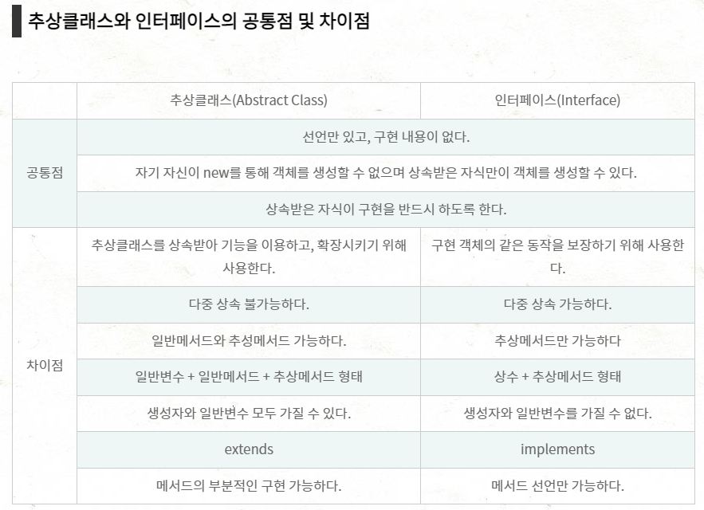
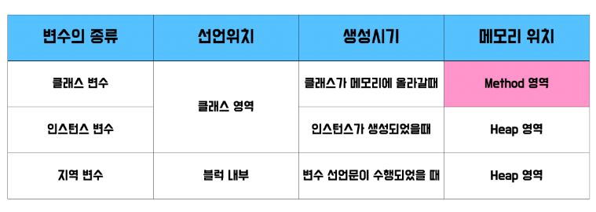

# 기술 면접 문제
## 자바 관련
1. 자바의 데이터 타입인 Primitive Type(기본형) 에 대해서 말해 보세요.
   * 자바에는 8개의 기본형 데이터 타입이 있습니다. 논리형에 블리언, 정수형에 byte, short, int, long, 실수형에 float, double, 문자형에 char가 있습니다.
   * 기본값이 있기 때문에 Null값이 존재하지 않고 null값을 활용하려면 rapper클래스를 활용합니다.
   * 메모리중 스택영역에 저장되고 컴파일 시점에 담을 수 있는 크기를 벗어나면 컴파일 에러가 발생합니다.

2. 자바의 데이터 타입인 Reference Type에 대해 설명하세요. 
    *  기본형 데이터 타입을 제외한 모든 타입을 참조형 타입으로 볼 수 있습니다.
    *  크게 나눠 보면 배열, 열거, 클래스, 인터페이스 가 있습니다.
    *  참조형은 기본형과 다르게 직접 값들을 넣지 않고 값을 저장하고 있는 객체를 가리키는 주소를 가지고 있습니다.
    *  메모리에서 힙 영역에 참조형 타입의 변수들이 저장됩니다. 변수의 레퍼런스, 즉 주소는 스택에 저장됩니다.

3. 자바 컬렉션의 대표 인터페이스는? 
    *  List, Set, Queue, Map. 
    *  Map의 경우 Collection 인터페이스를 상속받고 있지 않지만 콜렉션으로 분류됩니다.
    *  List는 순서가 있는 데이터의 집합으로 중복을 허용합니다. ArrayList
    *  Set은 순서를 유지하지 않는 데이터의 집합으로 데이터의 중복을 허용하지 않습니다.
    *  Map은 키와 값의 쌍으로 이루어진 데이터 집합으로 순서가 유지 되자 않고 키의 중복을 허용되지 않지만 값의 중복은 허용됩니다.
    *  Queue는 선입선출의 구조로 List와 유사합니다.

4. 접근제어자의 종류와 특성에 대해 설명하라(private, default, protected, public) 
   1. private: 해당 클래스에서만 접근가능
   2. default: 해당 패키지내에서만
   3. protected: 동일 패키지의 클래스 또는 해당 클래스를 상속받은 다른 패키지의 클래스에서만
   4. public: 어떤 클래스에서라도 접근이 가능

5. 객체의 직렬화(Serialization)란?
    *  Serialize. 객체를 데이터 스트립으로 만드는 것. 스트림에서 쓰기 위해 연속적인 형태로 변환한다.
    *  자바 시스템 내부에서 사용되는 객체 또는 데이터를 외부의 자바 시스템에서도 사용할 수 있도록 byte형태로 데이터를 변환하는 기술
    *  JVM의 메모리에 상주되어 있는 객체 데이터를 바이트형태로 변환하는 기술
    *  역직렬화 : byte로 변환된 Data를 Ojbect나 Data로 변환하는 기술. 직렬화된 바이트 데이터를 객체로 변환헤 JVM에 상주시킨다. 

6. **쓰레드란?**
    *  프로세스, 즉 실행중인 프로그램 내에서 실제로 작업을 수행하는 주체
    *  모든 프로세스에는 한 개 이상의 스레드가 존재한다.
    *  2개 이상의 스레드를 가지는 프로세스를 멀티스레드 프로세스라고 한다.

7. 쓰레드를 구현하기 위한 인터페이스, 클래스는? 
   * 자바에서 스레드를 생성하는 방법에는 
      1. Runnable 인터페이스를 구현하는 방법
      2. Thread 클래스를 상속받는 방법
      * 두 방법 모두 스레드를 통해 작업하고 싶은 내용을 run()메소드에 작성하면 된다.

8. Static 키워드에 대해 설명하세요. 
    *  고정된, 정적인 이라는 뜻인데 static 키워드를 변수나 메소드에 사용하면 인스턴스 생성없이 바로 사용가능합니다.
    *  즉, 객체를 생성하지 않아도 되서 빠르고 편리하다.
    *  주로 자주 변하지 않는 상수 값, 설정 정보 와 같은 공용 자원을 접근할 때 매번 메모리에서 로딩하지 않고 static 키워드를 붙여서 효율적으로 해당 데이터를 사용할 수 있습니다.

9.  **Class와 Instance에 대해 설명하세요.**
    *  클래스는 객체를 만들어 내기 위한 설계도
    *  객체는 구현 대상, 클래스의 인스턴스라고도 한다.
    *  인스턴스는 설계도를 바탕으로 구현된 구체적인 실체. 객체가 메모리에 할당되어 실제로 사용될 때 인스턴스라고 부른다.
    *  인스턴스는 생성된 복제본을 의미

10. **OOP란?**
    *   객체지향프로그래밍. Object oriented programming.
    *   부품에 해당하는 객체(클래스)들을 만들고, 조립하는 개발방식
    *   부품에 해당하는 객체: instance, object, bean
    *   장점 : 재사용성, 관리 용이, 신뢰성
    *   특정 : 캡슐화, 상속, 다형성

11. 캡슐화란?
    *  다른 객체가 객체의 내부구조를 알 수 없고 공개된 속성과 기능만을 이용가능 한 것입니다.
    *  잘못된 사용으로 인한 객체의 손상을 막고 신뢰성을 유지합니다.
    *  자바에서는 접근제한자와 메소드를 이용해 해당 객체를 캡슐화 할 수 있습니다. 

12. **상속이란?**
    *   상속은 새로운 클래스(하위클래스)가 기존 클래스(상위클래스)의 필드와 메소드를 이용할 수 있게 하는 것입니다.
    *   상위클래스를 재사용하기 때문에 개발 속도가 빠릅니다.
    *   상속을 통해 다양한 프로그램의 요구에 맞춘 하위 클래스를 개발할 수 있습니다.
    *   상위클래스와 하위클래스는 **종속관계를 형성함으로서 클래스들을 조직화**할 수 있습니다.

13. **오버로딩과 오버라이딩 비교**
    *   오버로딩: 같은 이름의 메서드를 여러 개 가지면서 매개변수의 유형과 개수가 다르도록 하는 기술
    *   오버라이딩: 상위 클래스가 가지고 있는 클래스를 하위클래스가 재정의해서 사용
    *   오버로딩에는 메서드 오버로딩과 생성자 오버로딩이 있다.

14. 추상클래스와 **인터페이스**에 대해 설명해 보세요.
    *  
    *   추상 메소드(abstract method)란 자식 클래스에서 반드시 오버라이딩해야만 사용할 수 있는 메소드를 의미
        1.  자바에서는 하나 이상의 추상 메소드를 포함하는 클래스를 가리켜 추상 클래스(abstract class)라고 합니다.
        2.  추상 클래스는 객체 지향 프로그래밍에서 중요한 특징인 다형성을 가지는 메소드의 집합을 정의할 수 있도록 해줍니다.
    *   인터페이스(interface)란 다른 클래스를 작성할 때 기본이 되는 틀을 제공하면서, 다른 클래스 사이의 중간 매개 역할까지 담당하는 일종의 추상 클래스를 의미
        *  인터페이스의 장점
            1.  인터페이스를 사용하면 다중 상속이 가능할 뿐만 아니라 다음과 같은 장점을 가질 수 있습니다.
            2.  대규모 프로젝트 개발 시 일관되고 정형화된 개발을 위한 표준화가 가능합니다.
            3.  클래스의 작성과 인터페이스의 구현을 동시에 진행할 수 있으므로, 개발 시간을 단축할 수 있습니다.
            4.  클래스와 클래스 간의 관계를 인터페이스로 연결하면, 클래스마다 독립적인 프로그래밍이 가능합니다.
        >http://www.tcpschool.com/java/java_polymorphism_interface

15. 속성변수, 지역변수, 매개변수에 대해서 설명해 보세요
    * 속성변수는 멤버변수의 하나로 객체가 가질수 있는 특성을 표현한 변수인 객채변수 중에서 기본 자료형의 값을 가지는 변수입니다.
    * 지역 변수는 메소드 내에 선언된 변수로 메소드 호출시 생성되고 메소드 종료시 사라집니다.
    * 매개변수는 파라미터라고 부르며 메소드에서 입력값을 받을 때 사용하는 변수로 함수를 호출할 때 인수로 전달된 값을 함수 내부에서 사용할 수 있게 해주는 변수입니다.

16. 배열과 ArrayList의 차이점
    * 배열은 크기가 고정되어있지만 arrayList는 사이즈가 동적인 배열이다.
    * 배열은 primitive type(int, byte, char 등)과 object 모두를 담을 수 있지만, arrayList는 object element만 담을 수 있다.(int x Integer 클래스 사용)
    * 배열은 제네릭을 사용할 수 없지만, arrayList는 타입 안정성을 보장해주는 제네릭을 사용할 수 있다.
    * 길이에 대해 배열은 length 변수를 쓰고, arrayList는 size() 메서드를 써야한다.
    * 배열은 element들을 할당하기 위해 assignment(할당) 연산자를 써야하고, arrayList는 add() 메서드를 통해 element를 삽입한다.

17. Java라는 언어에 대해 어떻게 생각하냐? 어떻게 공부를 했는가?
    * 자바는 c, python, javascript와 더불어 가장 인기있는 언어로 웹 애플리케이션을 개발하는데 최적의 언어입니다. 참고할 수 있는 다양한 대규모 커뮤니티가 있고 스프링과 전자정부프레임워크의 사용률이 높기 때문에 우리나라에서 자바가 사라질 것이라고는 상상이 잘 되지 않습니다. 물론 최근에 안드로이드 관련 개발영역에서 java를 기반으로 만들어진 kotlin이라는 언어가 있지만 코틀린은 자바와의 상호 운영이 100% 지원되기 때문에 자바에겐 큰 문제가 아니라고 생각합니다.

18. Java와 PHP의 차이점?
    * 자바는 기본적으로 C에서 파생된 컴파일 언어로 코드작성/빌드/배포를 거치는 포멀한 프로그램 개발 방식을 가져 공공기간, 대규모 프로젝트에서 인기가 많다. PHP는 Perl에서 파생된 단순화를 목표로 만들어진 스크립트언어로 빠르게 개발하고 쉽게 수정할 수 있는 장점이 있어 중소기업, 작은 웹프로젝트에서 인기가 많습니다. (자바/JSP는 컴파일을 거쳐 WAS에서 인식해 구동하는 구조고 PHP는 웹서버에서 바로 파싱해 읽고 출력합니다.)
    *  Java/JSP는 Spring 프레임워크의 등장으로 많은 사용자 확보했었고 최근 Ruby의 개념도 채용하고 Js의 개념도 채용하는등 다양한 경로를 보이고 있습니다. 또 Oracle이라는 대기업에서 인수한뒤 철저한 관리와 버전 배포를 하고 있습니다. 반면 PHP는 facebook에서 사용했었던 언어로 보안관련 이슈가 있었고 가독성과 속도가 느려서 인기가 사그라들던중 최근 Laravel이라는 프레임워크의 등장으로 다시 인기를 복구하는 중입니다.

19. **Java / JSP / jQuery의 차이점?**
    1.  자바는 객체 지향 언어로 . JSP는 Java Server Page의 약자로 자바를 서버환경에서 사용할수 있게 해주는 스크립트 방식의 언어로(HTML 코드 내에서 자바코드를 삽입해 웹 서버에서 동적으로 웹 페이지를 생성해 브라우저에게 돌려주는 서버 측 웹 프로그래밍 기술) WAS에서 동작합니다.. jQuery는 자바스크립트 라이브러리의 하나로 크라이언트 사이드에서 스크립트 언어를 단순화 할 수 있도록 설계된 가장 인기있는 javascript 라이브러리입니다.

20. 자바 변수 선언 위치와 사용범위를 설명
    
    >https://codechacha.com/ko/java-variable-scope/

##  DataBase / Oracle
1. 데이터베이스란 무엇이고 장단점은?
2. SQL(Structured Query Language)에 대해 설명하세요.
3. DDL(data definition language), DML(data manipulation language), DCL(data control 20. 
트랜잭션(transaction)이란? 
4. Oracle, mysql, mssql(relation database) 등을 부르는 종류명은? 
5. 데이터베이스 설계 시 정규화를 하는 이유는? 
6. 기본키와 외래키 설명
7. join이란?
8. 서브쿼리 설명
9. where과 having의 차이
10. view에 대해 설명
11. Group by란
12. Order by란
13. PK랑 UK의 차이점
14. INNER JOIN과 OUTTERJOIN의 차이점
15. 데이터베이스에 대한 질문입니다. 아래의 항목에 대해서 특정DB에 맞출 필요 없이 개념
을 설명하고 간단한 샘플 스크립트를 작성해주시기 바랍니다. ( 뷰 / 함수 / 프로시저 / 트리거 )
16. 기본키, 외래키, 인덱스의 의미와 어떻게 사용할지 주관적인 생각을 이야기해 주시기 바
랍니다. 
17. Oracle과 mysql 중 뭐가 더 좋은가? 그 이유는?

##  JSP 
1. 쿠키와 세션에 대해서 설명
2. MVC(Model-View-Controller)란? 
3. model1과 model2의 차이점은?
4. JSTL(JSP Standard Tag Library)이 무엇이고 사용하는 이유는?
5. JSP에서 세션에 값 저장하고 꺼내는 방법 
6. Jsp 한글 처리 문제 어떻게 해결?
7. Jsp에 대해서 설명해 보세요.
8. JSP 동작원리에 대해 설명해보시오.
9. SERVLET 이란
10. 제네릭(Generics) 이란?

##  Android 
1. Activity란?
2. Intent란?
3. Service란?
4. Service의 생명주기에 대해 설명하시오
5. 안드로이드에서의 스레드사용방법에 대해 설명해 보세요.
6. BroadCastReceiver란?
7. ContentProvider란?
8. 액티비티 스택이란
9. 앱에 대해 어느 정도 교육받았는지 설명하라.
10. 버튼에 대한 이벤트를 처리 할 수 있는가?

##  Framework 
1. 프레임워크가 무엇인가?
2. 스프링 프레임워크란?

3. 스프링의 특징에 대해서 설명해 보세요.
4. 관점지향프로그래밍(AOP)에 대해서 설명해 보세요. 
5. 스프링 MVC의 흐름에 대해서 설명해 보세요.
6. DI패턴에 대해서 설명해 보세요.
7. Singleton에 대해 설명 하시오.
8. Mybatis에 대해서 설명해 보세요.

##  etc. 
1. ERD(Entity Relationship Diagram)란?
2. AJAX란?
3. XML이란?
4. 미들웨어 (Middleware)
5. WAS (Web Application Server)
6. REST 서비스란 무엇인가?
7. HTML5의 주요 기능은 무엇인가?

8. CSS Position 속성에 대해 설명하세요
9. CI란 무엇인가?
10. Web Service 란?
11. jQuery의 장점은 무엇이라 생각하는가?
12. jQuery의 단점을 무엇이라고 생각하는가?
13. 지금 내 PC에 인터넷이 되지 않습니다. 어떤 방법으로 문제를 해결할 지 작성해 주십시오.
14. 파일을 복사하는 함수를 만들고 싶습니다. 자신이 익숙한 언어로 코딩해 보십시오. functionfnFileCopy(strSource,strTarget) 
 리턴값: 파일 복사 성공시 – true
 파일 복사 실패시 – 실패 원인 메시지
15. 자신의 필살기는 OOO이다 라고 한다면 어떻게 표현하시겠습니까?
16. 교육(수료) 후 만든 프로젝트를 설명하라.
17. 프로젝트 할 때 맡은 역할과 그 기능을 어떻게 구현했는가?
18. 다른 언어도 배워야 하고 사용해야하는데 거부감은 없는지?
19. 소프트웨어와 프레임워크의 차이점은?
20. 리눅스와 유닉스 경험 여부와 어느 정도까지 할 줄 아는지?

# 인성 면접 문제 
## 지원 동기
* 왜 개발자가 되려고 하는가?

* 만약 원하는 직종에 배치 받지 못한다면?

* 입사한다면 어떻게 공헌하시겠습니까?

* 우리 회사를 지원한 이유가 무엇입니까?

* 지원하는 직무에서 하는 일을 구체적으로 알고 있는가?

* 이 직무에 대해 따로 공부하거나 스터디를 해본 적이 있나요?

* 외 이직을 하려고 하는가?

* 개발이 적성에 맞다고 생각하나? 왜?

## 취업준비/회사정보
* 우리 회사 외의 어떤 회사를 지원했습니까?(합격 후 가지 않은 이유, 합격 못한 이유)

* 당사를 지원하면서 어떤 준비를 했습니까?

* 우리 회사에 대한 외부적 평가? 장단점?

* 우리 회사에 대해 아는 데로 설명하세요.

* 우리 회사 인재상에 비추어 자신의 경험을 이야기 해보라.

* 입사 후 어떤 일을 하게 될 것 같고, 또 어떤 일을 하고 싶은지 말해보라.

## 대학생활
* 학점이 좋지 않은데 이유가 무엇입니까?

* 봉사활동/동아리활동/아르바이트 경험은?

* 졸업 후(혹은 휴학 기간)에 무엇을 했는가?

* 대학생활에서 어려웠던 점은 무었이었으며, 어떻게 극복했나요?

## 성격의 장단점
* 자신의 약점 중 고치고 싶은 부분이 있다면?

* 친구들은 당신을 어떤 사람으로 보고 있습니까?

* 사람들과 함께 있을 때 주로 어떤 역할을?

* 자신의 장점은 무엇입니까?

## 직업관/인생관
* 돈과 명예, 일중에서 어느 것을 선택하겠는가?

* 평생 놀면서 살아갈만한 돈이 생긴다면 어떻게?

* 이 회사가 나랑 안맞다고 생각하면 어떻게 할 것 인가?

* 휴일에는 시간을 어떻게 보내고 있습니까?

* 삶을 통해 이루고 싶은 인생의 목표 3가지?

* 요즘 만나고 싶은 인물은? 그 이유는?

* 좌절한 경험/눈물을 흘린 경험이 있습니까?

* 개발자의 능력을 향상하기 위해 최근에 한 일은 무엇입니까?

* 목표가 없는 반복적이고 지루한 업무도 수행할 수 있는가?

* 직무(혹은 회사)와 관련된 사회 이슈를 알고 있는가?

* 회사 생활을 할 때 가장 중요하다고 생각하는 것은 무엇인가요?
* 본인의 직업관은 무엇입니까?
* 10년 후, 자신은 어떤 모습으로 살아가고 있을까요?
* 귀하가 부족한 부분을 어떻게 해결하겠습니까?
* 본인의 희망연봉은 얼마입니까?
* 만약 윗 상사가 자신보다 못한다고 판단되면 어떻게 할 것인가?

## 기타 사항
* 당신이 경험했던 가장 효과적인 리더는 누구였습니까? 그분의 특징은 무엇이었습니까?
* 당신이 경험했던 가장 비효율적인 리더는 누구였습니까? 그분의 특징은 무엇이었습니까?
* 당신은 어느 편에 가깝습니까? 구체적인 예를 들어 설명해 주시겠습니까?
* 당신이 다른 지원자와 차별화 되는 요소가 무엇인가?
* 여자친구는 있는가? 결혼은 언제?
* 야근이나 휴일근무, 출장이 가능합니까?
* 가장 잘 설명할 수 있는 IT 용어를 설명해주세요.
* 자신이 참여했던 프로젝트나 개발했던 프로그램 중 가장 인상 깊었던 내용은?
* IT서비스는 서비스업이다. 그 서비스의 의미를 어떻게 생각하느냐?
* 프로젝트 수행 시 회사와 개인에게 있어 중요한 요소나 갖추어야 할 항목을 각각 말하라.
* 프로젝트 진행 시 작성하는 산출물을 말씀해주세요.
* 종교는? 주말에 워크샵 일정으로 교회를 가지 못한다면?
* 흡연 또는 주량은?
* 아무래도 우리 회사와 맞지 않는 것 같군요. 만약에 채용되지 않는다면 어떻게 하십니까?
* 이 회사가 부도 위기에 처한다면?
* 일의 과정과 결과 중 어느 것이 중요한가?
* 갑작스럽게 일이 주어졌는데 이미 다른 중요한 약속이 있다면?
* 자신이 얼마짜리 사람이라고 생각하시나요?
* 본인이 잘하는 것이나 특기가 무엇인지 구체적으로 말해보라.
* 최근에 읽은 책은 무엇입니까?
* 자기 소개를 해보세요(1분/3분)
* 마지막으로 하고 싶은 말이나 질문해 보세요.