# 프로시저와 함수

- [프로시저와 함수](#프로시저와-함수)
- [PL/SQL](#plsql)
  - [프로시저](#프로시저)
    - [실습](#실습)
  - [함수](#함수)
    - [실습](#실습-1)
  - [트리거](#트리거)

<small><i><a href='http://ecotrust-canada.github.io/markdown-toc/'>Table of contents generated with markdown-toc</a></i></small>

# PL/SQL
* 여러 번의 SQL 작업을 한번에 실행 가능하도록 한다.
* 복잡하거나 반복적인 SQL 작업에 효과적이다.
```sql
-- pl/sql(Procedural Language extension to SQL)
-- SQL을 이용해서 프로그램을 작성할 수 있도록 지원하는 프로그래밍 언어
-- DBMS 내부에서 실행된다.
-- 여러 번의 SQL 작업을 한번에 실행할 수 있다.
-- 변수 선언과 초기화, 연산식, 조건문, 반복문, 예외처리를 지원한다.
-- begin/end 블록구조다.

-- 프로시저
-- 특정한 SQL 작업 수행하는 이름있는 pl/sql 블록이다.
-- 매개변수를 통해서 값을 전달받을 수 있다.
-- 여러 번의 SQL 작업, 혹은 실행단계가 복잡한 SQL 작업을 begin/end 블록에 정의하고, 한번에 실행할 수 있다.
-- 복잡한 sql 작업에 대한 트랜잭션처리가 가능하다.

-- 함수
-- 프로시저와 비슷하다.
-- begin/end 블록에서 sql작업을 수행하고, 실행결과를 반드시 반환해야 한다.

-- 트리거
-- 특정 테이블 insert, update, delete 작업을 수행하면 이벤트가 발생한다.
-- 이벤트가 발생했을 때 실행되는 프로그램
```

## 프로시저
* 매개변수 존재가능하고 트랜잭션처리가 가능한 이름있는 PL/SQL 블록
  * 트랜잭션처리(SELECT, UPDATE, INSERT, DELETE와 같이 DB 상태를 변경가능한 작업단위)

### 실습
```SQL
-- 프로시저
-- 구조
-- create or replace precedure 프로시저이름(
--      변수명 IN 데이터타입,
--      변수명 IN 데이터타입,
-- )
-- is
--      -- begin/end 블록에서 사용할 변수선언
--      변수명 데이터타입;
--      변수명 데이터타입 := 초기값;
-- begin
--      -- sql 실행
--      -- 연산식
--      -- if, for 조건식, 반복문
-- end;

-- 실행
-- execute 프로시저이름(값, 값)
```

1. 책 정보를 전달받아 STORE_BOOKS 테이블에 저장하는 프로시저를 만들고 프로시저를 실행해보기
    ```SQL
    -- 책 정보를 전달받아서 stores_books 테이블에 저장하는 프로시저 만들기
    CREATE OR REPLACE PROCEDURE ADD_BOOK(
        P_TITLE            IN VARCHAR2,
        P_AUTHOR           IN VARCHAR2,
        P_PUBLISHER        IN VARCHAR2,
        P_DESCRIPTION      IN VARCHAR2,
        P_PRICE            IN VARCHAR2,
        P_DISCOUNT_PRICE   IN NUMBER,
        P_STOCK            IN NUMBER
    )
    IS
        -- BEGIN/END 블록에서 사용할 변수 선언부
    BEGIN
        -- 실행할 SQL 정의
        INSERT INTO STORE_BOOK
        (BOOK_NO, BOOK_TITLE, BOOK_AUTHOR, BOOK_PUBLISHER, BOOK_DESCRIPTION, BOOK_PRICE, BOOK_DISCOUNT_PRICE, BOOK_STOCK)
        VALUES
        (STORE_BOOKS_SEQ.NEXTVAL, P_TITLE, P_AUTHOR, P_PUBLISHER, P_DESCRIPTION, P_PRICE, P_DISCOUNT_PRICE, P_STOCK);
        
        -- 데이터베이스 반영
        COMMIT;
    END;
    ```
   * 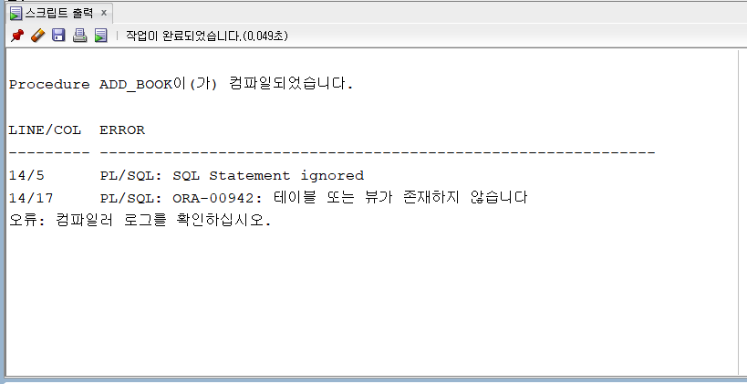
     * 잘못입력한 코드가 있을 경우 ERROR 메세지를 통해 문제를 파악하고 해결할 수 있다.(테이블명:STORE_BOOKS)
   * 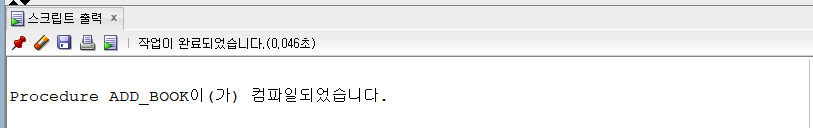
     * 프로시저 컴파일 성공
   * 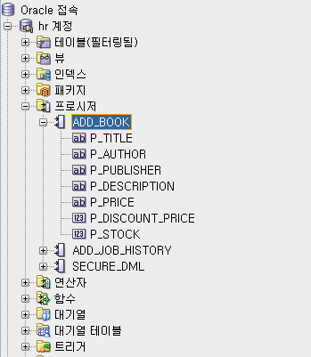
   * 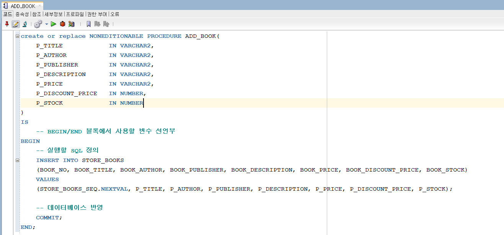
     * 프로시저가 실행되어 데이터가 성공적으로 저장되었다.

    ```SQL
    -- 프로시저 실행
    EXECUTE ADD_BOOK('이것이 자바다', '신용권', '한빛미디어', '엄청 좋은 책입니다', 30000, 27000, 10);
    ```
    * 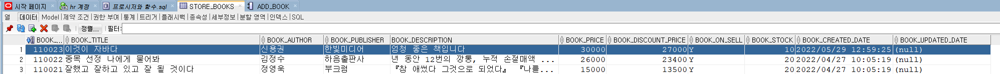
    * 성공적으로 프로시저가 실행되어 STORE_BOOKS 테이블에 데이터가 저장되었다.(INSERT)

2. 사원아이디와 급여인상률을 전달받아서 해당 사원의 급여를 인상하는 프로시저 생성하고 실행해보기
    ```SQL
    -- 사원아이디와 급여인상률을 전달받아서 해당 사원의 급여를 인상하는 프로시저 생성하기
    CREATE OR REPLACE PROCEDURE UPDATE_SALARY_1 (
        P_EMP_ID IN NUMBER,
        P_SALARY_INCREASE_RATE IN NUMBER
    )
    IS
        -- 변수 정의하기
        V_EMP_SALARY NUMBER;
        V_EMP_INCREASE_SALARY NUMBER;
    BEGIN
        -- SELECT문의 실행결과 획득한 급여를 V_EMP_SALARY변수에 대입한다.
        SELECT SALARY
        INTO V_EMP_SALARY
        FROM EMPLOYEES
        WHERE EMPLOYEE_ID = P_EMP_ID;
        
        -- 인상된 급여를 계산해서 변수에 대입한다.
        V_EMP_INCREASE_SALARY := V_EMP_SALARY + V_EMP_SALARY * P_SALARY_INCREASE_RATE;
        
        -- 급여를 변경하기
        UPDATE EMPLOYEES
        SET
            SALARY = V_EMP_INCREASE_SALARY
        WHERE
            EMPLOYEE_ID = P_EMP_ID;
            
        -- 데이터 베이스에 반영
        COMMIT;
    END;
    ```
     * `SELECT ~ INTO 변수명`의 경우 프로시저에서만 사용할 수 있는 SQL문법으로 SELECT문의 실행결과를 INTO 뒤에 작성한 변수에 대입한다.
    ```SQL
    -- 프로시저 실행
    EXECUTE UPDATE_SALARY_1(100, 0.2);
    ```
    * 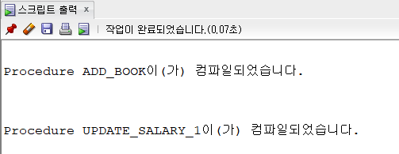
    * 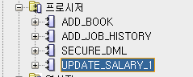
    * 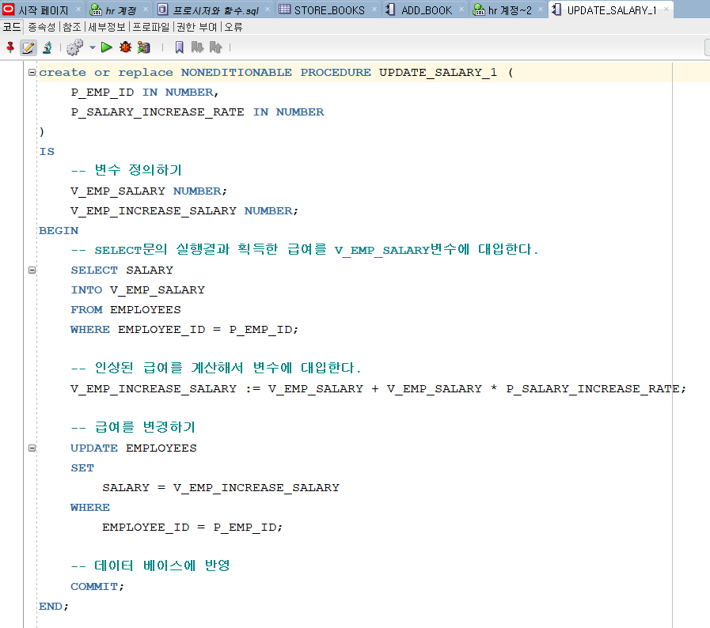
    * 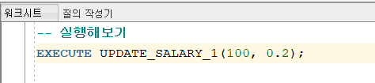
    * 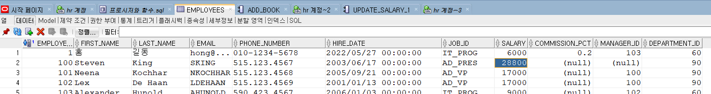
    * 성공적으로 프로시저가 저장되고 실행되었다.

3. 사원아이디를 전달받아서 급여를 인상하는 프로시저 정의하기 (급여인상률은 급여에 따라서 정해진다. 20000이상 10%, 10000이상 15%, 그 외 20% 인상)
    ```SQL
    -- 사원아이디를 전달받아서 급여를 인상하는 프로시저 정의하기
    --      급여인상률은 급여에 따라서 정해진다.
    --      20000이상 10%, 10000이상 15%, 그 외 20% 인상
    CREATE OR REPLACE PROCEDURE UPDATE_SALARY_2(
        P_EMP_ID IN NUMBER
    )
    IS
        V_EMP_SALARY NUMBER;
        V_INCREASE_RATE NUMBER;
        V_INCREASE_SALARY NUMBER;
    BEGIN
        -- 급여를 조회해서 변수에 저장한다.
        SELECT SALARY
        INTO V_EMP_SALARY
        FROM EMPLOYEES
        WHERE EMPLOYEE_ID = P_EMP_ID;
        
        -- 급여에 따라서 인상률 지정한다.
        IF V_EMP_SALARY >= 20000
            THEN V_INCREASE_RATE := 0.1;
        ELSIF V_EMP_SALARY >= 10000
            THEN V_INCREASE_RATE := 0.15;
        ELSE
            V_INCREASE_RATE := 0.2;
        END IF;
        
        -- 인상된 급여를 계산해서 변수에 저장하기
        V_INCREASE_SALARY := V_EMP_SALARY + TRUNC(V_EMP_SALARY * V_INCREASE_RATE);
        
        -- 직원의 급여를 인상시키기
        UPDATE EMPLOYEES
        SET
            SALARY = V_INCREASE_SALARY
        WHERE
            EMPLOYEE_ID = P_EMP_ID;
            
        -- 데이터베이스에 반영
        COMMIT;
    END;

    ```
    ```SQL
    -- 실행해보기
    EXECUTE UPDATE_SALARY_2(100);
    ```
      * 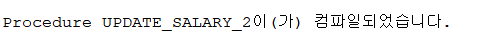
      * 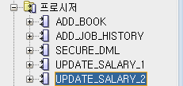
      * 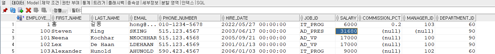
        * 100번사원의 SALARY가 10% 인상되었다.

## 함수
* 프로시저와 비슷하지만 실행결과를 반드시 반환한다.
```SQL
-- 직원아이디를 전달받아서 해당 직원의 연봉을 반환하는 함수 정의하기
CREATE OR REPLACE FUNCTION ANNUAL_SALARY (
    P_EMP_ID IN NUMBER
)
RETURN NUMBER
IS
    V_EMP_ANNUAL_SALARY NUMBER;
BEGIN
    SELECT SALARY*12 + SALARY*NVL(COMMISSION_PCT, 0)*12
    INTO V_EMP_ANNUAL_SALARY
    FROM EMPLOYEES
    WHERE EMPLOYEE_ID = P_EMP_ID;
    
    RETURN V_EMP_ANNUAL_SALARY;
END;
```

### 실습
```SQL
-- 실행해보기
SELECT ANNUAL_SALARY(100)
FROM DUAL;

SELECT EMPLOYEE_ID, FIRST_NAME, SALARY, ANNUAL_SALARY(EMPLOYEE_ID)
FROM EMPLOYEES;

```
* 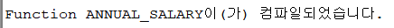
* 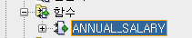
* 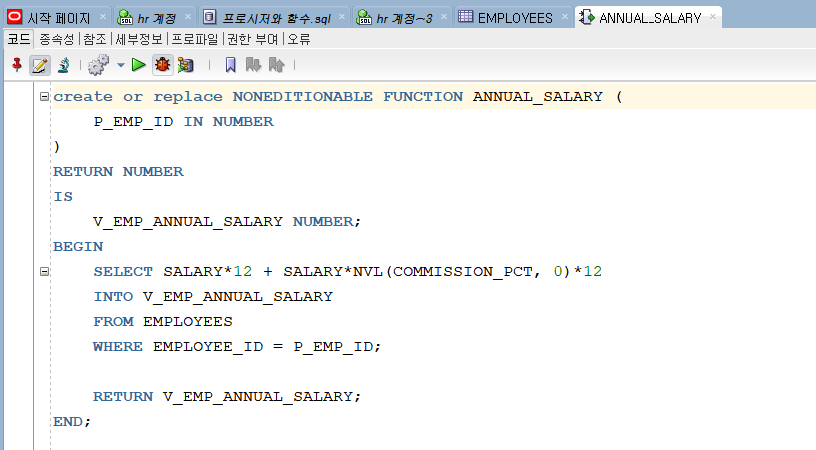
  * 함수가 성공적으로 컴파일, 저장되었다.
```SQL
-- 실행해보기
SELECT ANNUAL_SALARY(100)
FROM DUAL;

SELECT EMPLOYEE_ID, FIRST_NAME, SALARY, ANNUAL_SALARY(EMPLOYEE_ID)
FROM EMPLOYEES;
```
* 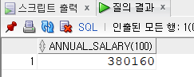
* 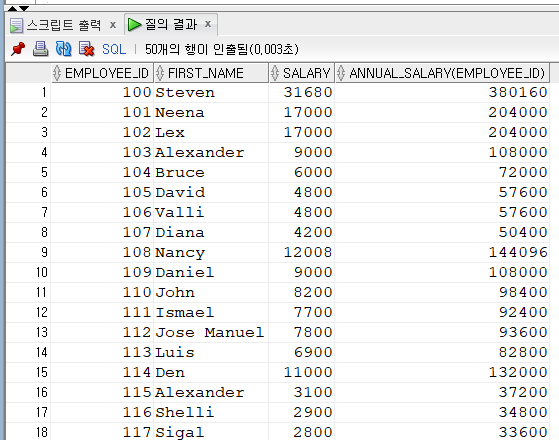
  * 함수가 실행되고 결과값을 반환한다.

## 트리거
* INSERT, UPDATE, DELETE 작업을 수행하면 이벤트가 발생하고 이 때 실행되는 프로그램