>> 생활코딩 WEB2-Node.js를 학습, 정리한 내용입니다. (https://github.com/qufstar7/TIL)

# Node.js basic1

- Node.js, Node.js와 관련된 주제, 간단한 JavaScript 문법
- Node.js를 이용한 App제작 실습
    - Node.js
    - Url, console
    - App제작 - 동적 웹페이지, 파일을 이용한 본문 구현

# 목차
* chapter 1 ~ chapter 12
    1. 
    2. 


# Node.js 소개

2021년 3월 18일 목요일
오후 10:16

## Node.js
Node.js를 이용해 Html을 생산하는 지루한 일을 컴퓨터에 맡기고 창의적이고 생산적인 작업을 할 수 있다.
* 일종의 소프트웨어 플랫폼
* 작성 언어로 자바스크립트를 활용(V8이라는 자바스크립트 엔진으로 빌드 된 이벤트 기반 자바스크립트 런타임)
* Non-blocking I/O와 단일 스레드 이벤트 루프를 통한 높은 처리 성능
* 내장 HTTP 서버 라이브러리를 포함한다.(별도의 웹 서버 소프트웨어없이 동작 가능)

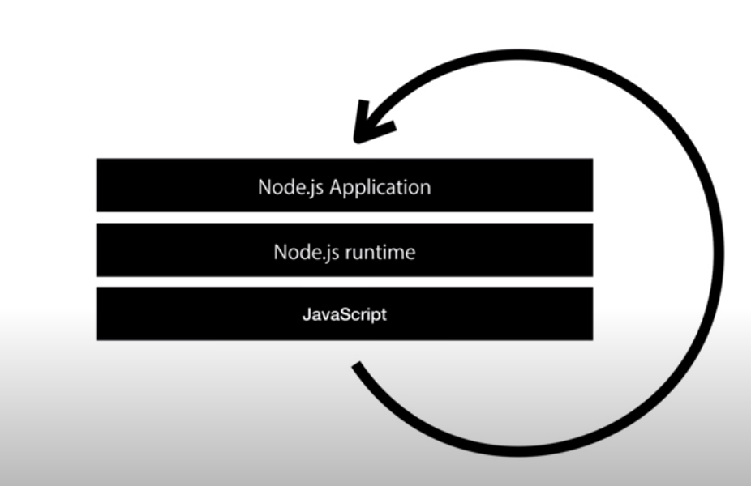


# 목적

2021년 3월 18일 목요일
오후 10:19

* 많은 웹페이지를 직접 관리할 필요 없이 노드js를 이용해 간편하게 수많은 웹 페이지를 수정 및 관리할 수 있다.
* 웹사이트를 방문하는 사람들로 하여금 웹페이지를 직접 참여하고 수정하고 삭제하는 등 행동을 할 수 있게 만들어 준다.
* javascript의 문법을 통해서 Node.js의 기능을 실현해 node.js 애플리케이션을 만든다.
* 웹 서버와 같이 확장성 있는 네트워크 프로그램 제작을 위해 고안되었다.
* 트위스티드(파이썬), 펄 객체 환경, 루비 이벤트 머신과 그 용도가 비슷하다.


# 설치

2021년 3월 18일 목요일
오후 10:53

## 방법
1. Node.js 검색
2. 보편적인 다운로드 파일 (window버전 다운)
3. next 버튼 계속 클릭

## 경로
* Cmd > cd (폴더경로)
* Node (파일경로) 

### 윈도우 10에서 다른 드라이브(d:) 로 이동하는 방법
* CMD 창
  1. 드라이브 (D:) 
  2. 폴더 경로로 이동 (cd helloworld.js 파일 있는 폴더 경로 값)
  3. 파일 확인 (dir) 
  4. 파일 실행 (node helloworld.js)


# Node.js로 웹서버 만들기

2021년 3월 19일 금요일
오전 11:15

## html소스 가져오기
> https://github.com/web-n/web1_html_internet

## Main.js 파일 만들기
```js
var http = require('http');
var fs = require('fs');
var app = http.createServer(function(request,response){
    var url = request.url;
    if(request.url == '/'){
      url = '/index.html';
    }
    if(request.url == '/favicon.ico'){
        response.writeHead(404);
        response.end();
        return;
    }
    response.writeHead(200);
    response.end(fs.readFileSync(__dirname + url));
 
});
app.listen(3000);
```
## Cmd에서 node.js를 이용해 웹페이지 실행
```console
C:\Users\Junha>cd C:\Users\Junha\Desktop\nodejs\
C:\Users\Junha\Desktop\nodejs>node main.js
C:\Users\Junha\Desktop\nodejs/index.html
C:\Users\Junha\Desktop\nodejs/1.html
C:\Users\Junha\Desktop\nodejs/coding.jpg
C:\Users\Junha\Desktop\nodejs/2.html
C:\Users\Junha\Desktop\nodejs/3.html
```
## Node.js의 장점
```js
response.writeHead(200);
console.log(__dirname + url);
response.end('qufstar7 : '+url);
```
* Node.js는 'qufstar7 : '+url이 부분에다가 
어떤 코드를 넣냐에 따라 사용자에게 전달하는 데이터가 바뀐다.
* 아파치와 같은 웹서버는 할 수 없고 php나 node.js 나 django같은 것은 가능하다.
* 사용자에게 전송할 수 있는 데이터를 생성한다.

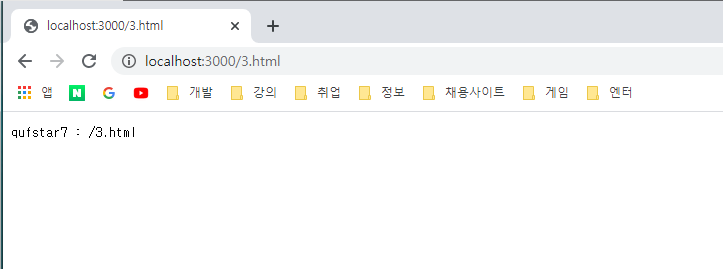


# Javascript 문법-data type

2021년 3월 19일 금요일
오후 12:53

## 숫자와 연산자 - 이항연산자
Number Data type
```
console.log(1+1);
```
* 1은 숫자 +는 연산자  
* 이항연산자:왼쪽과 오른쪽 값을 처리해서 하나의 값인 2를 만들어낸다.
```
console.log(4-1);
console.log(2*2);
console.log(10/2);
```
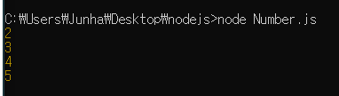


# Url의 이해

2021년 3월 19일 금요일
오후 1:31

## Url 개념알기
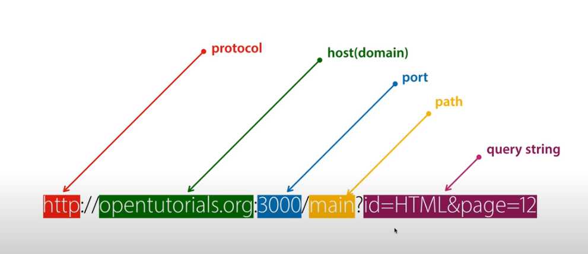
* Protocol 
  * 통신규칙 어떤 방식으로 서버에 접속할 것인가
* Host 도메인네임 
  * 인터넷에 연결되있는 컴퓨터를 가르키는 주소
* Port 
  * 포트번호 한대의 컴퓨터 안에 여러개의 서버가 있을 수 있음.
  * 클라이언트가 접속할때 어떤 서버와 통신할 것인지 애매. 
  * 3000이라고하면 3000번 포트에 연결하는것. 
  * 접속할때 80이 기본 포트값(안썼을때) 웹서버는 굉장히 유명한 서버기 때문에 포트번호르 생략하면 80에 접속한 것. 
* Path 
  * 컴퓨터 안의 어떠한 파일
* Query string 
  * 이걸 변경하면 앞에있는 웹서버에게 데이터를 전송할 수 있다.
  * '내가 읽고 싶은것은 어떤것이다~' 시작은 ?로 값과 값은 &를 쓰고 값의 이름과 값은 =로 구분
	

# Url을 통해서 입력된 값 사용하기

2021년 3월 19일 금요일
오후 1:38

## 웹 애플리케이션 실습
### 쿼리스트링에 따라서 다른 정보 보여주기
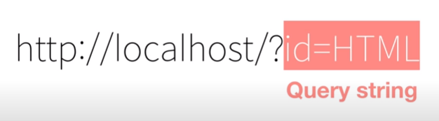
* 검색 - nodejs url parse query string
```js
var app = http.createServer(function(request,response){
    var _url = request.url;
    var queryData = url.parse(_url, true).query;
    console.log(queryData.id);
    if(_url == '/'){
      _url = '/index.html';
    }
    if(_url == '/favicon.ico'){
        return response.writeHead(404);        
    }
    response.writeHead(200);
    response.end(queryData.id);
}
```
### console
```console
C:\Users\Junha\Desktop\nodejs>node main.js
HTML
internal/fs/utils.js:307
    throw err;
    ^

Error: ENOENT: no such file or directory, open 'C:\Users\Junha\Desktop\nodejs[object Object]'
    at Object.openSync (fs.js:476:3)
    at Object.readFileSync (fs.js:377:35)
    at Server.<anonymous> (C:\Users\Junha\Desktop\nodejs\main.js:16:21)
    at Server.emit (events.js:315:20)
    at parserOnIncoming (_http_server.js:874:12)
    at HTTPParser.parserOnHeadersComplete (_http_common.js:126:17) {
  errno: -4058,
  syscall: 'open',
  code: 'ENOENT',
  path: 'C:\\Users\\Junha\\Desktop\\nodejs[object Object]'
}
```


# App제작-동적인 웹페이지 만들기

2021년 3월 19일 금요일
오후 2:57

```js
 if (_url == '/') {
        title = 'Welcome';
 …중략

<title>WEB1 - ${title}</title>
        <meta charset="utf-8">
    </head>
    <body>
        <h1><a href="/">WEB</a></h1>
        <ul>
            <li><a href="/?id=HTML">HTML</a></li>
            <li><a href="/?id=CSS">CSS</a></li>
            <li><a href="/?id=Javascipt">JavaScript</a></li>
        </ul>
        <h2>${title}</h2>
```
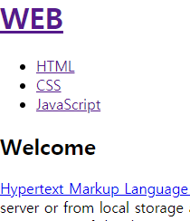


# Node.js 에서 파일 읽기 기능

2021년 3월 19일 금요일
오후 3:13

## 정보를 다루는 핵심적인 처리과정 4가지
* Create  -  만들고 
* Read    -  읽고 
* Update  -  수정하고
* Delete  -  삭제한다

### 읽기
* 노드js 검색 > nodejs file read 
  * 공식사이트 
    > https://nodejs.org/dist/latest-v14.x/docs/api/ 
    * 모듈들이 나옴
* 모듈 : 기본적으로 제공하는 기능들을 그루핑해논 각각의 그룹들

### Cmd 에서..
* Cd : change directory 현재 작업 (나의)위치를 바꾼다.
* Dir/w 현재 위치하고있는 폴더의 파일목록을 보여줌
* Node 파일명.js node.js로 파일 실행


# App제작-파일을 이용해 본문 구현

2021년 3월 19일 금요일
오후 4:51

```js
var http = require('http');
var fs = require('fs');
var url = require('url');
var app = http.createServer(function(request,response){
    var _url = request.url;
    var queryData = url.parse(_url, true).query;
    var title = queryData.id;
    if(_url == '/'){
        title = 'Welcome';
    }
    if(_url == '/favicon.ico'){
        return response.writeHead(404);
    }
    response.writeHead(200);
    fs.readFile(`data/${title}`, 'utf8', function(err, description){
        var template = `
        <!doctype html>
        <html>
        <head>
            <title>WEB1 - ${title}</title>
            <meta charset="utf-8">
        </head>
        <body>
            <h1><a href="/">WEB</a></h1>
            <ul>
                <li><a href="/?id=HTML">HTML</a></li>
                <li><a href="/?id=CSS">CSS</a></li>
                <li><a href="/?id=JavaScript">JavaScript</a></li>                
            </ul>
            <h2>${title}</h2>
            <p>${description}</p>
        </body>
        </html>
        `;
        response.end(template);
    })

});
app.listen(3000);
```
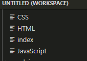


# Javascript 문법2-블리언 등

2021년 3월 19일 금요일
오후 4:56
## Boolean datatype 
* 블리언 데이터타입
## Comparison Operator
* 비교연산자
## conditional statement
* 조건문
## Flow control statement
* 제어문

```js
console.log(1+1);  //이항연산자 2, 1+1 둘다 2를 표현하는 표현식
console.log(1==1); //true
console.log(1==2); //false
console.log(1>2); //false
console.log(1<2); //true
console.log(1===1); //true ==랑 ===은 비슷하지만 다르다 이유가 없다면 ===을 꼭 쓰자.
console.log(1===2); //false
name = 1; //대입연산자
name === 1; //비교연산자 ==도
```
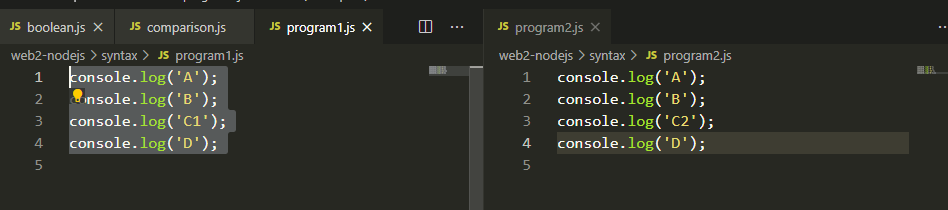


# 콘솔에서의 입력값

2021년 3월 19일 금요일
오후 6:51
## program's I/O
* 프로그램은 IO(input과 output)으로 이루어져 있다.
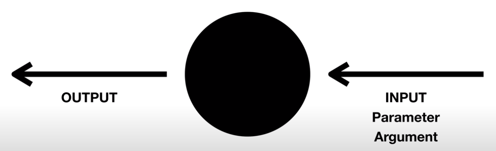
* 살펴볼 Input은 console에서 명령어를 실행할떄 입력값을 주는 방법
* 그거에 따라서 프로그램이 내부에서 조건문을 이용해서 입력 값이 무엇이냐에 따라서 다르게 동작해서 다른 아웃품을 출력하는 프로그램을 만들어보자 (실용성은 x)

## 콘솔 실습
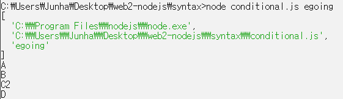
### 코드 해석
* 노드js런타임 위치 정보 (0번째 자리)
* 우파일의 경로(1번째 자리)
* 입력 값(2번째 자리)

### 코드입력
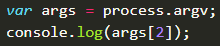

### 콘솔실행
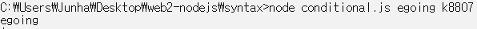
* 맨위의 2번째 자리 값인 'egoing'이 args[2]가 된 것.

## 결론 및 정리
* 프로그래밍에서 제어문에서 조건문을 통해 입력값이 무엇이냐에 따라 하나의 프로그램이 
여러가지 결과를 보여줄 수 있는 방법
