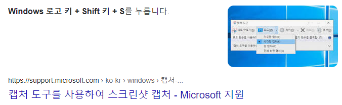
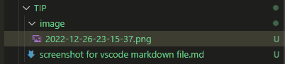

# 스크린샷 screenshot vscode에서 쉽게
1. **window + shift + s** 등의 방법으로 스크린샷 캡쳐보드 저장 
   * 
2. vscode markdown 파일에서 **ctrl + alt + v** 
3. 설정해놓은 폴더가 생성되며 
4. 이미지 파일이 저장되고 
5. 파일 경로를 가져와 
6. markdown 이미지파일 링크 코드를 생성한다.
   * 