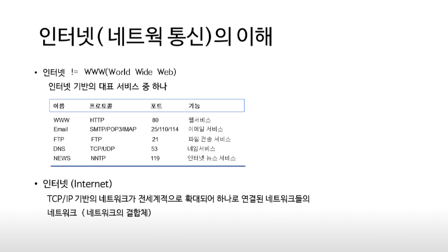
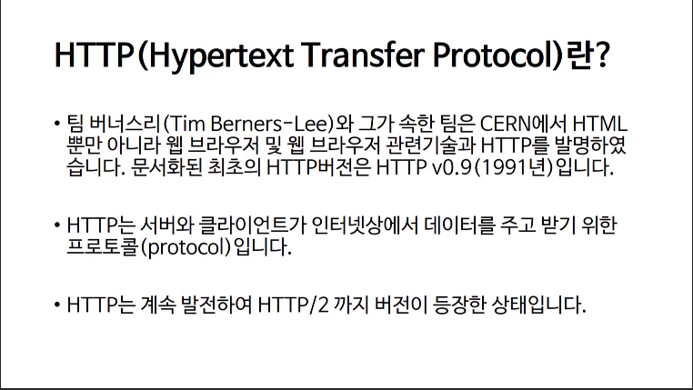
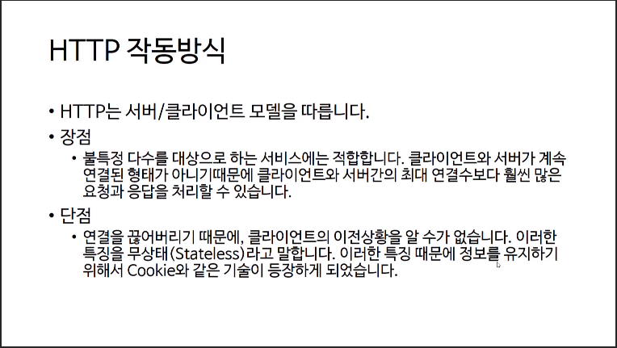
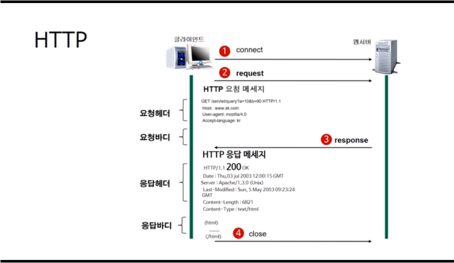

> 부스트코스 - 웹 프로그래밍(풀스택)강의를 학습, 정리한 내용입니다.(https://www.boostcourse.org/web316/joinLectures/12943)

# Http protocol

- [Http protocol](#http-protocol)
- [웹의 동작](#웹의-동작)
  - [**핵심 개념**](#핵심-개념)
  - [internet](#internet)
  - [**HTTP (Hypertext Transfer Protocol)란?**](#http-hypertext-transfer-protocol란)
  - [**HTTP 작동방식**](#http-작동방식)
  - [**URL (Uniform Resource Locator)**](#url-uniform-resource-locator)
  - [**HTTP (Hypertext Transfer Protocol)**](#http-hypertext-transfer-protocol)
  - [**생각해보기**](#생각해보기)
  - [**참고 자료**](#참고-자료)

<small><i><a href='http://ecotrust-canada.github.io/markdown-toc/'>Table of contents generated with markdown-toc</a></i></small>

# 웹의 동작
웹 브라우저와 웹 서버 간에도 서로 통신하기 위한 규약, HTTP
## **핵심 개념**
- HTTP
- Request 형식
- Request Method
- Response 형식
- 응답 코드

## internet

## **HTTP (Hypertext Transfer Protocol)란?**

- 팀 버너스리(Tim Berners-Lee)와 그가 속한 팀은 CERN에서 HTML뿐만 아니라 웹 브라우저 및 웹 브라우저 관련 기술과 HTTP를 발명하였다.
- 문서화된 최초의 HTTP버전은 HTTP v0.9(1991년)
- HTTP는 서버와 클라이언트가 인터넷상에서 데이터를 주고받기 위한 프로토콜(protocol)
- HTTP는 계속 발전하여 HTTP/2까지 버전이 등장한 상태

## **HTTP 작동방식**

- HTTP는 서버/클라이언트 모델을 따른다.
- 장점불특정 다수를 대상으로 하는 서비스에는 적합하다. 클라이언트와 서버가 계속 연결된 형태가 아니기 때문에 클라이언트와 서버 간의 최대 연결 수보다 훨씬 많은 요청과 응답을 처리할 수 있다.
- 단점연결을 끊어버리기 때문에, 클라이언트의 이전 상황을 알 수가 없다. 이러한 특징을 무상태(Stateless)라고 말한다. 이러한 특징 때문에 정보를 유지하기 위해서 Cookie와 같은 기술이 등장하게 되었다.

## **URL (Uniform Resource Locator)**

- 인터넷 상의 자원의 위치
- 특정 웹 서버의 특정 파일에 접근하기 위한 경로 혹은 주소

## **HTTP (Hypertext Transfer Protocol)**

- 요청 메서드 : GET, PUT, POST, PUSH, OPTIONS 등의 요청 방식이 온다.
- 요청 URI : 요청하는 자원의 위치를 명시한다.
- HTTP 프로토콜 버전 : 웹 브라우저가 사용하는 프로토콜 버전이다.

첫번째 줄의 요청메소드는 서버에게 요청의 종류를 알려주기 위해서 사용된다.

각각의 메소드 이름은 다음과 같은 의미

참고로 최초의 웹 서버는 GET방식만 지원해줬다.

- GET : 정보를 요청하기 위해서 사용한다. (SELECT)
- POST : 정보를 밀어넣기 위해서 사용한다. (INSERT)
- PUT : 정보를 업데이트하기 위해서 사용한다. (UPDATE)
- DELETE : 정보를 삭제하기 위해서 사용한다. (DELETE)
- HEAD : (HTTP)헤더 정보만 요청한다. 해당 자원이 존재하는지 혹은 서버에 문제가 없는지를 확인하기 위해서 사용한다.
- OPTIONS : 웹서버가 지원하는 메서드의 종류를 요청한다.
- TRACE : 클라이언트의 요청을 그대로 반환한다. 예컨데 echo 서비스로 서버 상태를 확인하기 위한 목적으로 주로 사용한다.

## **생각해보기**

1. HTTP에 S가 붙은 HTTPS 는 어떤 용도로 사용되는 건가요? HTTP와 무엇이 다른가?

* s 는 secure의 약자로 https는 보안이 강화된 http프로토콜을 의미한다.

## **참고 자료**

> [**[참고링크] An overview of HTTP**
https://developer.mozilla.org](https://developer.mozilla.org/en-US/docs/Web/HTTP/Overview)

> **[[참고링크] HTTP - Hypertext Transfer Protocol Overview**
https://www.w3.org](https://www.w3.org/Protocols/)

> **[[참고링크] HTTP - 위키백과, 우리 모두의 백과사전**
https://ko.wikipedia.org](https://ko.wikipedia.org/wiki/HTTP)

> **[[참고링크] URL - Wikipedia**
https://en.wikipedia.org](https://en.wikipedia.org/wiki/URL)

> **[[참고링크] Uniform Resource Identifier - Wikipedia**
https://en.wikipedia.org](https://en.wikipedia.org/wiki/Uniform_Resource_Identifier)