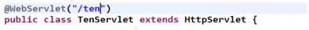
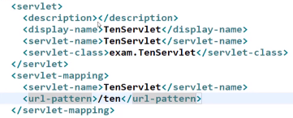
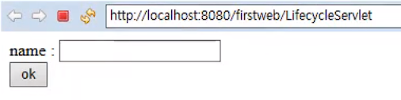
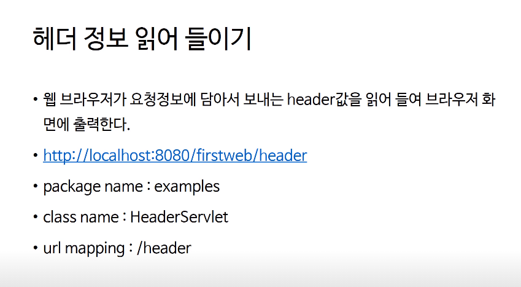
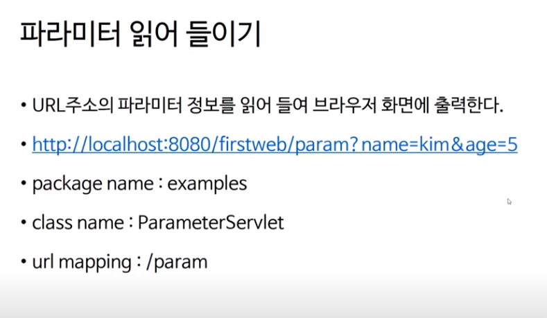
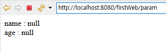
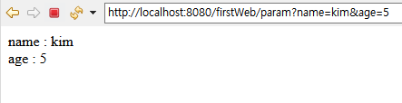
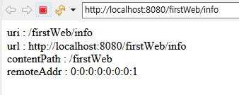

> 부스트코스 - 웹 프로그래밍(풀스택)강의를 학습, 정리한 내용입니다.(https://www.boostcourse.org/web316/joinLectures/12943)

# Servlet

- [Servlet](#servlet)
- [1) Servlet 이란?](#1-servlet-이란)
  - [**핵심 개념**](#핵심-개념)
  - [**자바 웹 어플리케이션(Java Web Application)**](#자바-웹-어플리케이션java-web-application)
  - [**자바 웹 어플리케이션의 폴더 구조**](#자바-웹-어플리케이션의-폴더-구조)
  - [**자바 웹 어플리케이션의 폴더 구조**](#자바-웹-어플리케이션의-폴더-구조-1)
    - [**서블릿이란?**](#서블릿이란)
  - [**생각해보기**](#생각해보기)
    - [답](#답)
- [2) Servlet 작성 방법](#2-servlet-작성-방법)
  - [**핵심 개념**](#핵심-개념-1)
  - [**버전에 따른 Servlet 작성 방법**](#버전에-따른-servlet-작성-방법)
    - [**1. Servlet 3.0 spec 이상에서 사용하는 방법**](#1-servlet-30-spec-이상에서-사용하는-방법)
    - [**2. Servlet 3.0 spec미만에서 사용하는 방법**](#2-servlet-30-spec미만에서-사용하는-방법)
  - [**실습코드 1**](#실습코드-1)
    - [**실습코드 2**](#실습코드-2)
  - [**생각해보기**](#생각해보기-1)
    - [답](#답-1)
- [3) Servlet 라이프 싸이클](#3-servlet-라이프-싸이클)
  - [**핵심 개념**](#핵심-개념-2)
  - [**LifecycleServlet**](#lifecycleservlet)
  - [**실습코드**](#실습코드)
  - [**참고 자료**](#참고-자료)
  - [메모](#메모)
  - [**Servlet 생명주기**](#servlet-생명주기)
  - [**실습코드**](#실습코드-1)
  - [**service(request, response) 메소드**](#servicerequest-response-메소드)
  - [**LifecycleServlet 수정 실습**](#lifecycleservlet-수정-실습)
  - [**참고 자료**](#참고-자료-1)
  - [정리](#정리)
    - [서블릿 실행과정(생명주기)](#서블릿-실행과정생명주기)
    - [service() 메서드](#service-메서드)
    - [HttpServlet의 service()메서드](#httpservlet의-service메서드)
    - [method, action `<form>`](#method-action-form)
    - [kang 입력](#kang-입력)
    - [hahahaha 입력](#hahahaha-입력)
    - [최종정리](#최종정리)
  - [에러](#에러)
    - [참고](#참고)
- [Request, Response 객체](#request-response-객체)
  - [**핵심 개념**](#핵심-개념-3)
  - [**요청과 응답**](#요청과-응답)
    - [**HttpServletRequest**](#httpservletrequest)
    - [**HttpServletResponse**](#httpservletresponse)
  - [요청 정보 실습 1](#요청-정보-실습-1)
    - [실습 - 헤더정보 읽어들이기 (이클립스)](#실습---헤더정보-읽어들이기-이클립스)
    - [**실습코드**](#실습코드-2)
  - [파라미터 읽어들이기](#파라미터-읽어들이기)
    - [실습](#실습)
    - [**실습코드**](#실습코드-3)
  - [요청정보 실습 2](#요청정보-실습-2)
    - [실습 - 그외의 요청정보 출력](#실습---그외의-요청정보-출력)
    - [**실습코드**](#실습코드-4)
  - [**참고 자료**](#참고-자료-2)

<small><i><a href='http://ecotrust-canada.github.io/markdown-toc/'>Table of contents generated with markdown-toc</a></i></small>


# 1) Servlet 이란?
웹 어플리케이션은 정적인 콘텐츠와 동적인 콘텐츠로 나누어 볼 수 있다.

프로그램을 수행해서 페이지를 동적으로 만들어 주는 서블릿
## **핵심 개념**

- 자바 웹 어플리케이션
- 서블릿

## **자바 웹 어플리케이션(Java Web Application)**

WAS에 설치(deploy)되어 동작하는 어플리케이션.

자바 웹 어플리케이션에는 HTML, CSS, 이미지, 자바로 작성된 클래스(Servlet도 포함됨, package, 인터페이스 등), 각종 설정 파일 등이 포함.

## **자바 웹 어플리케이션의 폴더 구조**


## **자바 웹 어플리케이션의 폴더 구조**

### **서블릿이란?**

자바 웹 어플리케이션의 구성요소 중 동적인 처리를 하는 프로그램의 역할.

서블릿을 정의해보면 서블릿(servlet)은 WAS에 동작하는 JAVA 클래스.

서블릿은 HttpServlet 클래스를 상속받아야 .

서블릿과 JSP로부터 최상의 결과를 얻으려면, 웹 페이지를 개발할 때 이 두 가지(JSP, 서블릿)를 조화롭게 사용해야.

예를 들어, 웹 페이지를 구성하는 화면(HTML)은 JSP로 표현하고, 복잡한 프로그래밍은 서블릿으로 구현.

---

## **생각해보기**

1. 동적인 페이지가 필요한 경우는 어떤 것일까요?
### 답
단순한 데이터를 보여주는 페이지가 아닌 상황 ,시간, 날짜, 요청 등에 의해 달라지는 페이지가 필요할 때.


# 2) Servlet 작성 방법

현재 프로젝트에서 웹을 개발할 때 서블릿을 직접 써서 개발하지는 않는.

조금 더 편하게 사용할 수 있게 도와주는 다양한 프레임워크를 사용해서 개발하는 경우가 더 많다.

하지만, 그 프레임워크들도 서블릿이 없이는 동작할 수 없기 때문에 서블릿의 기본적인 작성법이나, 서블릿의라이프 사이클을 이해하고 있어야 웹의 동작을 제대로 이해할 수 있다.

---

**학습 목표**

1. 서블릿을 작성할 수 있습니다.
2. 서블릿 버전에 따른 web.xml을 적절하게 작성할 수 있습니다.

---

## **핵심 개념**

- HttpServlet
- web.xml


## **버전에 따른 Servlet 작성 방법**

### **1. Servlet 3.0 spec 이상에서 사용하는 방법**

- web.xml 파일을 사용하지 않는다.
- 자바 어노테이션(annotation)을 사용.
- 앞에서 실습했던 first web에서 사용.

    )

### **2. Servlet 3.0 spec미만에서 사용하는 방법**

- servlet을 등록할 때 web.xml 파일에 등록합니다.

    

## **실습코드 1**

TenServlet.java

```java
package examples;

import java.io.IOException;
import java.io.PrintWriter;

import javax.servlet.ServletException;
import javax.servlet.annotation.WebServlet;
import javax.servlet.http.HttpServlet;
import javax.servlet.http.HttpServletRequest;
import javax.servlet.http.HttpServletResponse;

/**
 * Servlet implementation class TenServlet
 */
@WebServlet("/ten")
public class TenServlet extends HttpServlet {
	private static final long serialVersionUID = 1L;

    /**
     * @see HttpServlet#HttpServlet()
     */
    public TenServlet() {
        super();
        // TODO Auto-generated constructor stub
    }

	/**
	 * @see HttpServlet#doGet(HttpServletRequest request, HttpServletResponse response)
	 */
	protected void doGet(HttpServletRequest request, HttpServletResponse response) throws ServletException, IOException {
		response.setContentType("text/html;charset=utf-8");
		PrintWriter out = response.getWriter();
		out.print("<h1>1부터 10까지 출력합니다.<h1>");
		for(int i = 1; i<=10; i++) {
			out.print(i+"<br>");
		}
		out.close();
	}

}

```


### **실습코드 2**

web.xml

```xml
<?xml version="1.0" encoding="UTF-8"?>
<?xml version="1.0" encoding="UTF-8"?>
<web-app xmlns:xsi="http://www.w3.org/2001/XMLSchema-instance" 
xmlns="http://java.sun.com/xml/ns/javaee" 
xsi:schemaLocation="http://java.sun.com/xml/ns/javaee http://java.sun.com/xml/ns/javaee/web-app_2_5.xsd" 
version="2.5">
    <display-name>exam25</display-name>
    <welcome-file-list>
        <welcome-file>index.html</welcome-file>
        <welcome-file>index.htm</welcome-file>
        <welcome-file>index.jsp</welcome-file>
        <welcome-file>default.html</welcome-file>
        <welcome-file>default.htm</welcome-file>
        <welcome-file>default.jsp</welcome-file>
    </welcome-file-list>
    <servlet>
        <description></description>
        <display-name>TenServlet</display-name>
        <servlet-name>TenServlet</servlet-name>
        <servlet-class>exam.TenServlet</servlet-class>
    </servlet>
    <servlet-mapping>
        <servlet-name>TenServlet</servlet-name>
        <url-pattern>/ttt</url-pattern>
    </servlet-mapping>
</web-app>
```

---

## **생각해보기**
1. HelloServlet 클래스 파일을 작성할 때 HttpServlet을 상속하지 않았다면 어떻게 동작할까요?

### 답

서블릿은 버전에 따라서 생성하는 방법은 같지만 등록하는 방법은 조금 다르다.

```xml
<servlet>
    <description></description>
    <display-name>TenServlet</display-name>
    <servlet-name>TenServlet</servlet-name>
    <servlet-class>exam.TenServlet</servlet-class>
  </servlet>
  <servlet-mapping>
    <servlet-name>TenServlet</servlet-name>
    <url-pattern>/tttt</url-pattern>
  </servlet-mapping>
```
버전 2.5는 3.1과 다르게 어노테이션이 없고 web.xml에 추가된 코드가 있다.

서블릿은 요청이 들어왔을 때 반드시 서블릿 이름으로 요청하지는 않는다

url tttt로 요청을 하게되면 url mapping이 찾아내고 여기에서 찾지 못하면 404라는 오류페이지가 보여진다. 

찾아내면 servlet-name을 찾는다. 

`<servlet>`태그 안에서 똑같은 이름의 servlet-name이 있는지 찾아 실제패키지인 exam안의 TenServlet을 실행시킨다.


# 3) Servlet 라이프 싸이클

라이프 사이클(Life Cycle) : "어떤 객체의 생성부터 소멸까지의 과정"

서블릿의 라이프 사이클

## **핵심 개념**
- init
- service
- destory
## **LifecycleServlet**
HttpServlet의 3가지 메소드를 오버라이딩
- init()
- service(request, response)
- destroy()
## **실습코드**
LifecycleServlet.java
```java
package examples;

import java.io.IOException;
import javax.servlet.ServletConfig;
import javax.servlet.ServletException;
import javax.servlet.annotation.WebServlet;
import javax.servlet.http.HttpServlet;
import javax.servlet.http.HttpServletRequest;
import javax.servlet.http.HttpServletResponse;

@WebServlet("/LifecycleServlet")
public class LifecycleServlet extends HttpServlet {
	private static final long serialVersionUID = 1L;

	public LifecycleServlet() {
		System.out.println("LifecycleServlet 생성~!");
	}

	public void init(ServletConfig config) throws ServletException {
		System.out.println("init test 호출~!");
	}

	public void destroy() {
		System.out.println("destroy 호출~!");
	}

	protected void service(HttpServletRequest request, HttpServletResponse response)
			throws ServletException, IOException {
		System.out.println("service 호출~!");
	}

}
```

---

## **참고 자료**

> [참고링크] 템플릿 메소드 패턴
http://jdm.kr   
(http://jdm.kr/blog/116)

## 메모

```
LifecycleServlet 생성~!
init test 호출~!
service 호출~!
5월 07, 2021 5:49:20 오후 org.apache.catalina.core.StandardContext reload
INFO: 이름이 [/firstWeb]인 컨텍스트를 다시 로드하는 작업이 시작되었습니다.
destroy 호출~!
5월 07, 2021 5:49:20 오후 org.apache.catalina.core.StandardContext reload
INFO: 이름이 [/firstWeb]인 컨텍스트를 다시 로드하는 것을 완료했습니다.
```

각 메서드의 생성과 소멸에 관련된 내용이다.

syso은 '콘솔에 출력해줘요.' 저번에 사용한 response객체로 부터 얻어온 PrintWriter객체 out은 '응답결과로 보내줘요.'  목적지가 다르다.

처음 요청했을 때 destroy메서드만 제외하고 한번씩 실행된다.

재요청했을 때 메서드들은 한번 호출된 이후로는 service메서드만 호출한다. 메모리에 LifecycleServlet과 init은 남아있기 때문. 다른 브라우저에서 호출해도 똑같이 service만 호출된다. 

애플리케이션 자체가 변경됬을 때 (데이터를 수정) destroy가 호출되고 다시 한번씩 호출된다.


## **Servlet 생명주기**


- WAS는 서블릿 요청을 받으면 해당 서블릿이 메모리에 있는지 확인.
- if (메모리에 없음) {

    - 해당 서블릿 클래스를 메모리에 올림 

    - init() 메소드를 실행

    } 

    - service()메소드를 실행

- was가 종료되거나, 웹 어플리케이션이 새롭게 갱신될 경우 destroy() 메소드가 실행된다.

---

## **실습코드**

LifecycleServlet.java

```java
package examples;

import java.io.IOException;
import java.io.PrintWriter;

import javax.servlet.ServletConfig;
import javax.servlet.ServletException;
import javax.servlet.annotation.WebServlet;
import javax.servlet.http.HttpServlet;
import javax.servlet.http.HttpServletRequest;
import javax.servlet.http.HttpServletResponse;

@WebServlet("/LifecycleServlet")
public class LifecycleServlet extends HttpServlet {
	private static final long serialVersionUID = 1L;

    public LifecycleServlet() {
        System.out.println("LifecycleServlet 생성!!");
    }

	public void init(ServletConfig config) throws ServletException {
		System.out.println("init test 호출!!");
	}

	public void destroy() {
		System.out.println("destroy 호출!!");
	}

	@Override
	protected void doGet(HttpServletRequest request, HttpServletResponse response) throws ServletException, IOException {
		response.setContentType("text/html");
		PrintWriter out = response.getWriter();
		out.println("<html>");
		out.println("<head><title>form</title></head>");
		out.println("<body>");
		out.println("<form method='post' action='/firstweb/LifecycleServlet'>");
		out.println("name : <input type='text' name='name'><br>");
		out.println("<input type='submit' value='ok'><br>");
		out.println("</form>");
		out.println("</body>");
		out.println("</html>");
		out.close();
	}

	protected void doPost(HttpServletRequest request, HttpServletResponse response) throws ServletException, IOException {
		response.setContentType("text/html");
		PrintWriter out = response.getWriter(); //응답결과를 넣어줄 통로
		String name = request.getParameter("name"); //request객체로부터 para
		out.println("<h1> hello " + name + "</h1>");
		out.close();
	}

//	protected void service(HttpServletRequest request, HttpServletResponse response) throws ServletException, IOException {
//		System.out.println("service 호출!!");
//	}
//

}

```

## **service(request, response) 메소드**

HttpServlet의 service메소드는 템플릿 메소드 패턴으로 구현.

- 클라이언트의 요청이 GET일 경우에는 자신이 가지고 있는 doGet(request, response)메소드를 호출
- 클라이언트의 요청이 Post일 경우에는 자신이 가지고 있는 doPost(request, response)를 호출

## **LifecycleServlet 수정 실습**

- Service(request, response)메소드 주석처리
- HttpServlet의 doGet(request, response)메소드 오버라이딩
- HttpServlet의 doPost(request, response)메소드 오버라이딩

---

## **참고 자료**
> [참고링크] 템플릿 메소드 패턴
http://jdm.kr  
(http://jdm.kr/blog/116)

## 정리
### 서블릿 실행과정(생명주기)
WAS는 Servlet의 요청을 받으면 메모리를 확인하고 없으면 해당 서블릿 클래스를 메모리에 올린다.

메모리에 올리는 작업은 객체가 생성되는 작업. 그래서 처음 요청을 했을 때 생성자의 메세지 부분이 출력됐었다.

그리고 init()과 service()가 실행됐었다.

요청이 들어왔을 때 응답해야 되는 모든 내용은 service()라는 메서드에 구현. (최초 요청 이후 재요청때마다 service()만 실행됐었다.)

WAS가 종료되거나 애플리케이션이 갱신됬을 때 만 destroy()가 실행.

doGet()메서드? service()메서드? 

> service()메서드는 HttpServlet을 상속받아 오버라이드 할 필요 없다. doGet()메서드는 service()가 호출하는 메서드중 하나.

### service() 메서드
service()메서드는 이미 HttpServlet에 구현이 되어있는 상태. (상속) 

service()메서드를 오버라이딩 하지 않았어도 (WAS는 매번 service()를 호출한다) 부모클래스인 HttpServlet의 service()메서드가 실행된다. 

자바 doc을 보면 아래와 같이 써있다.

> There's no need to override this method.

### HttpServlet의 service()메서드
그렇다면 HttpServlet의 service()메서드는 어떻게 구현이 되어있을까?

HttpServlet의 service메소드는 템플릿 메소드 패턴으로 구현이 되어있다.

- 클라이언트의 요청이 GET일 경우에는 doGet메서드를 호출
- 클라이언트의 요청이 Post일 경우에는 doPost메서드를 호출

service()메서드가 이렇게 동작하고 있었기 때문에 HelloServlet.java에서 service()메서드를 오버라이드 하지 않고 doGet()메서드만 오버라이드 했지만 service()메서드는 `extends HttpServlet` 하고 있기 때문에(상속 받고 있기 때문에) 자동실행된 것.

따라서 HelloServlet.java에서 구현한 것처럼 doGet()메서드만 호출했어도 자동으로 service메서드가 실행된다고 할 수 있다.

```java
package examples;

import java.io.IOException;
import java.io.PrintWriter;

import javax.servlet.ServletConfig;
import javax.servlet.ServletException;
import javax.servlet.annotation.WebServlet;
import javax.servlet.http.HttpServlet;
import javax.servlet.http.HttpServletRequest;
import javax.servlet.http.HttpServletResponse;

@WebServlet("/LifecycleServlet")
public class LifecycleServlet extends HttpServlet {
	private static final long serialVersionUID = 1L;

    public LifecycleServlet() {
        System.out.println("LifecycleServlet 생성!!");
    }

	public void init(ServletConfig config) throws ServletException {
		System.out.println("init test 호출!!");
	}

	public void destroy() {
		System.out.println("destroy 호출!!");
	}

	@Override
	protected void doGet(HttpServletRequest request, HttpServletResponse response) throws ServletException, IOException {
		response.setContentType("text/html");
		PrintWriter out = response.getWriter();
		out.println("<html>");
		out.println("<head><title>form</title></head>");
		out.println("<body>");
		out.println("<form method='post' action='/firstWeb/LifecycleServlet'>");
		out.println("name : <input type='text' name='name'><br>");
		out.println("<input type='submit' value='ok'><br>");
		out.println("</form>");
		out.println("</body>");
		out.println("</html>");
		out.close();
	}

	protected void doPost(HttpServletRequest request, HttpServletResponse response) throws ServletException, IOException {
		response.setContentType("text/html");
		PrintWriter out = response.getWriter(); //응답결과를 넣어줄 통로
		String name = request.getParameter("name"); //request객체로부터 para
		out.println("<h1> hello " + name + "</h1>");
		out.close();
	}

//	protected void service(HttpServletRequest request, HttpServletResponse response) throws ServletException, IOException {
//		System.out.println("service 호출!!");
//	}
//
}
```
* [http://localhost:8080/firstWeb/LifecycleServlet](http://localhost:8080/firstWeb/LifecycleServlet) 소스코드

```html
<html>
<head>
	<title>form</title>
</head>
<body>
// 실제로 화면에 나온 부분
	<form method='post' action='/firstweb/LifecycleServlet'>
		name : 
		<input type='text' name='name'><br>
		<input type='submit' value='ok'><br>
	</form>
</body>
</html>
```

### method, action `<form>`
submit이라는 버튼이 눌렸을 때 `'/firstweb/LifecycleServlet'` 이라는 주소로 요청해줘요 란 의미.

그런데 요청이 들어갈 때 메서드는 post라는 값으로 넣어주라는 의미.

아까 요청했을 때 LifecycleServlet이 요청이 들어왔는데 url에서 직접 요청했을 때에는 메소드값이 GET이라는 값으로 넘어간다.

service()메서드은 클라이언트 요청에따라 doGet, doPost메서드를 호출하는데 url에서 직접 요청했을 경우에는 get이라는 요청이 들어왔을 거기 때문에 service()메서드는 doGet() 메서드를 호출한다.

그래서 doGet()이 실행되서  아래와 같은 내용이 보여진다.



그리고 name에 데이터를 입력하고 ok를 누르면 form이 post방식이므로 doPost메서드가 실행

따라서 ok버튼을 누르면 doPost메서드가 실행된다.

```java
// 응답결과를 넣어줄 통로
PrintWriter out = response.getWriter(); 
// request객체로부터 parameter가 name으로 지정된 요소를 값으로 꺼내서 name에 넣어준다.
String name = request.getParameter("name"); 
```

request는 요청 정보를 추상화해서 갖고 있는 객체

input안의 name 사용자가 넣어준 이 값에 따라서 getParameter() 했을 때 나와있는 값이 달라지는 것. getParameter("name")의 name을 찾아서 String name에 넣어주고 응답결과를 만들어 준다.

### kang 입력


### hahahaha 입력


이렇게 응답할때마다 값이 달라지는 이유는 똑같은 코드가 실행이 됐을텐데 프로그램이 동작하면서 응답결과를 만들어 내기 때문에 응답 결과가 매번 바뀌는 것. 이런 것을 동적인 페이지 라고 한다!

### 최종정리
해당 서블릿에 url주소를 입력하거나 링크를 클릭하는 것은 GET방식으로 서버에게 요청을 보내게 되는 것. 이 때 service()가 호출이 되면서 service()는 자신의 doGet()를 호출한다. doGet()메서드의 form에서 메서드를 post로 정했기 때문에 submit하면 service()는 doPost()호출. 이렇게 같은 매핑 url주소지만 GET방식이나 Post방식이냐에 따라서 다른 메서드가 호출이 된다.

## 에러

404에러 - 원인은 다양할 수 있지만 나의 경우 주소(경로)문제

1.doGet메서드내용 중 action='/firstWeb/LifecycleServlet' 경로 확인 (project명을 대소문자 유의)

2. Servers  > Tomcat ... > server.xml > 본문 뒷 부분... Context docBase="firstWeb" path="/firstWeb"... 경로 확인

500에러 - 서버관련 문제

405에러 - 서비스관련 문제

run했을 때 doGet메서드가 실행되어 name과 ok input이 나오는 페이지가 전송되고 ok버튼을 누르면 doGet메서드를 통해 doPost메서드를 실행하게 된다. 이때 경로를 제대로 설정해야 에러가 나지 않는다.

### 참고

**tomcat서버 에러 문제**는 무조건 아래 5가지 원인에 기인한다.

**1. web.xml 에러**

servlet등록이 잘못되어 있을 때를 말한다. servlet-name, servlet-classm url-pattern을 오타없이 정확히 기입했는지 확인하자.

**2. 서블릿 어노테이션**

생성한 servlet의 어노테이션에 오타가 있을 경우 서버가 시작되지 않는다. 때문에 어노테이션 부분을 잘못 썼는지 다시 한번 확인해 보자.

**3. 포트번호(8080) 충돌**

기본설정 포트번호인 8080에 다른 서버가 잡혀 있어서 톰캣서버가 이 포트번호에 접속하려는 경우 충돌이 발생하면 역시 에러가 난다. 톰캣의 conf폴더의 server.xml파일에서 포트번호를 다른 번호로 변경해주자(보통 8090이나 80를 사용한다).

**4. 프로젝트 클린 안해서**

프로젝트를 주기적으로 클린해주지 않으면 가끔씩 서버가 꼬이는 경우가 있다. 때문에 프로젝트 클린 또한 한 번 실시해주도록 한다.

**5. 프로젝트에 서버 업로드 안해서**

웹프로젝트에 서버가 업로드 되지 않아서 발생할 경우도 있다(이 때는 프로젝트 파일들의 http관련 클래스에 빨간줄이 그어져 있을 것이다). 해당 프로젝트를 우클릭 한 후 properties => java build path=> libraries => add library => server runtime => tomcat7을 등록한다.

> 출처: [https://tenlie10.tistory.com/31](https://tenlie10.tistory.com/31)


# Request, Response 객체
클라이언트가 서버에게 보낸 요청을 추상화한 객체 HttpServletRequest 와 

서버가 클라이언트에게 응답하기 위한 정보를 추상화한 객체 HttpServletResponse


## **핵심 개념**
- HttpServletRequest
- HttpServletResponse


## **요청과 응답**
WAS는 웹 브라우저로부터 Servlet요청을 받으면,

- 요청할 때 가지고 있는 정보를 HttpServletRequest객체를 생성하여 저장합니다.
- 웹 브라우저에게 응답을 보낼 때 사용하기 위하여 HttpServletResponse객체를 생성합니다.
- 생성된 HttpServletRequest, HttpServletResponse 객체를 서블릿에게 전달합니다.

### **HttpServletRequest**
- http프로토콜의 request정보를 서블릿에게 전달하기 위한 목적으로 사용합니다.
- 헤더정보, 파라미터, 쿠키, URI, URL 등의 정보를 읽어 들이는 메소드를 가지고 있습니다.
- Body의 Stream을 읽어 들이는 메소드를 가지고 있습니다.

### **HttpServletResponse**
- WAS는 어떤 클라이언트가 요청을 보냈는지 알고 있고, 해당 클라이언트에게 응답을 보내기 위한 HttpServleResponse객체를 생성하여 서블릿에게 전달합니다.
- 서블릿은 해당 객체를 이용하여 content type, 응답코드, 응답 메시지등을 전송합니다.


## 요청 정보 실습 1
클라이언트가 서버에게 요청을 보낼 때는 굉장히 많은 정보들을 함께 가지고 요청을 한다.

이때 들어오는 요청 정보들이 어떤 것들이 있는지 실습을 통해 알아보자

- 첫 번째는 요청할 때 가지고 들어오는 헤더 정보들
    - 웹 브라우저가 전송한 모든 헤더의 이름과 값들을 출력하는 HeaderServlet을 하나 만들어서 실습을 해보자

### 실습 - 헤더정보 읽어들이기 (이클립스)

1. 서블렛 생성 - [HeaderServlet.java](http://headerservlet.java) 
    - 요청할 때 이름은 간단하게 header
2. 코드작성
    - doPost는 doGet을 호출하므로 doGet만 작성

        ```java
        protected void doGet(HttpServletRequest request, HttpServletResponse response) throws ServletException, IOException {
        		esponse.getWriter().append("Served at: ").append(request.getContextPath());
        	}

        protected void doPost(HttpServletRequest request, HttpServletResponse response) throws ServletException, IOException {
        		doGet(request, response);
        ```

    - ContentType 작성 - 항상 응답 보내기 전에 ContentType은 무엇인지 정해줘야 된다.

        ```java
        response.setContentType("text/html");
        ```

    - 요청 객체로부터 응답을 보낼 통로를 알아와야 된다. (클라이언트와의 연결 통로를 하나 가져오는 것)

        ```java
        PrintWriter out = response.getWriter();
        ```

    - 응답으로 보내줄 HTML 태그 들어있는 것을 볼 수 있다.

        ```java
        out.println("<html>");
        out.println("<head><title>form</title></head>");
        out.println("<body>");
        ```

    - 지금 알아보고 싶은 것은 헤더에 대한 정보
    - 요청이 들어올 때 모든 정보들은 WAS가 HttpServletRequest라는 객체를 만들어서 이 객체 안에다가 다 담아둔다
    - 그 담아둔 객체를 우리는 doGet()메서드에 지금 파라미터로 가지고 들어왔다.

        ```java
        protected void doGet(HttpServletRequest request, HttpServletResponse response) throws ServletException, IOException {
        ```

    - request한테 물어보면 다 알아낼 수 있다.
    - request가 갖고 있는 메서드 중 getHeaderNames() 메서드
    - getHeaderNames()메서드는 모든 헤더 이름을 문자열 Enumeration 객체로 반환해준다.

        ```java
        Enumeration<String> headerNames = request.getHeaderNames();
        ```

    - 반환받은 내용을 while문을 통해서 알아보면
    - Header의 name을 알아낼 수 있고
    - name을 알고 있으면 request가 갖고 있는 getHeader() 라는 메서드를 통해서 헤더의 값 정보를 알아낼 수 있다.
    - 브라우저에 출력 (out.println, 헤더의 이름과 값을 : 을 기준으로 출력한다, 줄바꿈 <br>)

        ```java
        Enumeration<String> headerNames = request.getHeaderNames();
        		while(headerNames.hasMoreElements()) {
        			String headerName = headerNames.nextElement();
        			String headerValue = request.getHeader(headerName);
        			out.println(headerName + " : " + headerValue + " <br> ");
        		}
        ```

3. 결과
    - 헤더의 이름, 값, host는 누군지 등등 헤더가 가진 정보들을 알 수 있다.

    ```
    accept : image/gif, image/jpeg, image/pjpeg, application/x-ms-application, application/xaml+xml, application/x-ms-xbap, application/vnd.ms-excel, application/vnd.ms-powerpoint, application/msword, */* 
    accept-language : ko-KR 
    cache-control : no-cache 
    ua-cpu : AMD64 
    accept-encoding : gzip, deflate 
    user-agent : Mozilla/5.0 (Windows NT 10.0; Win64; x64; Trident/7.0; rv:11.0) like Gecko 
    host : localhost:8080 
    connection : Keep-Alive
    ```



### **실습코드**
HeaderServlet.java

```java
package examples;

import java.io.IOException;
import java.io.PrintWriter;
import java.util.Enumeration;

import javax.servlet.ServletException;
import javax.servlet.annotation.WebServlet;
import javax.servlet.http.HttpServlet;
import javax.servlet.http.HttpServletRequest;
import javax.servlet.http.HttpServletResponse;

/**
 * Servlet implementation class HeaderServlet
 */
@WebServlet("/header")
public class HeaderServlet extends HttpServlet {
	private static final long serialVersionUID = 1L;

    /**
     * @see HttpServlet#HttpServlet()
     */
    public HeaderServlet() {
        super();
        // TODO Auto-generated constructor stub
    }

	/**
	 * @see HttpServlet#doGet(HttpServletRequest request, HttpServletResponse response)
	 */
	protected void doGet(HttpServletRequest request, HttpServletResponse response) throws ServletException, IOException {
		response.setContentType("text/html");
		PrintWriter out = response.getWriter();
		out.println("<html>");
		out.println("<head><title>form</title></head>");
		out.println("<body>");

		Enumeration<String> headerNames = request.getHeaderNames();
		while(headerNames.hasMoreElements()) {
			String headerName = headerNames.nextElement();
			String headerValue = request.getHeader(headerName);
			out.println(headerName + " : " + headerValue + " <br> ");
		}

		out.println("</body>");
		out.println("</html>");
	}

	/**
	 * @see HttpServlet#doPost(HttpServletRequest request, HttpServletResponse response)
	 */
	protected void doPost(HttpServletRequest request, HttpServletResponse response) throws ServletException, IOException {
		// TODO Auto-generated method stub
		doGet(request, response);
	}

}

```

## 파라미터 읽어들이기


- 파라미터를 읽어들여서 출력하는 서블릿을 작성해보자
- URL을 보면 ?를 기준으로 뒤에있는 것들을 파라미터라고 한다.
- &가 기준점, 더 사용하면 더 많은 파라미터를 전달할 수 있다.

    파라미터 1) name=kim ( name의 값은 kim /  name은 파라미터, kim은 값)

    파라미터 2) age=5

- 클라이언트가 넘겨준 정보를 읽어들여서 사용하면 된다.

### 실습

1. ParameterServlet 파일 생성(url mapping : /param, overide : doGet())
2. 코드작성
    - 응답 - response 객체
    - 요청 - request 객체
    - 내가 꺼내올 정보들은 request 객체로부터 얻어온다.
    - ContentType 설정
    - 요청한 클라이언트한테 응답(연결통로)
    - 응답한 내용이 HTML이기 때문에 텍스트지만 HTML의 형태를 갖춰서 넣어준다.

    ```java
    	protected void doGet(HttpServletRequest request, HttpServletResponse response) throws ServletException, IOException {
    		response.setContentType("text/html");
    		PrintWriter out = response.getWriter();
    		out.println("<html>");
    		out.println("<head><title>form</title></head>");
    		out.println("<body>");
    ```

    - <핵심> 요청할 때 들어온 값 중에는 파라미터 정보들이 있다.
    - 그래서 request한테 getParameter()라는 메서드를 수행하면 된다.
    - request.getParameter("파라미터") 하면 String name 에 값이 들어간다.

    ```java
    		String name = request.getParameter("name");
    		String age = request.getParameter("age");
    ```

    - 응답 결과에 각각 출력 (출력형태는 원하는대로)
    - HTML의 형태로 마무리

    ```java
    		out.println("name : " + name + "<br>");
    		out.println("age : " +age + "<br>");

    		out.println("</body>");
    		out.println("</html>");
    ```

3. 실행결과
    - run on configuration > restart server
    - null로 값이 출력되었다

    

    - param뒤에 ?parameter=value&parameter=value를 넣고 enter
    - 이렇게 값을 넘겨줘야지만 아래와 같이 출력된다.

    

4. 정리
    - 요청할 때 가지고 들어온 파라미터를 읽어들여서 출력하는 서블릿을 만들어 보았다.
    - 즉 웹은 클라이언트가 값을(정보를) 주면 그 값을 가지고 응답결과를 새로 만들어 보여줄 수 있다.
    - 이런 페이지를 (사용자와 상호작용하는)동적인 페이지라 한다.
5. 추가설명
    - 이런 파라미터들은 반드시 URL을 통해서만 넘어오는 것은 아니다
    - HTML form 태그안에는 input이라는 태그를 사용할 수 있는데
    - input 태그 안에 들어있는 값들도 똑같이 이 파라미터로 넘어오기 때문에 똑같은 방법으로 꺼내서 사용하면 된다.

### **실습코드**

ParameterServlet.java

```java
package examples;

import java.io.IOException;
import java.io.PrintWriter;

import javax.servlet.ServletException;
import javax.servlet.annotation.WebServlet;
import javax.servlet.http.HttpServlet;
import javax.servlet.http.HttpServletRequest;
import javax.servlet.http.HttpServletResponse;

/**
 * Servlet implementation class ParameterServlet
 */
@WebServlet("/param")
public class ParameterServlet extends HttpServlet {
	private static final long serialVersionUID = 1L;

    /**
     * @see HttpServlet#HttpServlet()
     */
    public ParameterServlet() {
        super();
        // TODO Auto-generated constructor stub
    }

	/**
	 * @see HttpServlet#doGet(HttpServletRequest request, HttpServletResponse response)
	 */
	protected void doGet(HttpServletRequest request, HttpServletResponse response) throws ServletException, IOException {
		response.setContentType("text/html");
		PrintWriter out = response.getWriter();
		out.println("<html>");
		out.println("<head><title>form</title></head>");
		out.println("<body>");

		String name = request.getParameter("name");
		String age = request.getParameter("age");

		out.println("name : " + name + "<br>");
		out.println("age : " +age + "<br>");

		out.println("</body>");
		out.println("</html>");
	}

}

```

## 요청정보 실습 2


### 실습 - 그외의 요청정보 출력
request가 가지고 있는 좀 더 다양한 메서드를 이용해서 다양한 값을 출력해보자

1. 서블릿 생성 - InfoServlet (url mapping : /info)
2. 코드작성
    - request.get을 입력해보면 ContentAssist 기능을 통해 많은 메서드들을 확인할 수 있다.
        - 하나씩 테스트하고 알아보는 과정 필요
    - 해당 실습에서는 uri와 url, contentPath 그리고 remoteAddr을 확인하였다.

    ```java
    		String uri = request.getRequestURI();
    		StringBuffer url = request.getRequestURL();
    		String contentPath = request.getContextPath();
    		String remoteAddr = request.getRemoteAddr();

    		out.println("uri : " + uri + "<br>");
    		out.println("url : " + url + "<br>");
    		out.println("contentPath : " + contentPath + "<br>");
    		out.println("remoteAddr : " + remoteAddr + "<br>");

    ```

3. 결과

    

    - uri - 도메인과 포트 이하에 있는 값
    - url - 요청 주소 전체
    - contentPath - 웹 애플리케이션과 매핑된 path
        - 기본적으로는 현재 프로젝트명이지만 없앨 수 있다.('/firstWeb' 을 '/'로)
        - WAS 내에 웹 애플리케이션이 굉장히 여러 개 있을 수 있는데 그 때 웹 애플리케이션을 찾아가는 이름, 그 이름을 우리가 프로젝트 만들 때 (꼭 프로젝트 이름하고 똑같이가 아니라) 거기에서 지정할 수도 있었다.
        - 여기에선 그냥 프로젝트명이랑 똑같이 설정 ('/firstWeb')
    - remoteAddr - 클라이언트의 주소 값
        - 로컬 컴퓨터에서 접속했기 때문에 0:0: ...이런 식으로 나온다
        - 실제 로컬 컴퓨터에서 접속하면 운영체제에 따라 로컬 호스트는 127.0.0.1 혹은 [localhost](http://localhost) 이렇게 출력이 될 수도 있다.
        - 운영체제가 IPv6 같은 경우는 위의 결과 처럼 0:0: ...이런 식으로 나온다.
        - 만약 원격 컴퓨터가 접속을 했었다면 원격에 있는 컴퓨터의 IP가 출력된다
        - 악성댓글 찾을 때 이 주소값으로 찾는 것
4. 정리
    - 지금까지 request, response 객체를 알아보면서 클라이언트가 요청할 때 도데체 어떤 정보들을 가지고 들어오는지 예제들을 통해서 알아봤다.
    - request 객체는 클라이언트가 요청할 때 보내준 정보들을 모두 추상화해서 가지고 있는 객체다. 따라서 필요하다면 이 객체로부터 원하는 값을 얻어서 사용할 수 있다.
5. 추가 정보 
    - uri 와 url, urn
        - 요약정리
            - uri는 url와 urn의 상위개념
            - 각각 자원의 식별자, 위치, 이름 이라고 할 수 있다.
        - uri

            **통합 자원 식별자**(Uniform Resource Identifier, **URI**)는 인터넷에 있는 자원을 나타내는 유일한 주소이다. URI의 존재는 인터넷에서 요구되는 기본조건으로서 인터넷 프로토콜에 항상 붙어 다닌다. URI의 하위개념으로 [URL](https://ko.wikipedia.org/wiki/URL), [URN](https://ko.wikipedia.org/wiki/URN) 이 있다.

        - url

            URL(Uniform Resource Locator 또는 web address, 문화어: 파일식별자, 유일자원지시기)은 네트워크 상에서 자원이 어디 있는지를 알려주기 위한 규약이다. 즉, 컴퓨터 네트워크와 검색 메커니즘에서의 위치를 지정하는, 웹 리소스에 대한 참조이다. 쉽게 말해서, 웹 페이지를 찾기 위한 주소를 말한다. 흔히 웹 사이트 주소로 알고 있지만, URL은 웹 사이트 주소뿐만 아니라 컴퓨터 네트워크상의 자원을 모두 나타낼 수 있다. 그 주소에 접속하려면 해당 URL에 맞는 프로토콜을 알아야 하고, 그와 동일한 프로토콜로 접속해야 한다.

        - urn

            URN(Uniform Resource Name, 통합 자원 이름)은 urn:scheme 을 사용하는 URI를 위한 역사적인 이름이다. URN은 영속적이고, 위치에 독립적인 자원을 위한 지시자로 사용하기 위해 1997년도 RFC 2141 문서에서 정의되었다.

        - 출처 및 참고 주소

            [https://ko.wikipedia.org/wiki/통합_자원_식별자](https://ko.wikipedia.org/wiki/%ED%86%B5%ED%95%A9_%EC%9E%90%EC%9B%90_%EC%8B%9D%EB%B3%84%EC%9E%90)

            [https://ko.wikipedia.org/wiki/URL](https://ko.wikipedia.org/wiki/URL)

            [https://ko.wikipedia.org/wiki/URN](https://ko.wikipedia.org/wiki/URN)

            [https://velog.io/@jch9537/URI-URL](https://velog.io/@jch9537/URI-URL)

            - 참조
                - [https://lambdaexp.tistory.com/39](https://lambdaexp.tistory.com/39)
                - [https://blog.lael.be/post/61](https://blog.lael.be/post/61)
                - [https://velog.io/@pa324/%EA%B0%9C%EB%B0%9C%EC%83%81%EC%8B%9D-URI-URL-%EC%B0%A8%EC%9D%B4-%EC%A0%95%EB%A6%AC](https://velog.io/@pa324/%EA%B0%9C%EB%B0%9C%EC%83%81%EC%8B%9D-URI-URL-%EC%B0%A8%EC%9D%B4-%EC%A0%95%EB%A6%AC)
                - [http://blog.naver.com/PostView.nhn?blogId=mogni&logNo=220638004352&parentCategoryNo=27&categoryNo=39&viewDate=&isShowPopularPosts=false&from=postView](http://blog.naver.com/PostView.nhn?blogId=mogni&logNo=220638004352&parentCategoryNo=27&categoryNo=39&viewDate=&isShowPopularPosts=false&from=postView)

### **실습코드**

InfoServlet.java

```java
package examples;

import java.io.IOException;
import java.io.PrintWriter;

import javax.servlet.ServletException;
import javax.servlet.annotation.WebServlet;
import javax.servlet.http.HttpServlet;
import javax.servlet.http.HttpServletRequest;
import javax.servlet.http.HttpServletResponse;

/**
 * Servlet implementation class InfoServlet
 */
@WebServlet("/info")
public class InfoServlet extends HttpServlet {
	private static final long serialVersionUID = 1L;

    /**
     * @see HttpServlet#HttpServlet()
     */
    public InfoServlet() {
        super();
        // TODO Auto-generated constructor stub
    }

	/**
	 * @see HttpServlet#doGet(HttpServletRequest request, HttpServletResponse response)
	 */
	protected void doGet(HttpServletRequest request, HttpServletResponse response) throws ServletException, IOException {
		response.setContentType("text/html");
		PrintWriter out = response.getWriter();
		out.println("<html>");
		out.println("<head><title>info</title></head>");
		out.println("<body>");

		String uri = request.getRequestURI();
		StringBuffer url = request.getRequestURL();
		String contentPath = request.getContextPath();
		String remoteAddr = request.getRemoteAddr();

		out.println("url : " + uri + "<br>");
		out.println("url : " + url + "<br>");
		out.println("contentPath : " + contentPath + "<br>");
		out.println("remoteAddr : " + remoteAddr + "<br>");

		out.println("</body>");
		out.println("</html>");
	}

}

```

---

## **참고 자료**
> [**[참고링크] HTTP headers**
https://developer.mozilla.org](https://developer.mozilla.org/en-US/docs/Web/HTTP/Headers)

