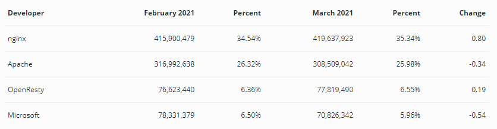
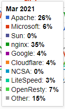

> 부스트코스 - 웹 프로그래밍(풀스택)강의를 학습, 정리한 내용입니다.(https://www.boostcourse.org/web316/joinLectures/12943)

- [웹서버](#웹서버)
  - [핵심 개념](#핵심-개념)
  - [웹 서버란?](#웹-서버란)
  - [웹 서버 소프트웨어의 종류](#웹-서버-소프트웨어의-종류)
    - [웹서버 랭킹 2021](#웹서버-랭킹-2021)
  - [생각해보기](#생각해보기)
  - [참고 자료](#참고-자료)

<small><i><a href='http://ecotrust-canada.github.io/markdown-toc/'>Table of contents generated with markdown-toc</a></i></small>

# 웹서버
웹 브라우저를 실행한 후 주소 입력창에 URL 주소를 입력하면, 그 URL주소에 해당하는 결과물이 화면에 보인다.

우리가 현실에서 주소를 보고 집을 찾아가는 것처럼, 웹 브라우저는 URL 주소에 해당하는 웹서버(Web Server)에 연결하고, 해당 주소에서 볼 수 있는 내용을 읽어 들여 보여주게 된다.

웹 브라우저의 요청을 받아 HTML 문서나 오브젝트를 반환하는 웹 서버
## 핵심 개념
* Apache
* Nginx
* HTTP
* 클라이언트 (Client)
* 서버 (Server)
## 웹 서버란?
* 웹 서버는 소프트웨어(Software)를 보통 말하지만, 웹 서버 소프트웨어가 동작하는 컴퓨터를 말합니다.
* 웹 서버의 가장 중요한 기능은 클라이언트(Client)가 요청하는 HTML 문서나 각종 리소스(Resource)를 전달하는 것입니다.
* 웹 브라우저나 웹 크롤러가 요청하는 리소스는 컴퓨터에 저장된 정적(static)인 데이터이거나 동적인 결과가 될 수 있습니다.
## 웹 서버 소프트웨어의 종류
* 가장 많이 사용하는 웹 서버는 Apache, Nginx, Microsoft IIS
* Apache웹 서버는 Apache Software Foundation에서 개발한 웹서버로 오픈소스 소프트웨어(Open-source Software)이며, 거의 대부분 운영체제에서 설치 및 사용을 할 수 있습니다.
* Nginx는 차세대 웹서버로 불리며 더 적은 자원으로 더 빠르게 데이터를 서비스하는 것을 목적으로 만들어진 서버이며 Apache웹 서버와 마찬가지로 오픈소스 소프트웨어입니다.

### 웹서버 랭킹 2021

## 생각해보기
네이버, 구글과 같은 검색을 할 수 있는 사이트에서는 검색어를 입력하면 검색어가 포함된 웹 페이지 목록을 보여줍니다.

네이버와 구글은 검색어가 포함된 웹페이지를 어떻게 알 수 있었을까요?

* 검색 엔진은 HTML로 작성된 웹 페이지에서 웹 크롤러(로봇, 문서수집기)가 추출한 텍스트를 축적하여 동작합니다.

제목, 내용, 목차 등등으로 영역을 나누어 추출하고 분석한 뒤 DB에 색인됩니다.

구글은 원래 페이지의 일부 혹은 전체를 캐시형태로 저장해두기까지 합니다.

네이버의 지식in은 질문형태로 정보를 저장하고 인물 연관 검색어 서비스(20년3월중단)에서는 연관 검색어를 저장하였습니다.

## 참고 자료
> [참고링크] 위키피디아 웹 서버
https://ko.wikipedia.org

> [참고링크] Apache HTTP Server Project
https://httpd.apache.org

> [참고링크] nginx
https://nginx.org

> [참고링크] Netcraft
https://news.netcraft.com

> [참고링크] NGINX 소개
https://opentutorials.org