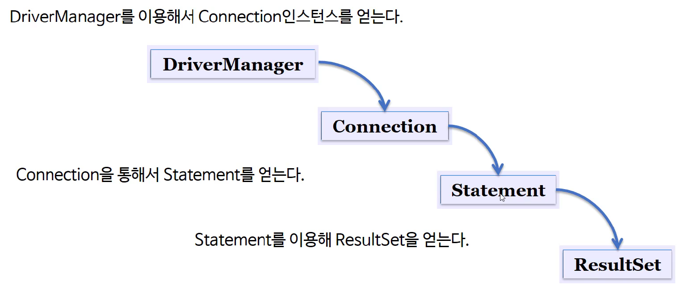

> 부스트코스 - 웹 프로그래밍(풀스택)강의를 학습, 정리한 내용입니다.(https://www.boostcourse.org/web316/joinLectures/12943)

# JDBC - BackEnd

- [JDBC - BackEnd](#jdbc---backend)
- [1) JDBC란?](#1-jdbc란)
	- [핵심 개념](#핵심-개념)
	- [JDBC 개요](#jdbc-개요)
	- [JDBC 환경 구성](#jdbc-환경-구성)
	- [JDBC를 이용한 프로그래밍 방법](#jdbc를-이용한-프로그래밍-방법)
	- [JDBC 클래스의 생성 관계](#jdbc-클래스의-생성-관계)
	- [JDBC 사용 - 단계별 설명](#jdbc-사용---단계별-설명)
	- [JDBC 소스코드 예제](#jdbc-소스코드-예제)
		- [정리](#정리)
	- [생각해보기](#생각해보기)
		- [내 생각](#내-생각)
	- [참고 자료](#참고-자료)
- [2) JDBC 실습](#2-jdbc-실습)
	- [핵심 개념](#핵심-개념-1)
	- [실습 1 - select](#실습-1---select)
		- [실습 단계](#실습-단계)
		- [주의사항](#주의사항)
		- [실습1 코드](#실습1-코드)
	- [실습 2 - insert](#실습-2---insert)
		- [실습2 코드](#실습2-코드)
		- [실행결과](#실행결과)
	- [실습 3 - select 2](#실습-3---select-2)
		- [코드 설명](#코드-설명)
		- [실습 3 코드](#실습-3-코드)
		- [실행결과](#실행결과-1)
	- [실습 4 - delete](#실습-4---delete)
		- [실습 4 코드](#실습-4-코드)
		- [실행결과](#실행결과-2)
	- [실습 5 - update](#실습-5---update)
		- [실습 5 코드](#실습-5-코드)
		- [실행결과](#실행결과-3)
	- [생각해보기](#생각해보기-1)
	- [참고 자료](#참고-자료-1)

<small><i><a href='http://ecotrust-canada.github.io/markdown-toc/'>Table of contents generated with markdown-toc</a></i></small>


# 1) JDBC란?
JAVA언어를 이용해서 DBMS로 부터 정보를 조회하는 방법인 JDBC  
자바를 이용한 데이터베이스 사용을 위한 자바 API
## 핵심 개념
* JDBC
* DriverManager
* Connection
* Statement
* ResultSet
## JDBC 개요
JDBC(Java Database Connectivity)의 정의
- 자바를 이용한 데이터베이스 접속과 SQL 문장의 실행, 그리고 실행 결과로 얻어진 데이터의 핸들링을 제공하는 방법과 절차에 관한 규약
- 자바 프로그램 내에서 SQL문을 실행하기 위한 자바 API
- SQL과 프로그래밍 언어의 통합 접근 중 한 형태
- JAVA는 표준 인터페이스인 JDBC API를 제공
- 데이터베이스 벤더(oracle DB, MySQL, 등등), 또는 기타 써드파티에서는 JDBC 인터페이스를 구현한 드라이버(driver)를 제공
## JDBC 환경 구성
* JDK 설치
* JDBC 드라이버 설치
  - Maven에 다음과 같은 의존성을 추가한다. MySQL사이트에서 다운로드 한다.(pom.xml)
  > [JDBC링크] MavenRepository - MySQL Connector/J (https://mvnrepository.com/artifact/mysql/mysql-connector-java)
```xml
<dependency>
    <groupId>mysql</groupId>
    <artifactId>mysql-connector-java</artifactId>
    <version>8.0.25</version>
</dependency>
```
* 현재(210718) 8.0.25 버전(210510)까지 나와 있다. 사용중인 mysql버전에 맞게 다운로드
> Java API Reference 참고 바로가기 (https://docs.oracle.com/javase/8/docs/api/)  
> JDBC Tutorial 참고 바로가기 (https://docs.oracle.com/javase/tutorial/jdbc/basics/index.html)
## JDBC를 이용한 프로그래밍 방법
1. import java.sql.*;
   > java.sql docs (https://docs.oracle.com/javase/8/docs/api/java/sql/package-summary.html)    
2. 드라이버를 로드 한다.
   - DB벤더의 라이브러리 로드
3. Connection 객체를 생성한다.
   - DB에 접속
   - Connection 객체는 DB 접속 시 얻어내 줄 수 있는 객체
   - Connection 인터페이스
     - 인터페이스는 자바 프로그래밍 언어에서 클래스들이 구현해야 하는 동작을 지정하는데 사용되는 추상 자료형
4. Statement 객체를 생성 및 질의 수행
   - 쿼리문을 작성하고 실행하는 단계에 속한다.
   - Statement 인터페이스
5. SQL문에 결과물이 있다면 ResultSet 객체를 생성한다. 
   - (결과가 있다면) 결과 리턴
   - select / insert, update, delete > 결과가 다르다. > 조금 다른 객체가 생성된다.
6. 모든 객체를 닫는다.
   - 연결 후에는 접속을 끊어줘야 한다.
   - DB에 클라이언트가 여러 명 접속할 수 있는데 DB에는 접속량의 한계치가 있기 때문에 접속을 꼭 끊어줘야한다.
   - 열었던 반대 순서로 닫는다.
## JDBC 클래스의 생성 관계

* 각 단계 마다 객체(인터페이스)를 생성한다.
* 순서대로 열고 역순으로 닫는다.
## JDBC 사용 - 단계별 설명
1. IMPORT
   * java.sql 패키지 안에 DriverManager, DConnecdtion, statement 인터페이스가 있다.
    ```java
    import java.sql.*;
    ```
1. 드라이버 로드
    > https://docs.oracle.com/javase/8/docs/api/java/sql/Driver.html  
    ```java
    Class.forName( "com.mysql.jdbc.Driver" );
    ```
    * `Class`라는 클래스가 갖고 있는 `forName` 메서드를 이용해 `"com.mysql.jdbc.Driver"`객체를 메모리에 저장한다.
    * New 메서드를 이용한 객체선언문과 비슷하게 동작한다
    * `"com.mysql.jdbc.Driver"`이러한 객체는 벤더에 따라 달라진다
2. Connection 얻기
    ```java
    String dburl  = "jdbc:mysql://localhost/dbName";

    Connection con =  DriverManager.getConnection ( dburl, ID, PWD );
    ```
    * 각 벤더마다 dburl을 정하는 방식이 조금씩 다르다.
    * 소스코드 예제 - oracle db
        ```java
        public static Connection getConnection() throws Exception{
            String url = "jdbc:oracle:thin:@117.16.46.111:1521:xe";
            String user = "smu";
            String password = "smu";
            Connection conn = null;
            Class.forName("oracle.jdbc.driver.OracleDriver");
            conn = DriverManager.getConnection(url, user, password);
            return conn;
        }
        ``` 
        * 벤더마다 값이 조금씩 다를 뿐 대체로 형식은 같다.
1. Statement 생성
    ```java
    Statement stmt = con.createStatement();
    ``` 
5. 질의 수행
    ```java
    ResultSet rs = stmt.executeQuery("select no from user" );

    참고
    stmt.execute(“query”);             //any SQL
    stmt.executeQuery(“query”);     //SELECT
    stmt.executeUpdate(“query”);   //INSERT, UPDATE, DELETE
    ``` 
    * Statement 객체인 stmt를 통해서 ResultSet 객체 rs를 얻어 낼 수 있다.
    * 쿼리문의 종류에 따라( select/ insert, update, delete ) 질의 수행 메서드가 다르다. 
6. ResultSet으로 결과 받기
    ```java
    ResultSet rs =  stmt.executeQuery( "select no from user" );
    while ( rs.next() )
        System.out.println( rs.getInt( "no") );
    ```
    * ResultSet으로부터 결과 값을 얻어오는 단계
    * 현재 ResultSet은 DB쪽에 있다
    * DB의 ResultSet에 rs(레퍼런스)를 얻어온다.(ResultSet을 가리키는 레퍼런스 변수)
    * `rs.next()`를 이용해 실행한다
    * 값이 없을 때까지 실행하되 컬럼명이 넘버인 애 값을 꺼내온다.
    * 더이상 값이 없으면 false를 반환하고 반복문 종료
7. Close
    ```java
    rs.close();

    stmt.close();

    con.close();
    ```
    * 반드시 종료하되 순서를 반대로 종료한다.
## JDBC 소스코드 예제
* guestbook 테이블에서 모든 데이터를 꺼내오기 위한 코드
```java
public List<GuestBookVO> getGuestBookList(){
		List<GuestBookVO> list = new ArrayList<>();
		GuestBookVO vo = null;
		Connection conn = null;
		PreparedStatement ps = null;
		ResultSet rs = null;
		try{
			conn = DBUtil.getConnection();
			String sql = "select * from guestbook";
			ps = conn.prepareStatement(sql);
			rs = ps.executeQuery();
			while(rs.next()){
				vo = new GuestBookVO();
				vo.setNo(rs.getInt(1));
				vo.setId(rs.getString(2));
				vo.setTitle(rs.getString(3));
				vo.setConetnt(rs.getString(4));
				vo.setRegDate(rs.getString(5));
				list.add(vo);
			}
		}catch(Exception e){
			e.printStackTrace();
		}finally {
			DBUtil.close(conn, ps, rs);
		}		
		return list;		
	}
```

* Guestbook 데이터를 추가하는 코드
```java
public int addGuestBook(GuestBookVO vo){
		int result = 0;
		Connection conn = null;
		PreparedStatement ps = null;
		try{
			conn = DBUtil.getConnection();
			String sql = "insert into guestbook values("
					+ "guestbook_seq.nextval,?,?,?,sysdate)";
			ps = conn.prepareStatement(sql);
			ps.setString(1, vo.getId());
			ps.setString(2, vo.getTitle());
			ps.setString(3, vo.getConetnt());
			result = ps.executeUpdate();
		}catch(Exception e){
			e.printStackTrace();
		}finally {
			DBUtil.close(conn, ps);
		}
		
		return result;
	}
```
* DB사용 후 close 하는 코드
```java
public static void close(Connection conn, PreparedStatement ps){
		if (ps != null) {
			try {
				ps.close();
			} catch (SQLException e) {e.printStackTrace(); }
		}
		if (conn != null) {
			try {
				conn.close();
			} catch (SQLException e) {e.printStackTrace();}
		}
	}
```
### 정리
* 같은 작업을 수행할 때마다 똑같은 코드를 반복적으로 사용하게 될 것이다.
* 프레임워크는 이런 반복작업을 사용자가 일일히 작업하지 않고도 더 편하게 실행시킬 수 있는 도구다.
* 사용자는 쿼리 실행문만 프레임워크에 입력하면 프레임워크가 반복적인 코드를 알아서 실행해준다.
* JDBC를 직접 만들어보지 않아도 Spring JDBC라는 프레임워크를 사용하여 JDBC를 사용할 수 있다.
* 프레임워크를 사용하더라도 작동방식을 알고 있는 상태면 문제 발생시 해결하기 쉽다.
## 생각해보기
java.sql패키지를 보면 대부분이 interface로 되어 있는 것을 알 수 있다.

이를 실제로 구현하는 것은 DBMS를 만든 회사

java.sql외에 JAVA가 인터페이스만 대부분 제공하는 패키지는 또 어떤 것이 있을까?

참고로 XML문서의 표준은 w3c에서 정한다.
### 내 생각
java.sql외에 JAVA가 인터페이스만 대부분 제공하는 패키지 ?
>[참고] https://docs.oracle.com/javase/8/docs/api/ 
* java.awt , java.applet , javax.lang.model.element
* 인터페이스만 대부분 제공하지는 않고 다양한 메소드들도 대부분 제공한다.
## 참고 자료
> [참고링크] Java API Reference
https://docs.oracle.com

> [참고링크] JDBC Tutorial
https://docs.oracle.com


# 2) JDBC 실습
JDBC를 이용해 데이터베이스에서 입력/수정/조회/삭제를 하는 프로그램 만들기 
## 핵심 개념
* JDBC
* PreparedStatement
* ResultSet
* Connection
## 실습 1 - select
example.sql의 role 테이블을 활용한 실습  
데이터를 한 건 가져오는(select) 메서드, `get Role()`을 작성
### 실습 단계
1. new Maven project 생성 
2. JDK 1.8 버전 지원 plugin 코드 pom.xml에 추가(maven-compiler-plugin)
3. JDBC 드라이버 설치 코드 pom.xml에 추가(mysql-connector-java)
4. Role 클래스 생성 및 작성 
   * kr.or.connect.jdbcexam.dto 패키지에 작성한다.
   1. 칼럼 2개를 담을 필드(변수객체) 작성(`roleId`, `description`)
         * 카멜 표기법을 지키며 작성
           * 자바에서 필드명은 항상 소문자로 시작
           * 단어가 두 개 이상 연결될 때는 두 번째 단어의 첫 글자를 대문자로
   2. `getter()`, `setter()` 메서드 생성
      * Source > Generate getter, setter > select all > generate
   3. `toString()` 메서드 오버라이딩
      * 객체의 데이터들을 편하게 출력하기 위해
      * Source > Generate toString()... > Generate
   4. `Role` 생성자 추가
      * 조금 더 편하게 객체를 생성하기 위해 인자 값 2개를 받아들여 각각에다 값을 담아주는 생성자를 추가
5. RoleDao 클래스 생성 및 작성
    * kr.or.connect.jdbcexam.dao 패키지에 작성한다.
    1. Role(한 건의 데이터를 담아낼 객체)을 리턴하는 메서드(`getRole`) 작성
     * `role_id`가 프라이머리 키였으므로  `role_id`를 파라미터로 받아서 가져오게 한다.
     * import 필요
    2. 프로그램 수행 단계별 객체 선언
      * 연결을 맺기 위한 객체(`Connections`)
      * 명령을 선언할 객체-statement객체(`PreparedStatement`)
      * 결과값을 담아낼 객체(`ResultSet`)
    3. 예외처리
      * try-catch구문 사용
      * 접속, 연결을 반드시 닫아내는 것이 중요하므로 finally 블록을 사용해 닫아주는 코드를 작성한다.
      * 닫아주는 코드는 각 객체마다 close라는 메서드를 수행하면 되는데 close메서드 자체도 예외를 처리해야 된다.
      * 예외처리 시에 예외가 발생할 상황들에 대해서 미리 피할 수 있게 처리하는 조건문을 추가한다.(조금이라도 더 안전하게 오류가 발생하지 않도록)
    4. MySQL 드라이버 다운로드 코드 추가
       * `Class` 클래스의 `forName()`메서드를 사용
    5. Connection 객체(`conn`) 얻어오는 코드 추가 
       * `DriverManager` 클래스의 `getConnection()` 메서드 사용
       * `getConnection()` 메서드에게 접속할 DB의 url, user, password에 관련된 정보를 담아주면 된다
       * 지금 데이터를 한 건 가져오는 메서드를 만들고 있는데 이 메서드에서만 사용할 것이 아니고 DB 접속하는 부분이 계속 중복되서 나오게 될 거기 때문에 상수처럼 바깥쪽에 url, user, password 변수를 선언한다.
    6. Statement 객체(`ps`)를 얻어온다. 
       * `conn` 객체를 이용
       * 쿼리문 작성 - select
         * `role`테이블에서 `role_id`와 `description`을 얻어오는 쿼리 작성
         * 물음표(?)를 사용하여 인자 값이 무엇이 들어왔느냐에 따라서 메서드 호출시 값을 변경시킬 수 있게 한다.(preparedStatement쿼리의 특징)
         * 물음표에 대한 설정을 위한 코드를 작성해줘야 한다.
           * prepareStatement의 set메서드 사용
           * setInt(parameterIndex, x)
             * parameterIndex는 물음표의 순서, x는 물음표 대신 넣을 값(변수)
    7. 실행 코드 추가
       * executeQuery() 메서드 사용
       * 결과값이 없을 수 도 있으니 rs객체의 메서드인 next메서드를 이용해 조건문을 추가한다.
       * 결과값 인자의 데이터타입을 생각하여 getString, getInt와 같은 메서드를 적절히 사용한다.(순서대로 코드작성)
       * get메서드로 가져온 값을 변수에 저장한다
       * role객체를 생성하고 위에서 저장한 값을 role객체에 저장한다.
   
6. JDBCExam1 클래스 생성 및 작성
    * Role, RoleDao 예제가 잘 실행되는지 테스트
    * RoleDao가 잘 실행되는지 확인하기 위함이므로 RoleDao 객체(`dao`)를 생성하고 dao의 getRole(x)으로 실습해본다.
    * getRole(100)

### 주의사항
* `com.mysql.cj.jdbc.Driver'
  * 드라이버 클래스가 업데이트 되었다.
  * 이전 드라이버 클래스를 사용하자 SPI가 자동으로 최신 버전의 드라이버 클래스를 사용하도록 바꿔주었다.
  * console 문구:
    * Loading class `com.mysql.jdbc.Driver`. This is deprecated. The new driver class is `com.mysql.cj.jdbc.Driver`. The driver is automatically registered via the SPI and manual loading of the driver class is generally unnecessary.
* dependencies 추가시 mysql version에 맞게 추가해야 한다.
### 실습1 코드
`pom.xml`
```xml
<?xml version="1.0" encoding="UTF-8"?>

<project xmlns="http://maven.apache.org/POM/4.0.0"
	xmlns:xsi="http://www.w3.org/2001/XMLSchema-instance"
	xsi:schemaLocation="http://maven.apache.org/POM/4.0.0 http://maven.apache.org/xsd/maven-4.0.0.xsd">
	<modelVersion>4.0.0</modelVersion>

	<groupId>kr.or.connect</groupId>
	<artifactId>jdbcexam</artifactId>
	<version>0.0.1-SNAPSHOT</version>

	<name>jdbcexam</name>
	<!-- FIXME change it to the project's website -->
	<url>http://www.example.com</url>

	<properties>
		<project.build.sourceEncoding>UTF-8</project.build.sourceEncoding>
		<maven.compiler.source>1.7</maven.compiler.source>
		<maven.compiler.target>1.7</maven.compiler.target>
	</properties>

	<dependencies>
		<!-- https://mvnrepository.com/artifact/mysql/mysql-connector-java -->
		<dependency>
			<groupId>mysql</groupId>
			<artifactId>mysql-connector-java</artifactId>
			<version>8.0.25</version>
		</dependency>

		<dependency>
			<groupId>junit</groupId>
			<artifactId>junit</artifactId>
			<version>4.11</version>
			<scope>test</scope>
		</dependency>
	</dependencies>

	<build>
		<pluginManagement><!-- lock down plugins versions to avoid using Maven 
				defaults (may be moved to parent pom) -->
			<plugins>
				<!-- clean lifecycle, see https://maven.apache.org/ref/current/maven-core/lifecycles.html#clean_Lifecycle -->
				<plugin>
					<artifactId>maven-clean-plugin</artifactId>
					<version>3.1.0</version>
				</plugin>
				<!-- default lifecycle, jar packaging: see https://maven.apache.org/ref/current/maven-core/default-bindings.html#Plugin_bindings_for_jar_packaging -->
				<plugin>
					<artifactId>maven-resources-plugin</artifactId>
					<version>3.0.2</version>
				</plugin>
				<plugin>
					<artifactId>maven-compiler-plugin</artifactId>
					<version>3.8.0</version>
				</plugin>
				<plugin>
					<artifactId>maven-surefire-plugin</artifactId>
					<version>2.22.1</version>
				</plugin>
				<plugin>
					<artifactId>maven-jar-plugin</artifactId>
					<version>3.0.2</version>
				</plugin>
				<plugin>
					<artifactId>maven-install-plugin</artifactId>
					<version>2.5.2</version>
				</plugin>
				<plugin>
					<artifactId>maven-deploy-plugin</artifactId>
					<version>2.8.2</version>
				</plugin>
				<!-- site lifecycle, see https://maven.apache.org/ref/current/maven-core/lifecycles.html#site_Lifecycle -->
				<plugin>
					<artifactId>maven-site-plugin</artifactId>
					<version>3.7.1</version>
				</plugin>
				<plugin>
					<artifactId>maven-project-info-reports-plugin</artifactId>
					<version>3.0.0</version>
				</plugin>
				<plugin>
					<groupId>org.apache.maven.plugins</groupId>
					<artifactId>maven-compiler-plugin</artifactId>
					<version>3.6.1</version>
					<configuration>
						<source>1.8</source>
						<target>1.8</target>
					</configuration>
				</plugin>
			</plugins>
		</pluginManagement>
	</build>
</project>
```
`Role.java`
```java
package kr.or.connect.jdbcexam.dto;

public class Role {
	private Integer roleId;
	private String description;
	
	public Role() {
		
	}
	
	// 객체데이터를 받아들여 각각에다 값을 담아주는 생성자 작성
	public Role(Integer roleId, String description) {
		super();
		this.roleId = roleId;
		this.description = description;
	}
	
	// getter(), setter() 메서드 생성
	public Integer getRoleId() {
		return roleId;
	}
	public void setRoleId(Integer roleId) {
		this.roleId = roleId;
	}
	public String getDescription() {
		return description;
	}
	public void setDescription(String description) {
		this.description = description;
	}
	
	// toString() 메서드 오버라이딩
	@Override
	public String toString() {
		return "Role [roleId=" + roleId + ", description=" + description + "]";
	}	
}
```
`RoleDao.java`
```java
package kr.or.connect.jdbcexam.dao;

import java.sql.Connection;
import java.sql.DriverManager;
import java.sql.PreparedStatement;
import java.sql.ResultSet;
import java.sql.SQLException;

import kr.or.connect.jdbcexam.dto.Role;

public class RoleDao { // 데이터를 한 건 가져오는 메서드 추가

	private static String dburl = "jdbc:mysql://localhost:3306/connectdb";
	private static String dbUser = "connectuser";
	private static String dbpassword = "connect123!@#";

	public Role getRole(Integer roleId) {
		Role role = null;
		Connection conn = null;
		PreparedStatement ps = null;
		ResultSet rs = null;

		try {
			Class.forName("com.mysql.jdbc.Driver");
			conn = DriverManager.getConnection(dburl, dbUser, dbpassword);
			String sql = "SELECT role_id, description FROM role WHERE role_id = ?";
			ps = conn.prepareStatement(sql);
			ps.setInt(1, roleId);
			rs = ps.executeQuery();

			if (rs.next()) {
				String description = rs.getString(1);
				int id = rs.getInt("role_id");
				role = new Role(id, description);
			}
		} catch (Exception e) {
			e.printStackTrace();
		} finally {
			if (rs != null) {
				try {
					rs.close();
				} catch (SQLException e) {
					e.printStackTrace();
				}
			}
			if (ps != null) {
				try {
					ps.close();
				} catch (SQLException e) {
					e.printStackTrace();
				}
			}
			if (conn != null) {
				try {
					conn.close();
				} catch (SQLException e) {
					e.printStackTrace();
				}
			}
		}

		return role;
	}

}
``` 
`JDBCExam1.java`  
실습 확인용 예제 실행 코드
```java
import kr.or.connect.jdbcexam.dao.RoleDao;
import kr.or.connect.jdbcexam.dto.Role;

public class JDBCExam1 {

	public static void main(String[] args) {
		RoleDao dao = new RoleDao();
		Role role = dao.getRole(100);
		System.out.println(role);
	}

}
```
## 실습 2 - insert
### 실습2 코드
`RoleDao.java`
```java
	public int addRole(Role role) {
		int insertCount = 0;

		Connection conn = null;
		PreparedStatement ps = null;

		try {
			Class.forName("com.mysql.cj.jdbc.Driver");

			conn = DriverManager.getConnection(dburl, dbUser, dbpassword);

			String sql = "INSERT INTO role (role_id, description) VALUES (?, ?)";

			ps = conn.prepareStatement(sql);

			ps.setInt(1, role.getRoleId());
			ps.setString(2, role.getDescription());

			insertCount = ps.executeUpdate();
		} catch (Exception e) {
			e.printStackTrace();
		} finally {
			if (ps != null) {
				try {
					ps.close();
				} catch (Exception e) {
				}
			}
			if (conn != null) {
				try {
					conn.close();
				} catch (Exception e) {
				}
			}
		}
		return insertCount;

	}
```
`JDBCExam2.java`
```java
package kr.or.connect.jdbcexam;

import kr.or.connect.jdbcexam.dao.RoleDao;
import kr.or.connect.jdbcexam.dto.Role;

public class JDBCExam2 {

	public static void main(String[] args) {
		int roleId = 500;
		String description = "CTO";

		Role role = new Role(roleId, description);

		RoleDao dao = new RoleDao();
		int insertCount = dao.addRole(role);

		System.out.println(insertCount);
	}
}
```
### 실행결과
```
mysql> select * from role;
+---------+-----------------+
| role_id | description     |
+---------+-----------------+
|     100 | Developer       |
|     101 | Researcher      |
|     102 | Project manager |
|     201 | NULL            |
|     500 | CTO             |
+---------+-----------------+
5 rows in set (0.00 sec)
```
* 성공적으로 500/CTO 데이터가 insert 되었다.

## 실습 3 - select 2
`RoleDao.java`  
### 코드 설명
* `getRoles()`메서드 작성
* 데이터를 모두 조회하기 위한 코드
* Role의 List를 리턴한다.
* try-with-resources 구문을 사용한다.
  * finally 블록의 객체의 연결을 끊는 close()구문의 코드를 대폭 줄일 수 있다.
### 실습 3 코드
`RoleDao.java`
```java
package kr.or.connect.jdbcexam.dao;

import java.sql.Connection;
import java.sql.DriverManager;
import java.sql.PreparedStatement;
import java.sql.ResultSet;
import java.sql.SQLException;
import java.util.ArrayList;
import java.util.List;

import kr.or.connect.jdbcexam.dto.Role;

public class RoleDao {

	private static String dburl = "jdbc:mysql://localhost:3306/connectdb";
	private static String dbUser = "connectuser";
	private static String dbpassword = "connect123!@#";

	public List<Role> getRoles() {
		List<Role> list = new ArrayList<>();

		try {
			Class.forName("com.mysql.cj.jdbc.Driver");
		} catch (ClassNotFoundException e) {
			e.printStackTrace();
		}

		String sql = "SELECT description, role_id FROM role order by role_id desc";
		try (Connection conn = DriverManager.getConnection(dburl, dbUser, dbpassword);
				PreparedStatement ps = conn.prepareStatement(sql)) {

			try (ResultSet rs = ps.executeQuery()) {

				while (rs.next()) {
					String description = rs.getString(1);
					int id = rs.getInt("role_id");
					Role role = new Role(id, description);
					list.add(role); // list에 반복할때마다 Role인스턴스를 생성하여 list에 추가한다.
				}
			} catch (Exception e) {
				e.printStackTrace();
			}
		} catch (Exception ex) {
			ex.printStackTrace();
		}
		return list;
	}

	public int addRole(Role role) {
		int insertCount = 0;

		Connection conn = null;
		PreparedStatement ps = null;

		try {
			Class.forName("com.mysql.cj.jdbc.Driver");

			conn = DriverManager.getConnection(dburl, dbUser, dbpassword);

			String sql = "INSERT INTO role (role_id, description) VALUES (?, ?)";

			ps = conn.prepareStatement(sql);

			ps.setInt(1, role.getRoleId());
			ps.setString(2, role.getDescription());

			insertCount = ps.executeUpdate();
		} catch (Exception e) {
			e.printStackTrace();
		} finally {
			if (ps != null) {
				try {
					ps.close();
				} catch (Exception e) {
				}
			}
			if (conn != null) {
				try {
					conn.close();
				} catch (Exception e) {
				}
			}
		}
		return insertCount;
	}

	public Role getRole(Integer roleId) {
		Role role = null;
		Connection conn = null;
		PreparedStatement ps = null;
		ResultSet rs = null;

		try {
			Class.forName("com.mysql.cj.jdbc.Driver");
			conn = DriverManager.getConnection(dburl, dbUser, dbpassword);
			String sql = "SELECT role_id, description FROM role WHERE role_id = ?";
			ps = conn.prepareStatement(sql);
			ps.setInt(1, roleId);
			rs = ps.executeQuery();

			if (rs.next()) {
				String description = rs.getString(1);
				int id = rs.getInt("role_id");
				role = new Role(id, description);
			}
		} catch (Exception e) {
			e.printStackTrace();
		} finally {
			if (rs != null) {
				try {
					rs.close();
				} catch (SQLException e) {
					e.printStackTrace();
				}
			}
			if (ps != null) {
				try {
					ps.close();
				} catch (SQLException e) {
					e.printStackTrace();
				}
			}
			if (conn != null) {
				try {
					conn.close();
				} catch (SQLException e) {
					e.printStackTrace();
				}
			}
		}

		return role;
	}

}
```
`JDBCExam3.java`
* role테이블의 모든 데이터를 출력하는 실행 예제 코드
```java
package kr.or.connect.jdbcexam;

import java.util.List;

import kr.or.connect.jdbcexam.dao.RoleDao;
import kr.or.connect.jdbcexam.dto.Role;

public class JDBCExam3 {
	public static void main(String[] args) {

		RoleDao dao = new RoleDao();

		List<Role> list = dao.getRoles();

		for (Role role : list) {
			System.out.println(role);
		}
	}
}
```
### 실행결과
```
Role [roleId=500, description=CTO]
Role [roleId=201, description=null]
Role [roleId=102, description=Project manager]
Role [roleId=101, description=Researcher]
Role [roleId=100, description=Developer]
```
## 실습 4 - delete
### 실습 4 코드
`RoleDao.java`
```java

```
`JDBCExam3.java`
```java
package kr.or.connect.jdbcexam;

import java.util.List;

import kr.or.connect.jdbcexam.dao.RoleDao;
import kr.or.connect.jdbcexam.dto.Role;

public class JDBCExam3 {
	public static void main(String[] args) {

		RoleDao dao = new RoleDao();
		
		List<Role> list = dao.getRoles();

		for(Role role : list) {
			System.out.println(role);
		}
	} 
}
```
`JDBCExam4.java`
```java
package kr.or.connect.jdbcexam;

import kr.or.connect.jdbcexam.dao.RoleDao;

public class JDBCExam4 {
	public static void main(String[] args) {
//삭제 테스트
		int roleId = 500;

		RoleDao dao = new RoleDao();
		int deleteCount = dao.deleteRole(roleId);

		System.out.println(deleteCount);
	}
}
```
### 실행결과
```
mysql> select * from role;
+---------+-----------------+
| role_id | description     |
+---------+-----------------+
|     100 | Developer       |
|     101 | Researcher      |
|     102 | Project manager |
|     201 | NULL            |
+---------+-----------------+
4 rows in set (0.00 sec)
```
* roleId=500인 데이터가 삭제되었다.
## 실습 5 - update
### 실습 5 코드
`RoleDao.java`
```java
package kr.or.connect.jdbcexam.dao;

import java.sql.Connection;
import java.sql.DriverManager;
import java.sql.PreparedStatement;
import java.sql.ResultSet;
import java.sql.SQLException;
import java.util.ArrayList;
import java.util.List;

import kr.or.connect.jdbcexam.dto.Role;

public class RoleDao {
	private static String dburl = "jdbc:mysql://localhost:3306/connectdb";
	private static String dbUser = "connectuser";
	private static String dbpasswd = "connect123!@#";
	
	public int updateRole(Role role) {
		int updateCount = 0;
		
		
		Connection conn = null;
		PreparedStatement ps = null;
		
		try {
			Class.forName( "com.mysql.jdbc.Driver" );
			
			conn = DriverManager.getConnection ( dburl, dbUser, dbpasswd );
			
			String sql = "update role set description = ? where role_id = ?";
			
			ps = conn.prepareStatement(sql);
			
			ps.setString(1, role.getDescription());
			ps.setInt(2,  role.getRoleId());
			
			updateCount = ps.executeUpdate();

		}catch(Exception ex) {
			ex.printStackTrace();
		}finally {
			if(ps != null) {
				try {
					ps.close();
				}catch(Exception ex) {}
			} // if
			
			if(conn != null) {
				try {
					conn.close();
				}catch(Exception ex) {}
			} // if
		} // finally
		
		return updateCount;
	}
}

```
`JDBCExam5.java`
```java
package kr.or.connect.jdbcexam;

import kr.or.connect.jdbcexam.dao.RoleDao;
import kr.or.connect.jdbcexam.dto.Role;

public class JDBCExam5 {
	public static void main(String[] args) {
//수정테스트
		int roleId = 500;
		String description = "CEO";
		
		Role role = new Role(roleId, description);
		
		RoleDao dao = new RoleDao();
		int updateCount = dao.updateRole(role);

		System.out.println(updateCount);
	} 
}
```
### 실행결과
* roleId = 500, description = CTO인 데이터를 추가한 상태에서 실습
```
mysql> select * from role;
+---------+-----------------+
| role_id | description     |
+---------+-----------------+
|     100 | Developer       |
|     101 | Researcher      |
|     102 | Project manager |
|     201 | NULL            |
|     500 | CEO             |
+---------+-----------------+
5 rows in set (0.00 sec)
```
* 500/CTO 데이터가 500/CEO로 수정되었다.
## 생각해보기
* Question
  1. JDBC를 이용해서 입력/수정/삭제/조회 메소드를 만들다 보면, 반복적인 코드가 많다는 것을 알 수 있습니다.  
  반복되는 부분을 별도의 메서드나 클래스로 추출한다면 어떤 부분의 중복을 제거할수 있을까요?  
  2. JDK7부터 추가된 try-with-resource 구문을 이용한다면 예제 코드 중 어떤 부분을 줄일 수 있을까요? 
* Answer
  1. sql부분을 제외하고는 중복되는 부분이 많으므로 별도로 추출할 수 있을 것이다.

  2. finally 블록에서 모든 객체와의 접속을 끊기 위해 close()하는 부분의 코드를 줄일 수 있다.

## 참고 자료
[참고] Role 스키마 구조
```
mysql> describe Role;
+-------------+--------------+------+-----+---------+-------+
| Field       | Type         | Null | Key | Default | Extra |
+-------------+--------------+------+-----+---------+-------+
| role_id     | int(11)      | NO   | PRI | NULL    |       |
| description | varchar(100) | YES  |     | NULL    |       |
+-------------+--------------+------+-----+---------+-------+ 
```
> [참고링크] JDBC Tutorial
https://docs.oracle.com

> [참고링크] The try-with-resources Statement
https://docs.oracle.com