> 부스트코스 - 웹 프로그래밍(풀스택)강의를 학습, 정리한 내용입니다.(https://www.boostcourse.org/web316/joinLectures/12943)

# JSTL - BackEnd

- [JSTL - BackEnd](#jstl---backend)
- [JSTL(JSP Standard Tag Library)](#jstljsp-standard-tag-library)
  - [핵심 개념](#핵심-개념)
  - [JSTL이란?](#jstl이란)
  - [JSTL을 사용하려면?](#jstl을-사용하려면)
  - [JSTL이 제공하는 태그의 종류](#jstl이-제공하는-태그의-종류)
  - [코어 태그](#코어-태그)
  - [변수 지원 태그](#변수-지원-태그)
    - [set, remove](#set-remove)
    - [프로퍼티, 맵의 처리](#프로퍼티-맵의-처리)
  - [흐름제어 태그](#흐름제어-태그)
    - [if](#if)
    - [choose](#choose)
    - [forEach](#foreach)
    - [import](#import)
    - [redirect](#redirect)
    - [out](#out)
  - [커스텀 태그](#커스텀-태그)
  - [생각해보기](#생각해보기)
    - [내생각](#내생각)
  - [참고 자료](#참고-자료)

<small><i><a href='http://ecotrust-canada.github.io/markdown-toc/'>Table of contents generated with markdown-toc</a></i></small>


# JSTL(JSP Standard Tag Library)
JSTL을 이해하고 사용할 수 있도록 JSTL을 알아보자
* 프론트 개발자가 JSP를 수정하는데, JSP 안에 자바코드와 HTML코드가 섞여 있다면 수정할 때 굉장히 어려움을 느끼게 될 가능성이 크다.
* 이런 문제를 해결하기 위해서 등장한 것이 JSTL
* JSTL을 이용하면 태그형식으로 조건문, 반복문 등을 사용할 수 있다.
* 그리고, 앞에서 배운 EL과 연동하면 더욱 강력하게 사용 가능
## 핵심 개념
* JSTL
* core tag
## JSTL이란?
* JSTL(JSP Standard Tag Library)은 JSP 페이지에서 조건문 처리, 반복문 처리 등을 html tag형태로 작성할 수 있게 도와준다.
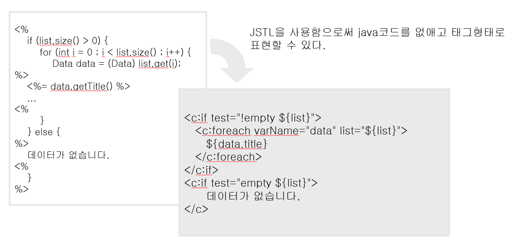
## JSTL을 사용하려면?
> http://tomcat.apache.org/download-taglibs.cgi
* 위의 사이트에서 3가지 jar파일을 다운로드 한 후 WEB-INF/lib/ 폴더에 복사를 한다.
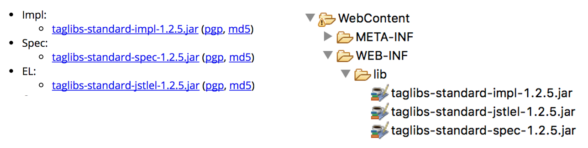
## JSTL이 제공하는 태그의 종류
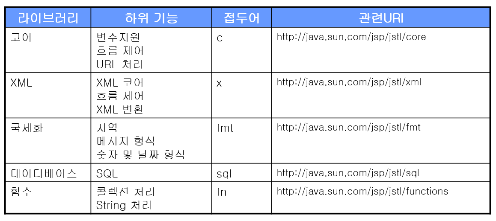
## 코어 태그
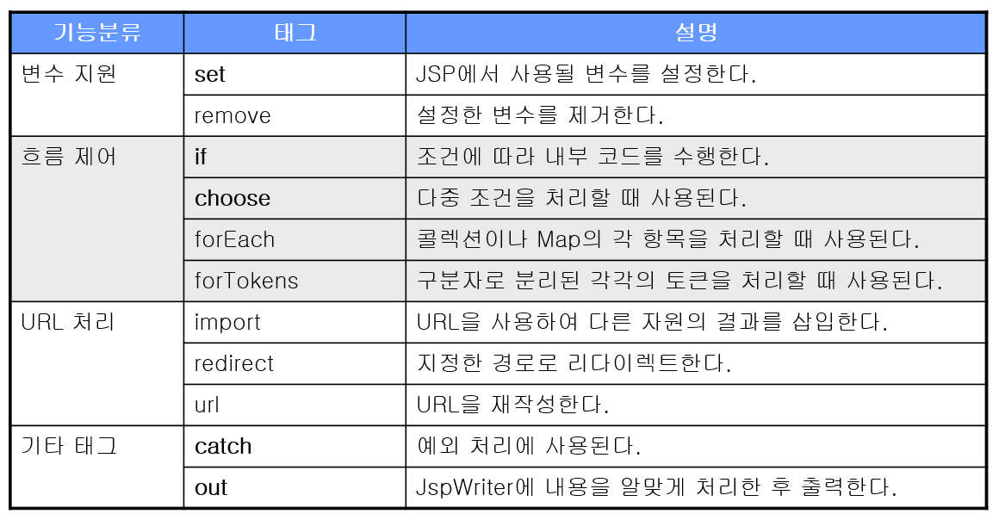
## 변수 지원 태그
### set, remove
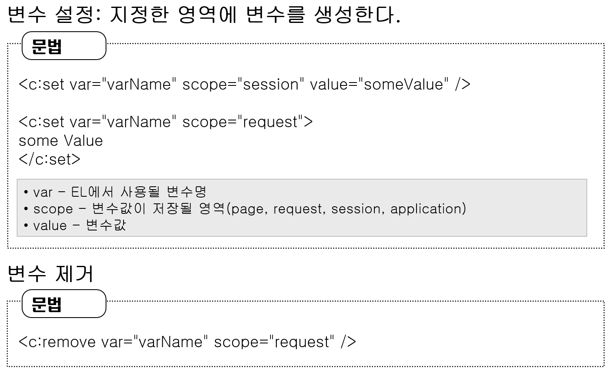

실습 `jstl01.jsp`
  * set, remove의 활용
```jsp
<%@ page language="java" contentType="text/html; charset=UTF-8"
    pageEncoding="UTF-8"%>
    
<%@ taglib prefix="c" uri="http://java.sun.com/jsp/jstl/core"%>
<c:set var="value1" scope="request" value="kang"/>
    
<!DOCTYPE html>
<html>
<head>
<meta charset="UTF-8">
<title>Insert title here</title>
</head>
<body>

성 : ${value1 } <br>
<c:remove var="value1" scope="request"/>
성 : ${value1 } <br>

</body>
</html>
```
### 프로퍼티, 맵의 처리
* 변수지원 태그를 이용해 프로퍼티나 맵을 처리할 수 있다.
* 객체의 프로퍼티(자바)
  - 객체의 값을 변경하거나 값을 읽어들이기 위한 getter, setter 메서드를 생각하면 된다.
* set태그를 이용해 특정한 객체의 메서드에 값을 전달할 수도 있다.
* JSTL표기법(Syntax)
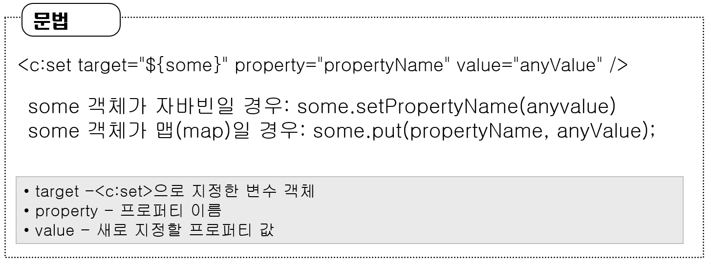
* some 객체가 자바빈일 경우
  * propertyName은 실제 필드명과 같은 `setter`메서드를 가지고 있을 것
  * setter 메서드는 항상 규칙을 지켜서 만들어야한다.
    * set + 필드의 첫글자는 대문자로
      * setProperty
* some 객체가 map일 경우
  * map이 가지고 있는 `put`이라는 메서드가 실행될 것
  * propertyName과 anyValue가 각각 프로퍼티와 값으로 지정되어 사용
## 흐름제어 태그
### if
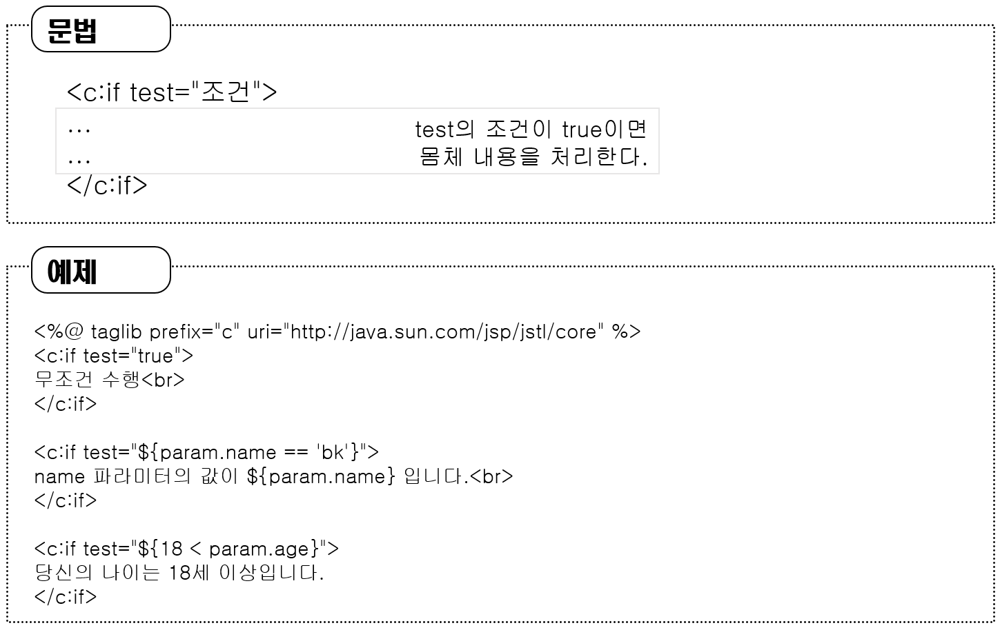
* 자바의 if문과 달리 else에 대한 처리는 없다.
* test의 조건이 true일 경우 실행

실습 `jstl02.jsp`
```jsp
<%@ page language="java" contentType="text/html; charset=UTF-8"
    pageEncoding="UTF-8"%>
   
<%@ taglib prefix="c" uri="http://java.sun.com/jsp/jstl/core"%>

<%
	request.setAttribute("n", 10);
%>
<%-- <c:set var="n" scope="request" value="10"/> --%>
    
<!DOCTYPE html>
<html>
<head>
<meta charset="UTF-8">
<title>Insert title here</title>
</head>
<body>

<c:if test="${n == 0 }">
	n과 0은 같습니다.
</c:if>
<c:if test="${n == 10 }">
	n과 10은 같습니다.
</c:if>

</body>
</html>
```
* 아래 두 코드는 같다.
1. 스크립트릿사용
```jsp
<%
	request.setAttribute("n", 10);
%>
```
2. JSTL사용
```jsp
<c:set var="n" scope="request" value="10"/>
```
* request영역의 n의 값을 10으로 setting했기 때문에 "n은 10과 같습니다."만 출력된다.
### choose
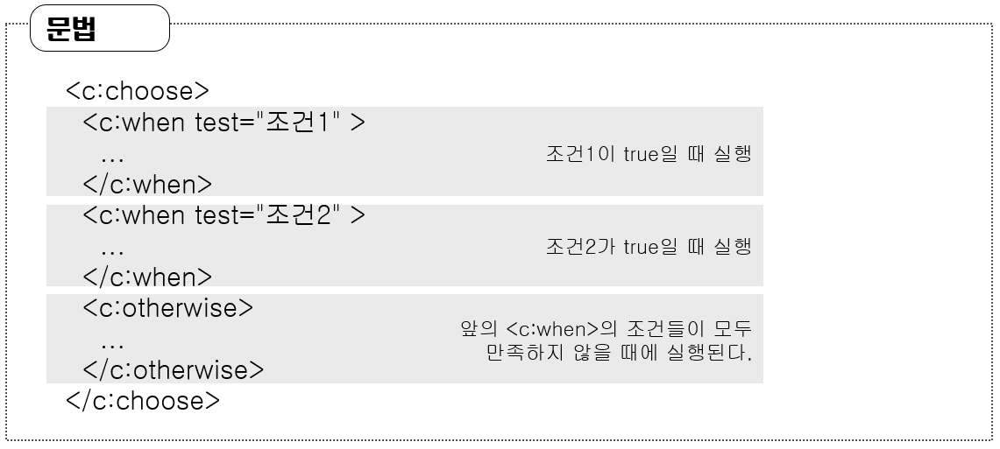
* if-else구문과 유사
* when이 여러 개 나올 수 있다.
* when 조건문들이 전부 맞지 않으면
* otherwise 실행

실습 `jstl03.jsp`
  * switch의 활용
```jsp
<%@ page language="java" contentType="text/html; charset=UTF-8"
    pageEncoding="UTF-8"%>

<%@ taglib prefix="c" uri="http://java.sun.com/jsp/jstl/core"%>

<%
	request.setAttribute("score", 70);
%>
    
<!DOCTYPE html>
<html>
<head>
<meta charset="UTF-8">
<title>Insert title here</title>
</head>
<body>

<c:choose>
	<c:when test="${score >= 90 }">
		A 학점입니다.
	</c:when>
	<c:when test="${score >= 80 }">
		B 학점입니다.
	</c:when>
	<c:when test="${score >= 70 }">
		C 학점입니다.
	</c:when>
	<c:when test="${score >= 60 }">
		D 학점입니다.
	</c:when>
	<c:otherwise>
		F 학점입니다.
	</c:otherwise>
</c:choose>

</body>
</html>
```
* score의 value를 바꿀 때마다 조건에 맞는 문장이 출력된다.
### forEach
* 배열이나 리스트 같은 자료구조에서 정보를 하나씩 가져올 수 있다.
* 마치 for문처럼 특정 조건만큼만 반복하게도 만들 수 있다.
  * 파이썬의 `for i in list`와 같은 구문과도 비슷하다.
  * 자바 `for(int i=begin; i<end; i++)`과도 비슷

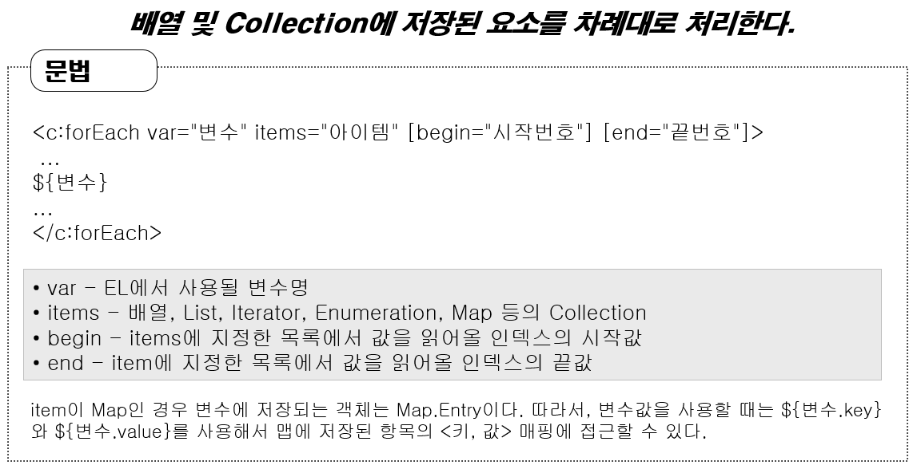

실습 `jstl04.jsp`

* forEach의 활용
```jsp
<%@page import="java.util.ArrayList"%>
<%@page import="java.util.List"%>
<%@ page language="java" contentType="text/html; charset=UTF-8"
	pageEncoding="UTF-8"%>

<%@ taglib prefix="c" uri="http://java.sun.com/jsp/jstl/core"%>

<%
	List<String> list = new ArrayList<>();
	list.add("hello");
	list.add("world");
	list.add("!!!!");
	
	request.setAttribute("list", list);
%>

<!DOCTYPE html>
<html>
<head>
<meta charset="UTF-8">
<title>Insert title here</title>
</head>
<body>

	<c:forEach items="${list }" var="item" begin="1">
	${item } <br>
	</c:forEach>

</body>
</html>
```
* begin에 1을 넣었더니 index가 1인 요소부터 시작
### import
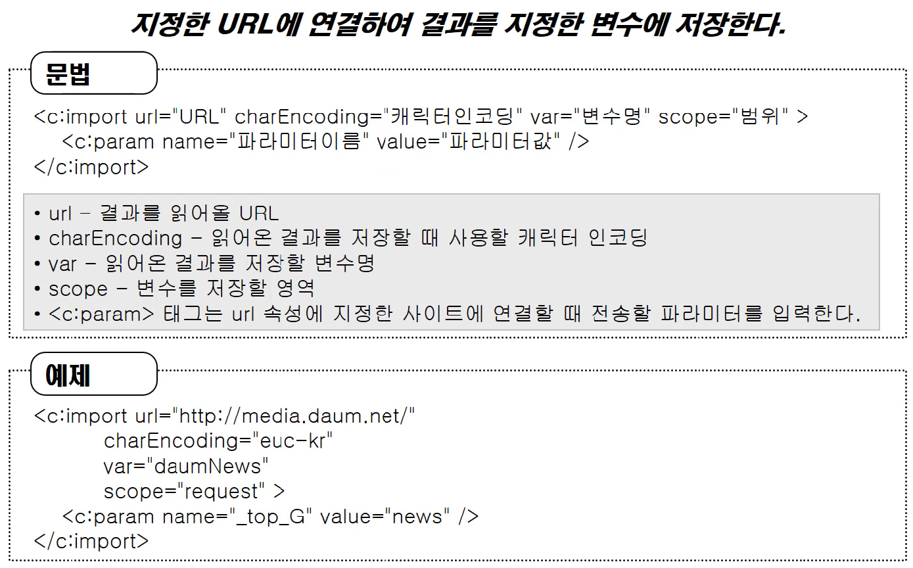
* 특정한 url페이지의 결과를 읽어들여서 그 결과를 변수에 저장한 다음 사용할 수 있게 해준다.
* charEncoding, param name과 같은 명령어는 필수는 아니다.

실습 `jstlValue.jsp`
* import할 URL을 위해 작성
```jsp
<%@ page language="java" contentType="text/html; charset=UTF-8"
    pageEncoding="UTF-8"%>
Kang kyungmi
```

실습 `jstl05.jsp`
* 특정 URL을 import해온다. 여기서는 jstlValue.jsp를 실행한 URL을 import
```jsp
<%@ page language="java" contentType="text/html; charset=UTF-8"
    pageEncoding="UTF-8"%>
    
<%@ taglib prefix="c" uri="http://java.sun.com/jsp/jstl/core"%>

<c:import url="http://localhost:8080/jsp/jstlValue.jsp" var="urlValue" scope="request"></c:import>
    
<!DOCTYPE html>
<html>
<head>
<meta charset="UTF-8">
<title>Insert title here</title>
</head>
<body>

${urlValue }

</body>
</html>
```
* URL에 google URL을 입력하면 구글 홈페이지의 소스를 가져와 보여준다.
### redirect
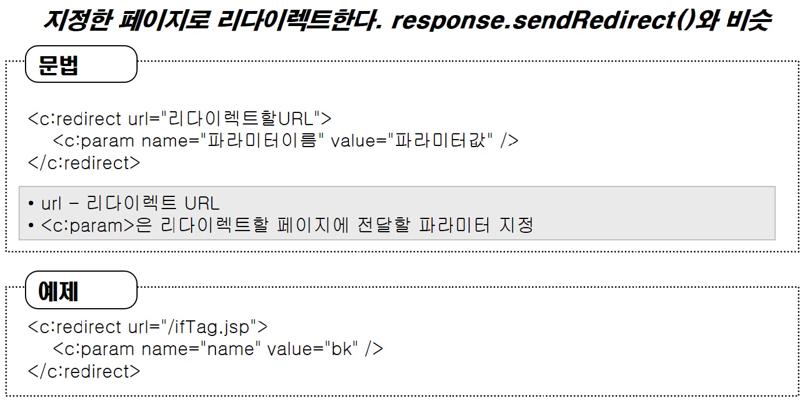

실습 `jtl06.jsp`
* redirect의 활용
```jsp
<%@ page language="java" contentType="text/html; charset=UTF-8"
    pageEncoding="UTF-8"%>
<%@ taglib prefix="c" uri="http://java.sun.com/jsp/jstl/core" %> 
<c:redirect url="jstlRedirectPage.jsp"></c:redirect>
```

실습 `jstlRedirectPage.jsp`
* redirect의 활용
```jsp
<%@ page language="java" contentType="text/html; charset=UTF-8"
    pageEncoding="UTF-8"%>
<!DOCTYPE html PUBLIC "-//W3C//DTD HTML 4.01 Transitional//EN" "http://www.w3.org/TR/html4/loose.dtd">
<html>
<head>
<meta http-equiv="Content-Type" content="text/html; charset=UTF-8">
<title>Insert title here</title>
</head>
<body>
<h1> redirect된 화면입니다.</h1>
</body>
</html>
```
### out
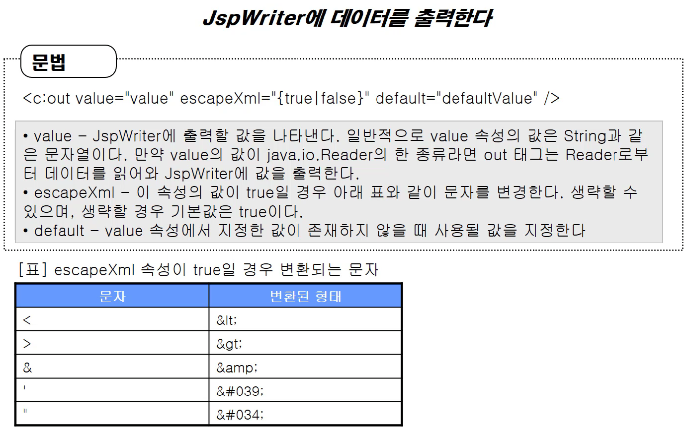
* 특정한 문자열을 출력할 수 있다.

실습 `jstl07.jsp`
* out의 활용
```jsp
<%@ page language="java" contentType="text/html; charset=UTF-8"
	pageEncoding="UTF-8"%>

<%@ taglib prefix="c" uri="http://java.sun.com/jsp/jstl/core"%>

<!DOCTYPE html>
<html>
<head>
<meta charset="UTF-8">
<title>Insert title here</title>
</head>
<body>

	<c:set var="t"
		value="<script type='text/javascript'>alert(1);</script>" />

	<c:out value="${t }" escapeXml="true"/>

</body>
</html>
```
* escapeXml을 false로 바꾸면 자바스크립트가 자바스크립트로 표현이 되지 않고 단순히 문자로 나타난다.
* tag를 나타내는 문자들이 변환되어 문자자체로 인식이 된다.
## 커스텀 태그
* 사용자가 얼마든지 원하는 태그를 만들어서 사용할 수 있다.
## 생각해보기
* JSTL의 태그는 XML태그 문법을 사용합니다. 
* 그래서 반드시 태그가 닫히거나 '/>'로 끝나야 합니다. 
* JSP가 제공하는 문법 중 사용자 정의 태그라는 것을 통해 만들어졌기 때문입니다. 
* 이번 시간엔 JSTL의 core태그에 대해서 살펴봤는데요. 
* 그 외의 태그들에는 어떤 게 있는지 찾아보고, 왜 그러한 태그가 필요한지 생각해보세요.
### 내생각
* 예외처리를 위한 catch, 구분자로 분할한 for문 태그인 forTokens, 등 많은 태그들이 더 있다.
* 태그 라이브러리로 구분했을 때 Core라이브러리 외에도 XML, i18n, Database, Functions이라는 라이브러리가 있고 각 라이브러리마다 다양한 태그들이 있다.
## 참고 자료
> [참고링크] jstl-quick-reference.pdf
http://homepage.divms.uiowa.edu/~slonnegr/wpj/jqr.pdf