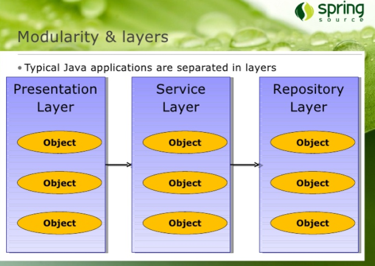

> 부스트 코스 - 웹 프로그래밍(풀스택) 강의를 학습, 정리한 내용입니다. (https://www.boostcourse.org/web316/joinLectures/12943)

# Tab UI 실습 - FrontEnd
# 목차

- [Tab UI 실습 - FrontEnd](#tab-ui-실습---frontend)
- [목차](#목차)
- [1) 레이어드 아키텍처(Layered Architecture) 란?](#1-레이어드-아키텍처layered-architecture-란)
  - [학습 목표](#학습-목표)
  - [핵심 개념](#핵심-개념)
  - [Controller에서 중복되는 부분을 처리하려면?](#controller에서-중복되는-부분을-처리하려면)
  - [컨트롤러와 서비스](#컨트롤러와-서비스)
  - [서비스(Service)객체란?](#서비스service객체란)
  - [트랜잭션(Transaction)이란?](#트랜잭션transaction이란)
  - [원자성 (Atomicity)](#원자성-atomicity)
  - [일관성 (Consistency)](#일관성-consistency)
  - [독립성 (Isolation)](#독립성-isolation)
  - [지속성 (Durability)](#지속성-durability)
  - [JDBC 프로그래밍에서 트랜잭션 처리 방법](#jdbc-프로그래밍에서-트랜잭션-처리-방법)
  - [@EnableTransactionManagement](#enabletransactionmanagement)
  - [서비스 객체에서 중복으로 호출되는 코드의 처리](#서비스-객체에서-중복으로-호출되는-코드의-처리)
  - [레이어드 아키텍처](#레이어드-아키텍처)
  - [설정의 분리](#설정의-분리)
  - [생각해보기](#생각해보기)
  - [참고 자료](#참고-자료)
- [2) 레이어드 아키텍처(Layered Architecture) 실습-1](#2-레이어드-아키텍처layered-architecture-실습-1)
  - [학습 목표](#학습-목표-1)
  - [핵심 개념](#핵심-개념-1)
  - [실습코드](#실습코드)
  - [참고 자료](#참고-자료-1)

<small><i><a href='http://ecotrust-canada.github.io/markdown-toc/'>Table of contents generated with markdown-toc</a></i></small>


# 1) 레이어드 아키텍처(Layered Architecture) 란?
웹 어플리케이션을 만들 때 자주 사용하는 레이어드 아키텍처(Layered Architecture) 에 대해 알아보자.

## 학습 목표
* 웹 어플리케이션 개발시 레이어드 아키텍처(Layered Architecture) 가 사용되는 이유에 대해 이해.
* 웹 어플리케이션 개발시 각 레이어의 구성요소에 대해서 이해.
 
## 핵심 개념
* Controller
* Service
* Repository
 
## Controller에서 중복되는 부분을 처리하려면?
* 별도의 객체로 분리합니다.
* 별도의 메소드로 분리합니다.
* 예를 들어 쇼핑몰에서 게시판에서도 회원 정보를 보여주고, 상품 목록 보기에서도 회원 정보를 보여줘야 한다면 회원 정보를 읽어오는 코드는 어떻게 해야 할까?
 
## 컨트롤러와 서비스
* 비지니스 메소드를 별도의 Service객체에서 구현하도록 하고 컨트롤러는 Service객체를 사용한다.

## 서비스(Service)객체란?
* 비지니스 로직(Business logic)을 수행하는 메소드를 가지고 있는 객체를 서비스 객체라고 한다.
* 보통 하나의 비지니스 로직은 하나의 트랜잭션으로 동작.

## 트랜잭션(Transaction)이란?
* 트랜잭션의 특징은 크게 4가지로 구분된다.
  - 원자성 (Atomicity)
  - 일관성 (Consistency)
  - 독립성 (Isolation)
  - 지속성 (Durability)
 
## 원자성 (Atomicity)
* 예를 들어 "출금"이라는 기능의 흐름이 다음과 같다고 생각해보자.
  1. 잔액이 얼마인지 조회한다.
  2. 출금하려는 금액이 잔액보다 작은지 검사한다.
  3. 출금하려는 금액이 잔액보다 작다면 (잔액 - 출금액)으로 수정한다.
  4. 언제, 어디서 출금했는지 정보를 기록한다.
  5. 사용자에게 출금한다.
* 위의 작업이 4번에서 오류가 발생했다면 어떻게 될까?
* 4번에서 오류가 발생했다면, 앞의 작업을 모두 원래대로 복원을 시켜야 한다.
* 이를 rollback이라고 한다.
* 5번까지 모두 성공했을 때만 정보를 모두 반영해야 한다.
* 이를 commit 한다고 한다.
* 이렇게 rollback 하거나 commit을 하게 되면 하나의 트랜잭션 처리가 완료된다.

## 일관성 (Consistency)
* 일관성은 트랜잭션의 작업 처리 결과가 항상 일관성이 있어야 한다는 것.
* 트랜잭션이 진행되는 동안에 데이터가 변경되더라도 업데이트된 데이터로 트랜잭션이 진행되는 것이 아니라, 처음에 트랜잭션을 진행하기 위해 참조한 데이터로 진행된다.
* 이렇게 함으로써 각 사용자는 일관성 있는 데이터를 볼 수 있는 것.
 
## 독립성 (Isolation)
* 독립성은 둘 이상의 트랜잭션이 동시에 병행 실행되고 있을 경우에 어느 하나의 트랜잭션이라도 다른 트랜잭션의 연산을 끼어들 수 없다.
* 하나의 특정 트랜잭션이 완료될 때까지, 다른 트랜잭션이 특정 트랜잭션의 결과를 참조할 수 없다.

## 지속성 (Durability)
* 지속성은 트랜잭션이 성공적으로 완료되었을 경우, 결과는 영구적으로 반영되어야 한다는 점.

## JDBC 프로그래밍에서 트랜잭션 처리 방법
* DB에 연결된 후 Connection객체의 setAutoCommit메소드에 false를 파라미터로 지정.
* 입력, 수정, 삭제 SQL이 실행을 한 후 모두 성공했을 경우 Connection이 가지고 있는 commit()메소드를 호출.

## @EnableTransactionManagement
* Spring Java Config파일에서 트랜잭션을 활성화 할 때 사용하는 애노테이션.
* Java Config를 사용하게 되면 PlatformTransactionManager 구현체를 모두 찾아서 그 중에 하나를 매핑해 사용.
* 특정 트랜잭션 메니저를 사용하고자 한다면 TransactionManagementConfigurer를 Java Config파일에서 구현하고 원하는 트랜잭션 메니저를 리턴하도록 한다.
* 아니면, 특정 트랜잭션 메니저 객체를 생성시 @Primary 애노테이션을 지정한다.

## 서비스 객체에서 중복으로 호출되는 코드의 처리
데이터 엑세스 메소드를 별도의 Repository(Dao) 객체에서 구현하도록 하고 Service는 Repository객체를 사용.

## 레이어드 아키텍처


## 설정의 분리
* Spring 설정 파일을 프리젠테이션 레이어쪽과 나머지를 분리할 수 있다.
* web.xml 파일에서 프리젠테이션 레이어에 대한 스프링 설정은 DispathcerServlet이 읽도록 하고, 그 외의 설정은 ContextLoaderListener를 통해서 읽는다.
* DispatcherServlet을 경우에 따라서 2개 이상 설정할 수 있는데 이 경우에는 각각의 DispathcerServlet의 ApplicationContext가 각각 독립적이기 때문에 각각의 설정 파일에서 생성한 빈을 서로 사용할 수 없다.
* 위의 경우와 같이 동시에 필요한 빈은 ContextLoaderListener를 사용함으로써 공통으로 사용하게 할 수 있다.
* ContextLoaderListener와 DispatcherServlet은 각각 ApplicationContext를 생성하는데, ContextLoaderListener가 생성하는 ApplicationContext가 root컨텍스트가 되고 DispatcherServlet이 생성한 인스턴스는 root컨텍스트를 부모로 하는 자식 컨텍스트가 된다.
* 참고로, 자식 컨텍스트들은 root컨텍스트의 설정 빈을 사용할 수 있다.

## 생각해보기
* 레이어로 구성하지 않을 경우 어떤 문제가 발생할까요
* 레이어를 구성하지 않고 중복코드를 제거할 수 있을까?
 
## 참고 자료
> [참고링크] Understanding Spring Web Application Architecture: The Classic Way
https://www.petrikainulainen.net/software-development/design/understanding-spring-web-application-architecture-the-classic-way/

> [참고링크] Architecture - Tutorial for Telosys Tools 2.1
https://sites.google.com/site/telosystutorial/springmvc-jpa-springdatajpa/presentation/architecture


# 2) 레이어드 아키텍처(Layered Architecture) 실습-1
방명록을 Spring 프레임워크를 이용해 만들어 보기.

이를 통해 각 레이어별로 어떤 내용들을 작성해야 하는지 알아보고, 완전히 동작하는 웹 어플리케이션을 개발해 봄으로써 Spring 웹 어플리케이션에 대한 이해를 높일 수 있다.

## 학습 목표
* Spring 프레임워크를 이용한 웹 어플리케이션 프로젝트를 구성할 수 있습니다.
* Spring 프레임워크를 이용한 웹 어플리케이션 개발 시 어떤 요소들을 개발해야하는지 이해합니다.
 
## 핵심 개념
* @Controller
* @Service
* @Repository
* @Transactional
 
## 실습코드

* WebMvcContextConfiguration.java
```java
package kr.or.connect.guestbook.config;

import org.springframework.context.annotation.Bean;
import org.springframework.context.annotation.ComponentScan;
import org.springframework.context.annotation.Configuration;
import org.springframework.web.servlet.config.annotation.DefaultServletHandlerConfigurer;
import org.springframework.web.servlet.config.annotation.EnableWebMvc;
import org.springframework.web.servlet.config.annotation.ResourceHandlerRegistry;
import org.springframework.web.servlet.config.annotation.ViewControllerRegistry;
import org.springframework.web.servlet.config.annotation.WebMvcConfigurerAdapter;
import org.springframework.web.servlet.view.InternalResourceViewResolver;

@Configuration
@EnableWebMvc
@ComponentScan(basePackages = { "kr.or.connect.guestbook.controller" })
public class WebMvcContextConfiguration extends WebMvcConfigurerAdapter{

    @Override
    public void addResourceHandlers(ResourceHandlerRegistry registry) {
        registry.addResourceHandler("/css/**").addResourceLocations("/css/").setCachePeriod(31556926);
        registry.addResourceHandler("/img/**").addResourceLocations("/img/").setCachePeriod(31556926);
        registry.addResourceHandler("/js/**").addResourceLocations("/js/").setCachePeriod(31556926);
    }
 
    // default servlet handler를 사용하게 합니다.
    @Override
    public void configureDefaultServletHandling(DefaultServletHandlerConfigurer configurer) {
        configurer.enable();
    }
   
    @Override
    public void addViewControllers(final ViewControllerRegistry registry) {
    		System.out.println("addViewControllers가 호출됩니다. ");
        registry.addViewController("/").setViewName("index");
    }
    
    @Bean
    public InternalResourceViewResolver getInternalResourceViewResolver() {
        InternalResourceViewResolver resolver = new InternalResourceViewResolver();
        resolver.setPrefix("/WEB-INF/views/");
        resolver.setSuffix(".jsp");
        return resolver;
    }
}
``` 

* DBConfig.java
```java
package kr.or.connect.guestbook.config;

import javax.sql.DataSource;

import org.apache.commons.dbcp2.BasicDataSource;
import org.springframework.context.annotation.Bean;
import org.springframework.context.annotation.Configuration;
import org.springframework.jdbc.datasource.DataSourceTransactionManager;
import org.springframework.transaction.PlatformTransactionManager;
import org.springframework.transaction.annotation.EnableTransactionManagement;
import org.springframework.transaction.annotation.TransactionManagementConfigurer;

@Configuration
@EnableTransactionManagement
public class DBConfig implements TransactionManagementConfigurer {
	private String driverClassName = "com.mysql.jdbc.Driver";

	private String url = "jdbc:mysql://localhost:3306/connectdb?useUnicode=true&characterEncoding=utf8";

	private String username = "connectuser";

	private String password = "connect123!@#";

	@Bean
	public DataSource dataSource() {
		BasicDataSource dataSource = new BasicDataSource();
		dataSource.setDriverClassName(driverClassName);
		dataSource.setUrl(url);
		dataSource.setUsername(username);
		dataSource.setPassword(password);
		return dataSource;
	}

	@Override
	public PlatformTransactionManager annotationDrivenTransactionManager() {
		return transactionManger();
	}

	@Bean
	public PlatformTransactionManager transactionManger() {
		return new DataSourceTransactionManager(dataSource());
	}
}
``` 

* ApplicationConfig.java
```java
package kr.or.connect.guestbook.config;

import org.springframework.context.annotation.ComponentScan;
import org.springframework.context.annotation.Configuration;
import org.springframework.context.annotation.Import;

@Configuration
@ComponentScan(basePackages = { "kr.or.connect.guestbook.dao",  "kr.or.connect.guestbook.service"})
@Import({ DBConfig.class })
public class ApplicationConfig {

}
``` 

* web.xml
```xml
<?xml version="1.0" encoding="UTF-8"?>
<web-app>

	<display-name>Spring JavaConfig Sample</display-name>
	<context-param>
		<param-name>contextClass</param-name>
		<param-value>org.springframework.web.context.support.AnnotationConfigWebApplicationContext
		</param-value>
	</context-param>
	<context-param>
		<param-name>contextConfigLocation</param-name>
		<param-value>kr.or.connect.guestbook.config.ApplicationConfig
		</param-value>
	</context-param>
	<listener>
		<listener-class>org.springframework.web.context.ContextLoaderListener
		</listener-class>
	</listener>

	<servlet>
		<servlet-name>mvc</servlet-name>
		<servlet-class>org.springframework.web.servlet.DispatcherServlet
		</servlet-class>
		<init-param>
			<param-name>contextClass</param-name>
			<param-value>org.springframework.web.context.support.AnnotationConfigWebApplicationContext
			</param-value>
		</init-param>
		<init-param>
			<param-name>contextConfigLocation</param-name>
			<param-value>kr.or.connect.guestbook.config.WebMvcContextConfiguration
			</param-value>
		</init-param>
		<load-on-startup>1</load-on-startup>
	</servlet>
	<servlet-mapping>
		<servlet-name>mvc</servlet-name>
		<url-pattern>/</url-pattern>
	</servlet-mapping>

	<filter>
		<filter-name>encodingFilter</filter-name>
		<filter-class>org.springframework.web.filter.CharacterEncodingFilter
		</filter-class>
		<init-param>
			<param-name>encoding</param-name>
			<param-value>UTF-8</param-value>
		</init-param>
	</filter>
	<filter-mapping>
		<filter-name>encodingFilter</filter-name>
		<url-pattern>/*</url-pattern>
	</filter-mapping>
</web-app>
``` 

* index.jsp
```java
<%@ page language="java" contentType="text/html; charset=UTF-8"
    pageEncoding="UTF-8"%>
<% 
	response.sendRedirect("list");
%>
```

* Guestbook.java
```java
package kr.or.connect.guestbook.dto;

import java.util.Date;

public class Guestbook {
	private Long id;
	private String name;
	private String content;
	private Date regdate;
	public Long getId() {
		return id;
	}
	public void setId(Long id) {
		this.id = id;
	}
	public String getName() {
		return name;
	}
	public void setName(String name) {
		this.name = name;
	}
	public String getContent() {
		return content;
	}
	public void setContent(String content) {
		this.content = content;
	}
	public Date getRegdate() {
		return regdate;
	}
	public void setRegdate(Date regdate) {
		this.regdate = regdate;
	}
	@Override
	public String toString() {
		return "Guestbook [id=" + id + ", name=" + name + ", content=" + content + ", regdate=" + regdate + "]";
	}
}
``` 

* Log.java
```java
package kr.or.connect.guestbook.dto;

import java.util.Date;

public class Log {
	private Long id;
	private String ip;
	private String method;
	private Date regdate;
	public Long getId() {
		return id;
	}
	public void setId(Long id) {
		this.id = id;
	}
	public String getIp() {
		return ip;
	}
	public void setIp(String ip) {
		this.ip = ip;
	}
	public String getMethod() {
		return method;
	}
	public void setMethod(String method) {
		this.method = method;
	}
	public Date getRegdate() {
		return regdate;
	}
	public void setRegdate(Date regdate) {
		this.regdate = regdate;
	}
	@Override
	public String toString() {
		return "Log [id=" + id + ", ip=" + ip + ", method=" + method + ", regdate=" + regdate + "]";
	}
}
``` 

* LogDao.java
```java
package kr.or.connect.guestbook.dao;

import javax.sql.DataSource;

import org.springframework.jdbc.core.namedparam.BeanPropertySqlParameterSource;
import org.springframework.jdbc.core.namedparam.NamedParameterJdbcTemplate;
import org.springframework.jdbc.core.namedparam.SqlParameterSource;
import org.springframework.jdbc.core.simple.SimpleJdbcInsert;
import org.springframework.stereotype.Repository;

import kr.or.connect.guestbook.dto.Log;

@Repository
public class LogDao {
	private NamedParameterJdbcTemplate jdbc;
    private SimpleJdbcInsert insertAction;

    public LogDao(DataSource dataSource) {
        this.jdbc = new NamedParameterJdbcTemplate(dataSource);
        this.insertAction = new SimpleJdbcInsert(dataSource)
                .withTableName("log")
                .usingGeneratedKeyColumns("id");
    }

	public Long insert(Log log) {
		SqlParameterSource params = new BeanPropertySqlParameterSource(log);
		return insertAction.executeAndReturnKey(params).longValue();
	}
}
``` 

* GuestbookDaoSqls.java
```java
package kr.or.connect.guestbook.dao;

public class GuestbookDaoSqls {
	public static final String SELECT_PAGING = "SELECT id, name, content, regdate FROM guestbook ORDER BY id DESC limit :start, :limit";
	public static final String DELETE_BY_ID = "DELETE FROM guestbook WHERE id = :id";
	public static final String SELECT_COUNT = "SELECT count(*) FROM guestbook";
}
 ```

* GuestbookDao.java
```java
package kr.or.connect.guestbook.dao;

import java.util.Collections;
import java.util.HashMap;
import java.util.List;
import java.util.Map;

import javax.sql.DataSource;

import org.springframework.jdbc.core.BeanPropertyRowMapper;
import org.springframework.jdbc.core.RowMapper;
import org.springframework.jdbc.core.namedparam.BeanPropertySqlParameterSource;
import org.springframework.jdbc.core.namedparam.NamedParameterJdbcTemplate;
import org.springframework.jdbc.core.namedparam.SqlParameterSource;
import org.springframework.jdbc.core.simple.SimpleJdbcInsert;
import org.springframework.stereotype.Repository;

import kr.or.connect.guestbook.dto.Guestbook;

import static kr.or.connect.guestbook.dao.GuestbookDaoSqls.*;

@Repository
public class GuestbookDao {
	 private NamedParameterJdbcTemplate jdbc;
	    private SimpleJdbcInsert insertAction;
	    private RowMapper<Guestbook> rowMapper = BeanPropertyRowMapper.newInstance(Guestbook.class);

	    public GuestbookDao(DataSource dataSource) {
	        this.jdbc = new NamedParameterJdbcTemplate(dataSource);
	        this.insertAction = new SimpleJdbcInsert(dataSource)
	                .withTableName("guestbook")
	                .usingGeneratedKeyColumns("id");
	    }
	    
	    public List<Guestbook> selectAll(Integer start, Integer limit) {
	    		Map<String, Integer> params = new HashMap<>();
	    		params.put("start", start);
	    		params.put("limit", limit);
	        return jdbc.query(SELECT_PAGING, params, rowMapper);
	    }


		public Long insert(Guestbook guestbook) {
			SqlParameterSource params = new BeanPropertySqlParameterSource(guestbook);
			return insertAction.executeAndReturnKey(params).longValue();
		}
		
		public int deleteById(Long id) {
			Map<String, ?> params = Collections.singletonMap("id", id);
			return jdbc.update(DELETE_BY_ID, params);
		}
		
		public int selectCount() {
			return jdbc.queryForObject(SELECT_COUNT, Collections.emptyMap(), Integer.class);
		}
}
``` 

* GuestbookDaoTest.java
```java
package kr.or.connect.guestbook.dao;

import java.util.Date;

import org.springframework.context.ApplicationContext;
import org.springframework.context.annotation.AnnotationConfigApplicationContext;

import kr.or.connect.guestbook.config.ApplicationConfig;
import kr.or.connect.guestbook.dto.Log;

public class GuestbookDaoTest {

	public static void main(String[] args) {
		ApplicationContext ac = new AnnotationConfigApplicationContext(ApplicationConfig.class); 
//		GuestbookDao guestbookDao = ac.getBean(GuestbookDao.class);
//		
//		Guestbook guestbook = new Guestbook();
//		guestbook.setName("강경미");
//		guestbook.setContent("반갑습니다. 여러분.");
//		guestbook.setRegdate(new Date());
//		Long id = guestbookDao.insert(guestbook);
//		System.out.println("id : " + id);
		
		LogDao logDao = ac.getBean(LogDao.class);
		Log log = new Log();
		log.setIp("127.0.0.1");
		log.setMethod("insert");
		log.setRegdate(new Date());
		logDao.insert(log);
	}

}
```

* GuestbookService.java
```java
package kr.or.connect.guestbook.service;

import java.util.List;

import kr.or.connect.guestbook.dto.Guestbook;

public interface GuestbookService {
	public static final Integer LIMIT = 5;
	public List<Guestbook> getGuestbooks(Integer start);
	public int deleteGuestbook(Long id, String ip);
	public Guestbook addGuestbook(Guestbook guestbook, String ip);
	public int getCount();
}
``` 

* GuestbookServiceImpl.java
```java
package kr.or.connect.guestbook.service.impl;

import java.util.Date;
import java.util.List;

import org.springframework.beans.factory.annotation.Autowired;
import org.springframework.stereotype.Service;
import org.springframework.transaction.annotation.Transactional;

import kr.or.connect.guestbook.dao.GuestbookDao;
import kr.or.connect.guestbook.dao.LogDao;
import kr.or.connect.guestbook.dto.Guestbook;
import kr.or.connect.guestbook.dto.Log;
import kr.or.connect.guestbook.service.GuestbookService;

@Service
public class GuestbookServiceImpl implements GuestbookService{
	@Autowired
	GuestbookDao guestbookDao;
	
	@Autowired
	LogDao logDao;

	@Override
	@Transactional
	public List<Guestbook> getGuestbooks(Integer start) {
		List<Guestbook> list = guestbookDao.selectAll(start, GuestbookService.LIMIT);
		return list;
	}

	@Override
	@Transactional(readOnly=false)
	public int deleteGuestbook(Long id, String ip) {
		int deleteCount = guestbookDao.deleteById(id);
		Log log = new Log();
		log.setIp(ip);
		log.setMethod("delete");
		log.setRegdate(new Date());
		logDao.insert(log);
		return deleteCount;
	}

	@Override
	@Transactional(readOnly=false)
	public Guestbook addGuestbook(Guestbook guestbook, String ip) {
		guestbook.setRegdate(new Date());
		Long id = guestbookDao.insert(guestbook);
		guestbook.setId(id);
		
//		if(1 == 1)
//			throw new RuntimeException("test exception");
//			
		Log log = new Log();
		log.setIp(ip);
		log.setMethod("insert");
		log.setRegdate(new Date());
		logDao.insert(log);
		
		
		return guestbook;
	}

	@Override
	public int getCount() {
		return guestbookDao.selectCount();
	}
	
	
}
``` 

* GuestbookServiceTest.java
```java
package kr.or.connect.guestbook.service.impl;

import java.util.Date;

import org.springframework.context.ApplicationContext;
import org.springframework.context.annotation.AnnotationConfigApplicationContext;

import kr.or.connect.guestbook.config.ApplicationConfig;
import kr.or.connect.guestbook.dto.Guestbook;
import kr.or.connect.guestbook.service.GuestbookService;

public class GuestbookServiceTest {

	public static void main(String[] args) {
		ApplicationContext ac = new AnnotationConfigApplicationContext(ApplicationConfig.class); 
		GuestbookService guestbookService = ac.getBean(GuestbookService.class);
		
		Guestbook guestbook = new Guestbook();
		guestbook.setName("kang kyungmi22");
		guestbook.setContent("반갑습니다. 여러분. 여러분이 재미있게 공부하고 계셨음 정말 좋겠네요^^22");
		guestbook.setRegdate(new Date());
		Guestbook result = guestbookService.addGuestbook(guestbook, "127.0.0.1");
		System.out.println(result);
		
	}

}
```

* GuestbookController.java
```java
package kr.or.connect.guestbook.controller;

import java.util.ArrayList;
import java.util.List;

import javax.servlet.http.HttpServletRequest;

import org.springframework.beans.factory.annotation.Autowired;
import org.springframework.stereotype.Controller;
import org.springframework.ui.ModelMap;
import org.springframework.web.bind.annotation.GetMapping;
import org.springframework.web.bind.annotation.ModelAttribute;
import org.springframework.web.bind.annotation.PostMapping;
import org.springframework.web.bind.annotation.RequestParam;

import kr.or.connect.guestbook.dto.Guestbook;
import kr.or.connect.guestbook.service.GuestbookService;

@Controller
public class GuestbookController {
	@Autowired
	GuestbookService guestbookService;
	
	@GetMapping(path="/list")
	public String list(@RequestParam(name="start", required=false, defaultValue="0") int start,
					   ModelMap model) {
		
		// start로 시작하는 방명록 목록 구하기
		List<Guestbook> list = guestbookService.getGuestbooks(start);
		
		// 전체 페이지수 구하기
		int count = guestbookService.getCount();
		int pageCount = count / GuestbookService.LIMIT;
		if(count % GuestbookService.LIMIT > 0)
			pageCount++;
		
		// 페이지 수만큼 start의 값을 리스트로 저장
		// 예를 들면 페이지수가 3이면
		// 0, 5, 10 이렇게 저장된다.
		// list?start=0 , list?start=5, list?start=10 으로 링크가 걸린다.
		List<Integer> pageStartList = new ArrayList<>();
		for(int i = 0; i < pageCount; i++) {
			pageStartList.add(i * GuestbookService.LIMIT);
		}
		
		model.addAttribute("list", list);
		model.addAttribute("count", count);
		model.addAttribute("pageStartList", pageStartList);
		
		return "list";
	}
	
	@PostMapping(path="/write")
	public String write(@ModelAttribute Guestbook guestbook,
						HttpServletRequest request) {
		String clientIp = request.getRemoteAddr();
		System.out.println("clientIp : " + clientIp);
		guestbookService.addGuestbook(guestbook, clientIp);
		return "redirect:list";
	}
}
``` 

* list.jsp
```jsp
<%@ page language="java" contentType="text/html; charset=UTF-8"
	pageEncoding="UTF-8"%>
<%@ taglib prefix="c" uri="http://java.sun.com/jsp/jstl/core"%>
<!DOCTYPE html PUBLIC "-//W3C//DTD HTML 4.01 Transitional//EN" "http://www.w3.org/TR/html4/loose.dtd">
<html>
<head>
<meta http-equiv="Content-Type" content="text/html; charset=UTF-8">
<title>방명록 목록</title>
</head>
<body>

	<h1>방명록</h1>
	<br> 방명록 전체 수 : ${count }
	<br>
	<br>

	<c:forEach items="${list}" var="guestbook">

${guestbook.id }<br>
${guestbook.name }<br>
${guestbook.content }<br>
${guestbook.regdate }<br>

	</c:forEach>
	<br>

	<c:forEach items="${pageStartList}" var="pageIndex" varStatus="status">
		<a href="list?start=${pageIndex}">${status.index +1 }</a>&nbsp; &nbsp;
</c:forEach>

	<br>
	<br>
	<form method="post" action="write">
		name : <input type="text" name="name"><br>
		<textarea name="content" cols="60" rows="6"></textarea>
		<br> <input type="submit" value="등록">
	</form>
</body>
</html>
```

## 참고 자료
> [참고링크] Web on Servlet Stack
https://docs.spring.io/spring-framework/docs/current/reference/html/web.html

> [참고링크] Serving Web Content with Spring MVC
https://spring.io/guides/gs/serving-web-content/

> [참고링크] Spring MVC Tutorial
https://www.javatpoint.com/spring-mvc-tutorial