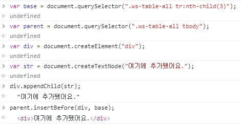
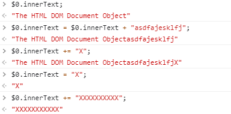
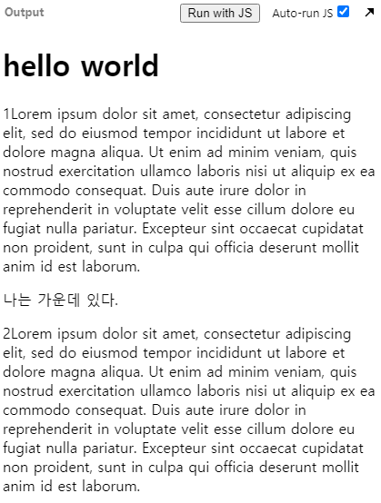

> 부스트코스 - 웹 프로그래밍(풀스택)강의를 학습, 정리한 내용입니다.(https://www.boostcourse.org/web316/joinLectures/12943)

# DOM API활용 - FrontEnd
# 목차

- [DOM API활용 - FrontEnd](#dom-api활용---frontend)
- [목차](#목차)
- [1) DOM Node조작하기](#1-dom-node조작하기)
  - [핵심개념](#핵심개념)
  - [1. DOM 조작하기 API](#1-dom-조작하기-api)
  - [2. DOM 엘리먼트 오브젝트 (요소 객체)](#2-dom-엘리먼트-오브젝트-요소-객체)
    - [몇 가지 유용한 DOM 엘리먼트 속성](#몇-가지-유용한-dom-엘리먼트-속성)
    - [DOM 탐색 속성](#dom-탐색-속성)
    - [DOM 조작 메소드](#dom-조작-메소드)
    - [HTML을 문자열로 처리해주는 DOM 속성 / 메소드](#html을-문자열로-처리해주는-dom-속성--메소드)
  - [생각해보기](#생각해보기)
  - [참고 자료](#참고-자료)
- [DOM API 실습](#dom-api-실습)
  - [핵심 개념](#핵심-개념)
  - [실습1](#실습1)
    - [실습 코드](#실습-코드)
  - [실습2](#실습2)
    - [실습 코드](#실습-코드-1)
  - [실습3](#실습3)
    - [실습 코드](#실습-코드-2)
  - [실습4](#실습4)
    - [실습 코드](#실습-코드-3)
  - [실습5](#실습5)
    - [실습 코드](#실습-코드-4)
  - [실습6](#실습6)
    - [실습 코드 6-1](#실습-코드-6-1)
    - [실습 코드 6-2](#실습-코드-6-2)
  - [좀 더  알아보기](#좀-더--알아보기)

<small><i><a href='http://ecotrust-canada.github.io/markdown-toc/'>Table of contents generated with markdown-toc</a></i></small>


# 1) DOM Node조작하기
DOM, 즉 HTML은 동적으로 다양하게 변경될 수 있다. 

DOM APIs에서는 다양한 메서드와 속성을 지원하고 있으니 이를 활용하는 방법을 배울 필요가 있다.

이제 부터 배울 다양한 DOM API는 라이브러리를 쓰는 것보다 대체로 더 빠르다.

물론 라이브러리보다 그 사용법이 불편하고 어려울 수는 있다. 하지만 low-level의 DOM API를 이해한다면, 라이브러리나 프레임워크를 사용하면서도 그 동작을 이해하고 유추하기가 쉽고 어떤 문제를 해결할때도 더 유리할 것.

## 핵심개념
* DOM APIs
* 다양한 DOM 속성과 메서드들
* createElement, CreateTextNode, appendChild
* insertBefore, innerText, innerHTML, insertAdjacentHTML 

## 1. DOM 조작하기 API
* documet. 으로 사용할 수 있는 APIs : [링크 바로가기](https://www.w3schools.com/jsref/dom_obj_document.asp)
  * The HTML DOM Document Object (html DOM 문서 객체)
    * The Document Object (문서 객체)
      * HTML문서가 웹 브라우저에 로드되면 문서 객체가 된다.
      * 문서 객체는 html 문서의 루트 노드.
    * 문서 객체에는 다양한 속성들과 메소드()들이 있다.
      * ex) 
        * getElementBy~() , create~(), querySelector~(), characterSet, documentURI 

* element. 으로 사용할 수 있는 APIs : [링크 바로가기](https://www.w3schools.com/jsref/dom_obj_all.asp)
  * The HTML DOM Element Object (HTML DOM 요소 객체)
    * The Element Object (요소 객체)
      * HTML DOM 안에는 P, DIV, A, TABLE 등과 같은 HTML 요소를 나타내는 요소 객체가 있다. 
    * 요소 객체에는 다양한 속성들과 메소드()들이 있다. 
      * ex)
        * childNodes, addEventListener(), classList, className, firstElementChild, innerHTML, insertBefore()

## 2. DOM 엘리먼트 오브젝트 (요소 객체)
### 몇 가지 유용한 DOM 엘리먼트 속성
* tagName : 엘리먼트의 태그명 반환
* textContent : 노드의 텍스트 내용을 설정하거나 반환
* nodeType : 노드의 노드 유형을 숫자로 반환
### DOM 탐색 속성
* childNodes
  * 엘리먼트의 자식 노드의 ***노드 리스트 반환***(텍스트 노드, 주석 노드 포함)
  * [childNodes 예제](https://jsbin.com/qabuciz/edit?html,js,console,output)
* firstChild
  * 엘리먼트의 ***첫 번째 자식 노드를 반환***
  * 공백이나 텍스트 노드(개행)가 있으면 그것까지 첫번째 자식으로 인정해준다.
  * [firstChild 예제](https://jsbin.com/fuconuk/1/edit?html,js,console,output)
* firstElementChild
  * ***첫 번째 자식 엘리먼트를 반환***
  * firstChild와 비슷하지만, 공백과 같은 것을 인정하지 않는다. 따라서 더 유용해 더 자주 사용한다.
  * [firstElementChild 예제](https://jsbin.com/retoses/2/edit?html,js,console,output)
* parentElement
  * 엘리먼트의 부모 엘리먼트 반환 
  * [parentElement 예제](https://jsbin.com/jonumig/2/edit?html,js,console,output)
* nextSibling
  * 동일한 노드 트리 레벨에서 다음 노드를 반환 
  * [nextSibling 예제](https://jsbin.com/jonumig/6/edit?html,js,console,output)
* nextElementSibling
  * 동일한 노드 트리 레벨에서 다음 엘리먼트 반환
  * [nextElementSibling 예제](https://jsbin.com/podawep/2/edit?html,js,console,output)
### DOM 조작 메소드
삭제, 추가, 이동, 교체를 위한 API
* removeChild()
  * 엘리먼트의 자식 노드 제거 
  * [removeChild 예제](https://jsbin.com/lexobe/13/edit?html,js,console,output)
* appendChild()
  * 마지막 자식 노드로 자식 노드를 엘리먼트에 추가
  * [appendChild 예제](https://jsbin.com/wunocen/5/edit?html,js,console,output)
  * 실습 (크롬 개발자 도구)
  * .png)
* insertBefore()
  * 기존 자식노드 앞에 새 자식 노드를 추가
  * [insertBefore 예제](https://jsbin.com/xogutix/5/edit?html,js,output)
  * 실습 (크롬 개발자 도구)
  * 
* cloneNode()
  * 노드를 복제
  * [cloneNode 예제](https://jsbin.com/puyeled/3/edit?html,js,output)
* replaceChild()
  * 엘리먼트의 자식 노드 바꿈
  * [replaceChild 예제](https://jsbin.com/rumadi/8/edit?html,js,output)
* closest()
  * 상위로 올라가면서 가장 가까운 엘리먼트를 반환
  * `<div><ul><li><li><li>...`의 구조일 경우 첫번째 li의 closest()는 div가 된다.
  * [closest 예제](https://jsbin.com/rumadi/13/edit?html,js,console,output)
### HTML을 문자열로 처리해주는 DOM 속성 / 메소드
* innerText
  * 지정된 노드와 모든 자손의 텍스트 내용을 설정하거나 반환
  * [innerText 예제](https://jsbin.com/sukihiw/6/edit?html,js,output)
  * 실습 (크롬 개발자 도구)
  * 
* innerHTML
  * 지정된 엘리먼트의 내부 html을 설정하거나 반환
  * [innerHTML 예제](https://jsbin.com/sutejo/3/edit?html,js,output)
  * syntax 
    ```js
    const content = element.innerHTML;
    element.innerHTML = htmlString;
    ```
* insertAdjacentHTML()
  * HTML로 텍스트를 지정된 위치에 삽입
  * [insertAdjacentHTML() 예제](https://jsbin.com/puwoqov/4/edit?html,js,output)

## 생각해보기
* DOM의 특정 영역을 insertAdjacentHTML메서드를 사용해서 추가 해보기.
* 실습 코드
```HTML
<!DOCTYPE html>
<html>
<head>
  <meta charset="utf-8">
  <meta name="viewport" content="width=device-width">
  <title>JS Bin</title>
</head>
<body>

  <div><p>1Lorem ipsum dolor sit amet, consectetur adipiscing elit, sed do eiusmod tempor incididunt ut labore et dolore magna aliqua. Ut enim ad minim veniam, quis nostrud exercitation ullamco laboris nisi ut aliquip ex ea commodo consequat. Duis aute irure dolor in reprehenderit in voluptate velit esse cillum dolore eu fugiat nulla pariatur. Excepteur sint occaecat cupidatat non proident, sunt in culpa qui officia deserunt mollit anim id est laborum.</p>
    <p>2Lorem ipsum dolor sit amet, consectetur adipiscing elit, sed do eiusmod tempor incididunt ut labore et dolore magna aliqua. Ut enim ad minim veniam, quis nostrud exercitation ullamco laboris nisi ut aliquip ex ea commodo consequat. Duis aute irure dolor in reprehenderit in voluptate velit esse cillum dolore eu fugiat nulla pariatur. Excepteur sint occaecat cupidatat non proident, sunt in culpa qui officia deserunt mollit anim id est laborum.</p>
  </div>
  
</body>
</html>
```
```JS
var base = document.querySelector("div");
base.insertAdjacentHTML("afterbegin", "<h1>hello world</h1>");

var base2 = document.querySelector("p:nth-child(3)");
base2.insertAdjacentHTML("beforebegin", "<p>나는 가운데 있다.</p>");
```

## 참고 자료
> [참고링크] 위키피디아 DOM설명
http://en.wikipedia.org

> [참고링크] document. 으로 사용할 수 있는 APIs
https://www.w3schools.com

> [참고링크] element. 으로 사용할 수 있는 APIs
https://www.w3schools.com


# DOM API 실습
React, Angular과 같은 프레임워크는 DOM조작을 편리하게 해주고 있다.

하지만 가장 빠른 DOM조작방법은 DOM APIs를 직접 사용하는 것

더구나 프레임워크 없이 개발하는 간단한 상황에서는 DOM조작을 직접 할 수 있어야

이번에는 실제 어떻게 웹 화면을 제어할 수 있는지 알아보자.

## 핵심 개념
* DOM APIs

## 실습1

지금 나온 DOM API를 사용해서, strawberry 아래에 새로운 과일(peach or blueberry)을 하나 더 추가하시오.

추가 된 이후에는 다시 삭제하시오.

> [링크 바로가기](https://jsbin.com/mebuha/1/edit?html,js,output)

### 실습 코드
* 방법 1) peach 추가
```html
<!DOCTYPE html>
<html>
<head>
  <meta charset="utf-8">
  <meta name="viewport" content="width=device-width">
  <title>JS Bin</title>
  <style>
    li{list-style:none;
      font-size:1.4em;
      margin-bottom:10px;}
  </style>
</head>
<body>
  <h1>selector test</h1>  
  <ul>
    <li>apple</li>
    <li>orange</li>
    <li>banana</li>
    <li>grape</li>
    <li>strawberry</li>
  </ul>
<!-- <button id="removeChildButton">delete</button>
 -->
</body>
</html>
```
```js
var newLiNode = document.createElement("LI");
var newLiStr = document.createTextNode("peach");
newLiNode.append(newLiStr);
var getUl = document.getElementsByTagName("UL")[0];
getUl.append(newLiNode);
getUl.removeChild(getUl.lastElementChild);

// 삭제 버튼 기능
// var removeChildButton = document.getElementById("removeChildButton");
// removeChildButton.addEventListener("click", function(){
//   var ul = document.querySelector("ul");
//   ul.removeChild(ul.lastElementChild);
// });
```
> [DOM API 실습 1.1 - js bin](https://jsbin.com/bumexip/edit?html,js,console,output) 

* 방법 2) blueberry추가 insertAdjacentHTML사용
```html
<!DOCTYPE html>
<html>
<head>
  <meta charset="utf-8">
  <meta name="viewport" content="width=device-width">
  <title>JS Bin</title>
  <style>
    li{list-style:none;
      font-size:1.4em;
      margin-bottom:10px;}
  </style>
</head>
<body>
  <h1>selector test</h1>  
  <ul>
    <li>apple</li>
    <li>orange</li>
    <li>banana</li>
    <li>grape</li>
    <li>strawberry</li>
  </ul>
</body>
</html>
```
```js
var selectUl = document.querySelector("ul");
var lastLi = selectUl.lastElementChild;
lastLi.insertAdjacentHTML("afterend","<li>blueberry</li>");
selectUl.removeChild(selectUl.lastElementChild);
```
> [DOM API 실습 1.2 - js bin](https://jsbin.com/yusubuc/edit?html,js,console,output)

## 실습2
insertBefore메서드를 사용해서, orange와  banana 사이에 새로운 과일(lemon)을 추가하시오.

> [링크 바로가기](https://jsbin.com/mebuha/1/edit?html,js,output)

### 실습 코드
```html
<!DOCTYPE html>
<html>
<head>
  <meta charset="utf-8">
  <meta name="viewport" content="width=device-width">
  <title>JS Bin</title>
  <style>
    li{list-style:none;
      font-size:1.4em;
      margin-bottom:10px;}
  </style>
</head>
<body>
  <h1>selector test</h1>  
  <ul>
    <li>apple</li>
    <li>orange</li>
    <li>banana</li>
    <li>grape</li>
    <li>strawberry</li>
  </ul>
</body>
</html>
```
```js
var newLi = document.createElement("LI");
var newFruit = document.createTextNode("lemon");
newLi.appendChild(newFruit);
var ul = document.querySelector("ul");
ul.insertBefore(newLi, ul.childNodes[4]);
```
> [DOM API 실습 2 - js bin](https://jsbin.com/waqemaz/1/edit?html,css,js,output)

* 좀 더 직관적인 코드
```js
var lemon = document.createElement("li");
var lemonText = document.createTextNode("lemon");
lemon.appendChild(lemonText);
var parent = document.querySelector("ul");
var banana = document.querySelector("li:nth-child(3)");
parent.insertBefore(lemon, banana);
```

## 실습3
실습2를 insertAdjacentHTML메서드를  사용해서, orange와 banana 사이에 새로운 과일(blue lemon)을 추가하시오.

### 실습 코드

```html
<!DOCTYPE html>
<html>
<head>
<meta name="description" content="DOM API P_3">
  <meta charset="utf-8">
  <meta name="viewport" content="width=device-width">
  <title>JS Bin</title>
  <style>
    li{list-style:none;
      font-size:1.4em;
      margin-bottom:10px;}
  </style>
</head>
<body>
  <h1>selector test</h1>  
  <ul>
    <li>apple</li>
    <li>orange</li>
    <li>banana</li>
    <li>grape</li>
    <li>strawberry</li>
  </ul>
</body>
</html>
```
```js
var orange = document.querySelector("li:nth-child(2)");
orange.insertAdjacentHTML("afterend", "<li>blue lemon</li>");
```
> [DOM API 실습 3 - js bin](https://jsbin.com/tigumuw/6/edit?html,js,console,output)

## 실습4
apple을 grape 와 strawberry 사이로 옮기시오.

> [링크 바로가기](https://jsbin.com/mebuha/1/edit?html,js,output)

### 실습 코드
```html
<!DOCTYPE html>
<html>
<head>
<meta name="description" content="DOM API P_3">
  <meta charset="utf-8">
  <meta name="viewport" content="width=device-width">
  <title>JS Bin</title>
  <style>
    li{list-style:none;
      font-size:1.4em;
      margin-bottom:10px;}
  </style>
</head>
<body>
  <h1>selector test</h1>  
  <ul>
    <li>apple</li>
    <li>orange</li>
    <li>banana</li>
    <li>grape</li>
    <li>strawberry</li>
  </ul>
</body>
</html>
```
```js
var list = document.getElementsByTagName("ul")[0];
var first = list.getElementsByTagName("li")[0];
var fifth = list.getElementsByTagName("li")[4];
list.removeChild(first);
fifth.insertAdjacentElement("beforebegin", first);
```

> [DOM API 실습 4 - js bin](https://jsbin.com/bayowor/edit?html,js,output)

* 좀 더 직관적인 코드
insertBefore(a, b) 메소드는 a를 b앞에 삽입한다. (복사, 삭제 한번에)  
즉 노드를 옳길 때 유용하다.
```js
var parent = document.querySelector("ul");
var strawberry = document.querySelector("li:nth-child(5)");
var apple = document.querySelector("li:nth-child(1)");
parent.insertBefore(apple, strawberry);
```

## 실습5

class 가 'red'인 노드만 삭제하시오.

> [링크 바로가기](https://jsbin.com/redetul/1/edit?html,css,js,output)

### 실습 코드
```html
<!DOCTYPE html>
<html>
<head>
  <meta charset="utf-8">
  <meta name="viewport" content="width=device-width">
  <title>JS Bin</title>
  <style>
    li{list-style:none;
      font-size:1.4em;
      margin-bottom:10px;}
  </style>
</head>
<body>
  <h1>selector test</h1> 
  <ul>
    <li class="red">apple</li>
    <li class="red">orange</li>
    <li>banana</li>
    <li>grape</li>
    <li>strawberry</li>
  </ul>
</body>
</html>
```
```js
var reds = document.getElementsByClassName("red");
while (reds[0]) {
    reds[0].parentNode.removeChild(reds[0]);
}
```
* 다른 답
  * querySelectorAll("li.red");를 사용할 수 있다.
```js
var reds = document.querySelectorAll("li.red");
var parent = document.querySelector("ul");
for(var i=0; i<reds.length; i++) {
  parent.removeChild(reds[i]);
}
```
* forEach도 사용할 수 있다.

> [DOM API 실습 5 - js bin](https://jsbin.com/xujudiw/edit?html,js,console,output)

## 실습6
section 태그의 자손 중에 blue라는 클래스를 가지고 있는 노드가 있다면, 그 하위에 있는 h2 노드를 삭제하시오.

> [링크 바로가기](https://jsbin.com/ricopa/1/edit?html,css,js,output)

### 실습 코드 6-1
```html
<!DOCTYPE html>
<html>
<head>
  <meta charset="utf-8">
  <meta name="viewport" content="width=device-width">
  <title>JS Bin</title>
  <style>
    li{list-style:none;
      font-size:1.4em;
      margin-bottom:10px;}
  </style>
</head>
<body>
  <h1>selector test</h1>    
<section>
  <h2> red section </h2>
  <ul>
    <li class="red">apple</li>
    <li class="red">orange</li>
    <li>banana</li>
    <li>grape</li>
    <li>strawberry</li>
  </ul>
</section>  
  <Br>  
<section>
  <h2> blue section </h2>
  <ul>
    <li class="green blue">apple</li>
    <li class="red">orange</li>
    <li>banana</li>
    <li>grape</li>
    <li>strawberry</li>
  </ul>
</section>
</body>
</html>
```
for문사용
```js
var bluenode = document.querySelectorAll("section .blue");

for(var i=0; i<bluenode.length; i++) {
  var section = bluenode[i].closest("section");
  var h2 = section.querySelector("h2");
  section.removeChild(h2);
}
```
* 문제 해설 
  * section중 blue라는 class를 가지고 있는 하위노드가 있으면 section의 h2노드를 삭제한다.
* 코드 해석(순서별)
  1. section .blue를 통해 모든 section의 blue class 노드를 찾는다.( 공백이 중요하다 )
  2. for문을 사용한다.( querySelectorAll을 사용하였으므로 결과는 노드리스트가 되기 때문에 (리스트 타입이긴 하지만 배열은 아니다.)조회하기 위해 반복문 사용 )
  3. closest를 사용해 bluenode와 가장 가까운 section을 찾는다.
  4. 찾은 section의 h2 요소를 삭제한다.

> [DOM API 실습 6-1 - js bin](https://jsbin.com/sasomec/4/edit?html,js,console,output)

### 실습 코드 6-2
Array.from() 과 forEach()를 사용
```js
var bluenode = document.querySelectorAll("section .blue");

Array.from(bluenode).forEach((function(v) {
  var section = v.closest("section");
  var h2 = section.querySelector("h2");
  section.removeChild(h2);
}));
```

> [DOM API 실습 6-2 - js bin](https://jsbin.com/pozoqih/2/edit?html,js,console,output)


## 좀 더  알아보기
* polyfill은 무엇인지
  * 어떠한 기능을 쓰고 싶은데, 지원하지 않는 브라우저에서도 동작시키게 하고 싶을때가 있죠. 그때 아주 유용.
  * 기본적으로 지원하지 않는 이전 브라우저에서 최신 기능을 제공하는 데 필요한 코드
  * (일반적으로 웹의 JavaScript)
  * 폴리필 코드를 자바스크립트 상단에 위치시키고 그 아래에서 Array.from()과 같은 메서드를 사용하면 된다.
  >참고자료 : [폴리필이란?](https://remysharp.com/2010/10/08/what-is-a-polyfill)
* Array.from()
  * js 표준 내장 객체 (새롭게 만들어짐)
  * Array.from() 메서드는 유사 배열 객체(array-like object)나 반복 가능한 객체(iterable object)를 얕게 복사해 새로운 Array 객체를 만듭니다.
  ```js
  console.log(Array.from('foo'));
  // expected output: Array ["f", "o", "o"]

  console.log(Array.from([1, 2, 3], x => x + x));
  // expected output: Array [2, 4, 6]
  ```
  >참고자료 : [Array.from() 폴리필 - MDN](https://developer.mozilla.org/ko/docs/Web/JavaScript/Reference/Global_Objects/Array/from#%ED%8F%B4%EB%A6%AC%ED%95%84)