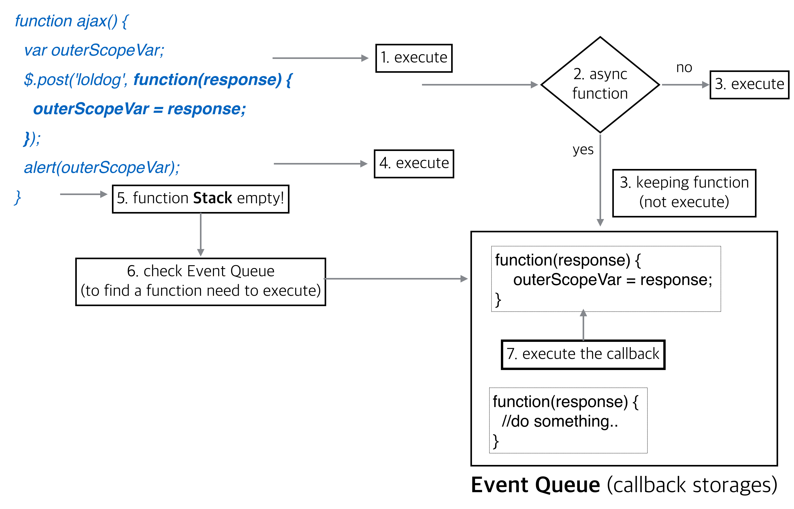
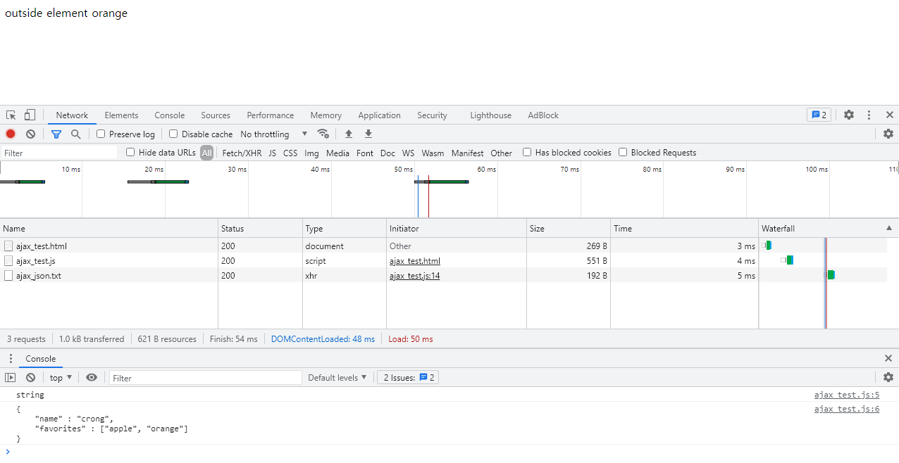
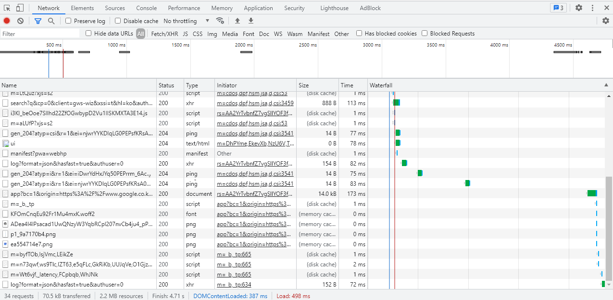

> 부스트코스 - 웹 프로그래밍(풀스택)강의를 학습, 정리한 내용입니다.(https://www.boostcourse.org/web316/joinLectures/12943)

# DOM API활용 - FrontEnd
# 목차

- [DOM API활용 - FrontEnd](#dom-api활용---frontend)
- [목차](#목차)
- [1) Ajax 응답 처리와 비동기](#1-ajax-응답-처리와-비동기)
  - [핵심 개념](#핵심-개념)
  - [1. AJAX와 비동기](#1-ajax와-비동기)
  - [2. Ajax응답처리](#2-ajax응답처리)
    - [실습](#실습)
    - [에러발생](#에러발생)
  - [3. cross domain 문제](#3-cross-domain-문제)
  - [생각해보기](#생각해보기)
    - [JSONP란?](#jsonp란)
    - [JSONP 동작방식](#jsonp-동작방식)
  - [참고 자료](#참고-자료)
- [2) 디버깅 - 크롬 개발자도구](#2-디버깅---크롬-개발자도구)
  - [핵심 개념](#핵심-개념-1)
  - [1. 크롬 개발자도구의 네트워크 패널](#1-크롬-개발자도구의-네트워크-패널)
    - [크롬 개발자도구의 기능](#크롬-개발자도구의-기능)
    - [크롬 개발자도구의 네트워크 패널](#크롬-개발자도구의-네트워크-패널)
  - [생각해보기](#생각해보기-1)
  - [추가 학습](#추가-학습)
  - [참고 자료](#참고-자료-1)

<small><i><a href='http://ecotrust-canada.github.io/markdown-toc/'>Table of contents generated with markdown-toc</a></i></small>


# 1) Ajax 응답 처리와 비동기
Ajax는 비동기와 더불어 많은 개념들이 설명되는 기술

새로고침이 일어나지 않고 서버 측의 데이터를 브라우저의 화면 전환 없이 서버 측에 어떤 데이터를 얻어오는 방법

UX와 관련이 많은 기술

더 좋은 UX(User Experience)를 제공하는 좋은 방법

## 핵심 개념
* XMLHTTPRequest
* Ajax
 
## 1. AJAX와 비동기
* ajax 코드
```js
 function ajax() {
   var oReq = new XMLHttpRequest();
	
  oReq.addEventListener("load", function() {
    console.log(this.responseText);
  });
	
   oReq.open("GET", "http://www.example.org/example.txt");
   oReq.send();
}
```
4라인의 익명함수(addEventListener)는 8라인, 9라인보다 더 늦게 실행되는 함수.

이 익명 함수는 비동기로 실행되며, 이벤트큐에 보관되다가 load이벤트가 발생하면(서버로부터 데이터를 브라우저가 받으면) 그때 call stack 에 실행되고 있는 함수가 없어서 비어있다면 stack에 올라와서 실행.

[Using XMLHttpRequest](https://developer.mozilla.org/en-US/docs/Web/API/XMLHttpRequest/Using_XMLHttpRequest)


* 동기/비동기에 대한 것은 아래 자료를 참고
  * [어쨌든 이벤트 루프는 무엇입니까? | Philip Roberts | JSConf EU](https://www.youtube.com/watch?v=8aGhZQkoFbQ&ab_channel=JSConf)
  * 
Ajax통신(Jquery라이브러 사용 예제)
    * 위 그림은 AJAX통신(jQuery라이브러리를 사용한 예제다)을 코드단위로 어떻게 비동기로 처리되는지 보여준다.

## 2. Ajax응답처리

서버로부터 받아온 JSON 데이터는 문자열 형태이므로 브라우저에서 바로 실행할 수가 없다. 

따라서 문자열을 자바스크립트객체로 변환해야 데이터에 접근할 수가 있다.

이를 하려면 문자열 파싱을 일일이 해야 하는 불편함이 있다.
```js
var oReq = new XMLHttpRequest();
oReq.addEventListener("load", function() {
    console.log(this.responseText);
});
oReq.open("GET", "./json.txt");
oReq.send();
```
* this는 addEventListener를 가리킨다.

브라우저에서는 JSON객체를 제공하며. 이를 활용해서 자바스크립트 객체로 변환할 수가 있다.
```js
var json객체로변환된값 = JSON.parse("서버에서 받은 JSON 문자열");
```

### 실습
위의 브라우저 JSON객체를 사용하여 파싱한 값을 chrome브라우저에서 얻어와 확인해보자.
```js
var oReq = new XMLHttpRequest();
oReq.addEventListener("load", function() {
    console.log(typeof this.responseText);
});
oReq.open("GET", "./json.txt");
oReq.send();
```
typeof로 확인해본 결과 this.responseText는 String이다.
```js
var oReq = new XMLHttpRequest();
oReq.addEventListener("load", function() {
    var jsonObj = JSON.parse(this.responseText);

    console.log(typeof this.responseText);
    console.log(this.responseText);

    var fruit = jsonobj.favorites[1];
    var outside = document.querySelector(".outside");
    outside.innerHTML += ("<span> "+ fruit + "</span>");
});
oReq.open("GET", "./json.txt");
oReq.send();
```
* this.responseText라는 서버에서 받은 JSON 문자열(String)을 브라우저 JSON객체인 JSON.parse()를 이용해 JSON객채로 변환하고 JSON객체로 변환된 값을 jsonObj에 저장 후 console.log를 통해 타입과 내용을 확인한다.

### 에러발생
"from origin 'null' has been blocked by CORS policy: Cross origin requests are only supported for protocol schemes: http, data, chrome, chrome-extension, chrome-untrusted, https."
* CORS 정책관련 에러가 발생.
* 브라우저마다 다르지만 크롬에서는 로컬로 파일을 열어서 확인할 수 없다는 정책이 있다.
* 해결하기 위한 방법으로는 크롬확장프로그램사용, jQuery - jsonp 사용, 크롬을 "--allow-file-access-from-files" 옵션과 함께 열기 등이 있다.



## 3. cross domain 문제
XHR통신은 다른 도메인 간에는 보안을 이유로 요청이 안 된다.

즉 A도메인에서 B도메인으로 XHR통신, Ajax 통신을 할 수 없다.

이를 회피하기 위해서 JSONP라는 방식이 널리 사용되고 있다.

최근에는 CORS라는 표준적인 방법이 제공되고 있어 이를 활용하는 경우도 등장. 

CORS를 사용하기 위해서는 프로그램 코드에서 별도로 해야 할 것이 없고, 백엔드코드에서 헤더 설정을 해야 하는 번거로움이 있다.

CORS와 JSONP의 적용 방법을 찾아보는 것도 좋은 방법.

JSONP는 아직도 많은 곳에서 사용하는 비표준이지만 사실상 표준으로 사용하는 것으로, CORS로 가기 전에 많은 곳에서 사용 중.

## 생각해보기
다양한 웹사이트에서 검색 자동완성 UI에서 어떤 방식으로 데이터를 가져오는지, 크롬 개발자도구의 networks패널을 열고 확인을 해봅니다. 꽤 많은 사이트가 크로스도메인 문제를 해결하기 위해 JSONP방식으로 통신하는 걸 알 수 있습니다.
 
### JSONP란?
* JSONP란 CORS가 활성화 되기 이전의 데이터 요청 방법으로, 다른 도메인으로부터 데이터를 가져오기 위해 사용하는 방법
* 자바스크립트는 서로 다른 도메인에 대한 요청을 보안상 제한하는데, 이 정책은 Same-Origin Policy, SOP라고 한다.
* SOP 정책으로 인해 생기는 이슈를 Cross-domain issue라고 하는데 JSONP는 이 이슈를 우회해서 데이터 공유를 가능하게 한다.
* JSONP는 여러 보안상 이슈로 인하여 W3C에서는 2009년 채택된 CORS 방식의 HTTP 통신을 권장하고 있다. (상속 비보안 문제로 인해 JSONP는 CORS로 대체되고 있다.)
### JSONP 동작방식
* 웹 브라우저에서 실행되는 JavaScript는 동일 출처 정책에 따라 XMLHttpRequest 등의 직접적인 HTTP 통신을 이용해 외부 출처에서 데이터를 받아오는 것이 불가능하지만, HTML `<script>` 요소는 외부 출처로부터 조회된 내용을 실행하는 것이 허용되어 있다. 
* json포맷의 데이터를 불러오기 위해 javascript의 직접적인 http통신을 하면 오류가 발생한다
* 반면 script태그에 json데이터를 직접적으로 삽입하면 교차출처정책에 관계없이 가져올수 있지만 js문법 오류가 발생한다.
* js엔진이 중괄호 문법을 block으로 해석하기 때문
* jsonp는 이러한 웹 브라우저의 특성을 이용해 json 데이터를 클라가 지정한 콜백함수를 호출하는 유효한 js 문법으로 감싸 클라이언트에 전송한다.
* 클라이언트가 parseResponse라는 함수를 jsonp의 요청의 콜백함수로 지정하였다고 하면 특정 html태그가 문서에 삽입된다.
* 외부서비스는 json데이터를 패딩하여 클라이언트에게 보낸다.
* 웹브라우저는 이 데이터를 유효한 js프로그램으로 받아들여 실행하고 콜백 함수인 parseResponse가 실행되며 받아온 데이터를 처리할 수 있게 된다.

[JSONP-wiki](https://ko.wikipedia.org/wiki/JSONP)

## 참고 자료
> [참고링크] Using XMLHttpRequest
https://developer.mozilla.org  

> [참고영상] Philip Roberts: What the heck is the event loop anyway? 
https://www.youtube.com/watch?v=8aGhZQkoFbQ&ab_channel=JSConf

> [참고링크] Synchronous and Asynchronous
http://www.phpmind.com


# 2) 디버깅 - 크롬 개발자도구
웹 개발을 하다 보면  Ajax와 같은 요청처리에 대해서 문제가 생길 수 있다.  

Ajax 통신에서 로직이 문제인지, 아니면 서버 쪽의 문제인지 등 궁금할 때가 많다.

이런 부분을 소스코드상으로는 디버깅을 할 수 없다. 

Ajax뿐만 아니라 다양한 상황에서 네트워크 통신과정의 상황을 지켜보면서 디버깅하는 방법을 알아보자.

## 핵심 개념
* 크롬 개발자도구

## 1. 크롬 개발자도구의 네트워크 패널
### 크롬 개발자도구의 기능 
(성능개선을 위한 진단 도구 역할)
1. 녹화
   * 왼쪽 상단 빨간색 녹화 버튼
   * HTML, CSS, JavaScript, image파일을 내려받는 상황 체크 가능

2. 문제 확인
   * 흔히 겪는 404와 같은 응답 오류에 대해서 문제 찾기 쉽게 가능
   * 빨간색의 네트워크 응답 오류 발생시 name을 클릭하여 header, preview, response와 같은 정보 확인 가능.

3. 응답 시간 확인 
   * capture screen과(응답시간별 리소스 가로 리스트) waterfall탭을 통해 확인가능
   * 서버로부터의 응답 시간 확인 가능.
   * 마우스 오버시 다양한 정보 확인가능

4. 네트워크 리소스 확인
   * html, css, js, fetch/xhr, img 별로 필터링하여 편하게 리소스 확인.

### 크롬 개발자도구의 네트워크 패널

다양한 탭을 통해서 XHR, JS 등 통신 항목만 추려서 그 결과를 확인할 수 있으므로, 디버깅을 쉽게 할 수 있다.

또한, Name, status, type과 같은 항목도 내 맘대로 설정해서 노출할 수가 있다.

전반적인 http 통신과정을 확인할 수 있어 다양한 문제 상황 시 문제점을 파악할 수 있는 도구.

* doc 필터 - html 리소스.

## 생각해보기
네트워크 패널에서 제공하는 기능 중에 'Capture screenshots' 이라는 기능이 있다. 이 부분을 활성화하고 웹사이트를 다시 로딩해서 그 결과를 확인해보세요. 시간대별로 화면을 볼 수 있는 신기한 기능. 

## 추가 학습
* XHR(XMLHttpRequest) : AJAX 요청을 생성하는 JavaScript API입니다. XHR의 메서드로 브라우저와 서버간의 네트워크 요청을 전송할 수 있습니다.
* FETCH API : XHR API와 비슷하다. 네트워크 통신을 포함한 리소스 취득을 위한 인터페이스가 정의되어 있다. 네트워크에서 비동기적으로 데이터를 가져올 수 있다.  XHR보다 강력하고 유연한 조작 가능.

## 참고 자료 
> [참고링크] 구글에서 제공하는 가이드
https://developers.google.com