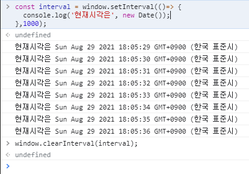
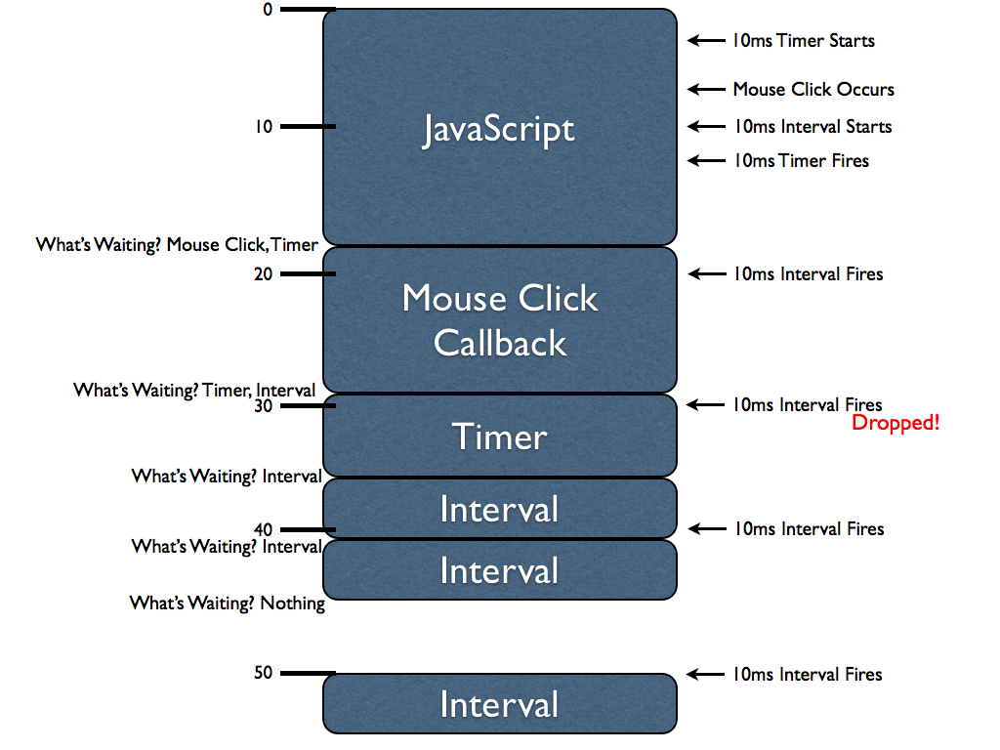
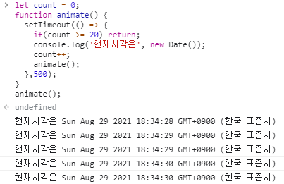
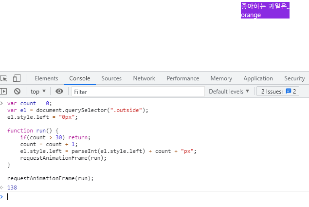
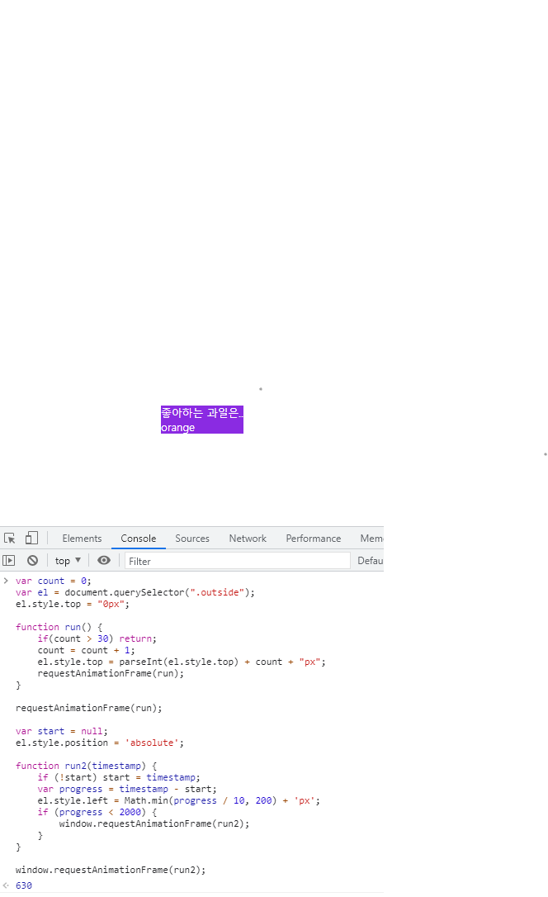

> 부스트 코스 - 웹 프로그래밍(풀스택) 강의를 학습, 정리한 내용입니다. (https://www.boostcourse.org/web316/joinLectures/12943)

# DOM API활용 - FrontEnd
# 목차

- [DOM API활용 - FrontEnd](#dom-api활용---frontend)
- [목차](#목차)
- [1) 웹 애니메이션 이해와 setTimeout 활용](#1-웹-애니메이션-이해와-settimeout-활용)
  - [학습 목표](#학습-목표)
  - [핵심 개념](#핵심-개념)
  - [1. 애니메이션](#1-애니메이션)
  - [2. FPS](#2-fps)
  - [3. JavaScript 애니메이션](#3-javascript-애니메이션)
    - [3.1 setInterval()](#31-setinterval)
      - [setInterval의 문제점](#setinterval의-문제점)
    - [3.2 setTimeout](#32-settimeout)
      - [setTimeout의 문제점](#settimeout의-문제점)
  - [생각해보기](#생각해보기)
  - [참고 자료](#참고-자료)
  - [추가학습](#추가학습)
- [2) requestAnimationFrame 활용](#2-requestanimationframe-활용)
  - [학습 목표](#학습-목표-1)
  - [핵심 개념](#핵심-개념-1)
  - [1. requestAnimationFrame](#1-requestanimationframe)
  - [생각해보기](#생각해보기-1)
  - [참고 자료](#참고-자료-1)
- [3) CSS3 transition 활용](#3-css3-transition-활용)
  - [핵심 개념](#핵심-개념-2)
  - [CSS 기법으로 애니메이션 구현](#css-기법으로-애니메이션-구현)
    - [css transition 요약](#css-transition-요약)
    - [css transform 요약](#css-transform-요약)
  - [더 빠른 css3 애니메이션 관련 속성들](#더-빠른-css3-애니메이션-관련-속성들)
  - [코드 실습](#코드-실습)
  - [생각해보기](#생각해보기-2)
    - [답](#답)
  - [참고 자료](#참고-자료-2)

<small><i><a href='http://ecotrust-canada.github.io/markdown-toc/'>Table of contents generated with markdown-toc</a></i></small>


# 1) 웹 애니메이션 이해와 setTimeout 활용
웹사이트의 애니메이션 구현은 어떻게 할까?

javascript와 CSS를 다루면서 웹 애니메이션 구현하는 방법을 알아보자.
 

## 학습 목표
* setInterval 애니메이션의 문제를 이해.
* setTimeout을 사용한 재귀호출방식의 애니메이션을 이해.
 
## 핵심 개념
* setTimeout 기반 애니메이션 방식
 
## 1. 애니메이션
*애니메이션은 반복적인 움직임의 처리*.

웹 UI 애니메이션은 *자바스크립트*로 다양하게 제어할 수 있지만, 규칙적이고 비교적 단순한 방식으로 동작하는 방식은 *CSS3의 transition과 transform속성*을 사용해서 대부분 구현 가능*.

그뿐만 아니라 *자바스크립트보다 더 빠른 성능을 보장*한다. ( 미래에는 자바스크립트로 더 빨리 구현하는 방법들이 나올 수 도 있다. 그럼에도 js와 css 방식을 섞는게 더 빠를 것. )

이런 애니메이션 성능 비교를 검색해보자.

[CSS 및 JavaScript 애니메이션 성능 - MDN](https://developer.mozilla.org/en-US/docs/Web/Performance/CSS_JavaScript_animation_performance)  
 * 요약 : 
   * 가능한 경우 *CSS transitions/animations 을 사용*하여 항상 애니메이션을 만들도록 노력. 
   * 애니메이션이 정말 *복잡한 경우 대신 JavaScript 기반 애니메이션에 의존*해야 할 수 도 있다.

특히 모바일 웹에서는 CSS를 사용한 방법이 훨씬 더 빠르다.

## 2. FPS
* FPS (frame per second)는 1초당 화면에 표현할 수 있는 정지화면(frame) 수.
* 매끄러운 애니메이션은 보통 60fps.
* 따라서 16.666밀리세컨드 간격으로 frame 생성이 필요한 셈. (1000ms / 60fps = 16.6666ms)
* 앞서 말한 것처럼, 애니메이션은 CSS의 transition속성으로 CSS 속성을 변경하거나, JavaScript로 CSS 속성을 변경할 수 있다.
* 결국 이렇게 정의할 수 있다.
  * 간단하고 규칙적인 거 → CSS로 변경
  * 세밀한 조작이 필요한 거 → JavaScript로 변경
* 성능만 봐서는 대체로 CSS로 변경하는 것이 빠르다.

하지만 성능 비교를 통해서 가장 빠른 방법을 찾는 과정이 필요하기도.

## 3. JavaScript 애니메이션
자바스크립트로 애니메이션을 구현하려면, 규칙적인 처리를 하도록 구현하면 된다.

다음과 같은 방법이 있다.

* setInterval
* setTimeout
* requestAnimationframe
* Animations API

### 3.1 setInterval()
주어진 시간에 따라서 함수 실행이 가능.
```js
const interval = window.setInterval(()=> {
  console.log('현재시각은', new Date());
},1000/60);

window.clearInterval(interval);
```
* setInterval 실습  
  
    * 시간간격을 1000으로 줘 1초마다 실행
    * clearInterval : 타이머 실행 중지.

#### setInterval의 문제점
* 지연문제가 발생할 수 있다. (정해진 시간마다 함수가 실행된다고 보장할 수 없다.)
* 아래 그림을 보면 제때 일어나야 할 이벤트 콜백이 지연되고, 없어지고 하는 것을 볼 수 있다. 
* setInterval은 비동기적인 작업이기 때문에 동기적인 다른 작업이 중간에 들어온다면 밀리거나 끊길 수 있다. 
* 따라서 setInterval을 사용한다고 해서 정해진 시간에 함수가 실행된다고 보장할 수 없다.



* 결국 일반적으로 setInterval 을 사용하는 애니메이션 구현을 잘 하지 않는다.
* 참고 : setInterval함수를 사용했을때, 콜백함수가 10개중 9개만 실행된다고 큰 문제가 생기는 것은 아니다. 때로는 더 자연스럽게 느껴질 수도 있다. 그럼에도 원하는 방식의 동작은 아니기에 다른 방식을 사용한다.

### 3.2 setTimeout
setInterval은 정기적으로 실행되는 것이지만, ***setTimeout은 지정된 시간 이후에 한 번만 실행된다. 따라서 재귀호출을 사용한다.***
```js
//arrow 함수를 사용.
  setTimeout(() => {
    console.log('현재시각은', new Date());
  },500);
```
setTimeout으로 애니메이션을 구현하려면 재귀호출을 해서 구현할 수 있다.
```js
let count = 0;
function animate() {   
  setTimeout(() => {
    if(count >= 20) return;
    console.log('현재시각은', new Date());
    count++;
    animate();
  },500);
}
animate();
```
* count가 0인데 20보다 크거나 같으면 리턴(종료)
* setTimeout함수를 포함하는 animate 함수를 계속해서 실행하여(재귀호출하여) 애니메이션을 구현한다.
* 8행의 animate(); 실행 후 재귀호출되고 setTimeout()이라는 콜백함수는 콜 스택에서 비워지게 된다.

* setTimeout 실습  

  * 500ms로 설정했기 때문에 1초에 2번 실행

#### setTimeout의 문제점
* setTimeout도 엄밀하게는 어떤 이유로 인해 제때에 원하는 콜백함수가 실행되지 않을 수는 있다. 
* setInterval의 문제점 처럼 코드가 씹히는(먹히는)문제가 발생하지는 않는다. 
* 중간에 있는 콜백 함수가 누적이 되면 쌓여있던 게 하나가 없어지고 마지막 코드가 실행될 수 는 있지만, 매 코드가 끝난 후 다음 코드가 실행되기 때문에 setInterval처럼 씹히지 않는다. 
* 또, setTimeout은 매 순간 timeout을 조절할 수 있는 코드 구현으로 컨트롤 가능한 부분이 있다는 점이 setInterval과 큰 차이라고 할 수 있다. 
* 물론 애니메이션을 위한 최적화된 방법이라고 볼 수 는 없다.
* 따라서 ***requestAnimationFrame***을 사용한다.

## 생각해보기
동일한 요구사항을 만들고, setInterval로 애니메이션을 했을 경우와 setTimeout으로 애니메이션을 구현했을 경우를 비교해보면서 실험해보자.

## 참고 자료
> [참고링크] Scheduling 참고 글과 예제
https://javascript.info

## 추가학습
* Arrow function - ES6의 함수를 간단하게 표현하는 새로운 문법.
* 화살표 함수 표현(arrow function expression)은 function 표현에 비해 구문이 짧고  자신의 this, arguments, super 또는 new.target을 바인딩 하지 않습니다. 화살표 함수는 항상 익명입니다. 이  함수 표현은 ***메소드 함수가 아닌 곳에 가장 적합***합니다. 그래서 생성자로서 사용할 수 없습니다.
    ```js
    const materials = [
        'Hydrogen',
        'Helium',
        'Lithium',
        'Beryllium'
    ];

    console.log(materials.map(material => material.length));
    // expected output: Array [8, 6, 7, 9]
    ```


# 2) requestAnimationFrame 활용
setTimeout이나 setInterval을 사용해서 연속적인 함수 호출로 애니메이션을 구현하는 방법은 약간의 delay가 발생하는 문제가 있다.

이들 함수는 애니메이션을 위해서 생겨난 기능은 아니다.

애니메이션 구현을 위해서는 끊김없이 부드럽게 처리가 돼야 하는데,  다행히도 이를 위한 메서드를 브라우저가 제공하고 있다.

## 학습 목표
requestAnimationframe를 사용해서 최적화된 타이밍에 animation관련 함수가 실행되도록 한다.
 
## 핵심 개념
* requestAnimationframe
 
## 1. requestAnimationFrame
* 배경
  * setTimeout은 animation을 위한 최적화된 기능이라 보기는 어렵다.
  * animation주기를 16.6 미만으로 하는 경우 불필요한 frame 생성이 되는 등의 문제가 생긴다.
  * 그 대안으로 생긴 것이 바로 requestAnimationFrame.

* 예제
    ```js
    var count = 0;
    var el=document.querySelector(".outside");
    el.style.left = "0px";

    // 특정 조건이 될 때까지(함수의 탈출 조건) 계속 함수를 연속적으로 호출
    function run() {
    if(count > 70) return;
    count = count + 1;
    el.style.left =  parseInt(el.style.left) + count + "px";
    requestAnimationFrame(run);
    }

    // 먼저 requestAnimationFrame을 한번 실행시켜줘야 한다.
    requestAnimationFrame(run);
    ```
    * 먼저 requestAnimationFrame을 한번 실행시켜줘야 한다.
    * 그 이후에 특정 조건이 될 때까지(함수의 탈출 조건) 계속 함수를 연속적으로 호출하는 것.
    * 이렇게 requestAnimationFrame함수를 통해서 원하는 함수를 인자로 넣어주면, 브라우저는 인자로 받은 그 비동기 함수가 실행될 가장 적절한 타이밍에 실행시켜준다.

* 설명
  * 우리는 어느 정도 브라우저를 믿고 이 함수를 전달해주는 것. 
  * 예제에서는 연속적으로 requestAnimationFrame를 통해서 run함수를 호출하면서 left 값을 증가시켜주고 있다. (횟수로 70회까지 테스트하는 코드.)
  * canvas, svg를 사용하면서 그래픽 작업을 하게 될 때 복잡한 애니메이션을 다룰 필요가 생길 수 있다.
  * 자바스크립트로 복잡한 애니메이션처리를 처리해야 할 때 requestAnimationFrame은 꽤 유용하게 쓰일 수 있다.
  * count를 통해서 일정 횟수로 애니메이션이 동작하도록 했지만, 시간값을 이용한다면, 일정시간안에서만 애니메이션이 발생하도록 할 수도 있을 것. 

* 실습  
  * ajax_test.html을 활용 - style을 준다.

    

## 생각해보기
requestAnimationFrame을 통한 함수호출을 여러 번 해보면 어떨까요? 예를 들어 requestAnimationFrame(run), 그리고 requestAnimationFrame(run2) 이런 식으로 1개 이상의 애니메이션 동작을 한 페이지에서 구현하면 어떤 결과가 나올지 확인해보세요. 많을수록 테스트가 더 의미 있을 겁니다. 브라우저마다 결과가 다를 수 있지만, 아마도 브라우저는 처리해야 할 애니메이션 함수들을 열심히 호출하면서 최대한 자연스러운 애니메이션 결과를 보여주려고 할 겁니다. 이런 상태에서 더욱더 requestAnimationFrame이 의미가 있다고 봐야겠습니다.
 
   
* 기존의 실습 코드와 MDN의 예제 코드를 사용하였다
* 기존 실습 코드의 left를 top으로 바꾸어 아래로 떨어지게 하였고  MDN 예제 코드는 그대로 사용하여 오른쪽으로 이동하게 하였다.
* 결과적으로 .outside요소가 오른쪽 아래로 떨어지는 듯한 애니메이션이 실행되었다. 

## 참고 자료
> [참고링크] window.requestAnimationFrame()
https://developer.mozilla.org/ko/docs/Web/API/Window/requestAnimationFrame
* MDN 예제
    ```js
    var start = null;
    var element = document.getElementById('SomeElementYouWantToAnimate');
    element.style.position = 'absolute';

    function step(timestamp) {
    if (!start) start = timestamp;
    var progress = timestamp - start;
    element.style.left = Math.min(progress / 10, 200) + 'px';
    if (progress < 2000) {
        window.requestAnimationFrame(step);
    }
    }

    window.requestAnimationFrame(step);
    ```


# 3) CSS3 transition 활용
애니메이션 효과는 부드러운 UX를 제공하는 것이 좋다.

버벅거리는 효과는 오히려 답답하고 느린 웹사이트로 인식될 수 있다.

CSS3는 최적의 방법이라 할 수 있다.

## 핵심 개념
* CSS3 transition
* CSS3 transform

## CSS 기법으로 애니메이션 구현
transition 을 이용한 방법  
이 방법이 JavaScript로 구현하는 것보다 더 빠르다.  
특히 모바일 웹에서는 transform을 사용한 element의 조작을 많이 구현한다.

[CSS Transitions and Transforms for Beginners](https://thoughtbot.com/blog/transitions-and-transforms)

### css transition 요약 
* transition-duration : transition의 시간 범위 지정(몇 초에 거쳐 실행하느냐)
* transition-timing : duration동안 transition의 속도를 정의
  * options: linear(even speed), ease(slow-quick-slow), ease-in(slow-fast), ease-out(fase-slow), ease-in-out, cubic-bezier(custom timing function)
* transition-delay
### css transform 요약
* scale : 확대, 축소
* rotate : 회전
* translate : 옮기다
* skew : 비스듬하게
* transform-origin : 왼쪽위를 축으로 회전

## 더 빠른 css3 애니메이션 관련 속성들
GPU가속을 이용하는 속성을 사용하면 애니메이션 처리가 빠르다.

* transform : translateXX();
* transform : scale();
* transform : rotate();
* opacity

아래 링크를 참고

[하드웨어 가속에 대한 이해와 적용](https://d2.naver.com/helloworld/2061385)

## 코드 실습
ajax_test.html 파일의 style 값에 아래 값들을 주고 크롬 개발자도구에서 실습 
```html
  left: 100px;
  top: 100px;
  transform: scale(1);
  transition: all 2s;
  <!-- transition: transform 2s; -->
```
```js
var base = document.querySelector(".outside");
base.style.transform = "scale(2)";
base.style.left = "500px";
```
* html 파일 스타일 속성에서 `transition: transform 2s;` 라고 주면 left속성은 바로 실행되고 scale속성만 2초에 걸쳐 실행된다.

## 생각해보기
1. 특정 엘리먼트를 만들고, 그 엘리먼트에 transition 속성을 주고, hover했을 때 좌측 상단에서, 우측 하단으로 움직이는 animation을 만들어보세요.

2. vendor prefix가 무엇이고, 왜 필요한지 알아봅니다.

### 답
1. 실습
   * ajax_test.html파일을 살짝 수정하여 실습하였다.
   * 크롬 개발자도구 콘솔로 실습
   ```js
    var base = document.querySelector(".outside");
    base.style.left = "1000px";
    base.style.top = "500px";
   ```
   * html style속성에서 transition의 값을 left 2s, top 2s;로 주었다.
   * 실행하니 left와 top속성의 실행을 2초간 실행하였고 결과적으로 좌측상단에서 우측하단으로 지정한 속성의 값만큼 이동하는 애니메이션을 확인할 수 있었다.
2. vendor prefix
   * 벤더 프리픽스는 브라우저에서 새로운 css 속성들을 지원하기 위한 방법으로 모든 브라우저에서 완전히 지원하기 전에 사용한다. 
   * 예시로 -moz-, -webkit- 과 같은 것들이 있다. 
> [Understanding CSS Vendor Prefixes](https://dzone.com/articles/understanding-css-vendor-prefixes)

## 참고 자료
> [참고링크] 하드웨어 가속에 대한 이해와 적용
http://d2.naver.com

> [참고링크] CSS Transitions and Transforms for Beginners
https://thoughtbot.com/blog/transitions-and-transforms

> [참고링크] window.requestAnimationFrame()
https://developer.mozilla.org/ko/docs/Web/API/Window/requestAnimationFrame

