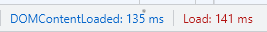
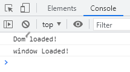
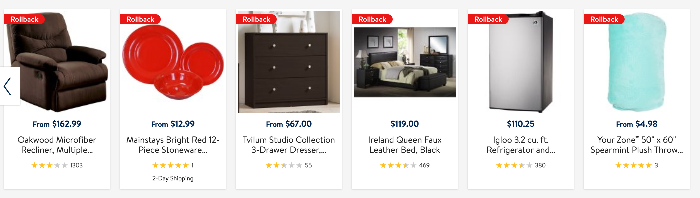
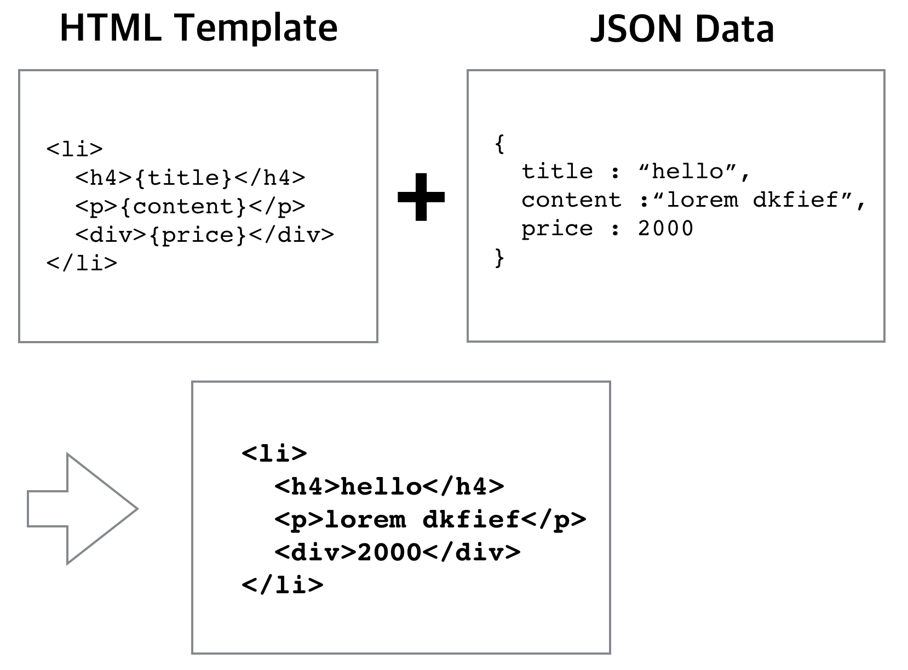

> 부스트 코스 - 웹 프로그래밍(풀스택) 강의를 학습, 정리한 내용입니다. (https://www.boostcourse.org/web316/joinLectures/12943)

# DOM API활용 - FrontEnd
# 목차

- [DOM API활용 - FrontEnd](#dom-api활용---frontend)
- [목차](#목차)
- [1) 서비스 개발을 위한 디렉토리 구성](#1-서비스-개발을-위한-디렉토리-구성)
  - [학습 목표](#학습-목표)
  - [핵심 개념](#핵심-개념)
  - [1. JavaScript파일 구성](#1-javascript파일-구성)
  - [2. HTML안에 JavaScript 구성하기](#2-html안에-javascript-구성하기)
  - [실습](#실습)
    - [실습 예제 html파일](#실습-예제-html파일)
    - [예제 파일 수정 후](#예제-파일-수정-후)
    - [실습 설명](#실습-설명)
    - [추가 설명](#추가-설명)
  - [생각해보기](#생각해보기)
    - [알아본 결과](#알아본-결과)
  - [참고 자료](#참고-자료)
- [2) DOMContentLoaded 이벤트](#2-domcontentloaded-이벤트)
  - [학습 목표](#학습-목표-1)
  - [핵심 개념](#핵심-개념-1)
  - [load와 DOMContentLoaded의 차이 확인](#load와-domcontentloaded의-차이-확인)
  - [실습1](#실습1)
    - [결과](#결과)
  - [실습2](#실습2)
    - [정리](#정리)
  - [DOMContentLoaded 예제](#domcontentloaded-예제)
  - [생각해보기](#생각해보기-1)
  - [참고 자료](#참고-자료-1)
- [3) Event delegation](#3-event-delegation)
  - [학습 목표](#학습-목표-2)
  - [핵심 개념](#핵심-개념-2)
  - [1)](#1)
  - [2)](#2)
  - [생각해보기](#생각해보기-2)
  - [참고 자료](#참고-자료-2)
- [4) HTML templating](#4-html-templating)
  - [핵심 개념](#핵심-개념-3)
  - [HTML Templating](#html-templating)
  - [HTML Templating 작업이란?](#html-templating-작업이란)
  - [결합과정 해결하기](#결합과정-해결하기)
  - [생각해보기](#생각해보기-3)
  - [HTML Template의 보관](#html-template의-보관)
  - [Templating](#templating)
    - [실습 코드](#실습-코드)
  - [생각해보기](#생각해보기-4)
  - [참고 자료](#참고-자료-3)

<small><i><a href='http://ecotrust-canada.github.io/markdown-toc/'>Table of contents generated with markdown-toc</a></i></small>


# 1) 서비스 개발을 위한 디렉토리 구성
서비스를 개발할 때 JavaScript 코드가 많아지면 어떻게 보관하고 관리해야 하는지 잘 모를 때가 있다.

소스코드상에서도 많아진 JavaScript 코드를 어떻게 표현해야 할지도 의문이다.

## 학습 목표
웹브라우저 렌더링에 필요한 JavaScript와 CSS파일의 구성방법을 이해한다.
 
## 핵심 개념
* 개발환경 구성
* 브라우저에서 동작가능하도록 JavaScript와 CSS의 소스코드 위치시키기
 
## 1. JavaScript파일 구성
간단한 내용의 JavaScript라면 한 페이지에 모두 표현하는 것도 좋다.

그렇지 않다면 의미에 맞게 구분하는 방법이 더 좋다.

## 2. HTML안에 JavaScript 구성하기
CSS는 head태그 안에 상단에 위치.

JavaScript는 body 태그가 닫히기 전에 소스파일 간 의존성을 이해해서 순서대로 배치.
 
## 실습
directory폴더의 mainOld.html의 css와 js 코드를 올바르게 분리 또는 재구성한다.
### 실습 예제 html파일
directory/mainOld.html
```html
<html>
  <head>
    <style>
      h1 {
        color: aquamarine;
      }
    </style>
    <script>
      console.log("hello!!");
      var elHeading = document.querySelector("h1");
      console.log(elHeading);
    </script>
  </head>

  <body>
    <h1>디렉토리 구성 연습</h1>
    <p>
      Lorem, ipsum dolor sit amet consectetur adipisicing elit. Cumque
      voluptatem corrupti ut magni fuga quam quibusdam dolor dicta ratione
      voluptate pariatur, assumenda alias consectetur. Tenetur eum consequuntur
      recusandae omnis quidem.
    </p>
  </body>
</html>
```
### 예제 파일 수정 후
main.html, main.css, main.js로 재구성
* directory/main.html
```html
<html>
  <head>
    <link rel="stylesheet" href="./css/main.css" />
  </head>

  <body>
    <h1>디렉토리 구성 연습</h1>
    <p>
      Lorem, ipsum dolor sit amet consectetur adipisicing elit. Cumque
      voluptatem corrupti ut magni fuga quam quibusdam dolor dicta ratione
      voluptate pariatur, assumenda alias consectetur. Tenetur eum consequuntur
      recusandae omnis quidem.
    </p>

    <script src="js/common.js"></script>
    <script src="js/main.js"></script>
  </body>
</html>
```
* directory/css/main.css
```css
h1 {
  color: rebeccapurple;
}
```
* directory/js/main.js
```js
console.log("hello!!");
var elHeading = document.querySelector("h1");
console.log(elHeading);
foo(elHeading);
```
* directory/js/common.js
```
function foo() {
  console.log("메세지를 출력하는 푸 함수 추가");
}

```
### 실습 설명
1. script태그 위치 변경 및 JavaScript 코드를 새로운 파일로 분리
   * 브라우저에서 html파일을 실행한 후 chrome 개발자도구의 console에서 출력이 제대로 실행되었는지 확인한다.
   * script태그가 head에 위치한 경우 2번째 console.log는 실행되지 않아 null이라는 값이 나온다.
   * 하지만 body태그 닫히기 전에 script태그를 위치시키고 실행해보면 제대로 실행된다.
   * 그 이유는 브라우저는 한 라인씩 html코드를 파싱하다가 js코드가 있으면 실행한다. 그런데 script가 head에 위치해 있을 경우 document가 지금 완전히 구성이 되지 않았기 때문에 null값이 나온다. (h1태그를 인식하지 못한 상태에서 h1태그를 찾는 js코드를 실행했기 때문)
   * 위의 내용은 아래 학습할 DOMContentLoaded와 관련된다.
2. css 코드를 새로운 파일로 분리후 link 코드로 연결
   * 개발 단계에서 코드가 많아지면 문제가 생길 수 있으므로 css 코드를 분리시킨다.
3. js파일 추가 (하나 더 필요하다고 가정)
   * 간단하게 콘솔창에 메세지를 출력하는 foo함수를 만들고 html파일에 적용시켜본다.
   * main.js 파일에서 foo()함수를 불러오는 코드를 넣는다.
   * html파일에서 common.js파일을 불러오는 코드를 넣는다.(foo함수를 불러오고나서 적용해야하므로 main.js파일보다 먼저 불러온다.)

### 추가 설명
* 테스트 코드
  * 테스트 코드는 'spec'이나 'test'와 같은 폴더를 디렉토리안에 만들고 'common.test.js'와 같은 이름의 js 파일을 만들어 테스트 한다.
  * 자바스크립트 코드가 많아지면 5개에서 10개, 20개 이렇게 많아질 수 있다.
  * 이렇게 js 파일이 늘어날 때는 배포할 때 실제 서비스에서 js가 http요청을 여러 번 하기 때문에 하나의 파일로 merge해서 배포를 하는 경우가 많다.(JavaScript코드들을 합쳐줄 수 있는 merge 도구 사용)

## 생각해보기
여러분들이 자주 가는 웹사이트를 열고, 먼저 Element 패널에서 JavaScript는 위치가 어디 있는지, CSS파일은 어떻게 위치시켰는지 알아봅니다. 
크롬 개발자도구의 소스패널을 열어서 서비스에서 JavaScript 소스 파일들을 찾고 몇 개의 파일로 구성되어 있는지 알아봅니다.

### 알아본 결과
* youtube.com과 github.com에 들어가 확인해 보았다. 
* html파일의 head태그와 body태그 끝 쪽에 많은 script태그가 있었고 source탭에서 확인해본 결과 다양한 폴더로 디렉토링되어 약 20개의 js파일로 구성되어 있었다.
* css파일을 연결하는 link태그는 head태그 위쪽에 10개 이하의 파일로 구성되어 있었다.
## 참고 자료 
> [참고링크](https://stackoverflow.com/questions/2414750/difference-between-domcontentloaded-and-load-events) Difference between DOMContentLoaded and load events 


# 2) DOMContentLoaded 이벤트
로딩 이후에 자바스크립트 동작이 이뤄지는 것이 일반적.
자바스크립트가 실행돼야 할 가장 적절한 타이밍은 언제일까?

## 학습 목표
DOM ContentLoaded 이벤트를 이해한다.
Load와의 차이점을 이해한다.

## 핵심 개념
* DOMContentLoaded

[영상보완]
html중간중간에 script를 추가해도 된다. 하지만 해당 DOM이 정의된 HTML코드 뒤에 작성해야 한다, 그전에 작성하면 해당 DOM node를 찾지 못한다.
* 아래는 정상적으로 찾아진다.  
    `<div>a</div><script>document.querySelector("div")</script>`
 
* 하지만 아래는 null이다.  
    `<script>document.querySelector("div")</script><div>a</div>`

## load와 DOMContentLoaded의 차이 확인
웹사이트에 접속해서 크롬 개발자도구로 이를 확인할 수 있다.

크롬 개발자도구의 Network panel을 열어서 하단에 DOMContentLoaded, load를 확인할 수 있다. 



두 개의 시간이 조금 다르다.

DOM Tree 분석이 끝나면 DOMContentLoaded 이벤트가 발생하며, 그 외 모든 자원이 다 받아져서 브라우저에 렌더링(화면 표시)까지 다 끝난 시점에는 Load가 발생한다.
* DOM Tree 분석 완료 > DOMContentLoaded (document)
* 브라우저 렌더링 완료 > Load (window)

이를 이해하고, 필요한 시점에 두 개의 이벤트를 사용해서 자바스크립트 실행을 할 수 있다. 

보통 DOM tree가 다 만들어지면 DOM APIs를 통해서 DOM에 접근할 수 있기 때문에, 실제로 실무에서는 대부분의 자바스크립트코드는 DOMContentLoaded 이후에 동작하도록 구현한다.

그 방법이 로딩속도 성능에 유리하다고 생각하기 때문

## 실습1
web animation에서 사용한 ajax_test.html 파일을 활용해 실습  
브라우저 로드시 DOMContentLoaded와 Load의 완료 시간을 비교한다.  

* test.html
```html
<!DOCTYPE html>
<html>
  <header>
    <style>
      .outside {
        position: relative;
        background-color: blueviolet;
        width: 300px;
        height: 300px;
        font-size: 0.8em;
        color: white;
        left: 100px;
        top: 100px;
        transform: scale(1);
        transition: left 0.5s, ease-in-out;
      }
    </style>
  </header>
  <body>
    <div class="outside">좋아하는 과일은..</div>
    <button>right!</button>
  </body>
  <script src="test.js"></script>
</html>
```

* test.js
```js
window.addEventListener("load", function () {
  console.log("window Loaded!");
});

document.addEventListener("DOMContentLoaded", function () {
  console.log("Dom loaded!");
});

var target = document.querySelector(".outside");
var btn = document.querySelector("button");

btn.addEventListener("click", function () {
  var pre = parseInt(target.style.left);
  target.style.left = pre + 200 + "px";
});
```

### 결과

* js코드에서 Window의 load를 먼저 작성하였지만 console에서 확인할 수 있듯이 DOM Loaded가 먼저 완료된 것을 확인할 수 있다.

## 실습2
실습1에서 실습했던 DOMContentLoaded를 이용한 코드는 아래로 내리고  
서비스가 필요한 코드들을 시작하기 위해 init()함수를 만들고 그 안에 필요한 js코드를 넣는다.  
그리고 init()함수를 DOMContentLoaded 완료시에 작동되도록 하였다.

* test.html
```html
<!DOCTYPE html>
<html>
  <header>
    <style>
      .outside {
        position: relative;
        background-color: blueviolet;
        width: 300px;
        height: 300px;
        font-size: 0.8em;
        color: white;
        left: 100px;
        top: 100px;
        transform: scale(1);
        transition: left 0.5s, ease-in-out;
      }
    </style>
  </header>
  <body>
    <div class="outside">좋아하는 과일은..</div>
    <button>right!</button>
  </body>
  <script src="test.js"></script>
</html>
```

* test.js
```js
function init() {
  var target = document.querySelector(".outside");
  var btn = document.querySelector("button");

  btn.addEventListener("click", function () {
    var pre = parseInt(target.style.left);
    target.style.left = pre + 200 + "px";
  });
}

document.addEventListener("DOMContentLoaded", function () {
  console.log("Dom loaded!");
  init();
});
```

### 정리
* 브라우저 시작때 스크립트를 시작하고 싶다면 DOMContentLoaded를 콜백 함수 아래에다가 넣는게 실습2 와 같이 가장 안전한 방법이다.

## DOMContentLoaded 예제
```js
document.addEventListener("DOMContentLoaded", function() {
  startSomething();
  initFoo();
  initBar();
  var el = document.querySelector("div");
});
```

## 생각해보기
load이벤트 이후에 작업하는 게 좋은 건 어떤 걸까?
* 이미지가 다 보이고 나서 어떤 사용자한테 알람을 보여준다든가 하는 작업들
* 사실 load를 쓸 일은 많지 않다

## 참고 자료
> [참고링크](https://stackoverflow.com/questions/2414750/difference-between-domcontentloaded-and-load-events) Difference between DOMContentLoaded and load events


# 3) Event delegation
list(어떤 목록)가 여러 개인 UI에 각각 비슷한 이벤트를 걸어서 처리해야 한다면 어떻게 해야 할까요? 

for문으로 addEventListener를 사용해야 할까요?

## 학습 목표
Event delegation을 이해하고, 효율적인 이벤트 등록을 구현할 수 있다.
 
## 핵심 개념
* Event delegation
* Bubbling
* Capturing
 
## 1)
이런 상황에서의 이벤트 등록

아래 화면은 가로로 배치된 책 리스트입니다.

각각 리스트에 클릭을 할 때 어떤 이벤트가 발생해야 한다고 가정합니다.

addEventListener를 사용해서 이벤트 등록을 할 수 있을겁니다.


책 리스트
4개의 예제에는 li 태그가 있습니다.

<ul>
  <li>
        </li>
  <li>
        </li>
  <li>
      </li>
 <li>
    
 </li>
</ul>
li 각각에 addEventListener를 통해 이벤트를 등록합니다. 

이 코드는 잘 동작합니다.

var log = document.querySelector(".log");
var lists = document.querySelectorAll("ul > li");

for(var i=0,len=lists.length; i < len; i++) {
  lists[i].addEventListener("click", function(evt) {
     log.innerHTML = "clicked" + evt.currentTarget.firstChild.src;
  });
}
브라우저는 4개의 이벤트 리스너를 기억하고 있습니다.

그런데 list가 훨씬 더 많다면 브라우저는 기억해야 할 이벤트 리스너도 그만큼 많아집니다.

비효율적이죠.  

문제는 한가지 더 있습니다. 만약 list가 한 개 더 동적으로 추가된다면 어떻게 될까요?

네, 추가된 엘리먼트에 역시 addEventListener를 해줘야 합니다.

이것도 꽤 불편한 일 같네요.

target 정보가 우리를 돕습니다.

자, 이번에는 ul 태그에만 이벤트를 새롭게 등록합니다. 

ul.addEventListener("click",function(evt) {
    console.log(evt.currentTarget, evt.target);
});
이럴 경우 li안에 이미지를 클릭하면 위 결과는 무엇일까요?

만약 ul > li > img 태그를 클릭했다면 어떤 결과가 나올까요?

그 전에 이벤트는 실행은 될까요?

정답은 '네' 입니다. 

 li 나 img 태그는 ul 태그에 속하기도 합니다.

따라서 UL에 등록한 이벤트 리스너도 실행이 됩니다. 

이것은 이벤트 버블링이라고 합니다.

클릭한 지점이 하위엘리먼트라고 하여도, 그것을 감싸고 있는 상위 엘리먼트까지 올라가면서 이벤트리스너가 있는지 찾는 과정입니다. 

만약 img, li, ul에 각각 이벤트를 등록했었다면, 3개의 이벤트 리스너가 실행했을 겁니다. 

아래 이미지는 하위엘리먼트는 3번부터 이벤트가 발생하고 2,1 순으로 이벤트가 발생했습니다.

비슷하게 Capturing이라는 것도 있습니다. 반대로 이벤트가 발생하는 것인데요.

기본적으로는 Bubbling 순서로 이벤트가 발생합니다.

따라서 Bubbling을 잘 기억해두는 게 좋습니다.

Capturing 단계에서 이벤트 발생을 시키고 싶다면 addEventListener 메서드의 3번째 인자에 값을 true로 주면 됩니다. 


Event Bubbling
출처 https://www.grapecity.com/en/blogs/html-and-wijmo-events/


## 2)
우리는 img나 li를 클릭해도 UL에도 이벤트가 발생하고, 이벤트 리스너 실행된다는 것을 알게 됐습니다.

img를 클릭하면 아래 결과는 무엇이 나올까요?

ul 그리고 img 태그가 나옵니다. 

ul.addEventListener("click",function(evt) {
    console.log(evt.currentTarget.tagName, evt.target.tagName);
});
네 target 정보는 실제 클릭 된 하위 엘리먼트를 알려줍니다!

이 점을 이용해서 src를 추출할 수 있지 않을까요? 

이제 addEventListener 메서드를 한 번만 쓰면서 우리는 모든 list의 image 정보를 확인할 수 있습니다.

더구나 list 태그가 하나 더 추가된다고 하여도 문제없이 동작합니다.

var ul = document.querySelector("ul");
ul.addEventListener("click",function(evt) {
    if(evt.target.tagName === "IMG") {
      log.innerHTML = "clicked" + evt.target.src;
    }
});
그런데 작은 문제가 하나 더 있는 거 같네요.

예제를 보면, 이미지 태그는 padding 값이 있어서, img태그와 li 태그 사이에 공백이 존재합니다.

이 부분(공백)을 클릭하면 tagName이 LI라서 위에서 구현한 조건문으로 들어가지 않았기 때문입니다.

이 부분(공백)을 클릭해도 이미지 url을 출력할 수 있으려면 어떻게 해야할까요?

var ul = document.querySelector("ul");
ul.addEventListener("click",function(evt) {
  debugger;
    if(evt.target.tagName === "IMG") {
      log.innerHTML = "clicked" + evt.target.src;
    } else if (evt.target.tagName === "LI") {
      log.innerHTML = "clicked" + evt.target.firstChild.src;
    }
});
전체코드는 여기서 확인 하세요.

실습코드 바로가기

## 생각해보기
이벤트 버블링과 캡쳐링의 차이점은 무엇일까요?

## 참고 자료
> [참고링크](https://javascript.info/bubbling-and-capturing) Bubbling and capturing


# 4) HTML templating
서버로부터 받은 데이터를 화면에 반영해야 하는 경우가 많이 있다.

그런데 HTML 형태는 그대로이고, 데이터만 변경이 되는 경우가 있다.

이럴 때는 효율적으로 처리하는 방법을 알아보자.

## 핵심 개념
* HTML Templating 이란?
* String의 replace

## HTML Templating
아래 화면에 데이터를 Ajax로 받아와서 화면에 추가해야 한다고 가정.

JSON 형태의 데이터를 받을 것.

아래 리스트들의 내용은 모두 다 비슷.

list 태그로 html을 구현해보면 사진, 가격, 이름, 별점, 추가정보(있거나 없거나)를 비슷한 tag를 사용해서 표현하면 된다.

여기서 templating 이라는 개념을 도입하면 좋다.



## HTML Templating 작업이란?
반복적인 HTML부분을 template로 만들어두고, 서버에서 온 데이터(주로JSON)을 결합해서, 화면에 추가하는 작업이라고 할 수 있다.



## 결합과정 해결하기
이제 HTML template과 JSON을 결합하면 된다.

간단히 이렇게 구현할 수 있다. 
```js
var data = {  title : "hello",
              content : "lorem dkfief",
              price : 2000
           };
var html = "<li><h4>{title}</h4><p>{content}</p><div>{price}</div></li>";

html.replace("{title}", data.title)
    .replace("{content}", data.content)
    .replace("{price}", data.price)
```
replace는 메서드 체이닝 방식으로 호출하면서 풀이를 할 수 있다. 
 
## 생각해보기
data가 배열형태로 여러개가 있다면 어떻게 처리할까?  
간단히 반복문을 쓸 수도 있고, forEach와 같은 메서드를 사용할 수도 있을 것.  
위 예제에서 다뤘던 data를 여러개 선언하고, HTML Templating작업을 실습해보자.  

## HTML Template의 보관
아래와 같은 html 문자열을 어딘가 보관해야 한다.

javascript코드 안에서 이런 정적인 데이터를 보관하는 건 좋지 않기 때문.

몇 가지 방법을 알아보자.
```js
var html = "<li><h4>{title}</h4><p>{content}</p><div>{price}</div></li>";
```
서버에서 file로 보관하고 Ajax로 요청해서 받아온다.  
HTML코드 안에 숨겨둔다.  
간단한 것이라면 HTML 안에 숨겨둘 수가 있다.  

숨겨야 할 데이터가 많다면 별도 파일로 분리해서 Ajax로 가져오는 방법도 좋다.

하지만 많지 않은 데이터이므로 우리는 HTML 안에 잘 보관해둔다.

## Templating
HTML 중 script 태그는 type이 javascript가 아니라면 렌더링하지 않고 무시. 바로 이걸 이용.
```js
<script id="template-list-item" type="text/template">
  <li>
      <h4>{title}</h4><p>{content}</p><div>{price}</div>
  </li>
</script>
```
이렇게 간단히 javascript에서 가져올 수가 있다.
```js
var html = document.querySelector("template-list-item");
```
이후 작업은 replace로 하면 끝.

### 실습 코드
```js
var data = [
        {title : "hello",content : "lorem dkfief",price : 2000},
        {title : "hello",content : "lorem dkfief",price : 2000}
];

//html 에 script에서 가져온 html template.
var html = document.querySelector("#template-list-item").innerHTML;

var resultHTML = "";

for(var i=0; i<data.length; i++) {
    resultHTML += html.replace("{title}", data[i].title)
                      .replace("{content}", data[i].content)
                      .replace("{price}", data[i].price);
}

document.querySelector(".content").innerHTML = resultHTML;
```

## 생각해보기
template 작업이 반복적이거나 어떤 조건에 따라서 일부 데이터는 보이지 말아야 하는 것은 어떻게 처리해야 할까?  
데이터 파싱작업이 꽤 번거로울 것.  
template를 돕는 라이브러리들이 있다.  
이를 찾아보고 그 사용법을 알아보자.  
ES6에서는 template literal이라는 것이 나왔다.  
더는 replace 메서드를 사용하지 않고도 아주 쉽게 해결할 수가 있다.  
이것도 어떻게 사용하는지 알아보면 좋다.

## 참고 자료
> [참고링크] 라이브러리의 도움없이 templating작업을 하는 방법
https://jonsuh.com/blog/javascript-templating-without-a-library/