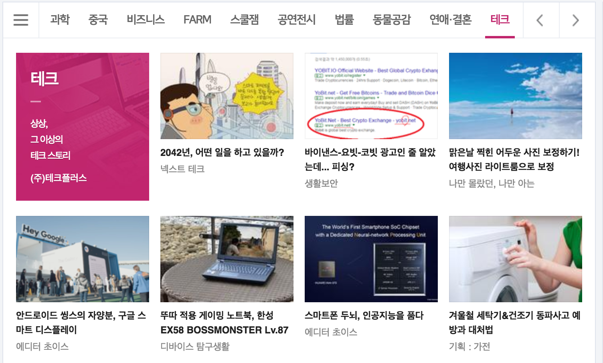

> 부스트 코스 - 웹 프로그래밍(풀스택) 강의를 학습, 정리한 내용입니다. (https://www.boostcourse.org/web316/joinLectures/12943)

# Tab UI 실습 - FrontEnd
# 목차

- [Tab UI 실습 - FrontEnd](#tab-ui-실습---frontend)
- [목차](#목차)
- [1) Tab UI를 만들기 위한 HTML과 CSS 구조전략](#1-tab-ui를-만들기-위한-html과-css-구조전략)
  - [우리가 자주 보는 Tab UI 형태](#우리가-자주-보는-tab-ui-형태)
    - [실습](#실습)
      - [스크린샷 Tab UI 분석](#스크린샷-tab-ui-분석)
      - [실습 구조 정의](#실습-구조-정의)
  - [생각해보기](#생각해보기)
- [2) Tab UI에 생명 불어넣기](#2-tab-ui에-생명-불어넣기)
  - [기능 정의](#기능-정의)
  - [실습 코드](#실습-코드)
    - [참고사항](#참고사항)
  - [생각해보기](#생각해보기-1)

<small><i><a href='http://ecotrust-canada.github.io/markdown-toc/'>Table of contents generated with markdown-toc</a></i></small>


# 1) Tab UI를 만들기 위한 HTML과 CSS 구조전략
Tab은 많은 컨텐츠를 효과적으로 보여줄 수 있기 때문에 자주 사용되는 UI이다.

Tab UI와 같은 것들을 컴포넌트라고도 한다.

* 컴포넌트 (캘린더 UI, 검은색 창, 페이징 네비게이션 아래 버튼)

Tab UI의 구조와 스타일을 결정할 수 있어야 한다. (HTML, CSS, JS로 동적제어)

## 우리가 자주 보는 Tab UI 형태
상단 메뉴를 누를 때마다, 새로 고침 없이 아래 내용이 변경되는 경우가 있을 수 있다.



### 실습
#### 스크린샷 Tab UI 분석
* 상단에 여러 가지 메뉴들
* 상단메뉴를 클릭하면 하단의 내용이 바뀐다.
* 하단의 내용과 형태는 달라질 수 있다.(그림이 없고 텍스트만 있다거나 크기나 배치구조가 다르게 만들 수 있다.)

#### 실습 구조 정의
탭을 4개 정도 만들고 위의 메뉴는 나열하고 하단은 HTML하나를 같이 공유하는 방식으로 실습.

```html
<html>
  <header>
    <style>
      h2 {
        text-align: center;
        margin: 0px;
      }
      .tab {
        width: 600px;
        margin: 0px auto;
      }
      .tabmenu {
        background-color: disque;
      }
      .tabmenu > div {
        display: inline-block;
        width: 140px;
        margin: 0px;
        text-align: center;
        height: 50px;
        line-height: 50px;
      }
      .content {
        background-color: antiquewhite;
        padding: 5%;
      }
    </style>
  </header>
  <body>
    <h2>TAB UI TEST</h2>
    <div class="tab">
      <div class="tabmenu">
        <div>crong</div>
        <div>jk</div>
        <div>pobi</div>
        <div>honux</div>
      </div>
      <section class="content">
        <h4>hello jk</h4>
        <p>Lorem ipsum dolor sit amet, consectetur adipisicing elit.</p>
      </section>
    </div>
  </body>
</html>
```
* tab UI를 tabmenu라는 class로, 하단콘텐츠를 content라는 class로 나눠 만들었다.
* tab메뉴의 가로폭을 px로 조정했지만, float와 같은 속성을 사용하는 것이 더 좋다. 

## 생각해보기
* 여러 가지 Tab UI로 동작하는 웹사이트를 찾아보고, 그 구현방법 상상해보자.  
* Tab UI에 필요한 간단한 HTML, CSS를 구현해보자.  
* 그리고 나서 인터랙션(동작)을 모두 정의해보자.  
* 그렇게 동작하기 위한 JavaScript의 순서가 어떨지 고민해보자.   


# 2) Tab UI에 생명 불어넣기
동적인 코드를 간단하게 실습(event, ajax)
* tabUI, 즉 tabmenu class 요소를 클릭했을 때 ajax를 가져와서 어떤 탬플릿과 조합하여 content class 요소의 내용을 바꿔준다.

## 기능 정의
Tab UI에 필요한 기능을 정리.

실제로 개발할 때는 모든 요구사항이 포함된 기획서(또는 UX상세설계서)가 있고 이를 보면서 구현해내야 한다. 

간단한 요구사항 리스트만 나열.

* Tab 메뉴를 누르면 Ajax를 통해서 데이터를 가져온 후, 그 내용이 화면에 노출된다.
* 다른 Tab 메뉴를 누르면 역시 동일하게 Ajax를 통해서 데이터를 가져온 후 그 내용이 화면에 노출된다.
* 화면에 노출하기 위해서는 HTML 코드를 가져오고, 서버에서 받은 데이터를 HTML Templating 작업을 해야 한다.
* 화면에 추가하기 위해서 DOM API를 사용.

## 실습 코드
```html
<html>
<header>
    <link rel="stylesheet" href="tabui.css">
    <style>
    h2 {
    text-align: center
}
h2,
h4 {
    margin: 0px;
}
.tab {
    width: 600px;
    margin: 0px auto;
}
.tabmenu {
    background-color: bisque;
}
.tabmenu>div {
    display: inline-block;
    width: 146px;
    height: 50px;
    line-height: 50px;
    text-align: center;
    cursor: pointer;
}
.content {
    padding: 5%;
    background-color: antiquewhite;
}
</style>
</header>

<body>
    <h2> TAB UI TEST</h2>

    <div class="tab">
        <div class="tabmenu">
            <div>crong</div>
            <div>jk</div>
            <div>pobi</div>
            <div>honux</div>
        </div>
        <section class="content">
            <h4>hello jk</h4>
            <p>golf, facebook</p>
        </section>
    </div>
    <script>
        function makeTemplate(data, clickedName) {
            var html = document.getElementById("tabcontent").innerHTML;
            var resultHTML = "";
            for (var i = 0; i < data.length; i++) {
                if (data[i].name === clickedName) {
                    resultHTML = html.replace("{name}", data[i].name)
                        .replace("{favorites}", data[i].favorites.join(" "));
                    break;
                }
            }
            document.querySelector(".content").innerHTML = resultHTML;
        }
        function sendAjax(url, clickedName) {
            var oReq = new XMLHttpRequest();
            oReq.addEventListener("load", function () {
                var data = JSON.parse(oReq.responseText);
                makeTemplate(data, clickedName);
            });
            oReq.open("GET", url);
            oReq.send();
        }
        var tabmenu = document.querySelector(".tabmenu");
        tabmenu.addEventListener("click", function (evt) {
            sendAjax("./json.txt", evt.target.innerText);
        });
    </script>

    <script id="tabcontent" type="my-template">
            <h4>hello {name}</h4>
            <p>{favorites}</p>
       </script>
</body>

</html>
```
>[코드 바로가기](https://gist.github.com/crongro/291c5555b63a0afa41960e09d0173e06)

* click 했을 때 sendAjax에 넘겨줘서 콜백을 인자로 받을 수 있고 makeTemplate에다 data와 clickedName을 넘겨줘서 어느 지점이 클릭됐는지 알려줬다. 
* 그러면 화면에 있는 html코드를 가져와 루프를 돌면서 일치하는 정보가 있으면 break point를 걸 때까지 찾았으면 replace를 하고 그 다음에 결과를 본문에 넣어준다.

### 참고사항
* type="my-template"가 기술적으로 문제를 일으키지는 않는다.  
* 하지만 script 태그의 type은 MIME 타입으로 지정되도록 규정되어 있다.  
* 따라서 "text/x-my-template" 등의 올바른 MIME Type 포맷으로 써주시는 게 좋다.  
> [참고] script tag: *(https://developer.mozilla.org/ko/docs/Web/HTML/Element/script)*

## 생각해보기
* 같은 Tab 메뉴를 다시 누를 때 또 Ajax 통신을 해야 할까?
  * 할 필요가 없으므로 예외 상황을 코드로 작성하여 재통신하지 않게 하는게 좋다.
* 이미 가져온 데이터를 보관하고 재사용하는 건 어떨까? 
  * 캐시 (배열이나 집합에 불러온 데이터 저장 후 재사용)