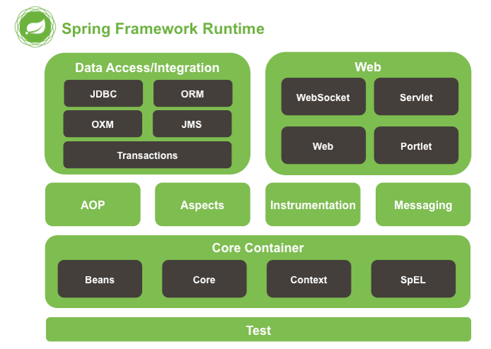

> 부스트 코스 - 웹 프로그래밍(풀스택) 강의를 학습, 정리한 내용입니다. (https://www.boostcourse.org/web316/joinLectures/12943)

# Tab UI 실습 - FrontEnd
# 목차

- [Tab UI 실습 - FrontEnd](#tab-ui-실습---frontend)
- [목차](#목차)
- [1) Spring이란?](#1-spring이란)
  - [핵심 개념](#핵심-개념)
  - [Framework](#framework)
  - [Spring Framework란?](#spring-framework란)
  - [프레임 워크 모듈](#프레임-워크-모듈)
  - [AOP 와 인스트루멘테이션 (Instrumentation)](#aop-와-인스트루멘테이션-instrumentation)
  - [메시징(Messaging)](#메시징messaging)
  - [데이터 엑서스(Data Access) / 통합(Integration)](#데이터-엑서스data-access--통합integration)
  - [웹(Web)](#웹web)
  - [생각해보기](#생각해보기)
  - [참고 자료](#참고-자료)
- [2) Spring IoC/DI 컨테이너](#2-spring-iocdi-컨테이너)
  - [핵심 개념](#핵심-개념-1)
  - [컨테이너(Container)](#컨테이너container)
    - [예시](#예시)
  - [IoC(Inversion of Control)](#iocinversion-of-control)
    - [예시](#예시-1)
  - [DI(Dependency Injection)](#didependency-injection)
  - [DI가 적용 안 된 예](#di가-적용-안-된-예)
  - [Spring에서 DI가 적용된 예](#spring에서-di가-적용된-예)
  - [Spring에서 제공하는 IoC/DI 컨테이너](#spring에서-제공하는-iocdi-컨테이너)
  - [생각해보기](#생각해보기-1)
  - [참고 자료](#참고-자료-1)
- [3) xml파일을 이용한 설정](#3-xml파일을-이용한-설정)
  - [핵심 개념](#핵심-개념-2)
  - [Maven으로 Java프로젝트 만들기](#maven으로-java프로젝트-만들기)
  - [실습코드](#실습코드)
    - [App.java](#appjava)
    - [AppTest.java](#apptestjava)
  - [Bean class란?](#bean-class란)
  - [실습코드](#실습코드-1)
    - [UserBean.java](#userbeanjava)
  - [Spring Bean Factory를 이용하여 Bean객체 이용하기](#spring-bean-factory를-이용하여-bean객체-이용하기)
  - [실습코드](#실습코드-2)
    - [applicationContext.xml](#applicationcontextxml)
  - [ApplicationContext를 이용해서 설정파일을 읽어들여 실행하기](#applicationcontext를-이용해서-설정파일을-읽어들여-실행하기)
    - [ApplicationContextExam01](#applicationcontextexam01)
  - [DI 확인하기](#di-확인하기)
  - [실습코드](#실습코드-3)
    - [Engine.java](#enginejava)
    - [Car.java](#carjava)
    - [package kr.or.connect.diexam01;](#package-krorconnectdiexam01)
  - [생각해보기](#생각해보기-2)
  - [참고 자료](#참고-자료-2)
- [4) Java Config를 이용한 설정](#4-java-config를-이용한-설정)
  - [핵심 개념](#핵심-개념-3)
  - [Java config를 이용한 설정을 위한 어노테이션](#java-config를-이용한-설정을-위한-어노테이션)
  - [Java Config를 이용해 설정하기](#java-config를-이용해-설정하기)
    - [ApplicationConfig.java](#applicationconfigjava)
    - [ApplicationContextExam03.java](#applicationcontextexam03java)
    - [ApplicationConfig2.java](#applicationconfig2java)
    - [Engine.java](#enginejava-1)
    - [Car.java](#carjava-1)
    - [ApplicationContextExam04.java](#applicationcontextexam04java)
  - [생각해보기](#생각해보기-3)
  - [참고 자료](#참고-자료-3)

<small><i><a href='http://ecotrust-canada.github.io/markdown-toc/'>Table of contents generated with markdown-toc</a></i></small>


# 1) Spring이란?
이번 시간엔 Spring Framework가 무엇인지, 그리고 Spring Framework를 구성하고 있는 모듈에는 어떠한 것들이 있는지 알아보자.

## 핵심 개념
* Spring Framework
* Spring Framework modules

## Framework
어느 정도 이미 잘 만들어져 있는 반제품을 이용해서 원하는 특정한 제품을 만드는 것.

## Spring Framework란?
* 엔터프라이즈급 어플리케이션을 구축할 수 있는 가벼운 솔루션이자, 원스-스탑-숍(One-Stop-Shop, 모든 것을 한번에 해결하는 상점)  
* 원하는 부분만 가져다 사용할 수 있도록 모듈화가 잘 되어 있다.(레고 블록 처럼 원하는 부분만 사용해 원하는 솔루션을 만든다.)
* IoC 컨테이너이다.
* 선언적으로 트랜잭션을 관리할 수 있다.
* 완전한 기능을 갖춘 MVC Framework를 제공한다.
* AOP 지원한다.
* 스프링은 도메인 논리 코드와 쉽게 분리될 수 있는 구조로 되어 있다.

## 프레임 워크 모듈

* 스프링 프레임워크는 약 20개의 모듈로 구성되어 있다.
* 필요한 모듈만 가져다 사용할 수 있다.

## AOP 와 인스트루멘테이션 (Instrumentation)

* spring-AOP : AOP 얼라이언스(Alliance)와 호환되는 방법으로 AOP를 지원한다.
* spring-aspects : AspectJ와의 통합을 제공한다.
* spring-instrument : 인스트루멘테이션을 지원하는 클래스와 특정 WAS에서 사용하는 클래스로 더 구현체를 제공한다. 참고로 BCI(Byte Code Instrumentations)은 런타임이나 로드(Load) 때 클래스의 바이트 코드에 변경을 가하는 방법을 말한다.
 
## 메시징(Messaging)
* spring-messaging : 스프링 프레임워크 4는 메시지 기반 어플리케이션을 작성할 수 있는 Message, MessageChannel, MessageHandler 등을 제공. 또한, 해당 모듈에는 메소드에 메시지를 맵핑하기 위한 어노테이션도 포함되어 있으며, Spring MVC 어노테이션과 유사하다.
 
## 데이터 엑서스(Data Access) / 통합(Integration)
* 데이터 엑세스/통합 계층은 JDBC, ORM, OXM, JMS 및 트랜잭션 모듈로 구성되어 있다.
* ***spring-jdbc*** : 자바 JDBC프로그래밍을 쉽게 할 수 있도록 기능을 제공합니다.
* ***spring-tx*** : 선언적 트랜잭션 관리를 할 수 있는 기능을 제공합니다.
* spring-orm : JPA, JDO및 Hibernate를 포함한 ORM API를 위한 통합 레이어를 제공합니다.
* spring-oxm : JAXB, Castor, XMLBeans, JiBX 및 XStream과 같은 Object/XML 맵핑을 지원합니다.
* spring-jms : 메시지 생성(producing) 및 사용(consuming)을 위한 기능을 제공, Spring Framework 4.1부터 spring-messaging모듈과의 통합을 제공합니다.
 
## 웹(Web)
* 웹 계층은 spring-web, spring-webmvc, spring-websocket, spring-webmvc-portlet 모듈로 구성됩니다.
* ***spring-web*** : 멀티 파트 파일 업로드, 서블릿 리스너 등 웹 지향 통합 기능을 제공한다. HTTP클라이언트와 Spring의 원격 지원을 위한 웹 관련 부분을 제공합니다.
* ***spring-webmvc*** : Web-Servlet 모듈이라고도 불리며, Spring MVC 및 REST 웹 서비스 구현을 포함합니다.
* spring-websocket : 웹 소켓을 지원합니다.
* spring-webmvc-portlet : 포틀릿 환경에서 사용할 MVC 구현을 제공합니다.
 
## 생각해보기
스프링은 프레임워크라고 합니다. 프레임워크와 라이브러리는 어떤 차이가 있을까요? 조사해보세요.
* 라이브러리는 그냥 함수들이나 기능 모음을 가져다가 쓰는 것이고. 프레임워크는 특정 디자인 패턴이나, 전처리 후처리에 필요한 동작과 기능들을 수행하기 위해서 프레임워크가 실행되다가 중간 중간에 특정 비지니스나, 특정 구현 단에서만 사용자의 코드를 lookup(검색)하여 사용하는 형태
* 라이브러리는 톱, 망치, 삽같은 연장, 프레임워크는 차, 비행기, 배같은 탈 것. 사람은 도구를 선택하는 입장이기 때문에, 어떤 도구를 사용하든 원하는 것을 만들어낼 수 만 있으면 됩니다. 반면에, 탈것은 정해진 곳으로만 다녀야 합니다. 

> 출처: https://webclub.tistory.com/458 [Web Club]
 
## 참고 자료
> [참고링크] Spring Framework Reference Documentation
(https://docs.spring.io/spring-framework/docs/4.3.14.RELEASE/spring-framework-reference/htmlsingle/#overview)

> [참고링크] Java BCI(Byte Code Instrumentation) 간단 예제와 설명
(https://deidesheim.tistory.com/entry/%EC%9E%90%EB%B0%94-BCIByte-Code-Instrumentation-%EA%B0%84%EB%8B%A8-%EC%98%88%EC%A0%9C%EC%99%80-%EC%84%A4%EB%AA%85)


# 2) Spring IoC/DI 컨테이너
스프링 프레임워크의 핵심 개념 중의 하나인 IoC와 DI

## 핵심 개념
* Container
* IoC (Inversion of Control)
* DI (Dependency Injection)

## 컨테이너(Container)
* **컨테이너는 인스턴스의 생명주기를 관리**
* 생성된 인스턴스에게 추가적인 기능을 제공

### 예시
<details>
    <summary>접기/펼치기</summary>
    <div markdown="1">
    
* 예를 들어, Servlet을 실행해주는 *WAS는 Servlet 컨테이너를 가지고 있다*고 말한다.
* WAS는 웹 브라우저로부터 서블릿 URL에 해당하는 요청을 받으면, 서블릿을 메모리에 올린 후 실행한다.
* 개발자가 서블릿 클래스를 작성했지만, 실제로 메모리에 올리고 실행하는 것은 WAS가 가지고 있는 Servlet 컨테이너다.
* Servlet컨테이너는 동일한 서블릿에 해당하는 요청을 받으면, 또 메모리에 올리지 않고 기존에 메모리에 올라간 서블릿을 실행하여 그 결과를 웹 브라우저에게 전달한다.
    </details>

## IoC(Inversion of Control) 
* inversion : 도치, 역전
* 컨테이너가 코드 대신 오브젝트의 제어권을 갖고 있어 IoC(제어의 역전)이라 한다.

### 예시
<details>
    <summary>접기/펼치기</summary>
    <div markdown="1">
    
예를 들어, 서블릿 클래스는 개발자가 만들지만, 그 서블릿의 메소드를 알맞게 호출하는 것은 WAS다.
    </details>


이렇게 개발자가 만든 어떤 클래스나 메소드를 다른 프로그램이 대신 실행해주는 것을 제어의 역전이라고 한다.

## DI(Dependency Injection)
DI는 의존성 주입이란 뜻을 가지고 있으며, 클래스 사이의 의존 관계를 빈(Bean) 설정 정보를 바탕으로 컨테이너가 자동으로 연결해주는 것을 말한다.

## DI가 적용 안 된 예
개발자가 직접 인스턴스를 생성한다.


```
class 엔진 {

}

class 자동차 {
     엔진 v5 = new 엔진();
}
```
## Spring에서 DI가 적용된 예
엔진 type의 v5변수에 아직 인스턴스가 할당되지 않았다.

컨테이너가 v5변수에 인스턴스를 할당해주게 된다.
```
@Component
class 엔진 {

}

@Component
class 자동차 {
     @Autowired
     엔진 v5;
}
```


## Spring에서 제공하는 IoC/DI 컨테이너
* BeanFactory : IoC/DI에 대한 기본 기능을 가지고 있다.
* ApplicationContext : BeanFactory의 모든 기능을 포함하며, 일반적으로 BeanFactory보다 추천된다. 트랜잭션처리, AOP등에 대한 처리를 할 수 있다. BeanPostProcessor, BeanFactoryPostProcessor등을 자동으로 등록하고, 국제화 처리, 어플리케이션 이벤트 등을 처리할 수 있다.
* BeanPostProcessor : 컨테이너의 기본로직을 오버라이딩하여 인스턴스화 와 의존성 처리 로직 등을 개발자가 원하는 대로 구현 할 수 있도록 한다.
* BeanFactoryPostProcessor : 설정된 메타 데이터를 커스터마이징 할 수 있다.

## 생각해보기
스프링 프레임워크는 DI Container라고도 말을 합니다. 스프링 프레임워크 이외에도 DI Container는 존재할까?
 
## 참고 자료
> [참고링크] Spring - IoC & DI
https://isstory83.tistory.com/91
 
> [참고링크] 세 가지 DI 컨테이너로 향하는 저녁 산책
https://www.nextree.co.kr/p11247/


# 3) xml파일을 이용한 설정
Spring의 IoC / DI 컨테이너에 대한 동작을 확인하기 위해 Maven을 이용해 프로젝트를 생성한 후, XML 형식의 설정 파일을 만들어 IoC와 DI가 잘 동작하는지 확인해 본다.

## 핵심 개념
* Bean
* ApplicationContext
* DI

## Maven으로 Java프로젝트 만들기
pom.xml 파일에 JDK를 사용하기 위한 플러그인 설정을 추가.
```xml
<project xmlns="http://maven.apache.org/POM/4.0.0" xmlns:xsi="http://www.w3.org/2001/XMLSchema-instance"
  xsi:schemaLocation="http://maven.apache.org/POM/4.0.0 http://maven.apache.org/xsd/maven-4.0.0.xsd">
  <modelVersion>4.0.0</modelVersion>

  <groupId>kr.or.connect</groupId>
  <artifactId>diexam01</artifactId>
  <version>0.0.1-SNAPSHOT</version>
  <packaging>jar</packaging>

  <name>diexam01</name>
  <url>http://maven.apache.org</url>

  <properties>
    <project.build.sourceEncoding>UTF-8</project.build.sourceEncoding>
  </properties>

  <dependencies>
    <dependency>
      <groupId>junit</groupId>
      <artifactId>junit</artifactId>
      <version>3.8.1</version>
      <scope>test</scope>
    </dependency>
  </dependencies>
  
-------------------------------------추가----------------------------------------------------
  <build>
     <plugins>
        <plugin>
            <groupId>org.apache.maven.plugins</groupId>
            <artifactId>maven-compiler-plugin</artifactId>
            <version>3.6.1</version>
            <configuration>
                <source>1.8</source>
                <target>1.8</target>
            </configuration>
        </plugin>
    </plugins>
  </build>
----------------------------------------------------------------------------------------------

</project>
```

프로젝트를 선택하고, Maven -> Update Project를 선택.

위와 같은 창이 뜨면 OK버튼을 클릭.


## 실습코드

### App.java
```java
package kr.or.connect.diexam01;

/**
 * Hello world!
 *
 */
public class App 
{
    public static void main( String[] args )
    {
        System.out.println( "Hello World!" );
    }
}
``` 

### AppTest.java
```java
package kr.or.connect.diexam01;

import junit.framework.Test;
import junit.framework.TestCase;
import junit.framework.TestSuite;

/**
 * Unit test for simple App.
 */
public class AppTest 
    extends TestCase
{
    /**
     * Create the test case
     *
     * @param testName name of the test case
     */
    public AppTest( String testName )
    {
        super( testName );
    }

    /**
     * @return the suite of tests being tested
     */
    public static Test suite()
    {
        return new TestSuite( AppTest.class );
    }

    /**
     * Rigourous Test :-)
     */
    public void testApp()
    {
        assertTrue( true );
    }
}
```
AppTest.java 를 선택한 후 우측버튼을 클릭하고 Run As -> JUnit Test 메뉴를 선택.

하단의 JUnit 뷰에 하나의 테스트가 성공했다는 메시지와 함께 녹색 막대가 보여진다.

## Bean class란?
예전에는 Visual 한 컴포넌트를 Bean이라고 불렀지만, 근래 들어서는 일반적인 Java클래스를 Bean클래스라고 보통 말한다.

Bean클래스의 3가지 특징은 다음과 같다.

* 기본생성자를 가지고 있습니다.
* 필드는 private하게 선언합니다.
* getter, setter 메소드를 가집니다.
* getName() setName() 메소드를 name 프로퍼티(property)라고 합니다. (용어 중요)

## 실습코드

### UserBean.java
```java
package kr.or.connect.diexam01;

//빈클래스
public class UserBean {
	
	//필드는 private한다.
	private String name;
	private int age;
	private boolean male;
	
	//기본생성자를 반드시 가지고 있어야 한다.
	public UserBean() {
	}
	
	public UserBean(String name, int age, boolean male) {
		this.name = name;
		this.age = age;
		this.male = male;
	}

	// setter, getter메소드는 프로퍼티라고 한다.
	public void setName(String name) {
		this.name = name;
	}

	public String getName() {
		return name;
	}

	public int getAge() {
		return age;
	}

	public void setAge(int age) {
		this.age = age;
	}

	public boolean isMale() {
		return male;
	}

	public void setMale(boolean male) {
		this.male = male;
	}

}
```

## Spring Bean Factory를 이용하여 Bean객체 이용하기

1. pom.xml 파일을 다음과 같이 수정한다.
```xml
<project xmlns="http://maven.apache.org/POM/4.0.0" xmlns:xsi="http://www.w3.org/2001/XMLSchema-instance"
  xsi:schemaLocation="http://maven.apache.org/POM/4.0.0 http://maven.apache.org/xsd/maven-4.0.0.xsd">
  <modelVersion>4.0.0</modelVersion>

  <groupId>kr.or.connect</groupId>
  <artifactId>diexam01</artifactId>
  <version>0.0.1-SNAPSHOT</version>
  <packaging>jar</packaging>

  <name>diexam01</name>
  <url>http://maven.apache.org</url>

  <properties>
    <project.build.sourceEncoding>UTF-8</project.build.sourceEncoding>
    <spring.version> 4.3.14.RELEASE</spring.version>
  </properties>

  <dependencies>
	<!-- Spring -->
	<dependency>
		<groupId>org.springframework</groupId>
		<artifactId>spring-context</artifactId>
		<version>${spring.version}</version>
	</dependency>
  
  
    <dependency>
      <groupId>junit</groupId>
      <artifactId>junit</artifactId>
      <version>3.8.1</version>
      <scope>test</scope>
    </dependency>
  </dependencies>
  
  <build>
     <plugins>
        <plugin>
            <groupId>org.apache.maven.plugins</groupId>
            <artifactId>maven-compiler-plugin</artifactId>
            <version>3.6.1</version>
            <configuration>
                <source>1.8</source>
                <target>1.8</target>
            </configuration>
        </plugin>
    </plugins>
  </build>
</project>
```
2. 추가된 라이브러리 확인.


3. resources 소스 폴더를 생성.


* 프로젝트를 선택하고, 오른쪽 버튼을 클릭한 후 New -> Folder를 선택.

* src/main 폴더를 선택한 후 forder name에 resources라고 Finish버튼을 클릭.

* 해당 폴더를 선택하고, 우측버튼을 클릭하여 New – File을 선택합니다. src/main/resources 폴더를 선택한 후 File name에 applicationContext.xml 을 입력하고 Finish버튼을 클릭.

* 위와 같이 생성되었으면 더블클릭하여 파일을 연다.

4. resources 소스 폴더에 xml 파일을 작성.

## 실습코드 
### applicationContext.xml
```xml
<?xml version="1.0" encoding="UTF-8"?>
<beans xmlns="http://www.springframework.org/schema/beans"
	xmlns:xsi="http://www.w3.org/2001/XMLSchema-instance"
	xsi:schemaLocation="http://www.springframework.org/schema/beans http://www.springframework.org/schema/beans/spring-beans.xsd">

	<bean id="userBean" class="kr.or.connect.diexam01.UserBean"></bean>

</beans>
```
bean 태그를 하나 입력했는데, 위의 태그는 다음과 같은 의미를 가진다.

UserBean userBean - new UserBean();

## ApplicationContext를 이용해서 설정파일을 읽어들여 실행하기
### ApplicationContextExam01
```java
package kr.or.connect.diexam01;

import org.springframework.context.ApplicationContext;
import org.springframework.context.support.ClassPathXmlApplicationContext;

public class ApplicationContextExam01 {

	public static void main(String[] args) {
		ApplicationContext ac = new ClassPathXmlApplicationContext( 
				"classpath:applicationContext.xml"); 
		System.out.println("초기화 완료.");
		
		UserBean userBean = (UserBean)ac.getBean("userBean");
		userBean.setName("kim");
		System.out.println(userBean.getName());
		
		UserBean userBean2 = (UserBean)ac.getBean("userBean");
		if(userBean == userBean2) {
			System.out.println("같은 인스턴스이다.");
		}
		
	}
}
```

## DI 확인하기
이번에는 DI 즉 의존성 주입을 확인.

Car와 Engine이라는 클래스 2개를 생성.

## 실습코드
### Engine.java
```java
package kr.or.connect.diexam01;

public class Engine {
	public Engine() {
		System.out.println("Engine 생성자");
	}
	
	public void exec() {
		System.out.println("엔진이 동작합니다.");
	}
}
``` 

### Car.java
```java
package kr.or.connect.diexam01;

public class Car {
	Engine v8;
	
	public Car() {
		System.out.println("Car 생성자");
	}
	
	public void setEngine(Engine e) {
		this.v8 = e;
	}
	
	public void run() {
		System.out.println("엔진을 이용하여 달립니다.");
		v8.exec();
	}
}
```
위의 Car 클래스가 제대로 동작하도록 하려면 보통 다음과 같은 코드가 작성되야 한다.
```java
Engine e = new Engine();
Car c = new Car();
c.setEngine( e );
c.run();
```
1, 2 번째 줄을 Spring 컨테이너에게 맡기기 위해 설정파일에 다음과 같은 코드를 입력.
```xml
<bean id="e" class="kr.or.connect.diexam01.Engine"></bean>
<bean id="car" class="kr.or.connect.diexam01.Car">
	<property name="engine" ref="e"></property>
</bean>
```
즉, 위의 XML설정은 다음과 같은 의미를 가진다.
```java
Engine e = new Engine();
Car c = new Car();
c.setEngine( e );
```
이번엔 위의 설정 파일을 읽어들여 실행하는 ApplicationContextExam02.java를 작성.

### package kr.or.connect.diexam01;
```java
import org.springframework.context.ApplicationContext;
import org.springframework.context.support.ClassPathXmlApplicationContext;

public class ApplicationContextExam02 {

	public static void main(String[] args) {
		ApplicationContext ac = new ClassPathXmlApplicationContext( 
				"classpath:applicationContext.xml"); 

		Car car = (Car)ac.getBean("car");
		car.run();
		
	}
}
```
콘솔을 보면 다음과 같이 실행된 것을 알 수 있습니다.

## 생각해보기
Spring컨테이너가 관리하는 객체를 빈(Bean)이라고 말합니다. (여러분들이 직접 new연산자로 생성해서 사용하는 객체는 빈(Bean)이라고 말하지 않습니다.) Spring은 빈을 생성할 때 기본적으로 싱글톤(Singleton)객체로 생성합니다. 싱글톤이란 메모리에 하나만 생성한다는 것입니다. 메모리에 하나만 생성되었을 경우, 해당 객체를 동시에 이용한다면 어떤 문제가 발생할 수 있을까요? 이런 문제를 해결하려면 어떻게 해야할까요?   ( 참고로 Spring에서 빈을 생성할 때 스코프(scope)를 줄 수 있습니다. 스코프를 줌으로써 기본으로 설정된 싱글톤 외에도 다른 방법으로 객체를 생성할 수 있습니다. )

## 참고 자료
> [참고링크 ]Appendix C.XML Schema-based configuration
https://docs.spring.io/spring-framework/docs/3.0.x/spring-framework-reference/html/xsd-config.html


# 4) Java Config를 이용한 설정
Java Config와 어노테이션을 이용해 스프링에서 사용하는 빈을 정의하고 DI하는 방법에 대해 알아보자.

## 핵심 개념
* AnnotationConfigApplicationContext
* @Configuration
* @ComponentScan
* @Component
* @Autowired
 
## Java config를 이용한 설정을 위한 어노테이션
@Configuration
* 스프링 설정 클래스를 선언하는 어노테이션
  
@Bean
* bean을 정의하는 어노테이션

@ComponentScan
* @Controller, @Service, @Repository, @Component 어노테이션이 붙은 클래스를 찾아 컨테이너에 등록

@Component
* 컴포넌트 스캔의 대상이 되는 애노테이션 중 하나로써 주로 유틸, 기타 지원 클래스에 붙이는 어노테이션

@Autowired
* 주입 대상이되는 bean을 컨테이너에 찾아 주입하는 어노테이션
## Java Config를 이용해 설정하기

### ApplicationConfig.java
```java
package kr.or.connect.diexam01;
import org.springframework.context.annotation.*;

@Configuration
public class ApplicationConfig {
	@Bean
	public Car car(Engine e) {
		Car c = new Car();
		c.setEngine(e);
		return c;
	}
	
	@Bean
	public Engine engine() {
		return new Engine();
	}
}
```
@Configuration 은 스프링 설정 클래스라는 의미를 가집니다.

JavaConfig로 설정을 할 클래스 위에는 @Configuration가 붙어 있어야 합니다.

ApplicationContext중에서 AnnotationConfigApplicationContext는 JavaConfig클래스를 읽어들여 IoC와 DI를 적용하게 됩니다.

이때 설정파일 중에 @Bean이 붙어 있는 메소드들을 AnnotationConfigApplicationContext는 자동으로 실행하여 그 결과로 리턴하는 객체들을 기본적으로 싱글턴으로 관리를 하게 됩니다.


### ApplicationContextExam03.java
```java
package kr.or.connect.diexam01;

import org.springframework.context.ApplicationContext;
import org.springframework.context.annotation.AnnotationConfigApplicationContext;

public class ApplicationContextExam03 {

	public static void main(String[] args) {
		ApplicationContext ac = new AnnotationConfigApplicationContext(ApplicationConfig.class);
		   
		Car car = (Car)ac.getBean("car");
		car.run();
		
	}
}
```
파라미터로 요청하는 class 타입으로 지정 가능합니다.

Car car = ac.getBean(Car.class);


### ApplicationConfig2.java
```java
package kr.or.connect.diexam01;
import org.springframework.context.annotation.*;

@Configuration
@ComponentScan("kr.or.connect.diexam01")
public class ApplicationConfig2 {
}
```
기존 JavaConfig에서 빈을 생성하는 메소드를 모두 제거했습니다.

단, @Configuration아래에 @ComponentScan이라는 어노테이션을 추가했습니다.

@ComponentScan어노테이션은 파라미터로 들어온 패키지 이하에서 @Controller, @Service, @Repository, @Component 어노테이션이 붙어 있는 클래스를 찾아 메모리에 몽땅 올려줍니다.

기존의 Car클래스와 Engine클래스 위에 @Component를 붙이도록 하겠습니다.

 

### Engine.java
```java
package kr.or.connect.diexam01;

import org.springframework.stereotype.Component;

@Component
public class Engine {
	public Engine() {
		System.out.println("Engine 생성자");
	}
	
	public void exec() {
		System.out.println("엔진이 동작합니다.");
	}
}
```

### Car.java
```java
package kr.or.connect.diexam01;

import org.springframework.beans.factory.annotation.Autowired;
import org.springframework.stereotype.Component;

@Component
public class Car {
	@Autowired
	private Engine v8;
	
	public Car() {
		System.out.println("Car 생성자");
	}
	
	public void run() {
		System.out.println("엔진을 이용하여 달립니다.");
		v8.exec();
	}
}
```
수정된 JavaConfig를 읽어들이여 실행하는 클래스를 보도록 하겠습니다.

 

### ApplicationContextExam04.java
```java
package kr.or.connect.diexam01;

import org.springframework.context.ApplicationContext;
import org.springframework.context.annotation.AnnotationConfigApplicationContext;

public class ApplicationContextExam04 {

	public static void main(String[] args) {
		ApplicationContext ac = new AnnotationConfigApplicationContext(ApplicationConfig2.class);
		   
		Car car = ac.getBean(Car.class);
		car.run();
		
	}
}
```
Spring에서 사용하기에 알맞게 @Controller, @Service, @Repository, @Component 어노테이션이 붙어 있는 객체들은 ComponentScan을 이용해서 읽어들여 메모리에 올리고 DI를 주입하도록 하고, 이러한 어노테이션이 붙어 있지 않은 객체는 @Bean어노테이션을 이용하여 직접 생성해주는 방식으로 클래스들을 관리하면 편리합니다.

## 생각해보기
* 다루는 빈(Bean)이 많아질수록 xml로 설정하는 것과 @ComponentScan, @Component, @Autowired를 이용하는 것 중 어떤 것이 유지보수에 좋을까?
* @AutoWired 는 Field, Constructor, Setter Method 에 사용할 수 있다. 각각의 방식에 장단점?

## 참고 자료
> [참고링크] Spring JavaConfig Reference Guide
https://docs.spring.io

> [참고링크] Field Dependency Injection Considered Harmful
http://vojtechruzicka.com