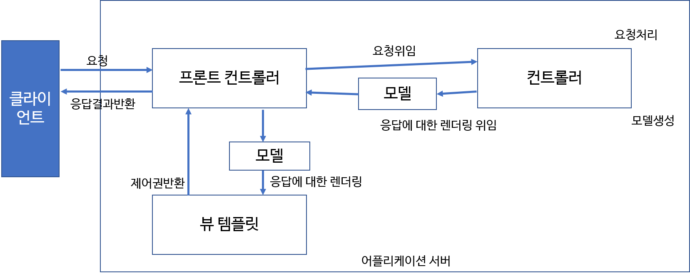
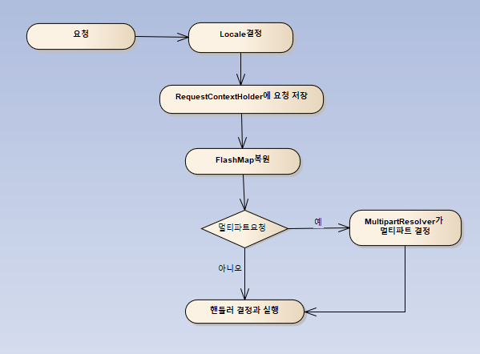
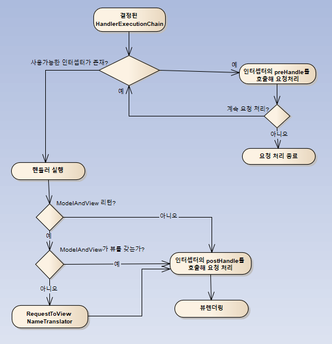

> 부스트 코스 - 웹 프로그래밍(풀스택) 강의를 학습, 정리한 내용입니다. (https://www.boostcourse.org/web316/joinLectures/12943)

# Tab UI 실습 - FrontEnd
# 목차

- [Tab UI 실습 - FrontEnd](#tab-ui-실습---frontend)
- [목차](#목차)
- [1) Spring MVC란?](#1-spring-mvc란)
  - [핵심 개념](#핵심-개념)
  - [MVC란?](#mvc란)
    - [MVC Model 1 아키텍처](#mvc-model-1-아키텍처)
    - [MVC Model 2 아키텍처](#mvc-model-2-아키텍처)
    - [MVC Model2 발전형태](#mvc-model2-발전형태)
    - [Spring Web Module](#spring-web-module)
  - [생각해보기](#생각해보기)
  - [참고 자료](#참고-자료)
- [2) Spring MVC구성요소](#2-spring-mvc구성요소)
  - [학습 목표](#학습-목표)
  - [핵심 개념](#핵심-개념-1)
  - [Spring MVC 기본 동작 흐름](#spring-mvc-기본-동작-흐름)
  - [DispatcherServlet](#dispatcherservlet)
    - [DispatcherServlet 내부 동작흐름](#dispatcherservlet-내부-동작흐름)
  - [요청 선처리 작업시 사용된 컴포넌트](#요청-선처리-작업시-사용된-컴포넌트)
    - [DispatcherServlet 내부 동작흐름 상세 - 요청 선처리 작업](#dispatcherservlet-내부-동작흐름-상세---요청-선처리-작업)
  - [요청 전달시 사용된 컴포넌트](#요청-전달시-사용된-컴포넌트)
    - [DispatcherServlet 내부 동작흐름 상세 - 요청 전달](#dispatcherservlet-내부-동작흐름-상세---요청-전달)
  - [요청 처리시 사용된 컴포넌트](#요청-처리시-사용된-컴포넌트)
    - [DispatcherServlet 내부 동작흐름 상세 - 요청 처리](#dispatcherservlet-내부-동작흐름-상세---요청-처리)
  - [예외 처리시 사용된 컴포넌트](#예외-처리시-사용된-컴포넌트)
  - [뷰 렌더링 과정시 사용된 컴포넌트](#뷰-렌더링-과정시-사용된-컴포넌트)
    - [DispatcherServlet 내부 동작흐름 상세 - 뷰 렌더링 과정](#dispatcherservlet-내부-동작흐름-상세---뷰-렌더링-과정)
    - [DispatcherServlet 내부 동작흐름 상세 - 요청 처리 종료](#dispatcherservlet-내부-동작흐름-상세---요청-처리-종료)
  - [생각해보기](#생각해보기-1)
  - [참고 자료](#참고-자료-1)
- [3) Spring MVC를 이용한 웹 페이지 작성 실습-1](#3-spring-mvc를-이용한-웹-페이지-작성-실습-1)
  - [핵심 개념](#핵심-개념-2)
  - [DispatcherServlet을 FrontController로 설정하기](#dispatcherservlet을-frontcontroller로-설정하기)
  - [web.xml파일에서 DispatcherServlet 설정하기 1/2](#webxml파일에서-dispatcherservlet-설정하기-12)
  - [WebApplicationInitializer를 구현해서 설정하기 1/2](#webapplicationinitializer를-구현해서-설정하기-12)
  - [WebApplicationInitializer를 구현해서 설정하기 2/2](#webapplicationinitializer를-구현해서-설정하기-22)
  - [Spring MVC 설정](#spring-mvc-설정)
  - [@Configuration](#configuration)
  - [@EnableWebMvc](#enablewebmvc)
  - [WebMvcConfigurationSupport](#webmvcconfigurationsupport)
  - [@ComponentScan](#componentscan)
  - [WebMvcConfigurerAdapter](#webmvcconfigureradapter)
  - [Controller(Handler) 클래스 작성하기](#controllerhandler-클래스-작성하기)
  - [@RequestMapping](#requestmapping)
  - [실습 코드](#실습-코드)
  - [Controller작성 실습 1/3](#controller작성-실습-13)
  - [Spring MVC가 지원하는 Controller메소드 인수 타입](#spring-mvc가-지원하는-controller메소드-인수-타입)
  - [Spring MVC가 지원하는 메소드 인수 애노테이션](#spring-mvc가-지원하는-메소드-인수-애노테이션)
  - [@RequestParam](#requestparam)
  - [@PathVariable](#pathvariable)
  - [@RequestHeader](#requestheader)
  - [Spring MVC가 지원하는 메소드 리턴 값](#spring-mvc가-지원하는-메소드-리턴-값)
  - [실습 코드](#실습-코드-1)
  - [Controller작성 실습 2/3](#controller작성-실습-23)
  - [Controller작성 실습 3/3](#controller작성-실습-33)
  - [실습 코드](#실습-코드-2)
  - [생각해보기](#생각해보기-2)
  - [참고 자료](#참고-자료-2)

<small><i><a href='http://ecotrust-canada.github.io/markdown-toc/'>Table of contents generated with markdown-toc</a></i></small>


# 1) Spring MVC란?
Spring 프레임워크에서 웹 어플리케이션 작성을 위해 제공하는 Web MVC모듈

## 핵심 개념
* MVC Model 1
* MVC Model 2
* Spring MVC

## MVC란?
* MVC는 Model-View-Controller의 약자입니다.
* 원래는 제록스 연구소에서 일하던 트뤼그베 린즈커그가 처음으로 소개한 개념으로, 데스트톱 어플리케이션용으로 고안되었습니다.
* Model : 모델은 뷰가 렌더링하는데 필요한 데이터입니다. 예를 들어 사용자가 요청한 상품 목록이나, 주문 내역이 이에 해당합니다.
* View : 웹 애플리케이션에서 뷰(View)는 실제로 보이는 부분이며, 모델을 사용해 렌더링을 합니다. 뷰는 JSP, JSF, PDF, XML등으로 결과를 표현합니다.
* Controller : 컨트롤러는 사용자의 액션에 응답하는 컴포넌트입니다. 컨트롤러는 모델을 업데이트하고, 다른 액션을 수행합니다.


### MVC Model 1 아키텍처


### MVC Model 2 아키텍처


### MVC Model2 발전형태


### Spring Web Module


Model2 MVC 패턴을 지원하는 Spring Module

## 생각해보기
프론트 컨트롤러(Front Controller)는 모든 요청을 받아 들여 공통적인 작업을 처리해준다. 이를 통해 얻을 수 있는 장점엔 어떤 것이 있을 수 있을까?
 
## 참고 자료
> [참고링크] Web MVC framework
https://docs.spring.io/spring-framework/docs/3.2.x/spring-framework-reference/html/mvc.html

> [참고링크] MVC Model2 | Opendocs
https://myblog.opendocs.co.kr/archives/tag/mvc-model2

> [참고링크] Model 1 and Model 2 (MVC) Architecture
https://www.javatpoint.com/model-1-and-model-2-mvc-architecture

> [참고링크] Modules
https://docs.spring.io/spring-framework/docs/3.0.0.M4/reference/html/ch01s02.html

> [참고링크] IBM Knowledge Center
https://www.ibm.com/docs/en/configurepricequote/10.0?topic=file-working-struts-framework-in-web-ui-framework


# 2) Spring MVC구성요소
Spring MVC에서 가장 핵심적인 역할을 수행하는 DispatcherServlet이 어떤 순서로 동작하는지 살펴본다.

또한 이를 통해서 Spring MVC에서 사용되는 컴포넌트들에 대해 알아본다.

## 학습 목표
* DispatcherServlet이 어떤 순서로 동작하는지 이해한다.
* DispatcherServlet에서 사용되는 컴포넌트(객체)들이 어떤 것들이 있는지 안다.
 
## 핵심 개념
* DispatcherServlet
* HandlerMapping
* HandlerAdapter
* ViewResolver

## Spring MVC 기본 동작 흐름


## DispatcherServlet
* 프론트 컨트롤러 (Front Controller)
* 클라이언트의 모든 요청을 받은 후 이를 처리할 핸들러에게 넘기고 핸들러가 처리한 결과를 받아 사용자에게 응답 결과를 보여준다.
* DispathcerServlet은 여러 컴포넌트를 이용해 작업을 처리한다.

### DispatcherServlet 내부 동작흐름
 

## 요청 선처리 작업시 사용된 컴포넌트
* org.springframework.web.servlet.LocaleResolver
  * 지역 정보를 결정해주는 전략 오브젝트이다.
  * 디폴트인 AcceptHeaderLocalResolver는 HTTP 헤더의 정보를 보고 지역정보를 설정해준다.

* org.springframework.web.servlet.FlashMapManager
  * FlashMap객체를 조회(retrieve) & 저장을 위한 인터페이스
  * RedirectAttributes의 addFlashAttribute메소드를 이용해서 저장한다.
  * 리다이렉트 후 조회를 하면 바로 정보는 삭제된다.

* org.springframework.web.context.request.RequestContextHolder
  * 일반 빈에서 HttpServletRequest, HttpServletResponse, HttpSession 등을 사용할 수 있도록 한다.
  * 해당 객체를 일반 빈에서 사용하게 되면, Web에 종속적이 될 수 있다.

* org.springframework.web.multipart.MultipartResolver
  * 멀티파트 파일 업로드를 처리하는 전략

### DispatcherServlet 내부 동작흐름 상세 - 요청 선처리 작업



## 요청 전달시 사용된 컴포넌트
* org.springframework.web.servlet.HandlerMapping
  * HandlerMapping구현체는 어떤 핸들러가 요청을 처리할지에 대한 정보를 알고 있다.
  * 디폴트로 설정되는 있는 핸들러매핑은 BeanNameHandlerMapping과 DefaultAnnotationHandlerMapping 2가지가 설정되어 있다.

* org.springframework.web.servlet.HandlerExecutionChain
  * HandlerExecutionChain구현체는 실제로 호출된 핸들러에 대한 참조를 가지고 있다.
  * 즉, 무엇이 실행되어야 될지 알고 있는 객체라고 말할 수 있으며, 핸들러 실행전과 실행후에 수행될 HandlerInterceptor도 참조하고 있다.

* org.springframework.web.servlet.HandlerAdapter
  * 실제 핸들러를 실행하는 역할을 담당한다.
  * 핸들러 어댑터는 선택된 핸들러를 실행하는 방법과 응답을 ModelAndView로 변화하는 방법에 대해 알고 있다.
  * 디폴트로 설정되어 있는 핸들러어댑터는 HttpRequestHandlerAdapter, SimpleControllerHandlerAdapter, AnnotationMethodHanlderAdapter 3가지이다.
  * @RequestMapping과 @Controller 애노테이션을 통해 정의되는 컨트롤러의 경우 DefaultAnnotationHandlerMapping에 의해 핸들러가 결정되고, 그에 대응되는 AnnotationMethodHandlerAdapter에 의해 호출이 일어난다.

### DispatcherServlet 내부 동작흐름 상세 - 요청 전달


## 요청 처리시 사용된 컴포넌트
* org.springframework.web.servlet.ModelAndView
* ModelAndView는 Controller의 처리 결과를 보여줄 view와 view에서 사용할 값을 전달하는 클래스이다.
* org.springframework.web.servlet.RequestToViewNameTranslator
* 컨트롤러에서 뷰 이름이나 뷰 오브젝트를 제공해주지 않았을 경우 URL과 같은 요청정보를 참고해서 자동으로 뷰 이름을 생성해주는 전략 오브젝트이다. 디폴트는 DefaultRequestToViewNameTranslator이다.
 
### DispatcherServlet 내부 동작흐름 상세 - 요청 처리


## 예외 처리시 사용된 컴포넌트
* org.springframework.web.servlet.handlerexceptionresolver
  * 기본적으로 DispatcherServlet이 DefaultHandlerExceptionResolver를 등록한다.
  * HandlerExceptionResolver는 예외가 던져졌을 때 어떤 핸들러를 실행할 것인지에 대한 정보를 제공한다.

DispatcherServlet 내부 동작흐름 상세 - 예외처리
 

## 뷰 렌더링 과정시 사용된 컴포넌트
* org.springframework.web.servlet.ViewResolver
  * 컨트롤러가 리턴한 뷰 이름을 참고해서 적절한 뷰 오브젝트를 찾아주는 로직을 가진 전략 오프젝트이다.
  * 뷰의 종류에 따라 적절한 뷰 리졸버를 추가로 설정해줄 수 있다.

### DispatcherServlet 내부 동작흐름 상세 - 뷰 렌더링 과정


### DispatcherServlet 내부 동작흐름 상세 - 요청 처리 종료
 

## 생각해보기
* DispatcherServlet은 요청을 받은 후, 요청을 처리하기 위해서 여러가지 작업을 수행하고 있다. 
* 개발자는 DispatcherServlet이 어떤 방식으로 동작하는지 이해한다면 좀 더 잘 Spring MVC를 잘 사용할 수 있다.
* Spring외에 다른 프레임워크를 학습할 때에도, 해당 프레임워크의 동작원리를 이해하는 것은 굉장히 중요.
* 어떻게 하면, 다른 사람이 만든 라이브러리나 프레임워크를 좀 더 잘 이해할 수 있을지 고민.
 
## 참고 자료
> [강의해석블로그] https://tte-yeong.tistory.com/70

> [참고링크] Overview of Spring MVC Architecture
https://terasolunaorg.github.io/guideline/1.0.1.RELEASE/en/Overview/SpringMVCOverview.html

> [참고링크] Modules
https://docs.spring.io/spring-framework/docs/3.0.0.M4/reference/html/ch01s02.html

> [참고링크] Spring MVC - DispatcherServlet 동작 원리 출처: http://jess-m.tistory.com/15 [Jess's Home]
https://jess-m.tistory.com/15

> [참고링크] Spring MVC – Full java based config
https://samerabdelkafi.wordpress.com/2014/08/03/spring-mvc-full-java-based-config/

>[참고링크] web.xml vs Initializer with Spring
https://www.baeldung.com/spring-xml-vs-java-config

> [참고링크] Spring – Mixing XML and JavaConfig
https://mkyong.com/spring/spring-mixing-xml-and-javaconfig/
 
> [참고링크] arey/spring-javaconfig-sample
https://github.com/arey/spring-javaconfig-sample/blob/master/src/main/webapp/WEB-INF/web.xml

> [참고링크] WebMvcConfigurationSupport
https://docs.spring.io/spring-framework/docs/3.0.6.RELEASE_to_3.1.0.BUILD-SNAPSHOT/3.1.0.BUILD-SNAPSHOT/org/springframework/web/servlet/config/annotation/WebMvcConfigurationSupport.html

> [참고링크] Migrate Spring MVC servlet.xml to Java Config
https://www.luckyryan.com/2013/02/07/migrate-spring-mvc-servlet-xml-to-java-config/

> [참고링크] Spring RequestMapping
https://www.baeldung.com/spring-requestmapping


# 3) Spring MVC를 이용한 웹 페이지 작성 실습-1
Spring MVC를 이용하여 웹 어플리케이션을 작성하는 방법에 대하여 실습을 통해 알아보자.

## 핵심 개념
* DispacherServlet
* WebApplicationInitializer
* @RequestMapping = @GetMapping = @PostMapping

## DispatcherServlet을 FrontController로 설정하기
* web.xml 파일에 설정
* javax.servlet.ServletContainerInitializer 사용
- 서블릿 3.0 스펙 이상에서 web.xml파일을 대신해서 사용할 수 있다.
* org.springframework.web.WebApplicationInitializer 인터페이스를 구현해서 사용
 
## web.xml파일에서 DispatcherServlet 설정하기 1/2
* xml spring 설정 읽어들이도록 DispathcerServlet설정

* Java config spring 설정 읽어들이도록 DispathcerServlet설정

## WebApplicationInitializer를 구현해서 설정하기 1/2
* Spring MVC는 ServletContainerInitializer를 구현하고 있는 SpringServletContainerInitializer를 제공한다.
* SpringServletContainerInitializer는 WebApplicationInitializer 구현체를 찾아 인스턴스를 만들고 해당 인스턴스의 onStartup 메소드를 호출하여 초기화한다.

## WebApplicationInitializer를 구현해서 설정하기 2/2

## Spring MVC 설정
* kr.or.connect.webmvc.config.WebMvcContextConfiguration

## @Configuration
* org.springframework.context.annotation의 Configuration 애노테이션과 Bean 애노테이션 코드를 이용하여 스프링 컨테이너에 새 로운 빈 객체를 제공할 수 있다.
 
## @EnableWebMvc
* DispatcherServlet의 RequestMappingHandlerMapping, RequestMappingHandlerAdapter, ExceptionHandlerExceptionResolver, MessageConverter 등 Web에 필요한 빈들을 대부분 자동으로 설정해준다.
* xml로 설정의 <mvc:annotation-driven/> 와 동일하다.
* 기본 설정 이외의 설정이 필요하다면 WebMvcConfigurerAdapter 를 상속받도록 Java config class를 작성한 후, 필요한 메소드를 오버라이딩 하도록 한다.

## WebMvcConfigurationSupport
> https://github.com/spring-projects/spring-framework/blob/master/spring-webmvc/src/main/java/org/springframework/web/servlet/config/annotation/WebMvcConfigurationSupport.java
 
## @ComponentScan
* ComponentScan애노테이션을 이용하면 Controller, Service, Repository, Component애노테이션이 붙은 클래스를 찾아 스프링 컨테이너가 관리하게 된다.
* DefaultAnnotationHandlerMapping과 RequestMappingHandlerMapping구현체는 다른 핸드러 매핑보다 훨씬 더 정교한 작업을 수행한다. 이 두 개의 구현체는 애노테이션을 사용해 매핑 관계를 찾는 매우 강력한 기능을 가지고 있다. 이들 구현체는 스프링 컨테이너 즉 애플리케이션 컨텍스트에 있는 요청 처리 빈에서 RequestMapping애노테이션을 클래스나 메소드에서 찾아 HandlerMapping객체를 생성하게 된다.
* HandlerMapping은 서버로 들어온 요청을 어느 핸들러로 전달할지 결정하는 역할을 수행한다.
* DefaultAnnotationHandlerMapping은 DispatcherServlet이 기본으로 등록하는 기본 핸들러 맵핑 객체이고, RequestMappingHandlerMapping은 더 강력하고 유연하지만 사용하려면 명시적으로 설정해야 한다.
 
## WebMvcConfigurerAdapter
* org.springframework.web.servlet.config.annotation. WebMvcConfigurerAdapter
@EnableWebMvc 를 이용하면 기본적인 설정이 모두 자동으로 되지만, 기본 설정 이외의 설정이 필요할 경우 해당 클래스를 상속 받은 후, 메소드를 오버라이딩 하여 구현한다.
 
## Controller(Handler) 클래스 작성하기
* @Controller 애노테이션을 클래스 위에 붙인다.
맵핑을 위해 @RequestMapping 애노테이션을 클래스나 메소드에서 사용한다.
 
## @RequestMapping
* Http 요청과 이를 다루기 위한 Controller 의 메소드를 연결하는 어노테이션
* Http Method 와 연결하는 방법
   - @RequestMapping(value="/users", method=RequestMethod.POST)
   - From Spring 4.3 version (@GetMapping, @PostMapping, @PutMapping, @DeleteMapping, @PatchMapping)
* Http 특정 해더와 연결하는 방법
   - @RequestMapping(method = RequestMethod.GET, headers = "content-type=application/json")
* Http Parameter 와 연결하는 방법
   - @RequestMapping(method = RequestMethod.GET, params = "type=raw")
* Content-Type Header 와 연결하는 방법
   - @RequestMapping(method = RequestMethod.GET, consumes = "application/json")
* Accept Header 와 연결하는 방법
   - @RequestMapping(method = RequestMethod.GET, produces = "application/json")

## 실습 코드
* WebMvcContextConfiguration.java
```java
package kr.or.connect.mvcexam.config;

import org.springframework.context.annotation.Bean;
import org.springframework.context.annotation.ComponentScan;
import org.springframework.context.annotation.Configuration;
import org.springframework.web.servlet.config.annotation.DefaultServletHandlerConfigurer;
import org.springframework.web.servlet.config.annotation.EnableWebMvc;
import org.springframework.web.servlet.config.annotation.ResourceHandlerRegistry;
import org.springframework.web.servlet.config.annotation.ViewControllerRegistry;
import org.springframework.web.servlet.config.annotation.WebMvcConfigurerAdapter;
import org.springframework.web.servlet.view.InternalResourceViewResolver;

@Configuration
@EnableWebMvc
@ComponentScan(basePackages = { "kr.or.connect.mvcexam.controller" })
public class WebMvcContextConfiguration extends WebMvcConfigurerAdapter {
	@Override
    public void addResourceHandlers(ResourceHandlerRegistry registry) {
        registry.addResourceHandler("/assets/**").addResourceLocations("classpath:/META-INF/resources/webjars/").setCachePeriod(31556926);
        registry.addResourceHandler("/css/**").addResourceLocations("/css/").setCachePeriod(31556926);
        registry.addResourceHandler("/img/**").addResourceLocations("/img/").setCachePeriod(31556926);
        registry.addResourceHandler("/js/**").addResourceLocations("/js/").setCachePeriod(31556926);
    }
 
    // default servlet handler를 사용하게 합니다.
    @Override
    public void configureDefaultServletHandling(DefaultServletHandlerConfigurer configurer) {
        configurer.enable();
    }
   
    @Override
    public void addViewControllers(final ViewControllerRegistry registry) {
    		System.out.println("addViewControllers가 호출됩니다. ");
        registry.addViewController("/").setViewName("main");
    }
    
    @Bean
    public InternalResourceViewResolver getInternalResourceViewResolver() {
        InternalResourceViewResolver resolver = new InternalResourceViewResolver();
        resolver.setPrefix("/WEB-INF/views/");
        resolver.setSuffix(".jsp");
        return resolver;
    }
}
``` 

* web.xml
```xml
<?xml version="1.0" encoding="UTF-8"?>
<web-app>

  <display-name>Spring JavaConfig Sample</display-name>

  <servlet>
    <servlet-name>mvc</servlet-name>
    <servlet-class>org.springframework.web.servlet.DispatcherServlet</servlet-class>
    <init-param>
      <param-name>contextClass</param-name>
      <param-value>org.springframework.web.context.support.AnnotationConfigWebApplicationContext</param-value>
    </init-param>
    <init-param>
      <param-name>contextConfigLocation</param-name>
      <param-value>kr.or.connect.mvcexam.config.WebMvcContextConfiguration</param-value>
    </init-param>
    <load-on-startup>1</load-on-startup>
  </servlet>
  <servlet-mapping>
    <servlet-name>mvc</servlet-name>
    <url-pattern>/</url-pattern>
  </servlet-mapping>


</web-app>
``` 

* main.jsp
```java
<%@ page language="java" contentType="text/html; charset=UTF-8"
    pageEncoding="UTF-8"%>
<!DOCTYPE html PUBLIC "-//W3C//DTD HTML 4.01 Transitional//EN" "http://www.w3.org/TR/html4/loose.dtd">
<html>
<head>
<meta http-equiv="Content-Type" content="text/html; charset=UTF-8">
<title>Insert title here</title>
</head>
<body>
<h1>main page~~~!!</h1>
</body>
</html>
```

## Controller작성 실습 1/3
1. 웹 브라우저에서 http://localhost:8080/mvcexam/plusform 이라고 요청을 보 내면 서버는 웹 브라우저에게 2개의 값을 입력받을 수 있는 입력 창과 버튼이 있는 화면을 출력한다.
2. 웹 브라우저에 2개의 값을 입력하고 버튼을 클릭하면 http://localhost:8080/mvcexam/plus URL로 2개의 입력값이 POST방식으로 서버에게 전달한다. 서버는 2개의 값을 더한 후, 그 결과 값을 JSP에게 request scope으로 전달하여 출력한다.
 
## Spring MVC가 지원하는 Controller메소드 인수 타입
* javax.servlet.ServletRequest
* javax.servlet.http.HttpServletRequest
* org.springframework.web.multipart.MultipartRequest
* org.springframework.web.multipart.MultipartHttpServletRequest
* javax.servlet.ServletResponse
* javax.servlet.http.HttpServletResponse
* javax.servlet.http.HttpSession
* org.springframework.web.context.request.WebRequest
* org.springframework.web.context.request.NativeWebRequest
* java.util.Locale
* java.io.InputStream
* java.io.Reader
* java.io.OutputStream
* java.io.Writer
* javax.security.Principal
* java.util.Map
* org.springframework.ui.Model
* org.springframework.ui.ModelMap
* org.springframework.web.multipart.MultipartFile
* javax.servlet.http.Part
* org.springframework.web.servlet.mvc.support.RedirectAttributes
* org.springframework.validation.Errors
* org.springframework.validation.BindingResult
* org.springframework.web.bind.support.SessionStatus
* org.springframework.web.util.UriComponentsBuilder
* org.springframework.http.HttpEntity<?>
* Command 또는 Form 객체
 
## Spring MVC가 지원하는 메소드 인수 애노테이션
* @RequestParam
* @RequestHeader
* @RequestBody
* @RequestPart
* @ModelAttribute
* @PathVariable
* @CookieValue
 
## @RequestParam
* Mapping된 메소드의 Argument에 붙일 수 있는 어노테이션
* @RequestParam의 name에는 http parameter의 name과 멥핑
* @RequestParam의 required는 필수인지 아닌지 판단
 
## @PathVariable
* @RequestMapping의 path에 변수명을 입력받기 위한 place holder가 필요함
* place holder의 이름과 PathVariable의 name 값과 같으면 mapping 됨
* required 속성은 default true 임
 
## @RequestHeader
* 요청 정보의 헤더 정보를 읽어들 일 때 사용
* @RequestHeader(name="헤더명") String 변수명
 
## Spring MVC가 지원하는 메소드 리턴 값
* org.springframework.web.servlet.ModelAndView
* org.springframework.ui.Model
* java.util.Map
* org.springframework.ui.ModelMap
* org.springframework.web.servlet.View
* java.lang.String
* java.lang.Void
* org.springframework.http.HttpEntity<?>
* org.springframework.http.ResponseEntity<?>
* 기타 리턴 타입
 
## 실습 코드
* plusForm.jsp
```jsp
<%@ page language="java" contentType="text/html; charset=UTF-8"
    pageEncoding="UTF-8"%>
<!DOCTYPE html PUBLIC "-//W3C//DTD HTML 4.01 Transitional//EN" "http://www.w3.org/TR/html4/loose.dtd">
<html>
<head>
<meta http-equiv="Content-Type" content="text/html; charset=UTF-8">
<title>Insert title here</title>
</head>
<body>
<form method="post" action="plus">  
value1 : <input type="text" name="value1"><br>
value2 : <input type="text" name="value2"><br>
<input type="submit" value="확인">  
</form>  
</body>
</html>
``` 

* plusResult.jsp
```jsp
<%@ page language="java" contentType="text/html; charset=UTF-8"
    pageEncoding="UTF-8"%>
<!DOCTYPE html PUBLIC "-//W3C//DTD HTML 4.01 Transitional//EN" "http://www.w3.org/TR/html4/loose.dtd">
<html>
<head>
<meta http-equiv="Content-Type" content="text/html; charset=UTF-8">
<title>Insert title here</title>
</head>
<body>
${value1} 더하기 ${value2} (은/는) ${result} 입니다.
</body>
</html>
``` 

* PlusController.java
```java
package kr.or.connect.mvcexam.controller;

import org.springframework.stereotype.Controller;
import org.springframework.ui.ModelMap;
import org.springframework.web.bind.annotation.GetMapping;
import org.springframework.web.bind.annotation.PostMapping;
import org.springframework.web.bind.annotation.RequestParam;

@Controller
public class PlusController {
	@GetMapping(path = "/plusform")
	public String plusform() {
		return "plusForm";
	}

	@PostMapping(path = "/plus")
	public String plus(@RequestParam(name = "value1", required = true) int value1,
			@RequestParam(name = "value2", required = true) int value2, ModelMap modelMap) {
		int result = value1 + value2;

		modelMap.addAttribute("value1", value1);
		modelMap.addAttribute("value2", value2);
		modelMap.addAttribute("result", result);
		return "plusResult";
	}
}
```

## Controller작성 실습 2/3
* http://localhost:8080/mvcexam/userform 으로 요청을 보내면 이름, email, 나이를 물어보는 폼이 보여진다.
* 폼에서 값을 입력하고 확인을 누르면 post방식으로 http://localhost:8080/mvcexam/regist 에 정보를 전달하게 된다.
* regist에서는 입력받은 결과를 콘솔 화면에 출력한다.
 
## Controller작성 실습 3/3
* http://localhost:8080/mvcexam/goods/{id} 으로 요청을 보낸다.
* 서버는 id를 콘솔에 출력하고, 사용자의 브라우저 정보를 콘솔에 출력한다.
* 서버는 HttpServletRequest를 이용해서 사용자가 요청한 PATH정보를 콘솔에 출력한다.
 
## 실습 코드
* userform.jsp
```java
<%@ page language="java" contentType="text/html; charset=UTF-8"
    pageEncoding="UTF-8"%>
<!DOCTYPE html PUBLIC "-//W3C//DTD HTML 4.01 Transitional//EN" "http://www.w3.org/TR/html4/loose.dtd">
<html>
<head>
<meta http-equiv="Content-Type" content="text/html; charset=UTF-8">
<title>Insert title here</title>
</head>
<body>
<form method="post" action="regist">  
name : <input type="text" name="name"><br>
email : <input type="text" name="email"><br>
age : <input type="text" name="age"><br>
<input type="submit" value="확인"> 
</body>
</html>
```

* UserController.java
```java
package kr.or.connect.mvcexam.controller;

import org.springframework.stereotype.Controller;
import org.springframework.web.bind.annotation.ModelAttribute;
import org.springframework.web.bind.annotation.RequestMapping;
import org.springframework.web.bind.annotation.RequestMethod;

import kr.or.connect.mvcexam.dto.User;

@Controller
public class UserController {
	@RequestMapping(path="/userform", method=RequestMethod.GET)
	public String userform() {
		return "userform";
	}
	
	@RequestMapping(path="/regist", method=RequestMethod.POST)
	public String regist(@ModelAttribute User user) {

		System.out.println("사용자가 입력한 user 정보입니다. 해당 정보를 이용하는 코드가 와야합니다.");
		System.out.println(user);
		return "regist";
	}
}
``` 

* User.java
```java
package kr.or.connect.mvcexam.dto;

public class User {
	private String name;
	private String email;
	private int age;
	public String getName() {
		return name;
	}
	public void setName(String name) {
		this.name = name;
	}
	public String getEmail() {
		return email;
	}
	public void setEmail(String email) {
		this.email = email;
	}
	public int getAge() {
		return age;
	}
	public void setAge(int age) {
		this.age = age;
	}
	@Override
	public String toString() {
		return "User [name=" + name + ", email=" + email + ", age=" + age + "]";
	}	
}
```

* regist.jsp
```java
<%@ page language="java" contentType="text/html; charset=UTF-8"
    pageEncoding="UTF-8"%>
<!DOCTYPE html PUBLIC "-//W3C//DTD HTML 4.01 Transitional//EN" "http://www.w3.org/TR/html4/loose.dtd">
<html>
<head>
<meta http-equiv="Content-Type" content="text/html; charset=UTF-8">
<title>Insert title here</title>
</head>
<body>
<h2>등록되었습니다.</h2>
</body>
</html>
```

* goodsById.jsp
```java
<%@ page language="java" contentType="text/html; charset=UTF-8"
    pageEncoding="UTF-8"%>
<!DOCTYPE html PUBLIC "-//W3C//DTD HTML 4.01 Transitional//EN" "http://www.w3.org/TR/html4/loose.dtd">
<html>
<head>
<meta http-equiv="Content-Type" content="text/html; charset=UTF-8">
<title>Insert title here</title>
</head>
<body>
id : ${id } <br>
user_agent : ${userAgent }<br>
path : ${path }<br>
</body>
</html>
```

* GoodsController.java
```java
package kr.or.connect.mvcexam.controller;

import javax.servlet.http.HttpServletRequest;

import org.springframework.stereotype.Controller;
import org.springframework.ui.ModelMap;
import org.springframework.web.bind.annotation.GetMapping;
import org.springframework.web.bind.annotation.PathVariable;
import org.springframework.web.bind.annotation.RequestHeader;

@Controller
public class GoodsController {
	@GetMapping("/goods/{id}")
	public String getGoodsById(@PathVariable(name="id") int id,
							   @RequestHeader(value="User-Agent", defaultValue="myBrowser") String userAgent,
							  HttpServletRequest request,
							  ModelMap model
							  ) {
		
		String path = request.getServletPath();
		
		System.out.println("id : " + id);
		System.out.println("user_agent : " + userAgent);
		System.out.println("path : " + path);
		
		model.addAttribute("id", id);
		model.addAttribute("userAgent", userAgent);
		model.addAttribute("path", path);
		return "goodsById";
	}
}
```

## 생각해보기
SpringMVC를 이용해서 웹 어플리케이션을 개발하는 것과 서블릿을 이용해 개발하는 것과 비교해보면 어떤 장단점이 있을까?
 
## 참고 자료
> [참고링크] WebMvcConfigurationSupport
https://github.com/spring-projects/spring-framework/blob/main/spring-webmvc/src/main/java/org/springframework/web/servlet/config/annotation/WebMvcConfigurationSupport.java
 
> [참고링크] Web on Servlet Stack
https://docs.spring.io/spring-framework/docs/current/reference/html/web.html